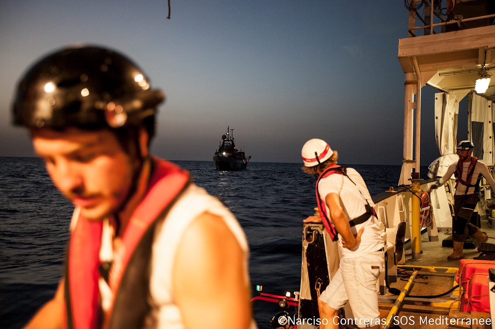
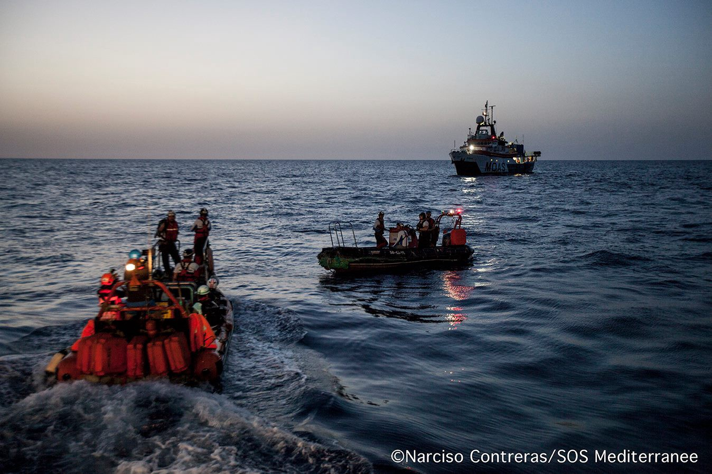
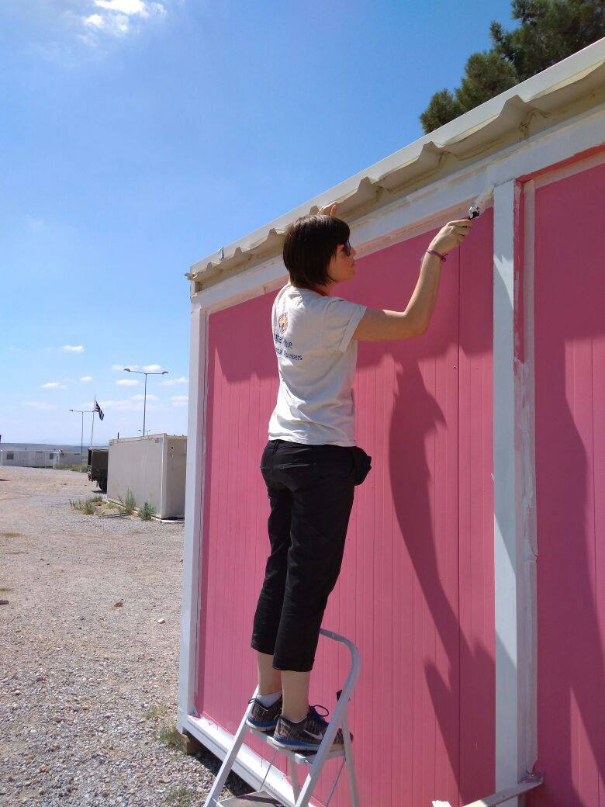
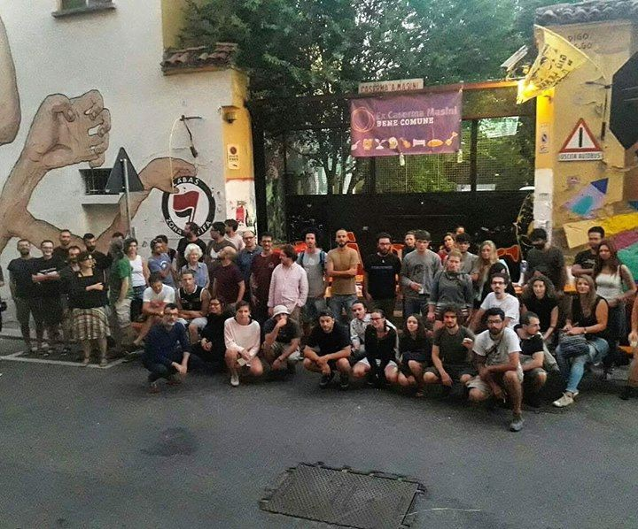
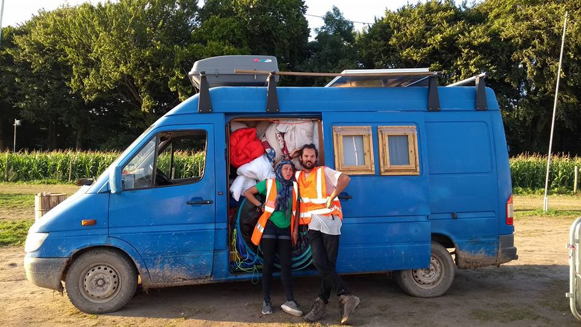
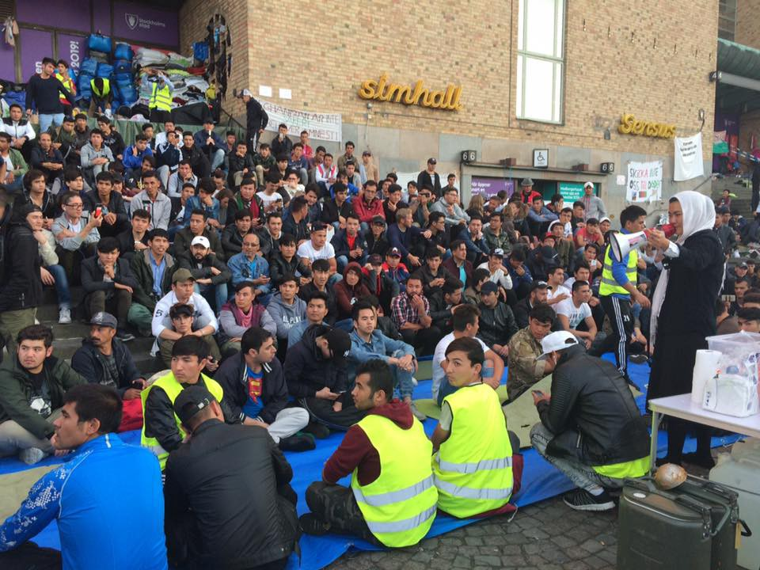

### AYS Daily Digest 16/08/17: Discussing “migrants health” with Libya, who aren’t really famous for providing it

_People saved in the Mediterranean by few remaining NGOs / Suicide bombers kills 28 people in Nigeria / Volunteers needed in Athens and Dunkirk / New project for women in Greece / Increase in arrivals to Spain / Deportation in Finland stopped / Stockholm sit\-in develops as schools starts again / And more news…_

 / by: Gary Waters](assets/866bf266cd80/1*6L2y-l-gIYhf0QF0zHF2jg.jpeg)

Photo: [Art Against](https://www.facebook.com/artagainstproject/) / by: Gary Waters
#### Feature

[IOM, UNHCR and the Libyan authorities yesterday met to discuss on the topic _“Migrants Health in Libya”_ \.](http://www.iom.int/news/libyan-authorities-meet-un-agencies-discuss-migrant-health) It was a part of a bigger project named _“Promoting health and wellbeing among migrants in Morocco, Egypt, Libya, Tunisia and Yemen\.”_ The project is funded by the Ministry of Foreign Affairs of Finland\.

Libya isn’t really famous for maintaining human rights, rather the opposite\. European countries on the other hand, are famous for doing all they can to run away from taking responsibility\. IOM, International Organization for Migration, is working closely with as well UNHCR and the European Union in questions regarding migration\. They are also working closely with the Libyan authorities in order to promote medical assistance and health interventions, the report says\. This includes activities in detention centers, main disembarkation point in Europe and as a part of voluntary \(which more are “voluntary”\) returns\.

[But, other information is also available](https://m.facebook.com/story.php?story_fbid=1665710826803851&id=976033399104934&hc_location=ufi) \. The Italian journalist Francesca Mannocchi recorded a video in February 2017, from one of the official detention centers in Libya\.

Besides these official centers, there are unofficial ones — run by militias where not even the Ministry have access\. Only in the capital Tripoli there is 13 unofficial ones, according to [Mannocchi](https://m.facebook.com/story.php?story_fbid=1665710826803851&id=976033399104934&hc_location=ufi) \. In the Libyan centers children and sick people are left without access to healthcare\. When the food is out, the food is out\. Stories from one of the official centers, Garian, tells about how 1400 people including 250 minors are held in containers that are locked around the clock\. In each container about 100 people lives\. There is not even enough space for them to lay down on the floor to get a proper rest\.

Officials from the Libyan government admits that they can not always provide with enough services to keep up the human dignity\. Still Mannocchi doesn’t wanna generalize, saying that there are both good and bad people among the guards\. Unfortunately, the good ones doesn’t have the means to do good\.

If it wasn’t for the suffering it causes it would almost be funny how far away political ambitions and statements are from the reality migrants coming to Italy are witnessing about\. [All of those meetings](http://www.iom.int/news/libyan-authorities-meet-un-agencies-discuss-migrant-health) , of the kind IOM, UNHCR and Libya just had, should be looked at with skepticism\. Instead of discussing the horrible conditions that no human should live in, IOM, UNHCR and Libyan authorities met to discuss how to better keep people in this country, rather than helping them to get away from there\. This is just serving the oppressors\.

#### Sea

[MOAS](https://twitter.com/moas_eu) saved 111 people, of whom 4 women and 9 children yesterday\. The [\#Aquarius](https://twitter.com/hashtag/Aquarius?src=hash) took them onboard after MOAS first rescued them with \#Phoenix\.

■■■■■■■■■■■■■■ 
> **[Paco Anselmi](https://twitter.com/pacoanselmi) @ Twitter Says:** 

> > 4 women and 9 children amongst the 111 people rescued by @[moas_eu](https://twitter.com/moas_eu) and about to be transferred on the #Aquarius https://t.co/atVGBzMvsi 

> **Tweeted at [2017-08-15 17:58:24](https://twitter.com/pacohansel84/status/897517849056509952).** 

■■■■■■■■■■■■■■ 

[SOS MEDITERRANEE France](https://www.facebook.com/sosmedfrance/) is also still out at the Mediterranean and at Aquarius\. According to them it was 112 people onboard and 11 children\. They took them to a safe Italian harbour where they finally could put their feets on the ground again\.

Photos: Narciso Contreras\.

[Defend Europe](https://www.facebook.com/throughrefugeeeyes/posts/584549911934783:0) is still out there with their ugly message, and [Through refugee eyes](https://www.facebook.com/throughrefugeeeyes/?hc_ref=ARRzctaPNAlobDC7qbQl-008sQRLh3b-Lha-Tia3TrcA9cLXq1Vkhthu7oHSnQTZeOE&fref=nf) that we’ve been following at AYS for a long time, replies with history in mind:

> “And we say:
 

> We never wanted to leave our beautiful houses, streets and families\. War happen and it happens 

> I want you to look back less than 100 years ago, did you want WW1 and WW2 to happen?” 

#### Nigeria

[28 people killed](http://m.france24.com/en/20170816-several-killed-suicide-bomings-nigeria-refugee-camp) and at least 82 people injured after a suicide bombing on Wednesday in the town Mandarari\. The attack was performed by three female suicide bombers, and after the first assailant blew herself up in the air panic broke out\. Soon after that the other two women triggered their explosives, which caused most of the damages\. In August alone approximately 72 people have been killed in northeast Nigeria according to unofficial toll based on media reports\. The terror network Boko Haram is present and has increased their presence this year, after the president Muhammadu Buhari was elected in 2015 and temporary managed to get the situation more under control\.
#### Greece

[**IMPORTANT INFO ABOUT PRO\-LONGING RESIDENCE PERMITS \(ADET\)**](http://asylo.gov.gr/en/wp-content/uploads/2017/08/RESIDENCE-PERMITS-RENEWAL-APPLICATION-NEW-EXTENDED-DEADLINE-5.9.17.pdf)

If you have been granted international protection and it expires by December 31st 2017, you have until the 5th of September to do so\.

The application should be emailed to [residencepermits@asylo\.gov\.gr](mailto:residencepermits@asylo.gov.gr) and here is the application form:

[Greek\.](http://asylo.gov.gr/?page_id=5193)

[English\.](http://asylo.gov.gr/en/?page_id=2498)

Here is also more info on the same topic and the extended deadline\.

■■■■■■■■■■■■■■ 
> **[Migration Greece Info](https://twitter.com/MigrationGrInfo) @ Twitter Says:** 

> > Residence permits' renewal application - New extended deadline September 5th, 2017: [asylo.gov.gr/en/?p=2725](http://asylo.gov.gr/en/?p=2725) 

> **Tweeted at [2017-08-16 14:37:23](https://twitter.com/greekasylum/status/897829646737313793).** 

■■■■■■■■■■■■■■ 

**No cash cards, no public transportation**

[RefuComm](https://www.facebook.com/refucomm/?ref=gs&hc_ref=ARTEheC_DSOY6OUOEigU8UwEIJagskkLH7GqQA10Mm8eVw1Dr7JWiYMAYR6gjbm8858&fref=gs&hc_location=group_member_profile) [is also reporting about the upcoming limitations in freedom of movement\.](https://www.facebook.com/story.php…) Refugees previously could access free public transportation in Greece by showing their cash cards, which they get as asylum seekers in the country\. But now that no longer will be an available service\. More info and details here\.

R [efucomm](https://needslist.co/refucomm) also updated with a new needslist\.

**Mainland**

In Athens, [Earth Refugee](https://www.facebook.com/EarthRefugee/?ref=gs&hc_ref=ARTLhsbTiflYo_uYMXaOw1q4iWqCMKgqlO_DhDi-4z05xcOg9iJZ0YlByaLd8vOMyuo&fref=gs&hc_location=group_member_profile) , are [looking for volunteers](https://www.facebook.com/groups/AthensVolunteersInformation/permalink/1182296988569263/?fref=gc&hc_location=ufi) \. To apply and come join them in Athens you have to be over 21 years old\. ALso you have to be able to stay for minimun three weeks, so the activities is run the best way possible and also feels safe for the people joining in\.

[Enjoy the application here\!](https://docs.google.com/forms/d/1pnz_KtBow355W3278P0SFYYfQ46mSqD_sREftyZGjBU/viewform?edit_requested=true)

**New project for women\!**

[InterVolve](https://www.facebook.com/InterVolve-219418945063168/?hc_ref=ARQk5KLaeECHo1S53v8rCSxGdQ-Xs2yNHXtmiYSI7onLRPjWLeoJXrVIkXE0pYmA0t4) [continues their activities in Koutsochero camp](https://m.facebook.com/story.php?story_fbid=495481947456865&id=219418945063168&fref=gc&hc_location=ufi) , and in this new project they especially focus on the camps women\! It is called The Pink House and will work as a free space for women to hang out and do what they like, just get a short while of the every day life in the camp for themselves\. The Pink House will both include a beauty saloon and a room where the women coming here can du what ever activities they like\.

If anyone wanna see the transformation that has been ongoing for several weeks, [check it out on facebook](https://m.facebook.com/story.php?story_fbid=495481947456865&id=219418945063168&fref=gc&hc_location=ufi) \.

](assets/866bf266cd80/1*dWgqUNmdsy0L7TuEINwqCQ.jpeg)

Photo: [InterVolve](https://www.facebook.com/InterVolve-219418945063168/?hc_ref=ARQk5KLaeECHo1S53v8rCSxGdQ-Xs2yNHXtmiYSI7onLRPjWLeoJXrVIkXE0pYmA0t4)

**Islands**

[Greek Reporter today](http://greece.greekreporter.com/2017/08/16/over-330-migrants-arrived-on-greek-islands-on-monday/?fref=gc) reported that more than 330 people arrived on Monday the 14th August, according to data compiled by the Ministry of the Interior’s National Border Control and Asylum Control Center\. This is a high number for only one day in Greece right now\. Let’s wait and see if this trend will continue, and what will happen on the already overcrowded islands if this would be the case\. In opposite many camps on the mainland are closing, begins to close or are hosting below capacity\. Politics and slow procedures is to blame for this, which creates a hard situation for everyone involved that seeks refuge from war, violence and other unpleasant living conditions\.

**Lesvos**

A boat with 37 people arrived safely to Mitilini today\.

**Volunteers needed**

Also in Lesvos, [Lighthouse Relief‏](https://twitter.com/LighthouseRR) needs assistance and more volunteers to join them\. Especially if more people will continue to arrive as Greek Reopter mentioned\. Find out more below\.

■■■■■■■■■■■■■■ 
> **[Lighthouse Relief](https://twitter.com/LighthouseRR) @ Twitter Says:** 

> > We need volunteers for our emergency relief efforts in #Lesvos! RT to help us find the right candidates &amp; apply: [lighthouserelief.org/volunteer](http://lighthouserelief.org/volunteer) https://t.co/G9eJUoPoH1 

> **Tweeted at [2017-08-16 17:29:38](https://twitter.com/lighthouserr/status/897872994156072960).** 

■■■■■■■■■■■■■■ 

**Chios**

If not something to celebrate, it is something to bring attention to: _International Day of the Disappeared_ on Wednesday the 30th of August\. It will begin at 5\.30 pm and everyone is welcome\. [More info in the event](https://www.facebook.com/events/1678511118885779/?ti=icl) that is hosted by [Refugee Biriyani & Bananas](https://www.facebook.com/RefugeeBiriyaniAndBananas/) \.

#### Spain

[The Spanish coastguard announced](https://l.facebook.com/l.php?u=http%3A%2F%2Fwww.courrierinternational.com%2Fdepeche%2Fmediterranee-600-migrants-secourus-en-un-jour-entre-maroc-et-espagne.afp.com.20170816.doc.rm1hl.xml%3Ffref%3Dgc&h=ATMERRTzhkqH69ZT5UA9qZmE4O8AiqGc0GyUQrupxPGZe7WAa3IR63UobJMJ3xO0SnFCHkwv2GpcWhwaRlUqavlfENrsNrSz5fO3l_P9xLZRw3-a_qdLGapsX337Ovdm7NV6gGgJBMjvC8k) on Wednesday it had rescued 339 people aboard seven makeshift boats in the waters of the Strait of Gibraltar between Morocco and Spain, a route more and more borrowed by migrants\.

_“A total of 339 people have been rescued, in seven canoes, between one and a half hours in the morning,”_ a relief spokeswoman said Wednesday at midday\.

Among the rescued migrants, all transferred to the coastal city of Tarifa, there were at least 19 minors and a baby, according to the first counts\. This new rising number could be a new trend, and according to IOM Spain could overtake the role as the country where the second largest number of migrants arrives in 2017, after Italy\.

Between January and July 2017, 7,642 migrants arrived in Spain by sea, against 2,763 during the same period in 2016\. As of 11th of August, this figure had risen to 8,385 migrants\. In addition, 121 died drowned trying to win Spain, against 128 for all the year 2016\.
#### **Italy**

No One is Illegal had arranged a summer camp for multinational volunteers to be held at Labas Bologna Italy from August 21st for two weeks, however it was raided last week by police and closed down\. Unfortunately, the summer camp is now cancelled\. The plan was to renovate a kitchen, classroom and other rooms to make it habitable for refugees, but also for Bologna’s homeless people\.

Photo: No one is Illegal, Italy

A public assembly will be held on August 30th and a big demonstration on 9th September aimed at taking Labas back and continue with the project\.

**Ventimiglia**

Tragic day in Ventimiglia, one refugee died\. More information available in Italian [here\.](https://l.facebook.com/l.php?u=http%3A%2F%2Fwww.sanremonews.it%2F2017%2F08%2F16%2Fmobile%2Fleggi-notizia%2Fargomenti%2Fcronaca%2Farticolo%2Fventimiglia-migrante-36enne-travolto-da-un-treno-francese-muore-nella-galleria-di-peglia.html%3Ffref%3Dgc&h=ATPNJmGWIvZuo3tCuzw1zls7WIOL42MSQXOO2zQnSN9qoKq39ileLBpCxEmY6UbEJVEToh9-XcAIrp_yMifjYM7XD1tkDMjX4h8i3GW_wrfeNE3PSdyujZ4iVj4OrEaEwq8Faxmu69kgHuE)

**South Italy**

The judge in the court in Bari, south Italy, decided to close a CIE\. A CIE is a place that works with identification of migrants\. [More info available in Italian here\.](http://www.meltingpot.org/Trattamenti-inumani-e-degradanti-nel-CIE-di-Bari-Il-Giudice.html#.WZSX78ekzq0)
#### France

[Volunteers needed](https://www.facebook.com/groups/1287497308029047/permalink/1291047414340703/) in Dunkirk\! Get in touch with [Dunkirk Refugee Ground Support Network](https://www.facebook.com/groups/1287497308029047/) if you wanna join them\.

](assets/866bf266cd80/1*bJwJqcUHvjBZHRKoO6XQlw.jpeg)

Photo: [Isis Aurora Mera](https://www.facebook.com/isis.mera?fref=gs&hc_ref=ARRSG_w0eylQXv6CBsydztvLhJESUcycc7rry607uyhAXG0gjLBb3uocUrO_pQTpRSo&hc_location=group_member_profile)
#### UK

[FWRD — Festival Waste Reclamation and Distribution](https://www.facebook.com/fwrdtogether/?ref=gs&hc_ref=ARSh3H3Y-onoq5dkWRPBejBjDQEAzFdf_vXoAVRnpHAxCsOrJSYF0B7r9CjOwmpe6wA&fref=gs&hc_location=group_member_profile) is coming with an update\. If you have time over, are in U\.K\. and wanna help the following weeks, [here is a message](https://www.facebook.com/groups/1652972374920129/?multi_permalinks=1891202691097095&notif_t=group_activity&notif_id=1502894395417806) \. [Help Refugees](http://Help Refugees) are involved and many people will benefit from the efforts:

_“Huuuuuuuge thank you to everyone involved in the [Boomtown Fair](https://www.facebook.com/boomtownofficial/?ref=gs&fref=gs&hc_location=group_member_profile) salvage\! The total haul includes over 1000 sleeping bags, 270 roll mats, 200 tents, and plenty ofother bits and bobs to be sent to the amazing [Help Refugees](https://www.facebook.com/HelpRefugeesUK/?ref=gs&fref=gs&hc_location=group_member_profile) and to the homeless population of Milton Keynes\. Special thanks to the festival management for being so on board with what we were doing and letting us come and do our thing, and to Paul from Yes Tents for providing us with the temporary storage on site — we couldn’t have done it without you\! And of course to the fantastic team of volunteers who donated so much of their time and effort to help people in need — you guys are inspirational\._

_We’ve got a busy couple of weeks coming up with the V Festival Chelmsford salvage from next Monday and the Leeds and Reading salvages the week after so we’re in need of volunteers — get in touch to lend a hand\!_

_Much love,_

_The FWRD team xxx””_

](assets/866bf266cd80/1*i6KhQrQdNrVQ8vXFxbUN5g.jpeg)

Photo: [FWRD — Festival Waste Reclamation and Distribution](https://www.facebook.com/fwrdtogether/)
#### Finland

Yesterday a deportation from Finland to Iraq was stopped due to resistance from fellow passengers\. As the film at [Stop Deportations](https://www.facebook.com/SeisKarkotuksille/?hc_ref=ARSNEsvUfQkIS8ga5UoTkU5eXEmM2cw53gEKZuAiTQ9IIuYgf34Ax78oxvaumbetc6I&fref=nf) fb\-page shows, violence was involved\. People questioned what was going on, “why are you doing this?” someone in the video says\.

#### Sweden

Heléne Fritzon, the new Swedish Migration Minister, have had an intense start at her new job\. She shortly visited the youths at Medborgarplatsen last Thursday, but still she has not changed her mind\. In the [Swedish Radio](http://sverigesradio.se/sida/artikel.aspx?programid=1650&artikel=6757118) this morning she, Jan Björklund \(the liberal partys leader\) and Fredrik Beijer \(chief of law at the Migration Agency\) was in a debate about the ongoing protest and the infected issue concerning deportations to Afghanistan\.

The Migration Agency will in a near future, still not clear exactly when, do a new evaluation about the security in Afghanistan\. However, it is still individual assesments thet will decide if someone gets to stay\. Amnesty, or stop of all deportations to Afghanistan, is not likely\.

Still the opions are divided, some say that it isn not safe enough to deport people to Afghanistan\. Some say it is\. But still none of the politicians in the radio spot, social democrats as well as liberals, express a positive opinion about amnesty for Afghan youths\.

**Meeting at Medborgarplatsen about the protests**

At 8 pm this evening Fatemeh Khavari, held a meeting with information about the next step in the sit in\. It wasn’t for press in first hand but mainly for those withing to both continue protesting and continue attending school, since they all want a future and are aware about how important school is for that\. The topic tonight was guidelines for doing so, among other things, one of the guidelines is to sit down at the floor during breaks\.

Fatemeh has everyones attention when she speaks to the crowd in the megaphone\. Photo: AYS

**Support in nearby towns**

Tomorrow the 17th August [Refugees Welcome Uppsala](https://www.facebook.com/Refugees-Welcome-Uppsala-681674231968647/) will host a demonstration in Uppsala, nine miles north of Stockholm, in support with the people that now have been protesting in Stockholm We do hope that Fatemeh Khavari was right at the press conference yesterday afternoon: this will not stop, and it will be one of the biggest protest in modern times\. Teenthousands of young people lifes and futures depends on it\.

If anyone is interested, here is the event:

[Stöddemonstration för de sittstrejkande ungdomarna i Stockholm\!](https://www.facebook.com/events/858195637667443/?acontext=%7B%22action_history%22%3A%22%5B%7B%5C%22surface%5C%22%3A%5C%22page%5C%22%2C%5C%22mechanism%5C%22%3A%5C%22page_upcoming_events_card%5C%22%2C%5C%22extra_data%5C%22%3A%5B%5D%7D%5D%22%2C%22has_source%22%3Atrue%7D)

_We strive to echo correct news from the ground, through collaboration and fairness, so let us know if something you read here is not right\._

_Anything you want to share — contact us on Facebook or write to:areyousyrious@gmail\.com_

_Converted [Medium Post](https://areyousyrious.medium.com/ays-daily-digest-16-08-17-discussing-migrants-health-with-libya-who-arent-really-famous-for-866bf266cd80) by [ZMediumToMarkdown](https://github.com/ZhgChgLi/ZMediumToMarkdown)._
