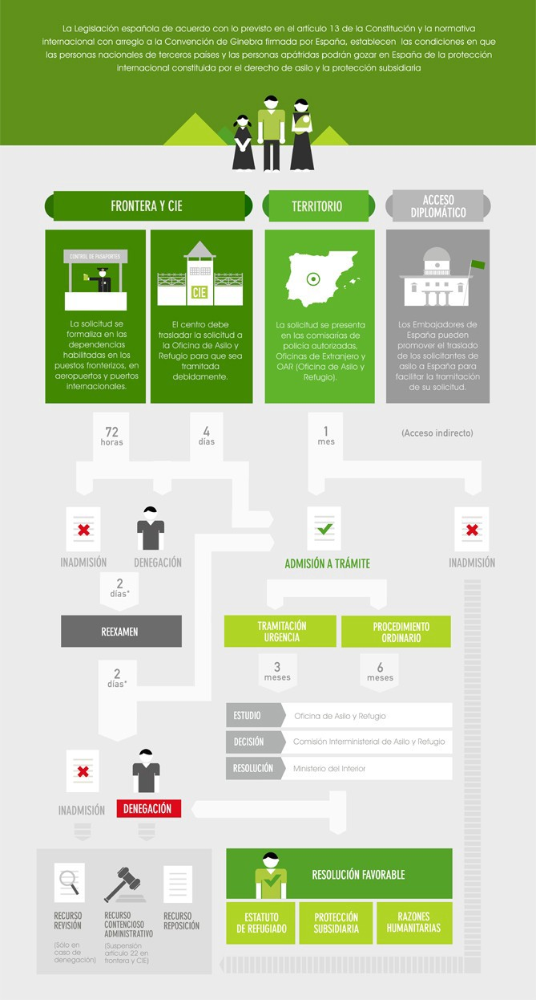
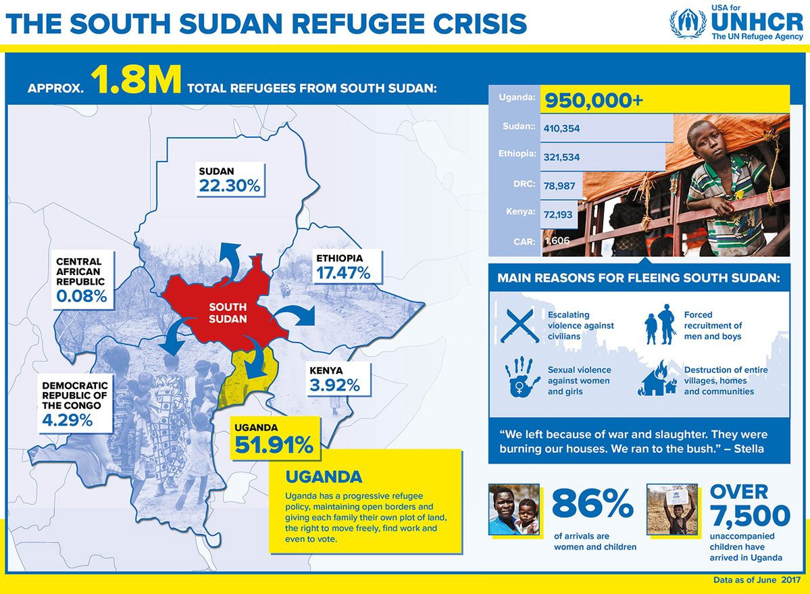
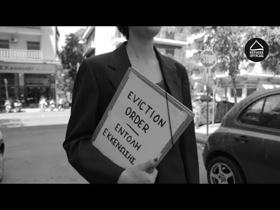

### AYS Daily Digest 17/08/17: New old route — Spain

_One million refugees in Uganda / Rescue continues in the Mediterranean / More arrivals and protests in Greece / Portable toilets and water finally installed in Calais / Death threats to activists in Spain / Solidarity music around the world / More soldiers on the EU borders / Volunteers opportunities / And more news…_

](assets/8b1149847fd5/1*Gyt6LDxPfdLJmorFOA0WxA.jpeg)

Photo by [**Sea\-Eye**](https://www.facebook.com/seaeyeorg/)
### Feature

Spanish coastguards rescued 599 people from 15 boats and a jet ski on Wednesday in the waters between Morocco and Spain, a large number for the daily average in this country\. At least 35 minors, including a baby, were among the refugees rescued crossing the Strait of Gibraltar and the Alboran Sea as they fled unrest or poverty in their countries\.

](assets/8b1149847fd5/1*jQMIS88CfmC11nmDUmCmdA.jpeg)

Photo by [**SALVAMENTO MARÍTIMO**](https://twitter.com/salvamentogob)

This high number of arrivals is already taking officials to predict that Spain could overtake Greece this year in the number of migrants arriving by sea as the International Organization for Migration \(IOM\) said last Thursday\. According to this organisation’s figures, until August 6th, close to 8,200 migrants had arrived in Spain so far this year which is more than triple the number recorded at the same time last year and already more than the total arrivals in 2016\. These numbers are still way lower comparing to the ones in Italy where more than 96,400 migrants have landed so far this year but are catching up with Greece where 11,713 arrived from boats in the same timeframe, says The Local\.

It’s thought that the main reason for this route to be getting more popular now is because it’s considerably safer than than the one through and from Libya where we have seen over and over again a complete disregard from human rights and a huge number of deaths at sea along its coast\. Refugees have to cross the Sahara desert and crucially the country itself, wracked by chaos as rival militias and administrations seek to control the oil\-rich country so facing all the dangers many may be deciding to go up along the African coast instead\.

The sea crossing crossing strategy seems to be different here as well since in Libya there “appears to be a very deliberate strategy to put people out there, in overloaded boats that begin to take on water almost immediately and then it’s a race to see how quickly the people on the boat can summon aid, whereas in Spain, the strategy is smaller craft hoping to come in undetected, and undoubtedly some do\.” said Joel Millman, a senior IOM spokesman\.

The Spanish Red Cross has been monitoring the situation and has now said the organisation had reinforced the number of people working on the coast in southern Andalusia and in Ceuta to help the refugees when they arrive to the shores\.

> “Some people arrive with little strength left, sometimes they got lost, lost the engine, don’t have anything to eat or drink in the boat, some have sunburns or burns from the petrol\. And others are fine and recover quickly” 

Apart from all these new arrivals there are also land arrivals coming into Ceuta and Melilla, the two Spanish territories in northern Morocco where another 3,500 have managed to cross in several attempts as we have been reporting in the past weeks, especially through Ceuta\. Facing this high number of recent entry attempts, authorities in Ceuta have decided to close the border for trade for over a week, to allow guards to better man the fence\.

UNHCR has also commented on the subject and warned today that Spain lacks the resources and capacity to protect the rising number of refugees and migrants reaching it by sea\. María Jesús Vega, a spokeswoman for UNHCR Spain told The Guardian that police were badly under\-resourced and there was a lack of interpreters and a shortage of accommodation for the new arrivals\.

> “The state isn’t prepared and there aren’t even the resources and the means to deal with the usual flow of people arriving by sea” 

UNHCR figures show that most of those arriving in Spain by sea set out from Morocco, although some also embark from Algeria\. The majority of the migrants are from Cameroon, Guinea and the Gambia\. They are then placed in the CIE \(Centro de Internamiento de Extrangeros\), a migrant reception centres, where they can apply for asylum\. We have seen protests in these centres in the past where many refugees stay detained\. According to the official version everyone’s process should be dealt with fairly and equally following the same procedure\.

credits — CEAR

Nevertheless, according to [Spanish Commission of Help for Refugees \(CEAR\)](https://www.cear.es/) , many times this is not the case since these centres are not all equal and for example don’t offer permanent medical services and and creates problems in processing the international protection petitions that is not guaranteed\. They go further saying that the inequality of criteria and the terrible internship conditions of some of these institutions mean that they should be terminated\.
### South Sudan

The United Nations said today that number of South Sudanese refugees in Uganda hit one million as hundreds of desperate families pour across the border every day seeking a haven from the civil war\. Women and children make up more than 85 percent of the arrivals\.

No one knows how many have died, but an August report by South Africa\-based South Sudan Human Rights Observatory said 987 civilians were killed in violence across South Sudan between May and July, mostly by government forces\.

In Uganda, South Sudanese refugees receive hot meals, vaccinations, and plots of land\. All can enter and they are free to travel and work in Uganda, policies that have drawn praise from aid groups\.

“The government response to accepting the South Sudanese refugees has been overwhelmingly positive, progressive, and welcoming,” said Sacha Manov, deputy director in Uganda for the International Rescue Committee, which provides health and protection services for refugees\.

But refugee agency UNHCR said Uganda was struggling to provide food and shelter\.

Donor nations have not given enough, with the U\.N\. agency having received just about 21 percent of the $674 million needed for South Sudanese refugees in Uganda in 2017, its spokesman said\. In May, a cash crunch forced the U\.N\. to slash food rations in half, to 6 kg \(13 lb\) of maize\. They have since been restored but funding remains tenuous\.

It’s unbelievable that some European countries insist on deporting refugees back to this kind of conditions\.
### Sea

In the meanwhile, the refugees crisis in central Mediterranean continues and [**SAR watch MED‏**](https://twitter.com/SARwatchMED) has reported today that 235 people were rescued by MOAS boat, Phoenix and were transferred this morning to Golfo Azurro in coordination with the Italian Coast Guard\.

](assets/8b1149847fd5/1*fMYa9duke5GgRJalth5FMw.jpeg)

Photo by [**MOAS**](https://twitter.com/moas_eu)

One of the youngest passengers yet was also rescued today, little Sayid, just 26 days old\.

](assets/8b1149847fd5/1*Dq9_YU2TiPfGmqE7k4P4vw.jpeg)

Photo by [**MOAS**](https://twitter.com/moas_eu)
### Greece

A steady flow of refugees continues to arrive on the Greek islands from Turkey but also through the land border in the west where hundreds have been intercepted while attempting to continue their journeys further into Europe\. ekathimerini reports today also that in the first seven months of this year, authorities intercepted more than 400 undocumented migrants trying to reach Italy aboard ferries from the Peloponnese and the Ionian island of Zakynthos and at the same time, more than 30 refugees have been stopped at the airports of Kalamata, Aktion, near Preveza, and Araxos, near Patra\. These movements have been constant since the closed borders policy gives many people no other chance than try to use smugglers and try a dangerous trip to western Europe\.

In the last few days refugees have continued to arrive in big numbers and on the 14th, one boat arrived on Samos with 57 people\. Yesterday one boat arrived on lesvos 37 people on board\. Again, **today** , volunteers report the arrival of a boat to Samos with **47 refugees** on board and another boat is being reported to arrive on the island of Zakinthos with **150 people** on board\. Another **46 refugees** were rescued close to Kastelorizo island by the Greek Coast Guard, with the help of a FRONTEX ship\. Among the refugees was a woman in advanced pregnancy, who gave birth a little later in the Kastellorizo ​​clinic\.
#### Mainland

The Squat at Themistokleous 58 was reportedly attacked last night by by people wearing helmets\. This was a mafia style attack which resulted in 4 injured in serious condition who are now hospitalized\. You can read more about the incident [here](https://enoughisenough14.org/2017/08/17/athens-refugeesgr-themistokleous-58-squat-attacked/) \.

A group of refugees protested today in Diavata camp against the bringing of more refugees from the islands to the camp\. The protest began when it was announced that another 27 people would arrive from the islands to be hosted in the structure as some people don’t agree in sharing their containers with strangers\. The protests were told to be peaceful and consisted on a sit\-in\.

Having to deal with the continuous threat of eviction, City Plaza has published today a statement and a video showing they stand strong but still need everyone’s support to continue sheltering hundreds of refugees in Athens\. They ask anyone interested to send them messages of support, sign their future announcement and share their video\.

> After one and a half years we are still here, since the very first day we are an example of how Europe could host refugees in another way\. And we want to keep being this example\.
 

> “We want to stay the home we are for people and we want to stay a center of struggle, involved in many different struggles for rights and dignity\. 

> From the beginning on it was clear that we would be a thorn in the side of the government, but that never stopped us\. To keep on doing what we are doing, we need now your support and solidarity — in a period where the government is increasing the pressure on City Plaza and all other squats in Athens\. 

#### Volunteer opportunities

[Dentists 4 All](https://www.facebook.com/dentists4all/?fref=mentions) run regular programs for children in Skaramangkas, Eleonas, and a program for adults in Sounio\(Lavrio\) camps in Greece\. They’ve now treated over 6,000 teeth but they need volunteers and support to keep it running\. If you are or know a dentist who wants to help, please get in touch\. You can also support this project donating [here](http://bit.ly/HelpRefugeesDonate) \.

](assets/8b1149847fd5/1*d6xNi1T2IhD-hYRoIQD5Ww.jpeg)

Photo by [**Help Refugees**](https://www.facebook.com/HelpRefugeesUK/?hc_ref=ARRAJHMMBRtdaqXTYjBnZdPtrEBcS3Eimf6N9SJ-MfCYCLcSQkupzbgX1Ge4jcb2rGo&fref=nf)

[**Lighthouse Relief**](https://www.facebook.com/lighthouserelief/?hc_ref=ARRTW8X4d6tN2a--4RHu5BkHD5_ZdQBvmaY5AFmUbb_dWLN7J0VRRU4izgoDqdAgmWY&fref=nf) still needs volunteers at the forefront to facilitate safe boat landings on the north shore of Lesvos, which continues to see high numbers of new arrivals each week\. Their hard work has already saved countless lives but they need more people to continue\. Please get in touch if you can help of know somebody who can\.

[**ATLAS \(Aid To LGBTQ Asylum Seekers\)**](https://www.facebook.com/groups/atlasLGBTQ/?ref=group_header) is looking for an Urdu speaking volunteer for help with translation, both spoken and written, including visiting detainees and assisting with their cases and wellbeing\. ATLAS is based in Athens and would prefer a long\-term volunteer in Athens, although some work could be done remotely via Skype\. Please get in touch if you have the skills\.
### Bulgaria

According to the State Agency for Refugees, a total of 561 foreign citizens have been granted refugee status by Bulgaria’s State between January 1 and July 31 2017\. A further 683 people were given humanitarian status by Bulgaria’s authorities\. So far in 2017 a total of 2462 foreign citizens have had their applications for refugee status refused\. The agency’s figures show a drastic decline in the number of people seeking protection in Bulgaria in comparison with a few years ago though, since in 2014, refugee status was given to 5162 people and the number dropped to 4708 in 2015\.
### Serbia

The image of Serbian president Vucic promising citizenship to the family of 10\-year old Farhad Nouri, a refugee from Afghanistan currently residing in Serbia, has been spread widely in the media\. However, it is hard not to feel discomfort by the fact that a 10\-year old child is being used for political propaganda by a person who, among his many misdeeds, holds significant political responsibility for inhumane living conditions of refugees in Serbia\. Since yesterday evening, Serbian NGO’s have been pressured to publish and share photos of Vucic with a refugee kid on FB and their web sites\. Several volunteers and aid workers told us that representatives of authorities explicitly told them to share the photo if they want to stay on good terms with them\. All of this while ignoring the fact that the president doesn’t have any legal authority to grant asylum or citizenship to anyone in Serbia\. We deliberately won’t publish the said photo in this text\.
### France

Authorities set up on Wednesday portable toilets and water taps on a road near the northern port of Calais after losing a challenge to a court order to provide sanitation for migrants\. **Ten portable toilets** and a bank of **five taps** were installed outside a centre run by the charity Secours Catholique a few kilometres from the centre of the northern port\. Local authorities said more sanitation facilities were planned at another location outside the town\. This is a great victory for everyone that fought for these minimum facilities to be made available but mainly for the hundreds of refugees that have been living without them for so long\.

The Refugee Women’s Mobile Centre van\(from [**Dunkirk / Dunkerque Refugee Women’s Centre**](https://www.facebook.com/refugeewomenscentre/?ref=gs&hc_ref=ARST_KxCXs4tZSwYjUd_7_Bg0j-vuC-TBQLagwePPrhlGqefMzqLe7xzGqn4NS_R2Ig&fref=gs&hc_location=group_member_profile) **\)** has now been functioning on the ground for almost a month\!

> We are happy to announce we have been able to offer women, children and families a touch of respite, running activities such as English lessons, doing henna, providing colouring books for children and giving space for women to gather, breathe, and crucially, drink tea together\! The children were gleeful at the chance to paint and colour — simple activities which have been beyond their reach\. 

The van not only allows volunteers to continue to distribute supplies, but equally importantly, that the Women’s Centre is able to offer a focused point for women to relax and socialise for the first time since the camp closure in April\. The Women’s Centre van is currently offering support 4 days a week in the Dunkirk Jungle, and an extra 1 day a week in Calais, where it has become a vital resource for the distribution of supplies to women and families since the ban on assisting refugees was lifted\.

Nevertheless there are still many challenges and the conditions remain very poor\. The heavy rain during Monday night’s storm exposed the harsh reality of living without any real shelter or protection\. Tents, blankets and possessions were soaked through\. This is a well\-timed reminder that summer is drawing to a close with the colder and more unpredictable weather of Autumn to come\.So tents & sleeping bags are specially needed\! There is also a link to full list of donations attached with details of when and where to deliver [here](https://docs.wixstatic.com/…/7942f5_98b21d25d72d4faab147132…) \. To support the group financially please follow the link [here](https://www.dunkirkrefugeewomenscentre.com/donate) \.

The Locker room also needs volunteers in Paris \(Solidarités St\. Bernard de la Chapelle, 12, rue st\. Bruno 75018 Paris / angle rue St\. Luc\. \) to sort clothe tomorrow Friday 18 August from 15 pm and for the distribution of clothes on Saturday and Sunday from 9 PM\.
Note on the list by SMS at 0603028372 or contact them also [here](http://Pedro Pablo Naranjo) \.
### Spain

A Spanish activist received death threats last Tuesday after criticizing the police operations in Ceuta, the Spanish enclave in Africa\. “I suggest silence or you will die\. You are disturbing the authorities”\. This message was sent with a picture of a gun and a bullet, directed to Helena Maleno, a member of the NGO Caminando Fronteras\. When many refugees managed to enter the Ceuta enclave, also reported by AYS, some policemen tried to stop them by kicking them and at least a policeman got injured in the process\. This threats came after the activist criticized the police behavior\. Unfortunately this has not been the first time activists receive hate spam that is very common on their Twitter accounts\.
### Denmark

The country will join other 60 around the world in a global music event in support of the international refugee crisis\. The charity concerts, called ‘Give a Home’, will take place in over 200 cities across the world on September 20th as part of a collaboration between Sofar Sounds and Amnesty international that aims to raise awareness for the more than 20 million displaced refugees across the world\. The concerts will not be held in usual music venues, but will rely on the kindness of strangers to offer their own private sitting rooms for hosting\.

“Give a Home aligns Amnesty International and Sofar’s vision of a global community united by the things that really matter, in the same way that Sofar unites thousands of people all around the world every day through a shared love of music,” said Rafe Offer, co\-CEO of Sofar Sounds

Sofar Sounds and Amnesty International have announced many world\-renowned artists who will be playing for free across the globe but the company’s policy is to keep the venues secret\. The concerts in Denmark are all free and require attendees to simply sign up online and donate whatever amount they can afford to help continue the concerts\.
### Sweden

The media attention surrounding the protests at Medborgarplatsen continues\. The protests is about deportations to Afghanistan and have been ongoing since Sunday the 6th of August\. Tonight at 10 pm SVT Opinion \(a debate\) will be held live from the site\. Fatemeh Khavari, spokesperson for the fb\-initiative Ung i Sverige, is among the participants and will be interviewed\. SVT is Swedish public service and one of the most watched local channels\. Refugees Welcome Stockholm, a local NGO supporting the protests, encourage everyone that has the possibility to come and show their support\.
### EU

Two United Nations Human Rights experts have expressed serious concern over a new European Commission policy on Mediterranean Sea rescues which consists on a new plan of action that apart from making rescuing NGOs sign a code of conduct that aims to stop privately\-operated ships ferrying refugees to safety in Italy from waters off the Libyan coast, they fear is also trying to move Europe’s borders to Libya\. They highlighted that, under international law, migrants should be allowed to disembark at the nearest port where their lives and freedom would not be threatened, and should then receive information, care and equitable processing of their asylum claims\. You can read the full publication [here](http://www.ohchr.org/EN/NewsEvents/Pages/DisplayNews.aspx?NewsID=21978&LangID=E) \.

Austria is sending more troops to patrol the border with Italy while Bulgaria has said the EU should “defend” its borders by “force of arms”\. Austria estimates that between 700–1000 refugees cross from Italy every month so they sent an extra 70 soldiers to the Brenner Pass for extra control\. As for Bulgaria they are a bit more radical and said they would send 600 600 soldiers to stop people crossing from Turkey\. Krassimir Karakachanov, its defence minister said that this would include “ **highly specialised combat groups** ” and said more\. \. “We cannot allow illegal migrants to come to Europe in large numbers,” he said, adding: “We should deploy Nato or EU forces in Italy and Greece and defend the external borders of the European Union by force of arms”\. How some people continue to think and say these things out loud really makes you think how much education the world still needs to achieve peace\.

Other countries have also seen an increase of arrivals like Romania that had 5 times more irregular crossings than last year and arrested 1400 refugees in the country including a boat carrying 69 Iraqi refugees in the Black Sea last weekend\.

> _We strive to echo correct news from the ground, through collaboration and fairness, so let us know if something you read here is not right\._ 

> _Anything you want to share — contact us on Facebook or write to:areyousyrious@gmail\.com_ 

_Converted [Medium Post](https://areyousyrious.medium.com/ays-daily-digest-17-08-17-new-old-route-spain-8b1149847fd5) by [ZMediumToMarkdown](https://github.com/ZhgChgLi/ZMediumToMarkdown)._
