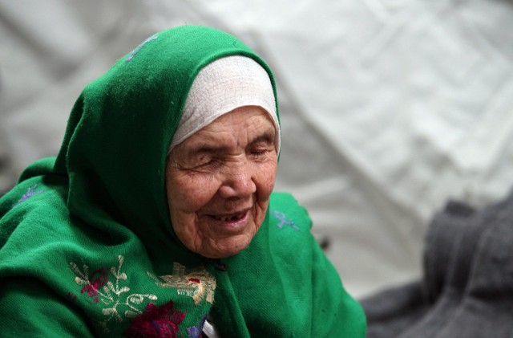
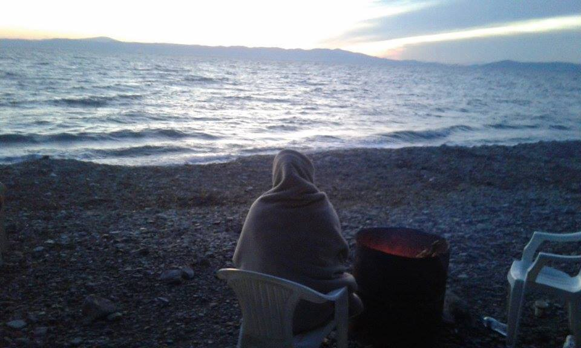
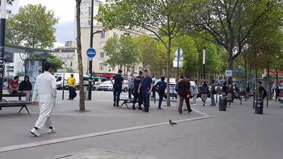
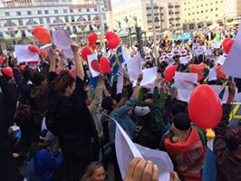
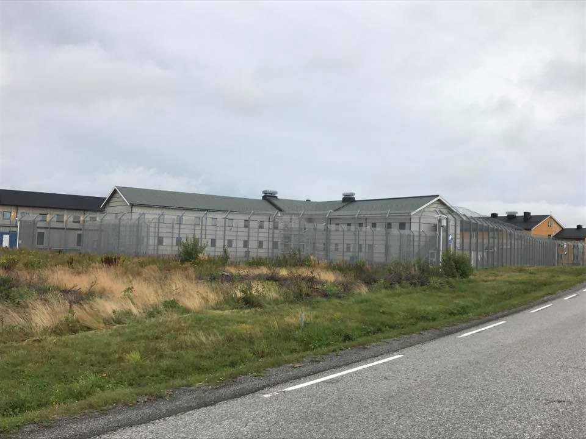

### AYS Daily Digest 19/08/2017: Sweden — no country for old people\!?

_Government in Sweden to deport 106\-year\-old woman to Afghanistan / Over 300 new arrivals to Greece / Love from Medborgarplatsen / The healthcare situation in Croatia disastrous / Deportations from Norway to Afghanistan / And more news…_

](assets/937ef7669a49/1*myIMUl0FMfZafPKaAXV3tQ.jpeg)

Photo by [Ung i Sverige](https://www.facebook.com/ungisverige.nu/)
### Feature

The decission that Bibihal Uzbeki, a 106\-year\-old lady who was forced to leave her home, will be deported back to Afghanistan — together with 11 members of her family — is beyond cruel\. While Sweden government brags about its openness and respect for human rights, they are not ready to offer shelter to somebody like Bibihal\.

After she heard the news about the deportation, Bibihal suffered a stroke and became unresponsive\. According to her family, she now sleeps all day and spends the nights talking to herself in her temporary home in Hova, Gullspång\.

Photo Marjan Vucetic/AP

“Previously she could walk around by herself and she was speaking to us,” her son, Mohammedullah Uzbeki, told the local reporter from Blank Spots\. He is worried that she can neither manage the journey back nor survive in Afghanistan\.

The entire family escaped from the city of Kunduz in 2015, after the Taliban attacked the region\. In 2015, they went on a dangerous journey, like many people from Afghanistan, over the mountains and the sea, and on foot through the biggest part of the Balkans to be able to continue to Sweden\. Bibihal’s son and grandchildren took turns carrying her on their backs as far as Germany, when they got a wheelchair\.

It took them 20 days to arrive in Europe\.

The young kids in the family have already learned Swedish, and their parents wanted them to have a future in this country, hoping for the best for their family\. In 2015, when the family arrived in Sweden, the media were writing about Bibihal as the oldest refugee in the world\. “We had problems many times\. I suffered a lot,” she told [The Guardian](https://www.theguardian.com/world/2015/oct/27/centenarian-refugee-reaches-croatian-camp) \. “I fell and injured my head\. I have scars on my head\.”

Nevertheless, their application for asylum was rejected in June this year and now they are facing deportation\. According to the Migration Agency’s decision, Bibihal must return to Afghanistan, or “to any other country willing to take her in”, which makes this decision even crueler\. As if she was not a human being\.

According to the UNHCR, older people make up some 8\.5 per cent of the overall refugee population, the majority of them women\. Nevertheless, this is a group hardly anybody speaks about or takes care of\. In camps, there are no programs for them, health care is limited, and they are often abandoned and depend only on family members\.

At the same time, this is the population that is most reluctant to leave their homes, and when they do so, it means that no other choice was left to them\.

So far, neither the UNHCR nor any of the other big organizations taking care of refugees have reacted to this ridiculous decision by the Swedish migration authorities\.

We hope that granny Uzbeki will spend her last days in peace, where she wants to be, close to her family\.
### Greece

Eight boats arrived in Greece over the last **48** hours bringing over **362** people\. Additionally, late on Saturday evening, 51 new arrivals \(20 children \+ 31 adults\), were registered by the costguard on Chios\. What was strange was that this boat landed on Samos in the morning and they brought the people to Chios becsuse the situation on Samos is much worse \.

While people are arriving on overcrowded islands, where the most reliable help is offered — again — by volunteers, UNHCR officials went to the island of Crete, where there are hardly any refugees, “to assess the situation”\. As the local media report, the UNHCR representative in Greece, Philip Leclerc, went to Crete on Friday and is expected to stay until Monday “to evaluate the progress of a state\-backed program to accommodate refugees whose asylum applications have been accepted”, the local media report\. Others call this type of travel a short holiday, but in UNHCR language it is “assessment of the situation”\.

According to the official data, a total of **1,421** people have arrived on the islands of the eastern Aegean so far this month\. More than **14,000** migrants are currently in facilities on the islands, a third of them on Lesvos\.

Photo by No Border Kitchen Lesvos

[No Border Kitchen Lesvos](https://www.facebook.com/NBKLesvos/?hc_ref=ARRfINv4wF4pVp8H8ODxoFARGyikUy21HEDePCQhHuuzqB5zUTtcaDVirWKtNu2Cm0Y) needs help in order to be able to help people and provide the only decent meal many have on this island\. In their post of today, they remind us that people are still arriving every day, while the camp is far over capacity\.

_“We never see most of the new arrivals — those who survive the crossing are left sitting in prison vans overnight and then ferried straight into Moria prison camp\. People from “problem nations” are subjected to a fast\-track deportation process intended to “process” their asylum claims, immediately refuse them, and dump them back in the suffering they fled before they can draw breath\._

_Sometimes we do make contact with new arrivals, arriving in squats or flats in the city\. One man who just made it over from Turkey — after being illegally pushed back three times by the Turkish coastguard — joked he was going to get a tattoo of the EU flag, he was so excited to have made it here\._

_How could we tell him what awaits him? That the EU condemns the thousands of refugees here to months on months of uncertainty, malnourishment, and violence in inhumane conditions? That the EU consistently ignores its own conventions on human rights and the rights of refugees? That his case will be handled with contempt and disdain, and that the border regime will do everything in its power to dehumanize him, then push him back once more?”_
### Call for volunteers

[Refugee Info Bu](https://www.facebook.com/RefugeeInfoBus/?hc_ref=ARSMsZniiUsyImiBk8NV_lIIamnQ_9EMcdA2raFBVTsdvD-jgpa4elM9BtdwpXwDT9A) s needs volunteers in Athens between the 24th of August and the 3rd of September\.

_“Do you also have a drivers’ license that is recognized by the European Union? Please get in touch as we would love to work with you\. Our Refugee Info Bus team is missing their driving member as they are going on a short holiday — and we need to keep going to visit all the camps that we visit each week on the mainland\.”_

There is interesting and important new research by RefuComm\. Their dedicated team interviewed 100 refugees on Chios, confirming that there is an enormous and pressing need for information\. “100% of the refugees who were involved in the research told us they don’t get any information at all about their rights and the procedures for gaining a successful outcome\. This has had and continues to have disastrous consequences\. We are making it too easy for people to be rejected\. Our research showed that they don’t have the most basic information\.”

RefuCom is offering a possible solution to overcome this problem — ‘chatbot’, “a cutting edge but simple way for people to be able to ask specific questions about their particular situation without having to research lots of information that doesn’t apply to them\.” [See their latest post where you will find more info about this](https://medium.com/@sharonvaleriesilvey/the-refugee-crisis-in-europe-83a1b869fe17) \.
### Croatia

In Zagreb reception center Porin people are suffering from scabies, including at least two children\. In three more cases there is suspicion of pulmonary TBC\. Local general practitioners are present in the center, but obviously, it is not enough, while the Doctors of the World \(Medicins du Monde\), who were the only healthcare service in Porin for a long time, left at the beginning of August due to the cessation of funds\. It is an understatment to say that the healthcare situation is disastrous\.
### Serbia

[Help us to help our friend to help our friends s in Sid](https://www.justgiving.com/crowdfunding/joo-pequeno?utm_source=Facebook&utm_medium=Yimbyprojectpage&utm_content=joo-pequeno&utm_campaign=projectpage-share-owner&utm_term=KvX4mRVBy) , and thank them for all they have been doing there for months now\. Many people need their help\. They prepare food for over 150 people every day\. And much more\.

_“No Name Kitchen is a small NGO formed by independent volunteers whom I have had the opportunity to work with\. Since their formation in Belgrade last winter they started cooking a hot meal a day for the hundreds of refugees living in an abandoned warehouse\. The warehouse has since been demolished and they have now moved their kitchen to the border town of Sid, next to the border with Croatia\. They continue to serve hot food to the few hundred refugees living there, often providing their only source of nutrition\.”_
### France

Police continue to prevent people from staying in the makeshift camp at Porte de la Chapelle\. They even force people to leave from the nearby benches\. However, there are between 50–100 people who are there and volunteers who are trying to help them\.

Photo AYS
### Belgium

Several Brussels associations and citizens’ collectives, with support from the Citizens’ Platform for the Support of Refugees in Brussels, distributed almost 400 sleeping bags in partnership with the citizens of Namur and Liege\. A chain of solidarity where each link has its importance and its role to play\. Yet more proof that people in the EU deserve better governance\.

Every night in the streets of Brussels around 600 meals are distributed to people who have no shelter\.
### Sweden

While granny Uzbeki waits for the decision on her appeal against deportation, hundreds of young Afghans and Swedes are still protesting against the government policy of deportations\.

[Ung i Sverige](https://www.facebook.com/ungisverige.nu/?hc_ref=ARQ9R7BDhWK-YKm_4ThD3jGFATB4tiNDlZHV6X2MgpWVgoE7ntB993B_yxhjUyy1-OU) reports every day on their FB page about new events\.

Today, about 1000 people came to greet them and share some love\. “We don’t even see any opponents because there’s so much love at Medborgarplatsen,” was their message\. Opposite this group there were about 100 counter\-protesters who chanted “Stå upp för Sverige” \(Stand up for Sweden\) \. They chanted “Out with the scum” and “No Afghans on our streets,” but the love was stronger today\.

Participants in the protests formed a human chain in front of the young Afghans in the Medborgarplatsen square, holding up white sheets of paper with red hearts\.

The protest has been going on for over two weeks now\.
### Norway

Another country that deports people to Afghanistan\. [Janne Løken](https://www.facebook.com/Jannelok?hc_ref=ARRAGKqRusK6dB1ybc0iq5E-CEj6WKtadXGsldKZ4jS8CMOGRgLJF6K3VXC4eQK21Q0) visited the place where people are being locked up before deportation\. Among others, her friend who has not been in Afghanistan since he was seven years old and has no family members or support in the country\.

_“Today I have been to probably the saddest place in Norway, Trandum\. Trandum detention as they euphemistically call it\. The sign on the way says it’s a refugee camp, but it’s nothing but a prison\. The first thing that meets you is high piggtrådgjerder and it reminded me of Moria,”_ she writes\.

_“Then there’s nothing to do\. He thought there whould be a library where they could borrow books but there isn’t\. He thought a gym be good, too\. I totally agree\. No phone, no internet\. He can call five minutes a day but can’t access his own phone before he leaves\. During the day, he plays chess with the other inmates… They’re being treated just like criminals\. We were sitting at several tables with other visitors\. Like you’re watching a movie from prison\.”_

> **_We strive to echo correct news from the ground, through collaboration and fairness, so let us know if something you read here is not right\._** 

> **_Anything you want to share — contact us on Facebook or write to:areyousyrious@gmail\.com_** 

_Converted [Medium Post](https://areyousyrious.medium.com/ays-daily-digest-19-8-2017-sweden-no-country-for-old-people-937ef7669a49) by [ZMediumToMarkdown](https://github.com/ZhgChgLi/ZMediumToMarkdown)._
