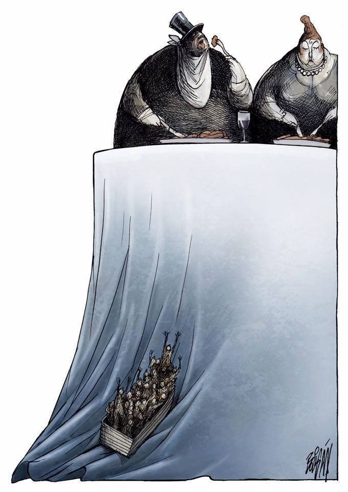
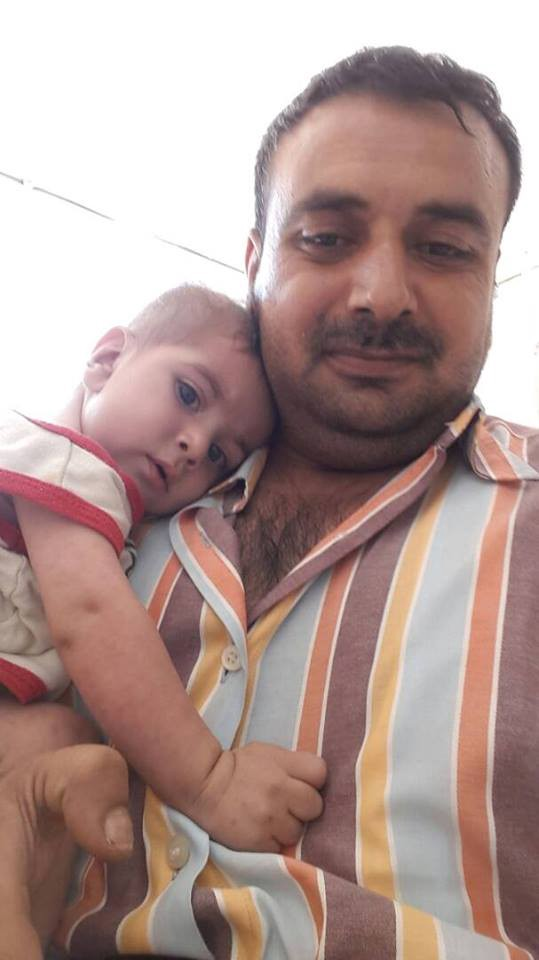
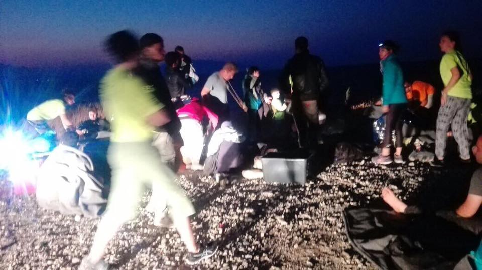
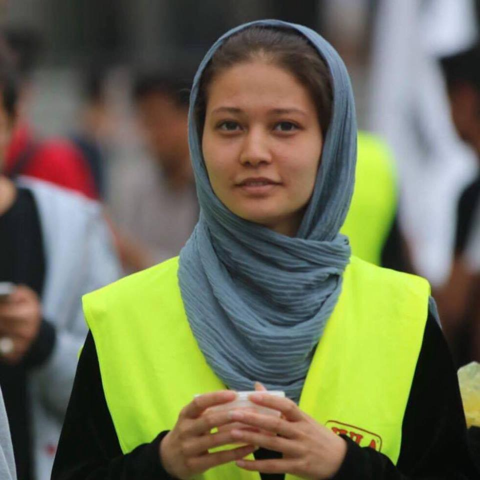

### AYS Daily Digest 18/08/17: “Defend Europe” fascists defeated, but the threat is far from over

_Single refugee father with sick boy seeking home in Adana / Syrian family with small children jailed pending deportation to Turkey / Bulgaria asks for 600 heavily militarized troops along border / Solidarity encampment in central Stockholm continues to draw attention / Witness testimony suggests collaboration between Libyan military and smugglers / Refugee flow into Spain continues to grow / And more news…_

#### FEATURE

The boats affiliated with “Defend Europe” a far\-right xenophobic organization, have drawn quite a bit of attention in the last few months\. The group, whose stated mission was to keep boats from reaching Europe, has announced that their mission is coming to a close\. Even as they frame their exit as having completed their goals, the truth of the matter is that the mission was a failure from the get\-go, and has been marred by controversies and mishaps from the very beginning\.

Their boat was detained several times, first in Egypt and later on Cyprus, their fundraising mediums were taken offline, and they became embroiled in a people smuggling controversy when several crew members of Sri\-Lankan origin on board the ship applied for asylum and many of the crew were arrested\. When in the beginning of August the group headed towards Libya to begin their stated mission of patrolling the seas, local fishermen learned of their plot and organized to keep the ship from leaving port\. Perhaps most embarrassingly for the group, on August 11 their ship suffered a technical malfunction and they were saved by an NGO performing refugee rescues in the Mediterranean\. When on August 17 several NGOs successfully petitioned Maltese authorities to prevent the Defend Europe ship from docking in their ports, the organizers were forced to announce the end to their mission\.

Although this entire saga is funny in a very perverse sense and the supporters of refugee rights have scored a victory, one must not rush to celebrate too soon\. Although this pack of buffoons failed in their mission, their supporters have not gone anywhere\. They are still going strong, and they will regroup sometime in the future, having learned from this failed experiment’s mistakes\. The battle has been won but the war continues, and a strong vigilance will continue to be necessary to counter all fascist threats which may arise in the near future\.
#### Turkey
### Syrian refugee father in desperate need of a new home in Adana

The father of a young boy with cardiovascular problems who will be undergoing surgery soon is in need of a new home\. His current residence is far too dark and damp for the health of the boy, who needs a better environment for recuperating from his procedures\. However, the father has no choice but to stay there\. If you know of a place, please [Rehana Flowerinjannah](https://www.facebook.com/profile.php?id=100013106229563&fref=gs&hc_ref=ARTzGdci0neHMUeWtlzHTHKvwneb3vJDQTrc4gPLj8ZUK1CZI_kjHqmOMwoVCrfvVjE&hc_location=group) on Facebook\.

The father and his son
#### Greece

Some new arrivals who landed on Lesvos this morning\. Photo Credit: Boat Report — Lesvos
### Syrian refugees and their children jailed

After their asylum application was rejected, a Syrian refugee family living on Chios has been detained and jailed pending their deportation to Turkey\. The family was arrested around noon on Thursday\. With them are their young children, aged 7, 5, and 2\-year\-old\.

To quote the Chios Solidarity group, “we are asking for the immediate release of the children and their parents and we call for the intervention of every competent body, local and nationwide, in this and in all the other relevant cases we are afraid we will see in the future, due to the ‘application’ of the inhuman agreement of the EU with Turkey\.”
### Newest statistics show an upward trend in the number of unaccompanied child minors receiving protection

The [newest report by EKKA](http://reliefweb.int/sites/reliefweb.int/files/resources/58827.pdf) shows that there has been a slight upward trend in the number of unaccompanied child refugees receiving protective custody in Greece\. But even as this constitutes an improvement, there remain nearly 1,500 unaccompanied child refugees who remain outside the purview of the authorities\. A total of 1,473 are currently on the waiting list for accommodation, vying for 1,228 spaces in UAC shelters\.
### Ellinikon Warehouse in Athens is in desperate need of donations\. Volunteers also welcome

The Ellinikon Warehouse distributes food and other essentials to more than 5,000 refugees around Athens\. They are seeking to expand their zone of operations beyond Athens and to stock warehouses on the islands\. All goods may be delivered care of Sotiris Alexopoulos at the following address\.

Old Athens Airport,
Elliniko, basketball stadium,
Pampiraiki warehouse
\(Olympic airways entrance on the coastal road\)
26 Posidonos Avenue,
16 777, Greece\.

A full list of necessary items may be found [here](https://www.facebook.com/groups/PAMPIRAIKI/permalink/508333106177465/) \.

It should also be noted that the Pampiraiki group, which administers the warehouse, is in need of both long term and short term volunteers to help with the sorting and distribution of goods\. You may inquire by sending them an email at pampiraiki@gmail\.com\.
### Volunteer driver needed on Chios

Refugee Biriyani and Bananas is seeking a volunteer driver available from August 28 to September 3\. The person must pay for their own costs of travel and accommodation, as well as the car fee and the price of gas\. Please contact [the Facebook page](https://www.facebook.com/RefugeeBiriyaniAndBananas/?hc_ref=ARTHNmGurExjbClsITXk_RqNhM5egxOWmGk_Pubm5_aV0PvZL9dX2EABoVWNCvRV5UU&fref=nf) if you are able to commit\.

### Numbers

> _A boat landed on the southern coast of Lesvos this morning\. On board were 37 refugees, 11 women, 13 men, and 13 children, all of whom arrived safely\._ 

> _A total of 1,421 refugees and migrants crossed the islands of the northern Aegean from August 1 until today, Thursday, August 17, morning\. Of these, 394 passed to Lesvos, 458 to Chios and 569 to Samos\._ 

> _It is worth mentioning that, according to Turkish Coast Guard information published on its official website, during the same period, they intervened in 32 incidents and returned to the Turkish coasts 1,265 people heading to the Greek islands\._ 

> _According to the Ministry of Interior’s National Coordination Center for Border Control, Immigration and Asylum, which announces, instead of the General Police Directorate of the North Aegean, the details of the remaining refugees and immigrants on the islands of the northern Aegean, in the reception and identification centers \(CTCs\) and other structures there are a total of 10,327 people waiting for a reply to their asylum application\. Of these, 4,780 are on Lesvos, 2,924 on Chios and 2,623 on Samos\._ 

> _Particularly note, according to the above, the explosive situation in Moria’s KYT on Lesvos and Samos\. In Moria, where the capacity is for 2,330 people, there are 3,502\. While on Samos, with a capacity of 700 people, there are 1,984\. Much better is the situation in the HFC in Chalkios, Chios, which has a capacity of 1,100 people, while the number is 838\._ 

> _In the municipal camp of Kara Tepe in Mytilene, there are 742 people, while the settlement of Chios in Souda seems to be spilling over into the moat of the city’s castle, where more than 330 people are officially staying, and construction demolitions have begun\._ 

#### Bulgaria
### Bulgarian government demands that the EU send troops to its borders

Bulgarian defense minister Krasimir Karakachanov said that Bulgaria needed 600 soldiers to patrol its borders from intrusion by refugees, including “highly specialized fighting troops\.” “We should deploy NATO or EU forces in Italy and Greece and defend the external borders of the European Union by force of arms if necessary,” he added\. Among the minister’s other suggestions has been that the border be monitored by drones\.

Bulgaria is known for its strong anti\-refugee position\. Between January 1 and July 31 of this year, 561 refugees received asylum in the country, and 683 received humanitarian protection\. All in all, Bulgaria grants protection to approximately one third of applicants, two times more than Hungary but still below other countries such as Greece\.
#### Sweden
### Medborgarplatsen solidarity encampment is still going strong

Mina Muzafari is a teenage girl who has been taking part in the demonstrations\. Photo Credit: Ung i Sverige

“I want to stay for several reasons\. I’m Hazara \(the most oppressed and vulnerable group in Afghanistan\), I’m a teenage girl and I could be married off\. Why would you send me to death, to violence, to discrimination? Why do we as refugees not have the right to live in peace and security?” said Mina Muzafari, a refugee girl when asked about her participation in the protests\.

Right wing organizations will be protesting tomorrow at the very same place where Ung i Sverige and the Afghan youths stood today\. They have official permission to do so, since the police and responsible institutions didn’t see on what grounds they could be stopped\. This is a country of free speech, which motivates this kind of decision\.
### 106 year old woman’s asylum application rejected

Bibihal Uzbeki is an 106\-year\-old woman who became famous in 2015 after being interviewed in a Croatian refugee camp\. The reason? The woman, travelling with her family, is seemingly the oldest refugee in the world\. Originally from Kunduz, the family was forced to leave their homes as a result of the violence which has engulfed Afghanistan for nearly 40 years\. But even her fame was not enough to save Bibihal, who is now at risk of deportation\. The decision is being appealed by her legal representative\.
#### Italy
### New housing structures built in San Ferdinando

Today the foreign seasonal workers in Gioia Tauro Plain can avail themselves of a new structure for temporary hosting\. The people in San Ferdinando will be moved to a new tent camp created under the coordination of the prefecture\. This comes from an agreement among the local administrations, Caritas and the Red Cross, along with Emergency and MEDU\. The new structure will host 550 people and the hygienic, security and service conditions there are good\. The structure will be guarded, while the old San Ferdinando camp will be dismantled, to prevent further informal settling by seasonal workers\.

The mayors of the area are working on solutions for the receipt of seasonal workers on a wider scale\. Another meeting with the trade unions aims to make sure the foreign workers are properly informed on the use of the new area\. However, according to the organization for the coordination of agricultural works, this is “the nth ghettoization”, since the workers have not been consulted during the agreement, since “according to ISTAT, the hosting structures already exist, and the workers could find decent conditions without burdening on the community”\. The workers’ requests are a\) to be sure all 2,000 workers in the area can be hosted; b\) autonomy in the use of the kitchen facilities; c\) freedom of access and creation of socializing spaces, preventing the use of devices damaging the dignity of the people; d\) a permanent round table on housing stability and respect of the contract conditions\.

Meanwhile in San Ferdinando\-Rosarno, a _de facto_ ghetto, negotiations are taking place between the African agricultural workers and the police\. The workers are asking for a housing solution that is not a new tent camp\. The police has responded by militarizing the whole industrial area\.
#### UK
### Tent collection to take place on Monday

The V Festival, a music festival in Britain which attracts large crowds, will be the focus of an NGO on Monday\. Volunteers will be on site in Monday August 21 from 1pm to 2pm to collect tents and sleeping bags for refugees in need\. Refugees in northern France are in great need of this and much more as a result of constant police raids, during which they are harassed, chased away, and have their property confiscated, including tents and sleeping bags\. As a result of this, thousands of refugees are forced to sleep under the open sky regardless of the weather\. If you are in the general vicinity of Essex and have anything that you would be able to donate, it would be of great help\.
#### Libya
### Refugee sheds light on collaboration between Libyan coast guard and smugglers

As AYS reported last week, the loyalties of the Libyan coast guard are questionable, with the country embroiled in a long\-standing civil war in which several governments are vying for power\. The western\-backed “Unity government” is quite weak and often relies on the help of local militias to maintain any semblance of control\. Many in the Libyan coast guard currently being trained by the EU to cap the refugee flow across the Mediterranean are themselves militias who are affiliated with very dark practices, namely keeping “rescued” refugees in makeshift camps that are simply not suitable for living\.

One recent refugee, Ghanim from Sudan, told representatives of SOS Méditerranée that the camp in which he was being held was being administered by a high\-ranking official in the military who would decide when departures would take place\. If this is true, it speaks to an unimaginable level of corruption and a massive failure on the EU’s part\. In effect, this constitutes the EU funding people linked to smugglers as part of their project to crack down on smugglers\.
#### Spain
### Arrivals in Spain continue to intensify, 920 saved in last 48 hours

Salvamento Marítimo, the Spanish governmental institution responsible for saving lives at sea, rescued 601 persons on Wednesday, making it the busiest day of 2017\. An additional 319 were rescued on Thursday\.

This year thus far, more than 9,000 persons have arrived in Spain, which is more than the total number of arrivals in 2016\. Of these, 9% are children, according to UNICEF\. According to the IOM, Spain is now going through the same situation that Greece and Italy experienced in 2015, and UNHCR has already pointed out that Spain lacks the resources and capacity to protect the rising number of refugees and migrants arriving\.

_Converted [Medium Post](https://areyousyrious.medium.com/ays-daily-news-digest-18-08-17-defend-europe-fascists-defeated-but-the-threat-is-far-from-over-59fc800d14a4) by [ZMediumToMarkdown](https://github.com/ZhgChgLi/ZMediumToMarkdown)._
