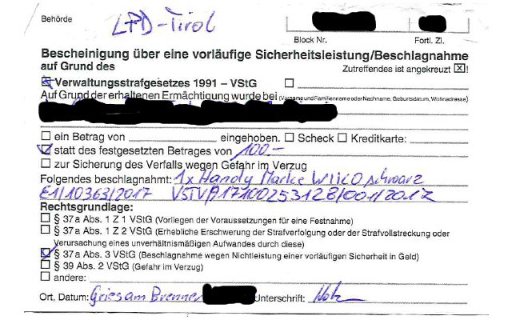

### AYS Daily Digest 20/08/17: Austria taking new measures against refugees

_Austria takes personal belonging from refugees / More people arrive to EU by the sea and land every day, faraway from mainstream media gaze / Help needed in Greece, France, and Serbia / Protest continue in Sweden / And more news…_

![“They sleep on the floor surrounded by shit, rats and trash but they smile\. They wash with little water but they smile\. They only have the food of the volunteers but they smile\. The weather is very hot but they smile\. They don’t have money but they smile\. They flee from war and misery but they smile\. Many have been trying to cross the border for a year but they smile\. Exhausted, mad, desperate but smiling\. In Serbia you learn how to smile at life and how the human being overcomes inhumanity\.” Photo by [Fotomovimento 15M](https://www.facebook.com/Fotomovimiento.org/photos/pcb.1528224953911747/1528224887245087/?type=3&theater) \.](assets/9d76321ebf5e/1*jpzq9vtGU_a5JXyRUoOdzg.jpeg)

“They sleep on the floor surrounded by shit, rats and trash but they smile\. They wash with little water but they smile\. They only have the food of the volunteers but they smile\. The weather is very hot but they smile\. They don’t have money but they smile\. They flee from war and misery but they smile\. Many have been trying to cross the border for a year but they smile\. Exhausted, mad, desperate but smiling\. In Serbia you learn how to smile at life and how the human being overcomes inhumanity\.” Photo by [Fotomovimento 15M](https://www.facebook.com/Fotomovimiento.org/photos/pcb.1528224953911747/1528224887245087/?type=3&theater) \.
### Feature: Austria taking the belongings of asylum seekers

Meltingpot reports about a case, where a man was fined by Austrian authorities for entering the country illegally\. He was controlled in the train and charged with 100 Euros\. Before sending him back to Italy, they took his phone as “security measure”, because he could not pay the fine\.

To not lose his photos, documents and contacts, he decided to pay the money later\. But he could not: He was not allowed to enter the country legally and go to the office\. Only with an authorization contacts were able, to pay the fine and get the phone\. It is unknown, how many people are affected by this treatment\.

See the [complete report in German by Melting Pot](http://www.meltingpot.org/Österreich-Strafen-und-Beschlagnahmungen-von.html#.WZrI_q17Gu4) \.

By Meltingpot
### Sea

The boat of the Spanish life rescue crew ProActiva goes on to its final mission month\. In its first deployment in operation ‘Sophia’ this frigate has already rescued 1,174 migrants and has had to carry out five urgent medical evacuations \(of four migrants and one member of the crew of a ship of an NGO\) \.

In July and August a large number of rescues are being carried out at sea, as weather conditions improve and, as noted by the commander of the ‘Victoria’, frigate captain Manuel González Serrano, people who want to reach European soil “Have the false perception that going into the Mediterranean under the conditions that make it safe at this time of year\.”
 However, the number of SOLAS events \(assistance to migrants\) carried out during these months is more or less expected\. “The beginning of the mission was very demanding and coincided with a massive departure of migrants, so that the first interventions suddenly raised the number of migrants rescued\.

ummer is often an intense and busy season, the departures in this area of ​​the central Mediterranean are difficult to predict and massive, which makes the rescue work more complicated\. The weather conditions have great influence, so any improvement of the sea state will mean a possible exit and the numbers could be shot again at any time “, explain from the frigate ‘Victoria’\. This Spanish frigate has neutralized 15 boats, that is to say, all those that have been involved in the rescues in which it has participated\.

However, ‘Victory’ has not yet arrested any human traffickers\. Since the start of Operation Sophia two years ago, 110 alleged traffickers have been made available to the Italian judicial authorities and more than 470 vessels have been neutralized\. Eunavfor Med operation Sophia ‘began on 22 June 2015, with a duration, in principle, of one year, which the European Union extended in June 2016 for a further 12 months and which last July 25 was again extended to On December 31, 2018\.

The objective of this international mission, which takes place in the southern central Mediterranean off the coast of Libya, is to fight and break the business model set up by the smuggling and human trafficking networks in this area and to help reduce Possible loss of life at sea resulting from this criminal activity\.

Only on Saturday they had rescued 232 people in the Mediterranean Sea\. After some NGOs had suspended their activities because the Libyan coast guard was harassing them, SOS Mediterranee announced, that the Aquarius will continue its Search & Rescue activities\.

■■■■■■■■■■■■■■ 
> **[SOS Humanity](https://twitter.com/soshumanity_de) @ Twitter Says:** 

> > The #Aquarius @[SOSMedGermany](https://twitter.com/SOSMedGermany) continues Search &amp; Rescue activities in the Mediterranean @[MelissaBellCNN](https://twitter.com/MelissaBellCNN) reports  [goo.gl/7d9NeR](http://goo.gl/7d9NeR) #CNN https://t.co/FRJUOZkBo4 

> **Tweeted at [2017-08-20 09:34:49](https://twitter.com/sosmedgermany/status/899203056918827008).** 

■■■■■■■■■■■■■■ 

**Turkish Abuse**

The Hope Project pubished an video given to them by a young Syrian girl who arrived on Lesvos today\.
“This is what the EU pay Turkey to do\! 
This is how they stop boats\! 
Sadly we have seen this many many times\. And many times the boats are sunk\. This one arrived safely yet traumatized 
These people are fleeing war, and abuse\! 
This boat contained many children, many of them tiny babies\!
What have we become?
Shame on Europe for paying for this abuse\!”

### Italy

On the 19th August, Golfo Azzurro ship arrived at the port of Trapani \(Sicily\) carrying over 230 passengers, mostly young people, women, children and babies, who were rescued from death in the Mediterranean\.

■■■■■■■■■■■■■■ 
> **[Open Arms](https://twitter.com/openarms_fund) @ Twitter Says:** 

> > Sufrieron ataque y secuestro GC libios, llevaron a puerto seguro 232 náufragos y, por fin, llegan #Malta Enorme trabajo equipo 26, Gracias! https://t.co/Lax6JSRtVK 

> **Tweeted at [2017-08-20 13:33:59](https://twitter.com/openarms_fund/status/899263245655187456).** 

■■■■■■■■■■■■■■ 

### Greece
#### \#1951RefugeeConvention

The number of new arrivals on the Aegean islands remains high\. Only on Lesbos 67 people in one boat have been reported\.

[No Border Kitchen Lesvos](https://www.facebook.com/NBKLesvos/photos/a.722860677853724.1073741829.689281511211641/991682190971570/?type=3) crowdfunding campaign nearing its end with 200 euros left to reach goal\.

Yesterday, they got an message from comrades from a squat in the Netherlands:

_“You make us believe this world can be better, keep fighting\.”_

And yes, they do\. This small team believes in humanity and helps us all to believe that solidarity is still possible and that it is crossbred\.

Help them if you can [youcaring\.com/nbklesvos](https://l.facebook.com/l.php?u=http%3A%2F%2Fyoucaring.com%2Fnbklesvos&h=ATOK73mCPMtTCJi_HBuk4_J9JJ65bfUHLCRbBVWW5Jv0-NMe7uqBf31Z0a-hxwOR_-IyG0SGLwTbztes7M16szflXwiOMzRmokwrhgZ7Q3DeHfavYsfEy_VLwvQ46Kb-YeQCqbtFQxxTUeFa0SLe2k5gGB_h&enc=AZOJBnngJLLdkm3u39pkp1V2hh3v2Q39BiOVfiILS_xUHhknBwtnLVDOKI73cMlWhuP1vB9jyn2qxaBbpg140ZzAwuVXZ-GTbnaQ2s6t8Rk07vDOlG-_YSkQvwvOUqITswOyp62bJ0Zxl86ISGJgMKBd3kRo-Pync5iRuenqfkMctJU5FfFzsqoSOaIrY3HkgGk&s=1)

[Activist Arash Hampay](https://www.facebook.com/arashampay?fref=gs&hc_ref=ARRVJgaz-XbQCCpIjTaPtPviqtSw85NOAudkXCSlWahfkRVvx_nfCfGfN-QFbJnGkqw&hc_location=group) leads new campagn trying to draw attention at the situation in Lesvos\. [\#1951RefugeeConvention](https://www.facebook.com/hashtag/1951refugeeconvention?source=feed_text) is the name of the campaign that aims to put pressure on States and the UN to make new laws\.

_“This convention comprises of a collection of articles that have been issued by different states and the UN which, were ultimately ratified by those states\. They did this to respect Human Rights\. We have witnessed that these states and the UNITED NATIONS are the main violators of the refugee convention\.”_

Arrash wants us to talk about what is happening right now in Greece, and on Lesvos island, which he claims is a violation against article number 26 in the Refugee Convention\. Lesvos, he wrote, is a big prisson for all those trapped there\.

“Whenever you witness the violation of any of the articles of the \#1951RefugeeConvention by the police, the UN or any other institution, organization or authority, write about it, denounce it, and show your solidarity with the campaign by writing \#1951RefugeeConvention on your T\-shirt and posting it\.”

[ATLAS](https://www.facebook.com/vol.unteer.1829?hc_ref=ARQ6_62N_j-XKEfOzDwPuUDGiNTk3kENlCeFL0rBZx7THIUQgJ6S9LPaTcUbqNgoB9o&fref=nf) , Athens\-based project which works on improving access to services for LGBTQ Asylum Seekers, is looking for the project manager\.

_“Due to the nature of the interactions with beneficiaries, persons of concern and other actors, the role is best suited to a recent law graduate or someone with legal experience or knowledge of the Common European Asylum Framework\. The role is fast\-paced and requires a dynamic approach to best navigate a changeable environment\. The role is voluntary and the candidate would ideally be based in Athens for a minimum of two months from early September\. Candidates must speak English\. Knowledge of a second language would be preferred, particularly Greek, Arabic, French or Farsi\. Please get in touch through a private message for more details of the role\.”_

[Refugee Rescue Mo Chara](http://www.refugeerescue.co.uk/donate-now/) needs your help to buy night vision goggles that is essential to help them to spot boats at night\. Unfortunately, those that do their job well cost several hundred pounds\. Right now they rely only on one pair which makes it impossible to spot at sea and land at the same time\.

Help them make the Aegean Sea a little safer\.

To deal with the large number of people on the island, Dinit is looking for doctors, nurses, skippers, rescuers and general volunteers, who can stay for 4 to 6 weeks\. Contact is possible via E\-Mail: [lee@dinit\.ie](mailto:lee@dinit.ie) and [info@dinit\.ie](mailto:info@dinit.ie) \.
### Serbia

Help is needed in Serbia, Šid, too\. [No Name Kitchen](https://www.facebook.com/NoNameKitchenBelgrade/?hc_ref=ARRVV3Oh6_E2TRClkR2CQOiH_-o5MK7tWblU0MLllDM-_uZH5x787rOMdcUTfkf7u2U&fref=nf) appeals to any person who has some medical knowledge and is willing to come and help in Šid \(Serbo\-Croatian border\) \. If you are interested, get in touch with them
### France

In Calais volunteers are setting up a new kitchen to provide hot food for people in need\. The temperatures in Northern France are dropping, autumn and winter are about to come\. Hence for people sleeping rough a warm meal will become even more crucial\. In order to cook daily, the [Refugee Community Kitchen is asking for ongoing, monthly, donations](https://mydonate.bt.com/donation/start.html?charity=147727) to plan their activities better\.
### Sweden

Today there was another demonstration in Stockholm\. This one started at Medborgarplatsen but left in a long line to walk the streets of Stockholm, with the same message as always: stop deportations of young people back to Afghanistan\.

The current permission to protest at Medborgarplatsen lasts until the 23rd, after that and if it will be prolonged no one knows at this point\. Still, the people protesting say they won’t give up until they get a satisfactory answer from the migration agency and the politicians that has the power to stop sending them back to death\.

> **_We strive to echo correct news from the ground, through collaboration and fairness, so let us know if something you read here is not right\._** 

> **_Anything you want to share — contact us on Facebook or write to: areyousyrious@gmail\.com_** 

_Converted [Medium Post](https://areyousyrious.medium.com/ays-daily-digest-20-08-2017-9d76321ebf5e) by [ZMediumToMarkdown](https://github.com/ZhgChgLi/ZMediumToMarkdown)._
