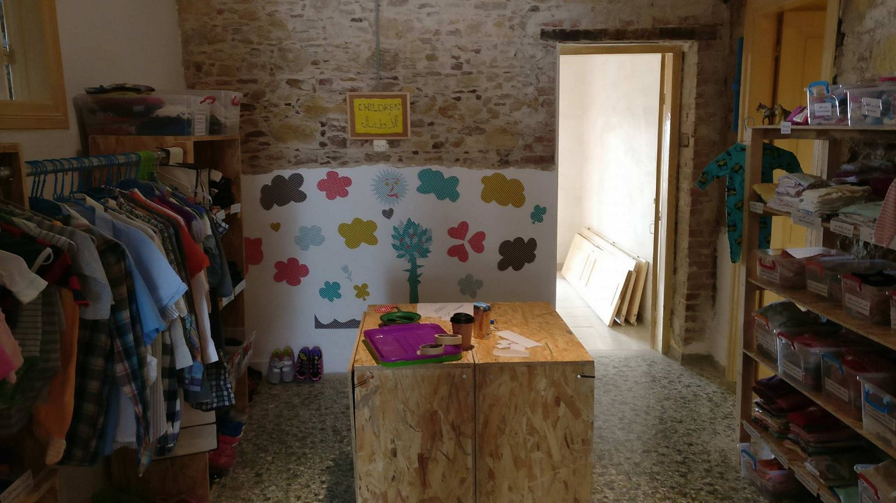
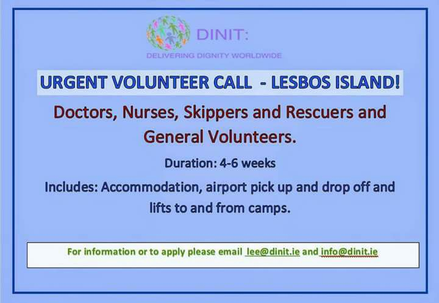
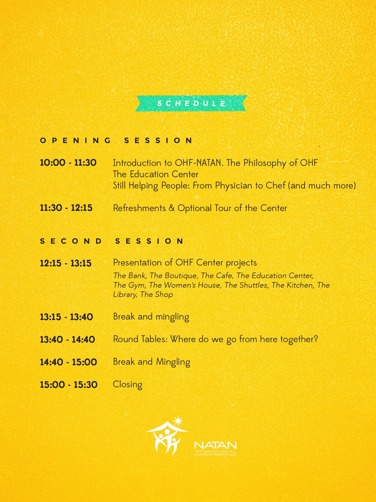
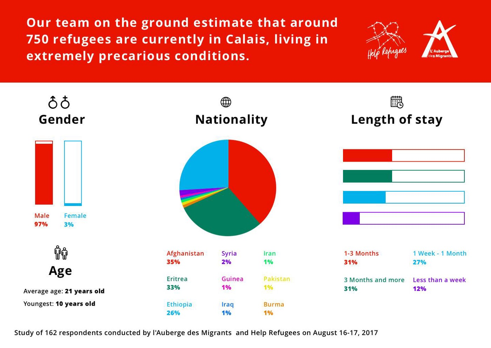
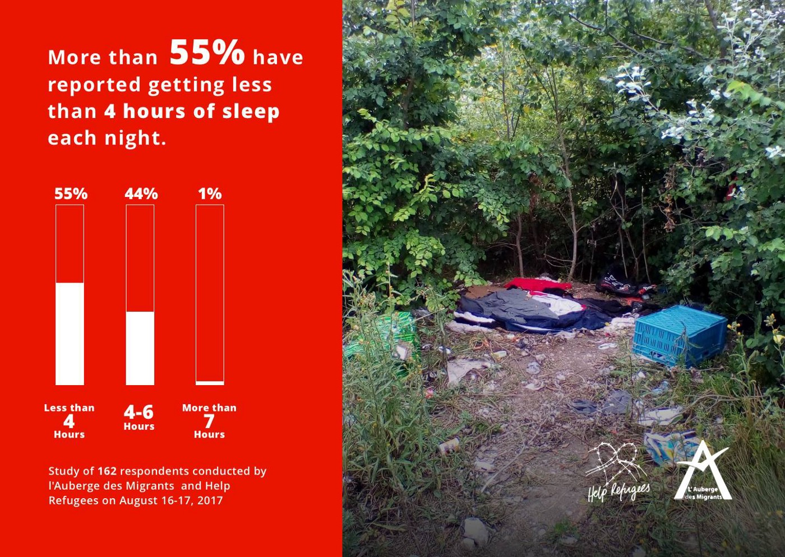
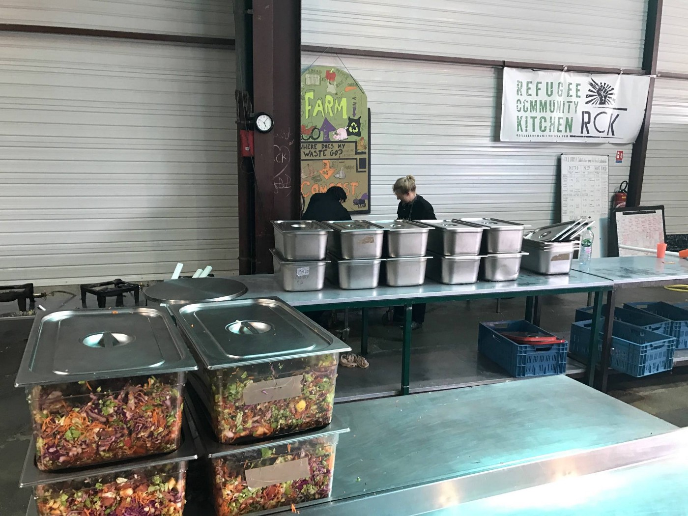
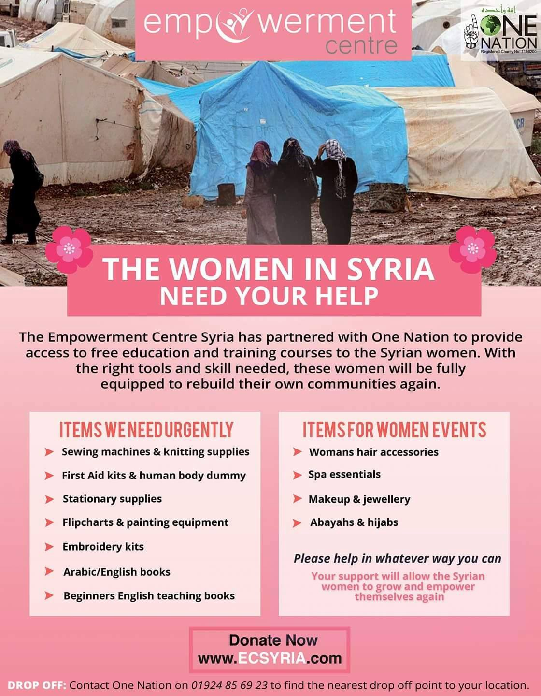

### AYS Daily Digest 21/08/17: New wave of deportations ahead

_New deportations from Austria to Croatia / paramilitary groups violently keeping people in Libya / evictions in Rome / Border checks introduced between Italy and Austria / volunteers and aid needed in France and Greece / Protests in Sweden against the deportations to Afghanistan / And more news…_

![France — “Yesterday we went to one of the very few well established small camps still left in the north of France\. The contrast after driving through pretty french countryside is stark, to see the shacks made out of rubbish like the ones that used to be in the old Calais jungle\. We took various donations, the most important of which were firewood for cooking, and petrol for the two generators in the camp\. There are around 80 people there and they share the generators frugally to provide mobile phone charging and light at night\.
However, the key thing we didn’t have that was requested a lot was mobile phones and power packs\. Over time their cheap phones have been broken and lost, and these provide a lifeline to contact family and friends back home in countries of origin\.
If you can donate any mobile phones or power packs please email clare@care4calais\.org\. Thank you\.” \(Photo:C4C\)](assets/f5e9d7492c60/1*-JekOc5THNjzdcB48cVAbQ.jpeg)

France — “Yesterday we went to one of the very few well established small camps still left in the north of France\. The contrast after driving through pretty french countryside is stark, to see the shacks made out of rubbish like the ones that used to be in the old Calais jungle\. We took various donations, the most important of which were firewood for cooking, and petrol for the two generators in the camp\. There are around 80 people there and they share the generators frugally to provide mobile phone charging and light at night\.
However, the key thing we didn’t have that was requested a lot was mobile phones and power packs\. Over time their cheap phones have been broken and lost, and these provide a lifeline to contact family and friends back home in countries of origin\.
If you can donate any mobile phones or power packs please email clare@care4calais\.org\. Thank you\.” \(Photo:C4C\)
#### FEATURE — New deportations from Austria to Croatia

A young family who has been living in Austria since 2015, and have had their 2 babies born in Austria, was picked up by the police from their home this morning in order to be detained and prepared for being sent on a flight to Croatia, according to the Dublin III, the agreement that along with the EU\-Turkey deal represents one of the most dangerous and unjust documents\. 
Following the devastating judgment of the European court of justice from July 26, the Austrian Ministry of the interior is speeding up the procedures in order to deport a greater number of people to Croatia, the country that was first on their way towards the western European countries at the time when the European Ministers of Interior signed a deal that enabled Croatian Minister at the time to organize and facilitate a sort of a corridor from Serbia towards Austria, coordinated and secured by mixed police forces from different EU countries who were present on all transit points\.

That seems to be forgotten and they are still treated as if they had simply entered Croatia as regular foreigners seeking international protection and not as refugees who were among thousands who entered during the peak of what’s known as the biggest refugee crisis since the WW2\.

We have received news information that speaks of another 10 families that are awaiting to be deported from Austria to Croatia\. 
Among them are a few people who had wanted to stay in Croatia in the first place, at the time of entry, but were denied medical assistance and were told they had to continue, just like the others at the time\.

After having sought and received care, home and protection from fellow Austrian neighbors and new friends, a number of people who had fled violence and persecution can’t sleep because they too could be woken up at any time and forced on a plane to Croatia, where overcrowded reception centres are struggling to cope with the number of asylum seekers who live there — even though the number of asylum seekers in an average city in Italy or Greece is likely to be 5 times bigger than in the entire country of Croatia\.

Nobody seems to mind the ongoing disgraceful ping pong with people’s lives in Europe\.

> We are very concerned about the serious flaws apparent in the Croatian asylum process\. This also affects the many individuals and families who have been deported as well as those who are still in danger of being sent back after well over a year of making a new home here in Austria, learning the language, going to school and finding new friends and a semblance of peace and stability in their lives\. While it is impossible to get exact figures, the Austrian government itself states that this last group is quite small — so why can Austria not make use of the sovereinigty clause and take on these few cases? Are human beings really nothing more than parcels being shipped across our continent against their will? — [_Border Crossing Spielfeld_](https://www.facebook.com/RefugeesSpielfeld/?hc_ref=ARSldhBaBvxD79cAVnG5WTqob1Ao0cmyWnDIdEnX3FdgRYNP9anLsSfEakpGT9u6eIE) _, statement from August 5, following our [R](ays-daily-digest-03-08-17-new-joint-report-about-how-croatia-is-failing-to-provide-safe-asylum-6fdd5cd0553)_ [eport on arbitrary and unlawful practices by the Croatian Ministry of Interior \(MOI\) and Security Intelligence Agency \(SOA\)](ays-daily-digest-03-08-17-new-joint-report-about-how-croatia-is-failing-to-provide-safe-asylum-6fdd5cd0553) 
 

>  **_Full report is available here in [German](https://drive.google.com/open?id=0B_oKR2QQNUiPNk00Vy1nQkNHNTQ) , [English](https://drive.google.com/open?id=0B_oKR2QQNUiPY1BZRm5fNFdRYzg) and [Croatian](https://drive.google.com/open?id=0B_oKR2QQNUiPaDE2b3k2cjNLT2c) \._** 

#### LIBYA
### Armed group stopping and locking up people trying to flee

Most of the people who arrive to Italy via Mediterranean route set off from the northern coast of Libya, where the absence of a single central government has allowed human traffickers to work with impunity\. 
However, several hundred civilians, policemen and army figures are conducting a “very strong campaign” that was launched by a “former mafia boss to prevent the migrants leaving on boats towards Italy,” said a civil society organizer from Sabratha, media [report](http://mobile.reuters.com/article/amp/idUSKCN1B11XC) \. According to the sources there, the group was running a detention center for migrants who are turned back or taken from smugglers\.
Analysts caution that the lull is unlikely to be permanent, because Libya’s many competing militias and smugglers make so much money from the crossings that they will be unwilling to abandon the trade for long\.
#### SEA
### “We continue\!”

In spite of the reduced SAR capacity at sea, MOAS has taken the decision to continue their mission, calling constantly for “SafeAndLegalRoutes\. “We have always recognised that there are risks in our operations and we are determined to continue,” the organization [states](https://www.moas.eu/why-we-are-still-at-sea/) \.

> As an independent and apolitical humanitarian organisation, our primary concern is ensuring that we can maintain our life\-saving operations\. 
 

> Despite the best efforts of everyone at sea, so far this year [2244 people have died](https://missingmigrants.iom.int/mediterranean) attempting to cross the Central Mediterranean\. 

> Now, more than ever, MOAS must continue to assist those in need\. Our motto is and will always be that no one deserves to die at sea\. 

#### GREECE
#### Arrivals

In total, 633 people, of whom 147 in Lesvos, 256 in Chios and 230 in Samos, arrived in the past 3 days to the Aegean islands\.

About 250 of them arrived to Chios and Samos this morning\.

A very stressful night is behind the sea rescue teams of CESRT and SMT as they welcomed the three boats that arrived in the night to Chios: 
the first one landed in Vokaria carrying 68 people from Afghanistan \(21 men, 16 women and 31 children\), the second landed in Gridia with 54 people on board from Afghanistan \(21 men, 15 women and 18 children\), while the third boat arrived to the port of Chios with 43 people from Afghanistan, Pakistan and Iran\.
From 2 am in the morning CESRT and SMH toghether for 3 difficult landings\. A very stressful night\.Still our volunteers are in Vocaria and Port of Chios waiting the bus to move them to Vial\.

The fourth boat arrived to Oinousse, carrying about 50 people who were later transferred to Chios\. 
Reportedly there are many children among the newly arrived\.

With Souda camp closing and Vial being full, as local volunteers report, the only remaining option for people arriving to the island is sleeping rough\. Being outside the official accommodation capacities means also not receiving food cards provided by the state, so people are literally left on their own and to be taken care of by volunteers on the ground…

“225 people have arrived on four boats to Chios in the last twelve hours\. However, authorities have removed some of the flimsy tents that were supposed to host them\. Instead they plan to cram them into the prison like camp in the mountains that is already full\.
Undoubtedly, some people, including children, will be welcomed to Europe by sleeping in the street tonight\.” — Photo and text: Izzy Tomico Ellis

On Chios, intensive audits continue to be carried out to identify individuals who have a second negative decision on asylum\. In a police operation in the Souda camp at Chios Castle, 15 persons were taken to the Police Directorate of Chios, two of them Algerians and one Egyptian were detained, [reportedly](http://www.ana.gr/home/article/180318/Perissoteres-apo-630-afixeis-prosfugon-to-teleutaio-triimero-sta-nisia-tou-BA-Aigaiou) to be returned to Turkey\.

 and [Sea of Solidarity](https://www.facebook.com/SeaofSolidarity/?fref=mentions) , the Drops shop was opened in Chios, run by the Drops in the Ocean team \(Photos: [Dråpen i Havet](https://www.facebook.com/drapenihavet/) \)](assets/f5e9d7492c60/1*LG206rNdAaJcY5HGKjuZ2g.jpeg)

With the help of [The Get Shit Done Team](https://www.facebook.com/The-Get-Shit-Done-Team-304001796641127/) and [Sea of Solidarity](https://www.facebook.com/SeaofSolidarity/?fref=mentions) , the Drops shop was opened in Chios, run by the Drops in the Ocean team \(Photos: [Dråpen i Havet](https://www.facebook.com/drapenihavet/) \)
### Family members joining from abroad — information

[Refugee\.info](https://www.facebook.com/refugee.info/) team reminds of the procedure to follow if you are in Greece and want your family members from outside of Europe to join you\. Here is the [full information\.](http://bit.ly/2iaCRgS)
### Interpreters and mediators programme

SolidarityNow organizes a comprehensive training programme for community interpreters and cultural mediators in Athens and Thessaloniki\.
The participants must be native in Farsi, Arabic, Dari, Sorani, Kurmanji etc\. and also be proficient in the English or the Greek language\.
It is intended for residents of Athens and Thessaloniki\. The number of participants in both towns is limited to 105\. For more details [see link](http://www.solidaritynow.org/en/future_interpreters/) \.
### Thessaloniki — German classes

German classes will resume tomorrow as usual, [Hope Project Thessaloniki](https://www.facebook.com/groups/hopeprojectthessaloniki/?ref=group_header) reminds everyone\. The schedule is:
Tuesday 16:00–17:00
Wednesday 16:00–17:00
Thursday 16:00–17:00
### Athens — protest

A [demonstration](https://www.facebook.com/events/109941286369424/?ti=cl) to protest deportations to Afghanistan and the EU\-Turkey deal will be held in Athens tomorrow, organized by some of the refugee groups\. They state the following:

> With the prolonged insecurity in Afghanistan and threat of deportation, we have organized an emergency rally to assert our voices calling for our rights as Afghan refugees\. 

> On Tuesday we will deliver an official letter of demands to the Ministry of Migration and the European Union office\. 

> We invite everyone to join us in solidarity as we fight for our rights\. 

> Our demands include: 

> End All Deportations\!
 

> Relocation and Family Reunification Now\!
 

> Equal Rights for All Refugees\!
 

> Cancel Joint Way Forward\!
 

> Cancel EU \-Turkey Deal\! 

> We stand in solidarity with ALL asylum seekers in Greece, Europe, and globally\. 

### Volunteer & help
#### \- Lesvos

[Starfish Foundation — Help for refugees on Lesvos](https://www.facebook.com/HelpForRefugeesInMolyvos/) invites everyone to take part at their conference that aims to create more possibilities for volunteer organizations to collaborate and work better together:

[Support](http://www.dirtygirlsoflesvos.com/upcycle) the [Dirty Girls Of Lesvos Island](https://www.facebook.com/dirtygirlslesvos/) ; they upcycle materials from used \(fake\) life jackets, turning them into Messenger Bags that are given to those who donate a certain amount to the hardworking team of Firty Girls\.

> Carry a bag with a message of your support for people who have been forced to leave their homes and become refugees\. — _Dirty Girls_ 

#### \- Around Greece

[Greece Communitere](https://www.facebook.com/GreeceCommunitere/?hc_ref=ARQNLgFxwVUeS2eFmLcNpoywpP-6IAscNrCKzh2EEtdjVhcxRsljzQM9QLi9A6JxojY) team is looking for a coordinator for their Mobile Resource Centre project\. More information: [here](https://m.facebook.com/story.php?story_fbid=484827138552748&id=403317580037038&fref=gc&hc_location=ufi)
#### HUNGARY

42 people from Iraq, traveling in a Turkish lorry, were caught on the Hungarian\-Romanian border, and pushed back to Romania, Hungarian police [reported](http://www.police.hu/hu/hirek-es-informaciok/legfrissebb-hireink/hatarrendeszet/illegalis-migransok-egy-torok-kamion) \.
#### ITALY
### Rome — eviction and emergency situation in the city

On Saturday, 500 law enforcement officers were deployed to evict the 800 migrants, mainly from Eritrea and Ethiopia, who had been squatting in the 1950s\-era former office building near the Termini central rail station\.
They were placed on buses and taken away for identification\. Some people did try to block the street toward the station, but police reinforcements were brought in to be deployed against protesters, media [reported](http://m.dw.com/en/migrants-in-rome-evicted-from-office-block-as-un-voices-concern/a-40167475) \. However, they returned and spent the night in piazza Indipendenza park\.

Rome municipality, present yesterday with two operators of the Social Operational Room unable to cope with the huge issue and with the availability of ATAC buses for the migrants, seems to have no plan at the moment, [sources](http://roma.fanpage.it/sgombero-rifugiati-in-centinaia-dormono-all-aperto-a-piazza-indipendenza/) in Rome say\.
### Vatican

In the midst of political dispersion of responsibility and reluctance to express a clear stance on the current issues diving European leaders, among the few leaders who do speak clearly and strongly in favor of welcoming the refugees, pope Francis released a [message](http://www.news.va/en/news/popes-message-for-world-day-of-migrants-and-refuge) for the World Day of Migrants and Refugees, reaffirming that “our shared response may be articulated by four verbs: **to welcome, to protect, to promote and to integrate** ”, reminding that solidarity must be concretely expressed at every stage of the migratory experience **— from departure through journey to arrival and return\.**
### **Pordenone — politics of insecurity**

Recently the local police entered Palasport, already used in the past by groups of asylum seekers, in order to find a shelter in the night\. While the administration increases the the number of policemen in the field to monitor the territory \(recently paying 22,000 euro for their extra working hours\), Silp Cgil states that it was precisely the municipality’s decision that increased the feeling of insecurity in the area and overloaded the local police\.
#### AUSTRIA
### Border checks between Italy and Austria

Austrian soldiers have carried out border checks at the Brenner Pass between Austria and Italy over the weekend, media [reported](http://www.euronews.com/2017/08/20/austria-deploys-troops-to-secure-border-with-italy) \. The decision to deploy 70 soldiers at the border between the two EU member states was announced last week\. A joint police\-military unit searched overnight trains during the weekend\. Ten migrants were found at just one crossing\.
#### FRANCE
### Calais

Each month, Help Refugees team conducts a survey in Calais with [L’auberge des migrants international](https://www.facebook.com/laubergedesmigrantsinternational/?fref=mentions) \. They interviewed 126 people this month about the living conditions in Calais\.

> We estimate 750 refugees are now in Calais\. 39% have been here for a month or more living in extremely precarious conditions\.
 

> On average, refugees get 3 hours and 30 minutes sleep per night\. 76% have had their blankets taken from them\. On average, those who had their blankets taken said this happens 3 times a week\. 

They continue to distribute thousands of blankets, bedding and clothes from the warehouse in Calais, but are also asking for support to be able to continue\.
#### Kitchen

[Refugee Community Kitchen](https://www.facebook.com/groups/RefugeeCommunityKitchen/) is working without stopping and preparing the kitchen for the cold days coming soon, along with the growing number of refugees who are in need of their services\.

> We will be here for the coming months and with winter on our doorsteps and being the only hot food provider in Calais now, we need all the help we can get
 

> Donate, Like, Share, Volunteer 

### Dunkirk

Dunkirk Refugee Ground Support Network is willing to provide accommodation for volunteers who wish to volunteer for any period of time on the ground, carrying out distributions of food and donations in the camp as well as any other needs as they arise\.

[Get in touch](http://us11.campaign-archive2.com/?u=9e3007a2cf41874015d1965b4&id=8e40e6d2c0) to collaborate or volunteer: dunkirkvolunteers@gmail\.com
### Paris

](assets/f5e9d7492c60/1*sIzoFRayBrIWy6qOD8h9Ww.jpeg)

French classes in Paris — source: [Resome](https://www.facebook.com/resomefr/)
#### SWEDEN

Tomorrow there is a scheduled deportation from Märsta outside of Stockholm to Afghanistan\. Information about when is not out in the open, and Ung i Sverige who runs the protest against deportations at Medborgarplatsen, encourages everyone that has the possibility to go to Märsta already tonight in order to hopefully prevent and stop the deportation\.
[Link to the event of the protest](https://www.facebook.com/ungisverige.nu/posts/1978602815718724?fref=gc&hc_location=ufi)
#### UK

A group from the UK is collecting medical equipment, sewing machines, haberdashery, wool, knitting pins, fabric rolls, first aid kits and beauty products for Women’s Centre, Idlib, Syria, coordinated by Radhia Shah\.

### EU & Swiss asylum cases database

EDAL is a database which contains summaries of asylum\-related trials from member states of the European Union \(EU\) and Switzerland\. It is managed by ECRE\. The database targets academics and lawyers and judges, who can take inspiration from how other courts in EU member states interpret legislation\. The database is also used by the EU Commission, which observes how asylum laws are interpreted by a court in an EU country\.

> We have a headnote at the beginning of each of the summaries, which gives a very concise sort of reasoning of the judgement and the most important things of the judgment are defined in simple terms\. They are eye\-catching and give you a sense of what the case is about straightaway and what the decision is about as well,” _the EDAL coordinator [said](https://l.facebook.com/l.php?u=http%3A%2F%2Fwww.infomigrants.net%2Fen%2Fpost%2F4642%2Fa-database-for-european-asylum-law-cases%3Ffref%3Dgc&h=ATNsrNgwx-y_8QbuC_xOIUmKn8DqMgq9xsMN9BRedeXqy6-Vx0LZFktisJundtK2UKbezyY9BkK25fpHjeOqcV3mjtWUN6k3222sXC_4fuF_dQq78R_bRSwm_kgoNtTMuq08yRhg) \._ 

_Converted [Medium Post](https://areyousyrious.medium.com/ays-daily-digest-21-8-17-new-wave-of-deportations-ahead-f5e9d7492c60) by [ZMediumToMarkdown](https://github.com/ZhgChgLi/ZMediumToMarkdown)._
