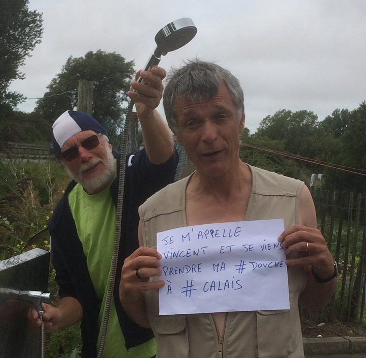
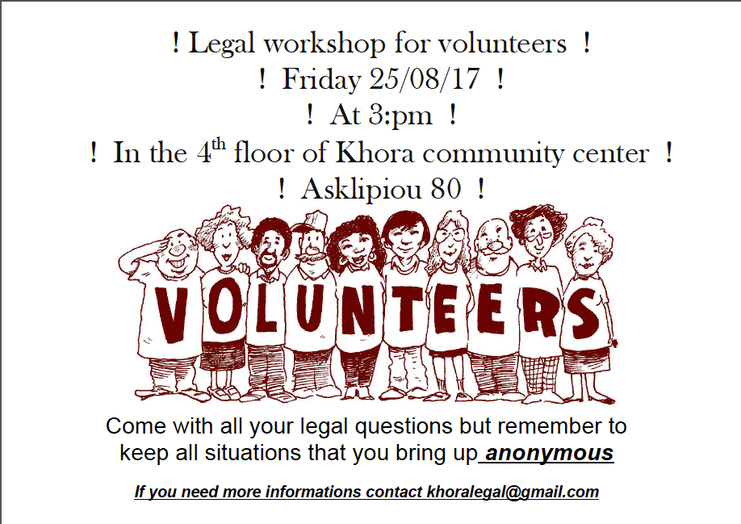

### AYS Daily Digest 23/08/17: Showers For All campaign sheds light on French state violence

_Greek government explores option of giving land to refugees / Spike in recent arrivals raises worries over overcrowding in island centres / Romanian coastguard intercepts refugee boat in the Black Sea / Refugee reception centres to be repurposed as deportation centres / Refugees evicted from building report on their experiences / Boris Johnson on visit to Libya promises more support to Libyan coastguard / And more news…_

“My name is Vincent and I am taking my \#shower to \#Calais\.”
### FEATURE: Showers For All campaign drawing attention to state violence in France

Last week, Vincent de Conick, the founder of “Catholic Aid for Calais,” posted a picture of himself holding a sign\. On the sign it read, “My name is Vincent and I am going to bring my shower to Calais\.”

The purpose of the move was to draw international attention to the French police’s deeply immoral undertakings with regards to refugees across northern France\. The French immigration police \(CRI\) has been undertaking a campaign of intimidation against refugees in the area for a long time now as part of an attempt by the local government to prevent the formation of encampments similar to the famous “Jungle” camp which was demolished by French authorities in October 2016\.

Among the efforts taken by the CRI has been the prevention of access to basic hygiene, such as taking showers\. This, in conjuncture with other intimidation tactics which prevent refugees from being able to take proper care of themselves, has led to a crisis of sorts\. Some doctors have even reported cases of trench foot among refugees, a development which comes as the result of constant nightly raids by the CRI, meaning that refugees must sleep wearing their shoes\. As a result, refugees may go for many days, or weeks even, without taking off their shoes—a clear hygienic risk\.

While trench foot is a massive problem, a phenomenon more fitting of a war zone than a first world country in the 21st century, the numbers of people that it afflicts are dwarfed by the other actions undertaken by the CRI\. Raids against refugees, as mentioned before, are a much greater concern in terms of the number of people affected\. The problem lies not simply in the fact that the police chase refugees away, but that in the process refugees have their belongings confiscated\. Thus, countless sleeping bags, tents, tarps, as well as basic amenities that refugees, like all people, need are forcefully confiscated\. This happened just a [few short days ago in Dunkirk](https://www.facebook.com/MobileRefugeeSupport/posts/648090798729868) \. Refugees are now returning to the area, as there is nowhere else to go, and they are entirely dependent on volunteer aid organizations, who must swoop in to replace many of the refugees’ meager belongings after a raid leaves them with little more but the clothes on their backs\. Another raid and eviction took place on [Tuesday morning at Bordeaux](http://rue89bordeaux.com/2017/08/a-bordeaux-camp-de-fortune-demandeurs-dasile-finit-a-poubelle/) \.

The French state’s goal is to make conditions on the ground so intolerable as a way to discourage further refugee flow into the country\. The French fail to realize, however, the length of desperation and the deprivation that people fleeing from war zones and economically ravaged countries could tolerate\. Because of the constant confiscation of tents, countless refugees spend their nights sleeping under the open sky, rain or dry\.

The French state is symptomatic of Europe as a whole\. Eastern European countries such as the Czech Republic and Poland are rightfully reviled by the EU for refusing to take part in refugee resettlement programs, but is not Europe at the same time taking similar measures? Is not the collaboration with Libyan militias posing as coastguards and the propping up of the squalid camps run by hostile tribes not the same tactic on a larger scale? What of European countries’ attempts to lighten their load by deporting asylum seekers to the war\-torn country of Afghanistan? Where are those who would chastise the entire EU for its failures?
### GREECE
#### Greek government puts forth plan to allocate farming land to 1,500 refugees

The Greek agricultural minister has put forth a proposal to give 1,000–1,500 refugees land in Macedonia or Viotia as a way to integrate them into Greek society\. Various ministries are currently holding discussions to see how the plan would be implemented practically\.

A program to register the skills and professional experiences of refugees will also be launched in the fall so that these people may enter the legal labor market and avoid the high intensity exploitation that many find themselves in as the result of working in illegal jobs\.

Both of these efforts, as moves to finally give refugees a stake in their host countries and giving them control over their own lives are to be welcomed, assuming that refugee workers will receive the same legal safeguards as all other workers\.
#### Khora to hold legal workshop for volunteers on Friday

This Friday, Khora will be holding another workshop in its centre in Athens for volunteers seeking legal advice with regards to refugees\.

\(Photo by Khora\)
#### Refugee Rescue seeking spotters

Spotters play a crucial role in search and rescue missions of boats carrying refugees\. If you have good eyesight and free time, please consider [sending in an application](http://www.refugeerescue.co.uk/land-crew/) to Refugee Rescue to become a member of the land crew\.
#### New arrivals

Lesbos: 34 arrived onto the northern coast of the island last night, among them are 16 men, 13 women, and five children\.

Samos: 50 arrived on Samos this morning, of them are 25 children, 13 women, and 12 men\.

On August 22, there were 250 official registrations, 200 on Lesbos, two on Samos, and 48 on the other islands\.

A total of 1,196 people have arrived in the last five days\.

This latest influx, a relative increase of what Greece has been faced with recently, is expected to result in the escalation of tensions in the already overcrowded reception centres on the Aegean islands, which have been known to keep refugees from traveling to the mainland for months after they receive asylum status\. One can only hope that the tensions do not boil over into physical violence, as has been the case previously\. This is a reminder that the Greek system is incredibly sluggish and immensely slow to deliver on refugees’ basic needs\.
#### German teachers needed in northern Greece

Lifting Hands International is looking for German speakers who can instruct refugees living in Serres\. LHI is an organization that provides German classes for refugees five days a week, and there is an especially high demand for teachers now as the inhabitants of the Serres camp are to be relocated to Germany\. If you are available, please contact [Anika Patel](https://www.facebook.com/anika.12?hc_ref=ART0hh7rfHvTfzgGDGCLoX9t9e5UMwtv-mE58RpROkjp4Kp0LH_qCC4O1t1lwtNCDIA&fref=nf) on Facebook\.
#### Long\-term children’s English teacher needed

City Plaza is looking for an English teacher who would be able to stay to teach the language to children for at least a month\. All inquiries and applications should be sent to [Mitra Chloe Sarshar](https://www.facebook.com/chloe.mitra?hc_ref=ARRSqquMwkmD2L3MytVPZLPeJ0fW-Phha54b5WINFDy9QhImj8aXt4FOeNaM8rWvMiQ&fref=nf) on Facebook\.
### ROMANIA
#### Boat of asylum seekers on the Black Sea raises concerns

The Romanian coastguard intercepted a boat carrying 68 refugees, among them 23 children\. Less than two weeks prior on August 13, a boat carrying 69 Iraqi refugees was similarly captured\. These two events have led some to believe that we may be witnessing the emergence of an alternative route to Europe\.

As Romania is not a part of the Schengen Zone which allows for free movement across Europe, refugees have up until this point largely steered clear of the country, one of the poorest in Europe\. It would be wise to keep an eye on the country, although there is nothing definitive yet\. If smugglers decide that this route is lucrative, Romania may be seeing a much larger influx of refugees in the near future\.
### AUSTRIA
#### Austria to turn three reception centres into detention/repatriation centres

The Austrian government has voiced its intention to turn three of its refugee reception centres into detention centres by November\. The centres to be repurposed are located in Krumfelden bei Althofen, Fieberbrunn, and Steinhaus am Semmering\.

The three centres have a total capacity of 400 people, and signals the intention by Austria to greatly intensify the rate of deportations from the country\. In addition to this decision, Austria has changed its laws so that the people confined in these centres will receive only basic services and that people will be unable to leave the districts\.
### ITALY
#### Refugees sheltered in Roman squat evicted, report being ‘treated like animals’

Refugees who had been staying in a building in Piazza Indipendenza were evicted on Saturday, resulting in homelessness for dozens of people\. “They arrived at 5 AM when we were sleeping\. They entered our homes and told us to leave,” said one refugee who had been living in the squat, reporting on the eviction\.

It is important to note that for many, the Italian authorities failed to find alternative spaces of housing\. Interestingly enough, many of the people living in the building were not recent arrivals, and some had received international protection and even Italian citizenship\.

One former resident of the squat, a naturalized citizen of Italy, reported that she had been forced to live there because she does not earn enough money working as a childcare provider to pay for rent\. “This is the country I want to live in, but I do not earn enough to pay rent\. They wrote that there were criminals here, but where are they?” she said\. Even organizations such as UNHCR have voiced their concern over the situation, and issued a statement hoping that the Italian government will soon find a solution\.
#### Refugees from Gorizia to be transferred

Authorities are moving asylum seekers to the Cara di Gradisca, which has a capacity of 260 places, another building close to the Cara is being used as well as the cantene to make space to new arrivals\.

There are apparently 700 in the Cara currently and the new arrivals don’t have access to basic amenities such as pillows and blankets, as a result of which there is a general depressing atmosphere inside the centre\. Volunteers of L’Altra Voce are redirecting aid to those hosted at the Cara who need everything, from food to underwear\. In the city centre asylum seekers are not sleeping in Galleria anymore but are apparently supported by local activists
### LIBYA
#### British Foreign Secretary promise more support to Libyan coastguard, earning swift condemnation of MSF

British Foreign Secretary Boris Johnson during today’s visit to Libya, announced that the UK in conjunction with its EU partners will work to strengthen the Libyan coastguard\.

MSF responded swiftly by bringing to light the various violations that the Libyan coastguard has engaged in, notably threatening and firing at NGO rescue ships\. “The reality is that UK policy is helping to trap thousands of people in Libya in appalling conditions,” said Andre Heller\-Perache, the UK head of MSF\. As it has been reported and seen by all who care to listen, Libyan coastguards are often little more than rebranded militia members who then proceed to haul captured refugees into squalid camps which are often run in conjunction with the smugglers which the organization ostensibly opposes\.

> **_We strive to echo correct news from the ground through collaboration and fairness, so let us know if something you read here isn’t right\._** 

> **_If there’s anything you want to share, contact us on Facebook or write to: areyousyrious@gmail\.com\._** 

_Converted [Medium Post](https://areyousyrious.medium.com/ays-daily-news-digest-23-08-17-2b7911c8124f) by [ZMediumToMarkdown](https://github.com/ZhgChgLi/ZMediumToMarkdown)._
