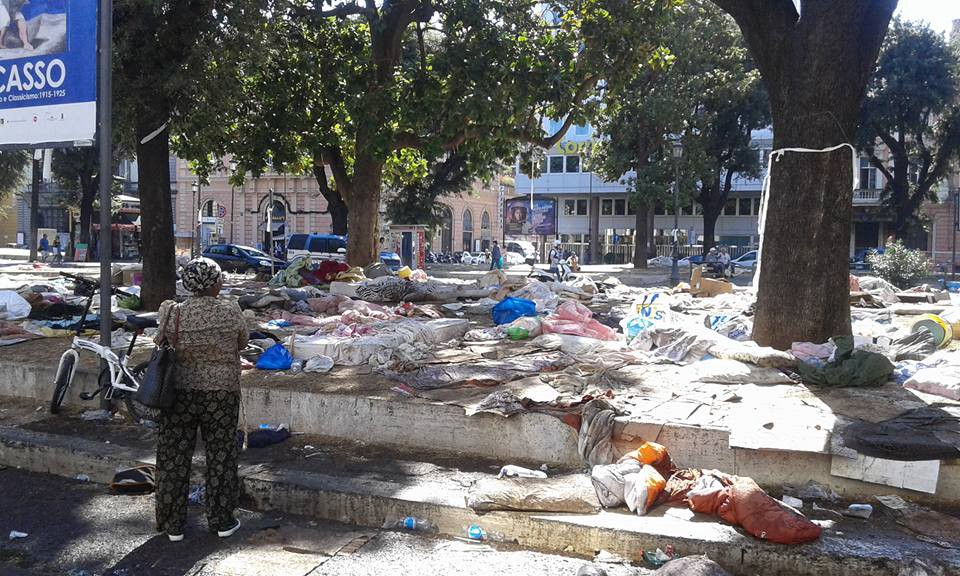
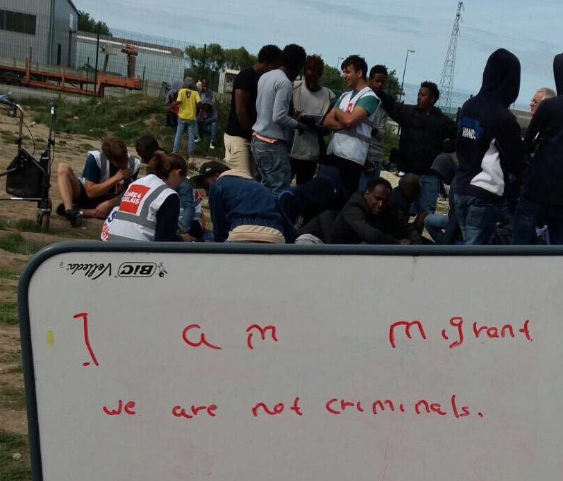
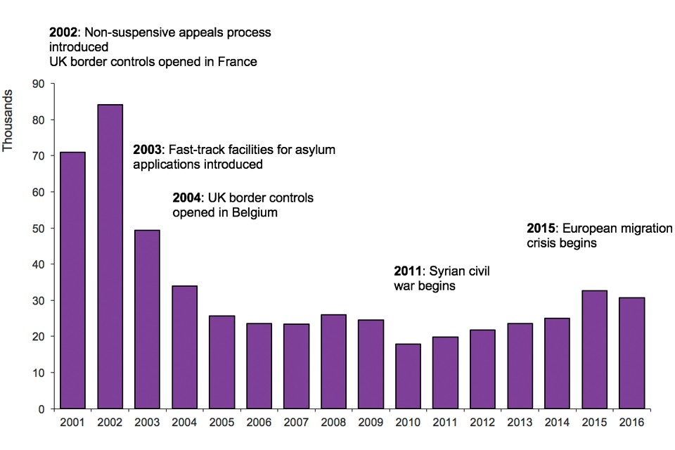

### AYS Daily Digest 24/08/17: “Don’t clean up the blood”: The aftermath of squat eviction in Italy

_Greece: Pakistani man found most likely murdered / Samos conditions worsen / Boat smuggling refugees intercepted / Men found in poor health condition after being found in Croatian freight train / Refugees continue to be relocated to Spain / Reports of tear gas sprayed at refugees with no warning in France / Norway closing “surplus” of centres / UK asylum acceptance statistics and deportation statistics / And more news…_

](assets/915ef77f5010/1*bMRYiAqcCUOYwO6lY0gGXA.jpeg)

Humanity 2017\. Photo credit: [**Luigi D’Alife**](https://www.facebook.com/profile.php?id=100013638159310)
### FEATURE: Horrific violence enacted upon refugees by police “evacuation”

Police “evacuated” refugees in a squat Piazza Indipiendenza in Rome and those squatting outside of it on the 24th with horrific force\. Those inside the center were not spared, as can be seen in the below video\.

Those who were “evacuated” with water cannons, and in some cases pepper spray, were all those who had received either a permit to stay or asylum and were on the list for housing, but still did not gain it yet, and so were forced to squat in a technically occupied building\.

Police justified the usage of water cannons after evidently some individuals used gas cannisters against the police\. However, many women were injured, with MSF Italy being the only NGO to treat them — around 13\.

UNICEF Italia also condemns the evacuation\. Children, who were hosted inside the building with their families, were taken to the Questura; they were frightened and shocked, kept crying and hitting the windows of the buses used to take them away\. Again, these people all have asylum and some of them even Italian citizenship\!

Photo credit: Sonia Manzi

They work in Italy and children go to school in Rome, private accommodation were offered in Rieti, but the long distance will break their regular integration process, plus the 80 places offered by the municipality in 2 different sprar structures will take away beds to those newly arrived who also need a place to stay\. This event reflects the poor migration policies of the local municipalities, this is not an emergency, it’s a lack of foresight\.

Full summary in English [here](https://www.hrw.org/news/2017/08/25/italy-police-beat-refugees-during-eviction) \.

Police additionally evicted and targeted refugees and migrants in front of Termini station where they were gathered with activists to demand housing\.

An Afghan migrant committed suicide in the centre of via Corelli, Milan\. He suffered from psychological distress and depression, managed to cross the border to Austria but was sent back due to Dublin\. The managers of the centre says that many arrive in need of psychological support and that the number will increase\. Read more [here](http://milano.repubblica.it/cronaca/2017/08/24/news/migranti-173758486/?ref=fbplmi) \.

These incidents all point to the desperate need for housing solutions to refugees and people of all backgrounds and “statuses\.” The denial of housing is part of the broader attempt to criminalize the existence of a person, driving them into the arms of the black market, only further stigmatizing them\. For as long as states insist on criminalizing bodies, we will continue to see pervasive acts of violence, which extent beyond these police actions and into the acts of self\-inflicted violence by those who have no other hope or escape\.
### GREECE

Registrations

[\#Lesbos](https://www.facebook.com/hashtag/lesbos?fref=gc&hc_location=ufi) 34
[\#Samos](https://www.facebook.com/hashtag/samos?fref=gc&hc_location=ufi) 49
[\#Kos](https://www.facebook.com/hashtag/kos?fref=gc&hc_location=ufi) 13
Total: 96

The Greek coast guard intercepted a boat smuggling 62 refugees near the Strofades island chain\. They were taken to detention and have not been registered to our knowledge\.

Fortunately, on Chios, in the case of the Syrian family whose application for asylum was rejected, they have been released from custody\. It’s a small step, but a step\.

In more tragic news, one 21\-year\-old man from Pakistan was found dead yesterday evening in Achaia, Pelopones\. The police are investigating this case of murder against immigrants\. Read more [here](http://www.efsyn.gr/arthro/nekros-entopistike-pakistanos-poy-eihe-pesei-thyma-apagogis) \(in Greek\) \.

The conditions on Samos have gotten no better and, in fact, have only worsened, heightening tensions\. As MSF reports, around 200 men, women, and children are sleeping rough on Samos\. Have the authorities forgotten the haunting images of tents covered in snow from this winter? Apparently so\.

■■■■■■■■■■■■■■ 
> **[MSF Sea](https://twitter.com/MSF_Sea) @ Twitter Says:** 

> > UPDATE: Up to 200 men, women and children are sleeping rough on the Greek island of #Samos after a recent wave of arrivals. https://t.co/5aPLfctrdZ 

> **Tweeted at [2017-08-24 09:35:15](https://twitter.com/msf_sea/status/900652714161577985).** 

■■■■■■■■■■■■■■ 

The following is a report by Danial J Chapman which was posted in Samos Volunteers detailing the situation

_Samos: The Forgotten Island, The hidden crisis\._

_“They treat us as less than human”_

_As I walked through the camp last night, I bumped into one of the unaccompanied minors who attends some of our classes at the Alpha Centre\. He was visibly upset\. When I asked him why, he replied “because THEY TREAT US LESS THAN HUMAN\. There is an elderly woman sleeping on the floor outside and when I try to offer my bed for her they refuse\. WHY DON’T THEY CARE?”_

_Why is it that the world seems to have turned its attention away from the crisis on Samos, yet here on the ground, the situation continues to deteriorate day\-by\-day?_

_During August so far, more than 800 people have already arrived on Samos, making the perilous journey by sea from Turkey\._

_While some people have been moved to camps on the mainland, the large number of new arrivals has increased the camp population up to nearly 2,000 people, in a space intended to hold 900\. You only have to walk through the camp to see the problems this over\-crowding causes\. Pop\-up tents fill all available space, providing inadequate shelter to the camp’s new inhabitants\. The camp consists of 33% children now, who criss\-cross between the pop\-up tents and make\-shift shelters\. There is one drinking tap in the camp and water for washing is available sporadically; scabies is rife\. People are stressed, mental health is deteriorating and support from the authorities is either limited or non\-existent\._

Read more [here](https://www.facebook.com/samosvolunteers/photos/a.567427800102051.1073741828.565209816990516/842243305953831/?type=3) \.

A post by Drop in the Ocean\! 
VOLUNTEERS NEEDED IN SKARAMANGAS CAMP

> A Drop in the Ocean needs more volunteers this fall in Skaramangas camp, Athens\. Lower age limit is 25 years\. You must commit to min 10 days\. German speakers are much needed to support our language classes\. Please visit our website [www\.drapenihavet\.no](http://www.drapenihavet.no/) to read more about our work and to sign up 

### CROATIA

Five men were hospitalized, mostly with minor injuries and dehidration, after they were found in cargo containers at the Ogulin train station\. One man was almost completely soaked in tar, which was transported in barrels inside the train, and needed more medical assistance\. His condition is also stable, AYS is told unofficially\. An unconfirmed count of eight more people were found on cargo trains in Karlovac earlier this morning\. They were taken to the police station for questioning\. Both groups presumably arrived from Serbia, on a train towards Italy\. We’ve reported on several similar cases in the recent months, including one deadly train accident which happened at the Vinkovci train station in May\.
### SPAIN

164 refugees from Syria, Iraq, and Yemen arrived in Spain from Greece on the 23rd via the relocation program\. This happening in the continuing context of the recently invigorated route to Spain from North Africa\. It is yet to be seen how the discourse around refugees will be affected in the wake of the horrific terrorist attack in Barcelona, but it is hoped that people will see that banning refugees and resisting people fleeing similar violence is not the solution\.
### FRANCE

Report from a volunteer in France:

> At Jaures, at the asylum offices I was waiting to meet a friend\. Maybe 60 guys were waiting outside to claim asylum, others resting on the ground\. Without warning the CRS began tear gassing people\. There was no fighting or any other issues that I saw\. 

> Apparently, that was the third time they’d been gassed today\. The CRS then made the guys who were just resting on blankets move, again threatening them with gas\. 

> From a good distance I tried to video what was going on\. Two CRS chased after me and made me delete it\. 

Photo credit: Care4Calais

Refugees in France are still reeling after the “evacuation” of Porte de la Chapelle \*again\* last week\. In all 2,400 people were evicted, with 430 being taken to the Université Paris\-Descartes in the city’s South while the remaining individuals were “redistributed” to around 20 “temporary reception and orientation centers” if that doesn’t sound Orwellian enough\.

■■■■■■■■■■■■■■ 
> **[Sharif Bibi](https://twitter.com/sharifbibi) @ Twitter Says:** 

> > Around 100 #migrants sleep in each of the gymnastics halls in the temporary reception centre @[InfoMigrants_fr](https://twitter.com/InfoMigrants_fr) https://t.co/RaTrfm8EyC 

> **Tweeted at [2017-08-18 10:49:12](https://twitter.com/sharifbibi/status/898496998265040896).** 

■■■■■■■■■■■■■■ 

■■■■■■■■■■■■■■ 
> **[Sharif Bibi](https://twitter.com/sharifbibi) @ Twitter Says:** 

> > Around 30 #tents were built in the #courtyard in addition to 2 gymnastics hall where the #migrants are supposed to stay @[InfoMigrants_fr](https://twitter.com/InfoMigrants_fr) https://t.co/3JcbGC7YLW 

> **Tweeted at [2017-08-18 10:42:25](https://twitter.com/sharifbibi/status/898495292286406656).** 

■■■■■■■■■■■■■■ 

### NORWAY

According to The Local, the Norwegian immigration authority is reducing capacity by a further 1600, claiming that there are many more spots compared to the number of asylum seekers needing them\. However, the decision is expected to effect under\-aged asylum seekers as they will have to be relocated to other spots\. Even at the “peak” of the refugee crisis in 2015, Norway only had around 31,000 asylum seekers arrive\. See the original story [here](https://www.thelocal.no/20170824/norwegian-asylum-centres-places-to-be-reduced-by-further-1600) \.
### UK

[A](https://www.facebook.com/groups/1652972374920129/permalink/1894103680806996/) ccording to statistics by the UK government, asylum applications in the UK have dropped by more than half in the last 15 years, with the sharpest decrease happening between the years 2002 and 2003\. This from a report listing the number of asylum grantings this year at 16,211, a 7% increase over this same period last year\. However the long\-trend data shows that in spite of wide media discussion, the European sphere of the refugee crisis had little effect on successful asylum petitions in the US\.

Statistics courtesy of Gov\.UK

In addition, new statistics regarding detention and return were released:

> The number of people entering detention in year ending June 2017 decreased by 12% to 27,819 from 31,593 in the previous year\. Over the same period there was a 13% decrease in those people leaving detention \(from 32,067 to 27,862\) \. 

> As at the end of June 2017, 2,994 \(of which, 2 were children\) people were in detention, 4% more than the number recorded at the end of June 2016 \(2,878\) \. In addition, as at 26 June 2017, there were 360 detainees held in prison establishments in England and Wales solely under immigration powers as set out in the Immigration Act 1971 or UK Borders Act 2007\. 

Read more [here](https://www.gov.uk/government/publications/immigration-statistics-april-to-june-2017/how-many-people-do-we-grant-asylum-or-protection-to) and [here](https://www.gov.uk/government/publications/immigration-statistics-april-to-june-2017/how-many-people-are-detained-or-returned) \.

A lorry from Romania was stopped and 13 men were removed from it, some of them needing medical attention\. The driver was arrested and ten of the men were taken in to custody as well, with three needing medical attention for heat exhaustion\. Read more [here](http://www.independent.co.uk/news/uk/home-news/lorry-driver-arrest-human-trafficking-14-men-back-rugby-warwickshire-police-mangrove-services-a7910911.html) \.

> **_We strive to echo correct news from the ground, through collaborationand fairness, so let us know if something you read here is not right\._** 

> **_Anything you want to share — contact us on Facebook or writeto:areyousyrious@gmail\.com_** 

_Converted [Medium Post](https://areyousyrious.medium.com/ays-daily-digest-24-08-2017-dont-clean-up-the-blood-the-aftermath-of-squat-eviction-in-italy-915ef77f5010) by [ZMediumToMarkdown](https://github.com/ZhgChgLi/ZMediumToMarkdown)._
