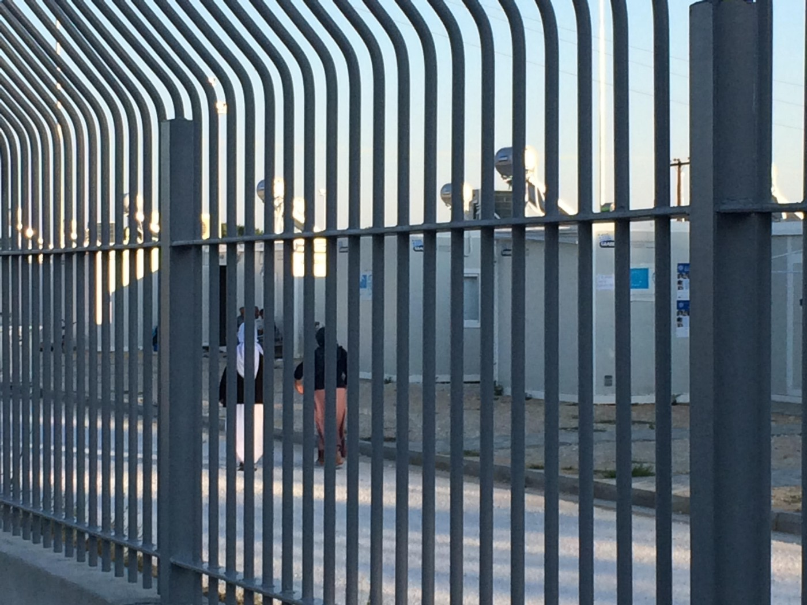
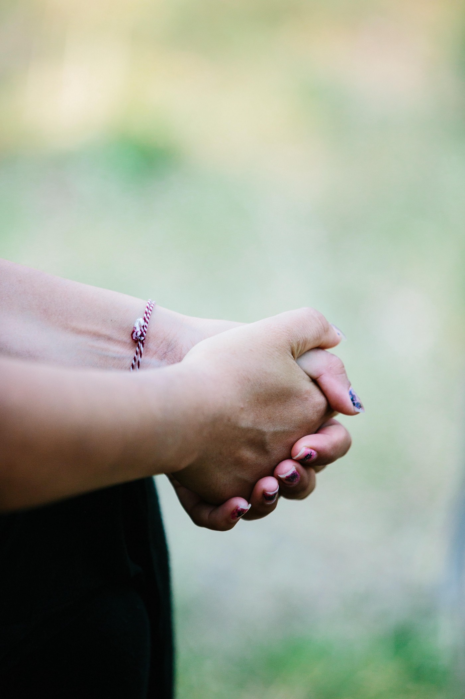
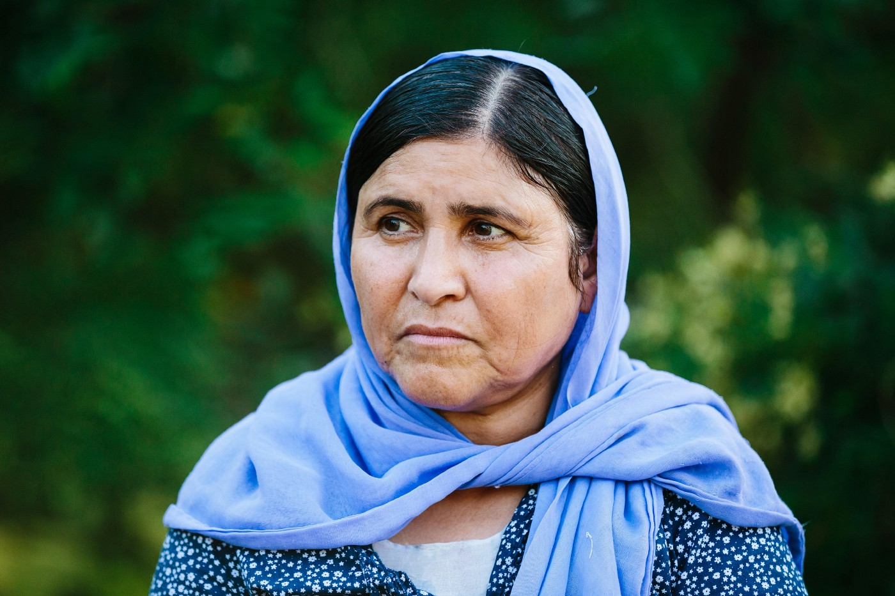
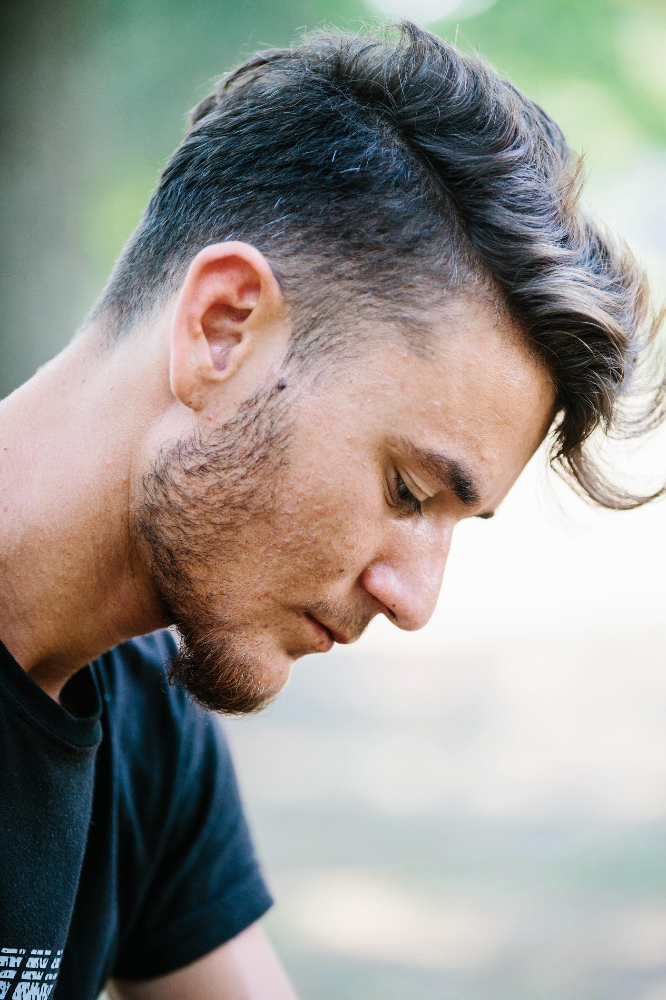
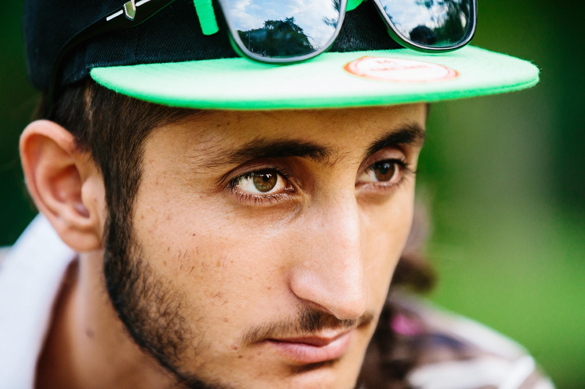
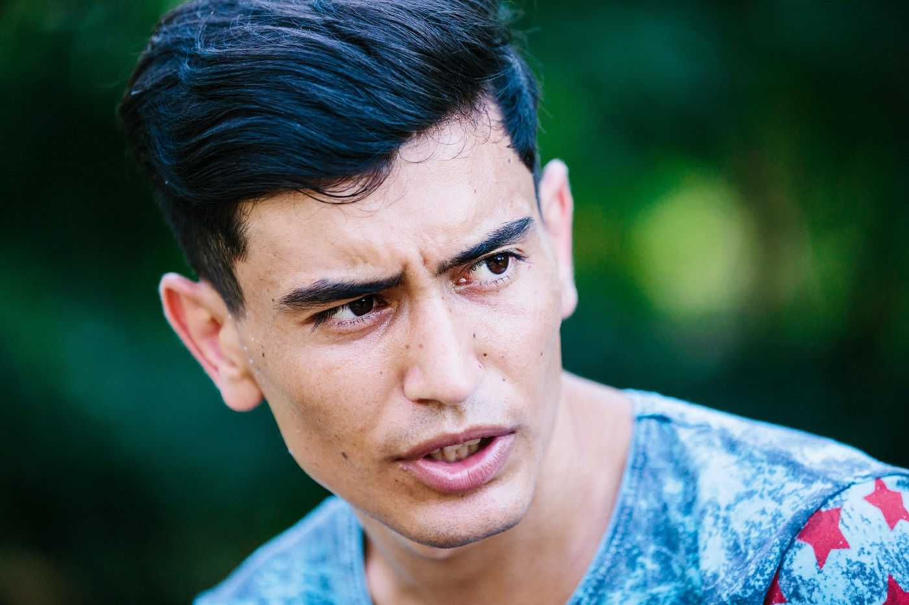

### AYS SPECIAL: From Hell to Purgatory

_Three years after escaping genocide, a group of Yazidi refugees in Greece are still waiting to restart their lives in Europe and, as some of them said, to see humanity\._

Camp in Serres\. Photo by James Burgess

The refugee camp in Serres, northern Greece, is one of many small camps scattered through the country, another site that has become a more permanent fixture than expected\. The rows of air\-conditioned portacabins are home to around 300 Yazidis, a religious minority from northern Iraq\.

Like many refugees in Greece, they have been stuck in the country for over a year, waiting for the creaking bureaucratic systems and political standoffs of the EU and Greece to play out\.

The 3rd of August marked the third anniversary of the genocide aginst Yazidis by ISIS that swept through the Sinjar, northern Iraq, in 2014, rounding up civilians, killing men, older boys and people, and imprisoning women and children\. Women and girls were sold into slavery within ISIS networks where they were, and continue to be, raped, beaten, sexually abused and forced to work\. Young boys were separated from their families, indoctrinated and trained to fight for ISIS\. Some women and children have been freed following the recapture of Mosul by Iraqi forces, but thousands more remain in captivity in ISIS strongholds around Raqqa, and the physical and emotional trauma of their ordeals has done lasting damage\.

However, some people managed to escape only to arrive to Greece, bringing with them selves frightening stories of fleeing to Sinjar mountain or to Iraqi Kurdistan, before making long journeys across Syria and Turkey\. Many of them still have family or friends left behind, killed or held in captivity\.

These are some of their stories told in the camp\.

**Escape**

Soswil \(not her real name\) is a refreshingly young\-looking 17\-year\-old \(many of the people in the camp look old beyond their years\) \.

_“The day of the genocide I was with my family, except for my father\. He was at war fighting for us\. We fled to another village and hiding in a house\. There were a lot of old people and children\. At 2 o’clock in the morning we wanted to flee, but we realised the old people and children couldn’t\. At 4 o’clock in the morning we knew they were coming and so we waved a white flag\. They took the guns from the men, and separated the children, women and men from each other\. Then they took the girls at 7am, and the ISIS soldiers said ‘let’s do something with the girls\.’ One of the IS commanders came and said ‘no, no, no, they are in my hands, so you don’t touch them\.’”_

Soswil and her family managed to escape from a house where they were being held, when the Isis troops fled fearing the Kurdish PKK were advancing\. But many were not so fortunate\.

Guli, a middle\-aged mother of 11 children\.

_“My brother’s daughter was captured, and they took her seven children with her\. After three years now we just found out she got freed again\. My uncle, poor old man, he couldn’t hear\. He was stuck in Sinjar and they caught him, and we still don’t know what happened\.”_

Kordi, a 33\-year\-old mother of six, whose husband is in Germany, came face to face with Isis\.

_“They took the men from us and took them to the streets to kill them there\. My three cousins, husband, and uncle had to put their hands on the back of their heads, and we were praying to God and said, ‘We know you will kill us right now, and God is seeing it\.’_

_Then another man came, and we knew that these people were neighbours and our friends in the past, but we couldn’t see their faces because they all had black masks on\. One of them put his hand on another’s gun and said, ‘Put it down because they can’t flee, because if they do they’ll try to walk past us\. Let’s first take care of the others\.’_

_“They went to the other houses and took all the men outside and killed them in front of us and took all the bodies and piled them on each other in a huge pile\. When they killed our men, women were screaming and running through the dead bodies and trying to wake them up\. The soldiers pulled them by their hair and threw them into cars\. Then we fled inside and hid in our garden\. We waited until 6 in the morning and then we tried to escape\. We made ourselves small and tried to walk step by step\. I held my children’s mouths so they wouldn’t scream\. We were walking from village to village, hiding, until midnight\. From that day on my daughter didn’t speak anymore, still to this day\.”_

_Smer Brahim Bajo, in his 70s, fled on foot from his village north of the Sinjar mountains, after putting his family in a pickup truck to escape\. “We didn’t have enough space in the car,” he said\. “It was a very small car, but we still tried to press 30 people in it\.”_

Guli, who has only one kidney and high blood pressure, spent 7 days on the mountain\. She had a small bottle of water and was trying to ration it\.

_“There was a woman walking past with her three sons, and I realised how thirsty her kids were and I couldn’t do it any more, so I gave them my water\. She said ‘no, you need to take it\.’ I said ‘no, it doesn’t matter\. It’s just like I’m fasting today, I won’t eat and drink today\.’ She gave a little bit to one child, and the other two went a little bit crazy, so I said to give it to all of them, and I gave it\.”_

**Journey**

There followed months and years of waiting in camps in Turkey, Syria and northern Iraq, before families made the perilous journey to Greece, searching for safety or a way of continuing with their lives, paying traffickers thousands of euros in smuggling fees\.

Haji Xelil \(not real name\), a former Iraqi military police officer in his mid\-40s, fled to Iraqi Kurdistan when he saw ISIS fighters approaching his village\. But they couldn’t stay long in Iraqi Kurdistan\. There were no prospects of peace and security, and they felt still too close to the conflict\.

_“The Kurdish people living there helped our people a lot\. The government didn’t take care of us\. I left Kurdistan because I couldn’t handle it any more, after 17 days\. We were trying to leave to Turkey through the Kurdish border mountains, and I had the feeling that I would probably fall down and die, that I couldn’t do it any more\. We were walking for 8 or 9 hours\. I was walking with my mother and always putting her on my back to carry her\. The PKK helped us, and put the disabled and elderly people on animals like donkeys and horses to help us reach the border faster\. Some of them fell off the animals and onto the mountainside and died there\._

_I went to a PKK camp in Turkey\. We waited there until the 20th of February 2016, then we left\. A lot of people went to try and go to Europe, so we said to ourselves we would do the same\.”_

Haji had to borrowed money to pay the smugglers to get on a smuggler boat to Greece\.

Hashim, a bright young student with an interest in engineering, had been making model boats and diggers with hydraulic arms in camps in Turkey before having to leave to continue his journey with his family to Greece\. Now 18, he is with two of his sisters, but the rest of his family is still in Turkey\.

_“We were in a boat, the size was 1 metre wide and 8 metres long, and there were 60 people on the boat,” Haji said\. “We were on the water for 4 hours, and the boat was filling with water so our feet were wet\. It was hard for us, but we reached Greece\.”_

Many had endured a similar ordeal\.

_“The smugglers called us and told us we needed to blow up the boat we were going with,” Smer said\. “There was something like a board,” he indicates the wooden bench we’re sitting on while talking, “that we needed to put inside the boat so that it would stay flat\. It was built for 25 or 30 people, but there 60 people in it\. We were like chickens in a coop, pushed together on top of each other\.”_

As with so many others, what they have found after risking their lives yet again crossing to Europe is a confusing, bewildering limbo land of scant information, painfully slow bureaucracy and an uncertain future\. Many have waited for over a year in camps in Greece\. They are safe, they now have shelter and basic provisions, but the freedom to continue their lives is absent\.

_“I don’t like it here,”_ Soswil said\. _“I miss my father a lot\. He left one year earlier than us to go to Germany, and I was so happy when I heard about it in Turkey that we are going to my father, and now we are stuck here\. I’m with my mother and my siblings\. I have one sister here and a brother, and my other two sisters are already in Germany\. They got transferred over there\.”_

**Camp**

The Yazidi community was transferred to Serres last year following tensions with other communities in Nea Kavala camp\.

_“We were again in tents, and we made our food on fire here,”_ Soswil said\. _“First they brought us to apartments in Nea Vrasna and said ‘you will stay here for 4 months, then we will take you back to boxes that will look like your home\.’ But they weren’t like our homes\. They were still bad, but better than the tents\. In tents, when it was raining, our clothes got wet\. And now, I’m still here\. It’s been around a year and eight months that I’ve been living in Greece\.”_

Some are more positive about their present situation like 21\-year old Hamo who said that he wish all his family could bein Serres\. _“Our plan wasn’t to stay in Serres, it was to move on, but Serres is still good\.”_ His younger brother is alone in Germany\. Most of the rest of his family is going through the reunification process to move to Germany, but he and two brothers have separate files with the Greek asylum office because they are over 18\.

But the frustration with the reality of existence as a refugee in Europe is palpable\. _“I thought we were coming to Europe to see human beings, and wanted our kids to see these human beings that we’d heard about in Europe,”_ one man said to me\. “And until now we are in camps, and we haven’t seen any good treatment or humanitarian help\.”

Recently, NGO services are being withdrawn from this camp as EU funding is redirected from international NGOs to the Greek government\. Gaps are starting to open up, as NGOs pull out before a replacement is in place\. Save the Children, who were providing education in the camp in Serres, left at the beginning of August as their funding came to an end\.

Language lessons and music activities provided by the small grass\-roots organisations We Are Here and Lifting Hands continue in the park nearby for adults and teenagers, with the camp managers refusing access to them\.

_“It was very hard for me,”_ Said tells me\. He’s in his mid\-30s, a single parent of 3 young girls\. _“Very hard\. Because they took a lot of care of my children\. In the morning they came and took care of my kids, and I had some space for me\. But suddenly, I have to take care of them all the time\. I bring them to the park with me, because there’s no one else to take care of them\. My kids still can’t sleep, because they areafraid\. They still think someone is coming\.”_

Clear information is in short supply in the camp, and everyone tells me they don’t know when their case will be heard or when they can expect a decision on their asylum claim\. Also, translation are not sufficient, especially for the Kurdish dialect that the Yazidis speak, and paperwork is often in Greek and English\. It is also clear that psychosocial support and counselling services are badly lacking, given the trauma people have experienced\.

Zaid, a young man in the camp who has brothers in Germany, tells me\.

_“I know I have got psychological issues\. I’m always going to the psychiatrist in the camp, and they tell me, go over here and get some classes\. And I’m trying to, but I can’t sleep at night\.”_

_“Nobody is there anymore from the NGOs,”_ Kordi said\. _“I come sometimes to the German classes here\. I like the teacher a lot\.” But she is still worried about her children, and doesn’t know when she’ll be reunited with her husband in Germany\. “We’ve taken my daughter to a specialist here in Greece twice, and they said, ‘she will get over it, she is traumatised and that’s the reason why she doesn’t talk,’ but she still to this day hasn’t started speaking\.”_

**Waiting**

Every few weeks, more of the Yazidis are finally transferred to Germany, or occasionally another country, giving an opportunity for new starts, but the rate of transfers is painfully slow, and Germany has imposed lower limits on the monthly quota of people it will take\.

Kordi’s husband has been living in Germany for a year\. _“We spent a lot of money to get transferred, because in Germany we needed to get our papers together and our marriage certificate translated into German and the documents showing that these are my children translated into German,” she said\. “My husband even borrowed money to get all the paperwork ready for us to go there\.”_

In the park I met Zidane, a confident, smart 18\-year\-old who had come from Germany to visit his family stuck in Greece\. He had gone with other family members overland from Turkey, first to Bulgaria, then through Serbia, Bosnia, Croatia and Austria before finally reaching Germany\. His family paid a smuggler €6,000 to take him as far as Serbia, and from there they were on their own\. His family should be reunited with him in Germany when the application process is finally completed\.

_“Sometimes I think about my journey from Iraq to Germany, but I don’t really want to think about it any more,” He said\. “Because that was part of my childhood, and I want to focus on my future\. I’ve closed that part\. In the beginning I still had pain thinking about it, but right now I’ve given it a place in my life, and I just live right now\.”_

I ask him what he wants to be when he finishes his studies\. _“I want to be a lawyer, but for the people, not for the government\. Because in my former country we don’t have law and order or rights that you can enforce\. I really want to make a difference in that\. We didn’t have rights and I want to help people\.”_

Others express hope for the future too\. Family and community is a recurring theme\. _“I just wish to see my son again, and that we are all family together,”_ Smer said\. _“This is what I wish for us, that we are all together again\.”_

Some things are lost forever\. Some things cannot be undone\. The occasions when people are resettled give hope\. But the scattering of this community, with families strung out between Iraq, Turkey, Greece and Western Europe, could be devastating\. Some of the people are saved, but the culture is threatened\. Yazidis do not marry outside of the Yazidi community, and conversion to the religion is not possible, so the scattering of the diaspora is devastating\.

_“One thing I want to let the world know about Yazidis,” Zaid said at the end of our conversation\. “I just want to let the world know that we exist, that we are not hiding\.”_

**By James Burgess is an independent journalist in Greece\. Photos by Shannon Ashton**

> **_We strive to echo correct news from the ground, through collaborationand fairness, so let us know if something you read here is not right\._** 

> **_Anything you want to share — contact us on Facebook or writeto:areyousyrious@gmail\.com_** 

_Converted [Medium Post](https://medium.com/are-you-syrious/ays-special-from-hell-to-purgatory-4232d2e0479c) by [ZMediumToMarkdown](https://github.com/ZhgChgLi/ZMediumToMarkdown)._
