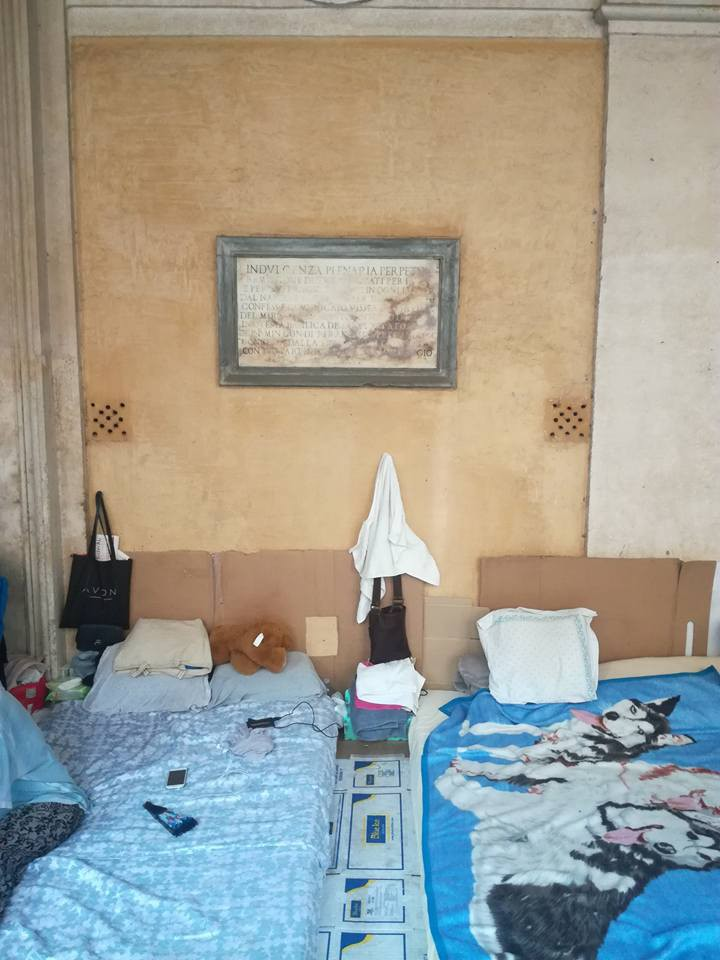
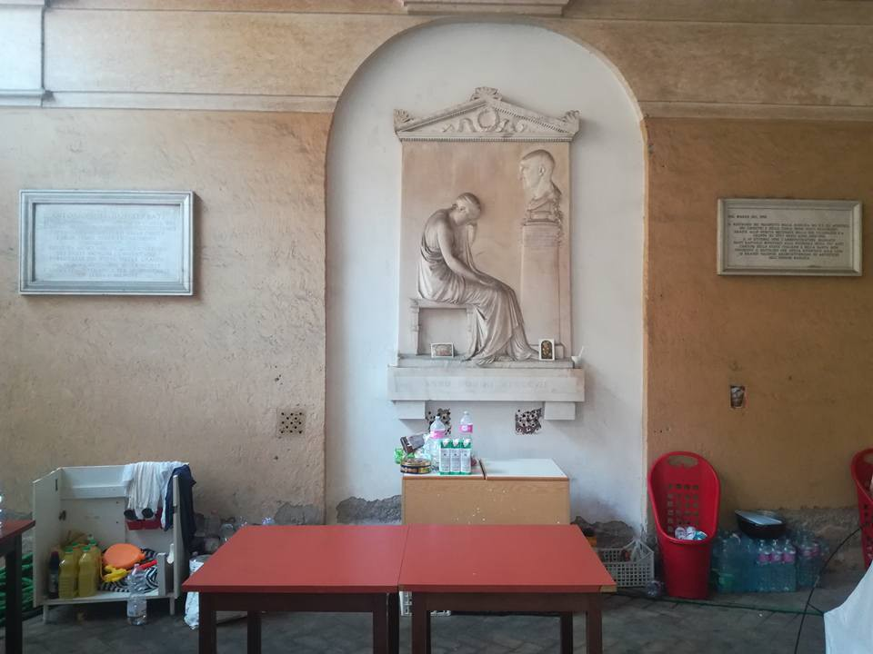
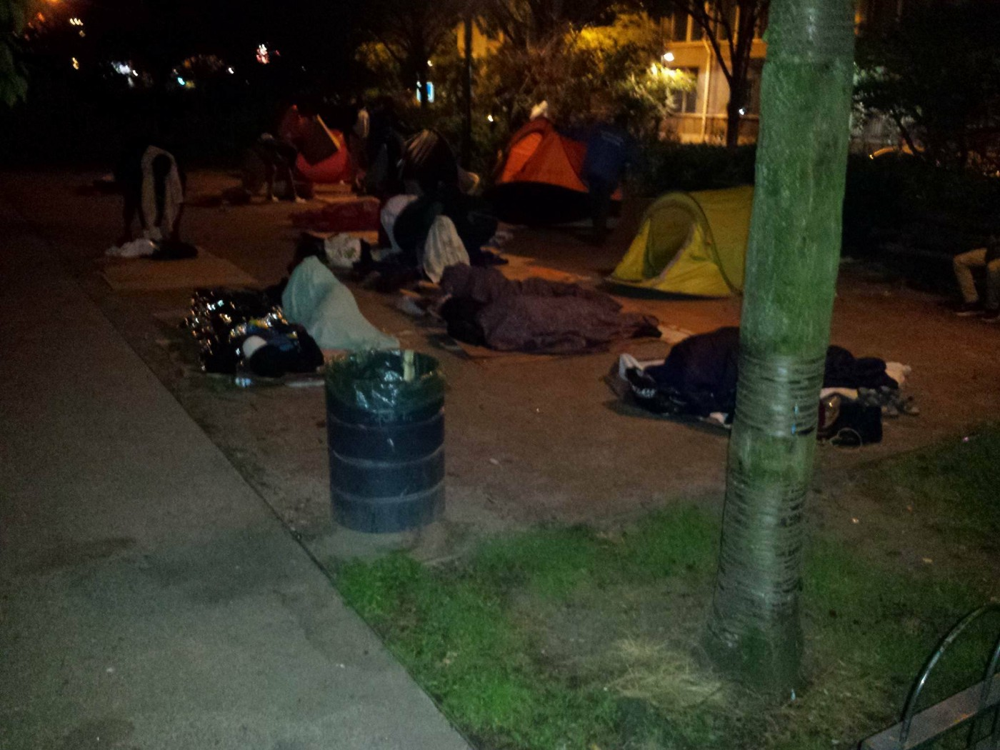
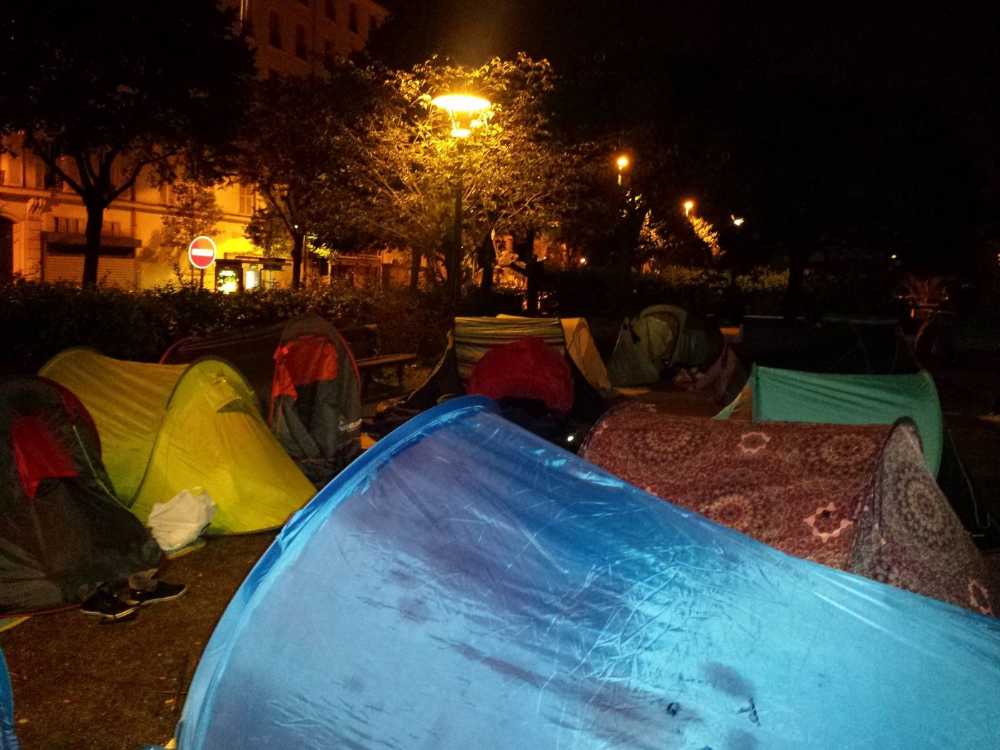

### AYS Daily Digest 28/08/17: Parallel worlds created in Europe

_While people are sleeping rough on islands, about 30 percent of UNHCR accommodation facilities empty / 100 people marched in Lesvos to protest living conditions / 9,000 registered migrants in Rome / New street camp in Paris / Help desperately needed on islands, in Athens, on the sea, in Paris, and in Rome / And more news…_

 \.](assets/49ca95704d75/1*sHXF8ABK3VgM4_zW7asuag.jpeg)

Rome, Italy\. Photo by [Roberto Viviani](https://www.facebook.com/robbevabbe/posts/10155775617829407) \.
### Feature

Today more than 100 people arrived only to Samos island, Greece, on two boats — one carrying 52 and the other 63\. Among those who arrived were, again, many children\. So far in August, over 1000 people arrived at Samos\.

[Volunteers in Samos](https://www.facebook.com/samosvolunteers/posts/844043369107158?fref=gc&hc_location=ufi) , who are still doing what government and the UNHCR should do, need help to continue assisting those who are arriving\. Volunteers are providing them with a change of clothes and shoes, and [asking you to donate](https://docs.google.com/…/1H9REFFm36mHEndAG4q0AMkDHXEV6H5L…/) some of the much\-needed items, including new underwear, socks, T\-shirts, joggers/sweatpants, sleeveless vests…

Similar, or even worse, is the situation on Lesvos where currently over 6000 people are packed\. As well as on the other islands, volunteers provide basic assistance upon arrival, and they need help calling more volunteers to come\.

 detention camp say it all: this is how Europe treats people in need\.” @SeaWatch](assets/49ca95704d75/1*4vcitq7W-StdedAynSR9Qw.jpeg)

“These pictures from [\#Moria](https://twitter.com/hashtag/Moria?src=hash) detention camp say it all: this is how Europe treats people in need\.” @SeaWatch

Unbearable situation pushed people once and again to protest on Lesvos\. This time, the Afghan community — around 100 people — from Moria marched from the detention center into Sappho Square, at the heart of Mytilene city, Lesvos, where around 40 of them decided to spend the night\.

[No Border Kitches Lesvos](https://www.facebook.com/NBKLesvos/?hc_ref=ARQ3VWcda4MHn_5m4QuMOacOZXTpSz2uzyLqEgQbMIc0Ucu0XGKLdTQAwFESL8BKjBI&fref=nf) reports:

> “Moria is full to bursting these days — perhaps a thousand over capacity and swelling\. New arrivals are sleeping rough among the containers\. Self\-harm, violence, and health crises are endemic\.” 

Those who are protesting wear t\-shirts with the date of their arrival\. Some are on the island for 9 months, some 12 or even 18, and they do not know when they will be able to leave it and continue with their lives\.

■■■■■■■■■■■■■■ 
> **[City Plaza Squat](https://twitter.com/sol2refugees) @ Twitter Says:** 

> > #refugees in protest in#Lesvos. They came 2 the city center, camp there &amp; say "we do not go back to the #Moria #DetentionCenter" #Solidarity https://t.co/SNebBPnPzo 

> **Tweeted at [2017-08-28 17:44:49](https://twitter.com/sol2refugees/status/902225471781433344).** 

■■■■■■■■■■■■■■ 

It is not much better on Chios where only in August over 600 new arrivals were registered\.

Many people arrived at different small islands in Greece, while the number of those crossing from Turkey over the Evros river also increased since May this year\.

Unfortunately, this weekend two of those who tried to come from Turkey have been killed after being hit by a passenger train in northeastern Greece, between the city of Alexandroupolis and Dikaia\. According to the police report, the two men had been walking along the tracks when they were hit\.

While islands are overcrowded, many camps on mainland are half empty\. Even more, many apartments provided by the UNHCR are empty\. According to the official UNHCR data, only about 68 percent of their accommodation facilities are occupied currently\.

### Sea

Over the last few months, sea rescue boat crews are seeing more people with severe injuries coming from Libya\. Sea Watch, one of the crews who is still operating, are [asking for help](https://sea-watch.org/en/donations/) \.

_“The doctors on our ship are often witnesses of dramatic situations: they see refugees collapsing completely dehydrated or pregnant women who are collapsing from exhaustion\. Help to equip the Sea\-Watch 3 so that we can provide aid in medical emergencies\!”_
### Greece

While islands are bursting with people who are trapped for months there, and those who are coming now, and on mainland many still live in ugly camps, the European Union countries decided to start sending people back to Greece\. So far, according to the media, only Germany has made nearly 400 requests for return\. Greek government received requests from the UK, France, the Netherlands, and Norway, too and the first returns are expected to happen soon\.

Returns are happening in accordance with the “Dublin regulation,” according to which refugees must file for asylum in the first EU country they enter\. If they leave that country without approval, they can be sent back\.

Until now, no people were returned since it was considered that condition in Greece is not good\. Suddenly, the EU opinion is that everything changed in Greece and that it is good enough to return people\. Being in the field, it is hard to see any improvement in living conditions for people\.

Living conditions improved so much that people not only on islands but also on the mainland are protesting again\. [Ekathimeri report about the protest](http://www.ekathimerini.com/221180/article/ekathimerini/news/migrants-protest-over-living-conditions-at-derveni-camp) in Derveni camp, near Thessaloniki due to poor living conditions\.

In the meantime, many groups active in Greece are asking for help\. One of them is the Amurtel Greece, a group that is working for Refugee Mothers and Babies\. On their list of needs are only basic:

_Clothes for infants 3–6 months \(We have plenty of clothes for newborns, so please only bigger sizes\! \)_ 
_Small plastic bags \(for portioning food/diapers\)_ 
_Plastic shopping bags \(new/used — Give us what’s under your sink\! \)_ 
_Copy Paper \(regular white\)_ 
_Lentils_ 
_Rice_ 
_Raisins_ 
_Almonds_ 
_Dried fruit or nuts_ 
_Bras \(New or gently used\)_ 
_Women’s Panties \(new\)_ 
_Breast Pumps \(electric or hand\)_ 
_Power Strip \(with five or more sockets would be best\)_

_From the pharmacy:_ 
_Non\-Powder Single\-Use Gloves — Medium — Non\-Sterilized_ 
_PH Test Paper — Base — Pink/Purple_ 
_Paper for Examination Bed — 50x50 — Premium Plastic Roll_ 
_Urine Pots with Lids — Non\-Sterile_

[If you can help, get in touch with Amurtel](https://www.facebook.com/AmurtelHellasforRefugeeMothersandBabies/) \.
### Italy

According to the [Info Migrants](http://www.infomigrants.net/en/post/4796/about-9-000-migrants-officially-housed-in-rome-structures) , nearly 9,000 people are currently housed in Rome and its province\. However, these are just those who are registered and hosted in official structures\.

_“Rough estimates put the number of migrants in transit who enter the city on a daily basis at between 300 to 500\. They aim to reach other destinations and they don’t register with any official aid channels in the city\.”_

In the meantime, many of the people who were evicted several days ago in Rome, in a brutal and violent way by the police, are still sleeping in the streets\. Around 800 people were evicted from the squats they lived in, and that was occupied since 2013\.

Photo by Roberto Viviani\.

The media in Italy today reported about the possibility that the officials will come out with the proposal to relocate people who were evicted to houses\. According to the daily La Repubblica, around 600 building are empty in various cities in Italy, and those could be used to host people in need\. One of the ideas is to use property confiscated from the mafia, too\.

However, transfer far away from Rome could mean delay for many children who are already registered in school to enroll in schools in other cities\.
### France

Another report by the [Paris Refugee Ground Support group](https://www.facebook.com/PRGS.team/?ref=gs&hc_ref=ARTOLzi4i0ZrUhzZP0uQg0JDq1-PDIua1fFJ75skn9wtrou0paNaTGWm4E0BIGl8p-Q&fref=gs&hc_location=group) :

_“The continuous cycle of people searching for somewhere safe to reside and the authorities periodic evacuations turns once again\. The evacuation of around 2500 people took place 2 Fridays ago\. Since then, the authorities have kept up their “out of sight out of mind” facade for the public\._

_They have banned distributions except for breakfast\. But even then, they are not allowed to eat their food in the area in which they received it\. The people line up in the morning to get into the Port de la Chapelle Bubble camp\. There are minimal spaces to offer, and hundreds of people\. After a time, the police herd them like sheep through the streets, away from the camp\._

_The cycle of street camp evictions and demolition turn again tonight\._ 
_A new Street camp was formed in St Denis tonight\. There are around 350 people there\. If the camp survives the next day or so, the numbers and needs will rise rapidly\._

_We need your help to continue providing the essential survival items that the people living in such tough conditions need\.”_

Paris in the night\.

If you can help, [please donate here](https://www.gofundme.com/prgsdonate) \. Or just go out in the streets and help\.

Among those who are sleeping in the streets of the city of light, in one of the richest countries of the world, there are kids from Chad two\. [Volunteers met two of them who told horrific stories of torture\.](https://m.facebook.com/story.php?story_fbid=1964127187200725&id=1806225229657589&fref=gc&hc_location=ufi) Both needed medical help that was provided by volunteers\.

Also in [Calais, people are helping people](https://www.facebook.com/groups/CalaisMigrantSolidarityActionFromUK/permalink/1617403291667745/?fref=gc&hc_location=ufi) , and the government is nowhere to see, but when they send police to use the force against volunteers and migrants\.

](assets/49ca95704d75/1*fmkasNYWBDNkihORmCyXBQ.jpeg)

Mobile showers in Calais\. Photo by S [ylvain de Saturne](https://www.facebook.com/sylvain.desaturne?fref=gs&hc_ref=ARSBn-hNf5SAoiBTKa42mYvcTtpkJo5-pfvTpoP7Y_DKJFyfTwSsAqpPIAsmaMpTp88&hc_location=group)

Meanwhile, leaders from seven African and European countries, meet in Paris for a mini\-summit to discuss “how to ease the EU’s migrant crisis”, AFP reports\. What they concluded is, in summary, to tighten borders controls even more\. Looks like they learned nothing, and are completely blind and death for all the appeals and reports by various groups, organizations, and academics saying that closed borders are not the solution\.

> **_We strive to echo correct news from the ground, through collaboration and fairness, so let us know if something you read here is not right\._** 

> **_Anything you want to share — contact us on Facebook or write to:areyousyrious@gmail\.com_** 

_Converted [Medium Post](https://areyousyrious.medium.com/ays-daily-digest-28-08-2017-parallel-worlds-created-in-europe-49ca95704d75) by [ZMediumToMarkdown](https://github.com/ZhgChgLi/ZMediumToMarkdown)._
