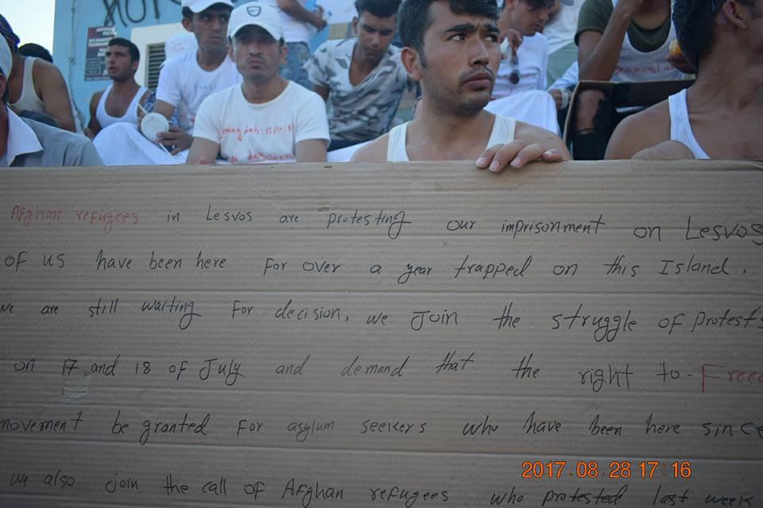

### AYS Daily Digest 29/08/17: Another day, another protest against deportations to Afghanistan

_500 people saved in Libyan waters / No deaths at the Mediterranean in 20 days, IOM says / More police violence in France / Spain, Italy, Germany, and France in a new agreement, leaving many questions unanswered / Germany and Egypt also discussing migrant deals / Human rights are still not for everyone everywhere / And more news…_

Afghan protesters at Lesvos\. They are stuck in limbo, but at several places\. Photo: Arash Hampay
### “Stop deportations to unsafe Afghanistan\!”

Afghan people are becoming political activists on European soil, since there is no justice for them here\. On Lesvos, at Sappho Square in Mytilini, people have been protesting since yesterday against bad conditions and exclusion in Greece and the European Union as well as against deportations back to Afghanistan\. They are also showing their support for [last week](ays-daily-digest-22-8-17-ngos-preventing-camp-residents-from-joining-protests-aa791bb154c4) ’s protests\. As mentioned yesterday, they walked from Moria to Mytilini wearing T\-shirts with their dates of arrival\. For many, it is months or even years ago\. As of today, they remain on the square\. In Stockholm the protests against deportations have been ongoing for more than 22 days now, and the young people are still sleeping outside in protest\.

Desperation is growing in this group even as the situation in their country of origin remains the same as when they fled or even worse\. The mental pressure these often young people are under is unimaginable, as are the many stages they have to go through — it’s not only about reaching their final destination, it’s also about getting to stay\. Someone’s dream is someone else’s limbo\. Afghans stuck along the Balkan route dream of becoming asylum seekers in northern Europe, while those already there suffer in the next mandatory step\.

People are beginning to speak up more and more\. Still, neither the EU nor individual countries seem to be listening\. AYS has received information about similar protests emerging in Finland, Germany and Austria\. And the Afghans in Mytilini and central Stockholm have exactly the same message: stop neglecting us, and stop sending us back to uncertainty\. If anyone knows what is going on in Afghanistan, it is the Afghan people who are organising themselves right now\. In Stockholm, young Afghans recently put on a performance showing what Afghanistan looks like in reality — according to those who have actually been living there\. The performance both showed their fears for the future and for some people, horrible pictures from the past\. Facebook has hidden some of the content at [Ung i Sverige](https://www.facebook.com/ungisverige.nu/) ’s \(who are arranging the performance and protest\) FB\-page, saying that it was too disturbing\. No wonder people who have lived thorough the real version say that they do not want to return there\.

Malin Björk, a politician in the European Parliament, told AYS that no one in the EU really knows what happens to the people being deported\. Politicians do admit this, she said, and are currently discussing future investigations in order to gain more knowledge about the situation for returnees\. But until this happens and depending on the results, it is not possible to defend the deportations morally, Björk claimed\. In the meantime, the deportations should be stopped immediately\. She called it counter productive — since it only will create parallel realities with young people who are living without valid documents, on the margins of society instead of being able to be a part of it\.

](assets/9b8c21d4163a/1*qZyEMmtvrzbzjJvICkWhKw.jpeg)

Mytilini and Sappho Square tonight\. Photo: [**Arash Hampay**](https://www.facebook.com/arashampay?hc_ref=ARTPfEPwdnR3r73ihqod4sJtEgVHQ0COVjWNmLKlItvJ0i3IeSt1VCfJkDuSxe3ncbw)
#### SEA

Today [Reuters](http://www.reuters.com/article/us-lebanon-israel-unifil-idUSKCN1B91QR?feedType=RSS&feedName=worldNews&utm_source=Twitter&utm_medium=Social&utm_campaign=Feed%3A+Reuters%2FworldNews+%28Reuters+World+News%29) reported that about 500 people had been rescued by the Libyan coastguard close to Tripoli\. The migrants came from different countries, such as Egypt, Morocco and Tunisia\. The people were rescued in three different big groups, starting from early in the morning\. One group included seven women and six children, a spokesperson for the Libyan naval forces told Reuters\. [IOM Libya](https://twitter.com/iom_libya/status/902527452265766914) are also updating their data on rescues, probably the same ones, in waters near Tripoli\.

Still the flow over the sea continues to be never ending, and yesterday a plan was discussed in Paris to stop the flow\. In Chad and Niger, legal migrants will be detected before crossing illegally\. Libya, one of the counties from which there are the most horror stories, was also present at the meeting\. How this will develop, no one knows yet\. But that it will be a victory for human rights is not likely\.

■■■■■■■■■■■■■■ 
> **[Reuters World](https://twitter.com/ReutersWorld) @ Twitter Says:** 

> > Libyan coastguard rescues 300 off Tripoli: official [reut.rs/2gmxsTe](http://reut.rs/2gmxsTe) 

> **Tweeted at [2017-08-29 12:28:53](https://twitter.com/reutersworld/status/902508350902083584).** 

■■■■■■■■■■■■■■ 

Also, nine deaths close to Tripoli were reported on Twitter\.

■■■■■■■■■■■■■■ 
> **[Zakariya El Zaidy](https://twitter.com/zakariyatz) @ Twitter Says:** 

> > Note: death of 9 #migrants reported by locals of #Al_Khums city E/Tripoli, 2d ago, around 110 rescued, no official statement from LCG yet. [twitter.com/reliefweb/stat…](https://twitter.com/reliefweb/status/902520761801420800) 

> **Tweeted at [2017-08-29 13:33:06](https://twitter.com/zakariyatz/status/902524513648345088).** 

■■■■■■■■■■■■■■ 

Seven people found and rescued in a small wooden boat by \#Aquarius today\. Later \#Aquarius saved another 97 people, including two pregnant women and five children\.

■■■■■■■■■■■■■■ 
> **[SOS Humanity](https://twitter.com/soshumanity_de) @ Twitter Says:** 

> > BREAKING #Aquarius just rescued 7 people from a small wooden boat, in coordination with #MRCC Rome &amp; w, the assistance of Vos Thalassa ship. https://t.co/qtTFPHMUoN 

> **Tweeted at [2017-08-29 08:23:35](https://twitter.com/sosmedgermany/status/902446621161598976).** 

■■■■■■■■■■■■■■ 

■■■■■■■■■■■■■■ 
> **[MSF Sea](https://twitter.com/MSF_Sea) @ Twitter Says:** 

> > UPDATE: The #Aquarius has completed a second rescue and brought 97 #people including 20 women (2 who are pregnant) &amp; 5 kids on board. https://t.co/uvAUBT3ob2 

> **Tweeted at [2017-08-29 14:01:34](https://twitter.com/msf_sea/status/902531676168970240).** 

■■■■■■■■■■■■■■ 

**Support rescue at sea**

[**Proactiva Open Arms**](https://www.facebook.com/proactivaservice/?hc_ref=ARRsQ4x3EiDRSM_el5Lc0HUnGnGK3kfIR07ltnncNE48IK78MKH1JoEOhHC741Kignk&fref=nf) [is calling](https://www.facebook.com/proactivaservice/videos/vb.111995985497928/1626073287423516/?type=2&theater) for help to continue their missions in the Mediterranean\. [They say](https://www.facebook.com/proactivaservice/) that they are more needed there than ever, and we could not agree more\. Watch their video below\.

**SAVING LIVES IS NOT A CRIME\!**

[Sign Amnesty’s petition](https://twitter.com/amnestyeu/status/902561817851031552) if you agree\.

■■■■■■■■■■■■■■ 
> **[Amnesty EU](https://twitter.com/AmnestyEU) @ Twitter Says:** 

> > NGOs are being attacked for saving lives in the central Med. Support them &amp; choose to save lives: sign the petition [amnesty.org/en/get-involve…](https://www.amnesty.org/en/get-involved/take-action/i-choose-to-save-lives/) https://t.co/SfKdzMecn7 

> **Tweeted at [2017-08-29 16:01:20](https://twitter.com/amnestyeu/status/902561817851031552).** 

■■■■■■■■■■■■■■ 

**No deaths in the last 20 days, but still too many in total**

IOM today released numbers and an update about trends regarding migrant deaths\. In the last 20 days no one has been reported dead at sea\. What this might depend on, they do not say\. They also say that **1** 21,517 people have arrived by sea so far this year\. Of these, 13,282 migrants have been rescued in Libyan waters\.

Still, it should be pointed out that the same organization’s Missing Migrants Project \(MMP\) reports that there have been 3,514 deaths at sea in 2017 as of 27th August\.

#### EU

[Yesterday the leaders of Spain, Italy, Germany and France](http://m.france24.com/en/20170828-paris-summit-urge-migrants-refugees-apply-asylum-before-europe-hotspots?fref=gc) agreed on a new policy about how to treat asylum seekers who still have not reached European soil\. The new deal includes stopping migrants before they reach Europe in an illegal way, and instead offer protection to “particularly vulnerable migrants” from Chad and Niger\. It sounds nice, but how it will work out in practice and who will benefit from it is yet to be answered\. There are still many things that are unclear about this proposal and agreement\. The French president, Macron, who hosted the meeting in Paris, has been in the air before over things such as hotspots in Libya\.

The pre\-asylum centers in the two African countries would be funded by the EU, according to a French diplomat\. Angela Merkel pointed out that there must be an end to illegal migration, and that the aim of this agreement is to make it easier to determine who has and who has not valid reasons to get asylum\. [Filippo Grandi](http://www.unhcr.org/news/press/2017/8/59a50c614/statement-filippo-grandi-un-high-commissioner-refugees-paris-meeting-28.html) and UNHCR welcomed the new agreement in a press release, saying that the need for more resettlement opportunities to prevent dangerous journeys must be implemented\. Still, it is worth questioning who will be evaluated to have enough need for protection\. Some people seem to be constantly neglected and forgotten by those in charge\.
#### GREECE

Important information about [cash assistance from Advocates Abroad](https://www.facebook.com/advocatesabroad/photos/pcb.479699819057091/479699542390452/?type=3&theater) \. Those receiving cash assistance will receive a new blue card in the upcoming weeks, and have to be present at a physical check\. If you cannot attend the meeting, please inform UNHCR about this\. The amount will still be the same\.

](assets/9b8c21d4163a/1*Kj5jvc3HIWJeO_uJFTx27w.jpeg)

Photo and info from: [Advocates Abroad](https://www.facebook.com/advocatesabroad/)
### **Mainland**

**Athens**

Want to learn how to become a web developer for free? The Social Hackers Academy are now offering a free four month course to all migrants and refugees\. We will also help our students get jobs when they graduate\! [If you’re interested please go here and apply\.](http://socialhackersacademy.org/coding-school/?fref=gc)

**Medical services**

[In the refugee shelter](https://www.facebook.com/groups/PAMPIRAIKI/permalink/517596668584442/?fref=gc&hc_location=ufi) of the 5th Líkiou, a day clinic is open from 15,30 pm to 17,30 pm\. They provide medical advice and support for those who need it, refugees and others\.

**Psychosocial support by [Hestia Hellas](https://www.facebook.com/Hestia-Hellas-805437309614036/?hc_ref=ARRauYXHrlV1UQwhb12-DBk0a6p63_WFDYJw4jKjyvpM5qcaZw7Y0h7bDHQM3O-c8E8&fref=nf)**

> [HESTIAS HELLAS OPENS FRIDAY](https://www.facebook.com/groups/AthensVolunteersInformation/permalink/1191186664346962/) 1 SEPTEMBER at 10am\. It provides 

> Psychosocial support and works with
 

> children with special needs, services include
 

> Livelihoods training 

> Address: Charilaou Trikoupi 5, 5th Floor 

### Islands

In the last couple of days people have been arriving on the Greek islands, but not as many as in the beginning of August\. [The recent drop is in relation to the sudden increase](http://www.ana.gr/home/article/182115/Meiothikan-oi-roes-metanaston-pros-ta-nisia-tou-B-Aigaiou-tin-teleutaia-ebdomada-?fref=gc) which still has no real explanation from officials\.

This brings the latest number of official registrations up to a total of 185 people\. Most people, 179, have been registred on Samos\.

[\#Lesbos](https://www.facebook.com/hashtag/lesbos?fref=gc&hc_location=ufi) 1

[\#Samos](https://www.facebook.com/hashtag/samos?fref=gc&hc_location=ufi) 179

[\#Kos](https://www.facebook.com/hashtag/kos?fref=gc&hc_location=ufi) 5

**Samos**

Yesterday three boats arrived on Samos with between 54 and 64 people on board on each of them\. The people arriving included both women and children\.

#### Lesvos

One boat carrying 30 people was picked up today\. Everyone was taken to safety on land without injuries\.

■■■■■■■■■■■■■■ 
> **[ERCI](https://twitter.com/ERCIntl) @ Twitter Says:** 

> > #NEWS : One boat refugee boat was picked up by HCG south of Lesvos, carrying 30 people all safe. #Refugeecrisis #Lesvos 

> **Tweeted at [2017-08-29 04:18:39](https://twitter.com/ercintl/status/902384979526766593).** 

■■■■■■■■■■■■■■ 

Later, another boat arrived\.

■■■■■■■■■■■■■■ 
> **[ERCI](https://twitter.com/ERCIntl) @ Twitter Says:** 

> > #NEWS : Second refugee boat was picked up by HCG carrying 50 people. #Refugeecrisis #Lesvos 

> **Tweeted at [2017-08-29 07:16:59](https://twitter.com/ercintl/status/902429858952876032).** 

■■■■■■■■■■■■■■ 

**Where did the \#1951RefugeeConvention go?**

](assets/9b8c21d4163a/1*ymc4OaFTAsmvd8WyzN2kGA.jpeg)

Photo: [**Arash Hampay**](https://www.facebook.com/arashampay?hc_ref=ARTDUKwAD9gPY1kx_d6hHCub7Fpimz2wd3Foy5yXlrS5m1GEQ6UJvyjvl9pUlSt6E8w)

[Arash Hampay,](https://www.facebook.com/arashampay/posts/514784565534301) the Iranian political activist who was recently on hunger strike, is supporting and participating in the protest\. He continues to draw attention to the 1951 Refugee Convention, agreed on by the United Nations\. [It is signed by 145 nations, of whom several are deporting people back to unsafe countries](http://www.unhcr.org/1951-refugee-convention.html) \. As he writes:

> “Yes, they respond to calls for help with threats\!
 

> The police are always present to prosecute the people\. It is as if the injustice committed by UN and the States of this world is not widespread and severe enough, where refugees are met with threats and batons whenever they demand their basic rights to be adhered to\. The police call themselves defenders of safety and stability\. They define themselves as protectors of harmony\. However, they are merely spreading and causing horror, fear and prosecution\.
 

> What is the task of the [\#police](https://www.facebook.com/hashtag/police?source=feed_text&story_id=514784565534301) ? Is it to whip [\#people](https://www.facebook.com/hashtag/people?source=feed_text&story_id=514784565534301) or is it to create a sense of safety? Is it to oppose violations made against the law and to fight lawlessness? If so, they first have to look inwards and interrogate the [\#UN](https://www.facebook.com/hashtag/un?source=feed_text&story_id=514784565534301) and the State\. It is these institutions that are violating the law; they are the ones dehumanizing the people\.
 

> Refugees want the law to be adhered to, and they must not be prosecuted for seeking this\.
 

> WE want the UN and The Greek Government to study the [\#1951RefugeeConvention](https://www.facebook.com/hashtag/1951refugeeconvention?source=feed_text&story_id=514784565534301) once more, for they themselves were involved in writing and ratifying it\. We want them to study this in order to remember what they committed themselves to; so that they may reconsider their motives in permitting police to chase down and detain refugees\.
 

> The [\#refugees](https://www.facebook.com/hashtag/refugees?source=feed_text&story_id=514784565534301) currently occupying Sappho Square in Mytilini are waiting for aid and solidarity from the people, they are waiting for the media to pay attention\.” 

**Video from the protests, by United Rescue Aid**

#### Chios

The situation in Souda remains dreadful, and the camp is almost empty\. See the photos for more visual information\.
#### SERBIA

[Rigardu is still active in Serbia](https://www.facebook.com/rigardu/photos/a.1576891692610709.1073741828.1572923943007484/1732162513750292/?type=3&fref=mentions) , on the border with Croatia\. The number of migrants living here, hoping to cross the border, remains at about 150 people\. A lot of them try to cross several times before they manage it\. Rigardu provides food, clothes and other things that the people living here need\.

Photo: Rigardu
#### ITALY

A new day of demostration in Madonna di Loreto Square and at Apostoli square\. Baobab Experience brought mats to put under sleeping bags, sanitary kit and painkillers for the people on site\. The hashtag says \#Romaopenscity in Italian, which is the message from Baobab and the refugees\.

■■■■■■■■■■■■■■ 
> **[Baobab Experience](https://twitter.com/BaobabExp) @ Twitter Says:** 

> > Un nuovo giorno ai presidi di Pza Madonna di Loreto e SS Apostoli.Abbiamo portato materassini,kit igienici e antidolorifici #romacittaaperta https://t.co/mApvzF6bCa 

> **Tweeted at [2017-08-29 08:03:10](https://twitter.com/baobabexp/status/902441479876038656).** 

■■■■■■■■■■■■■■ 

### **Rosarno**

[People evacuated](http://www.pianainforma.it/breaking-video/rosarno-un-gruppo-migranti-cerca-occupare-villaggio-italia) from the makeshift camp here have been protesting for the past few days and today some of them tried to occupy some flats in Villaggio Italia, an area of Rosarno\. They were stopped by police and authorities\. These people were moved to a new camp which apparently lacks basic services\. More info to follow, we hope\.
#### FRANCE
### Calais

[**Calais Refugee Aid**](https://www.facebook.com/CalaisRefugeeAid/?hc_ref=ARRn04uRjX9E6VtLmXPaBY81iR_520p6O2tFMAgxix725ZXkyIuLJbma0IDhdwgrWnQ&fref=nf) updates from Calais, saying that they feel the temperature change\. They need [donations of various kinds](https://www.facebook.com/CalaisRefugeeAid/photos/a.905645759500957.1073741828.903905433008323/1454916754573852/?type=3&theater) \. In Brussels, where they are active, there are women and children living in squats\. This makes the needs and the urgency even bigger, since no children should be sleeping rough\. If you can donate, do it through [Paypal here\.](https://www.paypal.me/CalaisRefugeeAid1)
### Paris
#### **St\. Denis evicted by the police**

The police, once again, are making life even harder for refugees in France\. They stole tents and left 40 people without not even temporary homes\. According to information received by AYS volunteers, some of the tents were already taken yesterday\. The area has now been cleaned up completely and local volunteers are trying to figure out more details about what happened\.

Photos: PRGS and Danica Jurisic
#### **Porte de la Chapelle**

More info about the police, who are checking everyone who [“looks like a refugee”](https://www.facebook.com/photo.php?fbid=1900606296932667&set=a.1493891277604173.1073741832.100009499466124&type=3&theater) in the area\. Racial profiling and discrimination\.

Photo: Danica Jurisic
### **Dunkirk**

Care4Calais is providing clean clothes for refugees in Dunkirk and the surrounding areas\. Read how you can support them below\.

#### GERMANY

[Germany has stopped deporting Dublin III](https://www.tagesschau.de/inland/ruckfuehrung-ungarn-deutschland-101.html) cases to Hungary\. The policy has been implemented since April, due to inhumane conditions and breaches of human rights in Hungary’s detention camps\. Almost no one gets to stay in Hungary, so what is the point of being an asylum seeker in the country\. Unfortunately, people don’t always have any other way forward and have to try everything\.

[One of the reasons](http://www.asylumineurope.org/news/29-08-2017/hungary-dublin-transfers-suspended-germany?fref=gc) for the suspension of Dublin returns is the lack of possiblities of integrating into Hungarian society, which is due to right wing populism and xenophobia\. Furthermore, Hungary does not live up to the Common European Asylum System \(CEAS\) standards, which has led the UNHCR to ask countries not to send people back here\. Still, [Germany has made 1,915](http://www.asylumineurope.org/news/29-08-2017/hungary-dublin-transfers-suspended-germany?fref=gc) requests to Hungary and implemented 30 transfers so far this year, while Austria has transferred 79 people\.
### **New deal, same purpose**

Germany has signed another deal to stem flows, this time with Egypt\. The country already has one with Turkey\. Steffen Seibert, the Chancellor’s spokesperson for this subject, said that they will improve conditions and possibilities for refugees are stuck in Egypt\. As one can understand, the goal is to keep people there\. As usual in this kind of deal and agreement, the motivation is to [“fight illegal immigration and the criminal smuggling of people”\.](https://www.reuters.com/article/us-europe-migrants-germany-egypt-idUSKCN1B815J?utm_content=bufferc576d&utm_medium=social&utm_source=twitter.com&utm_campaign=buffer) A center will be implemented and supported in Egypt, which is a main transit country for refugees striving to reach Europe\. Since the EU\-Turkey agreement, more and more migrants have been forced to take even more dangerous journeys over the sea from the African continent to Italy, instead of Greece\.
#### SWEDEN

In a new evaluation of the situation in Afghanistan, the Migration Agency concludes that yet another province in the country is too unsafe to send people back to\. Before it was only Helmand, but now the same also goes for Uruzgan\. [This does not affect their policies regarding deportations in general,](http://www.dn.se/nyheter/sverige/migrationsverket-fler-afghanistanprovinser-farliga/) since they still claim that some regions are safe enough and that they will consider alternatives as internally displaced people for those that come from these provinces\.

> “Our assessment is that the conflict has not reached a level where it affects everyone throughout the country, that is, the level of law and practice required for all Afghan citizens to have a right to stay,” Fredrik Beijer, Legal Director at Migrationsverket, told DN today\. 

According to new statistics from 27th August, only 47 percent of the adults get to stay, and 83 percent of the minors\. In the new legal framework, women who could be exposed to violence in Afghanistan are also among the prioritised groups that are getting asylum to a higher extent than others\.

**_We strive to echo correct news from the ground, through collaboration and fairness, so let us know if something you read here is not right\._**

**_Anything you want to share — contact us on Facebook or write to: areyousyrious@gmail\.com_**

_Converted [Medium Post](https://areyousyrious.medium.com/ays-daily-digest-29-08-17-another-day-another-protest-against-deportations-to-afghanistan-9b8c21d4163a) by [ZMediumToMarkdown](https://github.com/ZhgChgLi/ZMediumToMarkdown)._
