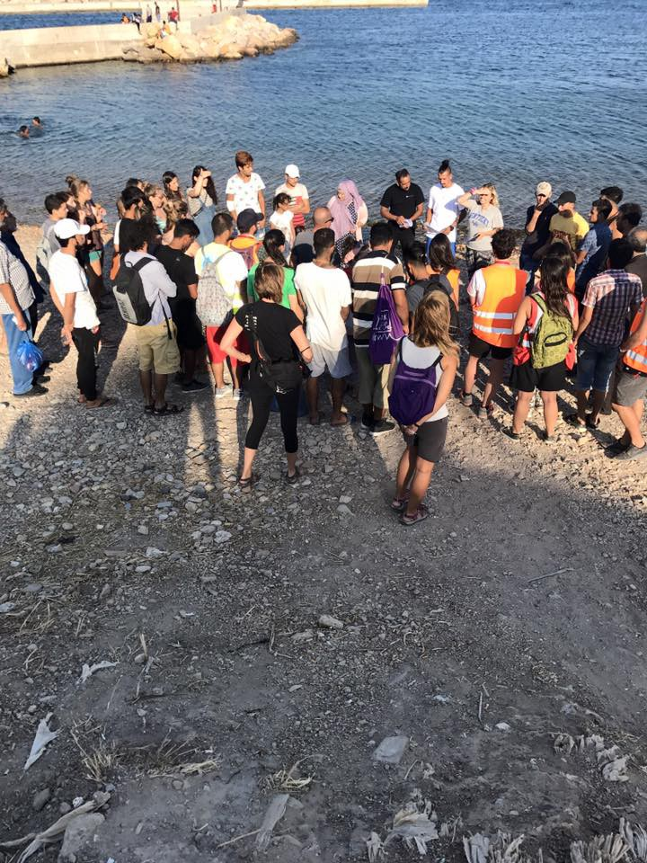

### AYS Daily Digest 30/8/17: Thousands missing, many more awake scared instead of sleeping in Europe’s woods and fields

_Thousands of people missing en route / Shocking conditions in Libyan detention camps / Scandalous silence about the violation of human rights in Turkey / Afghan protest ends in a possible agreement with the police / New rescues at sea / Volunteer opportunities in Greece / Tensions in Calais and Paris build up / Updates from other places / And more news…_

 \)](assets/209f95d3696a/1*qhA4Wls6Flr7jQzVhsKMlg.jpeg)

Poster on a wall of a Calais building \(Photo by [Calais Solidarity‏](https://twitter.com/calaisolidarity) \)
### FEATURE: International Day of the Disappeared

> Each nameless death or a missing person in or outside of the statistics represents a devastated family missing a loved one\. 

The AYS team is currently in search for aid of several young people whose families and friends can’t get hold of them as they’ve gone missing along the way of heading towards what they thought was a safer place, a safe continent, and a place that guaranteed respect for human rights\.

We feel powerless and angry at the fact that the very institutions we should be relying on to help us might be the ones who enabled these young people to go missing through the bureaucratic cracks of unwritten reports, destroyed mobile phones, and people left alone—fooled into thinking they’re heading to a reception centre, while all along they are on the way to being pushed back into some other country, without their knowledge\.

People turned away from the legitimate, legal, and possible migration towards the hands of the smugglers, criminals, and dangerous routes that feed the biggest criminal network of the Old Continent today\. Many are missing with no trace of them\. Loved ones fear to ask, with nowhere to start searching\.

In many places around the world, men, women, and children go missing during migration, some of whom are in detention without recourse to justice\. The rights of migrants, including the right to life, must be protected in order to ensure that migration is safe, orderly, dignified, and humane\.

■■■■■■■■■■■■■■ 
> **[IOM - UN Migration 🇺🇳](https://twitter.com/UNmigration) @ Twitter Says:** 

> > To learn more about missing & dead migrants worldwide, visit the new @[MissingMigrants](https://twitter.com/MissingMigrants) platform ➡️ [bit.ly/2xMjI7Q](http://bit.ly/2xMjI7Q) https://t.co/H7fHmQboqq 

> **Tweeted at [2017-08-30 11:52:12](https://twitter.com/unmigration/status/902861506135678976).** 

■■■■■■■■■■■■■■ 

### LIBYA
#### Horrors in Libyan detention centres

The Western [media](https://www.pri.org/stories/2017-08-29/growing-number-migrants-are-detained-libya-enduring-dismal-conditions) is ‘discovering’ the already well rehearsed and running practice [we wrote about previously](ays-daily-digest-27-8-17-police-spreading-fear-among-refugees-around-europe-454a8eb1238d) , of the Libyan paramilitaries, officials, the country itself, and — us\.

> We’re talking about airless, windowless houses in soaring temperatures,” she says, “with hundreds of people in these rooms\. And they’re often there months at a time because they are waiting to be repatriated home\. 

■■■■■■■■■■■■■■ 
> **[MSF Sea](https://twitter.com/MSF_Sea) @ Twitter Says:** 

> > If you feared for your life or for your family you’d like others to help you to safety, no? Please extend that to those fleeing #Libya. https://t.co/fs8wirItiY 

> **Tweeted at [2017-08-29 14:07:21](https://twitter.com/msf_sea/status/902533130975924224).** 

■■■■■■■■■■■■■■ 

### SEA

■■■■■■■■■■■■■■ 
> **[MSF Sea](https://twitter.com/MSF_Sea) @ Twitter Says:** 

> > Among those rescued overnight are unaccompanied Syrian brothers aged 13 & 17. It's frankly miraculous that we found their boat in the dark. https://t.co/Hfw5Rzccad 

> **Tweeted at [2017-08-30 07:42:17](https://twitter.com/msf_sea/status/902798615822913537).** 

■■■■■■■■■■■■■■ 

### TURKEY
#### Scandalous silence about the violation of human rights in Turkey

The situation with regards to serious human rights violations in Turkey is deteriorating\. Particularly worrying is the routine violation of the basic rights of Syrian refugees in Turkey, as well as the repeated incidents of Syrian torture by Turkish soldiers\. Shocking are scenes in video recently published by international media, showing Turkish soldiers torturing, abusing, and humiliating refugees from Syria who have just crossed the border, Greek [sources explain](https://l.facebook.com/l.php?u=http%3A%2F%2Frsaegean.org%2Fel%2Fskandalodis&h=ATOmJyPahG350grSiLLLTZBdDluIs7WHkQbeFbwTL67b6jl3KuJaTujyCc9fC-5ZoxUEUQEt3tTg7idxsMERW5Lo7gDf_ytGpXly_22IwOxxruh5vYJINcFNGD627L8-e8LNWSETKn1oMHTbukORoeIT8F05NBsNuthqJYWIDrmGe935i4pxVXDuxshwRmA-grlrUeByCFlaRwMTOZ86fUeK6G05WuTUl8CsnJsnqGTYUow8ZtL9EPCEOFzkNc2C) \. The media targeting of refugee support organizations virtually ends any possibility of monitoring and supporting refugees returned from Greece to Turkey and announces new arrests of human rights activists\.

■■■■■■■■■■■■■■ 
> **[SARwatchMED](https://twitter.com/SARwatchMED) @ Twitter Says:** 

> > 645 people apprehended in the last 3 days by the #TurkishCoastGuard: 313 in the #AegeanSea + 332 in a big boat intercepted in the #BlackSea https://t.co/zgeHGpWtf5 

> **Tweeted at [2017-08-30 11:00:45](https://twitter.com/sarwatchmed/status/902848558155657216).** 

■■■■■■■■■■■■■■ 

### CYPRUS

A total of 302 migrants, mostly from Syria, have crossed to Cyprus by boat from Turkey up until June, bringing the total number of registered asylum seekers to 1,884 in the first six months of 2017\.
### GREECE
#### A statement on Lesbos Lesbos

![“These photos are a symbol of disaster\. A disaster consisting of immorality, the collapse of humanity, and the collapse of compassion\. We have fallen\. We have fallen to the point where these pictures do not make us feel any pain, where they do not make our hearts beat faster, where they do not make us rise up against fascism and against the State; a State that is governed by men with bloody hands\. 
The people in these photos are the very same people who have been displaced and exiled by dirty policies and by monstrous powerful corporations\. They are the very same people who have been bombed, forced to leave their homes, their countries, and who have ultimately sought refuge in Europe\. Do you consider this the refuge? Is this the warm embace you have provided them with? Is this how you welcome women and children seeking refuge? Shame on you; you fascists\! Shame on you; you politicians who gamble with the blood of children\. Your firearm industry glares into our tired eyes\! It shines into the eyes of the children who you continue to humiliate merely for seeking refugee in your country\! 
You smell like an abscess; you people who foster situations such as those shown in these photos\.” — [Arash Hampay](https://www.facebook.com/arashampay?hc_ref=ARQlxVUu245YWCZiWh_5jWWeWciAegNn28EKbcifNE6FdaPTGMtp3giMCOyy-dyPDAs)](assets/209f95d3696a/1*KnlQ6KFqwZL-R2QPR3g7Qg.jpeg)

“These photos are a symbol of disaster\. A disaster consisting of immorality, the collapse of humanity, and the collapse of compassion\. We have fallen\. We have fallen to the point where these pictures do not make us feel any pain, where they do not make our hearts beat faster, where they do not make us rise up against fascism and against the State; a State that is governed by men with bloody hands\. 
The people in these photos are the very same people who have been displaced and exiled by dirty policies and by monstrous powerful corporations\. They are the very same people who have been bombed, forced to leave their homes, their countries, and who have ultimately sought refuge in Europe\. Do you consider this the refuge? Is this the warm embace you have provided them with? Is this how you welcome women and children seeking refuge? Shame on you; you fascists\! Shame on you; you politicians who gamble with the blood of children\. Your firearm industry glares into our tired eyes\! It shines into the eyes of the children who you continue to humiliate merely for seeking refugee in your country\! 
You smell like an abscess; you people who foster situations such as those shown in these photos\.” — [Arash Hampay](https://www.facebook.com/arashampay?hc_ref=ARQlxVUu245YWCZiWh_5jWWeWciAegNn28EKbcifNE6FdaPTGMtp3giMCOyy-dyPDAs)
#### Afghan asylum seekers’ occupation of Sappho Square in Lesbos ends

> \- Authorities promise to resolve all cases within two days, or face further action
 

> \- The protesters faced violent night\-time attack and abuse from an off\-duty Moria prison guard 

Please read the official statement [here\.](https://www.facebook.com/NBKLesvos/posts/997345870405202)

■■■■■■■■■■■■■■ 
> **[Arash Hampay](https://twitter.com/ahampay) @ Twitter Says:** 

> > The police promised the protesters that they will reach all their demands by Friday. The protesters have agreed to end the protest . https://t.co/AJ0Uqdy4HN 

> **Tweeted at [2017-08-30 12:32:53](https://twitter.com/ahampay/status/902871745098645504).** 

■■■■■■■■■■■■■■ 

#### Chios

](assets/209f95d3696a/1*xKuTal99qGtvhynkyF1Ivw.jpeg)

Photos: [Refugee Biriyani & Bananas](https://www.facebook.com/RefugeeBiriyaniAndBananas/?hc_ref=ARTJrkAeQFKlmh_QBaNoO4Pm3oRKbh8TznXwhd7mMHjzajCo4ZRoYiS8R--tCfgl_NU)

> “Thanks to everyone who attended this commemoration and participated in a minute of silence to recognize the numbers of people still missing through conflict, disaster and migration — and show solidarity with their loved ones\.
 

> It was heartwarming to see so many different people from all backgrounds and origins attending today\. We tried to light candles but it was too windy\. We said a few words\. We blew bubbles\. Souda beach looked beautiful\. 
 

> But the most important thing was that no matter where we were from or what our journeys were that bought us to Chios, whether we lived on the island, long term or short term volunteering, whether we were on a journey for a safer, better life we all cared together; as one with borders in our hearts\.”

#### New arrivals and registrations

100 people were officially registered arriving to Greece since yesterday: 82 on Lesbos, seven on Samos, 10 on Kos, and one on one of the other Greek Aegean islands\.
#### Athens: Khora’s donation wishlist

 ’s wishlist for donations](assets/209f95d3696a/1*05f2bJmWHamTZM2aI9CEow.jpeg)

[Khora](https://www.facebook.com/KhoraAthens/) ’s wishlist for donations
#### Housing in Larissa

Up to 420 refugees will be settled in 70 apartments in Larissa, following the convention of the Municipality of Larissa and the UNHCR, which is approved today by the Municipality of Larissa\. The apartments, ranging from 60 to 90 square meters, will accommodate refugees who are currently in the hospitality centre of Koutsoheros\. The local officials have, however, expressed their limits in proceeding with the deal of the UNHCR\. Following the previous call to the citizens and flat owners, about 50 apartments have been found, while the open call for interest to apartment owners is expected to be announced next, Greek sources [report](https://l.facebook.com/l.php?u=http%3A%2F%2Fwww.ana.gr%2Fota%2Farticle%2F182403%2FEos-kai-420-prosfuges-tha-egkatastathoun-se-70-diamerismata-sti-Larisa&h=ATMt2X1fYXL5E1bY7NMO4FZfzCd22uItCWgvGx_ZPJ7EIta-Cm0TKaGMICoWu94Sfd9r5iYbkFA64tXgBdrXRySp9YQGlAmX1HRStUtlCJUtdNba44FsbPUJx9dau8JaDIT_GLGCY027cH9YSlVmleKtEJjye-E4q-UUZYeYyNA-hSWBfDQmlf4FKPntCqX2vPuuBnTEIryZxJqRUKRy_Qrnta-wBZo4j1sGhcLnj9lW9Zofx_-T05DGc7q38YXF) \.
#### Free online language [lessons](http://socialpolicy.gr/2017/08/learn-a-foreign-language-for-free-opportunity-to-refugees-to-learn-a-new-language-and-to-enhance-their-language-skills.html)

**_For whom?_**
- refugees
- asylum applicants
- immigrants
- resident permit holders

**_Where?_** 
Online — on your computer, laptop, smartphone, et\.

**_Conditions_** 
Everyone takes a language test to assess the level they should take\. Upon completion of the language assesment, they access the language course\.

**_Which languages?_** 
German, English, Spanish, French, Italian, Dutch: from level A1 to C2
Bulgarian, Czech, Danish, Greek, Croatian, Hungarian, Polish, Romanian, Slovak, Finnish, Swedish: A1, and Portuguese: from level A1 to B2

**_Cost?_** 
Free\.

If you are interested, you can visit SolidarityNow at the Blue Refugee Center, Ioanni Koletti 25D and they’ll be happy to assist you with the registration process\!

■■■■■■■■■■■■■■ 
> **[EU Agency for Asylum - EUAA](https://twitter.com/EUAsylumAgency) @ Twitter Says:** 

> > Do you have questions on #EUrelocation? Contact our hotline in #Greece and start your future now! [easo.europa.eu/questions-and-…](https://www.easo.europa.eu/questions-and-answers-relocation) #asylum https://t.co/KcvFvyxnxS 

> **Tweeted at [2017-08-29 15:57:58](https://twitter.com/easo/status/902560969687044096).** 

■■■■■■■■■■■■■■ 

#### Volunteering opportunities

[We Are Here — Community Centre](https://www.facebook.com/WeAreHereCentre/) in Nea Kavala is looking for volunteers to boost up their team that is working in organizing social, educational and cultural activities at the camp that currently hosts around 800 people and in located in a fairly isolated area, where these activities also provide psycho\-social help on an individual base through the organized activities proposed by the group\. Contact them if you wish to join the team\.

[Open Cultural Center — OCC](https://www.facebook.com/OpenCulturalCenter/?hc_ref=ARQyf34PTYiBE7Am7sq7qoEE_EkFybUnMSAv1DXdft7dbFINCKVzgiVx5sO5JhRPXvY&fref=nf) is looking for a greek teacher to help refugees while they attend the Greek school\. They need someone to come to help them with language and their homework\. They are also in search for a Greek teacher for the adults\. 
If you are interested, contact them as soon as possible by [Facebook](https://www.facebook.com/OpenCulturalCenter/?hc_ref=ARQyf34PTYiBE7Am7sq7qoEE_EkFybUnMSAv1DXdft7dbFINCKVzgiVx5sO5JhRPXvY&fref=nf) or email: northgreece@openculturalcenter\.org\.

 shares refugee stories, some of the examples of exlusion in the place of integration in European societies](assets/209f95d3696a/1*JzHaryjaT1KFWqPBEoPvZQ.jpeg)

“Do we want integration or exclusion?” [Greek Forum of Migrants](https://twitter.com/migrantsforum) shares refugee stories, some of the examples of exlusion in the place of integration in European societies
### HUNGARY
#### Minimum standards required in transit zones

> ‘Since 28 March 2017 all asylum\-seekers, with the only exception of unaccompanied minors under 14, are held in the closed transit zones for the entirety of their asylum procedure\. That placement in the transit zone amounts to unlawful detention is clearly stated in the ECHR judgement in the case of [_Ilias and Ahmed v\. Hungary_](http://hudoc.echr.coe.int/eng#{%22itemid%22:[%22001-172091%22]}) of 14 March 2017\. That conditions in the transit zones are inadequate is further exemplified by the [numerous interim measures granted](http://www.helsinki.hu/wp-content/uploads/HHC-Info-Update-interim-measures-granted.pdf) by the European Court of Human Rights in which the Court indicated to the Government to place the applicants, held in the transit zones, in an environment that meets the requirements of Article 3 of the Convention\.’ — [HHC](http://www.helsinki.hu/en/minimum-standards-required-in-the-transit-zones-on-the-hungarian-land-borders/) 

The HHC background note with the list of the most urgent changes that would ensure that confinement in the transit zones in Hungary is in line with relevant international, EU, and domestic standards of detention is available [online here\.](http://www.helsinki.hu/wp-content/uploads/HHC-Background-Note-Minimum-standards-in-transit-zones.pdf)
#### NGOs “on trial”

Civil society groups in Hungary said Wednesday they have filed a challenge with the country’s constitutional court against a law targeting foreign\-funded organisations that critics argue is aimed at stifling anti\-government dissent, Hungarian media sources [say](https://www.yahoo.com/amphtml/news/under-fire-hungary-ngos-turn-top-court-163457162.html) \. 23 NGOs, including several human rights groups and anti\-corruption bodies, sent the joint complaint Tuesday to the court protesting the “transparency” law\. The HHC also plans to continue legal challenges in Strasbourg at the human rights court\.

Any sanctions against NGOs will only be applied after May 2018, the deadline by which groups must submit a record of the previous year’s donations\.
### ITALY
#### New arrivals

■■■■■■■■■■■■■■ 
> **[Lucia Basso](https://twitter.com/luciabasso2) @ Twitter Says:** 

> > Nel porto di #Augusta, arrivati 158 #migranti soccorsi nel #Mediterraneo centrale da una nave #militare tedesca.@TgrSicilia @[fabiofortuna01](https://twitter.com/fabiofortuna01) https://t.co/JCt5DoGe6U 

> **Tweeted at [2017-08-30 07:48:29](https://twitter.com/luciabasso2/status/902800176426962944).** 

■■■■■■■■■■■■■■ 

■■■■■■■■■■■■■■ 
> **[MSF Sea](https://twitter.com/MSF_Sea) @ Twitter Says:** 

> > Is saving a person from drowning, only to take them to a detention center where they face beatings and sexual abuse, really saving them? https://t.co/FAStOFkgoM 

> **Tweeted at [2017-08-29 14:30:09](https://twitter.com/msf_sea/status/902538867668123648).** 

■■■■■■■■■■■■■■ 

#### Empty buildings for displaced migrants and refugees

Italian Interior Minister Marco Minniti is set to propose [a series of measures](https://l.facebook.com/l.php?u=https%3A%2F%2Fwww.thelocal.it%2F20170828%2F600-empty-buildings-identified-for-migrants-displaced-by-evictions&h=ATP5hSocE-8gTjz22OfZEUgCeE_sSFYpy0iSOeXSQibxoAcWdC5ZTkaq_WkXY7de5gINk2DvioU7ejDFgB2FVw7IpCqBuxAxGwq_cq5Yi2bGzumltZ2mUUCozTP3COp_zw7KegZ6Z4U9PKxP_YfxYI3PVWZVEnNXURp9mhYF87qXZnaZPdD-EAuOJWygn6FsQX8oBAkaIbaKl_KIAc31DqMCa08PrFuYc6vSN6Duou4aNesS32N6G4zDvnC6DlbdVV5FKmN_VuZStxes31DiYKkso5tE) to relocate migrants who are evicted from occupied buildings\. He has also put forward the idea that [properties confiscated from the mafia](http://www.repubblica.it/politica/2017/08/27/news/viminale_sgomberi_edifici_occupati_mafie-173990565/) could be used as relocation centres\.
#### Rome

One migrant has been taken to hospital in Rome after clashes between local residents of the area of Tiburtino III and residents of the reception centre of Via Frantoio, Italian media [report](https://l.facebook.com/l.php?u=http%3A%2F%2Froma.corriere.it%2Fnotizie%2Fcronaca%2F17_agosto_30%2Fmigranti-centro-accoglienza-tiburtino-sassi-rissa-ferito-eritreo-f7fefc3c-8d63-11e7-9464-bd6d9adf1594.shtml&h=ATO0NiEZInI2Uecj1eQ_Ys_QEA6sACKl1XQ6_9hr0Pn7GMCnpopPHQ5p_7RZXKdSVYCSrjZVOODwyUeSkypZL_TT-HgVzbW3p0AkpRncdUkuD52i4bRO1d5JLnRMT6X-BIiN_Xf6uZaK_FzuLMtbAi9umcAoVTPddVz0ZhsTrYBQgwVUaG6-2GDRxkqRGwc8M0swoCAhfKb22tOWPkuio3A-nMZZDBznuS1nTPLMVqL6VkPYu2DabQQDdz22KIGr) \. The migrant in question seemed to have thrown some stones in the direction of youngsters who were laughing at him\. Although he reportedly didn’t hit anyone, once the teenagers went back home, one of the mothers gathered other local residents, and broke into the centre ‘to make justice\.’ When police arrived there have already been clashes and authorities are still investigating\.

\(Unfortunately, it seems the woman is known for having addiction problems while the migrant had already been expelled by another reception centre due to his behaviour and was not residing in the centre of via Frantoio anymore\. \)
#### Rosarno — San Ferdinando residents still defy demolition

Formal residents of the makeshift camp have [reportedly](https://www.facebook.com/comitatolavoratoridellecampagne/posts/1535609799838473?fref=gc&dti=1652972374920129&hc_location=ufi) blocked the proceeding of the demolition with their bodies\. They claim their right to use houses of the Villaggio Italia which was built to house migrants, closed due to mafia infiltrations\.

](assets/209f95d3696a/1*q28a1va8VSQuXwsy7ywkag.jpeg)

Photo: [Comitato Lavoratori delle Campagne](https://www.facebook.com/comitatolavoratoridellecampagne/)
### FRANCE
#### Calais — “Bouchart coupable de traitement inhumain et dégradant”

**\(Calais—** “ **Bouchard, guilty of inhumane and degrading treatment”\)**

Signs with this and other similar messages were posted on the walls along a street in Calais, calling out the city mayor for the horrid conditions refugees are forced to into and for the poor and demeaning treatment they’re receiving from the local authorities on the ground\.

All the signs, just like the ones previously posted, were taken down by the officials of the city, in spite of the protests of those actions being counter freedom of speech\. However, the officers present at the time with signs reading, “Calais, the least dynamic city, resignation,” did not intervene, the northern French media [report](http://www.nordlittoral.fr/44617/article/2017-08-30/la-guerre-des-affiches-anti-bouchart-continue-une-nouvelle-plainte-deposee) \.

 \)](assets/209f95d3696a/1*f8N5uRjist47kTUhrPSaqA.jpeg)

\(Photo by [French media](http://www.nordlittoral.fr/44617/article/2017-08-30/la-guerre-des-affiches-anti-bouchart-continue-une-nouvelle-plainte-deposee) \)
#### Paris

Yesterday evening the officers have gathered and ordered to turn people away from the sidewalks of Terre d’Asile in Paris\. Like elsewhere, the instruction was to not let the asylum seekers stay anywhere\.

Teargas was sprayed and the personnel of the FTDA, as well as especially the children on site, were all affected by the gas and the crowds\. As a result of this, the FTDA was closed\. The asylum seekers were once again turned away and refused for no particular reason and with no explication or direction\. They were told to pursue with their demand elsewhere, i\.e\. Creteil, Nanterre, Bobigny, Melun, Cergy; but with no directions, transport map, tickets, opening hours, or guarantees it would work this way\.

The volunteers on site wish to meet with all the concerned parties\. Just like in Greece and other parts, it is crucial to work together, to assume responsibilities for certain parts that particular organizations could have influenced and direct differently\. It is understandable nobody can have an entire overview of the situation 24/7 and we also hope that all the stakeholders and interested parties and involved concerned individuals get together to figure out a viable plan for everyone concerned\.

The situation will get neither easier nor simpler, and everyone should work together\.

 \)](assets/209f95d3696a/1*ezjvGB-h0nFaD-2I6CVw2g.jpeg)

Peaceful reminder to the citizens of peaceful towns \(Photo by [Calais Solidarity‏](https://twitter.com/calaisolidarity) \)
### UK
#### Want to help?

> A small act can help tremendously… dehydration, toothaches, headaches, sore throats… all these things we reach to our cupboards to cure but what about those in the squats? Can anyone help with donating the following items or funds towards it? 

This weeks needed items list from the [Calais Refugee Aid](https://www.facebook.com/CalaisRefugeeAid/?hc_ref=ARSTfpwGSD4nTiYzthUUB32ckNtEjTiz4eHUs1BamSl8iZze_HdodmCi44xiYVPwosw&fref=nf) team:

> Rehydration sachets LOW 
 

> Strepsils or throat lozenges LOW 
 

> Anti\-histamines \(non drowsy\) OUT OF STOCK 
 

> Gaviscon or antacids \(tabs — \-easier to distribute\) OUT OF STOCK 
 

> Athelete’s foot or Any anti fungal OUT OF STOK 
 

> Lidocaine gel \(for toothache — very popular among refugees\)
 

> Anti Itch eye drops \(hay fever eye drops\) LOW STOCK 
 

> Dettol/Betadine or antiseptic skin preps LOW STOCK 
 

> Sudocrem, Vaseline or Petroleum jellies OUT OF STOCK 
 

> Ear drops/otomize spray for simmers ear LOW STOCK 
 

> Paracetamol LOW STOCK 
 

> Ibuprofen 
 

> Hydrocortisone cream/ anti itch cream 
 

> Gloves \(Medium/Large\) 

They can collect the First Aid donations from the following points:

> A\) Manchester \(Hassan Khalid Chaudhry\)
 

> B\) Huddersfield \(Abid Pervez\)
 

> C\) Nottingham \(Sahira Kauser\)
 

> D\) Amsterdam \(Joram Melissant\)
 

> E\) London \(Jackie Wood\) 

They can take donations on September 1\.
### EU

■■■■■■■■■■■■■■ 
> **[Juan Maza Calleja](https://twitter.com/JuanMazaCalleja) @ Twitter Says:** 

> > September 2015, EU programmed to relocate 160,000 refugees from Greece & Italy in 2 years.Almost 2 years after,  26,710 relocated.Source IOM https://t.co/g3KBfkvZZT 

> **Tweeted at [2017-08-29 20:24:35](https://twitter.com/juanmazacalleja/status/902628066563944452).** 

■■■■■■■■■■■■■■ 

> **_We strive to echo correct news from the ground through collaboration and fairness, so please let us know if something you read here isn’t right\._** 

> **_For anything that you want to share, feel free to contact us via Facebook, Twitter, or write to: areyousyrious@gmail\.com\._** 

_Converted [Medium Post](https://areyousyrious.medium.com/ays-daily-digest-30-8-17-thousands-missing-many-more-fearing-instead-of-sleeping-in-the-woods-and-209f95d3696a) by [ZMediumToMarkdown](https://github.com/ZhgChgLi/ZMediumToMarkdown)._
