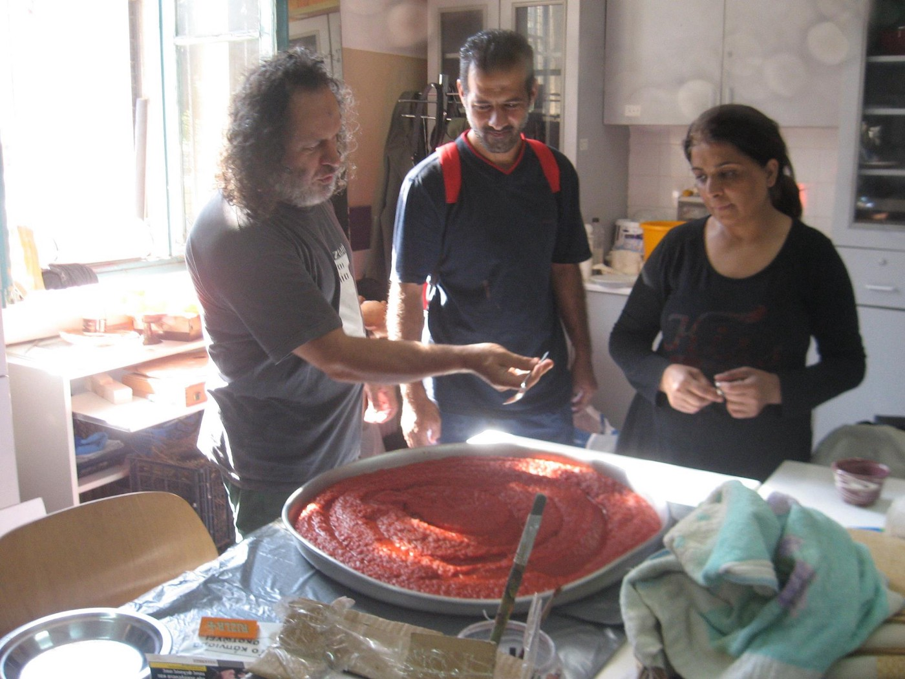
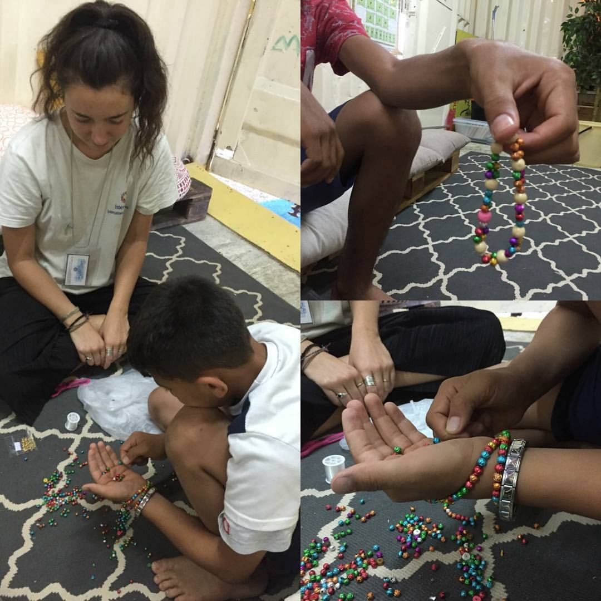
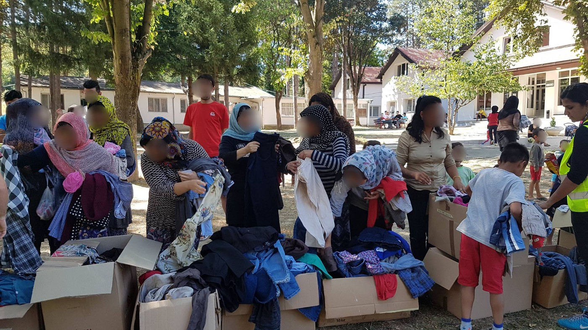
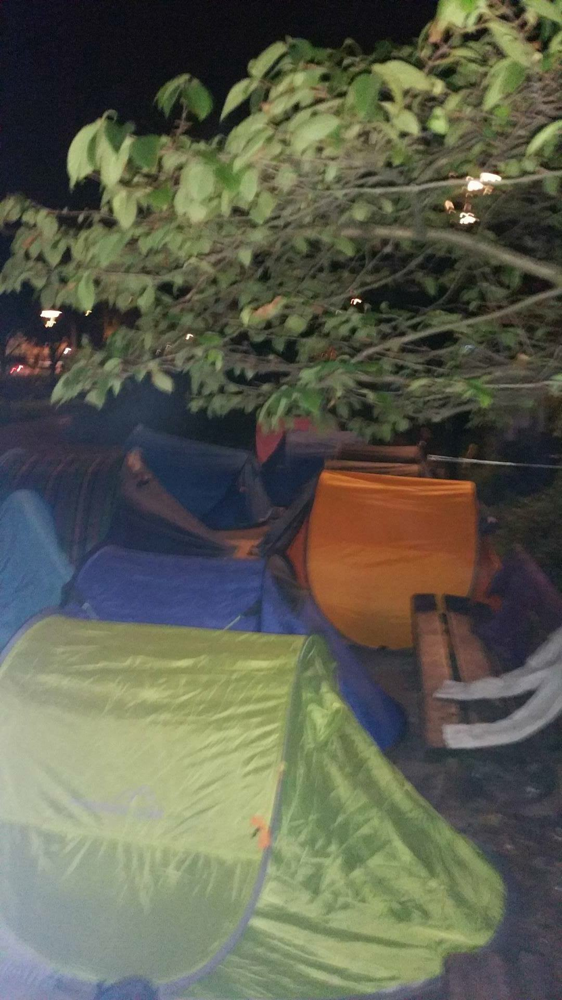

### AYS Daily Digest 31/08/17: Humans crushed in the cogs of bureaucracy

_Woman in labor on the side of the road in Lesvos highlights failure of “professionalized system” / School enrollment open / Refugee farm doing well / Distribution in camp in Serbia / Refugees enjoy holiday in Hungary / Update on numbers and situation between Libya and Italy / Police still persecuting and pushing around refugees in Paris / And more news…_

 **, Libyan detention**](assets/74e99cb399cb/1*xBdz-u6GBkJOydre6Wp6Sw.jpeg)

Photo credit: [**Severino Proserpio Maspes**](https://www.facebook.com/severino.proserpio) **, Libyan detention**
### FEATURE: Humans crushed in the cogs of bureaucracy

As can happen due to intense circumstances, a woman went into labor shortly after her arrival on the Island of Lesvos\. The brief account comes from Philippa Kempson:

> I called for a doctor and ambulance for a lady in labor at 5\.52am this morning\. 
 

> The doctor from IsraAid arrived and confirmed that the waters had broken and an ambulance was needed\.
 

> An ambulance was called and we assumed on the way on the way\. We were later told that the police had canceled the ambulance because the woman was “feeling better”\! This in spite of the doctors confirmation that the head was in position and the woman was going to give birth\.
 

> In spite of repeated protests and requests from us and the medics on scene the police and UNHCR representative insisted that she had to go with the bus to moria camp\.
 

> When the medics insisted that an ambulance was needed the port police told the nurse on scene that she will be held responsible if the woman didn’t give birth\! \! \!
 

> The woman then went into full labor on the side of the road, the port police wouldn’t allow the medics to drive her in the car and meet the ambulance\. Instructing the medic saying “you are a doctor? then you take the baby out\!” then while the doctor is working the police ask him for his papers to prove he is a doctor and told the nurse to stop looking at him like that\. 
 

> The ambulance finally arrived at 7\.53\! \! 

The woman delivered her child with no complications at the hospital \(❤\) \.

Several details of this story, however, stand out\. The canceling or recoordinating of aid in an attempt to ensure no “unnecessary” aid was offered\. The harassment for credentials and papers\. These are all situations many have experienced previously\. Although ensuring that people receive adequate and professional care is important, the nitpicking insistence on ignoring the needs of the situation at the behest of the “form and procedure” is yet another sign of pervasive sickness in the tree of support and relief\.

Systems so incredibly complex are established in the name of “streamlining”, “systematizing”, or “securing” support, yet the task these systems most thoroughly accomplish is simply obscuring responsibility\. “I don’t want to be the one to call in a bad emergency, so it’s on you\.”

This incident highlights how so many are interested not in the well\-being of those in front of them, but of their own reputation and skin, dedicating the bare minimum to their efforts\. No more, no less\.

Distancing oneself from responsibility for our fellow humans is a dangerous path to be on\. It is exactly this attitude that allows for the slow building of a system designed to destroy and dehumanize people, while giving the operators of the system the peace of mind that they are doing the right thing\. In this way, the tragedies and harm to people is caused not by other people who can be held to account, but abstracted away as unfortunate collateral damage in a system that is “a necessary evil\.” Do not be lulled to sleep by the somber clanking of the machine\. Stay alert and critical\.
### GREECE

Enrollment in school now open\. Although the target demographic for the Zone of Educational Priorities program \(the program through which children are attending school\) is for children living outside of official camps, children inside camps are also allowed to attend\. The Greek academic year begins on September 11th\! Read more here for information on [how to enroll](http://blog.refugee.info/enrolling-kids-in-school-in-greece/?fref=gc&dti=1652972374920129) \. Furthermore, those who have problems registering their children can email eswg\.greece@gmail\.com _in their native language_ \.

Good luck with the new school year, kids\!

> Report from “Refugee Village for Freedom\.” 

> The work is progressing and the new products are “taking the road” to the city to get into baskets and reach the table of all those who stand solid in this effort\.
 

> At the same time, at the squat, we make our tomato\-sauce, our olives and our cheeses\.
 

> The following shots from last weekend \. 

> We are still at the beginning but we are determined\!
 

> [\#Refugeesgr](https://www.facebook.com/hashtag/refugeesgr?source=feed_text&story_id=1945150769076459) 

Photo Credit: Refugee Village for Freedom

Greek police intercepted a smuggler crossing Greece\. In the back of his van, they found a group of mixed nationalities\. They admitted to paying 1,900 euro per head for the journey he was taking them on\. Fortunately, nobody was injured in the capture\. Read more [here](http://www.ekathimerini.com/221274/article/ekathimerini/news/police-bust-human-smuggler-after-chase?fref=gc&dti=1652972374920129) \.

Photo credit: Intervolve, which needs volunteers\. Look them up\!
### SERBIA

Refugee Aid Serbia was able to hold a distribution at Bogovadja camp\. The weather was good enough to permit an outdoor distribution of clothing and hygiene items\. Camps in Serbia are often still dependent upon the donations of outside organizations in order to maintain any basic living standard\. Even then, many report that live in the camps is not nearly as ideal as government reports claim\.

Photo credit: Refugee Aid Serbia
### HUNGARY

According to Migration Aid:

“Last weekend we took a small group of refugees to a one\-day trip to the shores of Balaton\. In spite of the previously voiced threats from mayors and MPs we have spent a day of tranquility and leisure for all of us at Zamárdi\.”
### ITALY

There are continuing reports of violence against refugees and migrants in Libya, according to Italian officials\. The text of a video raising awareness about the issue states:
“ The men who were abused and treated like slaves in Libya said that during the time spent there police used to throw water at them and film them in order to send the video to European authorities \(or UNHCR\) and make them believe migrants were rescued at sea; migrants were threatened to death if they confessed this “trick” to European authorities \(one of them was actually beaten to death\) \.”

As can be seen below, these are the circumstances that tens of thousands live in\.

■■■■■■■■■■■■■■ 
> **[UNHCR Libya](https://twitter.com/UNHCRLibya) @ Twitter Says:** 

> > How many @[Refugees](https://twitter.com/Refugees) live in Libya? We have registered more than 42,000 refugees and asylum seekers &amp; estimate more than 100,000 refugees https://t.co/qMsPoBdUKN 

> **Tweeted at [2017-08-31 07:40:08](https://twitter.com/unhcrlibya/status/903160460492537856).** 

■■■■■■■■■■■■■■ 

In related news, the number of people coming from Libya has dropped significantly in August, according to official reports, over a 10% drop in arrivals comparing the period January 1 to August 1 between 2016 and 2017\. Additionally, according to IOM, there have been zero deaths recorded in the Mediterranean Sea since August 9th; however, this could just mean that ships have been lost without a trace\.

According to the article “ the decrease depends on the confrontation with Libya, both with Al\-Serraj’s government and with Fezzan’s mayors \(in the south of the country\), who were received last 26 August by Marco Minniti at the Ministry of Interior\. In the last two days, the Libyan Navy has intercepted and taken back about 700 migrants trying to cross the Mediterranean Sea\.The Libyan Navy’s spokeperson Ayoub Qassem mentioned that two vessels with 88 and 134 people have been stopped last night off Sabrata shores,with the Italian support\.”

The full report \(in Italian\) is available [here](http://www.ilsole24ore.com/art/notizie/2017-08-29/migranti-oim-meno-morti-mediterraneo-nessuna-vittima-ultimi-venti--183515.shtml?uuid=AEACITJC) \.

An article regarding Bardonecchia describes how the situations dramatically changes between the night and the day\.

> “During the day, it’s a touristic spot for families and trekking amateurs, during the night Bardonecchia turns into an improvised waiting room\. On the border with France, the location receives tens of migrants, ready to challenge the woods and cross Colle della Scala to reach France and northern Europe\. The passage through the Frejus is now impossible, guarded by the army, so the migrants look for alternative ways, like the trails crossing Cozie Alps\. Sometimes, some Italian guys helps them\. On the way, there are also artisanal signs pointing the direction to France\. According to a local manager of a camping site, the situation can become dangerous, because it’s very easy to lose the track in the night, and soon the temperatures will lower\. This person is thinking of setting cameras\.” 

The article goes on to describe increased police activity in the area in order to “guard the international paths\.”

Protests in Rome in order to demand a suitable housing option for refugees and migrants are ongoing\. At mid\-afternoon they moved to a different location to continue the protest\.

■■■■■■■■■■■■■■ 
> **[DinamoPress](https://twitter.com/DinamoPress) @ Twitter Says:** 

> > In pzle Esquilino centinaia in assemblea per il diritto alla casa. Saltato vertice Raggi-Minniti. Alle 16 mobilitazione in Campidoglio https://t.co/bcc0HEV9UI 

> **Tweeted at [2017-08-31 10:03:28](https://twitter.com/dinamopress/status/903196531666427904).** 

■■■■■■■■■■■■■■ 

A video has surfaced of an attack by two 17\-year\-old boys on an asylum seeker in Acqui Terme\. The attack happened on August 8th, and the victim was admitted to the hospital for observation after suffering minor cranial trauma\. The [video](http://www.ilfattoquotidiano.it/2017/08/31/acqui-terme-picchiano-richiedente-asilo-e-postano-il-video-su-facebook-fermati-due-17enni/3828256/) is found behind the link and is disturbing\.

Rome In Via Costa in the outskirts of the city an occupied building has been evacuated and seized by authorities because of a pile of rubbish set on fire that was considered a threat for the people living there\. Now people sleep on the street and in the petrol station nearby, the youngest evacuated is a little girl who is only nine days old\. They don’t know where to go as the municipality didn’t give options\. Around 120 people lived in the building , all migrants from Africa or Eastern Europe but among them also three Italian families\. Among the African young men, also some of those were evacuated from via Vannina the last 14th of June
### FRANCE

A report from a volunteer near Paris: 
The police continues to harass refugees sleeping in st Denis but although some got their belongings stolen many could keep them and returned later to the park to sleep… pop up tents seem to be a good tool to pack up and leave quickly when needed\. Some refugees still sleep without a tent since the weather still allows it but that will change soon\. Local groups of volunteers are still trying to get an agreement with officials to be allowed to do distributions on the streets as, for now, it’s very limited\.

Speaking of tents, the same group \(Paris Refugee Ground Support\) finished their salvage from a festival in Reading, England, yielding a van stuffed to the BRIM with supplies\. We hope that these supplies, which were saved from potentially being sent to the dump\! \! Help ease someone’s life in whatever way possible\. Great work, PRGS\!

Paris Refugee Ground Support tent salvage\!

> **_We strive to echo correct news from the ground, through collaborationand fairness, so let us know if something you read here is not right\._** 

> **_Anything you want to share — contact us on Facebook or writeto:areyousyrious@gmail\.com_** 

_Converted [Medium Post](https://areyousyrious.medium.com/ays-daily-digest-31-08-2017-humans-crushed-in-the-cogs-of-bureaucracy-74e99cb399cb) by [ZMediumToMarkdown](https://github.com/ZhgChgLi/ZMediumToMarkdown)._
