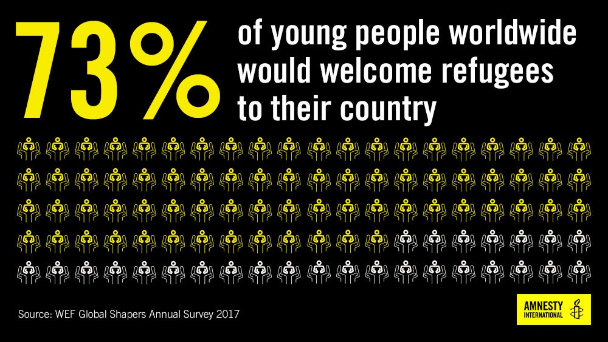

### AYS Daily Digest 01/09/17: Let them in\!

_Possible drownings but more rescues at sea / More arrivals in Greece / Protest in Sweden moving but continues / Abuse of immigrants in UK / Thousands of refugees try to leave Myanmar / And more news…_

](assets/aa769d237b32/1*QKu33VOBcTPlsZDbacFnhA.jpeg)

Photo by [**Gegen das Sterben im Mittelmeer**](https://www.facebook.com/StopTheDying/)
### Feature

A study published by [Amnesty International](https://www.amnesty.org/en/latest/news/2017/08/governments-completely-out-of-touch-with-citizens-on-refugee-issues/) reveals how the younger generations view the refugee crisis and highlights the difference between the response we see our rulers give to this crisis and the one people with an open mind would\. The study finds that nearly three\-quarters of young people globally would welcome refugees into their countries\.

> This new survey released by the World Economic Forum \(WEF\) on young peoples’ attitudes towards refugees exposes just how out of touch governments are with their citizens 

According to the Global Shapers Annual Survey, the vast majority \(72\.6%\) of people aged 18–35 would welcome refugees into their countries\. More than a quarter \(27\.3%\) say they would even take refugees into their own homes\.

In the same study more than half of respondents \(55%\) say they believe that governments should try to include refugees in the national workforce with only 3\.5% believing that governments should “expel/deport” refugees\. Significantly, in the US a huge 85% of young people say they would welcome refugees to their country, an increase of more than 10% on last year’s survey\. It may seem that everywhere around the world people are closing themselves down in fear but reports like this give us hope that, not only in the future will we give a truly humane response to a crisis like this one, but that right now we could all do more to pressure our governments to change their ways and really care for and look after the most vulnerable people among us\.

This result isn’t much different to the one Amnesty International got last year as part of its I Welcome campaign, which found that 4 in 5 people would welcome refugees in their countries\. This shows to what extent young people’s views around the world are contrary to the their governments’\. As part of the campaign, Amnesty and Sofar Sounds will hold concerts in over 200 cities around the world on 20 September in aid of refugee rights\. ‘ [Give a Home’](https://www.amnesty.org/en/latest/news/2017/06/give-a-home/) initiative will have musicians performing secret concerts in ordinary people’s homes around the world\.

Amnesty international has also warned that “outsourcing” border control and the fight against traffickers to Libya exposes migrants and refugees to abuse\. According to the [Associated Press news agency](http://abcnews.go.com/International/wireStory/backed-italy-libya-enlists-militias-stop-migrants-49484692) , one reason for the whopping drop in the crossings from the country is that Libyan authorities have paid armed groups of traffickers to stop the refugees from embarking on the way to Europe — locking up men, women and children in inhumane detention centers\. The money is coming from Italy which has, directly on indirectly, been making deals with armed militias in control of the migration “business” to try to stop the thousands of crossings over the Mediterranean Sea\. The new french president, Emmanuel Macron, said the cooperation between Italy and Libya was a model, obviously following the model set by the EU\-Turkey deal one year ago\. This kind of external policy has proven to be dangerous for refugees stuck in Turkey during the last 12 months, but it raises much more concern about the situation in Libya, where the reports tell us conditions are far worse than in Turkey\.

Young, open minded people around the world clearly don’t agree with this closed door policy, so why not show our discontent and push our governments to finally do what’s right and start caring for everyone? It’s not enough to be sorry in the future\.
### Sea

There are reports that a boat with refugees has sunk off the Tunisian coast, possibly resulting in many deaths, Shamseddine Marzouq of the independent Tunisian Red Crescent told the [AA](http://aa.com.tr/en/middle-east/boatload-of-migrants-drown-off-tunisia-coast-survivor/897860) yesterday\. One of the passengers, who managed to swim to shore, said there were about 120 people on the boat that vanished and, according to him, probably no one else survived\. The boat left from Libya’s western city of Zuwara on Monday en route to Italy but couldn’t get across and unfortunately some bodies are expected to be recovered over the next few days on the shores of Tunisia\. The Red Crescent official has also said that the “Strangers’ Cemetery” in the Tunisian city of Zarzis where drowned refugees are buried is full and there is no more space for burials\.

Fortunately, in another part of the Mediterranean, [**MSF Sea**](https://twitter.com/MSF_Sea) reported that the Aquarius has returned to the port in Italy and disembarked the 265 people rescued at sea this week\.
### Greece

The Asylum Services have published data today showing that more than 18,000 asylum seekers were relocated from Greece to other countries in the European Union from October 2015 until August 27 of this year\. There are also flights already scheduled for another 984 people\. The majority of these refugees were taken in by Germany, followed by France, then Netherlands, then Sweden\. Also between these dates the Asylum Service received 27,378 relocation applications and sent 24,749 requests to other EU countries for acceptance\. Of these, 22,288 have been given the green light, 1,164 have been rejected and 532 are still pending\. Considering that there are still about 62,000 refugees in Greece and most of them don’t intend to stay in the country, we can conclude that relocation is anything but satisfactory and more should be done to increase the relocation rates\. This crisis is not over and refugees keep arriving in Greece\.
#### Lesvos

Today we have received reports from Advocates Abroad of many arrivals on the island, with five boats reaching it coming from Turkey bringing 219 refugees in total:

The first boat to Lesvos arrived in the north west, in Kalo Limani, 04:30
68 people 
18 children 
22 women
28 men

The second boat to Lesvos was taken in by HCG, 08:00, picked up in the south, outside Kagia, 10 people 
2 children 
3 women
5 men

The third boat to Lesvos came in to the south, 21 people 
7 children 
6 women
8 men

The fourth boat to Lesvos came in to the south, 51 people

The fifth boat to Lesvos came in to the south, 69 people\.
#### Rhodes

Another 59 refugees have arrived further south, building up today’s numbers\.
#### Samos

Another 44 refugees reportedly have arrived on this island\.
#### Chios

As the emptying of Souda camp continues, there are still reports of police abuse and this morning police showed up checking refugees’ papers, without any consideration for the fact that it was Eid, one of the main Muslim holidays\.
#### Volunteering

The [**The Schoolbox Project**](https://www.facebook.com/theschoolboxproject/?ref=gs&hc_ref=ARQtljw-RE9tH7gqE-WcV1KnQuuOu7rso44oja6XdPtMAmH-Rkf5eF4vUMyKbuTdqd4&fref=gs&hc_location=group) is looking for volunteers and calling all credentialed teachers, art therapists, occupational therapists, psychologists, musicians, social work professionals, 1:1 educational aids , translators, sports coaches and basic volunteers with experience with children\. They currently need volunteers in Greece \(near Andravida\) with upcoming needs near Athens\.
Requirements:
4 week commitment 
Meeting of above educational/experiential criteria
Ability to pass a criminal background check
Commitment to SBP mission and values, including our no photo policy
Must speak English
Additional requirements for Program Directors \(stipend provided\):
3 months required, 6 months preferred

Priority given to:
\*those with trauma informed care knowledge and experience, though online and in person training and 24 hour support will be provided to you\. 
\*those with refugee camp experience
\*those with nature based education experience \(permaculture, forest kindergartens, etc\)
\*those with Arabic or other relevant language skills

If you are interested please submit your information to volunteer@schoolboxproject\.org

[**Refugee Rescue**](https://twitter.com/RefugeeRescueUK) is also looking for volunteers to help them spot and help refugees on their arrival on Lesvos\. And as described before, this is still happening every day\.

Future Learn has developed an Online Course to help anyone volunteering with refugees\. The course aims to help volunteers understand how they can best support the linguistic and social needs of refugees\. To know more and get involved please follow the link [here](http://aims to help volunteers understand how they can best support the linguistic and social needs of refugees.) \.
### Hungary

The government is demanding that the EU pay for half of the border wall erected along its southern borders with the intention of preventing refugees from entering the country\. Hungary has spent some €800 million erecting fortified fences over the years on its borders with Serbia and Croatia, a move it says defends the rest of the European Union against unwanted migrants, so it is now demanding that the EU pay half of that sum\. Earlier this week, the government also decided to extend the state of emergency by another six months because of what it says is a threat of terrorism posed by mass immigration\. It’s ludicrous to think that the EU would accept such a demand since it has condemned the Hungarian approach to refugees, but since refugees continue to be a taboo for much of the Union we will have to wait and see what the answer is\.
### France

There is a new website with information about asylum in France and [Dom’Asile](http://domasile.info/en/) is an information platform for asylum seekers where information is presented in simple and understandable language\. It provides relevant and concrete information regarding the procedures and the rights of asylum seekers in France, useful to people who want to seek asylum or have already applied for refugee status\. This information is provided through different media: text, videos and audio\.

As the nights get colder, [**Help Refugees**](https://www.facebook.com/HelpRefugeesUK/?ref=gs&hc_ref=ARQlgewm0pJ7uxNDX2wX3LEFGoWQ3rG7L5DzcVPOVL5y77OZNrDQVqpLHWCZwXZ6amg&fref=gs&hc_location=group) is asking families, communities, workplaces and groups of friends to help keep refugees warm\.

Can you organise a group to put together SNUG packs \(Socks, Neckwear, Underwear, Gloves\)?

If you can, please get in touch at calaisdonations@gmail\.com\.

](assets/aa769d237b32/1*YD6HDIPXDkHR6VPMANzELg.jpeg)

Photo by [**Help Refugees**](https://www.facebook.com/HelpRefugeesUK/?ref=gs&hc_ref=ARQlgewm0pJ7uxNDX2wX3LEFGoWQ3rG7L5DzcVPOVL5y77OZNrDQVqpLHWCZwXZ6amg&fref=gs&hc_location=group)
### Sweden

The protests in Stockholm against deportations will move from Medborgarplatsen to Norra Bantorget tonight, Fatemeh Khavari announced yesterday\. The current permission is expiring and they also feel like a change of location after being at Medborgarplatsen since the 8th of August\. They have a new permit to remain at Norra Bantorget until 17th September\. Still the message is the same, no matter what the permits say: the protest will continue until the Migration Agency or the government stops deporting them and their friends back to Afghanistan and to death\. Unfortunately though, as AYS mentioned in the digest on Tuesday, it doesn’t seem likely that the demand will be met any time soon, since officials from the Migration Agency said that the deportations will continue and that parts of Afghanistan are safe enough to return people to\.

The sad story of Bibikhal Uzbeki, an 106\-year\-old lady and probably one of the worlds’ oldest refugees, continues\. She is originally from Kunduz in Afghanistan, but the Migration Agency refused her asylum application on 19th May this year\. Since then she has been in a process of appeal\. AYS wrote about her case in a feature last week\.

One of the reasons for the negative answer to her asylum application is that her family, who she arrived with, also had received a negative response before she got there\. One of the factors behind the refusal of Bibikhal Uzbeki’s application was that if her family left the country, no one could take care of her\. The Migration Agency has reached the conclusion that she could be returned to Afghanistan safely together with her relatives, including her son and his family\. She is therefore not at greater risk than anybody else from the region Kunduz, according to the Migration Agency\.

The whole family fled from Afghanistan eight years ago, after one of Bibikhal Uzbeki’s grandchildren was personally threatened by the Taliban\. She told the Agency about this during her interview, but regardless of this, they claim that there is no problem for either the family or the 106\-year\-old Bibikhal Uzbeki to return back to where they once fled from\. They do admit that there has been fighting in the area and that the roads are sometimes unsafe, but say there should be no problem for the family to return to their village in Kunduz\.

Bibikhal Uzbeki’s lawyer has been trying to point out her age and ask for an exception in her case, since she is in the final stage of life\. Blank Spot, who is behind the article, have been trying to get more answers from the Migration Agency in this case and about why they choose to reject someone this old or sick\.
### UK

The company G4S, which employs staff at an immigration removal centre near Gatwick airport, has suspended nine employees after an undercover investigation done by BBC Panorama\. At the facility called Brook House, where hundreds of migrants are detained, this investigation has revealed cases of mocking, abusing and assaulting people being held there\. The programme, to be aired on Monday, uses footage it says was recorded by former custody officer Callum Tulley at the centre, which holds detainees facing deportation from the UK\. It also claims detainees who are failed asylum seekers can share rooms with foreign criminals who have served out their prison sentences\.

Brook House is one of 11 detention removal centres in England, which together took in 28,908 people last year — including 71 children\. During the year, 28,661 people left detention — of which 64% were held for less than 29 days, 18% for between 29 days and 2 months, and 11% for between two and four months\. Of the 1,848 \(6%\) remaining, 179 had been in detention for between one and two years, and 29 for two years or longer\.
### Myanmar

The Burmese army has been carrying out a brutal campaign of reprisals against Rohingya civilians living in western Burma\. The army accuses them of supporting the rebels\. Terrified, they have left in their thousands, making a run for the border with Bangladesh, despite the risk of being killed for attempting the crossing\.

Rohingya Muslims living in Burma face extreme discrimination\. Even though many of them come from families who have lived in Burma for several generations, they are denied citizenship\. Officially stateless, the Rohingya are not allowed to seek medical care in Burmese hospitals and their children are not allowed in state schools\. Most Rohingya adults are excluded from the work force\.

In the days since August 25, close to 9,000 Rohingya civilians have found refuge across the border in Bangladesh, according to Rohingya community leaders\. But Bangladeshi border guards have prevented thousands more civilians, including many women and children, from crossing the border\. With nowhere to go, the civilians are left trapped, within easy range of the guns of the Burmese soldiers who followed them to the border\. It is estimated that around 400 refugees have already been killed whilst trying to escape\.

> **_We strive to echo correct news from the ground, through collaborationand fairness, so let us know if something you read here is not right\._** 

> **_Anything you want to share — contact us on Facebook or writeto:areyousyrious@gmail\.com_** 

_Converted [Medium Post](https://areyousyrious.medium.com/ays-daily-digest-1-09-2017-let-them-in-aa769d237b32) by [ZMediumToMarkdown](https://github.com/ZhgChgLi/ZMediumToMarkdown)._
