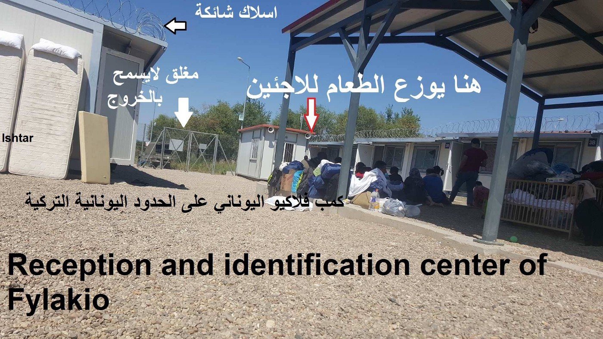
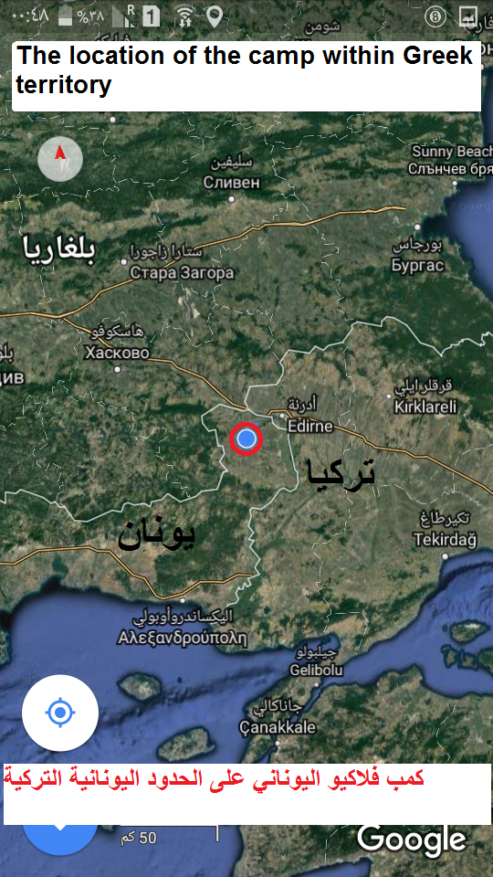
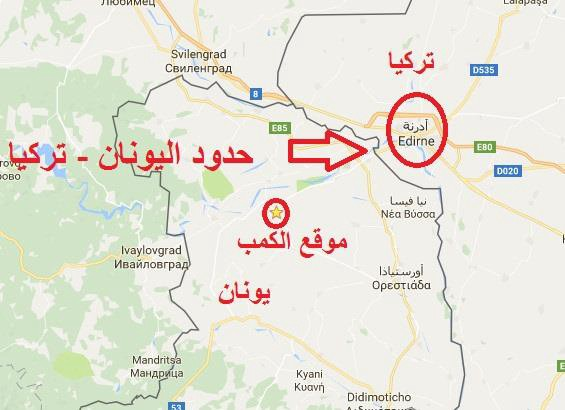
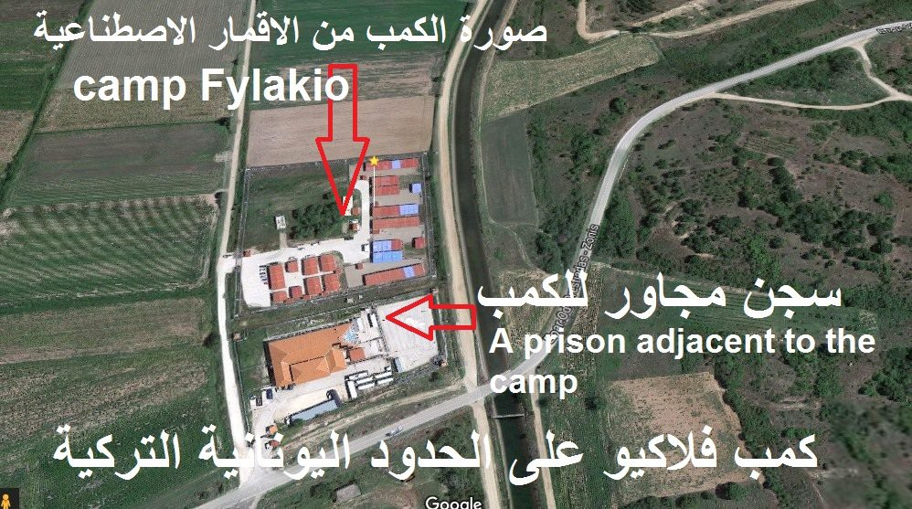
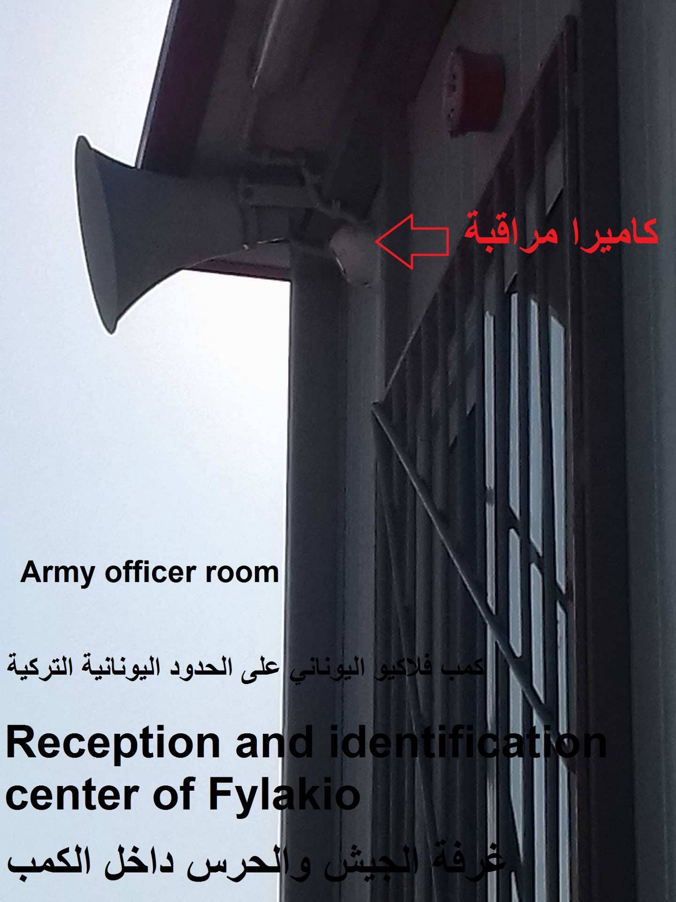
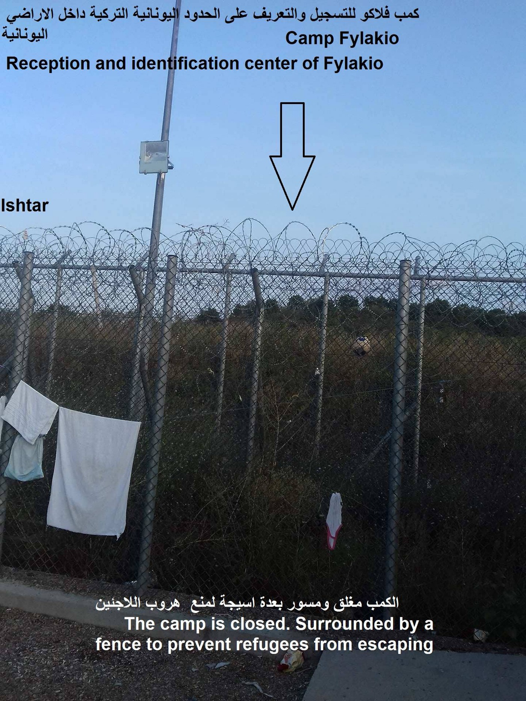
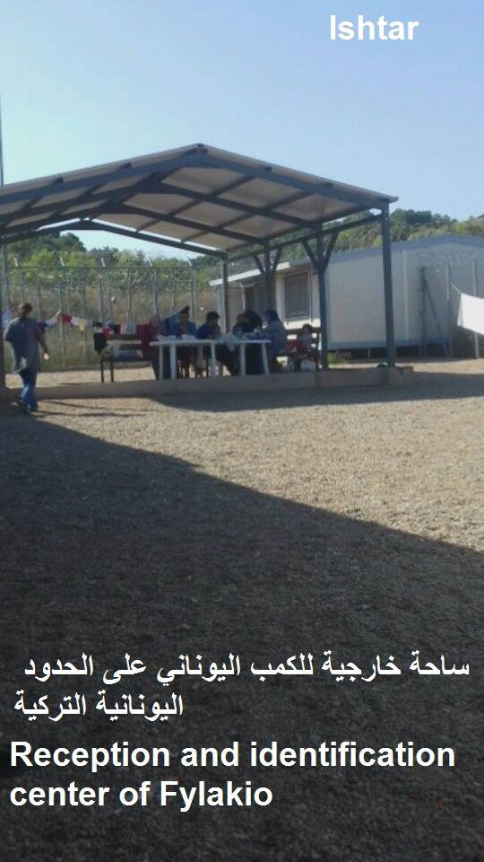
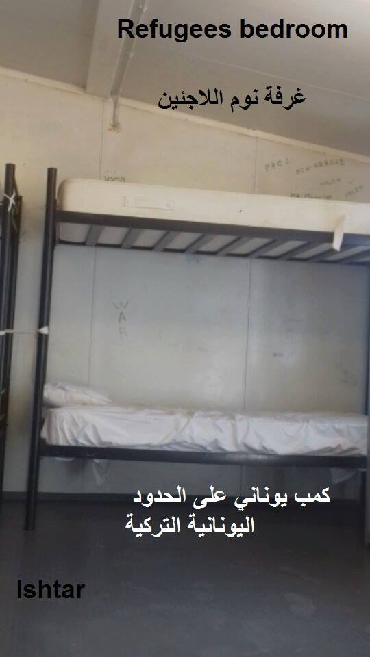

### AYS SPECIAL: Reception center in Fylakio

_Our friends from ISHTAR group shared with us an report from Fylakio center, the place at the border in between Greece and Turkey, for people who are stopped crossing by the land in this area\. Little information has been available so far about this camp, and residents are waring about serious violations of rights of unaccompanied minors in the center\._

Fylakio is the reception and identification center and it is located in Greece, 10 km from the Turkish border\. The closest city in Turkey is Edirne\.

The camp is under the Greek military administration, and people who are registered and issued with the documents there, are those caught crossing by land from Turkey\. Fingerprint for all the refugees is mandatory in this place\.

Resident who sent the report to the [ISHTAR group](https://www.facebook.com/permalink.php?story_fbid=1406652579442017&id=687993924641223) wrote that refugees are initially placed in a prison located adjacent to the camp, usually for a period of three days to two weeks\. Inside of the prison, any means of communication or telephone are not allowed\.

After a period of time in prison, people are transferred to the nearby Fylakio camp, where from they can leave to any place n the mainland after they receive their documents\.

The camp is surrounded by fences, barbed wire, surveillance cameras and under the guard of the Greek army\. It also prevents the entry of humanitarian organizations into the camp\. Most of the people inside are Syrians, Iraqis and Palestinians\.

The big problem at Camp Fylakio is that unaccompanied minors are held for a long time in this compound, the report states\. Inside of the camp there is a number of minors detained for more than two and a half months\. As explanation for the detention they were told that in Fylakio there is no place for minors but just for families\. They were also told that if there is a place for them in the camps of minors in Greek cities, they will be transported\.

However, many of them suffer from psychological conditions because of their detention\. Some are even calling this place Guantanamo\.

The Camp has internet, which makes life of people inside easier\.

Nevertheless, like in other places residents complain about the food, that is not well cooked and is repeated in the three meals\. It does not contain nutrients that nourish the body and fill the stomach, the report claims\.

There is no restaurant, cafeteria or supermarket close by for people to buy their food, so they have to rely on food provided by the Army\.

Other problem is that even when allowed to leave the camp, people have to find transportation and pay for it, which for many is imposible\. This isolation makes the inhabitants feels like they are in exile, the report claims\.

Residents also complain about people the Army allow to enter, and who are allowed to sell cards, telephone lines, chocolate, biscuits, etc\., but at double and expensive prices\.

The camp management ignores the issues that there are lot of mosquitos in this area, and many people suffer due to bites\.

The residents are asking humanitarian organizations and human rights organizations to pressure the Greek government to care for refugees, especially minors\.

“Long\-term detention under the pretext of the lack of housing in minors’ complexes in other Greek cities would increase the psychological problems of the minor refugees who should be cared for and not detained in poor conditions in a camp like prison\. These refugees fled wars and conflicts\. They came for safety\. This is a serious violation of the rights of refugees and minors at the same time,” the report from Fylakio claims\.

> **_We strive to echo correct news from the ground, through collaborationand fairness, so let us know if something you read here is not right\._** 

> **_Anything you want to share — contact us on Facebook or writeto:areyousyrious@gmail\.com_** 

_Converted [Medium Post](https://medium.com/are-you-syrious/ays-special-reception-center-in-fylakio-e7068196d369) by [ZMediumToMarkdown](https://github.com/ZhgChgLi/ZMediumToMarkdown)._
