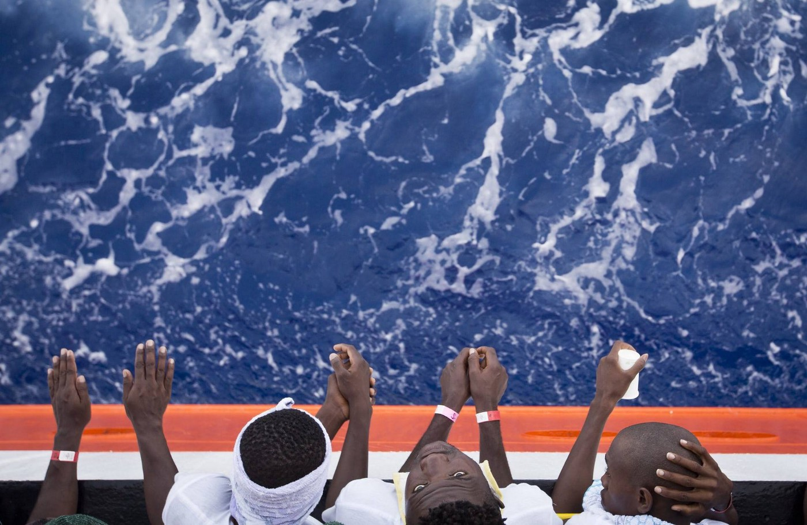

### AYS Daily Digest 02/09/17: Disaster is narrowly avoided when Spanish and Moroccan authorities fail to heed warning signal

_Refugees on Lesvos, promised swift resolution to their asylum cases, continue long wait / Hungarian PM demands funding from EU for border wall / Parisian police mimic tactics used in Calais / Portugal continues to be overlooked as destination for refugees / And more news…_

African refugees on the Aquarius rescue vessel en\-route to Italy \(Photo by Darko Bandic\)
### FEATURE: Another report of negligence on the part of the Spanish and Moroccan coastguards

In a [distressing post](https://alarmphone.org/en/2017/09/01/urgent-distress-38-people-nearly-24-hours-at-sea-because-coastguards-did-not-react/?post_type_release_type=post) , Alarm Phone revealed that on August 31st they received a call from a boat carrying 38 people, the engine of which had stopped working; they were now at the mercy of the seas\. Alarm Phone first notified the Spanish coastguard at 11am, and when the situation became truly desperate, the Moroccan coastguard was contacted an hour later\. Both coastguards refused to heed the organization’s call while dozens of people were stranded\.

The Spanish coastguard only took the situation seriously after Alarm Phone contacted NGOs to get word out about the situation\. Finally, the Spanish coastguard sent out a helicopter at 8pm to search for the boat, and once it was located, they claimed that the rescue operation would begin at 10:30pm\. Nearly an hour later, however, the refugees were still at sea and their boat was deflating, giving them cause for alarm\. The refugees were finally rescued by the Moroccan coastguard around midnight\.

Although this case thankfully ended with the refugees in safety, it very easily could have gone the other way because of authorities dragging their feet\. This incident reflects very poorly on both Spain and Morocco, two countries which already have a reputation for negligence towards refugee populations\. It is very important that these two countries as well as others take this incident as an example of what not to do, for it is truly an example of sheer luck that nobody was harmed despite the grave negligence\.
### GREECE

Some of the new tents built on Chios
#### Authorities lie to protesting refugees on Lesvos

For about a week now, a group of refugees \(mainly from Afghanistan\) residing in Moria camp have been protesting on the island of Lesvos\. Among the refugees’ demands are the expedition of their asylum applications, an end to deportations, and freedom of movement to the Greek mainland\. Creating quite a stir, many attended the protest wearing T\-shirts on which their date of arrival was written\. Some claimed they had been on the island for more than a year and demanded that the situation be rectified\.

After three days of protests and occupations, on August 30, authorities promised the demonstrators that their demands will be met once they returned to the camp, and that asylum cases would be decided by September 1\. Authorities have still not given word of their plans, and many are threatening to reoccupy Sappho Square in Mytilene\. Lesvos has long been overwhelmed by the number of refugees forcibly kept on the island, as according to UNHCR there are currently over 5,000 refugees trapped on Lesvos\. This overcrowding is the result of the continuous arrivals in conjunction with the failure of the Greek bureaucracy to process cases speedily\.
#### Khora about to begin new round of language classes

Khora is going to be teaching English, Greek, German, and French to refugees once more\. Classes are set to begin on September 11\. For more information, please see the message below:

> _Khora \(Asklipiou 80, Athens\) will be starting its next cycle of language classes on September 11\. We offer classes in Greek, English, German, and French at a variety of levels\. We will be signing up new students the week of SEPTEMBER 4\. To sign up, students must:_ 

> _GREEK: Come to Khora between 14:00 and 15:00 the week of September 4 and talk with the Greek teacher\._ 

> _ENGLISH and GERMAN: Come to Khora as soon as possible to make an assessment appointment\. We strongly encourage students to make an appointment for their assessments\. We will still assess students who don’t have an appointment, but we can’t guarantee there will be room for them to be assessed, and they may have to wait\._ 

> _English and German assessments will be held Monday September 4– Wednesday September 6 on the following schedule:_ 

> _10:00–12:00 Women Only assessments_ 
 

> _12:00–15:00 Mixed Gender assessments by appointment_ 

> _FRENCH: Come Monday, September 11, at 14:00 and talk with the French teachers\._ 

#### Refugees escape from detention camp

10 refugees escaped from the Amygdaleza detention camp, located north of Athens, on Friday\. The refugees were staying in the section of the camp designated for people who voluntarily agreed to return to their country of origin\. Five have been arrested, and the police are continuing to search for the rest\.
#### Volunteer Rescue Crew looks for new volunteers on Lesvos

> _Volunteers needed A\.S\.A\.P\. to join our land crew team\._ 

> _We are a spotting team carrying out three main tasks: boat spotting during the day, boat spotting during the night, and support at a stage 2 temporary camp\._ 

> _To be eligible to work with us you need: good eye sight, ability to communicate in English, a driving license \(not mandatory\) \._ 

> _Please watch this video to get a better idea of what we do, how we work and how we enjoy our time off\! : [https://www\.facebook\.com/RefugeeRescueUK/videos/1472040412863404/](https://www.facebook.com/RefugeeRescueUK/videos/1472040412863404/?fref=mentions)_ 

> _You can find more info and the application form here: [http://www\.refugeerescue\.co\.uk/land\-crew/](https://l.facebook.com/l.php?u=http%3A%2F%2Fwww.refugeerescue.co.uk%2Fland-crew%2F&h=ATNKhsoH_GVAyWnv48e2r-_ch2uksk_KAEmsZszEFGHboKP-OlVgLhffwLDL0Pucm9p4fnbPC1oAbX595NoYB8unDSRrLJ2hOEklpi5JAb6ybzmFm6mCdFpFRrXAhkM9TBv9vLyYlkN6EWe_ALEJ5pGtiNx3okYwXyNx1igUGAs7K9ui9nelRMwvQlanAHD1w1NxMIKV78kvVgixHkX6BW_UJyxpmC9b2m4FceoS1ZEE7lGV6XXP8jtN7wU4UY_-hizRg6_GER1FD0XE74N8tPJJ)_ 

> _Hope to see you soon\!_ 

> _Giulia,_ 

> _Refugee Rescue Field Coordinator_ 

#### Refugee Support Greece introduces token system in its Camp Filipiada shop

On Monday, the Camp Filipiada shop run by Refugee Support Greece will launch its new token system\. Each week, tokens will be distributed to refugees living in the camp, who will in turn proceed to trade in these tokens for goods at the store\. The video below demonstrates the system in action\.

#### No Border Kitchen looking for new cooks

No Border Kitchen has won accolades for its important work feeding refugees, ensuring that nobody goes hungry when Greek authorities fail to provide adequate, nutritious food in the overcrowded and understaffed camps on the Aegean islands\. The organization’s work is not limited to food preparation however, and many of its members take an active part in political organizing\. If you can commit to at least two weeks of work and would like to volunteer to ensure that nobody goes hungry, please contact No Border Kitchen through their Facebook page or by emailing them at noborderkitchen@riseup\.net\.

#### ERCI is fundraising to continue its operations

Emergency Response Center International, or ERCI for short, has been performing rescue operations off the coast of Lesvos for some time now\. Today they were the sole organization performing rescues in the area, as the above video shows\. You may help the organization continue its important work by donating at the link below\.

#### Artists in Transit provides art workshops for refugees in Athens

Artists in Transit hopes to respond to the need felt by many people that goes beyond the basic essentials of life, such as food, shelter, and proper hygiene\. Even if all of these things are provided, a life without art, for some people, seems dull\. And so, the organization will be running workshops from the 21st to the 26th of September, as well as from the 28th of September to the 3rd of October\. Among the options offered are green screen media workshops, printing, painting, and crafts, as well as other things\. To learn more, please visit [their Facebook page](https://www.facebook.com/Artiststransit/) \.
### HUNGARY
#### EU rejects Orban’s appeal for funding of border fence

The European Commission has decisively denied Hungarian demands for funding to build fences along its borders with Serbia and Croatia in a bid to stem the flow of refugees into the country\. Hungarian PM Viktor Orban had asked the EU to cover half of the 800 million Euro sum Hungary has spent militarizing its border as a show of solidarity, saying that Hungary has been playing a crucial role in ‘protecting’ “all of Europe against the flood of illegal migrants\.” EU Commission spokesman Alexander Winterstein responded by saying this “is a two\-way street, and all member states should be ready to contribute\. This is not some sort of a la carte menu where you pick one dish,” referring to Hungary’s failure to meet its obligations under refugee relocation programs\.

Although the EU Commission is refusing to pay for physical barriers erected on the border however, they are more than willing to finance surveillance equipment along the border\.
#### FRANCE
#### Paris police make it difficult for refugees to rest

Médecins du monde has [published an article](http://www.medecinsdumonde.org/fr/actualites/migrants/2017/08/31/la-chasse-lhomme-perdure) about the situation in Paris\. They state that, since the latest eviction at Porte de la Chapelle, the police have maintained a constant presence during the day trying to disperse the refugees and make them disappear\. Refugees are constantly on the move and have to hide to sleep\. It’s difficult for them to get access to care\. Their primary needs are not met, as the distribution of meals is interrupted regularly\. The van of Médecins du monde providing medical care has to leave their place regularly — authorities want to discourage any form of “settlement”\. Médecins du monde are asking the authorities to stop this practice of hunting for migrants, to open unconditional reception centers in France to protect the rights of the migrants, and to develop the implementation of a humane politics of migration and integration that would protect the right of migrants\.

Paris Refugee Ground Support is one of the brave groups that continue to aid refugees who have nowhere to go but the streets of Paris, and you may help them support these refugees by donating to their fundraiser, linked below\.

#### Volunteer organizations set up temporary showers in Calais until the government builds permanent structures

After relentless public pressure for months on end, the French government’s hand was forced, and a pledge was made to to install public showers for refugees, but the process will take some time\. Until those are built, Help Refugees, L’Auberge des migrants, Utopia 56, and Refugees Community Kitchen have launched their mobile showers from a van\. The authorities have agreed to tolerate this installation as long as it doesn’t cause public disorder\.
#### Fight breaks out between police, refugees in Calais

About 50 migrants tried to take advantage of a traffic jam on the port ring road \(rocade portuaire\) in Calais to climb onto trucks\. Police came and dispersed them\. “Our British colleagues had only opened nine out of 14 lines that weekend, 9000 vehicles were expected at the Eurotunnel and 7500 at the port\.” The police temporarily blocked the highway\. The CRS intervened and used the threat of gas\. Three police officers were injured by hurled stones\. Those migrants who managed to climb onto the trucks were hunted down by the officers when the drivers signaled to them\. According to the prefect, these attempts to reach England have become “routine” on days of heavy traffic\. They were frequent before the eviction of the Jungle in October 2016\. During the night of Friday to Saturday, three blockades of A16 and the ring road \(as attempt to stop the trucks\) were also removed\.
### PORTUGAL
#### Portugal fails to meet relocation quotas owing to refugees’ reluctance to go there

Portugal is trying its best to meet the relocation quotas as put forth by the EU\. So far, the country has relocated approximately half of the 2,951 asylum seekers that it is required to take in from camps in Greece and Italy, but the demand is low and of those who come, few stay\. Over 40 percent of the refugees who arrive in Portugal leave the country within 18 months\. In 2015 as the refugee crisis reached its peak, the Portuguese Prime Minister said that the country was capable of supporting up to 10,000 refugees\. Later, the country formally agreed to take in 4,600\. The country lacks the open racist hostility to refugees found in many other parts of Europe, and yet it is still not a desired destination\.

Experts say that the problem is linked to Portugal’s lack of established Arabic\-speaking communities, and this makes people reluctant to come\. Another cause for concern is complications in the delivery of promises made by the Portuguese government as a result of inefficiencies in the bureaucracy\. Portugal’s tourist\-based economy also means that people who are not proficient in English or Portuguese are at a disadvantage\.

A guide for refugees considering relocation to Portugal may be found below\.

### SEA
#### Latest numbers and new operations

MEDU has reported on its page that 265 migrants were saved today over the course of five rescue operations\. Among them are 42 unaccompanied minors, 10 single women, and three pregnant women\. The ethnic composition of the arrivals is very mixed, with nationals hailing from Nigeria, Guinea Conakry, Libya, Gambia, Mali, Senegal, Ethiopia, Algeria, Morocco, Syria, Ghana, Ivory Coast, Egypt, Tunisia, Liberia, and Sierra Leone\. The staff of MSF on board told the medico\-psychological team of Medu that many are victims of tortures, rape, sexual violence and trafficking\. One woman from Cameroon who tended to had been raped and violated\.

> **_We strive to echo correct news from the ground through collaboration and fairness, so please let us know if something you read here isn’t right\._** 

> **_For anything that you want to share, feel free to contact us via Facebook, Twitter, or write to: areyousyrious@gmail\.com\._** 

_Converted [Medium Post](https://areyousyrious.medium.com/ays-daily-digest-02-09-17-bc424351bcdc) by [ZMediumToMarkdown](https://github.com/ZhgChgLi/ZMediumToMarkdown)._
