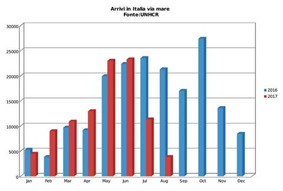
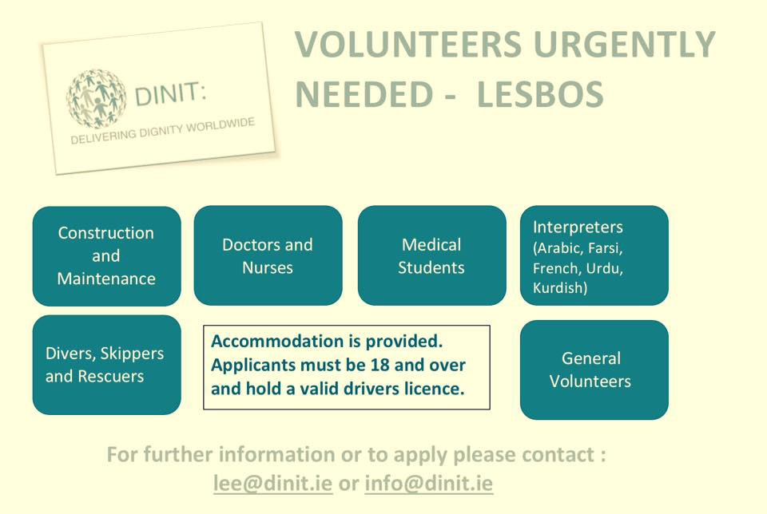
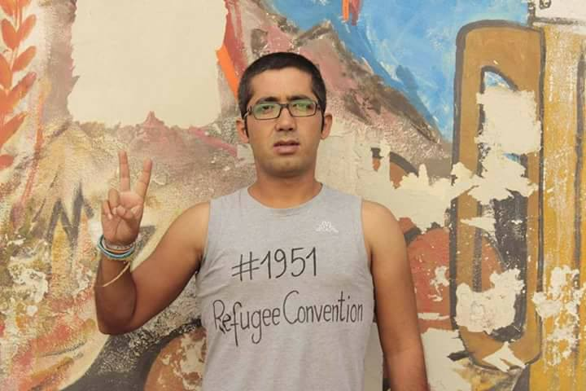
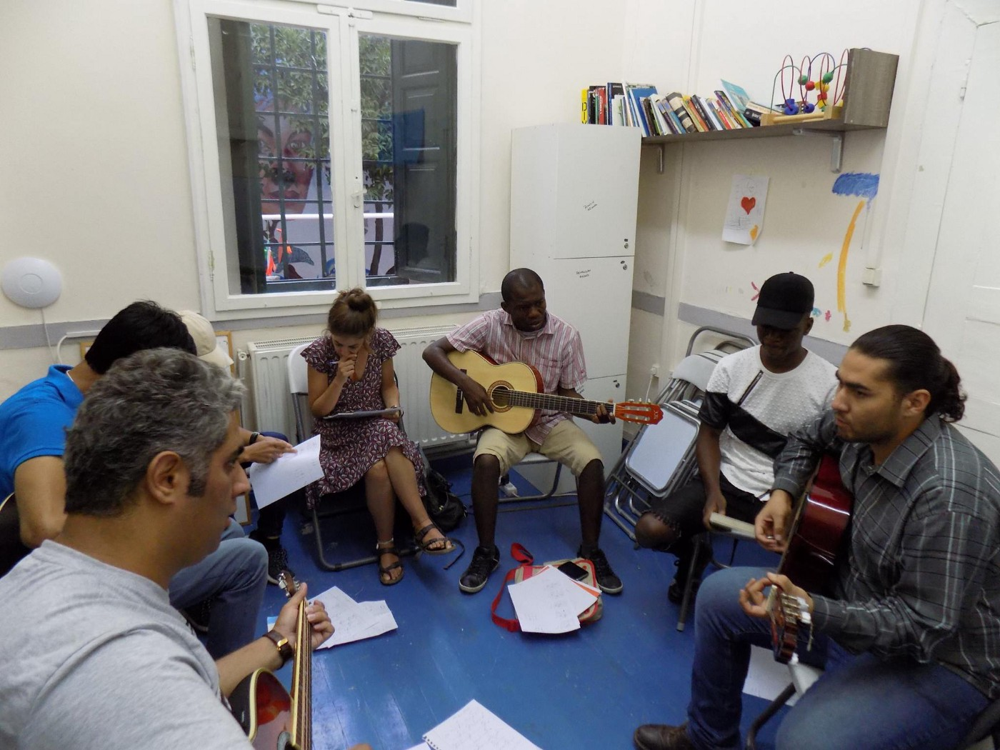
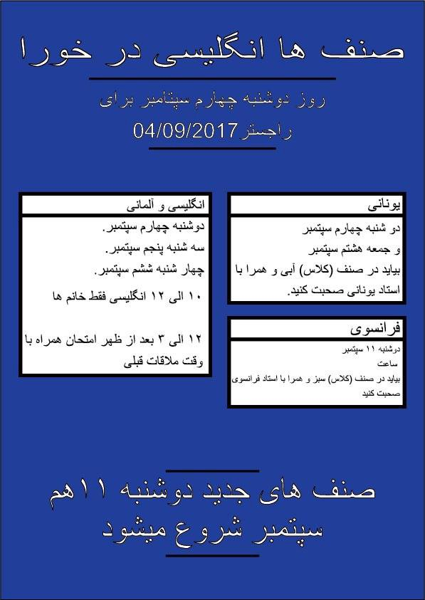
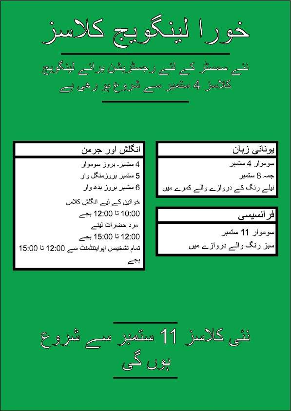
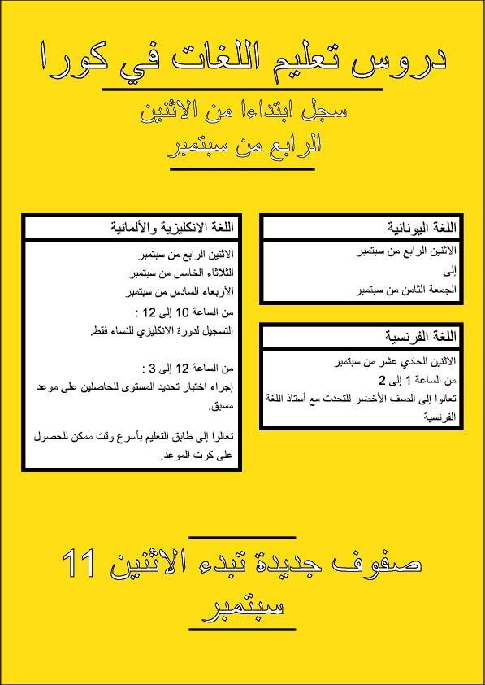
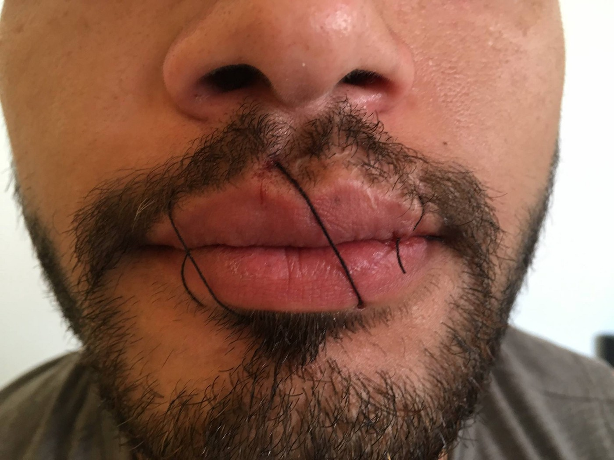

### AYS DAILY DIGEST 3/9/2017: \#1951RefugeeConvention

_Due to restrictive measures number of people arrived in Italy decreased// At the same time, number of people in detention in Libya is increasing every day // Huge gaps in Spanish reception system // New protests on Lesvos // Do not forget — every child has a right to go to school\! \! \! \! // At least 600 people on the streets of the EU capital // Important info for people from Afghanistan seeking asylum_

 , [\#refugeeswelcome](https://www.facebook.com/hashtag/refugeeswelcome) , [\#NOborders](https://www.facebook.com/hashtag/noborders) By Art Against](assets/9c36fd338ee5/1*p7Al7TBBX8TcItlGo1E4Rg.jpeg)

Refugee 2018 By Luc Descheemaeker [\#openeuborders](https://www.facebook.com/hashtag/openeuborders) , [\#refugeeswelcome](https://www.facebook.com/hashtag/refugeeswelcome) , [\#NOborders](https://www.facebook.com/hashtag/noborders) By Art Against
### Italy

During the August, number of new arrivals to Italy by sea dropped down to 82 percent in comparison to the same period last year \(3,813 vs 21\.294 new arrivals\), according to the official data\. This was the month with the least new arrivals, and mostly due to new restrictive policies that were imposed\.

However, IOM and UNHCR data are showing that hundreds of thousands of people in Libya, hoping to cross soon\. Many held in detention like facilities and exposed to all kind of abuse, including sexual violence and torture\. Some reports are saying that over 85 percent of people who cross the sea from Libya were subjected to different types of torture in that country\. This data and pictures published from some of the places of detention are not enough for European politicians to become more humane\.

In Rome, [according to La Repubblica daily](http://roma.repubblica.it/…/roma_indagata_per_lesioni_agg…/…) , group of people who celebrated Aid was exposed to attack and insults by a right wing group\.

Around 40 people hosted in the center of Via Frantoio \(managed by Red Cross\) were taking part in a religious celebration organized by Comunità di Sant’Egidio\. There were kids and women as well, and they were forced to stay inside the church as outside a group of fascists protested and threatened migrants\. Police were present\.

The media are reporting that the tension is high in the area also due to what happened early on in the week when there were clashes between locals and migrants hosted in the same center when one migrant, who is still in hospital was stabbed by the knife\. The person responsible is under investigation\.
### Spain

Activist and local authorities from in Spain are worried about the lack of housing for refugees and migrnats\. Group of mayors from different islands warn that the Spanish reception system has huge gaps\.

“The reception system consists of 3 phases which should take place in the same place as it is a system of integration and continuity\. The First 6 months \(1st phase\) are spent in a reception center where refugees learn the language, know the city, attend courses and integrate into a community\.
The next 6 months \(the 2nd phase\), the refugees must look for a rental apartment, Independence, continue learning the language and seek work following a game of work insertion such as the one that exists for any of us\.

And in the 3rd phase \(another 6 months\), they are supposed to be independent, find work or continue training\. If already in the 1st phase they have to leave Mallorca for lack of rental homes, we do not know what will happen in the 2nd phase in smaller municipalities that do not even know or know them, which is when they must find — a job\.”
### Mediterranean

[Sea Watch issued another summary of intervention](https://sea-watch.org/en/breaking-news-of-the-week/?fref=gc&dti=1652972374920129) in the Mediterranean for the last week of August and beginning of September\. In one of the news, they write about the boat with 38 refugees that get distressed at sea in front of the coast of Morocco\. Despite calls for help from the NGO Watch the Med\-Alamphone, nobody came and people had to stay at the open sea for four hours\. When help finally came, it was done in such a way to allow the Moroccan coast guards to picked people up and broad them back to Africa\.

In the same period of time, in the front of Tunisia, sunk a refugee boat with 120 people\. One person managed to swim back to the coast and tell about the catastrophe\.

Now there are no more NGO boat l in the Mediterranean to witness the happenings and rescue more humans\.

_“All those incidents in the Mediterranean show: The suffering in the Mediterranean is not ended yet — and there is still dying because of European migration politics\.”_
### Greece

A number of new arrivals are rising every day\. Eric Kempson, one of the activists at Lesvos, [made an overview](https://www.facebook.com/eric.kempson.7?hc_ref=ARQPJ7Wl7DhnoW4gIcedIzdN4Ps4dCMJXQeki3YczP6sYDEbt_sIYA44JeYlahyd3uQ&fref=nf) of the day before showing that at least 297 people arrived during 24 hours time\.

A number of people who are arriving at Leros also increased\. With the new arrivals from the last night, it is over 350 this month\. As on the other islands, even Leros is overcrowded and volunteers there are fighting with the endurance, the hardships, the dead ends\. Most of the people who are helping to new arrivals are locals who not only provide first aid but share love and solidarity\.

A number of people in Athens are also again high, and many need help\. [A solidarity group will start with collective cooking](https://www.facebook.com/groups/204202716585823/permalink/519040215102070/?fref=gc&dti=1652972374920129&hc_location=ufi) again form Sunday 10/9 at 16:00 in Koumoundourou Square\. In order to do this, they need your help\. Contact them for more information with a comment or message on their FB\.

Lesvos is a place where no peace exists\. People who are stranded there are doing everything to show to the world that their living conditions are for human beings\. However, the world is very quiet about it so far\.

The latest news is about the group of people from Afghanistan who decided to occupied Mytilene’s Sappho Square, a public space at the heart of Lesvos\.

In this was, once again, they want to tell the world that about 5,000 refugees are trapped on the island and kept shut away in Moria prison camp\. It is 1,000 over its capacity\. No journalists or NGOs are allowed inside\. Police in this islands is ruthless toward refugees and asylum seekers, and government in Greece — even though aware of this — is doing nothing to stop this and act in accordance with the international law and human rights conventions\.

Many people are held in Moria for over 18 months, with no clear explanation why is that happening to them\.

[Novara Media spoke with Aarif Mohmand](http://novaramedia.com/2017/09/02/occupy-lesvos-refugee-resistance-at-the-heart-of-the-border-regime/) , one of the protesters, who described a typical day in Moria:

_“Wake up in a crowded container shared with 28 friends, queue for four hours a day to collect two meager meals of gritty broth or processed bread, and spend the rest of the time returning again and again to the asylum services to hear no progress has been made in your case\. “There’s a schedule for food,” he said, “but nothing for our asylum claims\. There is no asylum system\. Said Hashmatullah explained that many of his compatriots had been waiting on Lesvos for over a year without hearing a decision\. “The children can’t get an education, the adults can’t study or work,” he said\. “They just sit, queue for food, and eat, nothing else\. The people are going crazy as a result\. They are ready to kill themselves\.”_

[Arash Hampey](https://www.facebook.com/1951RefugeeConvention/posts/1568251126560949) , an activist in Iran, is trying now for months to draw the international attention to Lesvos and living conditions of people there\. He reminds on 1951 Refugee Convention ratified by 145 state parties which define the term ‘refugee,’ outlines the rights of the displaced, as well as the legal obligations of states to protect them\.

> “We can build our world according to our wishes, we can start by building alliances with those who believe in our common humanity and equality\. We will nonviolently struggle with a small writing on our clothes\. It is not much effort or cost, but the words were written were written over half a century ago to protect the lives of hundreds of thousands fleeing persecution\. We start this effort to remind the world of the lives that still need protecting\.
 

> We believe in the power of the people, and we have hope that nonviolent resistance and building of alliances can overcome the powers of the lawless governments that fail to protect us… 

> …Being a refugee does not strip us of our humanity\. We also have the right to be treated fairly, with dignity, and equality\. My goal is to break down the walls and government policies that treat refugees like we are less than human and create false divisions between people\.” 

In this way, he calls on all of us to join his **_\#1951RefugeeConvention_** campaign, to make an alliance demanding that states follow their own laws and protect the rights of all refugees\.

We stand in solidarity with Arash an all those whose rights are neglected\.

Join and share

■■■■■■■■■■■■■■ 
> **[Arash Hampay](https://twitter.com/ahampay) @ Twitter Says:** 

> > Please join and share it as you can..pleasure 
#1951RefugeeConvention campaign.

[facebook.com/1951RefugeeCon…](https://www.facebook.com/1951RefugeeConvention/) 

> **Tweeted at [2017-09-03 18:52:34](https://twitter.com/ahampay/status/904416849487683585).** 

■■■■■■■■■■■■■■ 

The Greek school year is about to start, as well as educational activities in the number of places which are run by NGOs or grass roots\.

Official school starts on September 11\. All the children in Greece have a right to go to school, and the government is obliged to fulfill this with no exceptions\. It is not possible to refuge a child saying there is no place in the school, and if that is done, you should report it to Ombudsperson or other bodies who are following human rights abuses\. You can also send an email in your own language to [eswg\.greece@gmail\.com](mailto:eswg.greece@gmail.com) \.

_You can write to our inbox, and we will make sure to make that public\._

Afternoon school program offered in Greece also is not in accordance with the right guaranteed for all the children, but it still exists for many children who live in official camps on the mainland\. NGOs who are working in these camps should put a pressure that this practice ends and help to families to enroll their kids in a regular school program and not continue supporting this practice\. We are here to support people, not governments in their restrictive polices\.

To enroll children in schools — and that can be done anytime during the school year — but to enroll before school starts, you should go to the nearest school between September 1 and 8 and say you want to enroll\.

If you’re going to a school alone and you don’t speak Greek or English, you can take along this letter \(in Greek, English, Arabic, Farsi, and Urdu\) \. It asks the school to help you enroll your children\.

[For more details about school enrollment, see here](http://blog.refugee.info/enrolling-kids-in-school-in-greece/amp/) \.

Among many other activities, Mosaik Support Center at Mytilene offers guitar classes\. [Check their FB page for more](https://www.facebook.com/mosaiksupportcenter/?hc_ref=ART-w63yo1PEHBjUCIkxPru8RhoS2Lx4b72Mri66Fg6uG_KJMgdOKkLY7l7xvfo3sng&fref=nf) info\.

Photo by Mosiak Support center\.

Free language classes for everybody, and much more, is offered in at the [Piraeus Open School of Immigrants in Athens](https://goo.gl/maps/dfxeMthRFTx) \.

Classes start on Sunday, September 17th\!

For information please check [www\.asmpeiraia\.gr](http://www.asmpeiraia.gr) or contact us by e\-mail to [info@asmpir\.gr](mailto:info@asmpir.gr) and telephone to 2104200917

[Khora center](https://www.facebook.com/KhoraAthens/posts/761749793997631?fref=gc&dti=1652972374920129&hc_location=ufi) in Athens also offers language classes, and much more\.

### Bulgaria

[After they build the walls, the government in Bulgaria build a new detention center calling it “the first refugee center of restricted type”](http://www.novinite.com/articles/182940/The+First+Refugee+Center+of+Restricted+Type+is+Ready) \. It will become operational soon, as the local media are reporting\.

The center is situated in the village of Pastrogor and has the capacity of 300 people\.

At the same time, repairs begin at the refugee camp in Harmanli, known by the cruelty of its guards toward refugees\. So far, only 25 percent of its capacity is filled, mostly because people are running away from it due to the bad treatment\. According to the official data from the Ministry of Interior, since the beginning of the year, more than 4000 refugees have escaped from the refugee’s centers, while 1300 of them were detained inside the country or attempting to leave illegally\.

Even though Bulgaria is part of the EU, nobody in Brussels showed any type of concern for what is happening in this country so far\.
### The Netherlands

A very disturbing image and the information are coming from this country\. A young LGBT asylum seeker from Azerbaijan, with whom LGBT Asylum Support has recently come into contact, began a hunger and thirst strike, sewing his lips on September 2nd\.

People from [LGBT Asylum Support](https://www.facebook.com/LGBTAsylumSupport/) group visited him not only to support him morally but also to ask him not to take this action and to put his life at stake\.

According to their report, he has a Dublin claim France and is afraid of what will happen to him\. Now, they are looking to find him a new lawyer that will help with his case\.

_“His desperate act also shows how hopeless and powerless LGBT asylum seekers can feel when there is little or no information from IND\. But also that he has never been able to tell his real story so far why he had to flee his country, with the uncertainty as to whether a next country will deport him\.”_
### Belgium

Little can be found on the situation with refugees and asylum seekers in Belgium, but, as we know, there are many people sleeping in the street of the EU capital — Brussels\. Belgian Kitchen group provides around 600 meals every day since March this year\. [To continue, they need help](https://mydonate.bt.com/fundraisers/belkit) \.

**_If you help more info about the situation in Belgium, please get in touch with us\._**
### UK

[According to the BBC](http://www.bbc.co.uk/news/amp/uk-scotland-edinburgh-east-fife-41140649) , a fire attack at the migrant home in Edinburgh happened this weekend\. The family is from Egypt and they are leaving in fear after this attack and number of other provocations from before\. Due to being scared, women in this family decided to take off their niqabs\. Police are aware of the situation, and they told the media that they believed the fire was started deliberately and that an investigation was under way\.

[Officially, up until the end of March this year, 9,634 people were granted asylum or an alternative form of protection in the UK](https://www.gov.uk/government/publications/immigration-statistics-january-to-march-2017/how-many-people-do-we-grant-asylum-or-protection-to) , and an additional 6,245 people newly provided with protection and support under a resettlement scheme the UK\.

Most of the people applying for asylum are from Afghanistan, Iran, Iraq, and Pakistan\.

But, many people who are seeking protection end up in detention, the [Detention forum](http://detentionforum.org.uk/our-response-to-brook-house-g4s-staff-abuse-allegations/?fref=gc&dti=1652972374920129) warns once and again\.

_“Deprivation of liberty must be an exceptional measure of last resort: yet the UK detains migrants routinely, locking up nearly 30,000 people a year for administrative reasons in prison\-like conditions\. The UK is also the only country in Europe to detain migrants without a time limit, a practice that has been repeatedly criticised by monitoring bodies, including Her Majesty’s Inspectorate of Prisons\. Anyone who does not have a secure immigration status is at risk of detention\. Detention separates families, including parents from their children\. “_
### THIS IS OF PARTICULAR IMPORTANCE TO THE MANY AFGHAN MEMBERS IN THE GROUP

The most up to date source of positive/ negative asylum decisions by EU country and nationality of asylum applicants\. 
It doesn’t concern Syrians, Eritreans and Yemenis so much, who have near 100% positive decisions EU wide, whereas acceptance rates vary wildly for Afghans, Iraqis, Sudanese and others\.

The rejection rate for Afghans is 64% in the UK, 38% in Germany and 17% in France\.

On the other hand, France rejects 55% of Sudanese refugees whereas the UK only 15%\.

Anyone trying to decide which European country gives them the best chance of asylum, [please check the facts by using this link](http://www.asylumineurope.org/sites/default/files/report-download/aida_gr_2016update.pdf) and not what they hear and read on social media or from friends\.

> **_We strive to echo correct news from the ground, through collaboration and fairness, so let us know if something you read here is not right\._** 

> **_Anything you want to share — contact us on Facebook or write to:areyousyrious@gmail\.com_** 

_Converted [Medium Post](https://areyousyrious.medium.com/ays-daily-digest-3-9-2017-1951refugeeconvention-9c36fd338ee5) by [ZMediumToMarkdown](https://github.com/ZhgChgLi/ZMediumToMarkdown)._
