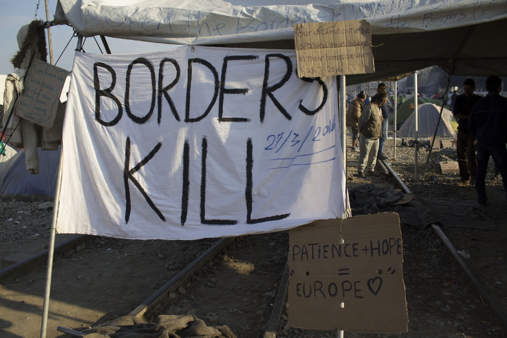
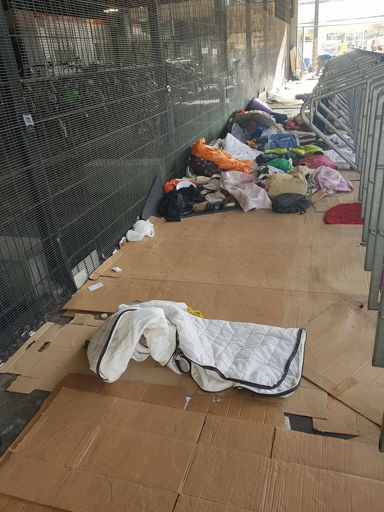
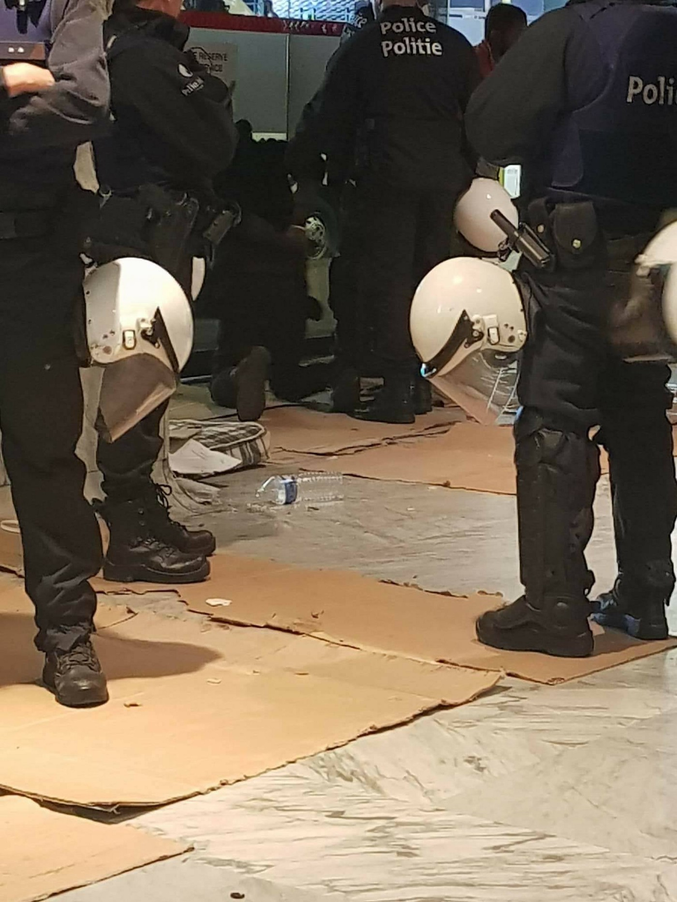

### AYS Daily Digest 06/09/17: As expected, Slovakia and Hungary lose in EU Court

_Relocation still mandatory / Greek Asylum Service’s staff on strike / Police violence in Belgium / Update with current needs in Paris / Asylum seekers and police clash in Finland / Sweden must stop border controls in November, EU says / Report on Afghan minors in Italy / Upcoming deportation of 15 people in Germany / And more news…_

Patience \+ hope = Europe \(Idomeni 2016\): both patience and hope are still needed \(Photo by AYS\)
### FEATURE: Slovakia and Hungary lose in EU Court of Justice

Slovakia and Hungary did not win their fight over the obligation to participate in the EU’s relocation program\. The two countries’ intention was to get the decision annulled\. [The EU’s Court of Justice](https://curia.europa.eu/jcms/upload/docs/application/pdf/2017-09/cp170091en.pdf) , based in Luxembourg, ruled in favour with the European Commission\. Slovakia and Hungary claimed that it should be the heads of states that decide on this issue and that the decision taken with majority by the migration ministers within the union was not in fact valid\. The Court denounced this opinion and in a statement quoted by [Reuters](https://www.reuters.com/article/us-europe-migrants-easteurope/eu-court-dismisses-hungary-slovak-case-against-taking-refugees-idUSKCN1BH0VR) said that its decision stands firm\.

_“The mechanism actually contributes to enabling Greece and Italy to deal with the impact of the 2015 migration crisis and is proportionate\.”_

What is worth noting in relation to this is that regardless of this single positive decision, the relocation mechanism remains far from a success\. The ambition was to ease the situation for the countries mentioned above, but in reality that barely has happened\. Instead of relocating 160,000 people—which soon became 120,000 after 54,000 places were given to Syrians in Turkey — the program has so far relocated between 25,000 and 27,000 people, depending on the sources\. [Reuters](https://www.reuters.com/article/us-europe-migrants-easteurope/eu-court-dismisses-hungary-slovak-case-against-taking-refugees-idUSKCN1BH0VR) uses the most modest number, and the [EC](http://europa.eu/rapid/press-release_IP-17-3081_en.htm) the higher one\. Brussels will, according to the Court’s decision, still have the right to force everyone to accept asylum seekers from the program, that in total so far haven’t relocated even a quarter of the goal of 120,000 people\.

The lack of self\-criticism is incredible\. In the meantime, human beings are suffering for the European Unions shortcomings and lack of sustainable solutions\. It is not that hard to describe ones action as a success, if the goal constantly is adjusted according to what has been achieved so far and not what the intention once was\.

Instead of focusing on protection, the EU puts more efforts in external [border controls](https://ec.europa.eu/home-affairs/sites/homeaffairs/files/what-we-do/policies/securing-eu-borders/20170906_fifth_report_on_the_operationalisation_of_the_ebcg_en.pdf) to keep people away\. [And then there is the EU\-Turkey Statement](http://www.ekathimerini.com/221436/article/ekathimerini/news/avramopoulos-eu-turkey-deal-cut-migrant-arrivals-97-percent?fref=gc&dti=1652972374920129) , that was implemented in March 2016\. That one is also mentioned as a success, since the flow to the Greek island has decresed since then\. Dimitris Avramopoulos, EU Migration Commissioner, today said that the arrivals to the Greek islands have dropped with 97 percent\. It “continues to deliver results”\. Unfortunately, the EU forgot to ask the people stuck in Turkey what they think about the agreement and how if have been affecting them\. So far, [8800 Syrians in Turkey](http://www.ekathimerini.com/221436/article/ekathimerini/news/avramopoulos-eu-turkey-deal-cut-migrant-arrivals-97-percent?fref=gc&dti=1652972374920129) have been relocated of the 54 000 places that was made available when 160 000 became 120 000\. More about the impacts the EU\-Turkey statement has for those stuck in Greece, and those working for the Greek Asylum Service, under that headline or [here](http://www.ekathimerini.com/221430/article/ekathimerini/news/workers-in-greeces-asylum-service-launch-2-day-strike?fref=gc&dti=1652972374920129) \.
### EU

The Dublin system in the first half of 2017, key figures from selected European countries, provided by AIDA\. [More information and details here\.](http://www.asylumineurope.org/.../aida_halfyear2017update...)
### LEBANON

[NRC Middle East](https://www.facebook.com/NRCMiddleEast/?hc_ref=ARS09j-iKmXXV2e-vA2tDlE7M2XEBdrMYUXCpjBfjv5bSmk8KQISHdGI2oJO7Sd4x8w&fref=nf) runs projects in Lebanon\. Now Syrian kids can play with Lebanese kids\. A new playground was opened in South Lebanon in Ansar in July\. The video was done in collaboration with the Lebanese NGO [GAME Lebanon](https://www.facebook.com/GAMELebanon/?fref=mentions) \.

### GREECE
#### Greek Asylum Service staff on strike

First of all, it is the people so often labeled as refugees that are affected by the over strained asylum system in Greece\. But the employees are also in a difficult situation, Ekathimerini today [reports](http://www.ekathimerini.com/221430/article/ekathimerini/news/workers-in-greeces-asylum-service-launch-2-day-strike?fref=gc&dti=1652972374920129) \. As mentioned in todays feature, EU’s attempts to help Greece and Italy, that is the main ports further into the EU and western Europe, fails\. The success is not nearly noticed on the ground\. In Greece, the pressure on the asylum system and the responsible department GAS \(Greek Asylum Service\) have been huge the last couple of years, and since everything is moving slowly it continues to be overloaded\.

The people on strike at GAS are employed on short term contracts\. They have launched the strike since they haven’t received their payments on time\. Despite the fact that the EU\-Turkey agreement has decreased the number of people arriving, the closed border policy is also doing that almost everyone that reaches Greece and got stuck in the country applies for asylum here\. Which means a huge workload for GAS and its staff\. [The strike started today](http://www.ekathimerini.com/221430/article/ekathimerini/news/workers-in-greeces-asylum-service-launch-2-day-strike?fref=gc&dti=1652972374920129) and will continue one more day\. Tomorrow, Thursday, they will also protest in central Athens\.
#### **Athens: Women’s language classes**

Language classes for women only at [Mosaik Support Center](https://www.facebook.com/mosaiksupportcenter/) \. More details [here and in the photo below\.](https://www.facebook.com/mosaiksupportcenter/posts/1406579506122565?hc_location=ufi)

 \.](assets/4b46869269cb/1*De1d_YjP2so5SUmtcY0SUA.jpeg)

Photo and info from: [Mosaik Support Center](https://www.facebook.com/mosaiksupportcenter/) \.
#### **Athens: Laundry service in Nea Kavala**

A drop in the Ocean, [**Dråpen i Havet**](https://www.facebook.com/drapenihavet/?hc_ref=ARR_pHHO1Ni3ZzRGE7-yX_Pj5tkpq91N5WHp1A8I57tTxeRKAjNm47WU2ZO2lzCVR84) **,** has some [good news](https://www.facebook.com/drapenihavet/posts/1796913160326125?fref=gc&dti=1652972374920129&hc_location=ufi) \! They have finally, after a lot of delays caused by bureaucracy, been able to open a laundry service for the residents in Nea Kavala\. On Monday the service started, which means an end of hand washing which was the only option up until now\.

](assets/4b46869269cb/1*1UZTgEsjaMaYIs7uKC3olQ.jpeg)

Photo: [**Dråpen i Havet**](https://www.facebook.com/drapenihavet/?hc_ref=ARR_pHHO1Ni3ZzRGE7-yX_Pj5tkpq91N5WHp1A8I57tTxeRKAjNm47WU2ZO2lzCVR84)
#### **Athens: Info from Pampiraki**

[In the Elliniko warehouse](https://www.facebook.com/groups/135609506795670/permalink/489922384697712/?fref=gc&dti=1652972374920129&hc_location=ufi) the working hours are changing\.

_“Dears colleagues of Pampiraiki,_

_Please note that, as of 11/9/17 and until further notice, the working days/hours of our warehouse in Elliniko \(former airport — basketball stadium\) will be as follows:_

_TUESDAY — FRIDAY from 11 a\.m\. to 5 p\.m\._

_Pease send requests for humanitarian aid supplies to refugees/migrants in camps, self\-managed shelters, daycenters, flats etc\. to: pampiraiki@gmail\.com_

_For emergencies you may call us on: \+306906408586 \(Whatsapp\)”_

[Here is a map](https://goo.gl/maps/7VmJ758vCkC2) to the warehouse for those who can and wish to help\.
#### New arrivals and official registrations

Official registrations yesterday was \# [Lesvos](https://www.facebook.com/hashtag/lesbos?fref=gc&dti=1652972374920129&hc_location=ufi) 60 and [\#Samos](https://www.facebook.com/hashtag/samos?fref=gc&dti=1652972374920129&hc_location=ufi) 81 which brings the total for the 5th of September up to 141\. And today new arrivals was reported\.
#### **Lesvos**

Arrivals to Lesvos today, ERCI reports about two boats\. The first one with 26 people onboard and the second one with 15 people\.

■■■■■■■■■■■■■■ 
> **[ERCI](https://twitter.com/ERCIntl) @ Twitter Says:** 

> > #NEWS : First refugee boat arrival to Lesvos today was carrying 26 people. #Refugeecrisis #Lesvos 

> **Tweeted at [2017-09-06 06:59:56](https://twitter.com/ercintl/status/905324672480358400).** 

■■■■■■■■■■■■■■ 

■■■■■■■■■■■■■■ 
> **[ERCI](https://twitter.com/ERCIntl) @ Twitter Says:** 

> > #NEWS : Second refugee boat to arrive to Lesvos today was carrying 15 people. #Refugeecrisis #Lesvos 

> **Tweeted at [2017-09-06 07:00:08](https://twitter.com/ercintl/status/905324720987541504).** 

■■■■■■■■■■■■■■ 

#### Leros

A boat with 34 people arrived today\.

### ITALY
#### **Afghan child migrants in Italy**

[For Afghan child migrants,](https://www.afghanistan-analysts.org/afghan-child-migrants-italy-the-preferred-country-of-transit/) Italy is one of the most common countries of transit, but not the country most of them has as desired destination\. The researchers behind this report have been visiting Rome, Trieste and Gorizia to gain knowledge about this group and also the impacts of a new legislation to protect this group that was implemented in March 2017\. They spoke to several Afghan minors in Trieste and Rome and asked them about their future plans and how to integrate into the Italian community\. The Afghans interviewed also had different approaches to Italy: one ended up staying even though that wasn’t the plan, another one had Italy as his desired destination\.
#### **Invisible minors**

Many unaccompanied minors of Afghan origin in Italy moves on after they have disappeared from reception centers\. The authorities calls them “invisible minors” — since they are not possible to trace\. Why the young migrants leave Italy has several reasons\. One is economic — they thinks they have better future prospects in a richer country in the north\. Another reason is the lack of protection for child migrants in Italy\. Now Italy has improved their protection\. But, even though Italy has shown some good intention, the authors of the report concludes that the children often choose to move on anyways\.
#### **Arrivals from the Balkan route**

Another interesting finding in the report is that after an increase of Afghan minors arriving in 2008 and 2009, then a decrease the number of young Afghans now are on the rise again in Italy, but they are not coming from the sea\. They do point out one interesting factor that could be a cause — the big number of Afghans that have been stuck in Serbia\. From Serbia, there are many people that take the way through Italy before heading further north\.

As AYS have mentioned before and that UNHCR also have been writing in several of their reports, such as the informative report [Desperate Journeys](https://data2.unhcr.org/en/documents/download/58838) shows, the lack of legal paths makes Afghans the largest single nationality traveling irregular along the Balkan route\. The decrease in numbers in Serbia, from almost 8000 this spring to numbers below 5000 in August, clearly shows that people moving on\. Maybe to Italy\.
#### Northern Italy

In Verona, [One Bridge To Idomeni](https://www.facebook.com/1Bridge2Idomeni/) , tonight hosted an event to collect donations for their activities in norhern Italy including Gorizia near the border\. They have during their work on the ground noticed what the report above says, and have met with several young people arriving from the Balkan route the last couple of months\. Not only Afghans, also Pakistanis and Syrians are among the newly arrived from the north east\.

](assets/4b46869269cb/1*oPQTCfwjm4Y0Xn9v5C8zww.jpeg)

Poster featuring parts of the old Belgrade barracks\. Photo: [One Bridge To Idomeni](https://www.facebook.com/1Bridge2Idomeni/)
#### **Information about dangers related to trains**

[In Italy at least four migrants died](https://l.facebook.com/l.php?u=http%3A%2F%2Fwww.infomigrants.net%2Fen%2Fpost%2F4951%2Fitalian-railway-police-launch-migrant-train-safety-campaign%3Ffref%3Dgc%26dti%3D1652972374920129&h=ATPiR1xGgrpuyFJqI01jP76WtsWSEyn_YHkJb0QskCQb1kvBA2Xdw5A-hKHlc2CkDtkjrRdbdTSWPVls4t2ezhB6FznumxHsWK78Oj0v8aKRgR2_emfKgg-VGkTisI7sqk-LXhuAmGUwnbU) the first six months in 2017 in incidents connected to railways and trains\. To prevent this kind of tragic events the Italian Railway Police \(Polfer\) have launced a campaign in order to make foreigners, especially migrants and refugees that are forced to travel irregular, aware of risks related to trains and railways\. They call the campaign “Keep Safe From Railway Risk” and consists of multi\-language informational brochures that will be distributed in railway stations\.

Armando Nanei, the Railway Police Service director, explains that they have been seeing this kind of tragic events for a while now along the migrant route\. He says that in the countries the migrants come from they aren’t used to or aware of the risks\. This is their way to do something to prevent more tragic deaths due to lack of knowledge about the dangers\.
### FRANCE

Paris Refugee Ground Support continue to offer help to everyone in need\. They have a long needslist that is newly updated\. Please consider to help them to help other friends in need if you can\. They write that the weather currently is warm again, but that there are several other dangers lurking in the nigt\. A lot of people are also sleeping on the ground\. One of the reasons is the police violence and the evictions that we are way to familiar with in France\.

[Here are a selection of things they need\.](https://www.facebook.com/groups/147191459204361/permalink/147289219194585/) Please follow the link for more info\. Several different kinds of both men’s and women’t clothing is on it as well as hygein products, food packs, rain ponchos and beyond\.

> [The general needs will look a lot like this:](https://www.facebook.com/groups/147191459204361/permalink/147289219194585/) 

> \*Sleep and cover\* 

> \-Blankets \(Thick and thin\) 

> \-Sleeping bags \(Thick and thin\) 

> \-Tents \(popups are the best and 1/2/3 man are ideal, but we’ll take any and all\) 

> \-Inflatable pillows\. 

> \-Tarpaulins Small/Medium/Large\. 

> \* \-Backpacks \(Medium\) \* 

[**Mobile Refugee Support**](https://www.facebook.com/MobileRefugeeSupport/?hc_ref=ARQWCk_H3luzu1PXxesFkj3ixrtgxXMrmk_-tOTYDoqECwwn4i9eYNwDq2HVz6VrbMA) is also reporting from France, [saying that they are grateful](https://www.facebook.com/MobileRefugeeSupport/posts/652905674915047?fref=gc&dti=1652972374920129&hc_location=ufi) for all the support they can get while working in the area of Grande Synthe\. They are always in need of a hand, and if someone wanna help out — [get in touch\.](https://www.facebook.com/MobileRefugeeSupport/posts/652905674915047?fref=gc&dti=1652972374920129&hc_location=ufi)

](assets/4b46869269cb/1*KtP5G2SAqtLbxsljHFYuMA.jpeg)

Photo: [**Mobile Refugee Support**](https://www.facebook.com/MobileRefugeeSupport/?hc_ref=ARQWCk_H3luzu1PXxesFkj3ixrtgxXMrmk_-tOTYDoqECwwn4i9eYNwDq2HVz6VrbMA)
### BELGIUM

[From the heart of the EU,](https://m.facebook.com/story.php?story_fbid=509726106033023&id=153279105011060) not so warm news are coming\. More police brutality and violence of the counter productive kind\. Read the statement and information from [volunteers on the ground here\.](https://m.facebook.com/story.php?story_fbid=509726106033023&id=153279105011060)

### GERMANY

[ECADA — European Citizens Against Deportation to Afghanistan](https://www.facebook.com/ecada2017/?ref=gs&hc_ref=ARRa7HNwrwqjFKhwKZ9zQCvfN52216gg86wsFp_TqUJbWaccCyEqv1PUp4SpwEfE4aA&fref=gs&hc_location=group) is informing about an upcoming deportation\. On the 12th of September 15 persons will be [deported to Afghanistan\.](https://m.facebook.com/KeineAbschiebungenNachAfghanistan/)
### UK

Information about children’s \(lack\) of protection following Brexit, and potential ways forward\. Much more information is available [here\.](http://www.childrenslegalcentre.com/protecting-childrens-rights-brexit/)
### FINLAND

[On the 4th of September there was a riot in the village Jyväskylä in the middle of Finland](https://www.garda.com/crisis24/news-alerts/71046) \. Police and asylum seekers clashed heavily\. There isn’t much information available in English, but a family that was to be deported back to Afghanistan seems to have been a trigger\. The police used, as clearly shown in the videos, violence against the protesters\. There are people screeming, and in one of the scenes a women cries out loudly as she is trying to cross the road\.

[Finnish police throws refugee to bush at protest in Jyväskylä, Finland](http://www.youtube.com/watch?v=TlRQqRFwXK8)

If anyone’s interested, [here’s the location](https://www.google.se/maps/place/Jyv%C3%A4skyl%C3%A4,+Finland/@62.1339171,23.4145528,7z/data=!4m5!3m4!1s0x46857415d1a93119:0xba57697d6790a2d7!8m2!3d62.2426034!4d25.7472567) of the events on Monday in Finland\.
### SWEDEN

The protests in Stockholm are still ongoing, and the support is strong\. The network \#vistårinteut \(We can’t stand this\) have just released a petition\. It is, when translated straight from Swedish, called “Let the young people stay”\.

Sign and read the petition [here\. It is written in English too\.](http://www.mynewsdesk.com/se/number-vistaarinteut/pressreleases/nu-startar-vi-kampanjen-nummer-laatdeungastanna-2134831?utm_campaign=channel&utm_source=facebook&utm_medium=referral)

And just as previously announced, the sit\-in started by [Ung i Sverige](https://www.facebook.com/ungisverige.nu/) continues in the schools now when the fall term has started\. The young people refuses to miss out on education, but will stand up for what they beleives in — Afghanistan is not safe\. They are also present at Norra Bantorget in the city center in Stockholm\.

#### **The end of border controls?**

[In the mid of the winter 2015–2016](https://www.thelocal.se/20170906/eu-orders-sweden-to-shut-down-border-checks?fref=gc&dti=1652972374920129) , when Sweden received almost 163 000 asylum seekers during one year, border controls between Sweden and Denmark was implemented\. The two Scandinavian countries are divided with water, but connected through Öresundsbron\. On a meeting today, Wednesday, the European Commission said that the border controls no longer are motivated and should end in November\. [The border controls](https://www.thelocal.se/20170906/eu-orders-sweden-to-shut-down-border-checks?fref=gc&dti=1652972374920129) have been prolonged in three periods now, and according to EU rules that is the maximum\. The 12th of November they have to stop, [local media](http://www.dn.se/nyheter/sverige/eu-stoppar-sveriges-granskontroller/) also writes\.

The border controls have not only affected migrations but also affected people living in the south of Sweden and north of Denmark, since a lot of people are working and traveling between the two sides on daily basis, which is the point with the freedom of movement that the European Union and Schengen is all about\.
### AUSTRALIA

Australia has been tough on refugees and asylum seekers for a long time\. Today [Al Jazeera](http://www.aljazeera.com/news/2017/09/56m-compensation-awarded-manus-island-detainees-170906081309866.html) reported about a financial compensation to people that have been detained on the island of [Papua New Guinea](http://www.aljazeera.com/topics/country/papua-new-guinea.html) \(PNG\) \. The Australian authorities will allocate 70 million Australian dollars \(56 million US dollars\) \. This will be given to more than 1300 migrants that was detained, after that a senior judge approved the compensation package\. The 1300 former detainees was held on the island of PNG between 2012 and 2014\. More details and information available here\.

Of course, compensation isn’t a bad thing\. But — there shouldn’t be needed to compensate people financially for inhuman treatment\.

> **We strive to echo correct news from the ground through collaboration and fairness, so let us know if something you read here isn’t right\.** 

> **If there’s anything you want to share, contact us on Facebook or write to: areyousyrious@gmail\.com\.** 

_Converted [Medium Post](https://areyousyrious.medium.com/ays-daily-digest-06-09-17-as-expected-slovakia-and-hungary-lost-in-the-eu-court-4b46869269cb) by [ZMediumToMarkdown](https://github.com/ZhgChgLi/ZMediumToMarkdown)._
