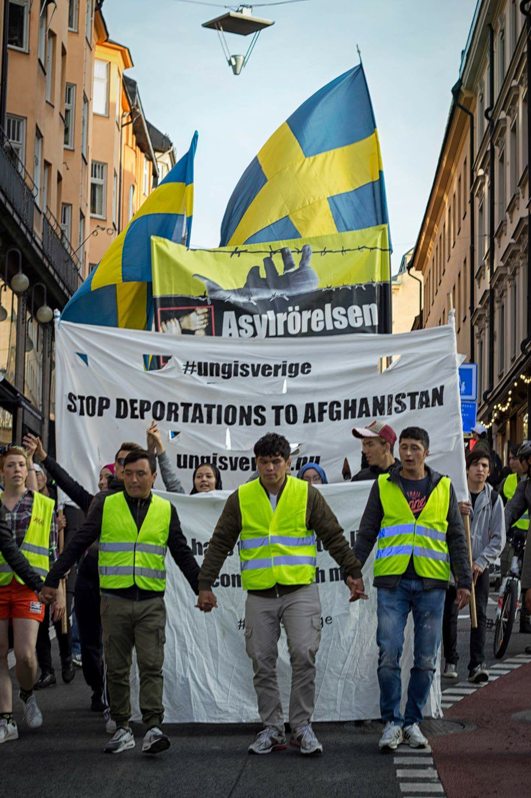
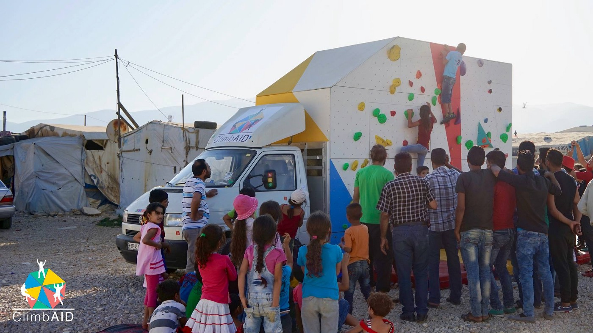
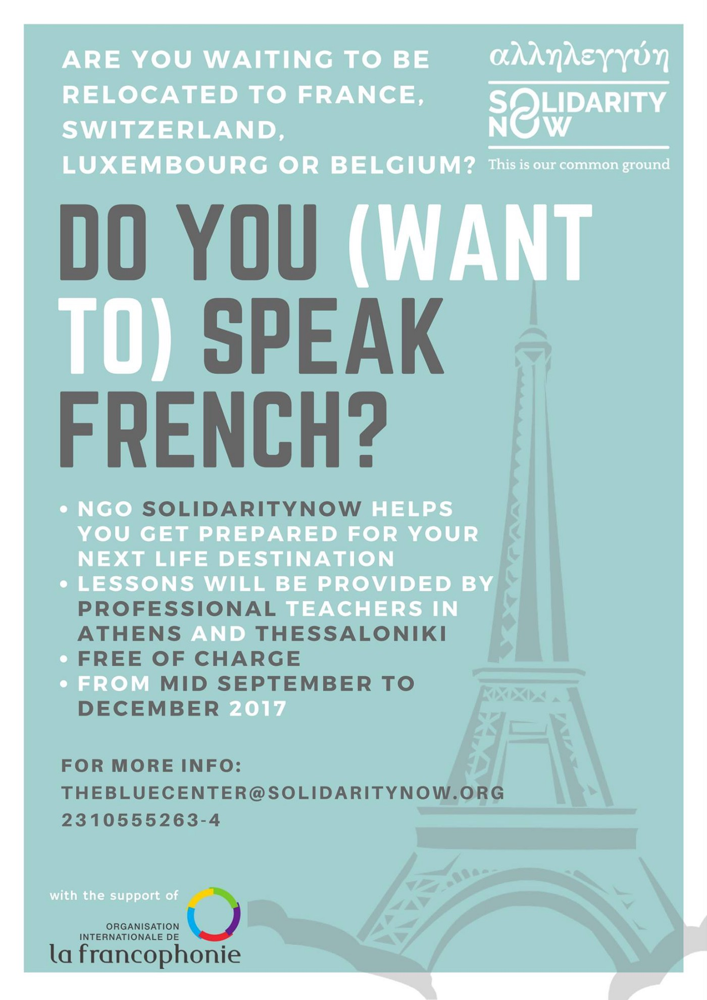
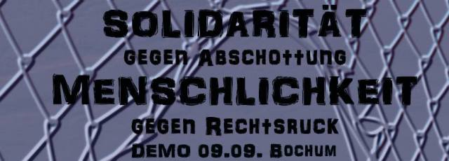
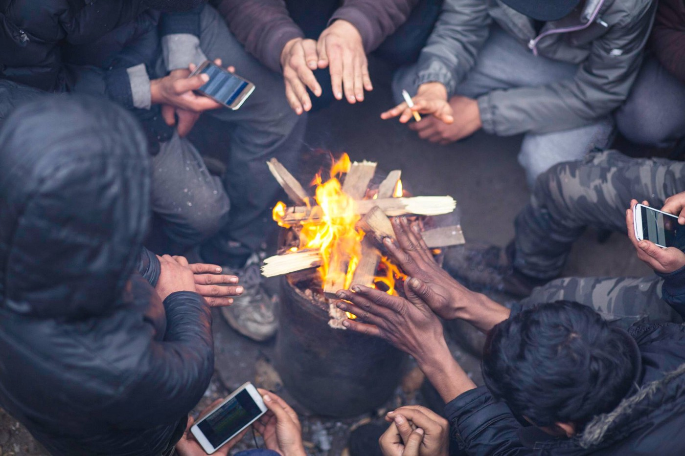

### AYS DIGEST 08\.09\.17: Croatia tries to Deport Unaccompanied Minor

**_Human Rights Abuses in Libya Condemned by High Commissioner//Highest arrival numbers since EU\-Turkey Deal//Greece states it has no\-one on file eligible for relocation//Demonstration today in Germany//Deportation Warnings_**

Mustafa Shirzad

**Never Mind the Law, Madam \- Croatia Tries to Deport an Unaccompanied Minor**

An unaccompanied minor housed at the Institution for Education of Children and Juveniles in Zagreb who wished to seek international protection was threatened with deportation to Bosnia and Herzegovina\. Based on the readmission process, authorities tried to return him to his point of entry into Europe\. The boy, originally from Turkey, entered Croatia with a document that belonged to another person, yet many people are forced to do this because they cannot get their own documents from their country of origin\. The lack of original documents or the possession of fake documents is not a legal reason for deportation\. When asked by an AYS volunteer why this was happening when, according to the law, a minor has the right to seek asylum even though he has entered illegally, a police officer replied by saying, “Never mind the law, madam\.”

AYS is especially concerned by the fact that the minor was not informed of the possibility of seeking international protection in Croatia\. This should have been the work of his legal guardian and the Centre for Social Welfare\. Yet their staff refused to examine the case with the explanation that they ‘did not wish to interfere with the work of the police’ and that ‘there must be some deeper reason for which the police decided to deport him’\. After the official intervention by AYS, the expulsion process was stopped and the boy was brought back to Zagreb\.

**Lebanon**

Climb Aid

[ClimbAID](https://www.facebook.com/ClimbAID/posts/513754488975874) have brought A ROLLING ROCK to the informal settlement of Taanayel\-Bekaa in Beqaa Valley so kids and adults can practice climbing\.

**Libya**

■■■■■■■■■■■■■■ 
> **[MSF Sea](https://twitter.com/MSF_Sea) @ Twitter Says:** 

> > Hey @[Refugees](https://twitter.com/Refugees) and @[UNmigration](https://twitter.com/UNmigration) we'd like you to answer a few questions about #Libya. Please everyone re-tweet to help us get a reply. https://t.co/NeRnetScLD 

> **Tweeted at [2017-09-08 13:18:02](https://twitter.com/msf_sea/status/906144598707363842).** 

■■■■■■■■■■■■■■ 

**Human Rights Abuses in Libya Condemned by High Commissioner**

Zeid Ra’ad Al Hussein, UN High Commissioner for Human Rights, has [responded](http://www.ohchr.org/EN/NewsEvents/Pages/DisplayNews.aspx?NewsID=22039&LangID=E) to the Paris Agreement between the EU and African states with scathing criticism of human rights abuses in Libya\. The incidents that he notes are only from the areas in Libya deemed safe enough for the UN to travel to\.

> Reports of bodies in the desert, in the forest, on the beaches\. UN human rights staff contact the morgues in various towns, which complain they do not have enough space to store all the bodies\. Some migrants die of thirst, hunger or easily\-cured illnesses, some are tortured or beaten to death while working as slave labour, others are just casually murdered\. 

> The unidentified bodies are buried in unmarked graves\. Others simply disappear, unrecorded, unmourned, while somewhere in a far\-flung country south of the Sahara, relatives wait anxiously for news that will never come\. Apart from them, hardly anyone appears to care\. 

> Our staff also document the rape of women in detention\. They find ways to meet women who are locked up all day by men — the same men who organize their rape by night\. In some cases, every night\. We talk to these women, but are powerless to extract them from this ghastly fate\. Such rape is endemic\. Yet, both inside and outside Libya — despite reports like our one of last December, or articles like this — hardly anyone appears to care\. 

**Italy Pledges Money to Libya**

According to [Italian media](http://www.ansamed.info/ansamed/en/news/sections/politics/2017/09/08/italy-to-improve-libya-camps-with-ngos-giro-tells-ansa_f73fb695-0bfe-41fb-8f7c-2254172439aa.html?fref=gc&dti=1652972374920129) , Rome has pledged 6 million Euros to improve conditions in Libyan detention centres\. It appears not to understand the extent of the problem\.

**IOM Report**

IOM [repor](https://twitter.com/iom_libya/status/906188354542342144?fref=gc&dti=1652972374920129) t that 780 people have been rescued and 5 bodies have been found off the coast of Libya in the last two weeks\.

**Turkey**

The Turkish coastguard [reports](https://twitter.com/sarwatchmed/status/906224478715248640?fref=gc&dti=1652972374920129) intercepting two boats with 96 people on them today, of whom 32 were men, 22 women and 42 children\.

**Arrivals**

A total of 54 people arrived on Chios last night and were taken to Vial\.

■■■■■■■■■■■■■■ 
> **[ActionfrmSwitzerland](https://twitter.com/ActionfromCH) @ Twitter Says:** 

> > New arrivals on #Chios 54 people  - 15 children, 16 woman, 23 men #Refugeesgr 

> **Tweeted at [2017-09-08 08:26:24](https://twitter.com/actionfromch/status/906071206436245504).** 

■■■■■■■■■■■■■■ 

**REGISTRATIONS \(Official\) 7/9/17**

Lesbos 54

Samos 96

Others 29

Total: 179

With 713 new registrations between 31/8 and 7/9, Lesbos had an average of 89\. For comparison: the daily average for 2017 overall is still only around 64\.

The registrations in September \(1235\) are already higher than in th whole of April \(1118\) and February \(974\) \.

With 261 transfers to the mainland, there are fewer than 13,000 people now accommodated on the islands\. On 4/2/17 there were more than 15,000\.

**Deportations**

On 7 September, nine people were deported to Turkey — 3 Pakistanis, 2 Algerians, 2 Egyptians, 1 Moroccan, and 1 Bangladeshi

**Sea**

■■■■■■■■■■■■■■ 
> **[IOM - UN Migration 🇺🇳](https://twitter.com/UNmigration) @ Twitter Says:** 

> > Breaking: 126,593 #migrants &amp; #refugees arrived by sea to Europe. 2,537 dead/missing ➡️ [missingmigrants.iom.int](http://missingmigrants.iom.int) https://t.co/kTfsPVavSx 

> **Tweeted at [2017-09-08 07:19:49](https://twitter.com/unmigration/status/906054452284715009).** 

■■■■■■■■■■■■■■ 

**Greece**

**Highest Arrival Numbers Since EU\-Turkey Deal**

According to [local media](http://www.ekathimerini.com/221484/article/ekathimerini/news/unhcr-urges-action-to-ease-conditions-at-greek-island-camps) , 3,695 people arrived on the Greek Islands in August, the highest number since the signing of the EU Turkey deal in March 2016\. This has led to a statement from the UNHCR calling for improved conditions in reception centres on Lesvos, Samos, Chios and Leros, as they are becoming even more overcrowded\.

**Greece Says No More People on File Eligible for Relocation**

The Greek Relocation Unit, having received a request from Spain for more applicants, has informed the Spanish Asylum and Refugee Office that it has no people on file eligible for the Relocation Programme\.

> [We regret to inform you that there are currently no more files that meet the eligibility criteria set out in the EU Council Decisions for the Relocation Program\. In this regard, the Greek Relocation Unit will not send files for commitments of relocation\.](https://translate.google.co.uk/translate?sl=auto&tl=en&js=y&prev=_t&hl=en&ie=UTF-8&u=http%3A%2F%2Fwww.huffingtonpost.es%2F2017%2F09%2F08%2Fgrecia-comunica-a-espana-que-no-le-quedan-refugiados-candidatos-a-la-reubicacion_a_23201364%2F%3Ffref%3Dgc%26dti%3D1652972374920129&edit-text=&act=url) 

Spain has so far taken 1,279 people through relocation and 1,980 people in total\. It is now two years since the Relocation Agreement was signed and it was due to be completed this month\. Spain should have taken in a total of 17,387 refugees by this point\.

Spanish NGO CEAR have denounced the relocation agreement stating that it is fraudulent\. Given that AYS has covered repeated instances of malpractice in asylum interviews and processes, documented by both lawyers and NGOs, leading to many people eligible for international protection being wrongly rejected or deported, it is deeply unjust that the Greek Relocation Unit should suggest that no\-one currently registered in Greece is eligible\. This is simply ridiculous\.

**Family Reunification Update**

Refugee\.info have compiled statistics on the rate of family reunification from Greece so that people know what to expect when going through the process\. It currently takes an average of 3 to 6 months after acceptance to travel to your destination country but there are people in Greece who have been waiting since January\. More info [here](http://blog.refugee.info/family-reunification-delays/) \.

**Free Facilities in Athens**

Athens Volunteer Information and Co\-ordination Group have compiled a new list of places to get free food, clothes, showers and laundry facilities in Athens\. You can see it [here](https://www.facebook.com/groups/AthensVolunteersInformation/?fref=mentions) \.

**Free French Classes in Athens and Thessaloniki**

[Solidarity Now](https://www.facebook.com/SolidarityNow/posts/1102918083175080) are starting free French classes in Athens and Thessaloniki for people being relocated to France, Belgium, Switzerland or Luxembourg\.

**Call for Volunteers**

Help Refugees are looking for [volunteers](https://www.facebook.com/HelpRefugeesUK/videos/486337298393615/?fref=gc&dti=1652972374920129&hc_location=ufi) for various projects in Greece and are especially in need of doctors and dentists\.

**Islands**

**Crete**

[Call out](http://baktirio.espivblogs.net/2017/09/08/%CE%B7%CF%81%CE%AC%CE%BA%CE%BB%CE%B5%CE%B9%CE%BF-%CE%B5%CE%BD%CE%B7%CE%BC%CE%AD%CF%81%CF%89%CF%83%CE%B7-%CE%BA%CE%B1%CE%B9-%CE%AD%CE%BA%CE%BA%CE%BB%CE%B7%CF%83%CE%B7-%CE%B3%CE%B9%CE%B1-%CE%B1%CE%BB/?fref=gc&dti=1652972374920129) for solidarity with refugees in Iraklion still in need of sleeping bags and basic supplies\.

**Lesbos**

**Distress Call \| Help with Medication**

[Sitchting Bootvluchteling](https://www.facebook.com/stichtingbootvluchteling/videos/1841124809550891/?fref=gc&dti=1652972374920129&hc_location=ufi) need support to buy medication for people in Moria Camp

> Camp Moria is overflowing\. There are children everywhere in the camp, and some of them sleep in the open air because there are too few tents and booths\. 

**Italy**

A total of 229 people were safely rescued from the sea today by [Proactiva Open Arms](https://www.facebook.com/proactivaservice/photos/a.232810050083187.63417.111995985497928/1635812546449590/?type=1&theater) today\. They landed in Pozzallo, Sicily\.

**Germany**

**Demonstration Today**

Enough is Enough

A demonstration — [solidarity against separation](https://enoughisenough14.org/2017/08/15/welcomeunited-demonstration-in-bochum-germany/) — will take place in Bochum at 1pm today \(09/09/17\)

**Deportations**

Deportations from Dusseldorf to Afghanistan and Kosovo/Albania are due on Tuesday and to Serbia on Wednesday\.

**France**

Care4Calais

[Care4Calais](https://www.facebook.com/care4calais/photos/a.1046164975416459.1073741829.1046117708754519/1660409543991996/?type=3&fref=gs&dti=1652972374920129&hc_location=group) have updated their needs list and are calling for volunteers and donations for phone credit\. They support people in Northern France, Paris and Belgium\. Please let them know if you are bringing donations or can help, as the situation is continuing to deteriorate and winter is getting closer\.

**Showers for Calais**

[I’Auberge des Migrants](https://www.facebook.com/permalink.php?story_fbid=10155399778935339&id=358496450338&fref=gc&dti=1652972374920129&hc_location=ufi) reports that 19 showers will finally be available for refugees living on the streets in Calais\. Even though the police continue to harass people and take away their few possessions, this is a small step forward\.

**Volunteer Calls**

[Solidarité Migrants Wilson](https://www.facebook.com/permalink.php?story_fbid=746401362227305&id=598228360377940&fref=gc&dti=1652972374920129&hc_location=ufi) urgently need volunteers to help with the preparation of breakfast at Porte de la Chapelle from Sunday onwards\.

French teacher needed in Paris with [Réseau des Exilés en France](https://www.facebook.com/refasso/posts/1537620159633191?fref=gc&dti=1652972374920129&hc_location=ufi) \. Temporary volunteers welcome\. The class is one and a half hours long, once a week\.

**Sweden**

**Deportation Charter Flights**

Two people have been deported from Sweden to Nigeria in two separate planes at a cost of 1\.4 million SEK \(140,000 Euros\) \. [Local media](https://www.aftonbladet.se/nyheter/samhalle/a/72ylK/tva-personer-utvisades-till-nigeria--med-varsitt-chartrat-plan?fref=gc&dti=1652972374920129) report that this is a frequent event:

“In April one person was deported back to Nigeria for 855,000 SEK\. \(85,000 euro\) \. Another plane was chartered to the same destination for 548,000 SEK \(54,800 euro\)”

While the rich get richer the poor get deported\.

**Open Your Homes**

People in Österåkers municipality have decided to help unaccompanied minors who have turned 18 and therefore shall move to accommodations for grown ups\. In Åkersberga some families that was active already during 2015 have decided to let young boys stay at their hose anyway, since they know each other well and the community Åkersberga is the boys home\. It have happened several times that people that turns 18 are forced to move far away from where they have built up a life for themselves for the rest of the time they awaits the answers on their asylum applications\. To stop this from becoming reality the families are opening their own homes to the young people so that they can continue to live in the same village instead of being shuffled around\.

At a meeting on the library last week, six new families offered rooms in their houses\. The newly formed organisation Frivilliga familjehem \(“Voluntary family homes” organised the meeting, and they say that more voluntarily offered places are neccessary to prevent young people from being forced to leave Åkersberga on their 18th birthday\.

[More details here,](http://www.dn.se/sthlm/akersbergabor-oppnar-sina-hem-for-flyktingar-det-finns-ett-jattestort-engagemang/) unfortunately in Swedish\.

> **_We strive to echo correct news from the ground, throughcollaborationand fairness, so let us know if something you read here isnot right\._** 

> **_Anything you want to share — contact us on Facebook orwriteto:areyousyrious@gmail\.com_** 

_Converted [Medium Post](https://areyousyrious.medium.com/ays-digest-08-09-17-croatia-tries-to-deport-unaccompanied-minor-4d99d1a67dfe) by [ZMediumToMarkdown](https://github.com/ZhgChgLi/ZMediumToMarkdown)._
