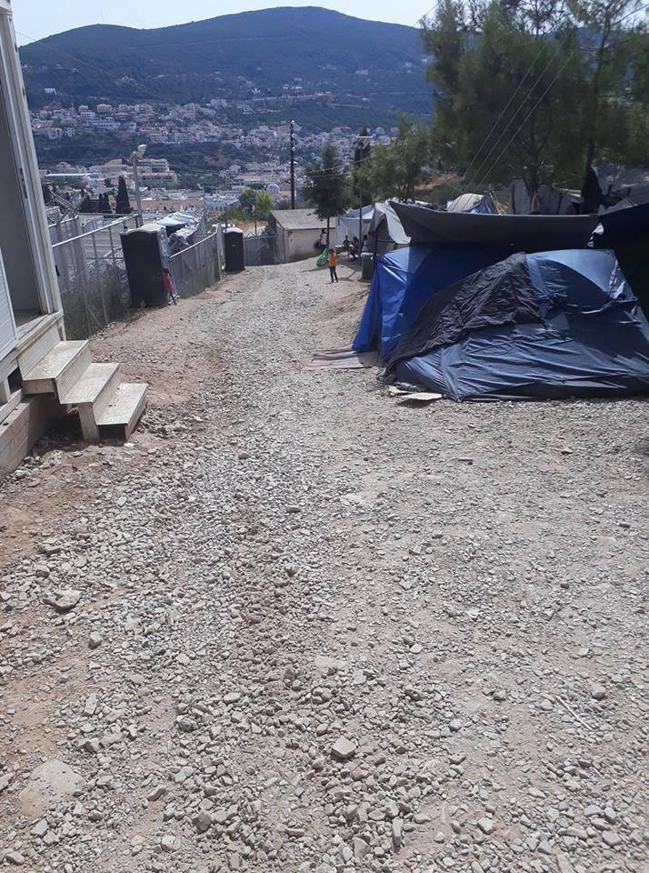
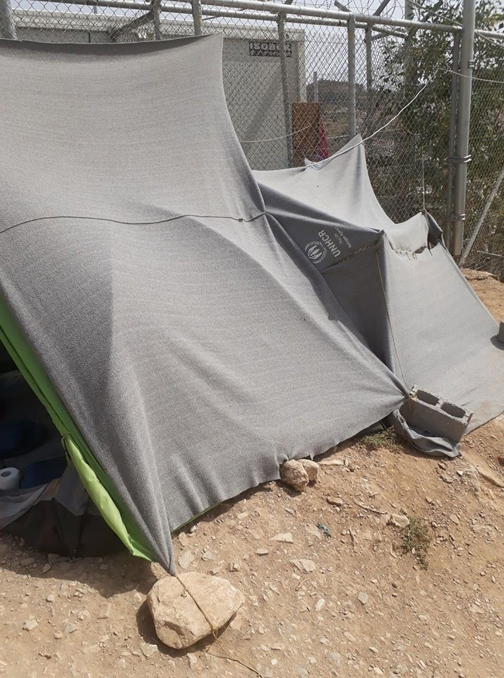
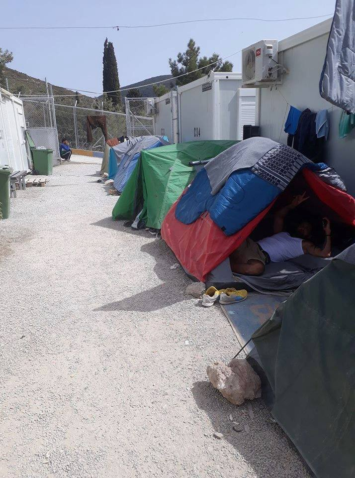
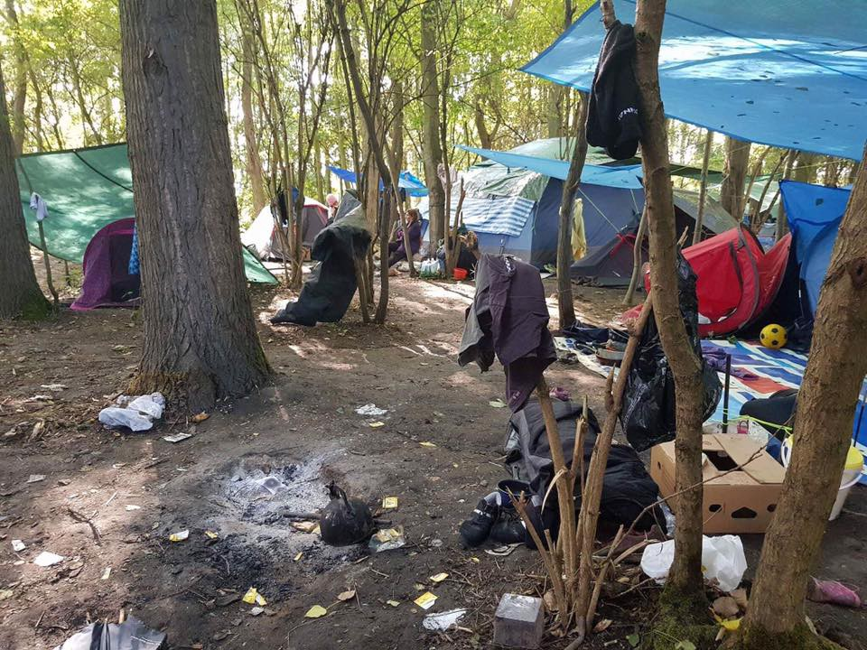
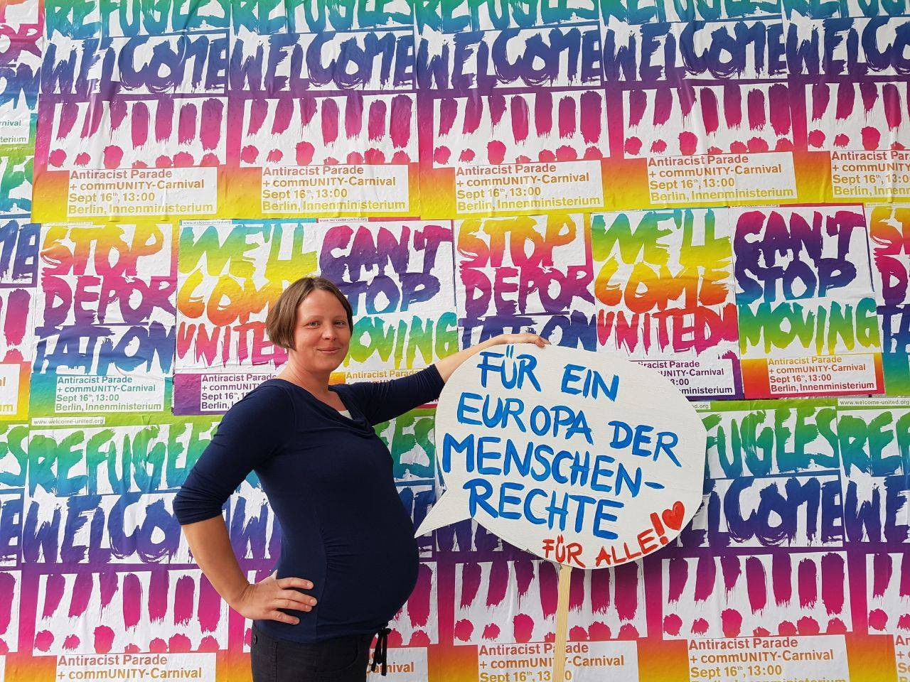

### AYS DAILY DIGEST 9/9/2017: “Hello, I am a refugee in the camp in Samos and we need your help\!”

_Alarming messages from overcrowded camp on Samos // Not enough water, food, space // Dreadful conditions on Samos causing high tensions inside the camp // New arrests and possible deportation in Moria // Reports about inhumane living conditions for refugees and migrants in Paris and Brussels_

Photo AYS
### Feature

For over two years AYS has been recording in our daily digests the arrival of people, often from war torn countries or places with extreme poverty, in Europe\. But, the information we received today from various parts of EU is giving a picture like this crisis which started only yesterday\.

Late this evening, a message came to the AYS inbox from a refugee who recently arrived at Samos\. **“Please help us\!”** he wrote, adding that people inside the Vathy reception center — and according to his information over 3,200 people are there — need urgent help with everything\.

They do not have enough space to live, not enough food, water or anything else\.

“ **There are a lot of children here, too\. We really need help,”** he told us in a brief message, adding that only a limited number of volunteers are inside the camp and they are doing everything they can, but the number of people is so great that they cannot possibly respond to all the needs\.

According to the official numbers, there are 2,508 people at this camp on Samos, where the capacity is 700\. Boats are coming every day\.

Additionally, the person who contacted AYS told us that he is afraid of us using his name because authorities at the camp are threatening residents if they film or take pictures\. Some of them do it anyway to show the inhumane living conditions\.

This situation, which was expected, is causing tensions and there are many fights going on inside the camp, he told us\.

The number of people who are sleeping outside the official camp cannot be established at this moment, but we published pictures on several occasions warning of the situation\.

Recently, even [UNHCR noticed](http://www.unhcr.org/news/briefing/2017/9/59b24a377/unhcr-urges-action-ease-conditions-greek-islands.html) this problem, observing that too many people are staying on the islands and the existing conditions “have affected their physical and mental health”, as well as the presence of the threat of violence, self\-harm, and sexual assault which is, according to this organization, “extremely worrying”\.

They also noted that the situation is most critical on Samos\. According to UNHCR, among the people in the camp, there are over 600 children as well as pregnant women, medical cases requiring serious attention, and people with disabilities\. They also said — we do not know how much they have done — that more or less everything is needed\.

In the meantime, [the European Commission issued its 7th report on the EU\-Turkey deal](https://ec.europa.eu/home-affairs/sites/homeaffairs/files/what-we-do/policies/european-agenda-migration/20170906_seventh_report_on_the_progress_in_the_implementation_of_the_eu-turkey_statement_en.pdf) praising its success and saying that it has “continued to play a key role in ensuring that the migration challenge in the Eastern Mediterranean is addressed effectively and jointly by the EU and Turkey\.” Once again we have to ask — Are you serious? Maybe the EU commissioners should go to one of the Greek islands, or go out in the streets of Paris, Brussels, Rome or the many other cities in the EU and just taste for a day how successful their agreements have been\.
### Sea

The private sea rescue organization [Sea\-Eye](http://sea-eye.org/en/sea-eye-nimmt-rettungsmissionen-wieder-auf/) from Regensburg, Germany, has decided to resume its rescue missions in the Mediterranean after several months off\.

They have two boats — the Sea\-Eye and the Seefuchs — and they will operate in an area that is located 70–90 nms off the Libyan coast\.

As they wrote in their post, a particular incident on 2nd September contributed to this decision\. _“The MRCC Rome called the Seefuchs crew to a rescue about 50 nms off the Libyan coast\. The crew was able to rescue 16 people on a wooden boat from drowning\. This incident shows that the claim by Frontex and the EU that there are no more refugees and therefore no one in distress off the Libyan coast, is untrue\. The survivors of 2nd September reported that they started with two full rubber boats\. There is no trace of these boats and their passengers until today\. We have to assume that they all drowned\.”_

Like many others, even this organization warns that the deal between the EU and the Libyan Coast Guard is, as they describe it, irresponsible\.
### Greece

More people were still arriving today in Lesvos, which is also overcrowded\. Two boats arrived on the south side in the morning, one with 13 people on board, including four children, and the other with 61 people\.

In August alone there were 1,052 new arrivals in Lesvos, while in the first week of September there are around 700 new arrivals\.

In the meantime, police on Lesvos continue harassing people\. From several sources today, including [No Borders Kitchen Lesvos](https://www.facebook.com/NBKLesvos/?hc_ref=ARSt5g9_WN_3ZyEdry0ogSe3MwGUh8qPbcYbOiQSzehl48b4P6032XoEFBvc41HK_XY&fref=nf) , we received information about hundreds of police officers invading the Moria prison camp early in the morning, waking up people violently, and starting controls\. Many people, including some who had orderly documents, were detained\.

_“As a consequence, eleven more people have been arrested and now face deportation\. Those with papers should eventually be released, back for another restless night of sleep\. They do not know when the police will next invade their “home” or harass them in the street, or when their time will finally run out and they will be deported back to the violence and persecution they fled in their home countries\.”_

The [Greek media are reporting](http://www.dikaiologitika.gr/.../se-ekseliksi-gigantiaia...) that the raid was conducted in order to find people who had received their final and irrevocable decision denying them political asylum, so they could be sent back to Turkey\.

More than 350 police officers were involved in the police operation\. It was conducted in such a way, with such a large police force, that it seems aimed more at spreading fear among residents\.

This raid, as well as the worsening conditions on the islands, are coming at the same time as another promise from the authorities\. This time they say they are “preparing measures to integrate between 25,000–30,000 asylum seekers who are not entitled to relocation under the existing European Union program”\.

The [Migration minister said](http://www.ekathimerini.com/221522/article/ekathimerini/news/govt-aims-to-integrate-up-to-30000-migrants) _“a three\-pronged scheme is under way to integrate newcomers, involving a new registration process and the issuing of tax identification and social security numbers; school enrollment for children; and access to the local labor market\.”_
### Call for volunteers

Pampiraiki runs the Elliniko warehouse which is the central humanitarian aid hub in Athens, receiving supplies from volunteer groups abroad and distributing them to refugees in camps, self\-managed shelters, day centers, private accommodation etc\.
They need the following: 
• a volunteer coordinator to help manage volunteers;
• regular volunteers to help with sorting and distributing aid;
• Drivers and /or persons who have transportation that can help deliveries/pick ups\.

If you can help, please email [pampiraiki@gmail\.com](mailto:pampiraiki@gmail.com) or call them at \+306906408586 \(Whatsapp\)
### Help needed

■■■■■■■■■■■■■■ 
> **[ariadni](https://twitter.com/AriadniCorona) @ Twitter Says:** 

> > Current needs of the refugee housing squat @[5olikeio](https://twitter.com/5olikeio) ! 
Schools are about to start! 
#RefugeesGr 
#SquatsGR 
[m.facebook.com/story.php?stor…](https://m.facebook.com/story.php?story_fbid=1898800660146554&id=1302897399736886) https://t.co/wHrVYN6LOC 

> **Tweeted at [2017-09-09 11:42:05](https://twitter.com/ariadnicorona/status/906482840191356928).** 

■■■■■■■■■■■■■■ 

An interesting new initiative — Lifeline Teaching by Team Up 2 Teach\.

The aim is “to bring together nonformal and formal educators of asylum seekers and refugees across Southeastern Europe to co\-create a teaching resource: a book of wisdom, creative experiences, practical tips, innovative lessons and exciting, effective plans for teaching in our very particular challenging settings\.”

_“We invite teachers and program coordinators \(both volunteer and paid\) — who want to contribute their insights, experiences, lesson learned and best practices towards creating the book \(both print and digital\) to help transform the way we approach non\-formal education together as a community of NGOs and volunteer organizations\._

_Space is limited, so please sign up to the event that best fits your location and schedule\. We look forward to your contributions and you joining our co\-creating team\!”_

For more details, [see their FB page](https://www.facebook.com/events/2007286906222755/?acontext=%7B%22ref%22:%223%22%2C%22ref_newsfeed_story_type%22:%22regular%22%2C%22action_history%22:%22null%22%7D) \.
### France

No good news from France even today\. Volunteers need help to continue helping hundreds of people sleeping out in the open all over the country\. And the weather is getting colder\.

[Calais Action](https://www.facebook.com/calaisaction/?ref=gs&hc_ref=ARRbL6S1TbuTJ9MWR2AcCBeeYywDdWAVwYmXxHpCfpYZuhvtTdfUAQ7UUo5vZ5YXa7Q&fref=gs&hc_location=group) published a call to Paris for blankets, sleeping bags, warm clothes, shoes, and food, but also financial support\.

Photo by Calais Action\.

[“Every donation no matter how small is welcome\. 5 euros means a lot for refugee families in difficulties\. If you find it appropriate, would you share it with your friends and encourage them to donate?](https://www.gofundme.com/ParisWinterRefugeeCamps) ”

Another small group, [Paris Refugee Ground Support](https://web.facebook.com/PRGS.team/posts/1969555696657874?fref=gc&dti=1652972374920129&hc_location=ufi) , also needs your help\. They are on the streets of Paris every day distributing necessities with their van\.

_“We work with dignity, with passion, and with determination\._ 
_We try and remember who needs what and where we will be able to find them the next day\. We liaise with other like\-minded groups to offer maximum support\. The media may have forgotten what is happening but the reality remains desperate\. Whatever you can give will go towards making a difference for those with no choice other than to keep on going in this harsh and unjust situation\. We can never thank you enough for choosing to support our efforts in Paris\.”_

This is one of the stories the team recorded in the streets of Paris:

_“We noticed an older man, probably late forties\. Most of the others are either minors or late teens the to mid twenties\. He only had a bed sheet covering him\. He was awake so we offered him a blanket\. He cheerfully replied, “No, no, I’m fine my dear”\. He was lying on a blanket under his sheet and told us he didn’t need it and wanted to give it to someone who did\. He pointed to a younger man who had nothing and did this with the warmest jolliest smile and voice\. This completely selfless act he did with humility and graciousness\. A beautiful human being\. A light in the dark\. We could all learn a lot from this\.”_

The situation is not improving in Dunkirk, but volunteers are there to help\. They started distributing winter clothes, but people who are there are sleeping in inadequate shelters and tents that are totally flooded when it rains\. Like yesterday\.

Photo by Care4Calais\.

To see their updated needs list, [please go here](http://www.care4calais.org/donate) \.
### Belgium

The same is happening in wealthy Belgium\. Even in this country, the police are using violence and methods of stoking fear among migrants\. T [his week, forty\-four people, including 11 unaccompanied minors, were t](http://www.brusselstimes.com/brussels/9069/brussels-north-police-arrest-44-migrants-for-questioning-including-11-minors) aken in for questioning during an extensive police control operation around the Brussels\-North railway station\. Nineteen of those arrested may have been sent to detention centers\.
### Germany

Germany, which for many of the people on the move is their dream destination, is changing\. Or at least their politicians are sending messages that are everything but welcoming\. One of these is Interior Minister Thomas de Maiziere who has called for an EU\-wide agreement about the amount of benefits refugees will receive, saying that they are being given too much in this country\.

Previously, the German court ruled that the benefits for refugees can’t be lower than those for Germans\. The exception is when they are denied asylum or protection\. Nevertheless, as the local media reports, in an interview published on Saturday de Maiziere said he wants equal standards for asylum\-seeker benefits across the EU, adding that Germany’s current system makes it too attractive for human smugglers\.

He did acknowledge that Germany has a higher cost of living than other EU countries, but suggested that a more uniform system “could see the creation of possible subsidies for refugees to cover higher living costs on top of an EU agreed\-upon benefit sum\.”

In Germany, the state provides accommodation, food, toiletries, clothes, and “essential personal needs”, such as telephone cards\. Depending on which of Germany’s 16 states the refugees are living in, they may get a monthly allowance in cash\. For asylum\-seekers living in refugee shelters, single adults receive €135 \($162\) a month, while married couples receive €129 a month each\. Depending on their age, children receive between €76 and €83 a month\. If an asylum\-seeker is living outside a refugee shelter, a single adult receives €216 euros a month while married couples receive €122 each\.

Germans feel differently than do their elected officials and they are showing in many ways that whoever needs refuge is welcome in their country\.

Preparations are underway for major protests in Berlin on the 16th and a strong message will be sent from there to fortress Europe as people raise their voices against the exclusion of refugees and migrants\.
### Finland

The Right to Live movement [\(Stop Deportation](https://www.facebook.com/SeisKarkotuksille/?ref=gs&fref=gs&hc_location=group) \), protesting the current inhumane asylum policies of Finland, together with [Architecture for People](https://www.facebook.com/architectureforpeople2016/?ref=gs&fref=gs&hc_location=group) , a group who believes that everyone should have the right to shelter, are building a transitional shelter for Helsinki Design Week\.

“Having a home is a right we all have\. Too many are without it even though there are solutions to fix that\. It’s all about will\. And that is what we are missing\!”
### Denmark

Officially, almost every third refugee in this country finds a job within three years of arrival\. Denmark’s employment minister has called the figures an “incredible development”, [local media are reporting](https://www.b.dk/nationalt/flygtninge-stroemmer-i-job-en-helt-vanvittig-og-voldsom-udvikling) \.

The ministry bases its figures on those who are in what is considered ‘normal’ employment — in other words, jobs that are not supplemented by state support\. According to Poulsen, one reason for the dramatic increase is a focus on what the refugees have to offer Danish society\. Researchers are saying that a new approach by municipalities, as well as generally high employment rates, has contributed to the positive figures\. Everybody agrees, however, that there is much more to be done\.

Maybe the first step could be to accept more people\. Officially, the number of people coming to this country has been very low\. According to the UN’s High Commissioner for Refugees, this is a record low for the Scandinavian countries\. This year only approximately 2,000 new asylum seekers have come to Denmark\.

> **_We strive to echo correct news from the ground, through collaboration and fairness, so let us know if something you read here is not right\._** 

> **_Anything you want to share — contact us on Facebook or write to: areyousyrious@gmail\.com_** 

_Converted [Medium Post](https://areyousyrious.medium.com/ays-special-hello-i-am-a-refugee-in-the-camp-in-samos-and-we-need-your-help-4fd34d43d12) by [ZMediumToMarkdown](https://github.com/ZhgChgLi/ZMediumToMarkdown)._
