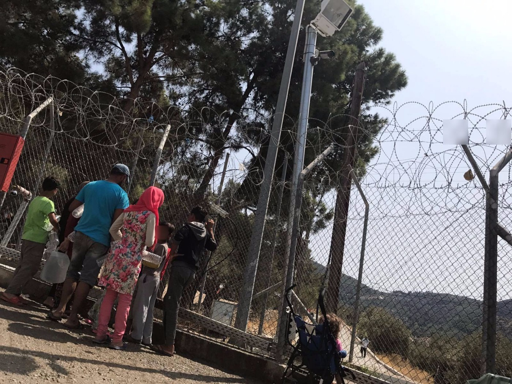
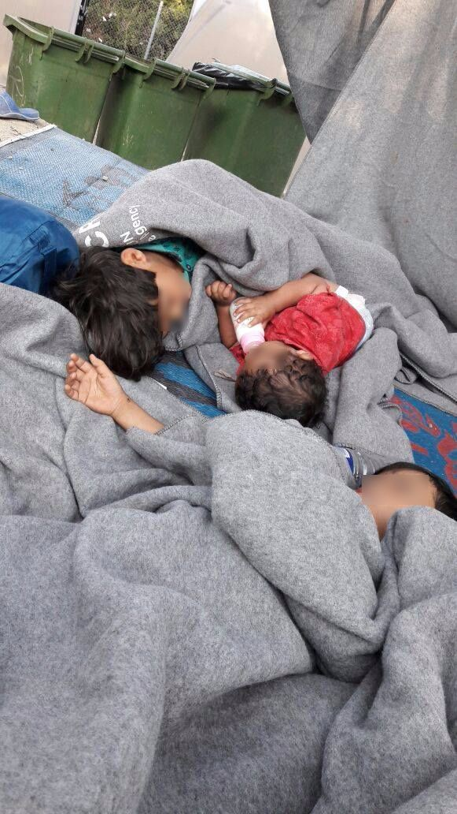
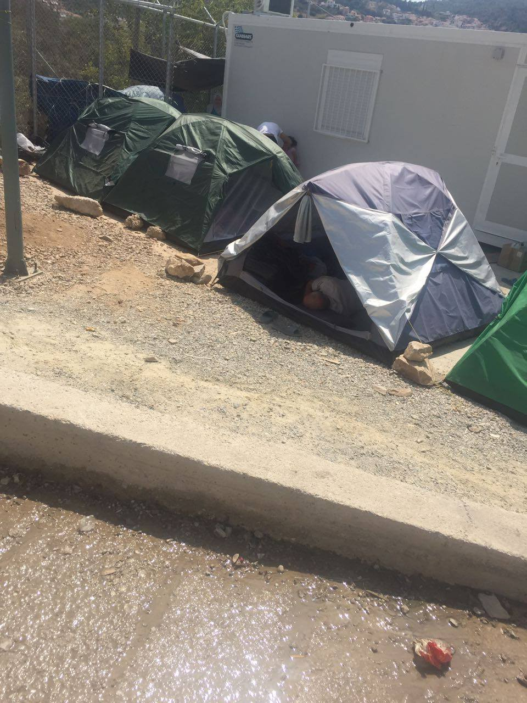
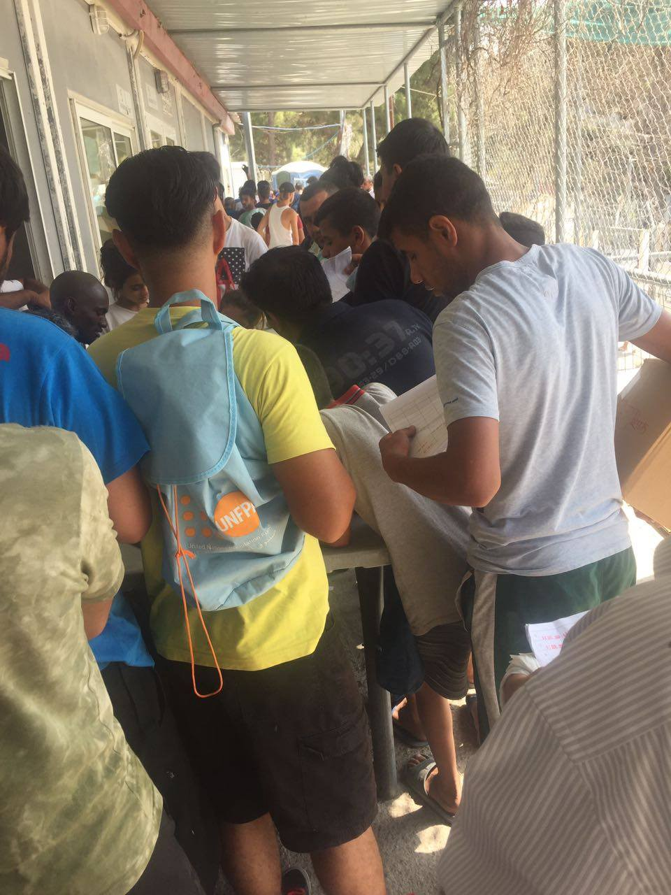
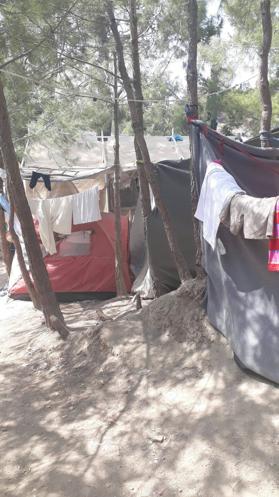
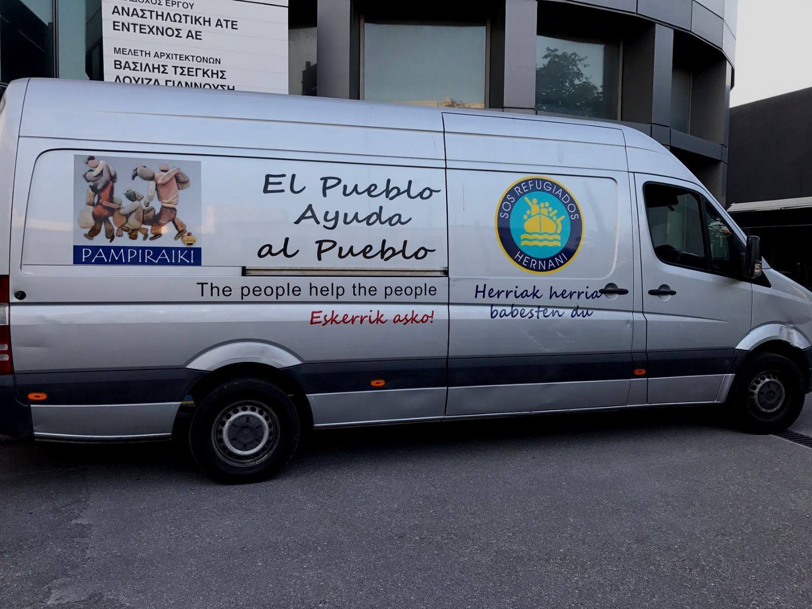
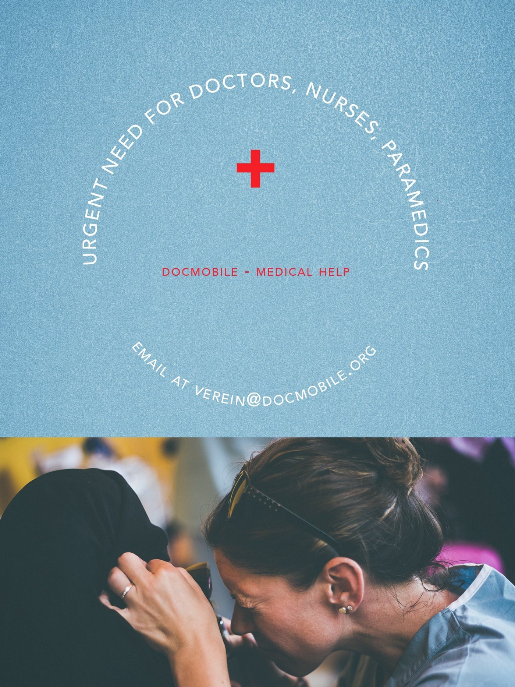
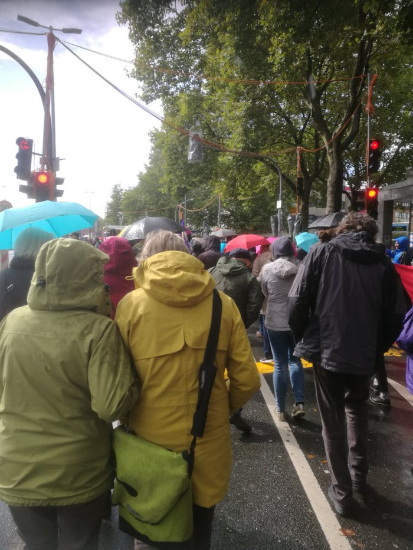
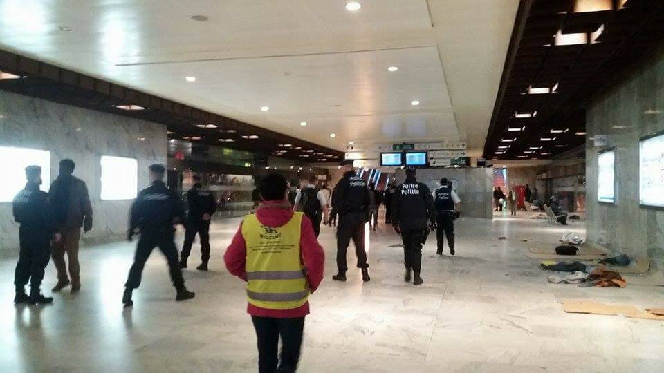

### AYS Daily Digest 10/9/17: Another life lost on the “closed” Route
#### A late surge of arrivals continues on Aegean islands / Difficult situation continues on Samos / many volunteers needed in different places / a man died trying to go from Serbia to Croatia / Protesting the deportations in Germany

Samos
#### FEATURE

Growing numbers of people have been illegally pushed back from Croatia by the Croatian authorities, ending up in prisons in Bosnia and Hezegovina and, mostly, in Serbia\.

Desperately trying to move from the limbo they find themselves in, staying and being moved around the camps in Serbia, mostly young people are trying everything they can think of to try to move on towards a safer future and a more plausible chance of continuing work, studies and — life\. 
Unfortunately, along the way, many face hardships: psychologically damaged of the waiting, poor treatment of so many countries they’ve passed through, being used by smugglers, abused, legally left in a grey area that nobody wants to clear out and make way for a legit way of enabling human right of free movement\. \. some of them also lost their lives along the way\.

Another person lost their life today, trying to board on top of a train heading towards Croatia\. [Volunteers](http://rigardu.de) in Serbia count four people have died during the time their team has been active in the Sid area, which is since April this year\.
#### GREECE
### Desperation on Samos — To whom it may concern

The refugees on Samos, in the conditions we wrote about in yesterday’s Digest, have once again reached out to us with a single outcry:

> They must take people away from here\! It is the only solution, the only help we ask for\! 

People are getting desperate and wonder what is next if these are the acceptable standards to keep people in\. Nobody should be surprised they ask for urgent resettlement from the island camp\.
Scenes we’ve seen in emergency aid tents during the outbreak of the refugee crisis in 2015 are back: children sleeping on the floor on the infamous grey blankets, today, 2 years afterwards, in a camp in the EU\.

It seems that what we are offering as a “refuge” does not even satisfy the minimum standard for personal living space in prison establishments established by the European Committee for the Prevention of Torture and Inhuman or Degrading Treatment or Punishment\.

#### Arrivals
### Lesvos

176 people arrived to Lesvos today, on 4 boats in total
### Chios

Earlier in the night between Saturday and Sunday, 54 newly arrived people were brought to the port of Chios, among them there were 19 Men ,16 women and 19 children\. They come from Syria, Iraq, Afghanistan and Palestine\.
The CESRT and SMH volunteers provided first aid, local volunteers report\.

### Athens

The van of the [En Red SOS refugiados](https://www.facebook.com/sosrefugiados/) volunteers burned down last night\. An arson planned and executed by people who obviously had something against this groups humanitarian work had as a result the situation where the team has lost the only vehicle, a donation of many people from Spain who had also send a lot of donations in it\. 
In spite of the difficulties and the serious circumstances surrounding the loss of their vehicle, the group said they would carry on with their activities in the city and would not follow any urge to settle the matter themselves, so they hope the officials will do everything to put those resposible to justice\.
All our support to the fellow volunteers\!

](assets/db7f9f2777f7/1*czzaNSKh8K4lwWbZcBE7_w.jpeg)

Photos: [En Red SOS refugiados](https://www.facebook.com/sosrefugiados/)
### Volunteering in Athens and surrounding area

Detailed updates about current needs for volunteering in camps, squats, schools and other informal initiatives are available [**here**](https://www.facebook.com/groups/AthensVolunteersInformation/permalink/1199017710230524/?fref=gc&dti=1652972374920129&hc_location=ufi) **\(** [Athens Volunteers Information and Co\-ordination Group](https://www.facebook.com/groups/AthensVolunteersInformation/?ref=group_header) \) \.

There’s an open invitation for people who are interested in teaching Greek language or other languages\. [The meeting](https://www.facebook.com/events/119535205434312/?acontext=%7B%22ref%22%3A%223%22%2C%22ref_newsfeed_story_type%22%3A%22regular%22%2C%22action_history%22%3A%22null%22%7D) will take place on Monday 18/9, at 8 p\.m at Steki Metanastwn, Tsamadou 13\.

Docmobile is looking for qualified doctors \(GP, emergency doctors, pediatricians\) to work in different places in Greece, where we provide free medical care for refugees\. The work is with an international team communicating in English, and we are looking for volunteers available starting next week or later, for a minimum of one week\.
Nurses and paramedics also welcome to apply\.
Please contact [Kai Wittstock](https://www.facebook.com/kai.hamburg.9?fref=mentions) or at the following email address :verein@docmobile\.org

Volunteers are needed also on [Help Refugees](https://www.facebook.com/HelpRefugeesUK/?hc_ref=ARTtE53eoLfN3Re09zAVGA-7EtL25fPV26cJlI-UgIl4epejo5XwG5r4PqCZHOh8WV4&fref=nf) projects across Greece\. They are especially in need of doctors and dentists, as well as people with experience of teaching, construction or carpentry\.
To find out more, follow [this link](http://bit.ly/HRGreeceVolunteering) \.
#### CYPRUS
### New arrivals

305 Syrian refugees were rescued and arrived in Cyprus this morning\. “The single largest group arrival since the Syrian conflict started was 345 people who were rescued in September 2014\. “ There are many minors who landed, as the media [report](https://l.facebook.com/l.php?u=https%3A%2F%2Fwww.reuters.com%2Farticle%2Fus-cyprus-migrants%2Fmore-than-300-syrian-refugees-rescued-arrive-in-cyprus-idUSKCN1BL0DE&h=ATPDcehnp5n_IeURPkERYe_zwWFzyivXyAwuXrj-k5P5_88wbeUF-ud99wVhLmbVvC29qe7YODlXnuPOLvaoggK1y7TwuSxkflESt5HymtV-keOgI3GZFzum0NeVY8gUk2PlL_KxruSUiPNiM4aDnSC7flDX9Bn82zGXAx0ufyot5_pMFWdZZPNsJppiA-YBiFqmvWnfT3t8xG-kPJE-G0o2Xm6ht8QzqvuxUhE2NQ1SQzuJUyji7-oTHujAKxWZ40xkv1q-ADvyjWi7sr6duTQcjbEPtdTH0eyCww) \.
#### ITALY
### Lecce

A dramatic rescue operation went on as the strong made a boat carrying 63 people crash into the rocks\. Among the people on board were 13 minors and a pregnant woman\. The officials rescued and took the people to don Tonino Bello di Otranto centre for all the officials prodecures\.

Information for those in Italy wishing to engage in working with the \(growing number of\) unaccompanied minor refugees can be found [**here**](https://www.facebook.com/groups/1834254390190027/1960320174250114/?fref=gc&dti=1652972374920129&hc_location=ufi) \.
#### GERMANY

At least 3 deportation flights are scheduled by the German authorities for the coming week\. 
The flights will depart from Düsseldorf, and the local activists have [announced](https://enoughisenough14.org/2017/09/10/welcomeunited-mass-deportation-alert-in-germany-protests-announced/) protests against the deportations\. Meanwhile the Welcome United campaign continues for the second consecutive week\. There was an organized demonstration on Saturday in Bochum, while today \(Sunday\) the monthly Welcome To Wuppertal breakfast held in a church was under the supervision of several police vans and some police officers dressed in civil clothes, German activists report\.

> On Tuesday there will be protests against deportations at Düsseldorf airport\. Activists demand to cancel the deportations\. The protests starts at 5 pm \(17:00\) at Terminal B, Düsseldorf airport, Germany\. Facebook: [event page](https://www.facebook.com/events/117025672332845/) \. 

 \)](assets/db7f9f2777f7/1*nSt__Kp8eVJIRS4flkh5nQ.jpeg)

Protests in Bochum \(Photo [source](https://enoughisenough14.org/2017/09/10/welcomeunited-mass-deportation-alert-in-germany-protests-announced/#jp-carousel-33769) \)
#### BELGIUM
### The arrests continue in Bruxelles

“In Brussels refugees are being systematically arrested by police, only two days ago 40 arrests were made in the streets\. Most refugees do not have a clear understanding or knowledge of their legal rights and as a result the state can advantage of them and their situation\. For this reason, it is important that refugees know and understand their legal rights through access to information; in order to defend themselves and have proper legal representation, this is a human right,” [volunteer](https://www.facebook.com/isis.mera?fref=gs&hc_ref=ARQc7XeQs05oi1ADy6jM3eswH-LWIuOwIfrmZMepNqvdHmx7vb2Rxh54vtsSwNWbPa4&hc_location=group) groups say\.

](assets/db7f9f2777f7/1*7v9gvcDWSeDoL2Z6jluUDA.jpeg)

Photos: [Plateforme citoyenne de soutien aux réfugiés Bruxelles](https://www.facebook.com/plateformerefugiesbxl/)

> This morning, about 50 persons still at the station Gare du Nord and about 50 in the park\. Our teams had woken them up, but some at the station did not want to leave\. Police came at about 7:30h, at first only 2 policemen, followed by about 50 colleagues \(local and federal police\) \. 
 

> Everyone started to run, some fell trying to escape their arrest\. 
 

> Result: about 10 arrests, among them a woman\. 
 

> We have collected 4 backpacks, a cellphone and some sleeping bags\. We’ll wash everything and bring it to the park tonight\. — [_Plateforme citoyenne de soutien aux réfugiés Bruxelles_](https://www.facebook.com/plateformerefugiesbxl/?hc_ref=ARQ6yWCbRqUQmLb7co6r3LuBS2xKCC-CgcBDpRbkqJkCtoHCC4uF5QklNu-CoyDFar4) 

 distributing over 200 jackets today in Brussels \(Photo: [Care4Calais](https://www.facebook.com/care4calais/) \)](assets/db7f9f2777f7/1*nLcBsm9IDOJzuT1Tr71fMw.jpeg)

[Care4Calais](https://www.facebook.com/care4calais/) distributing over 200 jackets today in Brussels \(Photo: [Care4Calais](https://www.facebook.com/care4calais/) \)

“There are now over 600 refugees sleeping rough in Brussels — pretty much as many as in Calais — and the conditions are just as bad\. No reliable food supply, no showers or sanitation, no changes of clothes, skin disease and fungal infections are rife\. The effects on health and mental health are just as bad as we are used to seeing in Calais\.”
#### FRANCE
### Paris

According to the sources, the MSF team has been replaced by the MDM team and they are available at La Chapelle every Wednesday and Friday from 13h\.
#### UK

[GRACE\-Greenwich Refugee Aid & Community Enterprise](https://www.facebook.com/GRACErefugeeaid/?ref=gs&hc_ref=ARQXOYY5u9-gBN69WdscY5XEiAl8c3ejTyiqcYJt354JdZqHWZEFZFF-zyPNZ-mgdhs&fref=gs&hc_location=group) warehouse is ready and waiting for volunteers to sort clothes for upcoming projects:

> we will be contributing a range of new, donated, ex\-promo clothing stock to convoy to Serbia in October in support of our old friends Hope & Aid Direct and Freedom of Choice/Truckshop \(warehouse now open in Šid, Serbia\) 

> we are planning our contribution to container to Syria with Samara’s Aid 

> helping Auberge in Calais with stock 

#### DENMARK
### Changing their stance on resettlement

Claiming they want to be prepared to integrate people they receive in, the

Danish Ministry of Immigration and Integration [said](https://www.bloomberg.com/news/articles/2017-09-09/denmark-suspends-refugee-resettlement-under-un-program) Denmark won’t allow any refugees into the country this year under the UN program and will seek flexibility in determining how many may resettle in the future instead of a set quota\. The program \(as of 1989 they pledged to take in 500 people a year\) is separate from the EU efforts to distribute refugees among member states as a part of the \(still very slow\) relocation programme\.

> **_We strive to echo correct news from the ground, through collaboration and fairness, so let us know if something you read here is not right\._** 

> **_Anything you want to share — contact us on Facebook or write to: areyousyrious@gmail\.com_** 

_Converted [Medium Post](https://areyousyrious.medium.com/ays-daily-digest-10-9-17-another-life-lost-on-the-closed-route-db7f9f2777f7) by [ZMediumToMarkdown](https://github.com/ZhgChgLi/ZMediumToMarkdown)._
