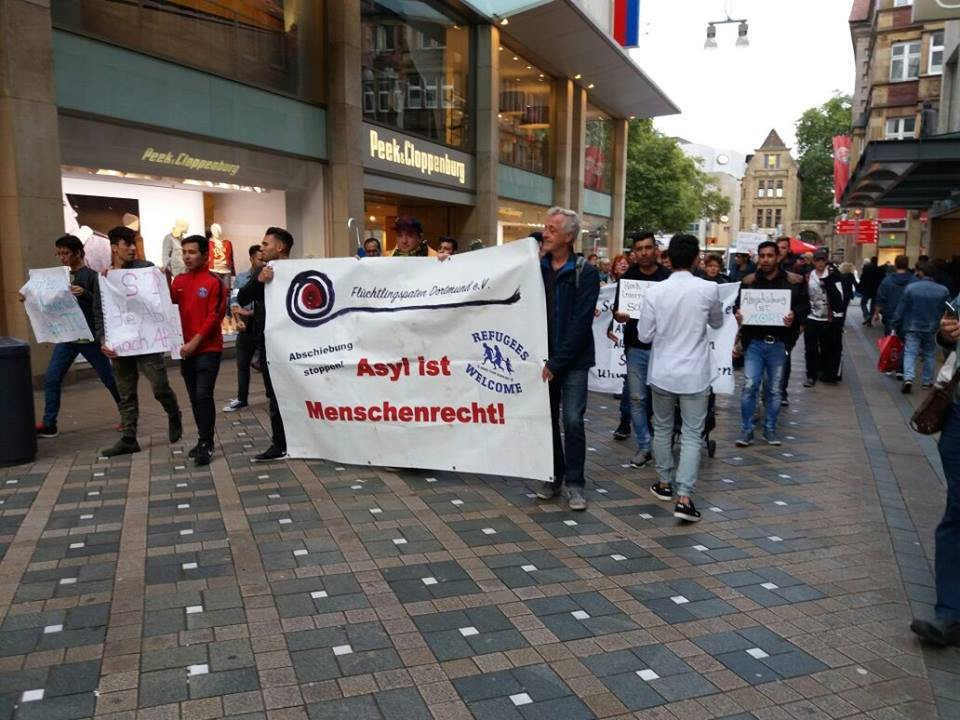
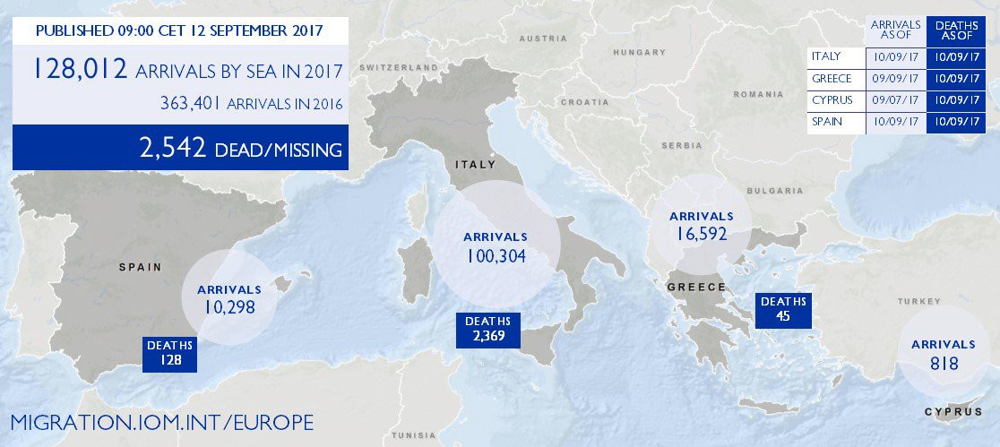
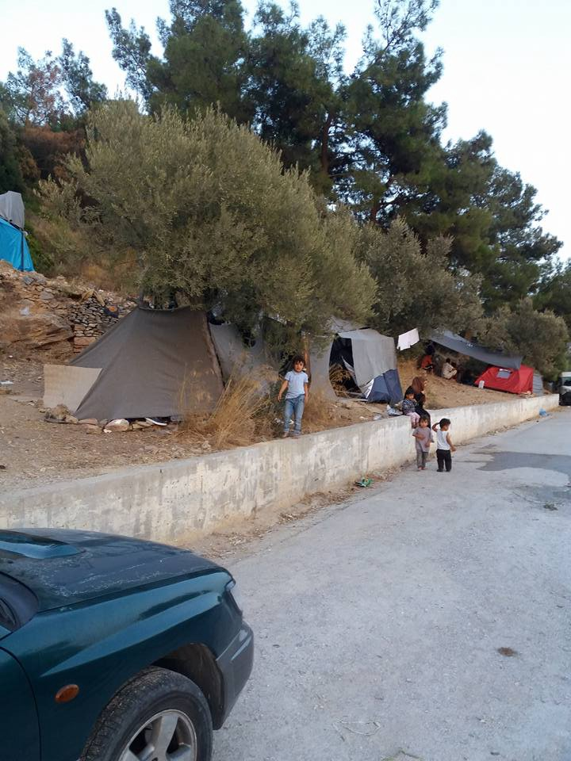
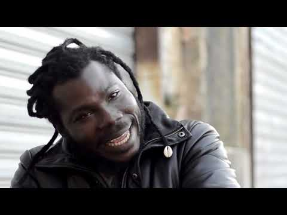

### AYS DAILY DIGEST 12/09/2017: Canada, heaven for refugees?
#### Jugend Rettet calls for European protest // UNHCR seeks to provide open centres in Libya // More arrivals in Greece // No More Borders leaving Samos // Infopoint in Ventimiglia // Donations needed in France // More protests in Brussels and more…

“Asylum is a human right” — Afghans protested yesterday in Dortmund city\. Today they are heading to Düsseldorf airport, where deportations to Afghanistan, Kosovo/Albania and Serbia are scheduled
### Feature

Canada has been deporting hundreds of refugees to non\-safe countries according to a report published by [Reuters](http://www.reuters.com/article/us-canada-immigration-deportation/canada-deported-hundreds-to-war-torn-countries-government-data-idUSKCN1BL0VB) recently, that had access to government data\. More than half have been sent to Iraq\.

There has been a surge in arrivals of refugees to the country in recent months, in part because of Trumps rhetoric against muslims but at the same time as these record numbers of refugees seeking asylum for over a decade, there has been also a rise on deportations\.

> Between January 2014 and September 6, 2017, Canada sent 249 people to 11 countries for which the government had suspended or deferred deportations because of dangers to civilians, 134 people to Iraq, 62 to the Democratic Republic of Congo and 43 to Afghanistan\. 

In fact the deportations to Iraq have increased from 22 in 2014 to 51 in 2016 and so far there have been 35 this year\.

Canada Border Services Agency assures that all deportations are processed lawfully and have various levels of appeal but the Canada Council for Refugees complained that these channels of appeal are limited and don’t give much hope to people facing deportation to a dangerous place\. Despite the government suspending or deferring designations for countries or regions deemed dangerous, is still deporting people for reasons like criminality, exhausting attempts to obtain permanent residency and non\-compliance with immigration laws\.

The United Nations’ High Commission on Refugees recommends states to refrain from deporting people to Iraq because of the human rights situation and the conflict there and it’s the deporting country’s responsibility to make sure the people targeted for deportation will reach safety\. Obviously in a country like Iraq, undermined by war for years and poverty caused by it, it’s practically impossible to assure these conditions, nevertheless, these practices continue\.
### Sea

[**Jugend Rettet**](https://www.facebook.com/JugendRettet/?ref=gs&hc_ref=ARRlXVGYZy79UQHxgF8UX2bgRn3WGAywAjIv53A82ID0dgwxdaKiJ06kgyVJsEg3Kt8&fref=gs&hc_location=group) **’s** boat is still arrested and the group is protesting once more to recover it and put it to use\. Before being taken by the Italian authorities the boat and it’s crew rescued 14000 refugees from the sea\. So join the protest\! Tomorrow some life vests will be put on statues all around Europe\. You can send the group a message if you want to join the action\!

](assets/de223c949c0a/1*trWZrvZNP_ivZcZ4whnQRg.jpeg)

Statue in Malta with life vest, by [**Jugend Rettet e\.V\.**](https://www.facebook.com/JugendRettet/?ref=gs&hc_ref=ARRlXVGYZy79UQHxgF8UX2bgRn3WGAywAjIv53A82ID0dgwxdaKiJ06kgyVJsEg3Kt8&fref=gs&hc_location=group)

Also today, a new report from [**IOM**](https://twitter.com/UNmigration) gives the numbers of arrivals through the Mediterranean up to today:

### Libya

UNHCR is currently negotiating with the Libyan authorities the establishment of an open reception centre that would allow refugees and asylum seekers freedom of movement, giving priority to the most vulnerable among them\. In this reception centre, UNHCR could provide registration, accommodation, food, social services, counselling and support to survivors of sexual and gender\-based violence, and solutions in third countries for the most vulnerable\. The plan is to assist and protect over 535,000 people in Libya, including over 226,000 Libyans displaced by conflict, 267,000 Libyans who have now returned to their homes but continue to be in a vulnerable situation and 42,834 registered refugees and asylum\-seekers\.

Recently, the UN’s high commissioner for human rights, Zeid Ra’ad Al Hussein, said the EU’s approach of apprehending migrants inside territorial waters to have them returned to Libya is a clear breach of the international law prohibition of ‘non\-refoulement’\. He said also that a mini\-summit in Paris last month between a half dozen European and African leaders was aimed at stopping people from leaving towards Europe and similar comments were issued by the president of [Doctors without Borders](https://euobserver.com/migration/EU%20accused%20of%20complicity%20in%20Libya%20migrant%20abuse) who last week accused the EU of condoning torture, given the widespread rape, beatings, and abuse that people endure at the hands of detention centre guards\.

The answer from the European Union by a commission spokesperson on Monday, the11th of September in Brussels was that its work with the UN and its affiliated agencies on the ground in Libya is part of a greater effort to protect migrants and provide them with access to basic medial care\.

The EU continues to fail to be an example on human rights, something that it repeatedly claims and demands from other countries all over the world\. This type of “diplomacy” will certainly be judged and condemned in the future but once again\. \. it will be too late for all the people we are leaving behind\.
### Greece

Another day and refugees continue to arrive in Greece in considerable numbers, today, [**Advocates Abroad**](https://www.facebook.com/advocatesabroad/?hc_ref=ARRYkkl54qkX2NtsNb7_x35oSNFcmq4F2t-NNquEOtZ9QvoeyQK8cLhMzgcn_Ai7YRg&fref=nf) reported that **93 refugees arrived today to Lesvos** , in two boats, one with 52 and the other with 41 people\.They also report that **53 refugees arrived on Chios** in one boat, 27 men,14 women, 12 children with the nationalities being syria,Iraq,Palestine and Yemen as per [CESRT](https://www.facebook.com/groups/421759534684819/?multi_permalinks=683954488465321&ref=notif&notif_t=group_activity&notif_id=1505247156199352) report\. Everyone was safe and the group managed to give clothes, food and water to all of them very quicly\. Another **124 arrived on Samos** in two boats, one with 43 and the other with 81 people\. At the time of publishing we didn’t have more details about these refugees welfare\.

[**SAR watch MED**](https://twitter.com/SARwatchMED) also reported today that 177 people, mainly Syrians, have been intercepted in the Aegean sea over the past 48 hours in 4 boats heading to Greece\.

The daily registrations on the islands as per government source account for:

[\#Lesbos](https://www.facebook.com/hashtag/lesbos?fref=gc&dti=1652972374920129&hc_location=ufi) 81
[\#Samos](https://www.facebook.com/hashtag/samos?fref=gc&dti=1652972374920129&hc_location=ufi) 57
[\#Kos](https://www.facebook.com/hashtag/kos?fref=gc&dti=1652972374920129&hc_location=ufi) 32
Others 19
**Total 189**

Lesbos had daily registrations for the last 12 days, I possibly the longest period of continuous arrivals this year\. Average on Lesvos in this Period is 95,16 arrivals a day, being the total average in this time 174,16\.

**The total in September is now 1988** just for this island\.

Obviously, these rate of arrivals to the islands have a devastating effect in the life conditions of the refugees that just pile up on top of each other and the U\.N\. refugee agency warns overcrowding and deteriorating conditions on Greece’s eastern Aegean islands are causing serious distress among refugees, leading to self\-harm and riots in protest\. It also reports that refugees are arriving on Greece’s islands faster than the government can transfer them to the mainland for processing\. Among these refugees there are hundreds of children, as well as pregnant women, serious medical cases and people with disabilities\. The UN also report the lack of conditions many times condemned by AYS like water shortages and poor hygienic conditions\.

[**United Rescue Aid**](https://www.facebook.com/unitedrescueaid/?hc_ref=ARTaTDGUjLu_r8onNpkPwC7VPxSCtoTHctCOPUmLMgYjOOqJ36Zpo3fYB_KV0LffQk0&fref=nf) is already thinking about the next winter and questions why so little or no improvement has been made in **Moria** , on Lesvos:

> 💀
 

> Big problem my friend… 

> With winter approaching and arrivals increasing — this is what you get\.
 

> We are expecting an even worse situation than last year and would like to alert already now, of the upcoming deaths, riots, fires and of course; impossible living conditions\. 

> New arrivals wait days or weeks to get a tent\. The tents are not very good quality from start, so after a couple of weeks of wind and rain, they are not fit to handle possible snowfall later on\.
 

> The camp are so badly congested, that people are lining up for their papers day after day — without getting them\. 

> We have seen this before — nothing gets better\. In contrary, things are getting worse and worse\. 

> So, why is this happening?
 

> Did no one learn anything from last year?
 

> How many people have to die, just to try to stop people finding safety? 

On the island of Samos the conditions aren’t better and are likely to get worse\. \. [**No more borders, No more tears**](https://www.facebook.com/No-more-borders-No-more-tears-1254181771265187/?hc_ref=ARSB70VNl1A9panv__MqX_BRfiFstZaQv2mND8TWPzEHd532esetviXTS6GCZJNlk6A) issued a statement today saying that they are stopping their work by the end of the month\. They complain about the lack of efforts by the official NGOs to do their jobs, leaving it to the small underfunded organisations\.

> We are tired and we are disillusioned and cannot and will not do it anymore\. Our hearts are still with the refugees, but we believe, that what we are doing now is nothing but facilitating the big NGOs\. We have therefore made the difficult decision to stop our activities by the end of this month\. It is with a heavy heart we do so, but enough is enough\. Now it is time for the authorities and the NGOs to step up to their responsibilities and actually do what they are supposed to do, take care of the refugees with the money that has been allocated for exactly this purpose\. 

> Closing we would like to express our personal gratitude to everybody who has supported us\. these last two years\. Especially the many locals, who due to the financial crisis in Greece didn’t have any surplus to share but did anyway\. Thank you, thank you, thank you\. Without you none of this would have been possible \. 

You can read their full statement [here](https://www.facebook.com/photo.php?fbid=10212300068390914&set=pcb.1930948787178787&type=3) \.

At the same time, people are queuing about 2 hours to get food on the island as reported by [Midnight Helpers](https://www.facebook.com/groups/ROYartsaveslives/?ref=group_header) \.

In other news, [**Mobile Info Team for refugees in Greece**](https://www.facebook.com/mobileinfoteam/?hc_ref=ARSeFWlZlCsSbyR5uoadgsX2CbYdBoF9yN6XIGBjMgPdK2Ft1JjUlWqebKfm4XmZfMQ&fref=nf) **,** published today information about the situation on the relocation program:

The Relocation Program will officially end on 26 September 2017\. However, Greece will continue arranging relocation flights until everybody eligible has received a decision\. According to a report of the European Commission, after 26 September it should still be possible to apply for relocation if you are eligible \(that means that you need to have arrived in Greece before the 20th of March 2016 and you need to have Syrian or Iraqi nationality, or be a citizen of another country which meets the criteria\) \. So don’t worry if you don’t get your relocation decision by the end of September\. The “end” of the Relocation Program will not prevent eligible refugees from getting relocated\.

A new initiative, **Sky School,** which is global high school for refugees, will have a pilot project in Kenya this fall, alongside community run initiatives in **Greece** , Jordan and Turkey\. Using blended learning \(online and offline\), the aim is to significantly increase access to recognised, high quality secondary education for young people who are displaced, while maintaining a flexible, cost\-friendly and scalable model\. The group have created a survey that will help to inform the program, both now and in the long\-term\.

It’s available in three languages:
English — [https://goo\.gl/forms/tmHPw2pf2VTiySzL2](https://goo.gl/forms/tmHPw2pf2VTiySzL2)

Arabic — [https://goo\.gl/forms/sHQDWer79CcldeEL2](https://goo.gl/forms/sHQDWer79CcldeEL2)

French — [https://goo\.gl/forms/yesvDAHDB5QU06zn1](https://goo.gl/forms/yesvDAHDB5QU06zn1)

It’s sharable through WhatsApp and other social media forms\. It would very much appreciate it if you could share the survey amongst young people \(approximately 14–25 year old\) to take the survey — or spread it amongst other individuals or NGOs\.

If you are interested in learning more about the initiative, you can check out the website: [www\.skyschool\.world](http://www.skyschool.world/) or follow their Facebook page\.

Solidarity Now is hosting free French language and culture classes from September to December 2017 for refugees waiting to go to France, Switzerland, Luxembourg or Belgium through Relocation or Family Reunification\. The classes are designed and taught by professional language instructors and registration is open\. To sign up, contact Solidarity Now at thebluecenter@solidaritynow\.org or call \+302310555263\. The group is also also holding French classes in Athens\.

There is need for backpacks for children in Thessaloniki that are starting school now\. Please consider donating [here](https://mydonate.bt.com/fundraisers/humanitariancrisiseurope) or if you have these items please get in touch with the [organizer](http://Ruhi Loren Akhtar) \.
### Italy

A new infopoint has started in Ventimiglia for refugees, with internet service, cell phone recharging and legal assistance, provided by the Iris association, with the support of Melting Pot and People in Art\. It provides support for migrants waiting to cross the border was developed by a young group of people from Milan and Bergamo, convinced that ‘you can not stand looking at what is happening at borders\. The members of the Iris association in these weeks have been reached by many young people from various parts of Italy\. For Italian speakers there is a video report about it [here](https://video.repubblica.it/dossier/immigrati-2015/internet-ricarica-cellulari-e-assistenza-legale-a-ventimiglia-l-infopoint-per-i-migranti/283869/284480?ref=search&refresh_ce) \.

Italy struggles to provide its migrants with the resources and support they need, refugees are increasingly vulnerable to being exploited\. Now migrants are joining activist groups and using their personal experiences to help others fight for fair treatment\. [**Refugees Deeply**](https://www.facebook.com/refugeesdeeply/?ref=gs&hc_ref=ARSOCJmGO1-OgP4DOtq6dAc5MwtFaqQKc3a83CHxrKTpoHIoEuIU9FSaVQKbjv__70s&fref=gs&hc_location=group) has published a video of these efforts\.

### France

The summer in ending and the weather has already started to change\. So volunteers are preparing for another winter and asking for donations in advance\.

[**Care4Calais**](https://www.facebook.com/care4calais/?hc_ref=ARQ477gIxnjz1lAbgMCEBFD785FwPTLfn4f1VelquuqsWP2dM4_PRvM1jbqYxK_LjZU&fref=nf) has made a video showing their needs at the moment so if you can collect or donate clothes, food or toiletries please do get in touch\. Or you can make a financial donation now at [www\.care4calais\.org/donate](http://www.care4calais.org/donate) \.

Another group, [**Refugee First Aid & Support Team**](https://www.facebook.com/groups/RefugeeSupportFirstAidTeam/permalink/1969922886620885/) is also collecting donations for refugees in France:

What they mostly need at the moment is:

> Anti\-histamines \(non drowsy\) Low 
 

> Gaviscon or antacids \(tabs — \-easier to distribute\) OUT OF STOCK 
 

> Athelete’s foot or Any anti fungal — VERY LOW
 

> Steri\-strips \(low\)
 

> Ibugel/Pain relief gels \(low\)
 

> Ear drops \(OTC swimmer’s ears preparations\) — — Out of stock 

> Our next admin trip is on 15/09/2017 

> We are looking for following diagnostic equipments for restocking \(updated list 12/09/2017\) 12:45\)
 

> 1\-BP Machines \* 2 \(manual, current one getting worn\)
 

> 2\-Stethoscopes \* 1 \(donations received — Thank you\)
 

> 3\-Otoscope\*1
 

> 4\-Blood glucouse monitor \*1 \(donation recieved thank you\)
 

> 5\-Accucheck \(Glucouse monitoring strips\) 

> can collect the First Aid donations from the following points 
 

> A\)Manchester \( [Hassan Khalid Chaudhry](https://www.facebook.com/hassan.k.chaudhry.3?fref=gs&dti=1628341497445694&hc_location=group) \)
 

> B\)Huddersfield [Abid Pervez](https://www.facebook.com/abid.pervez.52?fref=gs&dti=1628341497445694&hc_location=group) \)
 

> C\)Nottingham [Sahira Kauser](https://www.facebook.com/sahira.kauser?fref=gs&dti=1628341497445694&hc_location=group) \)
 

> D\)Amsterdam \( [Joram Melissant](https://www.facebook.com/joram.melissant?fref=gs&dti=1628341497445694&hc_location=group) \)
 

> E\)London [Jackie Wood](https://www.facebook.com/jackie.wood.5205?fref=gs&dti=1628341497445694&hc_location=group) \)
 

> F\) if ordering online, please contact Joram Melissant for delivery address details 

### Belgium

There is a protest meeting scheduled for this Friday 15 September 2017 at 5\. p\.m\. in front of the Foreigners Office Chaussée d’Anvers, 59 1000 Bruxelles, aiming to demand a change in policies towards refugees in Belgium and all around Europe\.

> We do not accept that people have to sleep in parcs or in train stations\.
 

> We do not accept new raids in parcs and train stations\.
 

> We do not accept retentions in closed centres\.
 

> We do not accept this violence by the State\. 

> We will continue fighting for the dignity of all migrants, undocumented, foreigners, asylum seekers, homeless\!
 

> We will continue welcoming them in dignity\.
 

> We will continue fighting against the repression strategies that only exacerbate the sufferings and distress\. 

> We don’t want any Calais in Brussels\.
 

> We don’t want a Calais where the same methods used for years have been a complete failure\.
 

> We don’t want history to repeat itself\. 

> Let’s unite beyond our peculiarities and our different ways of fighting in view of organising a strong resistance\. **Let’s demand that the budgets allocated to the restrictive and repressive migratory policies\- and we are talking about billions of Euros\- are invested in favour of real welcoming policies\.** 

From Also from Brussels, refugees have reported that recently 40 people were arrested and have been deported back to Sudan\. They say they will be arrested imprisoned and tortured\. Their only crime\. \. to come to Europe and try for asylum\.
### UK

[**Calais Action**](https://www.facebook.com/calaisaction/?ref=gs&hc_ref=ARQcZ96FZVDxoHVHdEIMY5OA4Zg3G7Wgpdn7qLvdLbdoQ0Cbqs-vx6FT3w-ClY7IPgs&fref=gs&hc_location=group) has launched an appeal to try to rescue an Afghan refugee from deportation that was forcibly removed by plane from the UK to Istanbul\. He has been threatened with beheading by the Taliban in his native Afghanistan\. Samim is booked on TK706 from Istanbul to Kabul 0030 TOMORROW i\.e\. 13 September \(0230 UK time\) \.

Example tweets:
Tell @ukturkish and @turkishairlines not to collaborate in forced deportations\. Samim Bigzad faces death\! \#savesamim

Please don’t accept Samim Bigzad on Flight TK706 at 0030 on 13/9 @ukturkish @turkishairlines \#savesamim

Samim is facing almost certain death in Afghanistan\. Tell @turkishairlines not to fly him to Kabul on TK706 tomorrow \#savesamim

Hey @ukturkish @turkishairlines the world is watching you\! Don’t take Samim Bigzad on TK706 tomorrow \#savesamim

The appeal is to make a Twitter Storm and ask @turkishairlines and @ukturkish to refuse fly him back to Afghanistan\. You can also post messages on the [Turkish Airlines Facebook page](https://www.facebook.com/turkishairlinesUK/…) \.

> **_We strive to echo correct news from the ground, through collaborationand fairness, so let us know if something you read here is not right\._** 

> **_Anything you want to share — contact us on Facebook or write to:areyousyrious@gmail\.com_** 

_Converted [Medium Post](https://areyousyrious.medium.com/ays-daily-digest-11-09-2017-canada-heaven-for-refugees-de223c949c0a) by [ZMediumToMarkdown](https://github.com/ZhgChgLi/ZMediumToMarkdown)._
