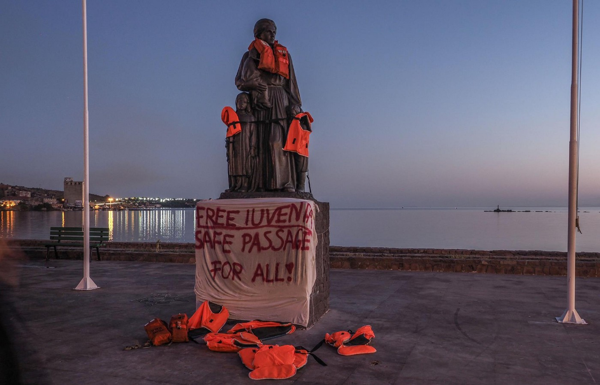
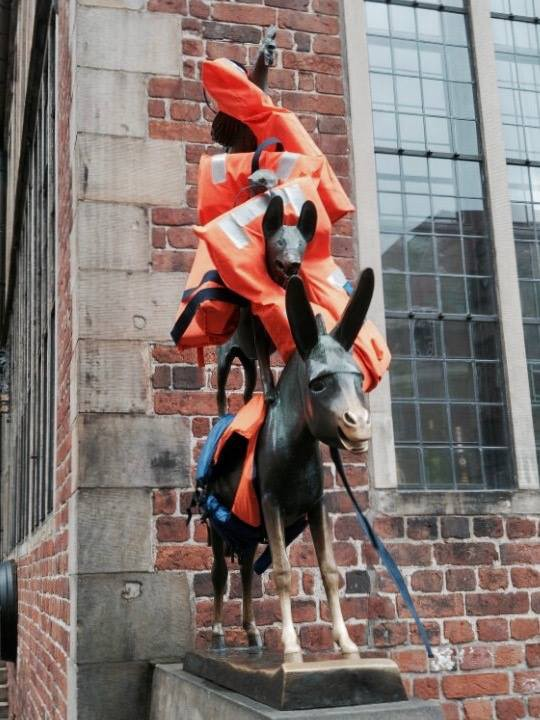
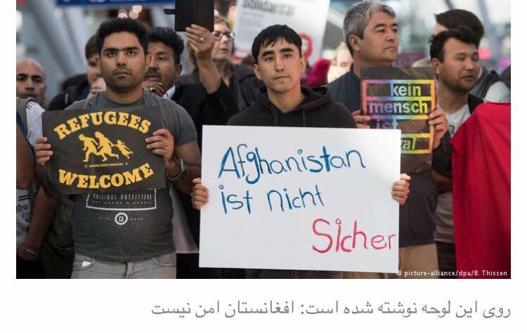
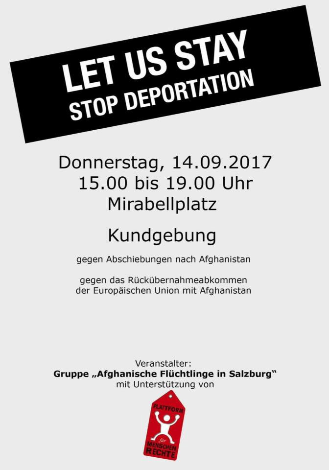

### AYS Daily Digest 13/09/17: Life Vest Actions take place across Europe

Life Vest Action on Lesvos
### FEATURE: Italian authorities impound ship Iuventa for not signing its maritime Code of Conduct

[Jugend Rettet](https://www.facebook.com/JugendRettet/?ref=br_rs) ’s ship, _Iuventa_ , which had saved over 14,000 people in the Mediterranean, was impounded by Italian authorities for refusing to sign the maritime Code of Conduct\.

The Code of Conduct severely restricts the abilities of rescue missions in the Mediterranean to conduct their work\. The group rightly refused to sign the document, as it directly contravenes maritime law\. By its actions, the EU has shown that it is more concerned with creating further impediments for refugees who are forced to flee their homes as a result of warfare and economic deprivation which have stricken their countries than it is with protecting the safety of people\.

Europe is currently engaging in a project of propping up the so\-called Libyan Coastguard, which is in actuality a medley of militias who capture and imprison refugees in horrifying conditions\.

Life Vest Action in Bremen

Public outcry about the ship has been rather large, with the hashtag \#freeiuventa gaining traction on Twitter\. All of this culminated today in numerous demonstrations across the continent\. From Germany to Italy to Greece, thousands of people have made it clear that they do not want these actions to be taken in their name\. These protests have been given the name ‘Life Vest Action’, as they often involve putting life vests onto historic monuments in their respective cities\. The visual effect is simultaneously powerful and yet absurd, and serves as a powerful indictment of European conduct against refugees\.

Life Vest Action in Göttingen

We at AYS declare our full solidarity with our comrades undertaking these actions, and we hope that the bright orange jackets contrasted with the dull metal exteriors of the statues catches the eyes of the European populace, that people become aware of what is being done in their name, and wholeheartedly condemn their governments’ failure to ensure safety and freedom for all people\.
### GREECE
#### Norwegian Refugee Council releases data on Alexandria site

Information as well as a helpful infographic may be found [here](http://reliefweb.int/report/greece/greece-alexandria-site-snapshot-2nd-september-2017) \. According to the NRC, there are currently 268 residents in the Alexandria after 87 departed after being rehoused elsewhere or under the family reunification program\. there have been 105 new arrivals during August from the Islands as well as from the Evros border crossing\.
#### UNHCR has many available housing units on the mainland while islands face constant overcrowding

The latest UNHCR statistics on the organization’s housing, found [here,](http://reliefweb.int/sites/reliefweb.int/files/resources/59006.pdf?fref=gc&dti=1652972374920129) show that the organization’s housing is only at 68\.2% capacity\. This information comes at a time when the hotspots on the islands are unbearably overcrowded, fueling tensions between the refugees and generally creating a toxic environment in which prevents a proper distribution of goods and services\. In light of these facts, one has to wonder: what exactly is it that keeps refugees unable to leave the islands even for months after their applications had been reviewed and accepted?

Decongestion of the islands would do more than just about anything else to improve the quality of life for refugees, and as the availability of housing is not by any stretch of the imagination a problem, we ask that the Greek government allow people to finally resettle onto the mainland\.
#### No Borders reports on violation of rights of refugees on Crete

[No Borders](https://www.facebook.com/nobordersnetwork/) has reported that most of the refugees who had arrived to Crete last week have been transferred off of the island\. However, the group alleges that the refugees were not given a translator to explain the content of the documents explaining what was to happen to them\. Furthermore, Greek authorities prevented lawyers and UNHCR staff from speaking to the group before their relocation\.
#### InterVolve seeks long\-term volunteers in Larissa

[InterVolve](https://www.facebook.com/InterVolve-219418945063168/?ref=br_rs) has released a document detailing the multitude of positions that volunteers are needed for\. Teachers for adults and children are particularly in demand\. Those with language skills in Greek/Arabic/Sorani Kurdish/French are especially encouraged to apply\. For instructions on how to apply, please see the post below\.
#### New arrivals

The arrivals for yesterday were as follows:

First boat on Samos: 43 refugees \.
Second boat on Chios: 53 refugees \.
Third boat on Mitilini: 30 refugees\.
Fourth boat on Mitilini: 29 refugees \.
Fifth boat on Mitilini: 64 refugees \.
Sixth boat on Samos: 48 refugees \.

Official registrations on 12/09 were as follows:

Lesvos: 94
Chios: 53
Samos: 127
Kos: 6
Others: 13
Total: 293

This brings the month’s total to more than 2,200 new registrations, more than 17,000 in 2017 and more than 43,800 since the implementation of the deal\.
#### Relocation program ending for people who arrived in Greece before 20/03/16

The relocation program is indeed scheduled to officially end on September 26, but relocation flights will continue to be arranged by Greece until all eligible candidates have received a decision\. Furthermore, after September 26, those of Iraqi or Syrian nationality who arrived in Greece before 20/03/2016 will still be able to apply for relocation\.

You can find more info from [The Mobile Info Team](https://www.facebook.com/mobileinfoteam/) \.
#### Cafe Day for mothers in Athens

[Hope Cafe](https://www.facebook.com/soulfoodforrefugees/?ref=br_rs) will be hosting a workshop for mothers and women over the age of 18\. Saturday afternoon will be the initial meeting, where activities over the coming months will be discussed\. You may find the Facebook event page below\.

### BOSNIA
#### Bosnian police crack down on smuggling network

Today, police in Bosnia have conducted a major operation against a traffickers’ network, who were operating a smuggling ring from the Middle East to Croatia, according to the prosecutor’s office\. The action was coordinated with the Croatian police and several people, who are believed to have smuggled at least 300 refugees into Croatia, were arrested\. The arrested are suspected to be members of a criminal organization which smuggles refugees in exchange for money, often to the cost of several hundred euros\. The network has supposedly been operating for the last 2–3 months\.
### SERBIA
#### UNHCR releases new information on refugee situation in Serbia

According to the latest data \(September 10\), there are 4,061 new refugees in Serbia, of whom 3,754 were housed in 18 governmental centers Although there are enough spaces are available in the regular centers, over 300 men and boys remain accommodated in temporary emergency shelters \(i\.e\. rub halls or tents\) in Transit Centres near the borders to Croatia or Hungary\.

UNHCR Serbia and partners continue to encounter new arrivals \(117 this week as compared to 108 last week\) \. Most were Yazidi families from Iraq, mainly arriving from Bulgaria\.

UNHCR Serbia and partners collected testimonies on 52 collective pushbacks from Hungary, and 45 from Croatia, with most alleging to have been denied due access to asylum procedures there\.

In August, 282 individuals registered intentions to seek asylum in Serbia\. 50% were made by men, 6% by women and 44% were registered for children\. Most applications were made by citizens of Pakistan \(30%\), Afghanistan \(30%\), Iraq \(14%\), Syria \(6%\), and other nationalities \(19%\) \. Of these, one person was granted refugee status, making him/her the second person to receive a positive decision since the start of this year\.
#### No Name Kitchen in Belgrade reports being harassed by authorities

In a Facebook post, the group No Name Kitchen has reported being harassed by the police\. According to them, a week ago the home of one of their volunteers was searched by the police\. The police have also threatened to close down the kitchen, which hundreds of refugees depend on as their source of daily nourishment\. If the allegations are true, then they are of course very shocking, but unfortunately not surprising given the dominating hostile attitude towards refugees in Europe\.

A further update on the situation of the organization may be found below\.

### HUNGARY
#### UNHCR High Commissioner calls Hungarian transit zones what they truly are: detention centers

The UNHCR High Commissioner has finished a two day long tour of Hungary to assess how the country is dealing with refugees within its borders\. The minister expressed concern to his Hungarian counterparts that the transit zones built along the Hungarian border with Serbia are little more than detention centers\. “ When I was standing at the border fence today, I felt the entire system is designed to keep people, many of whom are fleeing war and persecution, out of the country, and preventing many from making a legitimate asylum claim,” he said\.

Mr\. Grandi noted that that since Hungary is able to provide good care for children under the age of 14, who are placed in open centers where all of their necessities are taken care of, there is nothing to justify the cruel and inhumane conditions found in the detention centers, where refugees’ freedom of movement and access to basic amenities are severely limited\. The refugees in the Röszke camp for example live in small, cramped containers and many residents complain about the dearth of information on the asylum process\. It is unlikely that Mr\. Grandi’s criticisms will be taken seriously, as the Hungarian government has shown itself to be completely intransigent to pressure from the outside world, but one can hope that his words will effect change\.
### GERMANY
#### First deportation since May has taken place

A protestor in Dusseldorf Airport holds a sign saying, “Afghanistan is not safe\.” \(Photo by B\. Thissen\)

At least 12 Afghan refugees [were deported from Germany](https://www.dailysabah.com/europe/2017/09/12/first-group-of-afghans-deported-from-germany-since-kabul-embassy-attack) last night from Dusseldorf Airport\. This marks the first such deportation from Germany since May, when a terrorist act shook the so\-called safe city of Kabul, leaving at least 150 people dead and countless others injured\. The attack forced the German government to temporarily halt its deportations, as it made plainly clear that there is grave danger in store for the inhabitants of Afghanistan\. Since then, several terrorist attacks \(thankfully on a much smaller scale\) have taken place within Kabul itself\. Just earlier today, [ISIS purportedly carried out](http://www.independent.ie/world-news/at-least-three-people-killed-in-kabul-terror-attack-outside-cricket-stadium-36128631.html) a suicide bombing in a stadium just outside of Kabul as an audience watched a cricket match\. The attack has killed at least 3 people at the time that this is being written\. Anyone who believes that such a thing can happen with such regularity in a so\-called safe country is either lying, lives in an entirely different reality, or does not hold the lives of Afghan people to be of equal value to that of Europeans\.

There are currently 10,000 refugees from Afghanistan living in Germany whose asylum applications were rejected and who may no longer remain legally in the country\. As the election draws nearer and Angela Merkel builds up her image as being ‘tough on refugees’, it is not inconceivable that the government will try to schedule another deportation in the near future\. We as an organization hope that the asylum cases of those up for deportation will be re\-examined, and that European begins to follow the rhetoric on the value of human rights with full sincerity\.
### AUSTRIA
#### Protest against deportations planned in Salzburg for tomorrow

Refugees and their allies are planning to stage a demonstration tomorrow against continued deportations to Afghanistan\. The demonstration will start at 3:30pm and last until 7pm in Mirabellplatz\.
### FRANCE
#### Utopia 56 announces end to work with Paris Nord Centre de Premier Accueil

Utopia 56 has announced that it is pulling out of its cooperation with the Paris Nord Centre de Premier Accueil\. Their statement, as posted below \(original French [here](http://www.utopia56.com/fr/actualite/utopia-56-annonce-son-retrait-centre-humanitaire-paris) \) attributes this move to the failure of French authorities to provide basic livable conditions for refugees, as well as of providing confusing instructions which ultimately resulted in refugees being unable to complete their asylum application, triggering the deportation procedures\. Utopia 56 says that they will continue to work at the center until the end of October, after which time their efforts will be spent to help refugees living on the streets of Paris\.

> Dear members, Utopia 56 is announcing its departure from the Paris Nord Initial Reception Centre \(Centre de Premier Accueil\), the first humanitarian centre for new arrivals opened in France, at the initiative of Anne Hidalgo, the mayor of Paris\. 

> We had hoped that this centre, opened last year on the 10th of November, would be a model for the establishment of 5 similar centres in France along the migratory route of the migrants\. It has become evident, however, that the administrative treatment of the refugees at the centre is anything but humanitarian and devalues the refugees\. What’s more, the police have recently launched a manhunt against the refugees\. In other words, this centre cannot be a model\. Utopia 56 announces its departure from the centre and will intensify its aid efforts to migrants in the street\. 

> Why is Utopia 56 leaving? 

> Thousands of migrants have entered the Paris New Arrivals centre since the 10th of November\. The mandatory visit to the Centre for Administrative Status Review \(Centre d’examen de situation administrative \(Cesa\) \) has become an administrative trap for many refugees and deprives them of their right to seek asylum\. Often, they believe that they have submitted their asylum application whereas in actuality they haven’t\. They then end up in a deportation procedure: entering the centre put them at a disadvantage\!
 

> In addition, police repression around the centre has grown more acute\. These past weeks, the police have been waking up the migrants every two hours to make them leave\. This is torture\. Utopia 56 aspires to humanitarian centres that respect the law and where the migrants are truly welcomed, including while they are queuing and in the vicinity of the centre\. 

> What’s next? 

> Utopia 56 will continue its volunteer work in the aid of migrants at the Initial Reception Centre until the end of October to give our partners, Emmaüs Solidarité and the City of Paris, the time to reorganise\. We will then continue our volunteer work in the streets of Paris, intensifying our efforts: the distribution of blankets, clothes and water, help with food distributions, making sure queues are peaceful, welcoming and providing guidance to unaccompanied foreign minors, especially those who are not officially recognized as minors, helping the most vulnerable individuals and families etc\.” 

#### Mobile Refugee Support calls for donations of old phones, power banks, and charging cables

Mobile Refugee Support is an organization that has long been helping refugees to maintain their links to home as well as to one another in a time fraught with such difficulties\. A crucial part of this is of course access to mobile phones\. A phone is usually one of the most valuable objects in a refugee’s possession, but unfortunately some lose access to this vital resource as a result of loss, theft \(sometimes at the hands of police\! \) and simple disorder brought about by companies and their profit motive\-driven planned obsolescence\. The group is currently collecting old and/or broken phones, power banks, and charging cables to repair and then pass onto the refugees whom they serve\. If you are able to donate anything that may be of use to others, please contact the group via their Facebook page found [here](https://www.facebook.com/MobileRefugeeSupport) \.
#### Volunteers and donations needed in Paris this weekend\!

Vestiaire, located on 12, rue St\. Bruno 75018 Paris / angle rue St\. Luc\. is an organization that primarily concerns itself with providing refugees with clothing\. This weekend, the organization serviced more than 200 refugees, and at the moment they are in severe need of volunteers and donations\. Volunteers are needed for the sorting and distribution\. Sorting volunteers would be working on Wednesdays from 3pm and distribution volunteers on Tuesdays and Thursdays from 9pm\. Those wishing to get involve should send an SMS to 07 53 03 72 53\.

In addition, the organization is looking for donations of hygiene products, such as shampoo, shower gel, soap, razors, shaving cream, lotion, deodorant, toothbrushes, dental floss, tampons/pads, and \(new\) women’s underwear\. Also needed are milk and diapers\. Any and all help will be greatly appreciated\!

### EU
#### UNHCR releases latest data on the relocation project

The latest numbers, which may be found [here](http://reliefweb.int/sites/reliefweb.int/files/resources/58987.pdf) , show that most countries are far from fulfilling their quotas on refugees from Greece and Italy\. A total of 27,228 people have been relocated, or 27%\. Of these, 19,016 \(28% of the quota\) have been relocated from Greece and 8,212 \(20%\) have been relocated from Italy\.

> **_We strive to echo correct news from the ground through collaboration and fairness, so let us know if something you read here isn’t right\._** 

> **_If there’s anything you want to share, contact us on Facebook or write to: areyousyrious@gmail\.com_** 

_Converted [Medium Post](https://areyousyrious.medium.com/ays-daily-digest-13-09-17-life-vest-actions-take-place-across-europe-823658c4e4a9) by [ZMediumToMarkdown](https://github.com/ZhgChgLi/ZMediumToMarkdown)._
