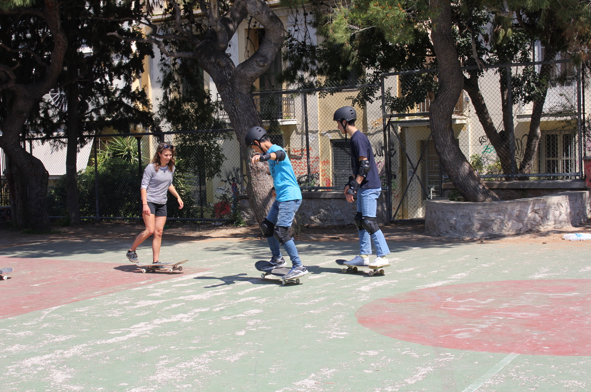

### AYS SPECIAL: How to teach equality on a skateboard

_Free Movement Skateboarding teaches kids in Athens how to skate\. It sounds like a very simple task, not very important, but what they achieve through it is much more than one can expect\. Their story is about how to teach gender equality, solidarity, comradeship, feminism, about how to break the borders… and all of that while jumping and cruising on a skateboard\._

Photo AYS

[Free Movement Skateboarding](https://www.facebook.com/freemovementsb/?ref=br_rs&pnref=lhc) are Ruby Mateja, Will Ascott, and Oisin Tammas\. Their first steps into the wonderful world of teaching kids how to skate began almost one year ago in Palestine, West Bank\. Will and Ruby met there whilst volunteering for the charity organization SkatePAL, who have built a skate park near Nablus city and teach daily sessions to the kids from surrounding towns\.

They saw there the incredibly positive impact that skateboarding can have, not only for the kids but also for the community at large\. They spoke at the time about wanting to set up a similar project themselves, and which places could also greatly benefit from skateboarding\.

Straight after Palestine, Will came to Athens to volunteer at [Khora Community Centre](https://www.facebook.com/KhoraAthens/) , and within the first week had called Ruby to tell her this was the place\. Back in England they put together a proposal for their project and gained the support of UK\-based charity Help Refugees to make it all happen\. Since then, five days a week, sometimes multiple sessions a day, Ruby, Will and other volunteers from the local and refugee communities are skating with kids in camps and public spaces around Athens\. Girls and boys together, Greeks, Syrians, Afghans, Pakistanis… or as Ruby told us, sometimes they have over half a dozen different nationalities in one class\.

Photo FMS

We went with the group to one of their skating classes\. The park in Exarchia was bursting with energy and laughter of boys and girls, all different ages, on skateboards\. Some of the girls were much more brave and skilled than the boys\. All of them helped each other, sometimes holding hands while trying to overcome new difficult tricks, and then laughing together when they made it or helping each other if somebody fell\.

The hardest part is when the class is over\. It looks like nobody wants to get off their boards\.

> “Just, when you are skateboarding, it is hard to think about other things you might have on your mind,” Ruby explains\. “You just have to focus on what you are doing, physically and mentally\. Plus, skateboarding is a non\-competitive activity, there is no winning or losing\. Just everybody skating together\.” 

**Empowering Girls and Women**

But in Athens, it is much more than just everybody skating together\. _“We made sure from the outset that we promoted skateboarding as a gender\-neutral activity — something that anyone can get involved with,”_ Ruby tells that there were some reservations concerning whether the girls and boys would skate together, but that once a few girls get skating others can see that it is open to everyone and naturally a number of girls skateboarding in their sessions just keeps going up and up\. Whereas a lot of sports still exclude girls especially as they get older, skateboarding, she believes, is different\.

_“Quite often, it is something that Middle Eastern cultures have not come across, therefore there are no preconceptions of skateboarding being a male\-dominated activity\. There are very few Greek local girl skaters here in Athens, but now we have almost one hundred girls signed up to our sessions\!”_

Photo FMS

Ruby believes that what they do is far from just skating, and she adds that many things they encounter daily they were not prepared for at the beginning\. However, having her as a part of the team, helped to attract more girls\. They plan to expand their team and to get another girl on board: _“If parents can see that other girls are doing it then automatically they do not see it as an issue for their daughters to get involved,”_ Ruby explains this little tactic\. _“We are open to offering women\-only sessions if this is necessary, but a big part of our ethos is to keep our sessions as mixed as possible, and so far it’s going great\. We see more and more girls signing up every week\. In Eleonas camp especially, quite often there are more girls skating than boys\.”_

**Mobile Skate Park**

Back in Palestine, the skate park acts as a community hub for the children and adults from the surrounding towns to come together and enjoy skating, socializing and the like\. Here in Athens, their operations are different: _“Unlike in Palestine, here we travel a lot because people are spread all over, some living in squats, some coming to community centers, and some are in camps far away with very bad access to the city… We want to reach out to as many as we can\. We have built a mobile skate park which fits perfectly together with all the equipment into the back of our van, and we take this to all the sessions we teach\.”_ Ruby explains\.

Photo AYS

_“We travel to camps that are way out of the city center because the kids there has less contact with people outside of their immediate environment\. You can really notice the differences between kids living in camps and those in the city, in squats or apartments\. In camps, there is often a lot of boredom and from that boredom, many complex behavioral problems can arise\. Whereas the sessions we held in the city the kids come from all different environments, many local kids now which is amazing, and it creates a great mixture in the class,”_ Ruby told us, explaining something very important — that the camps are often not good places for people, especially children, to live in\.

_“In our experience, the sessions we teach in the camps are a lot more stressful in the way that fights can often occur, or hostility between different families and nationalities\. I think it is mostly down to the sheer amount of people living in such close quarters — when you are all in that closed kind of environment things that should not necessarily happen are happening\. It is hard to explain, but what we have noticed is that the sessions in the camps are the lot more difficult for us to run smoothly\.”_

**What’s Next?**

The team now plans to seek extra funds so that they can expand their team and reach out to more camps\. They need more people, and a permanent space in Athens to be able to hold sessions in the winter\. The permanent space will then act as a hub, just like the skate park in Palestine, so people all over the city can come to skate together anytime they like\. In this way, they will also have more time to reach further afield to different camps each day of the week\.

Photo AYS

In the mean time, Ruby and the team get to know local skate community themselves and establish some new connections\.

> “ _That is how we live — we travel and skate, and make new friends\. We suppose that many of the kids we’ve met will continue moving around, and they will have a possibility to introduce themselves to the local skate community wherever they go, making it a lot easier for them to find friends\. That is a great way to begin in a new place\.”_ 

“ _For me, this project ties many things together, but spending time with the kids is the best thing\. Seeing them supporting and encouraging each other, losing themselves in skateboarding and knowing exactly how it feels is just incredible\. I have learned so many things in the process, and keep learning more every day — we will always come across certain obstacles because of the intensity of the situation, but we just have to be prepared for this and offer any support we can\. In a simple way, we try to offer an outlet just by spending time with the kids, skating together, encouraging each other, and having fun\!”_ Ruby concludes\. And this is what Free Movement Skateboarding is all about\.

If you want to know more or to donate to their project, visit their website: [www\.freemovementskateboarding\.com](http://www.freemovementskateboarding.com)

By Nidžara Ahmetašević

> **_We strive to echo correct news from the ground, through collaborationand fairness, so let us know if something you read here is not right\._** 

> **_Anything you want to share — contact us on Facebook or writeto:areyousyrious@gmail\.com_** 

_Converted [Medium Post](https://medium.com/are-you-syrious/ays-special-how-to-teach-equality-on-a-skateboard-71172504c979) by [ZMediumToMarkdown](https://github.com/ZhgChgLi/ZMediumToMarkdown)._
