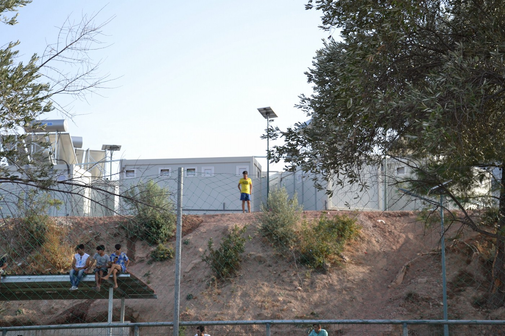
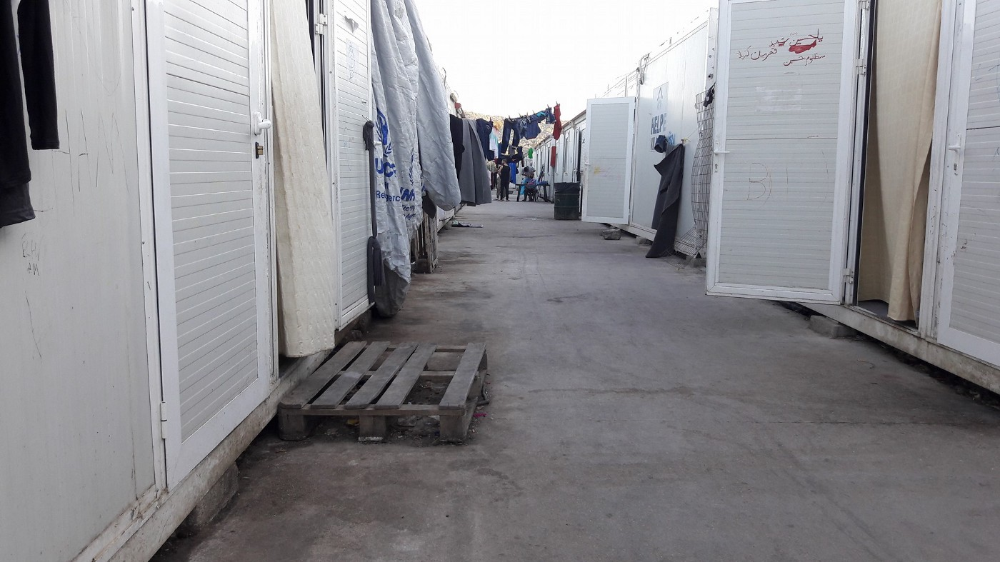
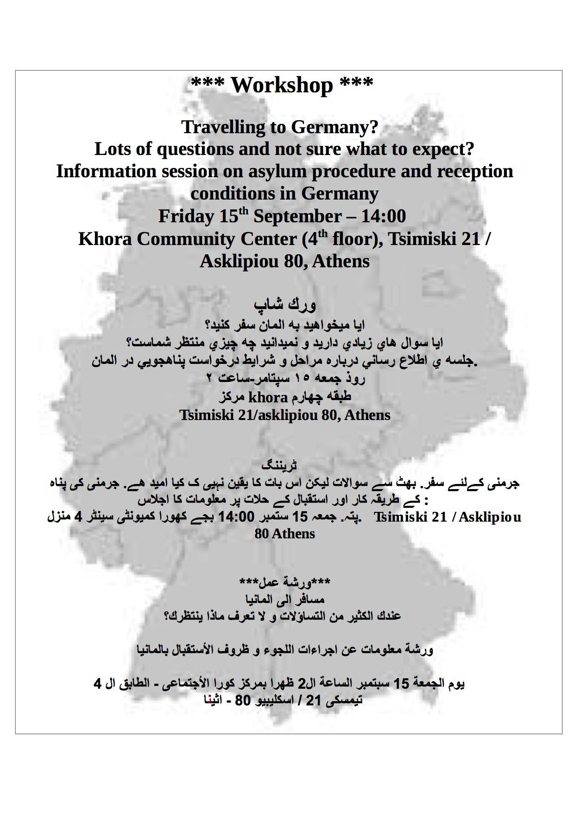
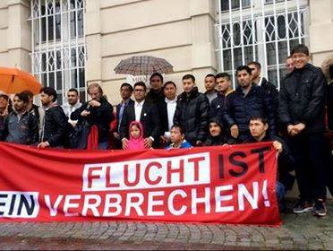
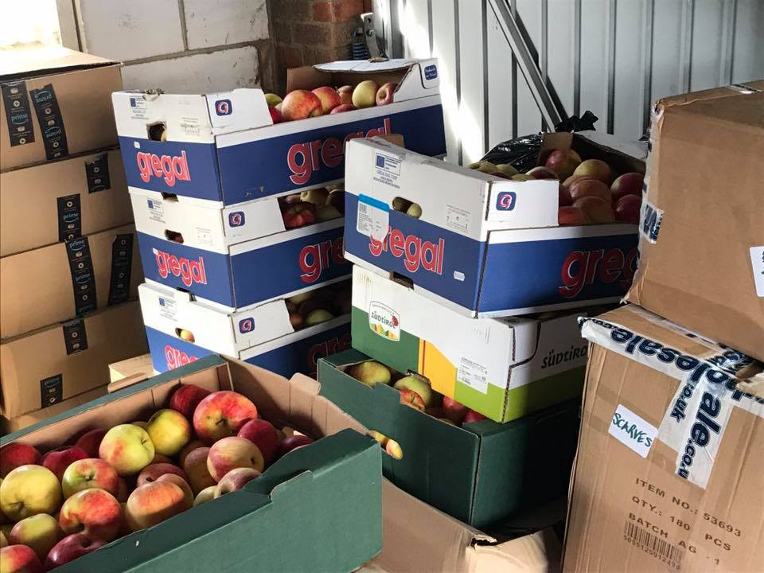
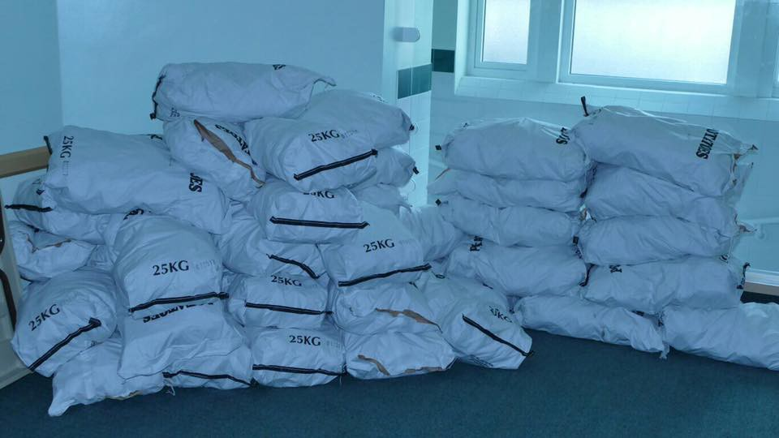
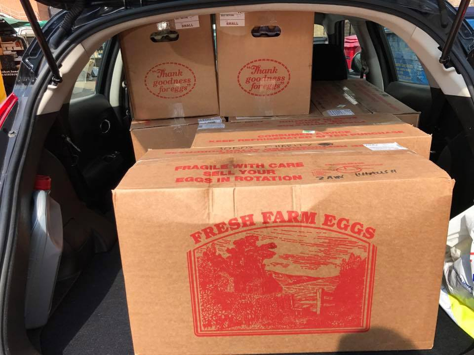

### AYS Daily Digest 14/9/17: Fights and police beating on Samos

**](assets/90adf5881e5a/1*tuK6WnHDZoKR8kD2LYpP6Q.jpeg)

**Chios, Photo: [Muhamed Albakur](https://www.facebook.com/muhamed.albakur.5)**
#### FEATURE

As there are no NGOs in the camp on Samos, people are crowded and situation is tense\.
This evening a fight broke out, with people involved using knives and wooden sticks\.
The situation escalated with a violent police intervention when, according to the refugees’ account, they started beating everyone regardless\.
Many young boys were hurt during the clashes and by 11pm the situation calmed down\.

> “We live in terrible circumstances”, _a boy from Samos wrote to us\._ 

Increased flows of refugees to the northern Aegean islands is peaking with almost 600 people arriving in the past two days\.
Situation is dire in most of the places on the islands\.

All the NGOs left the **Kos** island and yesterday many people arrived from Crete, mainly Kurdish and Iraqi\. 105 people arrived to the island last night\. There are many people on the island of different nationalities: Syrians, Kurdish, Iraqi, Bahrainis and people from the north of Africa\. Previously most of the people there came from Pakistan\. 
All of them stay in the _hot spot_ in containers\. The place that has the capacity for about 200 people currently hosts around 800 people\.

The Vial camp on **Chios** is an inadequate place to stay, regardless of how long as the conditions seem to be seriously bad, according to all accounts\.

](assets/90adf5881e5a/1*D3wYZ9xK0pSZH_xjjZv4PQ.jpeg)

Vial camp photos by [**Muhamed Albakur**](https://www.facebook.com/muhamed.albakur.5)

Situation in the crowded Moria camp on Lesvos:

](assets/90adf5881e5a/1*7yklCDSwSbYgHD0n7U03uQ.jpeg)

Photos by [Rafat Al\-hamoud](https://www.facebook.com/rafat.hammoud?hc_ref=ARRt1eUFIQsCZz840_YY8LSbnvNOvbx2yN9OOkINCNsxa8PpqrHZ2qDW6pFlpgJwD7k)

\_ \_ \_ \_ \_ \_ \_ \_ \_ \_ \_ \_ \_ \_ \_ \_ \_ \_ \_ \_ \_ \_ \_ \_ \_ \_ \_ \_ \_ \_ \_ \_ \_ \_ \_ \_ \_ \_ \_ \_ \_ \_ \_ \_ \_ \_ \_ \_ \_ \_ \_ \_ \_ \_ \_ \_ \_ \_ \_ \_ \_ \_ \_ \_
#### TURKEY

> Two members of the International Rescue Committee were arrested by the police in IRC’s guesthouse in Gaziantep last night\. 

These kind of demeaning acts of EU’s partner country are consistent with their recent crackdown on NGOs working with Syrian refugees\.
We hope European Union starts recognizing the real situation unfolding in front of their eyes and with their support\.
#### GREECE
#### Arrivals

218 people were officially registered on the Greek Aegean islands: 150 on Lesvos, 49 on Samos and 17 on Kos\.

70 new arrivals were documented last night on Chios: 24 men,14 women and 32 children\.

According to the local volunteers, 3 boats came last night on Lesvos\.
The first one had 27 people on board:12 children, 8 women and 7 men\.
The second boat came with 70 people: 32 children, 14 women and 24 men\.
The third boat arrived on south east coast of Lesvos with 33 people on board\.

 Join us tomorrow Friday 15 September at 20\.00 in [Mosaik Support Center](https://www.facebook.com/mosaiksupportcenter/?fref=mentions) for a talk with Sheila Romen about the ongoing crisis in the Democratic Republic of Congo and its impact on the region\. Sheila has been living and working in Congo for the past 6,5 years\. The talk will be in English, with translations to Greek and French\. Μετάφραση στα Ελληνικά\. Interprétation en français\.” — — [Lesvos Solidarity — Pikpa](https://www.facebook.com/pikpalesvos/)](assets/90adf5881e5a/1*xuNVsV-fP9MVmfNFYuGqyg.jpeg)

[“](https://www.facebook.com/pikpalesvos/) Join us tomorrow Friday 15 September at 20\.00 in [Mosaik Support Center](https://www.facebook.com/mosaiksupportcenter/?fref=mentions) for a talk with Sheila Romen about the ongoing crisis in the Democratic Republic of Congo and its impact on the region\. Sheila has been living and working in Congo for the past 6,5 years\. The talk will be in English, with translations to Greek and French\. Μετάφραση στα Ελληνικά\. Interprétation en français\.” — — [Lesvos Solidarity — Pikpa](https://www.facebook.com/pikpalesvos/)
### Crete
#### Press release on the latest developments in the port of Heraklion on Crete, by the Heraklion Initiative for Refugees

> The second boat arrived on Tuesday 7/9 \(the same day that the first group of refugees freed and left\) with people mainly of the same ethnicity as the first, Sorani speaking Kurds from Iraq, however the procedure followed was totally differentiated\. 
 

> A representative of UNHCR visited, accompanied with a certified translator, informed the approximately 70 refugees on the asylum procedure; initially 18 refugees expressed interest\. The number of interested rose gradually to more than 24\. The representative informed in turn the police to follow up the official procedure, as it should, and call the Regional Asylum office of Crete to register the asylum applicants\. Moreover, the representative of UNHCR informed the Development Agency of Heraklion, implementer of the housing project of asylum seekers of UNHCR in Crete, and the latter equipped immediately apartments of the project, as for the asylum applicants to be accommodated directly after their release from the space at the Port Organization of Heraklion that were held\. While the apartments were immediately ready, the issuing of documents for the launching of the asylum procedures didn’t materialize neither the notification of the local functioning asylum office\. On Tuesday 12th of September at noon, and despite the reassurances, the approximately 70 refugees, held at the Port Organization of Heraklion, literally signed their deportation\. 
 

> The police officers on duty proceeded to serve of documents, asking the certified translator to be present, without permitting him to read and translate the service notes as the law defines\. 
 

> The translator refused and left\. The police then brought their own translator, that he is neither certified, nor could read Greek, and asked him to do the same: the police served the documents to the refugees in the presence of a “translator” without saying what documents were \(he couldn’t know anyway\) \. So the refugees signed the service notes without knowing what was written on them\. 
 

> We contacted UNHCR and lawyers from the Bar Association of Heraklion, and they tried again to inform the refugees about the documents they had signed and for the possibility for asylum \(with the new element of the 6 months detention and then deportation\), but this was prohibited by orders from above, as police officers didn’t allow anyone to the enter the detention space\. 
 

> After lots of pains the police allowed the representative of UNHCR to enter with a translator; after almost an hour and lots of telephone calls\. A refugee demanded to speak to a lawyer, pointing to the police one of the present lawyers of the Bar Association, declaring in loud voice his intent to ask for asylum but he didn’t make it\. 
 

> We knew that there was a boat \(confirmed by the shipping company ANEK\) that would transfer the refugees \-essentially with no information as to where they will be taken\- to a pre\-departure center at the island of Kos\. In conclusion: 
 

> The refugees were held at an unsuitable space, with no respect to any hygiene and safety rules for them and their children\. 
 

> It is indicative that there are no showers in that space, the toilets are flooded, there were cases of gastroenteritis \-even if at the beginning the refugees were healthy\-, and 3 babies had insect bites presumably from fleas from the mattresses laid on the floor\. The refugees were driven in 6 months obligatory detention at a detention center \(that are essentially the pre\-departure centers\) and deportation, without any information to them and without the possibility of objections and appeals against the decision \(as the law defines\) as lawyers were denied by the police to enter and at day break they had already gone\. The police denied communication with lawyers for information on their rights, even if it was requested\. 

> The presence of the representative of UNHCR was obstructed too as she was waiting for an hour to enter\. Among the asylum seekers there is a 30 years old woman with thrombocytosis that has lost sight from the left eye, she visited 2 or 3 times the emergency room where she lost her medical record that she kept with her during her whole trip \(some uniformed person asked and took it, but both the coast guard and police denied it\); a mother of 4 children that was fainting constantly; and many families with children\. 

> The morning of Wednesday 13/9, the men, without any resistance, were driven handcuffed to the boat in front of surprised tourists\. The children that stayed back at the detention space with their mothers until the police bus returned had started to cry\. 
 

> The whole procedure was done again without translator\. To the hilarious and generalized replies from the police and local authorities, we clarify: If the reason of the rushed transferred of the refugees to Kos was the unsuitable conditions at the port, why the authorities didn’t send them elsewhere in the city? What is the result of those notorious meeting during the last two years where everybody was declaring that they were ready? 
 

> If the problem was the hygienic conditions why none “responsible” showed up during these 6 days to do what they should have done? If all are so interested for the health of these people and their only actual response is the pre\-departure center of Kos, why the service notes had the date 10/9 and not 12/9 when they had been served? 
 

> What is the reason of so much delay? Which article of the law defines that the “service notes” can be served un\-translated, without the presence of a translator? Why those desiring to apply for asylum here couldn’t do it, even if the Asylum Service was both informed and willing, and much less overloaded with cases than other regional offices; instead of sending them to a pre\-departure center where the presence of a lawyer, as we all know, is impossible due to entry refusal? 
 

> The authorities want the refugees every time that they remember the famous “Cretan philoxenia”, but if supposedly the millions of tourists are threatened by a bunch of refugees, then their rights mean nothing at all? 
 

> The mockery should end here and now\! 
 

> They don’t convince anyone and they know it\! 

](assets/90adf5881e5a/1*hxqKz3UxEf9ZA-eCkYj8MA.jpeg)

Photo: [NoBorders](https://www.facebook.com/nobordersnetwork/)
### Lavrio

The oldest refugee center in Greece, founded in 1948, is located in Lavrio, in the center of the city, and for the last 48 years it has been operating under the responsibility of the Greek Red Cross, but it withdrew at the end of July this year, as the decision was made to close it\.

350 refugees, mostly Kurds, and few Afghan, left their fortune and they currently survive thanks to the offerings of the citizens from Lavrio and all over Greece, as well as those abroad\.
If you would like to help, please contact Pampiraiki at: pampiraiki@gmail\.com or by phone at \+306906408586 \(mobile & whatsapp\) \. They organize regular shipping to Lavrio from [their warehouse](https://goo.gl/ maps / 7VmJ758vCkC2) in Elliniko, where you can bring supplies for the Lavrion Refuge Center \(Tuesday\-Friday 11–5\) \.
### State land to 1,500 refugees

[The initiative](https://l.facebook.com/l.php?u=http%3A%2F%2Fwww.thessaliatv.gr%2Fnews%2F47125%2Fkratikh-gh-se-1500-prosfyges%2F%23.WbpLftuWohY.facebook&h=ATMLiBLqOsIbew72qUM6vuV9ES-O7WT2s0UaSKujE3HdAUGfz_elL0hhWOUNxv_NZDp40wQxHaIitdSDC8amTPgJ5C_dprIwQfw_3t9rscpMjQLjvhlTAcF6h_MC6r14OzGznUXt7Z65KjctmZtzyCsd2UmMjNp101NTOtEnk1mmvxPMhDXysJZiY59H3Ek27YPElFr0ZQZIHD9esqY6ulsIGOtTDaeY4Xgh-J-ppLSCk6DZ93PQcBiNGULYTP-68_22i3Q1olcL3peCzuvPdtLmln29BuQ) for the cultivation of unused state\-owned land by refugees permanently settling in adjacent villages has been [welcomed](https://www.facebook.com/groups/PAMPIRAIKI/permalink/524569961220446/?fref=gc&dti=1652972374920129&hc_location=ufi) by the Greek volunteers and organizations engaged in helping the refugees\. As they say, the initiative “creates new jobs and contributes to local productive reconstruction alongside the smooth integration of refugees, who will earn their bread with dignity\.”
### Refugee Code Week

Train\-The\-Trainer \(TTT\) workshops will be held in Athens and in Mytiline on:
\- 22 September
\- 2 October 
\- 6 October

> The TTT’s are used to train both locals and refugees that will in turn train children from age 8 to 17 during the Refugee Code Week which will take place around 15 October\.
 

> SAP have partnered with several leading universities here in Athens where the workshops will take place and in some cases, will also offer transportation for refugees to attend these workshops\.
 

> The TTT workshops are also open to locals\!
 

> In addition to the above, SAP here in Greece is looking into possibly providing additional support post the Refugee Code Week\!
 

> Believe that this is an excellent initiative that promotes skills development and could lead to self sustainable opportunities\. 

Should anyone be interested in coordinating refugees that would be interested in attending these workshops, write to [this contact](https://www.facebook.com/profile.php?id=739890780&hc_ref=ARTPSiJhA7zhlciqMm8hD4mmuznY3EDzlg_FVliX2KyeZSCpEdNFPcF3e4pEIPkoGpQ) \.
### Athens
#### Volunteer

Do you have an education background and experience working with displaced or traumatized children? If so, you are needed at the child\-friendly space in Athens\.

> Requirements:
 

> \* Education background
 

> \* Experience and passion working with traumatized children
 

> \* Understanding of NGO culture
 

> \* Knowledge of core principles of Children Rights, Participation Rights, Do No Harm, Children in Emergencies minimum standards, UNICEF\-CFS qualifications
 

> \* Already be located in Athens, Greece
 

> Assets:
 

> Arabic and/or Greek
 

> Psychology/Sociology background
 

> Contact: HestiaHellasHR@gmail\.com
 

> [www\.HestiaHellas\.org](https://l.facebook.com/l.php?u=http%3A%2F%2Fwww.HestiaHellas.org%2F%3Ffref%3Dgc%26dti%3D1652972374920129&h=ATO8_BX2sfnG3hlDHb2aCfQG8K7sHpJu_XT6jHeG1viJhWTF7S5wkhHmIgIi0Wa0BdRDSEu3UNqvdxA0TTMk3uHkQHgEb5sHfBmryRV_Mq0udlFfFGPZkwtY5nN97WKzbSrQhqml) 

#### Help out

[Notara 26](https://www.facebook.com/%CE%9A%CE%B1%CF%84%CE%AC%CE%BB%CE%B7%CF%88%CE%B7-%CE%A3%CF%84%CE%AD%CE%B3%CE%B7%CF%82-%CE%A0%CF%81%CE%BF%CF%83%CF%86%CF%8D%CE%B3%CF%89%CE%BD%CE%9C%CE%B5%CF%84%CE%B1%CE%BD%CE%B1%CF%83%CF%84%CF%8E%CE%BD-%CE%9D%CE%BF%CF%84%CE%B1%CF%81%CE%AC-26-645186555621294/?hc_ref=ARROwl7aR_KxFwKSqk88OpLysUD24cwHkyBVTqr4gLAJ6wSCh705GOZ5p1nmSRqmQgk&fref=nf) needs:
\- Brooms /mops /buckets
\- Detergent for washing machine
\- Cleaning products for general use
\- Big rubbish bags
\- Shampoos /shower gels /soaps
\- Cooking pots

### The Corfu meeting

The prime ministers of Italy and Greece [met on the island of Corfu](http://www.ekathimerini.com/221655/article/ekathimerini/news/prime-ministers-of-greece-italy-meet-on-corfu) \.
The Greek prime minister Tsipras said the current crisis should be handled with solidarity and shared responsibility rather than “with fences and exclusions that undermine our European values\.” Italian prime minister Gentiloni said the two would raise the issue at an October meeting of southern European countries in Cyprus\.
“The message must be to update the rules we have because it is fair to stress once again that the burden of this phenomenon cannot be taken only by few countries such as Italy and Greece,” he said\.
#### BULGARIA
### From January until September 2140 refugees and migrants were caught at the border while trying to leave Bulgaria

Approximately 2,200 migrants and refugees, mostly from Syria, Afghanistan and Iraq, were on Bulgarian territory at the beginning of September, official Ministry sources said\.

484 people, at least, are accommodated in the “closed\-type” centres of the Migration Directorate of the Ministry of Interior, 22% of them are from Afghanistan and 17\.6% from Iraq\. 427 were accommodated outside the centers\.
As for these “accommodated” people, AYS has had a number of encounters with people who were held and beaten in the Bulgarian prisons, aka“closed type centres”, including unaccompanied minors\.

“1, 519 illegally foreigners have been taken out of the country since the start of the year, 40% of them from Afghanistan and 28\.5% coming from Iraq”, [officials say](http://m.novinite.com/articles/183220/Migrants+Almost+Left+Bulgaria) \.
#### SERBIA

[TruckShop](https://www.facebook.com/freedomofchoiceproject/?hc_ref=ARRGAD1VCcOGKfmLhaeMdcad8yFrZoxGI18UnnDQEDulQfs8_bkM_jyLTr_fktK8TPg&fref=nf) is looking for volunteers in Serbia\.

> Our work is dependent on the time dedicated by people from all over the world who are passionate about making a social difference\.
 

> If you have 2 or more weeks to spare, please complete [**this form**](https://docs.google.com/…/1AzT8HUseiTC7bJYqKRWdZF…/viewform…) or email the team at volunteer@freedomofchoiceproject\.org 

#### AUSTRIA

A protest in solidarity and against deportations to Afghanistan and other dangerous countries was organized today in Salzburg\.

](assets/90adf5881e5a/1*Bmbu691PySJ_W0wuBODG6A.jpeg)

Photo: [Plattform für eine menschliche Asylpolitik](https://www.facebook.com/menschliche.asylpolitik/?ref=gs&fref=gs&hc_location=group_dialog)

](assets/90adf5881e5a/1*QwKKH7We3GWP0IXESxJXSA.jpeg)

Photos: [Plattform für eine menschliche Asylpolitik](https://www.facebook.com/menschliche.asylpolitik/?ref=gs&fref=gs&hc_location=group_dialog)
#### GERMANY

8 Afghan nationals have been deported from Germany\.
This is the first time a deportation has happened since the suspension of deportations after the attack in Kabul\. 
The deported people arrived in Kabul on Wednesday\. [According to the German minister of interior affairs](https://www.facebook.com/193026784462210/videos/370334303398123/?fref=gc&dti=1652972374920129&hc_location=ufi) , all of these people are convicted criminals, some for sex crimes\.
According to some of the other people that commented on the news , only 2 of the deported people had committed sex crimes, one did not commit any crime and had a job \(apprenticeship\), he was working and paying taxes and got arrested at work to be deported\.
### Antiracist [gathering](https://www.facebook.com/events/1348795305156514/?acontext=%7B%22source%22%3A4%2C%22action_history%22%3A%22[%7B%5C%22surface%5C%22%3A%5C%22group%5C%22%2C%5C%22mechanism%5C%22%3A%5C%22surface%5C%22%2C%5C%22extra_data%5C%22%3A[]%7D]%22%2C%22has_source%22%3Atrue%7D&source=4&action_history=[%7B%22surface%22%3A%22group%22%2C%22mechanism%22%3A%22surface%22%2C%22extra_data%22%3A[]%7D]&has_source=1&fref=gs&dti=1652972374920129&hc_location=group)

> We want to tell our stories — stories of flight and deprivation of rights, of officials and racism, of welcoming and staying\. We’ll come united: For politics of solidarity\. Together for all\. 

On the 16th of September everyone is invited to join the mobilization and to come to Berlin — in a convoy, by bus or maybe even with a “Train of Hope”…

11 pm — carnival camp — Join the last preparations\!
1 pm — demonstration

The call is available [here](http://www.welcome-united.org/en/call-to-action/) \.
#### FRANCE
### Volunteer wanted

> What I am looking for is a volunteer who can do what I’ve done in the UK \(contact primary food producers\) and can build those relationships and help link the farms \(who are probably wasting literally tonnes of food\) to charities like RCK and other kitchens helping refugees and indeed other people in need throughout France\. I am happy to contribute to reasonable costs if the right person can’t bear them \(fuel, tolls etc when you’re meeting people\) \. 

For more information and contact, please see [this profile](https://www.facebook.com/zain.khalish?hc_ref=ARRDKs7jvjxyV8AuFGgW0topZLo7xHGRvpF2Nahy53fd_ODhY1fdLzla8Bd95fZxOwQ&fref=nf) \.

#### BELGIUM
### Friday 15, [protest](https://www.facebook.com/events/2036651686360926/?acontext=%7B%22ref%22%3A%223%22%2C%22ref_newsfeed_story_type%22%3A%22regular%22%2C%22action_history%22%3A%22null%22%7D) in Brussels

> \(…\)
 

> We don’t want any Calais in Brussels\.
 

> We don’t want a Calais where the same methods used for years have been a complete failure\.
 

> We don’t want history to repeat itself\. 

> Let’s unite beyond our peculiarities and our different ways of fighting in view of organising a strong resistance\. Let’s demand that the budgets allocated to the restrictive and repressive migratory policies\- and we are talking about billions of Euros\- are invested in favour of real welcoming policies\. 

> Brussels 2017 can not be like this\! 

> **First protest meeting this Friday 15 September 2017 at 5\. p\.m\. in front of the Foreigners Office Chaussée d’Anvers, 59 1000 Bruxelles** 

> and on 14 September 6\.30 p\.m\. in front of the town halls of Schaerbeek and Brussels city centre to show our determination to the mayors, responsible for the raids in the North Station and in the Maximilien parc\. 

> « Let’s make of our commune a commune of hospitality » 

Read the [entire text](http://www.gettingthevoiceout.org/we-dont-want-any-calais-in-brussels/) \( [English version](http://www.gettingthevoiceout.org/we-dont-want-any-calais-in-brussels/) \) declaring the stance on the current situation in Bruxelles and in all of Europe and see the list of supporters to the campaign\.
#### DENMARK
### Extending the border checks?

The “need to take preventative measures against terrorism” is posed as a reason for the potential Schengen border control to be extended in some countries, including Denmark, suggesting this measure continue\. 
The EU Commission [reportedly](https://www.thelocal.dk/20170914/denmark-to-propose-changes-to-schengen-to-enable-extended-border-control) hold the position that the migrant crisis and outer borders of the EU zone are now under control, nullifying the current justification for extending the temporary border controls\.
Denmark is hoping to change the rules of the Schengen agreement to allow border control to continue **\.** Denmark’s exemption from the Schengen open borders agreement expires on November 12th\.

_Converted [Medium Post](https://areyousyrious.medium.com/ays-daily-digest-14-9-17-fights-and-police-beating-on-samos-90adf5881e5a) by [ZMediumToMarkdown](https://github.com/ZhgChgLi/ZMediumToMarkdown)._
