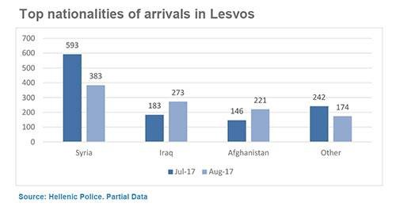

### AYS DAILY DIGEST 15/09/2017: Can we resist Orbanization?

Orban ideas prevails in Europe // Among about 18\.000 arrivals this year in Greece, there were 34 percent children // Democracy in danger in Europe // Life on overcrowded islands affects people’s mental health // Arrest and harassment in Belgium //

 volunteers cleared some of the waste, with the help from many friends\.”](assets/6dbcbae5d0d/1*2YFNn8pKHVrC0HZnf0hWlw.jpeg)

“In one landing, an average of 30 life jackets, clothes, shoes, a motor and a rubber dingy is left on the shore\. Which is almost 200 kilos of waste\. [Lighthouse Relife](https://web.facebook.com/lighthouserelief/) volunteers cleared some of the waste, with the help from many friends\.”
### Feature

Fascism is on the rise in Europe and around the world\. Today this is illustrated by what is happening in Hungary, but we can easily find examples — some we will mention in today’s digest — all around the old continent\.

T [he Hungarian media are reporting](https://budapestbeacon.com/village-council-effectively-bars-refugees-from-renting-premises-in-esztergalyhorvati/?_sf_s=refugees) that the council of the southwestern village of Esztergályhorváti has adopted an ordinance obliging people who are renting accommodation to check refugees’ vaccination records before renting??\! \! If a person does not have proof of all the vaccinations obligatory in Hungary, she/he cannot rent a place in this village\. Even before this order, not a single refugee had come to this village\.

The [Hungarian Helsinki Committee](https://web.facebook.com/helsinkibizottsag/posts/1565151626839416?_rdc=1&_rdr) \(HHC\) published a statement dismissing this order as “obviously unlawful”, adding that they believe it will most probably be dismissed by the Constitutional Court, as was the case with ordinances adopted by the village of Ásotthalom last year banning Islam and homosexuality within its borders\.

But even the idea of introducing this kind of ordinance is frightening and we — not only people in Hungary but everywhere in Europe — have to react\. Because fascism spreads like a desease, and there is no vaccination against it\.

Is it too late now to react? No, it is never too late\. Despite the dark prognosis that all of Europe is being affected by this kind of idea\. [Online magazine Politico published](http://www.politico.eu/article/viktor-orban-migration-eu-has-won-the-argument/) an interesting analysis of the way EU leaders now talk about migrations and refugees, showing that it is very similar to Victor Orban’s rhetoric\. He called for tougher border controls, and you can hear the same in the words of Commission President Jean\-Claude Juncker: _“We are now protecting Europe’s external borders more effectively,”_ or “ _When it comes to returns: people who have no right to stay in Europe must be returned to their countries of origin\.”_

Countries like Austria, France, Germany, Denmark, and Norway called for the extension of the length of time members of the passport\-free Schengen area can reintroduce border controls from two to four years\.

Italy is fighting against the NGOs who are saving lives at sea\. In France and Belgium, arrests and harassment of migrants has become almost normal\. The EU is making dangerous deals with other countries putting peoples lives in danger\.

While the polls are showing that Europeans do not support their elected leaders in their restrictive policies, there is not enough public outcry against them\.
### Mediterranean

Today, 262 people were rescued from the in international waters off the Libyan coast to the west of Tripoli\. Among those rescued were 56 women, 7 children under 5 years and 48 unaccompanied minors\. In the evening, another 109 people were saved by humanitarian boats\.

Photo by SOS MEDITERRANEAN\.

Today we came across a report about a rescue mission by [the Irish Defence Force](https://www.facebook.com/DefenceForces/photos/a.462303761165.253473.169367391165/10155532415751166/?type=3&theater) \. They rasponded to a request from the Italian Maritime Rescue Co\-Ordination Centre and found a boat with 285 people on board 44 kilometers northwest of Tripoli\. During the rescue operation, three people were declared dead\.

And this is just another day in the Mediterranean\.

This week, hundreds were saved, people from sub\-Saharan Africa: Nigeria, Cameroon, Gambia, Mali, Sierra Leone, but also Syria\. They all came from Libya testifying, again, about the appalling situation in that country\.

[SOS MEDITERRANEAN saved some of their stories](http://www.sosmediterranee.fr/journal-de-bord/sauvetage-371-140917) \.

> B\., a 20\-year\-old Sierra Leonean, said he tried three times to cross the Mediterranean before being finally rescued by the humanitarian ship on Thursday\. 

> “The first time I was turned back, arrested and sent to jail for six months, the second time I was again turned back and sent to jail for a month\. The third time was in 2016\. The Libyan navy and the police arrested me and I went to prison for three months in Sabratha\. In the morning they gave us spaghetti to eat, in which they put medicines to weaken us\. Then in the evening, they gave us poisoned spaghetti\. We were placed in small cells, there were up to 60 people in each cell\. No toilets, you had to make your needs on the ground\. And we had to sleep in the same place\. The guards placed a dish of food on the floor, for about 20 prisoners\. They beat me with electric cables\. To get out of prison you had to pay\. They asked me 480 € for my freedom\. Prices vary by individual\. There is no way to live in Libya, no way to escape, no way to return to our country\.” 

> Since the beginning of this year, the Aquarius teams alone have rescued 11,802 people\. 

■■■■■■■■■■■■■■ 
> **[SOS Humanity](https://twitter.com/soshumanity_de) @ Twitter Says:** 

> > "At one point I thought my kids and I were going to die in these waters. Seeing your boat meant seeing hope again." S., 25, Cameroon. https://t.co/OsuD0izYV9 

> **Tweeted at [2017-09-15 12:03:15](https://twitter.com/sosmedgermany/status/908662495669374976).** 

■■■■■■■■■■■■■■ 

### Italy

But none of these reports is enough for the current politicians in Europe\. According to the Italian activist group [Radicali Italiani](http://www.radicali.it/20170915/libia-chiarezza-su-accordi-litalia-ha-finanziato-dei-carnefici-lesposto-alla-procura-di-radicali-italiani-su-accordi-governo-libia/) , the contents of the agreements reached by Italy and Libya are not completely known to the citizens or the parliament\. The groups reacted by filing a complaint to the Procura della Repubblica di Roma for criminal conspiracy/offences and international corruption in the framework of agreements between Italy, the Government of Sarraj and the wanted Ahmad Dabbash, indicated by the press as head of violent armed groups and, at the time of the agreement, as one of the principal persons responsible for the smuggling of migrants at sea, said the secretary of Radicali Italiani Riccardo Magi, author of the petition together with the lawyer Francesco Mingiardi, member of Radicali Italiani\.

> “With our complaint — says Magi — we ask the judicial authority to verify whether what happened in Libya sticks to the version reported by Corriere della Sera in the reportage of Lorenzo Cremonesi, and by foreign newspapers like Le Monde, Reuters and AP: that is to say whether Italy has paid criminal gangs to stop migrants’ flows, in violation of international and European laws, such as the ban on refoulement for which Italy has already been condemned by Cedu \[…\]”\. 

_“If the government and public opinion of a democratic country do not intend to make it clear on this issue, then it means that the democratic nature of our institutions \[…\] is already severely compromised,”_ concludes the secretary of Radicali Italiani Riccardo Magi\.
### Greece

Among the approximately18,000 arrivals this year in Greece, there were 34 percent children\. Only on September 9th, in one boat there were 44 children \(plus adults\) \. At the same time, 21\.7 percent of new arrivals were women, while 44\.3 percent were men\.

And more people arrived today\.

This morning, on Lesvos, 72 people arrived — 34 children, 18 women, and 20 men\.

Starfish Fondation Lesvos\.

Additionally, official registration shows that yesterday 33 people arrived on Lesvos, 70 on Chios, 64 on Samos, and 20 on Kos\. Each of these islands is overcrowded and little has been done to change that situation and send people to the mainland\. According to volunteers in the field, since 1st September over 1,341 people have arrived in Moria alone\.

Overcrowding is creating a very tense and dangerous situation in the centres\. Last night we reported about clashes in Samos Whaty centre\. These are the pictures from the day after\.

Rocks, stones, and knives were used, and police reacted using violence, rubber bullets, and tear gas\. There are over 600 children in this centre\.

Watch the video from the last night again\.

The situation on the islands is leaving a deep mark on the mental health of people who are kept there against their will\. This is a story from Lesvos:

> In their [latest report, Refugees International made a number of recommendations](https://www.refugeesinternational.org/reports/2017/greekislands) to the Greek authorities\.
 

> \- End to the containment policy on the Greek islands in light of the unacceptable conditions faced by asylum\-seekers;
 

> \- And refrain from returning asylum\-seekers to Turkey until Turkey can ensure that they will be accorded standards of treatment commensurate with the 1951 Convention related to the Status of Refugees and its 1967 Protocol\. 

Refugees International also calls on the EU and EU member states to suspend the requirement that Greece return asylum seekers to Turkey under the EU\-Turkey agreement\. In addition, EU and EU member states should demonstrate solidarity by accepting some asylum\-seekers who are in Greece\.

Also yesterday, the Turkish Coast Guard intercepted two boats with 32 people, while today they did the same with four boats and 44 people\.

Turkish border guards have stopped around 6,500 people, including 1,300 children, near the Edirne border with Greece in the past month, according to the local media\. Most of them were from Syria, but also Pakistan, Iraq, and Afghanistan\. They tried to cross over the river Meriç\. According to some sources, each person has to pay between 2,000 to 3,000 euros to cross this way\.

At the same time, Greek authorities — in accordance with the EU — Turkey deal — are deporting people\. Yesterday, 13 people were returned from Mytilene to Dikili: 2 from Pakistan, 2 Egypt, 1 Mali, 1 Iran, 1 Lebanon and 1 Bangladesh\. During this year, 529 people were deported under this scheme while 1402 made use of the voluntary return program of IOM \(mainly from Pakistan and Georgia\) \.

For people who are still — often against their will — in Greece, volunteers and different groups are trying to provide what is most needed\. METAdrasi organizations provide free courses in Greek\. The students receive free educational materials \(books, dictionaries, notes, and exercises\), while at the end of each course a certificate is provided\.

Registrations and classes are carried out at METAdrasi’s offices in Tavros, 25 March 7, 1st floor \(nearest station: “Kallithea”\)

Registration: Monday to Friday, from 12\.00 to 16\.00

[For additional information, you can visit their site\.](http://metadrasi.org/en/greek-language-courses-athens/)

Another appeal for help from Lavrio where after the Greek Red Cross left the centre — for reasons which are still not clear — people need everything\. Groups of volunteers are helping, as well as locals\. About 350 people \(many of them children\) are staying there\.

The Sankt Pauli Athen Klub once again took the initiative and without a moment’s thought decided to offer money from its fund to buy food supplies, which were delivered on Sunday 10/9 at the Centre by members of the club\.

They call all those who can help to do the same\. This is what is needed: vegetables, olive or sunflower oil, salt, pepper, sugar, tea, flour, Arabic pies, baby milk, noodles, rice, sauces, long\-life milk, bread, baby diapers \(№3, 4, 5\), baby wipes, sanitary napkins, toilet paper, soap, fruit creams for babies, biscuits, waste bags\.

Also medicines:
Depon \(500ml\), Panadol Extra, Ponstan \(500ml & sirup\), Amoxil \(500ml\) Niflamol \(250ml\) Mesulid \(100ml\), Algofren \(400ml\), Buscopan, Voltaren Crem, Otrivin Spray, Augmentin \( sirup & tablets\), Algofren \(sirup\), Rifacol \(200ml\), Zantac \(150ml\), Tobrex \(οφθαλμολογικές σταγόνες\), Pharmac Tab, Olartan \(20ml\), Omnic Tocas \(0,4ml\), Betadine, Alcohol Lotion, Bisolvon \(sirup\), Band Aids\.

If you want to help, you can get in touch with the [St\. Pauli Athen Klub](htts://www.facebook.com/fcstpauli.gr) \.
### Belgium

[Belgian media are reporting that Alexis Deswaef](https://www.rtbf.be/info/regions/bruxelles/detail_une-rafle-de-250-migrants-programmee-jeudi-prochain-le-president-de-la-ldh-ecrit-aux-autorites?id=9710183) , the president of the Human Rights League and an attorney, has recently received an anonymous call announcing a large\-scale raid on the entire territory of the Brussels region for next Thursday, 21 September\.

So far, we published several reports about the raids in the Maximilian Park, in the North Station and their surroundings in Brussels\.

[Media are also reporting](https://nieuws.vtm.be/binnenland/illegalen-bezetten-hotel-brussel) about the occupation of Hotel Astrid in the centre of Brussels, where the group of mostly young people is living\.

Sixty people from ‘La voix des sans\-papiers’, a collective of people without papers, occupied the vacant Hotel Astrid in the center of Brussels last night\. The migrants first stayed in a rest house in Etterbeek — they were allowed to stay bt the mayor until September 15th — but had to leave because the building was declared unsafe\.

Because there was no other solution, the migrants took over this hotel, which went bankrupt a few years ago and has since been vacant\.

So far, the city authorities are not planning to act, saying that they will wait for the owner to ask for their help\.
### Germany

German media are reporting about the “black markets,” where corrupt individuals help refugees get an appointment with the authorities for a fee\.

With a big number of people still arriving, it gets difficult sometimes to get an appointment at the Foreigners’ offices\. Two journalists from the German media outlet WDR found out that an appointment with the Essen Foreigners Office was possible and could be done “very fast” but only through the so\-called “black market\.”

“There is someone who arranges appointments with the foreigners’ department in Essen for money,” Lina \(not her real name\), who was involved in the investigation, told [InfoMigrants](http://www.infomigrants.net/en/post/5114/a-black-market-for-refugees-to-get-appointments-at-the-foreigner-s-office) \.

Through the mobile communications platform Whatsapp, refugees can communicate with the person who “sells appointments” and the number is traded publicly, especially among the Arabic\-speaking refugees\.

An employee in the Foreigners’ Office was suspected of involvement in the bribery, but these suspicions have not been yet confirmed\. The investigation is still ongoing\.

Germany offers thorough support to most pregnant women\. Germany’s Asylum\-Seekers’ Benefits Act states: _“Expectant mothers and women who have recently given birth are to be granted medical and nursing help and care, midwife services, medicine, bandages, and remedies\.”_

People who have been granted asylum or subsidiary protection or who have been asylum seekers for more than 15 months receive essentially the same health care that Germans do, which covers the medical costs of a pregnancy\. If someone cannot pay for their health care because they have no income and assets \(or only very little\), the state covers the fee\.

For pregnant women in Germany who do not want to keep the child, there are two options: to get an abortion or to give the baby up for adoption\.

The federal family ministry has a hotline for pregnant women in need that you can call anonymously — the number is \+49 \(0\)800–40 40 020 — and get advice in 18 languages, including Albanian, Arabic, English, French, Kurdish, Persian, and Romanian\. They also have an online support chat and a search tool to find a pregnancy advice centres that offer anonymous advice\.

The pro\-family web site provides a list of locations across Germany\.

Donum Vitae has a program that assists pregnant refugee women in 30 locations across Germany\.

The “Medibüros” help people without papers get health care\.

For more on this, and links, see [Info Migrant site](http://www.infomigrants.net/en/post/5097/what-services-can-pregnant-migrants-in-germany-use) \.
### UK

COME TOGETHER FOR REFUGEES
An event to raise money for great groups helping refugees is organized in the Yorkshire area\. Join if you can\.

[Tickets are on sale now and the link](http://www.yorkshireticketshop.co/m.index.html) \.
### General

MEDIAFUGEES — a brand new multimedia news platform by refugees & individuals in exile — is looking for contributors\.
See full ad:
FRENCH: [http://urlz\.fr/5N94](http://urlz.fr/5N94) 
ARABIC: [http://bit\.ly/2f8Oi80](http://bit.ly/2f8Oi80) 
ENGLISH: [http://urlz\.fr/5N8W](http://urlz.fr/5N8W) 
SPANISH: [http://urlz\.fr/5N8Q](http://urlz.fr/5N8Q)

Join the anti\-racist parade tomorrow in Berlin, Athens and all over Europe\.

> **_We strive to echo correct news from the ground, throughcollaborationand fairness, so let us know if something you read here isnot right\._** 

> **_Anything you want to share — contact us on Facebook orwriteto:areyousyrious@gmail\.com_** 

_Converted [Medium Post](https://areyousyrious.medium.com/ays-daily-digest-15-09-2017-can-we-resist-orbanization-6dbcbae5d0d) by [ZMediumToMarkdown](https://github.com/ZhgChgLi/ZMediumToMarkdown)._
