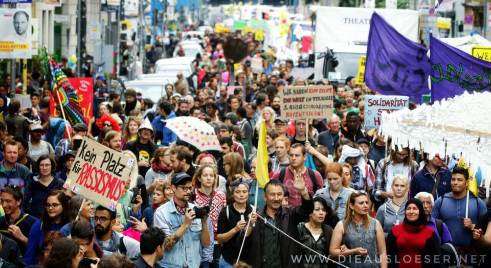
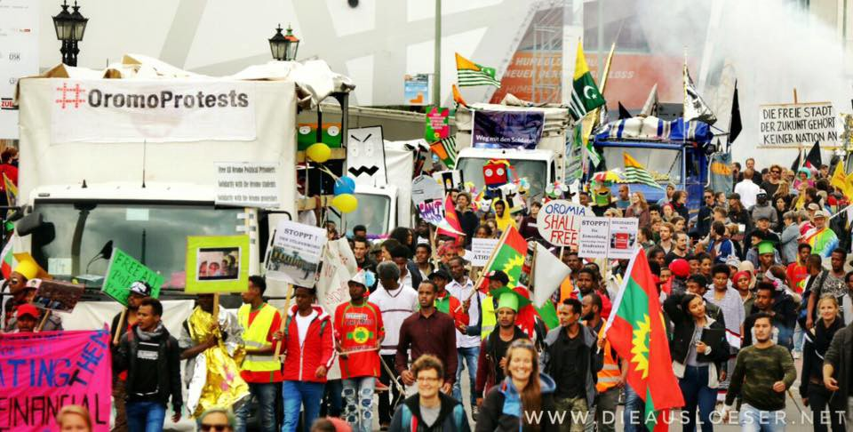
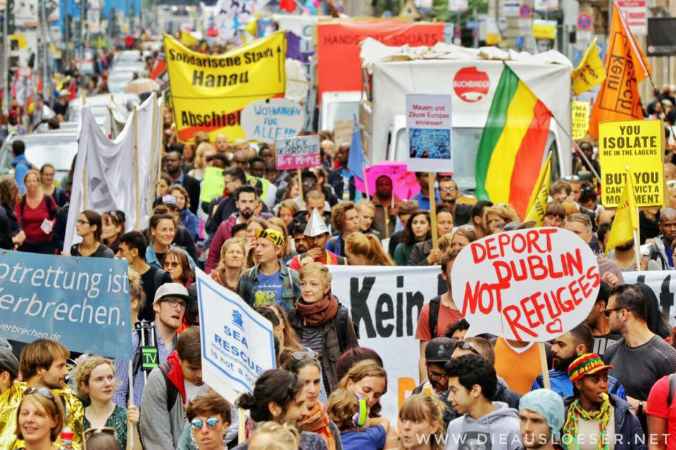
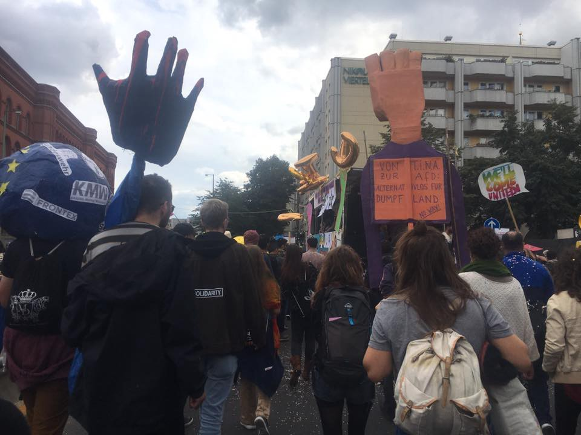
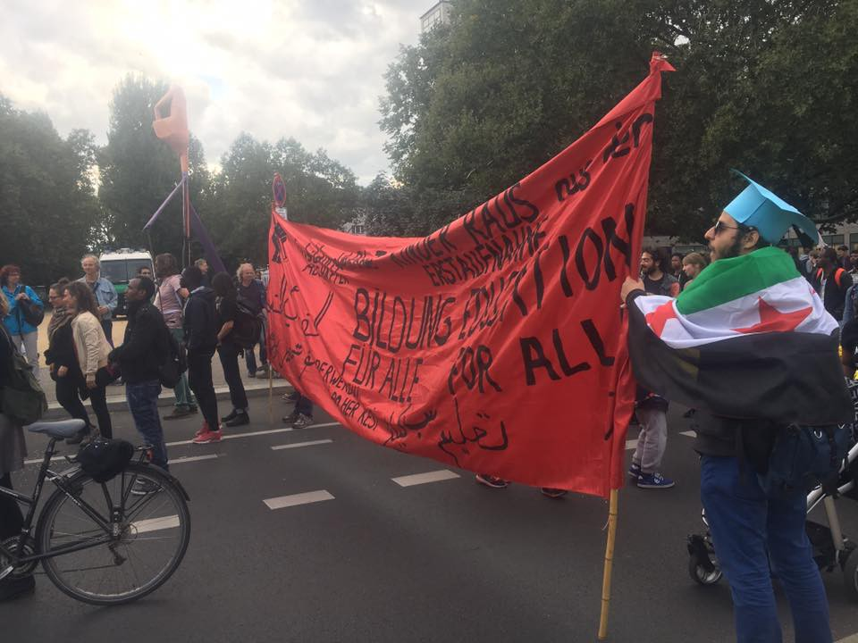
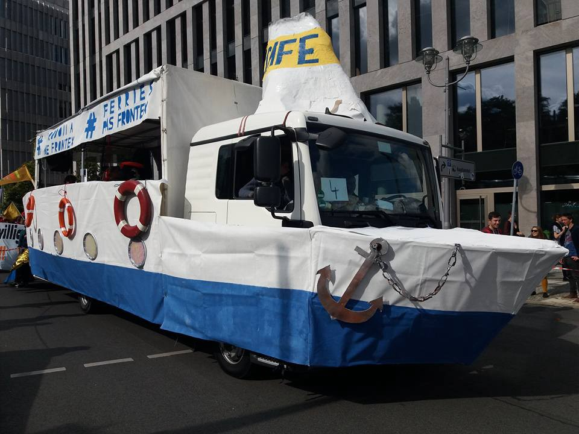
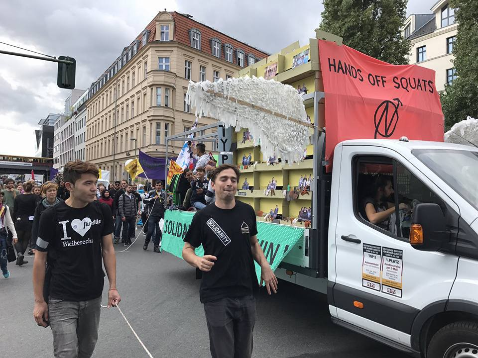
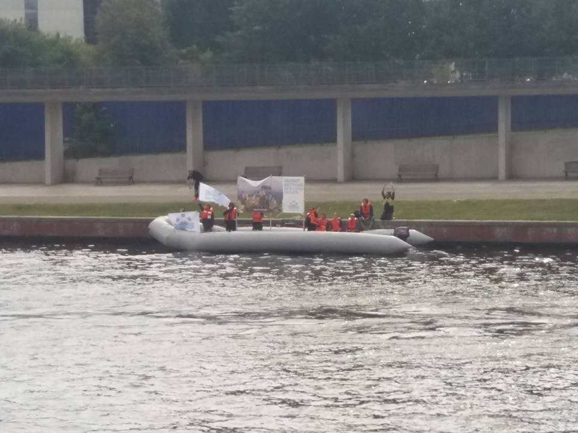

### AYS Daily Digest 16/09/2017 We’ll Come United — Demonstration in Berlin

Stranded for seven weeks on a ferry between Istanbul and Odessa /// Conditions on Greek islands aren’t changing /// Rescues in the Mediterranean /// info and news from Greece, UK, Belgium, Switzerland

Today up to 15,000 refugees, migrants, and supporters protested in Berlin\. After a joint speech with the alliance for sexual self\-determination at the palace, the demonstration grew and moved to the Oranien Platz in Kreuzberg\.

We’ll come united photos

“ [Welcome United](http://www.welcome-united.org/en/call-to-action/) is the culmination of this campaign in which we are determined \[we have\] the right to be here, the right to school, the right to work, the right to have our families with us\. For us it was a beautiful day that will move us long “, said Newroz Duman, spokeswoman of the initiative\.

> “Anyone who denies us our families, who is drowning us in the Mediterranean and wants to build internment camps in the Libyan desert, who wants to send us to Afghanistan, must count on our resistance\.” 

We’ll come united, Melting Pot Europa, Areyousyrious? photos

Sea Watch accompanied the demonstration carrying a dinghy from the Mediterranean Sea\.

Melting Pot Europa photo

Activists carried a list of the names of the 17,000 people known to have died in the Mediterranean Sea between 2005 and 2012\.

■■■■■■■■■■■■■■ 
> **[City Plaza Squat](https://twitter.com/sol2refugees) @ Twitter Says:** 

> > Amazing: names of 17000 people victims of the fortress europe from 2005 until 2012.
#WelcomeUnited #Berlin 
#StopFrotressEurope https://t.co/cX8EWb2BcL 

> **Tweeted at [2017-09-16 10:40:05](https://twitter.com/sol2refugees/status/909003954654244865).** 

■■■■■■■■■■■■■■ 

SEA

120 people were rescued at sea by [Proactiva Open Arms](https://mobile.facebook.com/story.php?story_fbid=1643183912379120&id=111995985497928&_rdc=1&_rdr) and [SOS Mediterranee](http://www.sosmediterranee.org) brought 371 people to safety\.

GREECE

Arrivals

Two boats arrived on Lesvos\. One carrying 22 people, the other 45\.

Samos

Another [report](https://web.facebook.com/permalink.php?story_fbid=10214747074213979&id=1338427042&fref=gc&dti=1652972374920129&hc_location=ufi) has come from Samos about the terrible living conditions people are enduring\. A doctor who has been working there for several months with an NGO is concerned about the lack of sanitation and volume of people living in the small space could lead to an outbreak of dangerous infectious disease as well as about the ongoing dehumanizing treatment\.

[New arrivals are locked up in a cage until they are registered, often they have to spend the entire night in there\. Police violence even towards minors is common\.](https://web.facebook.com/permalink.php?story_fbid=10214747074213979&id=1338427042&fref=gc&dti=1652972374920129&hc_location=ufi)

When will this stop?

Lesvos

[Cars of Hope](https://web.facebook.com/carsofhopewtal/) are now on Lesvos and asking for donations\. They have only been there for a few days but have already seen four refugees taken by the police using what they describe as ‘racial profiling’\.

Other independent volunteers [repor](https://web.facebook.com/aris.vlahopoulos/posts/10156598363013032?fref=gc&dti=1652972374920129&hc_location=ufi) t increasing arrivals on the island and worsening conditions in Moria\. They estimate that there are currently 7,000 to 7,500 people trapped on Lesvos\.

[No Borders](https://www.facebook.com/NoBordersNews/) have been alerted to a distress call off Gavdos Island from a refugee boat\.

■■■■■■■■■■■■■■ 
> **[NoBorders](https://twitter.com/Refugees_Gr) @ Twitter Says:** 

> > Alert now for search and rescue of refugee boat near Gavdos island,  #Greece. After call of refugee at 112 int nr 
#refugeesgr 

> **Tweeted at [2017-09-16 15:56:33](https://twitter.com/refugees_gr/status/909083595893084160).** 

■■■■■■■■■■■■■■ 

People under international protection in Greece with cards that expire by December 31, 2017 may now submit an application for renewal up until the 15th of October\. More info about the process [here](http://asylo.gov.gr/en/?p=2780) \.

SWITZERLAND

[Be Aware and Share](https://web.facebook.com/groups/1159112204116287/permalink/1837347622959405/) are holding a collection day for donations on Monday, September 18, 2017 from 18:00 to 20:30 at the Gym Bar\-Café \(Memory Alley 4, 3011 Bern\)

What they need:

> Wipes, Pads, Diapers 

> Clothes \(washed and intact\): Baby clothes, children’s, adult clothes in only size S and M, long\-sleeved shirts, long trousers, Sweater, long underwear \(only new\! \), warm jackets and coats 

> Accessories: hats, scarves and gloves \(intact\), socks, tights and long underpants 

> Baby shoes, men’s shoes, sizes 41–44, women’s shoes, sizes 38–40 \(sorted, tied, and with the size written on the sole with a sharpie\) 

> Everyday: collapsible stroller \(intact\), blankets, sleeping bags, insulating mats 

> In order to be able to finance transportation to Syria, we rely on a small financial contribution of CHF 2\. \- per donation bag\. 

> Thank you\! 

BELGIUM

[Community Support for Refugees in Belgium](https://web.facebook.com/groups/communitysupportforrefugeesinbelgium/permalink/1498511166895155/) are looking for people willing to host individuals from the refugee community\. They are based at the Gare du Nord in Brussels\. Send them a message if you can help\.

DENMARK

According to the local [media](http://indianexpress.com/article/world/migrant-stowaways-locked-in-cabins-inside-a-ferry-between-ukraine-and-turkey-4844076/?utm_content=buffer0c234&utm_medium=social&utm_source=twitter.com&utm_campaign=buffer) 12 men have been stuck on a Danish DFDS ferry for the last seven weeks\. The passenger ferry sails from Odessa to Istanbul but neither country wants to take in the men\. Until one allows the migrants to land they will remain in limbo on board the boat\. Several of them have threatened suicide and as a result they are locked in four cabins, not a likely way to improve someone’s mental health\. Meanwhile the officials are arguing amongst themselves\.

UK

Samin, a young man the Home Office is currently trying to deport even though his life has been threatened in Afghanistan, has now had the case against him taken to the Court of Appeal by the Home Office\. A foolish waste of money and a very real threat to a human being’s life\.

> **We strive to echo correct news from the ground, through collaboration and fairness, so let us know if something you read here is not right\.** 

> **Anything you want to share — contact us on Facebook or write to: areyousyrious@gmail\.com** 

_Converted [Medium Post](https://areyousyrious.medium.com/ays-daily-digest-16-09-2017-well-come-united-demonstration-in-berlin-9275c7313dba) by [ZMediumToMarkdown](https://github.com/ZhgChgLi/ZMediumToMarkdown)._
