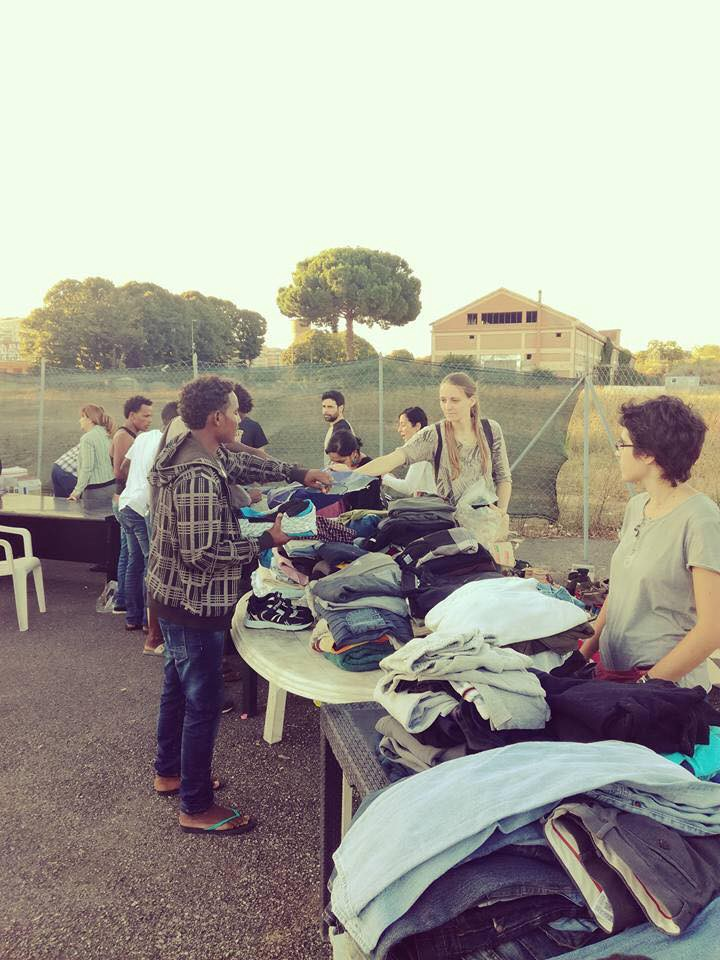
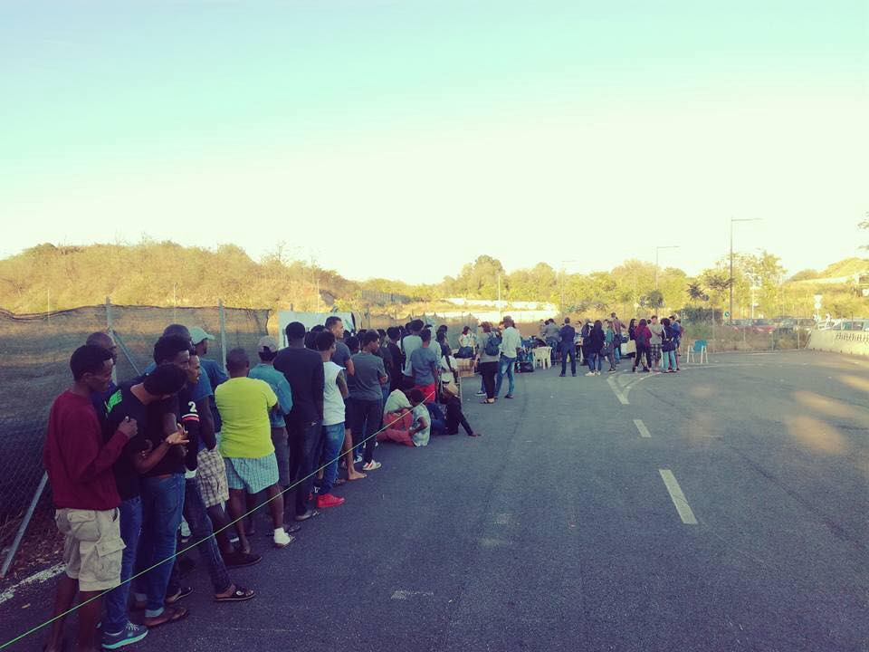
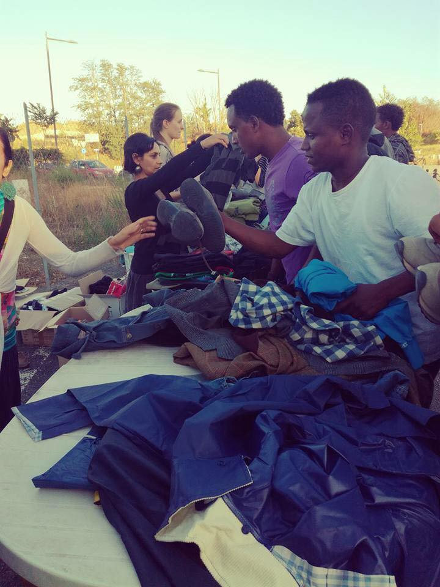
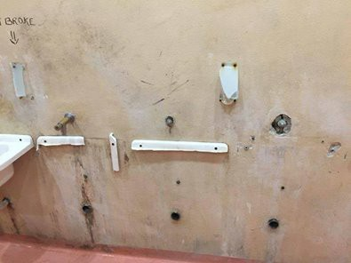
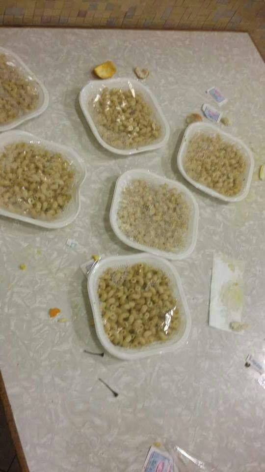
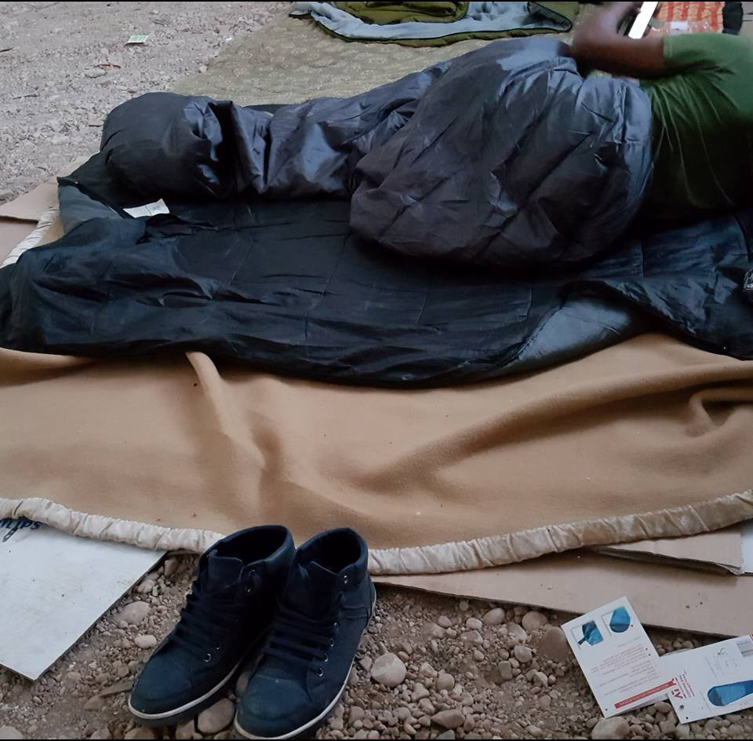
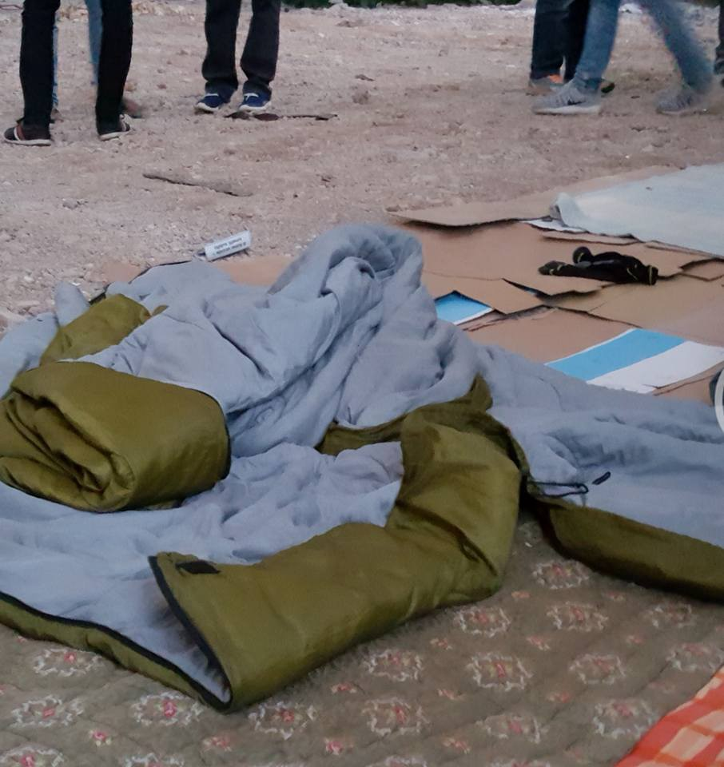
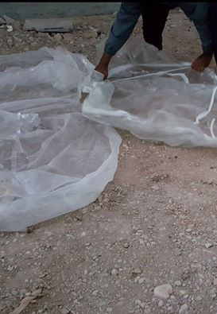
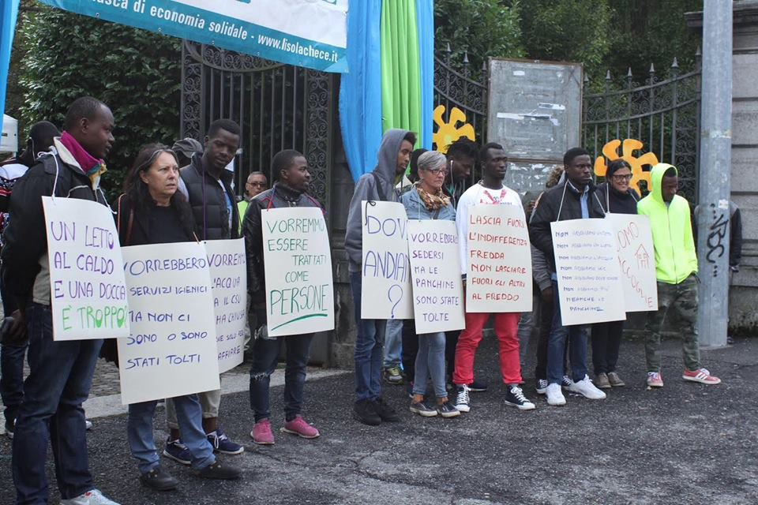
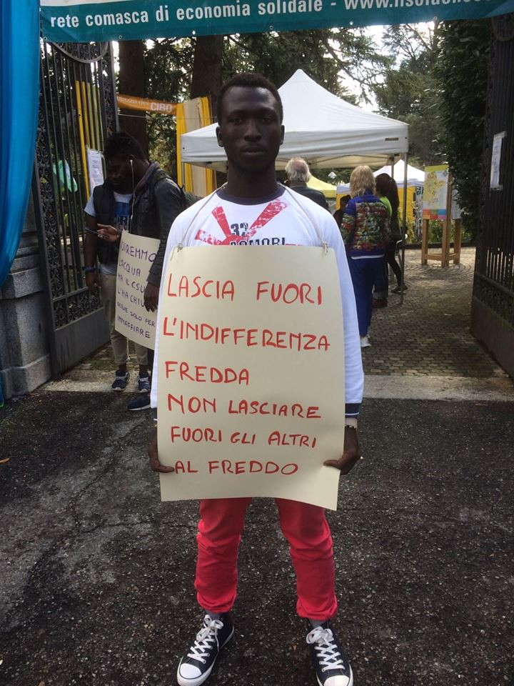

### AYS Daily Digest 17/09/17: Don’t let social issues become purely matters of public order

_Baobab Experience answers assessor Baldassarre / 120 saved in the Mediterranean / 703 people arrive on Lesvos this weekend with 1,717 this month so far / News from Greece, Belgium, Italy, Sweden, and Germany / And more news…_

Athens, Greece on September 16th, 2017: Antifa protest march with five people arrested and a 16 year old boy seriously injured in hospital \(Photo by Marios Lolos\)
### FEATURE: _Baobab Experience answers assessor Baldassarre_

[Baobab Experience](https://baobabexperience.org/) —an Italian group dedicated to helping refugees—answered assessor Laura Baldassarre today on her [statements](http://www.romatoday.it/politica/laura-baldassarre-porta-a-porta.html) regarding the situation for refugees and asylum seekers in Rome, which can be applied well to politicians’ responses in general\.

“It is difficult to be subject to 20 clearances of a humanitarian spot in less than a year, and to see today more than 70 migrants sleeping in the tents under the hard rain in an abandoned parking lot, and to stay calm in front of the assessor stating that, ‘finally Rome is heading out of the logic of the emergency,’” they wrote\.

On Saturday July 9th, 2016, Baldassarre received them, along with MEDU, in the department of social politics in Manzoni\. During that first preliminary meeting, they found a common basic point: no more clearances without alternative solutions, shared and with dignity, as had happened in Ponte Mammolo\.

> During one of the meetings at the department of the social politics, we brought to the assessor’s attention the necessity to intensify the relationship with the immigration office of Rome police headquarters, mentioning the malfunctioning and asking her to monitor on its work, they write\. Even on this side, nothing has been done: we received only shoulders shrugging and words on the impossibility of doing something about it, like if the assessor of the social politics in the Capital city equaled being an unknown officer, whose institutional and political role did not foresee the chance and the duty to denounce the malfunctioning of other offices\. 

> In the same way, no word was said to criticize the Italian receiving system, direct cause of the housing solutions for the migrants\. An assessor of the Capital city should — according to us — highlight the conditions of permanence of the refugees in our country\. 77% of them is hosted in the Centres of Extraordinary Receiving \(CAS\) which should point to the state of **exceptionality** of their use\. Instead they represent the main solution adopted by the Italian state, unable to face a structural phenomenon like the migrations\. Often, too many times, the CAS prove to be “parking lots” where the migrants are **abandoned to themselves** , without language mediation, nor legal assistance supporting them to get untangled from the bureaucracy, nor paths for a real social inclusion \(Italian school and job entering for all\) \. 

> The truth the assessor does not say is that the migrants reaching Rome for the first time are still received by Baobab Experience spot\. Here they receive the assistance by the lawyers of the legal team; the support by the volunteering doctors; meals, clothes, cultural and sport initiatives, help for the job entering and language courses offered by the citizens\. They can find women and men of Rome ready to help, to practice a different idea of receiving and living together\. These women and men have been completely ignored by the assessor and by the mayor, and often they tried to end up this same experience\. It is strange that this is perpetrated exactly by who always self\-defined as “a movement on the citizens’ side”, where “one equals one”\. 

> HIDING BEHIND THE FINGER OF THE SOCIAL OPERATIONAL ROOM 

> Baldassarre keeps listing cold numbers of actions launched by her organism without underlining how these are not sufficient to guarantee a receiving with dignity to everybody and an alternative solution to the occupations\. She keeps talking about fragility without giving a definition, she keeps avoiding that there is no such structure to host a whole family \(in the family houses, the fathers are not allowed\) \. 

> Above all, Baldassarre keeps repeating every time that the municipality is present and monitors all the critical situations in the city thanks to the mobile unit of the Social Operational Room\. This means that according to her it is sufficient to send a car with two operators \(no mediator\) to make an assessment and declare the municipality’s duty concluded\. 

> It does not work this way, and she should know\. Cleared people, often subject to abuses by the police, cannot accept instantly an alternative proposal without guarantee on the duration nor the building’s conditions\. We talk knowing, since we have seen more than 70,000 migrants with different profiles and personal histories: it is fundamental to know each other and to establish a personal trust’s relationship, before thinking to impose life choices on others, before convincing a family to split, sending mothers and children in a family house, and leaving the fathers in a street\. 

> … 

> All of this highlights how, beyond Baldassarre’s words, **Rome is not out of the emergency at all\. Rome is tight in it, due to its government’s stiffness\. We are talking about numbers that cannot scare a European capital, and cannot put in a crisis the social services of a city like Rome\.** 

> … 

> To clear via Curtatone’s building and give it back to a financial group doing speculation, hundreds of policemen have been mobilized, along with special vehicles\. It is not possible to accept that the institutions cannot put the same effort in guaranteeing fundamental rights to the marginalities in out city; the assessor to the social politics has the duty to keep it real, and she is failing it\. 

> THE SUPPORTIVE ROME IS IN, AGAINST ALL ODDS 

> Concluding, the assessor Laura Baldassarre could realize that, beyond all clearances, the periodic attacks of the police and the dire conditions in which she works, **there is a supportive Rome, well awaken and determined, ready whenever there is the need** , bringing light on the people someone would like to make invisible, giving material aid, time, effort and humanity\. 

> Why did they decide to limit them \(failing\! \) and let the social issues in this city to become purely matters of public order? 

> It is a matter of will, assessor, and you should know this\. 

### SEA

More than 120 people were found and rescued at sea on Friday\. If the reconnaissance aircraft Moonbird had not discovered their sinking at the last minute, they probably wouldn’t have survived, [Sea\-Watch](https://www.facebook.com/seawatchprojekt/?hc_ref=ARQmjtScK9ES0dr2lNNTe6k9Uvwc2uWiwrw2E8h0I3XU2ATFU8q4ujmrwFrNxlbCBJE&fref=nf) writes\.

 **\)**](assets/9977ea336023/1*42rmQD2ZmLGEy2wjSF1d6Q.jpeg)

\(Photo by [**Sea\-Watch**](https://www.facebook.com/seawatchprojekt/?hc_ref=ARQmjtScK9ES0dr2lNNTe6k9Uvwc2uWiwrw2E8h0I3XU2ATFU8q4ujmrwFrNxlbCBJE&fref=nf) **\)**
### GREECE
#### New cell phone application provides legal information for refugees and asylum seekers

The Hellenic League for Human Rights announced the launch of a new application for mobile phones that provides valid legal and other essential information to refugees and asylum seekers\. The information is available in English, Arabic, Farsi, and Greek\. The app is free to both install and use\.

Find the app [here](https://play.google.com/store/apps/details?id=gr.ast.rights4refugees) \.
#### Latest arrivals

There were 203 arrivals to Lesvos last night\. Eight boats arrived since Friday, making a total of 342 people from just this past weekend\. The total for this week is 16 boats, carrying 703 people, while the total for September so far is 40 boats, 1,717 people\. Compared to September last year, Lesvos had 1,068 new arrivals\.

One boat with 63 people arrived to Samos\. The total for this week stands at six boats carrying 358 people\. The boats going to Samos tend to hold a lot of people per boat, with the average carrying 60\. The total for September so far now reaches 14 boats carrying 745 people\.

There were 65 arrivals on Crete and three smugglers have been arrested, Advocates Abroad write\.

■■■■■■■■■■■■■■ 
> **[Enough 14](https://twitter.com/enough14) @ Twitter Says:** 

> > #Lesvos &amp; #Moria refugee detention center earlier today. #CloseTheCamps #NoBorders #RefugeesGR https://t.co/2UIKoJEmhl 

> **Tweeted at [2017-09-17 14:02:39](https://twitter.com/enough14/status/909417317196603392).** 

■■■■■■■■■■■■■■ 

More people are being put in detention in Rhodes and help is needed\. Oasis Rhodes calls for donations as all prisons in Rhodes are full of refugees, including even young children and babies, [volunteers are reporting](https://www.facebook.com/groups/OasisRhodes/permalink/1807789632846134/) \.
### ITALY
#### Rome

Distribution of clothes was organized at Piazzale Maslax this morning\.

Soldarity in the city
#### Friuli Venezia Giulia

Inside Cara di Gradisca around 570 people are supposed to live despite the capacity being half the number\. Low hygienic conditions and long waiting times to receive psychological support or even a tooth ache medicine, only pasta with little or no oil being served, gone off or maybe even reused from other centres, sometimes with plastic inside are some of the issues people face there, a local source writes\. The appealing thing is that the company in charge of distributing food, catering agency Gam, manages the business in other centres of the area as well \(Nazareno, in Gorizia\), making large sums of money off of it\.

\(Photo by Mauro Chiarabba\)
#### Pordenone

Authorities are collecting and taking away sleeping bags and blankets donated to refugees by MSF\. Moreover, they are depriving 50 people of a shelter from cold and rain, exposing them to illnesses and health issues, local volunter writes\.

Refugees in Pordenone preparing for the night:

Photos taken today by a local volunteer
#### Como

Popular initiative in support of the campaign for a more welcoming city took place yesterday in Como\.

\(Photos by Marta Pezzati\)
#### Ventimiglia

Spazio Eufemia is a legal info point in Ventimiglia that offers not only access to legal information but also to internet and phone charging stations\. They need donations to keep working on their project, that is funded by association Iris with the help of Melting Pot and Popoli in Arte\. Also migrants are volunteering in the info point\. You can see more about them \(in italian\) [here](https://video.repubblica.it/dossier/immigrati-2015/internet-ricarica-cellulari-e-assistenza-legale-a-ventimiglia-l-infopoint-per-i-migranti/283869/284480?ref=search) \.
### HUNGARY

People were detained close to the Transit Zone in Röszke, Hungary\. They have been held for 22 hours without access to food, at least 4 minors included\. A lawyer has spoken with them, and asked them basic details about age and nationality, but they were then denied access to the lawyer when they requested to speak with him again\. Everyone was pushed back after 22 hours of detention without access to food\.
### GERMANY

A Turkish truck driver has been detained after police found 51 refugees inside the vehicle, including 17 children, DW [reports](http://m.dw.com/en/german-police-find-51-migrants-in-turkish-truck/a-40542541) \. The people were hungry and some of them showed signs of dehydration, police said\. German officials provided them with food, water and medical attention, afterwards placing them temporarily in a tent on a police\-controlled site in the eastern city of Frankfurt an der Oder\. They are expected to be transferred to the nearby refugee shelter in the border town of Eisenhüttenstadt, DW writes\.
### BELGIUM
#### Bruselles

There are dozens of people sleeping in Parc Maximillian\. They are being harassed by the police as they sleep and loosing what few possessions they have\. They need everything but most of all they want a shower and a bed if you can\. Please offer what you can; most people only want to stay 1 or 2 nights\.

Care4Calais volunteers took shoes to the refugees at Maximilian Park today\. They can’t do this often because of the costs, but providing dry footwear is one of the greatest impacts for the refugees’ quality of life, they wrote\. The medics say that foot infections from dirty and wet footwear is one of the most common ailments they are now seeing\.

> A striking thing about the day was how many refugees have run away from the area and are now too scared to be seen in public\. The Belgian Kitchen reports having to drive round at night to find people when distributing food\. This is a direct result of the massive increase in police activity over the last three weeks, with arrests, detentions and even deportation been employed\. 

](assets/9977ea336023/1*jXOf7iqT85dhrKI8iTW14Q.jpeg)

To buy a pair of waterproof walking boots for a refugee you can donate £20 here: [https://mydonate\.bt\.com/donation/start\.html?charity=164447](https://l.facebook.com/l.php?u=https%3A%2F%2Fmydonate.bt.com%2Fdonation%2Fstart.html%3Fcharity%3D164447&h=ATPr5aFbMmaD6PUkkiz2j8tzfyohk7Lzcchn17vlUeoR7u552MbrNcFSXVCmVS1jvPWkq-5HUM7bXkPGGqtElkY78JT1Kku-1voAhXEe2ecfcZw_eZYYh3Yw4ORnaQxv5GjafAaKsaYsdG_f8u73bcc3RFomO29UwSj0fMXUMQ5giUysiwbl-K4vQvZjX3ElD0tqTfyPy7SLo7ElhjYmZGqmW3Ktk5g_BckOAwVidf2ofUuiunnwTol38VXhYJc57T7Nh_7hMJ_Mjfk3Z_E)
### SWEDEN

The network Vistårinte ut has together with FARR \(Flyktinggrupperas riksråd\) released a new [report](https://www.mynewsdesk.com/se/number-vistaarinteut/documents/rapport-om-raettsosaekerhet-i-asylprocessen-foer-ensamkommande-barn-och-unga-70084) about the sometimes unlawful and not accordingly asylum process for unaccompanied minors\. In the report, that is based on a lot of testimonies and examples collected from minors, a lot of injustice and examples are highlighted, showing the harsh reality many of these young people are living in\. They are often stuck in a system that aren’t treating them as it should\. One of the examples, number 20:

> “A is on adult psychiatry based on the act on Psychiatric Obcessive Care \(LPT\) since A was told that his family was killed and a sister raped by the Taliban\. Granted oral hearing, his legal assistance and contact person tries to unsuccessfully postpone the hearing since A is in such a bad mental condition and not sane enough to be heard at this point\. The Migration Court refuses to postpone the hearing, that is held at the hospital but has to be interrupted due to A’s bad condition\.” 

#### Gothenburg

Members of the Jewish community in Sweden’s second\-largest city are protesting a police decision to allow a neo\-Nazi march less than 500 feet from a synagogue on Yom Kippur\. The Nordic Resistance Movement’s route will place them at Gustaf Adolf’s Square, less than 500 feet from the Judiska Församlingen synagogue and community center, Forward [reports](http://forward.com/fast-forward/382379/neo-nazis-get-green-light-to-march-outside-swedish-synagogue-on-yom-kippur/) \. Hopefully, the marchers will be outnumbered by people protesting the disgraceful event in their hometown\.

> **_We strive to echo correct news from the ground through collaboration and fairness, so let us know if something you read here isn’t right\._** 

> **_If there’s anything you want to share, contact us on Facebook or write to: areyousyrious@gmail\.com\._** 

_Converted [Medium Post](https://areyousyrious.medium.com/ays-daily-digest-17-09-2017-dont-let-the-social-issues-become-purely-matters-of-public-order-9977ea336023) by [ZMediumToMarkdown](https://github.com/ZhgChgLi/ZMediumToMarkdown)._
