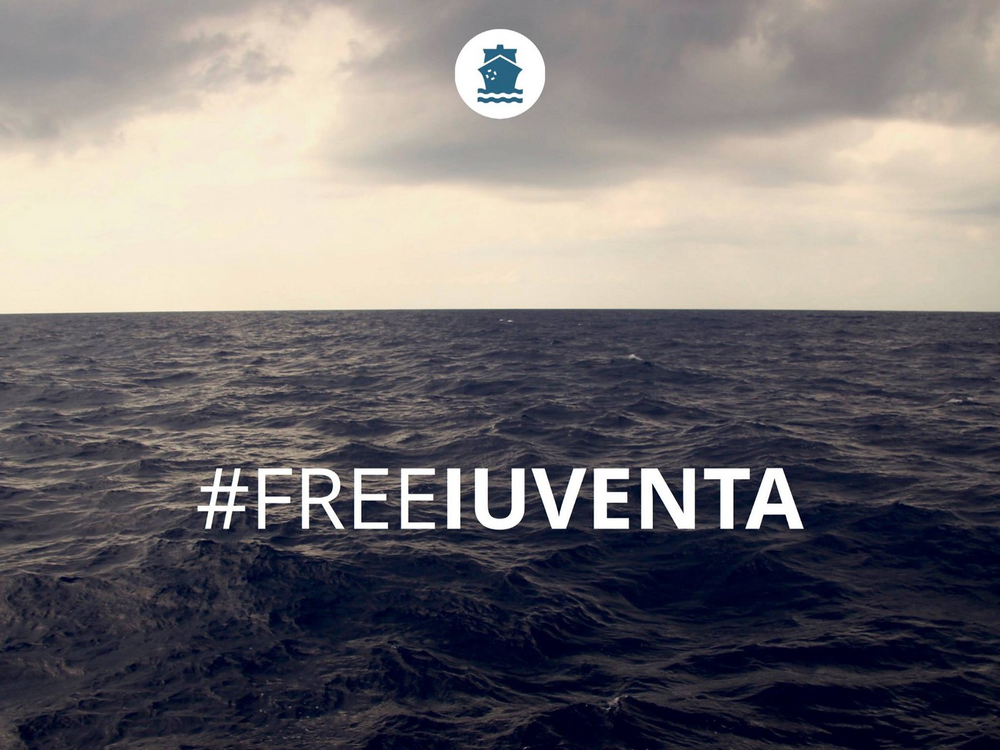
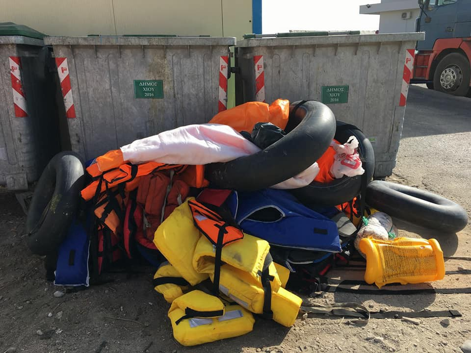
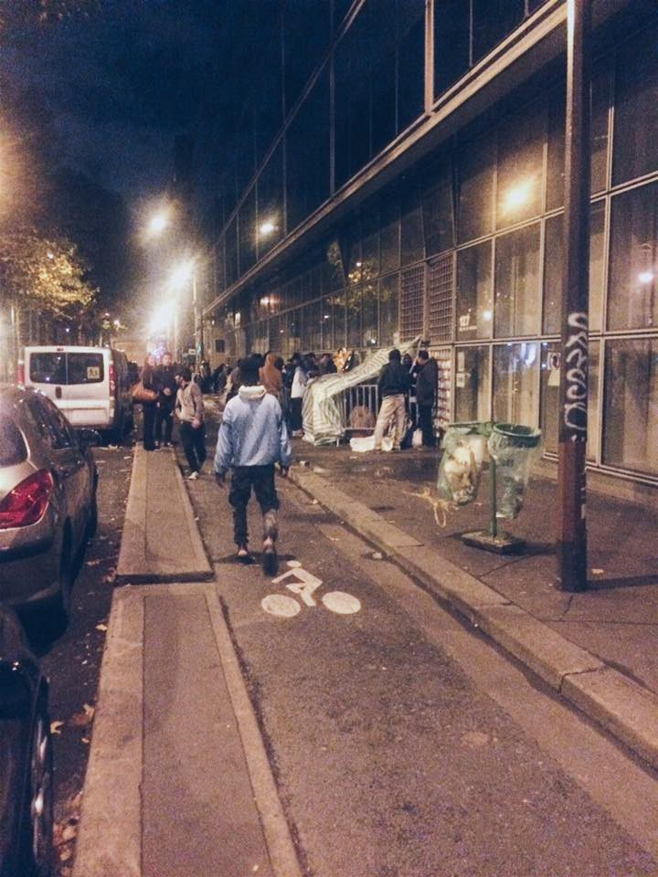
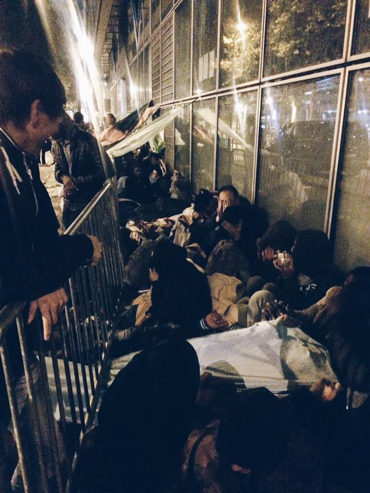
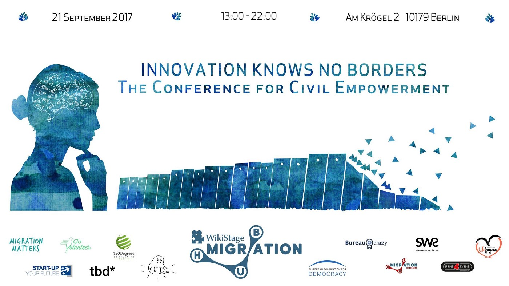
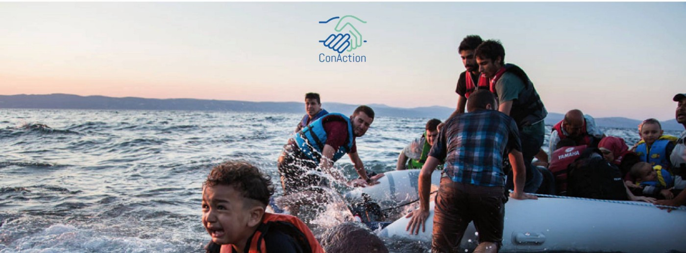

### AYS DAILY DIGEST 18/9/2017: What is the role of the UNHCR?

_Question for the UNHCR from volunteer in Lesvos // A comedy of errors // 250,985 people left their homes in Afghanistan this year due to conflict // Due to EU — Turkey deal hundreds of children out of school // At least 2000 people on the streets of Paris // Forced eviction of people in Fonts Camp // Case againts Jugend Rettet to start tomorrow —_ \#FreeIuventa

 \.](assets/5f23cadadbd3/1*h-s3iAac8LDt2Kj_gRCvDg.jpeg)

Photo [Vahida Ramujkić](https://www.facebook.com/nijedna) \.
### Feature

In today’s feature story, we bring you a letter from our friend [Philippa Kempson](https://m.facebook.com/story.php...) , the activist from Lesvos who is helping to people on this island for over two years, to the UNHCR\. She wrote the letter two weeks ago, but received no answer until today\.

Since the letter was written, more incidents like the one she describes happened\.

**_“After years of this crisis, still nobody takes responsibility for what can only be described as a comedy of errors, the blame game continues as the authorities and the UNHCR continue to blame each other for the short comings and failures that have occurred and cost lives\.”_**

UNHCR Office
Mytilene, Lesvos
4th September 2017

> Dear UNHCR
 

> Arrivals of refugees and the role of UNHCR 

> I am writing regarding the ways in which we might seek to improve collaboration between volunteers and UNHCR with regard to the landings of refugees on the shores of Lesvos\. This relates in particular, but not only, to an incident that occurred on Thursday 31st August, the details of which are set out in the appendix to this letter and also forwarded to the ombudsman of Greece along with video and photographic evidence\. 

> The incident, which involved the eventual hospitalization of a pregnant woman who had gone into labour, shows up some unfortunate examples of what is currently happening and which cause unnecessary distress to refugees and volunteers\. It is my belief that the UNHCR could do more to avoid such distress\. 

> I also wish to record my concern that the UNHCR appears to be taking part in the questioning of refugees on behalf of the port police, at the expense of fulfilling the primary role of your organization, to meet a duty of care to the refugees and to treat them with appropriate dignity and respect\. 

> The context for the volunteers is that these actions are taking place in a context of increased aggression from other parties on a daily basis, both when assisting at landing but also during a watch\. These incidents have been reported to the police and to the UNHCR and also discussed at meetings\. 

> The volunteers do their utmost to work with the UNHCR, providing goods, services, and transportation in the north\. 
 

> We have asked that the UNHCR representative includes in his reports the incidents that have taken place here\. 

> I, along with other volunteers, feel it would be beneficial to the UNHCR and to the volunteers if the role of the UNHCR at boat landings be properly defined\. Is the representative’s role to assist the port police in the questioning of refugees? Is it their role to follow the instructions of the port police, even when the protection of refugee rights is not being upheld? One of the main roles of the UNHCR as far as we have understood is to provide protection of refugees and their human rights\. We raised these questions and concerns privately several weeks ago with a member of the UNHCR on the island but now understand that those concerns were not passed on\. I would suggest that the same is required from the port police for similar reasons so we can all work professionally together for the safety and well\-being of all concerned\. 

> I understand that the role of the UNHCR is a complex one, especially as you are reliant on volunteer organizations for logistics and personnel but I really feel that to move forward clarification is needed\. 

> I would be grateful if UNHCR would urgently investigate this matter, to know how we might make progress, and I remain available to provide further information\. 

> Yours sincerely,
 

> Philippa Kempson 

### Afghanistan

The UN Office for the Coordination of Humanitarian Affairs issued a new report on the situation in Afghanistan showing that this country is not safe, as many EU politicians are claiming while deporting people back\.

According to the report, from the beginning of this year, until 16 September, 250,985 people have fled their homes due to the conflict in this country\.
### Italy

On Tuesday, September 19th, the first hearing against the [Jugend Rettet](https://www.facebook.com/JugendRettet/) group will start before the court in Trapani\.

Their boat IUVENTA has beed sized at the beginning of August, and they face accusations on their involvement in smugling\.

> **“For weeks we have been working on accusations, talking to other organizations, protesting\. Above all we want to state that we have nothing to hide\. As a organization we were deliberately confronted with baseless allegations\. We received death threats and were defamed in public by several different medias\. But the solidarity of supporters, organizations and projects strengthen our backs\. As a young generation, we will not be silent on how the suffering on the external borders grows\.** 

> **We want our IUVENTA back\! As a sign that you can change something as a young person\. As a protest for human dignity, which is ignored on the external borders of Europe\.”** 

We stand in solidarity\! \! \!
### Greece

Since the beginning of September — only 18 days — **over 3\.100 people arrived at islands** \. Only to Lesvos **today, officially 204 new arrivals** were registered\.

This morning the first boat arrived at Kataraktis, Chios, at 7 with 36 people on board, 11 children, 12 woman and 13 men\. The second boat arrived just half an hour later with 47 people, 22 children, 10 woman and 15 men\. People who arrived are from Syria, Iraq, and Palestine\.

To Samos, one boat arrived with 44 people on board\.

 \.](assets/5f23cadadbd3/1*hndxppuoWBBM0ywF14TvmQ.jpeg)

Photo by [Chios Estern Shore response Team](https://www.facebook.com/groups/421759534684819/permalink/686116691582434/) \.

[Volunteers from Lesvos](https://www.facebook.com/pikpalesvos/posts/1969409280001160) are reporting that most of the people arriving these days are from Syria\. So far in September, 40 boats arrived, with over 1700 people on board\.

_“Moria is overcrowded, with tents everywhere\. At Pikpa we are close to maximum capacity\. We are now hosting 100 people, including 15 families with 44 children\. Our waiting list is only growing\. Winter is around the corner\. What is next for all these people who have been stuck here in Lesvos for months on end, and for all the people arriving every day to an overcrowded Moria camp?”_

Two years after, and everything is the same\. [Human Rights Watch had to issue a report](https://www.hrw.org/news/2017/09/17/greece-no-school-many-asylum-seeking-kids) calling on the Education Ministry to insure that all the children, especially on islands, are in schools\.

_“Greece will extend a program that provides special Greek classes and integration support for non\-native speaking pupils to asylum\-seeking children on the islands\. But this program excludes children in the so\-called refugee hotspots and other reception facilities who cannot obtain the proof of address required to enroll in school\. To reach children in these facilities, the Education Ministry recently announced it would open afternoon classes at public schools on the islands… The new integration program and the afternoon classes will both exclude children over age 15, and a delay in providing vaccinations to asylum\-seeking children poses problems because vaccinations are required for school enrollment\. The ministry estimates that both programs will start in mid\-October\.”_

HRW calls the Ministry to extend the programs to make formal education accessible to all asylum\-seeking children of school\-age as soon as possible, including for children over 15\.

[Oasis Rhodes](https://www.facebook.com/groups/OasisRhodes/permalink/1808002869491477/) starts Greek lessons for the second year in a row\. First meeting for refugees and immigrants on Wednesday 20 September in cooperation with Aegean University in Rhodes\.
### Help is needed\!

[ELLINIKON WAREHOUSE IN ATHENS](https://m.facebook.com/groups/998272446971719?view=permalink&id=1198076663657962) urgently needs donations of:

FOOD; CLEANING SUPPLIES; BABY CARE, PERSONAL HYGIENE & PHARMACEUTICAL SUPPLIES; CLOTHING

They also need volunteers\. For a detailed list of supplies needed and more info, please visit their [FB page](https://www.facebook.com/groups/AthensVolunteersInformation/permalink/1203574646441497/) \.

[THE INFO MOBILE TEAM](https://www.facebook.com/mobileinfoteam/)

What to do if the correction in your white cars is needed?

_“If you have already had your full registration appointment \(“first interview”\), you can correct the details written on your asylum seeker’s card, such as your name, surname, date of birth or nationality\. In order to do so, you must go in person to a Regional Asylum Office and fill in an application to correct this information\. No one can go on your behalf\. You must bring any original documents certifying the correct data\. Such documents could be your passport or identity card from your home country, your family book, or your civil register\. You will be informed later if the corrections have been accepted\. In this case, a new card will be issued\. You can make this application at any Regional Asylum Office, it does not have to be the one where you had your full registration appointment_

_If you have not had your full registration appointment, you can change the data on your pre\-registration card when you go to your full registration appointment, as you will get a new asylum seeker’s card anyway\. Simply tell the Asylum Service staff which information on your pre\-registration card is incorrect and provide them with documents certifying the correct data\.”_

Our friend from the Outreach Service Athens are offering service for all the people living in apartments in this city\. They can help you by providing you with directions to many supplies and projects you might need\.

To offer you the best service, please answer the following questions in this form: [https://goo\.gl/forms/Ls8syFwuXSQnoadc2](https://goo.gl/forms/Ls8syFwuXSQnoadc2)

Please be aware that they are NOT able to deliver you supplies, but they will show you how you get them by yourself\.

For any questions contact them by WhatsApp: 0030 694 3535526

[Emergency Response Center International](https://www.facebook.com/ercintl/?hc_ref=ARSKKT0CglHHMqJYDVSNU4Yytmcw1wAgjdq9mUAb-mFnhjr5B1BHd14X3jFDDmzZGAk&fref=nf) urgently need translators for their clinics in Camp Moria and Kara Tepe camp on the Island of Lesvos\.

If you’re qualified and interested apply by emailing directly with the subject heading TRANSLATORS to [aid@ercintl\.org](mailto:aid@ercintl.org)
### Serbia

NGOs in Serbia are more often reporting about racist act and attitude by some people toward refugees and migrants who are stranded in this country\. People were not served or asked to leave some of the restaurants even in Belgrade, while in some cities registered asylum seekers, with legal permission to find their own accommodation, are being turned down by landlords\.

According to the NGO Crisis Response and Policy Centre, which mediates between landlords and asylum seekers, almost 90 percent of their calls are turned down\. This is happening despite the fact that only small number of people do apply for asylum in this country, and even smaller get it\.
### Croatia

Croatian Security Intelligence Agency SOA has published a yearly report on its activities\. The novelty is that this year a whole section is dedicated to asylum seekers, although there is no info on the negative opinions issued by SOA related to the existence of the so\-called ‘security obstacles’ that AYS and CMS have warned in the two reports on unlawful and arbitrary practices by SOA and MOI in these cases\.

In the TV news, the ex\-director of SOA Dragan Lozančić claimed that SOA does not decide on asylum, despite the fact that MOI has issued the negative decision for minimum 57 persons, including babies and people in wheelchair tortured by paramilitary groups\. These opinions by SOA are never explained and lawyers of asylum seekers do not have access to SOA files\. Also, he forgot to mention that the Administrative Court in Zagreb did not find any grounds for exclusion from an asylum in these cases\.
### Spain

According to the [InfoMigrant\.net](http://www.infomigrants.net/en/post/5129/pressure-increases-on-new-bilbao-england-migrant-route) , migrants are camping out near the port of Bilbao, on Spain’s northern coast, trying to try to hide on cargo ferries bound for Portsmouth, on England’s southern coast\.

One of the reasons, according to the Spanish police sources who spoke for this outlet, is the evacuation of French refugee camps in Calais\.
### France

Julie Bonnier, an Associate lawyer, wrote [an open letter to the President](https://www.facebook.com/terrederrance/?hc_ref=ARR6qCtuJkDpECqKPAjhwuI2r0Jsx_Xo49YXOOQ-ZTaV_tqtrq7GuMBiRFXiBg7jCqc) asking him to prevent the destruction of the camp\-Fonts Camp where 79 people are living, including 15 women and 11 minors\.

On Saturday they got 48 hours to evacuate the place\. On Monday morning the eviction started\. People refused to be evicted considering that the proposed measures were inadequate\.

They need massive support\. Please, consider what you can do and help\.

T [he Refugee Info Bus](https://www.facebook.com/RefugeeInfoBus/posts/2022434511325300) issued the new weekly update on the situation in Calais, showing again that evictions are still happening\. Describing the general situation in Calais, they noticed that more people are coming daily from Paris, while there is still 700–800 people sleeping on the streets and in the woods\.

> “There are growing fears that Macron’s statement that there will be no people sleeping in the streets or the woods by the end of the year does not mean that shelter will be provided, and instead that this policy will be achieved by people going into hiding\. It’s going to be a long, cold winter\.” 

Nevertheless, there is always the good side in everything\. Or at least, people tent to try to see it\.

“In Calais Centre\-Ville, local kids appear most evenings and play football with the boys under yet another striking Calais sunset\.”

 \.](assets/5f23cadadbd3/1*wM4RFDWAlww77hEjGgyyhQ.jpeg)

Photo by the [Refuge Info Bus](https://www.facebook.com/RefugeeInfoBus/posts/2022434511325300) \.

Needs in Paris are still growing, with more and more people on the streets\. According to estimates by the volunteers in the field, between 1500 and 2000 people\.

From the night joint distribution\. Solidarithé and PRGS\.

> “We assisted Solidarithés evening tea and info distribution\. This was the length of the line before one cup of tea had been served\. Shortly after we began, the meal distribution vans arrived and the numbers quickly swelled\. There were 3 separate vehicles distributing at the same time, they could barely keep up with the need\. It’s astounding just how many people there really are\.
 

> We checked out the other areas where refugees often frequent to try and estimate the numbers\. Sadly there are hundreds of people all over, scattered in pockets here and there\. 

> Here also there were small distributions of food and hot tea\. 
 

> It’s impossible to know exactly how many people there really are\.” 

Reporter report from the night of September 18–19 FTDA, Metro Jaures

“Around 300 peple sleeps in this area\. They Are waiting\. For their appointment at FTDA\. Or they simply have nowhere else to go\. Unusual presence of women in this site\. I have seen quite a few tonight\. There are just a few tents in proximity, but many are sleeping there, on the cartons, thrown things, covered with blankets or rarely — in sleeping bags… People are scared, they are left in cold, they are freezing\. I was giving thermal socks without a single doubt how much they are needed — it was so obvious\- the temperatures are too low and they are all poorly clothes for the weather\.”

[Urgent plea for donations](https://www.facebook.com/permalink.php?story_fbid=1911009959225634&id=100009499466124) \(for detailed list see the link\)

\* \* \* \* \* \* \*Most urgent items \* \* \* \* \* \* \*

SLEEPING BAGS

BLANKETS

SHOES sizes 41–45

FOOD

Photo by Danika Jurisic\.
### General

Two interesting events are coming up in Berlin\.

On 21 September, [Migration Hub Network](http://migrationhub.wikistage.org) is joining forces with [WikiStage](http://www.wikistage.org/debates/sharing-economy/) for the full\-day event ‘ [Innovation knows no Borders](https://www.facebook.com/events/682235791961646/) ’\.

Innovation knows no Borders consists of a series of 15\-minute talks given by a diverse group of international speakers\. Besides the talks, there will be art, live music, interactive and innovative booths, street\-food and an after\-party\.

Soon, in Berlin, the first conference organized by the [ConAction](https://www.facebook.com/pg/ConActionConference/about/?ref=page_internal) will take place\.

It is a project by volunteers from Berlin, who have been involved in helping refugees in Greece, Turkey, and Germany\. Their aim is to establish a constructive and helpful connection between the refugee\-volunteer community of Europe\.

> **_We strive to echo correct news from the ground, through collaboration and fairness, so let us know if something you read here is not right\._** 

> **_Anything you want to share — contact us on Facebook or write to: areyousyrious@gmail\.com_** 

_Converted [Medium Post](https://areyousyrious.medium.com/ays-daily-digest-18-9-2017-what-is-the-role-of-the-unhcr-5f23cadadbd3) by [ZMediumToMarkdown](https://github.com/ZhgChgLi/ZMediumToMarkdown)._
