### AYS Daily Digest 19/09/17: Court rules family reunification time limits must be respected
#### _German court rules on family reunification time limits / Difficult conditions persist on Lesvos / Volunteering opportunities in Greece / Police clear France’s Puythouck camp / Organizations from across Europe call for donations and help_

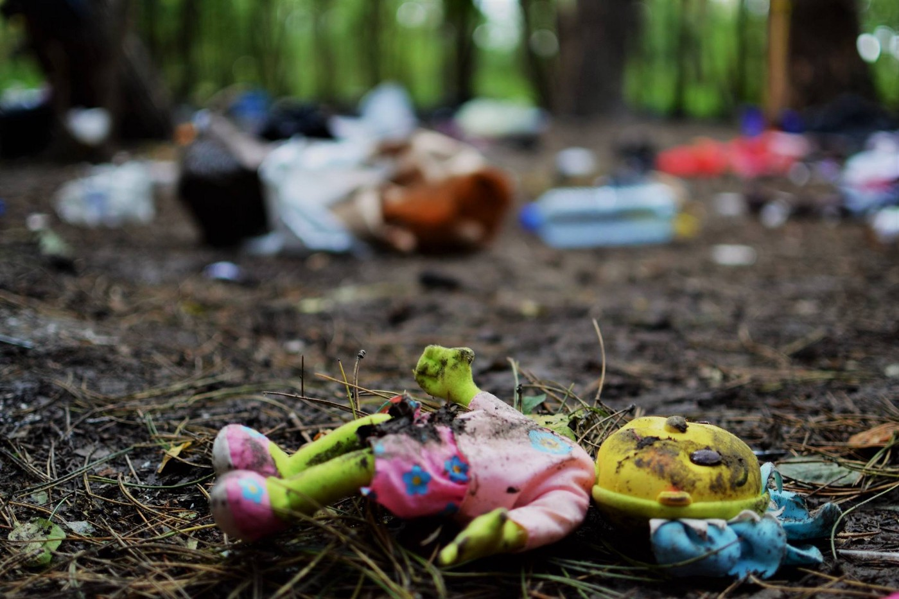

Dunkirk \(Photo by Aktion Weitblick\)
### FEATURE: German court rules on Dublin\-defined family reunification

An immediate end to the limitation of Dublin transfers in the case of family reunifications from Greece to Germany—something many had hoped for—will finally come to pass\.

The right to Dublin\-defined family reunification during the defined 6 months period must be respected, a German court has ruled\.

■■■■■■■■■■■■■■ 
> **[ECRE](https://twitter.com/ecre) @ Twitter Says:** 

> > #GER Administrative Court: @[BAMF_Dialog](https://twitter.com/BAMF_Dialog) obliged to respect family reunification time limits. 🇩🇪🇬🇷 cap unlawful  [bit.ly/2w4Xmhj](http://bit.ly/2w4Xmhj) https://t.co/zABQn2jRAv 

> **Tweeted at [2017-09-19 15:45:57](https://twitter.com/ecre/status/910168092176723968).** 

■■■■■■■■■■■■■■ 

This year, in April 2017, the German Interior Ministry drastically limited the number of family reunification transfers from Greece to Germany\. This number is now limited to 70 people per month, which has resulted in long and ever\-increasing waiting times for many applicants who have already been approved\. Due to this agreement, grandparents, fathers, mothers, and children have been waiting to join each other for years\.

At the end of May, T [he Mobile Info Team](https://www.facebook.com/mobileinfoteam/) initiated [the petition](https://mobileinfoteam.blogspot.gr/2017/05/sign-this-petition-to-support-refugees.html) against this decision which has been signed by over 25,000 people so far\. Unfortunately, not much has changed since then\.

The German Interior Ministry, which is responsible for the restriction, justifies this policy by pointing to the logistic problems and claiming there are not enough reception places to host additional people\. However, according to the Mobile Info Team, reception centers in Germany are half\-empty and the country can handle around 800,000 people\.

**“The right to family unity has to be respected\. Families should be able to care for each other in times of illness and to be together in times of grief,”** 
ProAsyl, Germany’s largest refugee support organization, said earlier\.

Prosyl also called for the respect of the best interest of the child during family reunion and the possibility for underage siblings of minors living in Germany to join their parents and be transferred together\. With the legal support they’ve received, these demands are closer to becoming practice\.

The number of 70 people per month who are accepted to enter Germany from Greece on the basis of family reunification is a result of a bilateral agreement and is not aligned with any EU legislative\. This ruling on the individual case is important because it challenges the legality of the entire practice and sets up a strong basis for other future legal battles\.

Even today, people who are waiting for the relocation, protested in the front of the Germany embassy in Athens\.

■■■■■■■■■■■■■■ 
> **[City Plaza Squat](https://twitter.com/sol2refugees) @ Twitter Says:** 

> > Now in #Greek asylum offices &amp; #Dublin offices. 
 
#Refugees in protest against limitation of the family reunification. #refugeesgr #greece https://t.co/D62AUkEudS 

> **Tweeted at [2017-09-19 09:14:00](https://twitter.com/sol2refugees/status/910069453274181632).** 

■■■■■■■■■■■■■■ 

On several occasions, we wrote about this problem and how some of the families are affected by it\. \(See our specials [Syrian Princess Trapped in Greece](ays-special-syrian-princess-trapped-in-greece-81944118a9b0) , [Slow reunification process leaves families separated for a long time](slow-reunification-process-leaves-family-separated-for-a-long-time-185e5835e73d) or [Meet Mohammed, one father struggling to reunite his family](ays-special-meet-mohammed-one-father-struggling-to-reunite-his-family-863de6885f40) \)
#### LIBYA

The Libyan Coast Guard’s interception of 816 people last weekend in Al\-Zawya again shows that aid agencies are prevented from getting the systematic access they seek and need\.

> According to the MSF, no one seems to know where in Libya these intercepted and returned Syrian families are now\. 

#### SEA

■■■■■■■■■■■■■■ 
> **[IOM - UN Migration 🇺🇳](https://twitter.com/UNmigration) @ Twitter Says:** 

> > Breaking: 131,772 #migrants &amp; #refugees arrived by sea to Europe. 2,556 dead/missing ➡️ [missingmigrants.iom.int](http://missingmigrants.iom.int) https://t.co/KARiRAUtM8 

> **Tweeted at [2017-09-19 07:09:53](https://twitter.com/unmigration/status/910038216484507653).** 

■■■■■■■■■■■■■■ 

■■■■■■■■■■■■■■ 
> **[SARwatchMED](https://twitter.com/SARwatchMED) @ Twitter Says:** 

> > #TurkishCoastGuard: a further 129 people, mainly Syrians and Afghans, were intercepted in the #AegeanSea over the weekend. https://t.co/kDSyZa1tUD 

> **Tweeted at [2017-09-18 21:28:59](https://twitter.com/sarwatchmed/status/909892030024884225).** 

■■■■■■■■■■■■■■ 

#### GREECE
### Latest arrivals

144 people were officially registered today: 85 on Chios, 45 on
Samos, 12 on Kos and 4 on other Aegean islands\.
46 people arrived in a boat to Samos today\.
### Borderline explosive situation in Lesvos

With more than 6,000 people in the facilities on the island, a steady increase in arrivals and poor politics regarding relocation and care for the people stranded on the island, the mayor of Lesvos wrote an open letter to minister Mouzalas and European Migration Affairs Commissioner Avramopoulos\.

> “The avoidance of measures until conditions worsen to such an extent that we have another crisis on our hands cannot be tolerated, under any circumstances, by the local community,” _the letter says, among other things\._ 

■■■■■■■■■■■■■■ 
> **[Choose Love](https://twitter.com/chooselove) @ Twitter Says:** 

> > In the past 2 weeks, roughly 1,200 people have arrived on Lesvos. We estimate 7-7,500 refugees are now stranded here. 

> **Tweeted at [2017-09-19 15:02:00](https://twitter.com/helprefugeesuk/status/910157031629250560).** 

■■■■■■■■■■■■■■ 

Concerns are peaking again about the situation on the islands of the eastern Aegean, as some 2,300 undocumented migrants have arrived from neighboring Turkey in the past two weeks alone, Greek media [report](http://www.ekathimerini.com/221767/article/ekathimerini/news/renewed-influx-of-migrants-to-islands-a-concern?fref=gc&dti=1652972374920129) \.

“ This is Stage 2 UNHCR Camp on Lesvos, Greece on Sunday\. There’s been an influx of arrivals the last few days\. We have had mostly children and their parents, many from Syria\. At one point we were looking after and cooking for more than 80 people\.” \(Photo: Refugee 4 Refugees\)

Meanwhile the rate of returns to Turkey of migrants whose asylum applications have been rejected is very slow, largely because many of them appeal against rejections in a bid to postpone their deportation, Ekathimerini [reports](http://www.ekathimerini.com/221767/article/ekathimerini/news/renewed-influx-of-migrants-to-islands-a-concern?fref=gc&dti=1652972374920129) \.

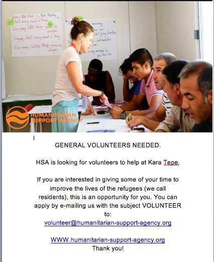

### Rhodes

■■■■■■■■■■■■■■ 
> **[RSA](https://twitter.com/rspaegean) @ Twitter Says:** 

> > Video: 120 refugees and migrant, including children detained in space for 40 at Rhodes police station [rodiaki.gr/article/373902…](http://www.rodiaki.gr/article/373902/binteo-eikones-ntrophs-sto-astynomiko-tmhma-rodoy-mwra-petamena-sto-patwma-kai-goneis-se-apognwsh#.WcFnsbpxriU.twitter) 

> **Tweeted at [2017-09-19 18:56:31](https://twitter.com/rspaegean/status/910216046820380673).** 

■■■■■■■■■■■■■■ 

### Samos

 \)](assets/520fadd439f2/1*rS08rX3Y5NmNpianS_Q_vQ.jpeg)

With over 700 new arrivals so far in September, the camp is becoming more crowded, with families cramming into pop up tents outside the camps fences\. Samos volunteers need more volunteers on the island\! \(Photo: [Samos Volunteers](https://www.facebook.com/samosvolunteers/) \)
### Chios

> “While Souda Camp has never been a humane or suitable living environment for people, we are concerned that the remote location of Vial and a lack of sufficient transport provision will increase the isolation of displaced people and the detrimental impact of that, and limit residents’ ability to access necessary support services; educational, medical, legal, psychosocial, and activity\-based services available in Chios Town\. The closure of _any_ camp is only a positive step if living conditions and facilities are improved as a result and that is yet to be seen”, _says [Dråpen i Havet](https://www.facebook.com/drapenihavet/?hc_ref=ARRkijphh73fntbP6SNSMhnq_uVJR0iWorUu22KFMI4lnW4wRiHHl5G0nuk_9zkdXnk&fref=nf) Head of Operations_ 

About a hundred people was transferred from Souda by buses today\.

](assets/520fadd439f2/1*3XMcB_9ScBGysPAlwg3nwA.jpeg)

Photo: [Muhamed Albakur](https://www.facebook.com/muhamed.albakur.5)

Transfers from islands to mainland remain high\. On 17\.9 less than 13\.000 people were accomodated on the islands\. Due to the the new arrivals two days ago it was slightly more yesterday\.
### Volunteering

Advocates Abroad is currently actively recruiting volunteers for their field missions in Greece for the fall and winter period\. For questions, more information and applications \(CV and short letter of interest\): volunteer@advocatesabroad\.org and [www\.advocatesabroad\.org](https://l.facebook.com/l.php?u=http%3A%2F%2Fwww.advocatesabroad.org%2F&h=ATORkMgnB_0fldkYgibbMSABLXjR-VZEt5CMTF82gKYYAxhYXnG3aC3_XEDgN2O2uC_ZsRp9Hm2m6Qp0fjAte8gUMrg8Mo9vLEkvmFNoKoxcwxAZeHAzKdr7wDq21qMcB-TgNn_9Uw)

\_ \_ \_

“At the moment, we will not accept new volunteers to Chios, but this may change in the near future\. Instead, we would encourage people to **sign up for Nea Kavala camp in Northern Greece, or Skaramagas camp near Athens\.** 
Both are currently in need of volunteers\.” — [Dråpen i Havet](https://www.facebook.com/drapenihavet/?hc_ref=ARRkijphh73fntbP6SNSMhnq_uVJR0iWorUu22KFMI4lnW4wRiHHl5G0nuk_9zkdXnk&fref=nf)

\_ \_ \_

[InterVolve](https://www.facebook.com/InterVolve-219418945063168/) team started offering **weekend conversational English** at their women’s space, The Pink House, at Koutsochero camp\.
The lessons are an initiative of volunteers, in collaboration with some of the camp residents who are proficient in English and who will be able to offer peer support and learning in this space\.
**If you want to offer your skills with us and are available for a minimum of three weeks, apply to volunteer** [**here**](https://intervolvegr.com/help/volunteer/) \.

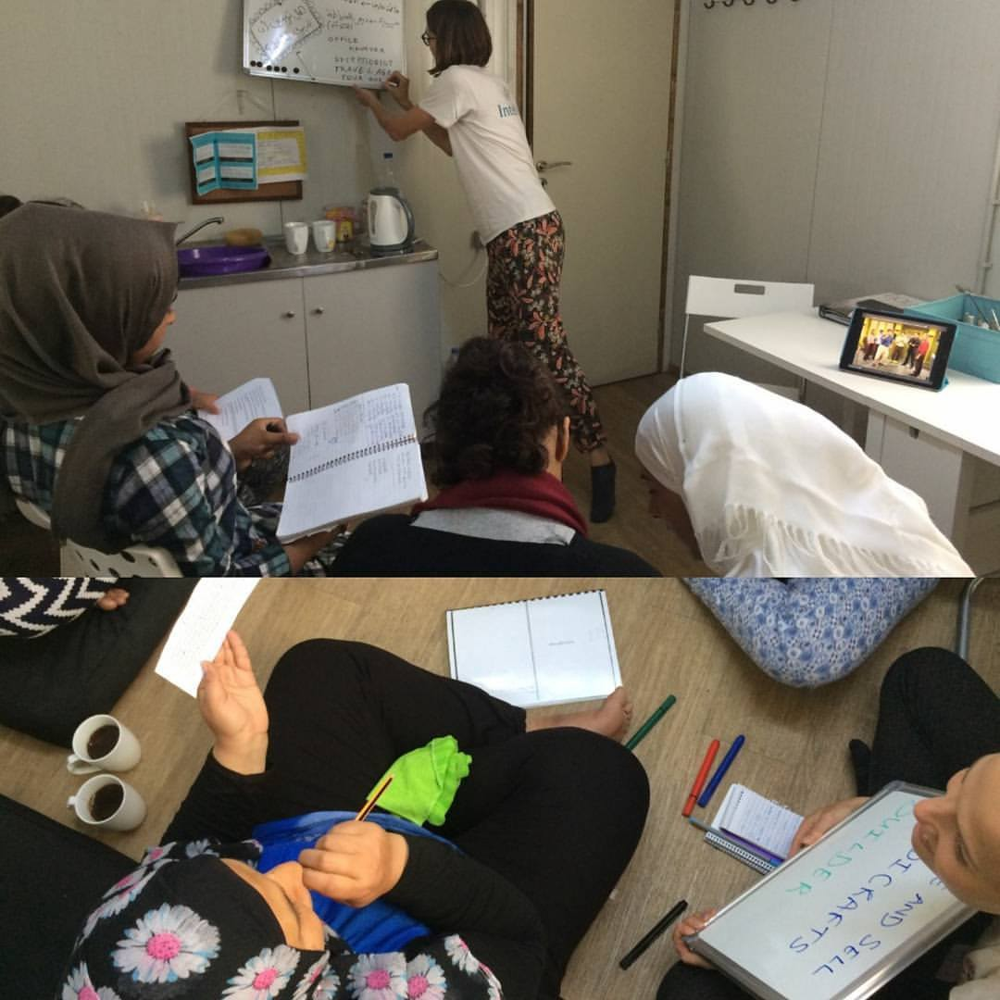

Photo: InterVolve
### Athens

[Mosaico House](https://www.facebook.com/helpfromgreece/?ref=gs&hc_ref=ARTYofm-Dt0CWyIxOd0obBUb-WkCud8KjYADHhMw1hZeFcKdi8rNg1cu2qMb8cpTsB4&fref=gs&hc_location=group) are looking for Greek speakers to help children with their homework\. The team wants to start a homework club several days per week\. 
If you are interested or you know someone who could be, contact them\!
### Language classes in Egaleo

Organization Earth is currently running Online Language Classes for Refugees and Asylum Seekers in a computer lab in Egaleo\. 
Basic level of English language is required\.

[**OLS sessions**](https://www.facebook.com/events/289641164849063/?fref=gc&dti=1652972374920129&hc_location=ufi) **from Tuesday to Friday:** 
**12:00–14:00** 
**15:00–17:00** 
**To register and have more informations : leonie@organizationearth\.org**
### Ellinikon warehouse needs list

> If you are thinking about donations for Greece, please try to include the items on this list, because they usually run out quickly in the central warehouse\. For many of the items on this list, it is better to buy locally \(to help the economy\) and also address the immediate needs\. Containers sometimes arrive far too late and the warehouse ends up having to store items for long periods\. 

> _FOOD:_ 
 

> _Milk_ 
 

> _Tea_ 
 

> _Instant coffee_ 
 

> _Sugar_ 
 

> _Oil_ 
 

> _Biscuits_ 
 

> _Couscus/Bulgur_ 
 

> _Tahini_ 
 

> _Single juices_ 
 

> _Juice_ 
 

> _Tuna_ 
 

> _Sardines_ 
 

> _Flour_ 
 

> _Tomato Sauce_ 
 

> _Spices and condiments_ 
 

> _canned vegetables,_ 
 

> _breakfast things\._ 
 

> _pulses \( legumes \) — lentils, chickpeas and white beans_ 

> _CLEANING:_ 
 

> _Clothes detergent_ 
 

> _Dishwashing liquid_ 
 

> _All purpose\-liquid cleaner_ 
 

> _Chlorine_ 
 

> _Cleaning tools: mops, brooms, sponges_ 
 

> _Plastic trash bags \(big size\)_ 

> _BABY CARE:_ 
 

> _Pushchairs / strollers_ 
 

> _Wipes_ 
 

> _Diapers \(specially n1, n5 and n6\)_ 
 

> _Baby formula 1, 2, 3_ 
 

> _All kind of baby care hygiene products_ 

> _PERSONAL HYGIENE:_ 
 

> _Shaving foam_ 
 

> _shampoo_ 
 

> _deodorant_ 
 

> _adult incontinence diapers_ 

> _PHARMACY:_ 
 

> _Mosquito repellent_ 
 

> _Mosquito bite relief cream_ 
 

> _Lice lotion_ 
 

> _Permetrine 5% \(scabies treatment\)_ 

> _CLOTHING_ 
 

> _New underwear: adults and children \(all sizes\)_ 
 

> _shoes \(specifically trainers and other sports shoes\)_ 
 

> _boots for winter months \(but no HEAVY WINTER BOOTS OR GALOSHES\)_ 
 

> _Jeans for men and women \(all sizes\)_ 
 

> _Long sleeve t\-shirts \(all sizes\)_ 
 

> _Leggings for girls and women_ 
 

> _\*Women clothes should be long sleeved in all cases\._ 

> _OTHERS:_ 
 

> _Suitcases medium/big size in good condition \(people are being relocated to other countries and need suitcases to carry their belongings\)_ 

Please include only items listed here and mind the time for a container to reach Athens\. 
Address:

> _For the attention of: Sotiris Alexopoulos_ 
 

> _Old Athens Airport,_ 
 

> _Elliniko, basketball stadium,_ 
 

> _Pampiraiki warehouse_ 
 

> _\(Olympic airways entrance on the coastal road\)_ 
 

> _26 Posidonos Avenue,_ 
 

> _16 777, Greece_ 

Pampiraiki group also need long\-term and short\-term volunteers to help with the sorting and distribution of donations\. Please email and register at Pampiraiki@gmail\.com if you are able to help\. Further the information can be found [here](https://www.facebook.com/groups/AthensVolunteersInformation/permalink/1198076663657962/)
#### ROMANIA
### A new route?

Last week, a small boat carrying 157 migrants from Iraq and Iran was found off the Romanian coast\. The coast guard also intercepted a boat with 97 migrants, including 36 children\. Another fishing boat carrying 87 migrants was also discovered on September 3\.
The influx has ignited fears that Turkish smugglers are opening up a new route for illegal entry into the European Union, media [report](https://www.neweurope.eu/article/romania-braces-migrant-influx/) \.
 2,800 migrants were caught trying to illegally enter the country since the start of this year\. This is an increase of 1,624 compared to the whole of 2016\.
#### BULGARIA
### Language lessons

Fabrika Avtonomia invites to the [free Bulgarian lessons](https://www.facebook.com/events/305578923181169/?acontext=%7B%22ref%22%3A%224%22%2C%22feed_story_type%22%3A%22308%22%2C%22action_history%22%3A%22null%22%7D) \. 
Every Saturday from 4 to 6 р\.m\.
Every migrant is welcome, regardless of their origin, or native language
#### ITALY
### Jugend Rettet demands Italy release seized rescue boat

■■■■■■■■■■■■■■ 
> **[Ruben Neugebauer](https://twitter.com/RubenNeugebauer) @ Twitter Says:** 

> > Today, the hearing in the case of @[jugendrettet](https://twitter.com/jugendrettet) takes place in Trapani. We need the #IUVENTA back! my statement:  [goo.gl/9y4PNg](http://goo.gl/9y4PNg) https://t.co/GaaZ74a9Zo 

> **Tweeted at [2017-09-19 09:18:48](https://twitter.com/rubenneugebauer/status/910070662139609088).** 

■■■■■■■■■■■■■■ 

Today, hearing in the case against Jugend Rettet started in the court in Italy\. This is just one of the many letters of support for this group:

> Without [Jugend Rettet E\.V\.](https://www.facebook.com/JugendRettet/) , people would probably be dead now\. We cried with joy when we saw the red\-Orange Speedboat coming out of the air\. At the moment, the [\#iuventa](https://www.facebook.com/hashtag/iuventa?source=feed_text) cannot save because it is being held on the basis of spurious and false accusations in trapani\. Tomorrow is the hearing\! On 29\. August, the iom reported no fatalities for 3 weeks, on August 30\., the only survivor of a boat reported, which is swimming \( \! \) \. \) reached the beach in Tunisia, from 120 people left with him\. In the past few days, thousands of people have been in distress\. We need the iuventa back\. Right now, everything else is an omission\! — [_Horst Müller_](https://www.facebook.com/horst.muller.7?hc_ref=ARS5876n8CsUa3yfNVeR1IVlohZwTDGkiMZOIOG73pSy9r5lxCXfJv_v2RhTDupMTGc) 

■■■■■■■■■■■■■■ 
> **[Jugend RETTET - IUVENTA](https://twitter.com/jugendrettet) @ Twitter Says:** 

> > Meanwhile we still receive support pics, which we are grateful for! Like these from #London. Thanks to all supporters! #togetherforrescue https://t.co/lhqbqIwKv0 

> **Tweeted at [2017-09-19 16:25:02](https://twitter.com/jugendrettet/status/910177927899369474).** 

■■■■■■■■■■■■■■ 

■■■■■■■■■■■■■■ 
> **[SARwatchMED](https://twitter.com/SARwatchMED) @ Twitter Says:** 

> > 2605 arrivals at Italian ports in the last 5 days (Sept. 14/18) acc. to @[Refugees](https://twitter.com/Refugees) Operational Portal [data2.unhcr.org/en/situations/…](http://data2.unhcr.org/en/situations/mediterranean/location/5205) #Mediterranean https://t.co/QWnPT2gYvZ 

> **Tweeted at [2017-09-19 10:28:05](https://twitter.com/sarwatchmed/status/910088095978139648).** 

■■■■■■■■■■■■■■ 

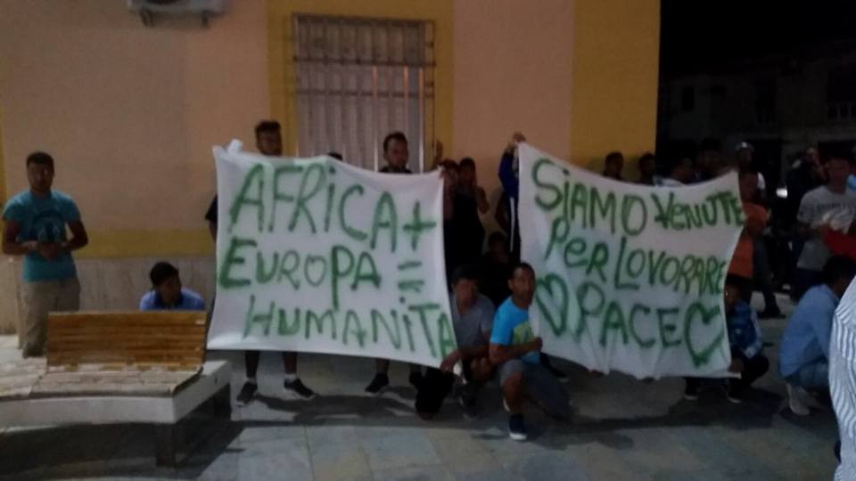

 \)](assets/520fadd439f2/1*P3YuJv0dxxysuzSuX5AeBw.jpeg)

Tunisian migrants staying at the hotspot in Lampedusa marched and protested peacefully \(Photo: [Mediterranean hope](https://www.facebook.com/Mediterranean-hope-252231521632595/) \)
### Pordenone

Around 50 people are staying in this place, sleeping rough, not having been welcome otherwise in the city\.

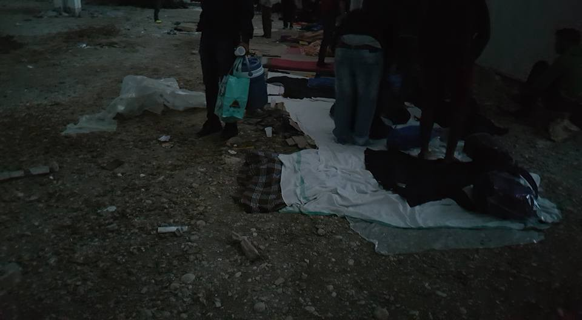

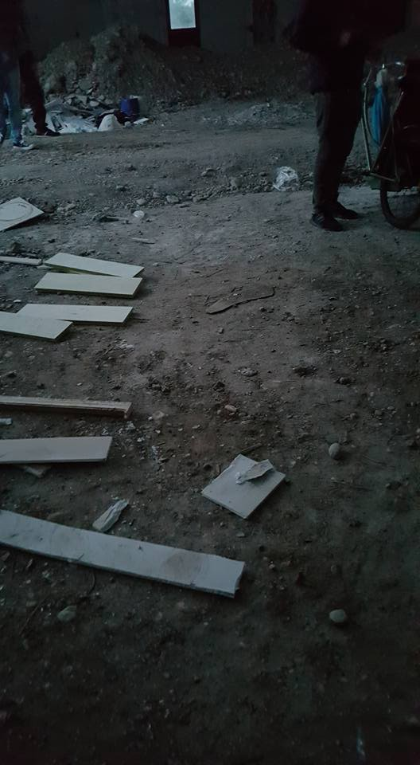

Photo: local activists
#### FRANCE
### Evacuation in Grande\-Synthe

In the early hours of this morning, police operation is underway at the Puythouck camp, where between 400 and 420 migrants have lived since the fire at the Linière camp in April\. French authorities and police forcibly evicted the settlement at Grande\-Synthe in the Dunkirk area\.

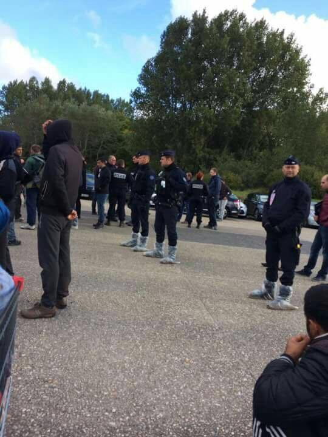

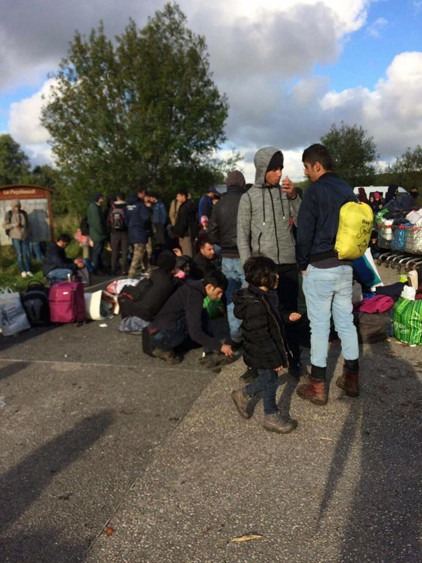

](assets/520fadd439f2/1*du8m2KngJszrRd3bW4vt5g.jpeg)

Photos: [**Care4Calais**](https://www.facebook.com/care4calais/)

The entire camp was cleared and the refugees living there were put onto buses to be taken to accommodation centres \(CAOs\) in 10 different regions around the country\.

> “At the last count there were 56 children present and around 40 women\. I can’t let this situation go on anymore,” _the mayor [said](https://www.thelocal.fr/20170919/france-clears-hundreds-of-migrants-from-wood-near-calais) on Monday before the operation\._ 

After several weeks of “peace”, the camp was heavily built up and developed, making the sudden eviction all the more devastating, the volunteers say\.

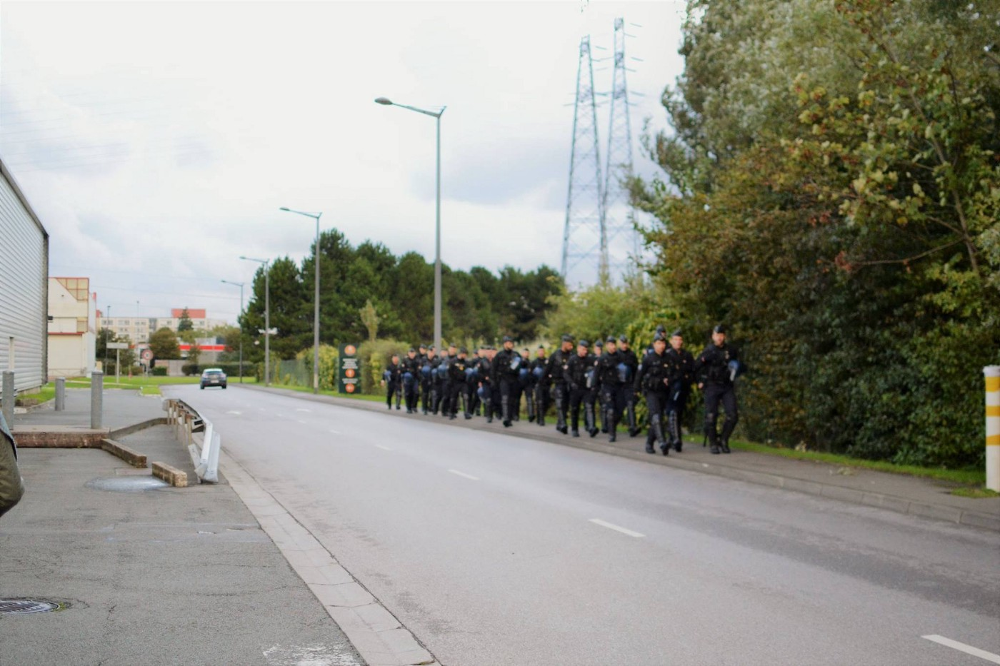

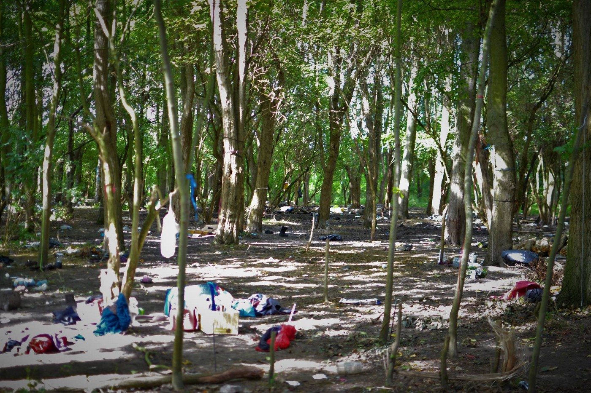

Photo: Aktion Weitblick

> We and the [Dunkirk / Dunkerque Refugee Women’s Centre](https://www.facebook.com/refugeewomenscentre/?fref=mentions) have made contact with several families and individuals, however, hundreds are still unaccounted for\.
 

> Tonight as people already begin to return, many will be sleeping rough\.
 

> They now need your and our help more than ever\.” — [Mobile Refugee Support](https://www.facebook.com/MobileRefugeeSupport/?hc_ref=ARS_gWB9ZGf_-JuevcLqimB2MnKr8iHxFlpQ0kMO4akrbaEdJRM1YkO2q7Jpp5ZxLNQ) 

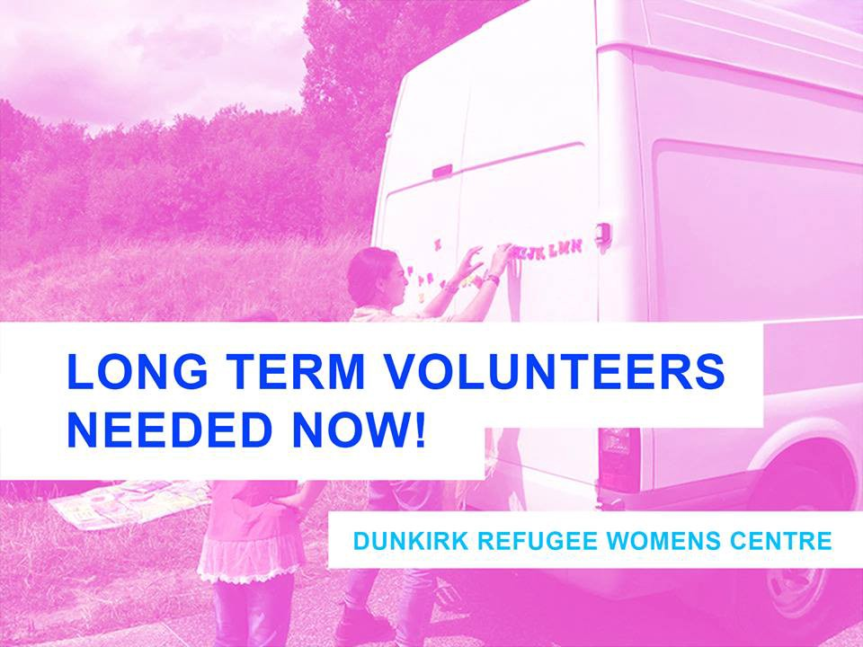

**_We strive to echo correct news from the ground through collaboration and fairness, so let us know if something you read here isn’t right\._**

**_If there’s anything you want to share, contact us on Facebook or write to: areyousyrious@gmail\.com\._**

_Converted [Medium Post](https://areyousyrious.medium.com/ays-daily-digest-19-9-17-court-rules-family-reunification-time-limits-must-be-respected-520fadd439f2) by [ZMediumToMarkdown](https://github.com/ZhgChgLi/ZMediumToMarkdown)._
