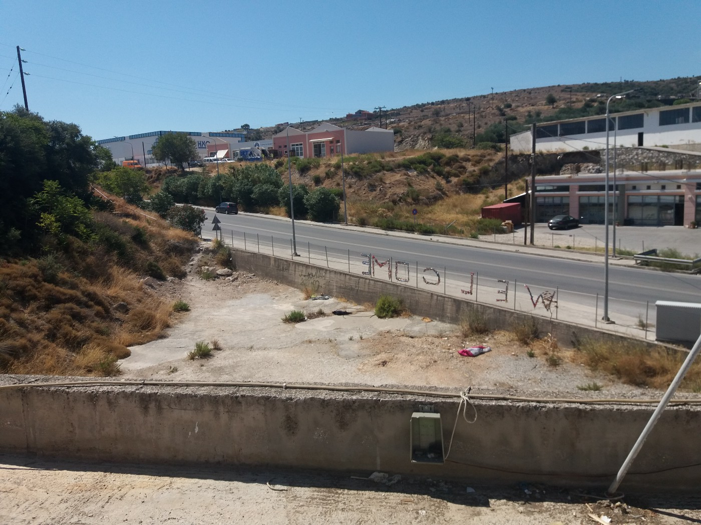
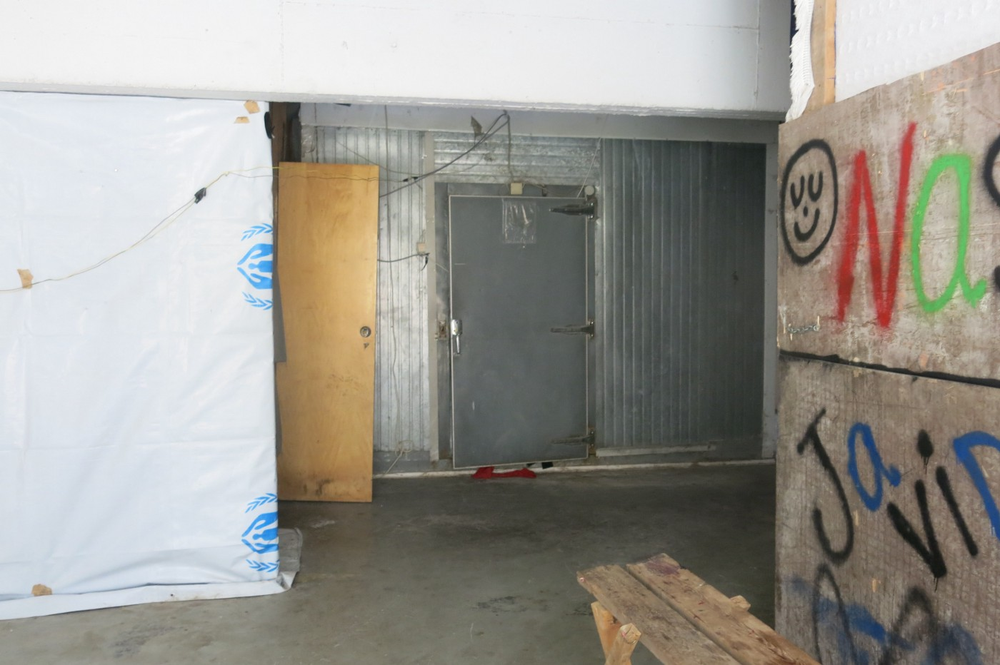
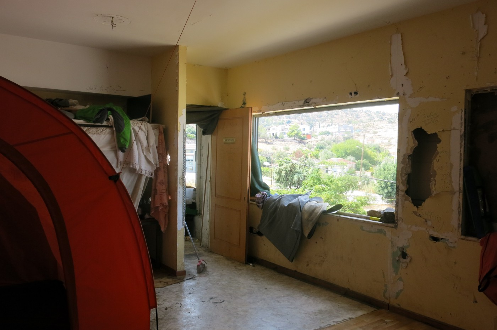
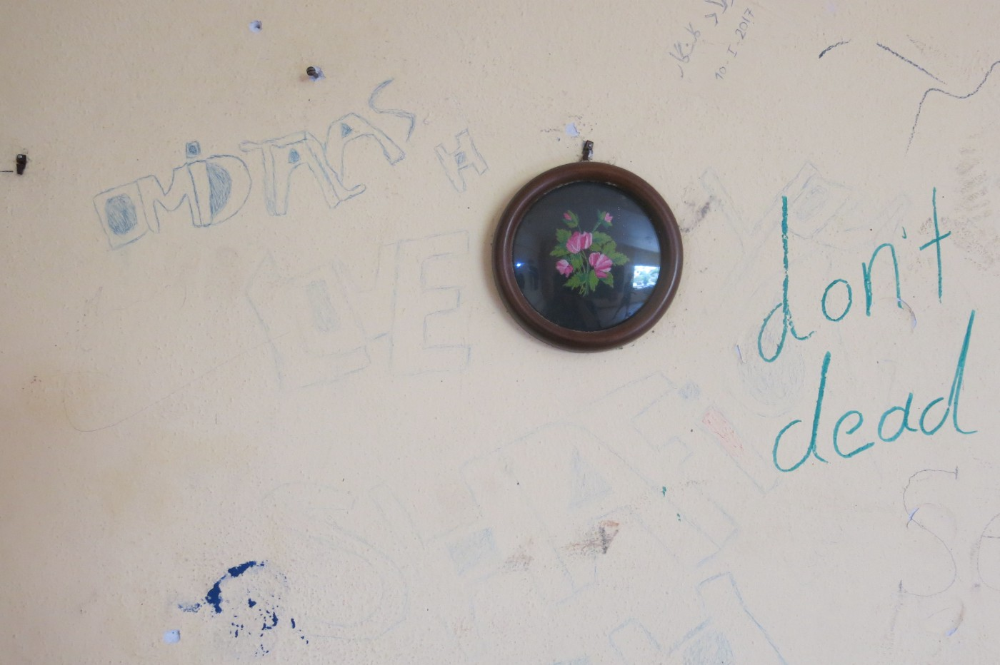
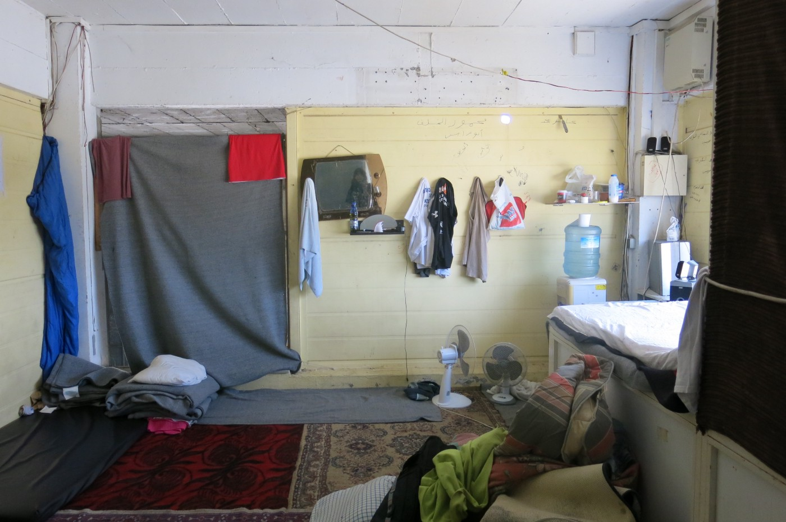
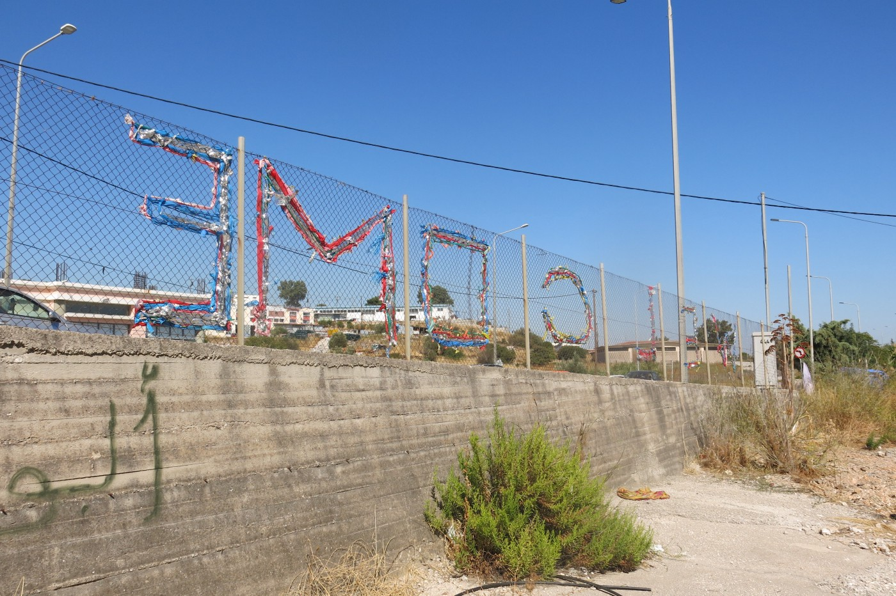

### AYS SPECIAL: Out of Mytilini

_A group of activists from Serbia recently visited Greece and Lesvos, meeting with people who are working with refugees there and staying in one of the squats where groups of people live in extremely precarious conditions\._

In the late evening of my sixth day spent living in a former No Border Kitchen refugee squat, situated on the road out of Mytilini, a pick\-up car enters the courtyard\. A corpulent man, accompanied by a younger one, equally corpulent, parks and they come out, while the woman who is with them stays in the car to observe the situation\.

As the man starts shouting in Greek, a small group of refugees, residents of the squat, gather around him\. Approaching the group, I understand only that the man is very angry, as he keeps raising his voice and shouting in Greek, which none of us can understand\.

After a good five or ten minutes of the unsettling atmosphere created by the total failure of all attempts to communicate, one of the Afghan refugees with a little English comes up with the idea of calling a Greek person who can speak English and who can translate\. The angry man is gone for the moment \(we understand later to wait for the police and another farmer\), so the Afghan hands the phone to the woman in the car\. She gives a long explanation in Greek, and then the phone is handed to me\. A ‘translator’ on the phone, whom I happen to know as he is one of the local volunteers, explains finally what all the fuss is about\. One of the goats from the family’s herd had disappeared that day and they were convinced that at that very moment it was being cooked in our squat\.

After some time, the farmer comes back with his friend and a police car arrives and parks on the opposite side of the road\. Now the farmer’s friend, speaking good English, assumes the role of negotiator and starts hurling accusations at a group of refugees, saying they are all thieves, and demanding that we go to the squat and bring out the delinquents\. I assert that I have spent all day around the place and that I haven’t seen any goat or anyone doing any major cooking\. We invite them to come inside and see for themselves but are not taken up on our offer since they actually seem to be afraid to enter the building\. Soon we notice that the police car, from which during all this time no\-one has came out, has vanished and after some more discussion the farmers get in their cars and leave as well, still convinced that their goat is being cooked in the squat\.
#### Prison zone

Nowadays Lesvos, one of most beautiful tourist destinations on the Aegean sea, has been converted to a prison zone for refugees arriving from the Middle East and Africa to Western Europe\. While international tourists would give lots of money to enjoy its beautiful beaches, bays and mild seawater, for arriving refugees it has become a solid fortification keeping them from accessing European prosperity, based on accumulated capital\.

Those leaving the island for the mainland are subjet to rigorous police controls\. This keeps over 7,000 refugees on the island in a state of limbo which often extends to years of waiting for papers stuck in bureaucratic loops\. In this way, many families have been separated, since different family members have been put in different legal procedures\.

The island hosts one of the most infamous refugee camps — Moria — where the living conditions are so poor and inhuman that entrance for people without refugee identification is highly restricted to prevent any information about the camp getting out\. According to different accounts, the more than 4,000 refugees who are accommodated inside receive one bottle of water in the morning for the whole day, given that the water supply for showers and other uses comes from the sea\.

To receive food — which is of deplorable quality — one has to stand in the queue for seveal hours\. Fights and other kinds of excesses between different communities are habitual and, according to some refugees, often incited by the camp guards\. Day centres such as the well organized One Happy Family, known also as the Swiss Cross, offering lunch, various activities and entertainment, are too far away to reach on foot\.
#### Doing what is possible

The former No Border squat, now without a name, is just one of the squats on the island where refugees registered in Moria find shelter, preferring to live in relative freedom and extreme precarity, without running water and electricity, to living enclosed in a camp surrounded by barbed wire\. At the moment the squat is hosting around 30 young men distributed in various blocks by nationality: Afghan, Algerian, Pakistani and Burmese\. They receive food delivered twice a week by volunteers from the No Border Kitchen\.

In general, the islanders have found ways of coping with the refugee crisis and the big number of new residents\. In the words of an employee of a gas station frequented by refugees, there is a local proverb which says “what you can’t avoid, find a way to enjoy it”\. And this is very true of the numerous local and international projects run on the island, some of them exceptionally successful in their endeavours to match refugees’ and locals’ needs\.

The Office of Displaced Designers offers sharing skills workshops in diverse creative practices, such as filmmaking, drawing, and carpentry\. Workshops are also offered in the Mosaik Support Centre, where refugees are employed in producing new original products in order to supplement their subsistence and not rely solely on aid programmes\. Maybe the most distinguished and original project of this kind is run by Lesvos Solidarity, where in a tiny sewing studio six refugees are employed in producing well\-designed bags, recycling life jackets discarded on the coast\. This small business structure is to be further developed and definitely presents a model to follow in this area of work\.

A remarkable job is also being done by Dirty Girls of Lesvos, who are collecting and washing discarded sleeping bags and blankets across the island, thus reintroducing them into use\.

In many ways, because of its specific situation the island of Lesvos has become prolific ground for putting in practice and experimenting with diverse kinds of cooperative, creative and inspiring activities, but the biggest problem remains the huge number of young refugees stuck on the island for years waiting for their white cards and the possibility of leaving the island\.

The long and futile administrative processes, often ending in deportation, and the deplorable living conditions push them outside the law, to extreme precarity, where they end up wandering in the grey zone criminalized by the system\.

Lots of help is needed precisely in this area of legal help and protection against deportations, which are conducted all the time and represent a high risk for the security of these individuals\.

_Photo and story by Vahida Ramujkić_

> **_We strive to echo correct news from the ground, through collaboration and fairness, so let us know if something you read here is not right\._** 

> **_Anything you want to share — contact us on Facebook or write to: areyousyrious@gmail\.com_** 

_Converted [Medium Post](https://medium.com/are-you-syrious/ays-special-out-of-mytilini-adc59331de2d) by [ZMediumToMarkdown](https://github.com/ZhgChgLi/ZMediumToMarkdown)._
