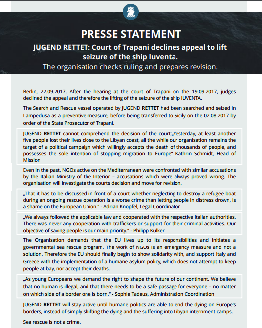
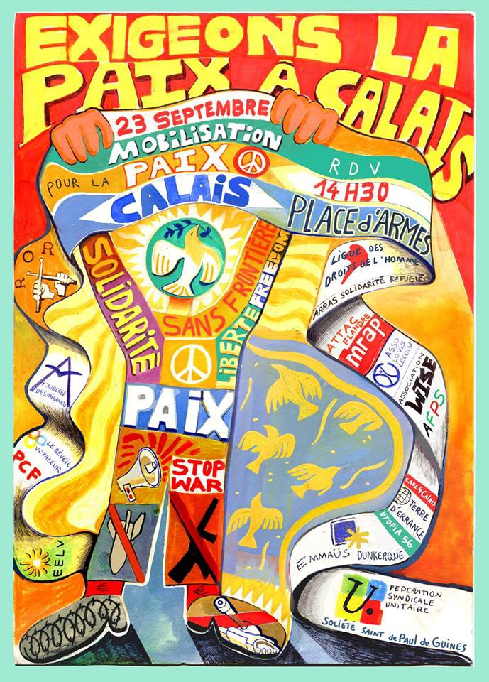

### AYS Daily Digest 22/09/17: Greece’s Council of State rules that Turkey is safe
#### Tragedy in the Black Sea // Court continues to arrest Iuventa // More arrivals in Greece // Conditions on the islands deteriorate // Possible soon closure of the Bubble in Paris // March for Peace in Calais // Greek asylum chief proposes “safe passage” // and more news

](assets/318015ec856c/1*SVlCFwGHAYTL1ITUXvrnVQ.jpeg)

Protest in Lesvos — Photo by [**Lesvos Solidarity — Pikpa**](https://www.facebook.com/pikpalesvos/?hc_ref=ARSUc8cGNlOqlhzhC2fDJKu9Fv38V4W9Y2TsAMefRWIia4HY46C0EyrgsmpCrZw3-ZY)
### Feature

Refugees can be sent to Turkey under last year’s European Union\-Turkey deal, as Turkey is a safe country; this was today’s ruling of Greece’s Supreme court, rejecting arguments by two Syrian men who were contesting a denied asylum request\. The court decided that deported refugees face no threat of torture, inhumane or degrading treatment or punishment in Turkey\. The reality, however, is that Turkey clearly does not even remotely plausibly match any of the legal criteria for applying that concept \(Art\.38 APD2013, five main factors\) \. This case sets a precedent for thousands of refugees already on the Greek islands and many others planning to enter the country seeking asylum\.

If the applicants are deported **it will be the first formal return of an asylum\-seeker from Greece to Turkey on the basis that Turkey is a safe country since the EU\-Turkey deal came into force\.**

[Amnesty International](https://www.amnesty.org/en/latest/news/2017/09/greece-court-decisions-pave-way-for-first-forcible-returns-of-asylum-seekers-under-eu-turkey-deal/) has already reacted to the decision and considers that this is very dangerous and a breach of the principle that asylum\-seekers and refugees should not be sent back to a country in which they cannot get effective protection\.

> “Today’s ruling sets an ominous precedent for many other asylum\-seekers who have fled conflict and persecution and are currently stranded on the Greek islands” 

John Dalhuisen, Amnesty International’s Europe Director, also said that this decision comes at the same time as Amnesty [publishes new findings](https://www.amnesty.org/en/documents/eur44/7157/2017/en/) about unlawful returns from Turkey to Syria which lead to the conclusion that refugees are at greater risk of being returned to their countries of origin since the start of last year’s state of emergency\.

In addition, last December , the UN Refugee Agency said that it has faced obstacles to monitoring the situation of Syrians returned to Turkey from Greece as it has not been granted unhindered access to pre\-removal centers in Turkey where Syrian returnees from Greece are transferred, raising yet more concerns about this practice\.

One of the refugees who lost the appeal today claimed that he had left Syria when the hospital he was working in was bombed, killing two of his friends\. When he tried to cross the border to Turkey, he says he was caught twice by the Turkish forces and beaten before being sent back to Syria\. It was only on his third attempt that he managed to get in, but 11 other refugees traveling with him were killed by an armed group\. During the month and a half that he stayed in Turkey, he also claims he was attacked and robbed twice by smugglers and thieves\. The Greek Supreme Court may argue that these claims could be false, that desperate people do desperate things and anyone can lie, but the reality is that, since the mass migration started to Turkey but especially in the last two years since refugees started reaching Europe, we have heard countless stories of violence at the borders, abuse, robbing, mistreatment and killings\. Not to mention the reports of the lack of acceptable conditions in the refugee centres in Turkey, the work exploitation and sometimes hostility by the locals towards refugees\. Is everyone lying? Every human being should have the right to seek protection, especially the most vulnerable which, by definition, refugees are\. We condemn this court ruling and, like Amnesty International, we say that at least:

> “Until such time as asylum\-seekers and refugees can be guaranteed effective protection in Turkey, EU countries must stop sending them there” 

### Turkey

Terrible news comes from the northern coast of Turkey today as at least 21 refugees drowned trying to cross the Black Sea in a likely attempt to reach Europe\. This route has been becoming more popular recently but is still very risky, as today’s tragedy proves\.

Turkey’s Coast Guard announced today that at 1:35 am, north of Kefken/Kocaeli \(Black Sea\) a report was received by a commercial boat regarding a fishing boat containing illegal migrants which was in distress\.
The coast guard dispatched one plane and two boats on a search mission in the area\.
The fishing boat was reported to have sunk at 5:03am and at 5:25am the plane arrived on location and dispatched two SAR \(search and rescue\) kits\. Twenty\-three refugees were rescued alive by a coast guard boat, one by a naval forces helicopter, 16 by commercial boats and five dead bodies were retrieved\. The search mission continues for approximately 15–20 illegal migrants\.
Participating in the search are one coast guard plane, one coast guard helicopter, two coast guard boats, one naval forces plane and one helicopter, two police boats, one coastal security command rescue boat, five commercial boats\. At the time of this report 21 fatalities had been confirmed and 40 refugees had been rescued\.

Also in Turkey, last night the Syrian dissident Orouba Barakat, 60, and her 22\-year old journalist daughter Halla Barakat, were murdered in their Üsküdar, İstanbul house, where they had found refuge\.
The two were first strangled, then stabbed\. Friends reported that they had been threatened by the Syrian regime not long ago\.
Orouba Barakat had published interviews with dissidents tortured in Syrian prisons\. Following the start of the war, she had lived first in the UK and then the UAE before settling in Turkey\.
Her daughter Halla Barakat was an editor of Orient News and had previously worked at TRT \(Turkish Radio & Television\. \)
She was a 2016 graduate of the Political Science & İnt’l Studies Dept of Şehir University in İstanbul and was also a volunteer working with Syrian refugees in İstanbul\.

In better news from the country we get news today of the opening of a health centre in Ankara, funded by the European Union\. The centre opened on Wednesday and will provide health services to refugees in the Altındağ district, where the refugee population density is the highest in the capital\. According to the statement, the EU provided €300 million to the Turkish Health Ministry in an effort to “improve the health status of the Syrian population under temporary protection and to provide access to primary and secondary healthcare services for over three million Syrians\.” The Altındağ center is said to be one of 178 migrant health centers in Turkey established largely to provide healthcare services to Syrians refugees\.
### Sea

Expectations ran high today ahead of the court decision about the seizure of the ship Iuventa from [**Jugend Rettet e\.V\.‏**](https://twitter.com/jugendrettet)

In the end the judges from the court of Trapani decided to reject the NGO’s appeal, therefore keeping the ship under arrest\.

### Greece

It was another busy day of arrivals in Greece\. Last night, **49** refugees — Kurds, Iraqis and Iranians, among them one who was injured — arrived and were brought to a reception place near the port of Rethymno, in **Crete** \.

Other reports tell us about a boat with **62** people on board being towed to the south of **Lesbos** by Italian Frontex this morning\. We also received fresh news from [ERCI](https://www.facebook.com/ercintl/?hc_ref=ARRNIQYgfJXqJRxWHlXthgsOsvvJu0FdbKLA7FBfdz-WcfCEKFKo6c3JyQRXHStMbDE) that tonight another boat reached the south of Lesvos carrying **45** people\. Everyone was reported safe and on their way to Moria\.

In addition, many more tried to reach Greece from Turkey, but the Coast Guard prevented them from doing so, intercepting 190 people in the last 48 hours, 61 yesterday and 129 up to the time the report was compiled today\.

](assets/318015ec856c/1*mwm4JzyE-4C7Q6zJ1E8kTg.jpeg)

Image by [**SAR watch MED‏**](https://twitter.com/SARwatchMED)

Due to the high numbers of arrivals, the hotspots are overcrowded and Médecins Sans Frontières is talking about worsening living conditions for refugees and migrants on Samos, where more than 2,000 people remain crowded in the Reception and Identification Center which has a capacity of just 700 people\. Hundreds are forced to camp in the forest area around it without access to hygiene services\. Antigoni Karkanakis, coordinator of the organization’s programme on Samos, says, “vulnerable cases are poorly addressed, and even those who are not vulnerable under these conditions face risks to their mental and physical health\.”

Save the Children also warned today that the severe overcrowding caused by the surge in new arrivals on the Greek islands is pushing up to 16 refugees into a five\-person tent\. Babies are forced to sleep on the ground and children put at grave risk\.

](assets/318015ec856c/1*mdA-bQFu0SvJfap3xCtTbg.jpeg)

Photo by [**Open Borders**](https://www.facebook.com/openeuborders/?hc_ref=ARQoe_YwAc9y6Pu7ZhZ8ThjEQXdXc8hoFUC974IYKrQCqIw483mBcOXCe1J6iim2mtQ)

Open Borders reports that more and more people are arriving on the Greek islands again\. On Lesvos, the Moria refugee detention center is overcrowded and makeshift camps are springing up again\.

](assets/318015ec856c/1*qFNXbkydRBODy4q7xM8xyQ.jpeg)

Photo by [**Open Borders**](https://www.facebook.com/openeuborders/?hc_ref=ARQoe_YwAc9y6Pu7ZhZ8ThjEQXdXc8hoFUC974IYKrQCqIw483mBcOXCe1J6iim2mtQ)

The Greek media also reported today about a network of people entitled “For Invisible Refugees" in the Dodecanese islands in the south east Aegean Sea\. The populations complain that despite having a substantial amount of refugees there they don’t get enough support\. Places like Rhodes, Kos and Leros do have hundreds of refugees each who deserve the same coverage and government attention as the rest of Greece, according to this report\. On Rhodes in particular, Open Borders reports there are 120 [r](https://www.facebook.com/hashtag/refugeesgr?source=feed_text&story_id=1842752766053782) efugees and prisoners detained together under horrible conditions in a police station\.

](assets/318015ec856c/1*9VH1ZIHe52eZvi48GqJbXg.jpeg)

Photo by [Open Borders](https://www.facebook.com/openeuborders/?hc_ref=ARQCKNa9tw3Qa2DQ-v29rwqexicWAE6Kqg8hy1xcKdj5_seOUMUH6uAQkqTdRA5YAvs)

](assets/318015ec856c/1*5bExd45dGD3vGLkAYiuyfw.jpeg)

Photo by [**Open Borders**](https://www.facebook.com/openeuborders/?hc_ref=ARQCKNa9tw3Qa2DQ-v29rwqexicWAE6Kqg8hy1xcKdj5_seOUMUH6uAQkqTdRA5YAvs)

The Network’s demands are the following:

• Immediately close down camps and concentration camps and transfer refugees and migrants to appropriate places within the urban fabric of each receiving area, with all the necessary heating, food and health care benefits\.
• Enroll all refugees in schools\. Education and care for all inclusive\.
• Make every effort by the State to reunite families living at a distance and the primary objective of the official bodies \(asylum offices, foreign affairs\) of the countries involved is to facilitate relocation to the country of refugee selection\. With more than 500 million people, the European Union cannot fear the installation of several tens of thousands of people who can contribute to economic growth and the demographic balance of “aging” Europe\.
• Stop expulsions\. Stop criminalizing the movement of refugees\. Everyone has a right to live better and safer\.
• Make an international diplomatic effort by the European Union to end the conflict in the wider Mediterranean region\.

No native and no refugee or migrant, no man should be deprived of decent housing, heating, electricity, water and food\!

Solidarity will win\! With the refugees we will live together\!

The bad news continue today and on the island of **Chios** , Two Iranians sustained knife injuries on Thursday night following a brawl that took place in the Souda reception center\. The two men stabbed each other in a tent for reasons that remained unclear and were transferred to the hospital where they received treatment for their wounds\.

The EU coordinator of the EU\-Turkey deal, Maarten Verwe, visited Lesvos yesterday and a small demonstration was organised on the island\. This is the message for the diplomat:

> We see the consequences of the EU\-Turkey deal every day: all the people who are trapped on Lesvos, not knowing what will happen next, their future on hold\. Will they be sent back to unsafe Turkey? Will their right to asylum by respected? 

> We would like to know how many refugees Mr Verwey spoke to\. Did he actually talk to people staying in Moria and Kara Tepe during his visits there? And what did he learn from them? We look forward to a statement after his visit\. 

Credit: Arash Hampay — Knut Bry

](assets/318015ec856c/1*ySR-GHeAfo7qWe9OBMuA8A.jpeg)

Photo by [**Lesvos Solidarity — Pikpa**](https://www.facebook.com/pikpalesvos/?hc_ref=ARRj7l2MA6fDhG3PrKlQPeNbzI2zIH5odpzHwuV6GotOsFFm-no43fKsZurE64Jxb5c)
#### Volunteer

[**Refugee Rescue / ‘Mo Chara’**](https://www.facebook.com/RefugeeRescueUK/) are are still looking for volunteers to join the team in October\. There are more and more landings and they are in big need of helping hands\. So write them a message or apply directly [here](http://www.refugeerescue.co.uk/land-crew/) \.

[**The Get Shit Done Team**](https://www.facebook.com/The-Get-Shit-Done-Team-304001796641127/?hc_ref=ARRBDaaNQEBEic-0s0-j3dr4YUzpiYezU5ZBczkPBb12UnK7yDlNMw3TDyberzYlyLY&fref=nf) is currently raising money for a van so that the team can continue working throughout Northern Greece\. Check their fundraising page for more details [here](https://www.youcaring.com/getshitdoneteam-946381) \.

Khora is organising a workshop on what can be done for women’s safety and wellbeing on the 7th of October\. For more details click [here](https://www.facebook.com/events/1172883002813784/?acontext=%7B%22ref%22%3A%22106%22%2C%22action_history%22%3A%22null%22%7D) \.
### France

The situation in Paris is always changing and today we received another update from our friends of [**Paris Refugee Ground Support**](https://www.facebook.com/PRGS.team/?hc_ref=ARTsbvyBvdq_4-WzRV7x2aP5TSxuiee8MkseCFS7T2-rmq6dJYGIp_MWvqj58I_c0Ag&fref=nf) **:**

> Last year after the large evacuation of nearly 4000 people from the Stalingrad, Avenue de Flandre and Jaures areas, the government formed a humanitarian center\. 

> The French refugee associations as well as us and anyone involved with refugees in Paris knew there was nothing “humanitarian” about this center\. 

> Last week Utopia56 announced that they were pulling out as they could no longer continue to condone the actions of the center\. 

> Utopia56 have tirelessly worked to cover the basic needs of the people to the best of their ability and in a fantastic fashion\. They will continue their efforts adapting to the ever difficult circumstances on the streets\. 

> The government’s underhanded efforts to decieve people into being fast tracked into deportation procedures rather than assisting with asylum has become all too evident\. 

> The centre itself will close soon and we can’t help but ask ourselves what this means for people trapped in a society that does not want them and refuses to understand them\. 
 

> What will the government do next to “help”? 

Further to the north, in Calais, the norm is police threats, violence and evictions but today there was a call for peace\.

A call for peace from Calais\! 
Exigons la paix à Calais\!
Ein Ruf nach Frieden aus Calais\!

Demonstration — Manifestation
Sa, Sep\. 23, 2:30p\.m\. @ Place d´Armes, Calais, FR

Solidarity with refugees in Calais & all those suffering from war worldwide\! We are here because you exploit & destroy our countries\!

### EU

The Greek asylum chief, Maria Stavropoulou, has called on the European Union to resettle “several hundred thousand” refugees a year directly from the Middle East, rather than allowing them to suffer the hazards of illegal crossings, reports [Al\-jazeera](http://www.aljazeera.com/news/2017/09/eu-urged-resettle-refugees-middle-east-170921175354194.html) \. The EU runs a resettlement programme, through which refugees can be admitted directly from Turkey, Lebanon and Jordan but the scheme has a ceiling of 22,504 over two years\. As a result, more than one hundred thousand refugees have crossed the seas to Europe and more than 2,500 have died in the Mediterranean so far this year, and twice that number last year, she added\. This would be the closest to the badly needed safe passage that so many people have been asking for for a long time, but it seems so unrealistic that it would be foolish to even imagine it could happen any time soon\.

> **_We strive to echo correct news from the ground, through collaborationand fairness, so let us know if something you read here is not right\._** 

> **_Anything you want to share — contact us on Facebook or write to:areyousyrious@gmail\.com_** 

_Converted [Medium Post](https://areyousyrious.medium.com/ays-daily-digest-22-09-17-greeces-council-of-state-rules-that-turkey-is-safe-318015ec856c) by [ZMediumToMarkdown](https://github.com/ZhgChgLi/ZMediumToMarkdown)._
