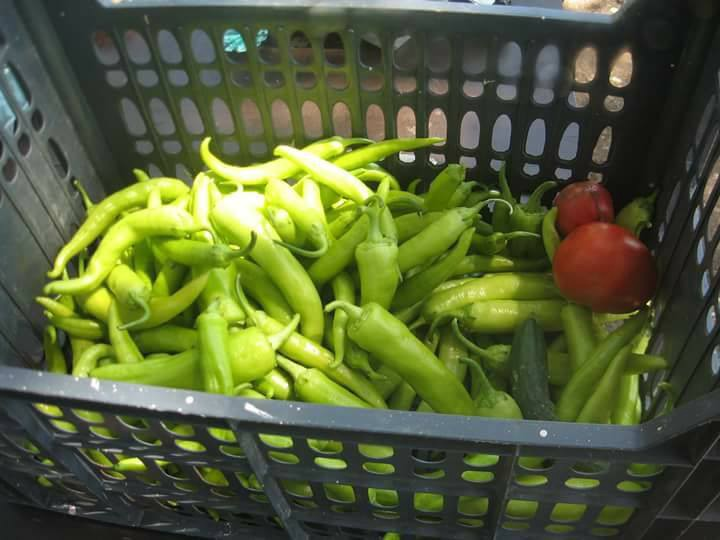
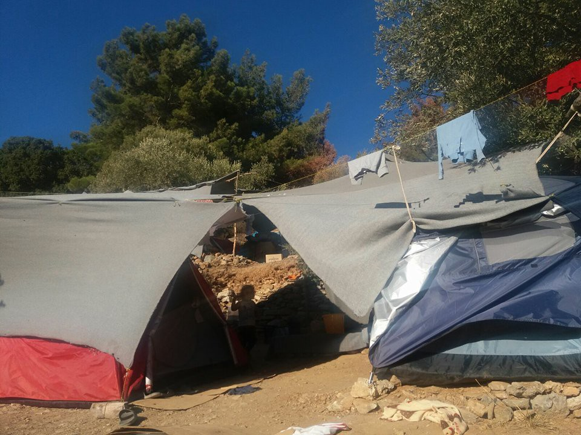
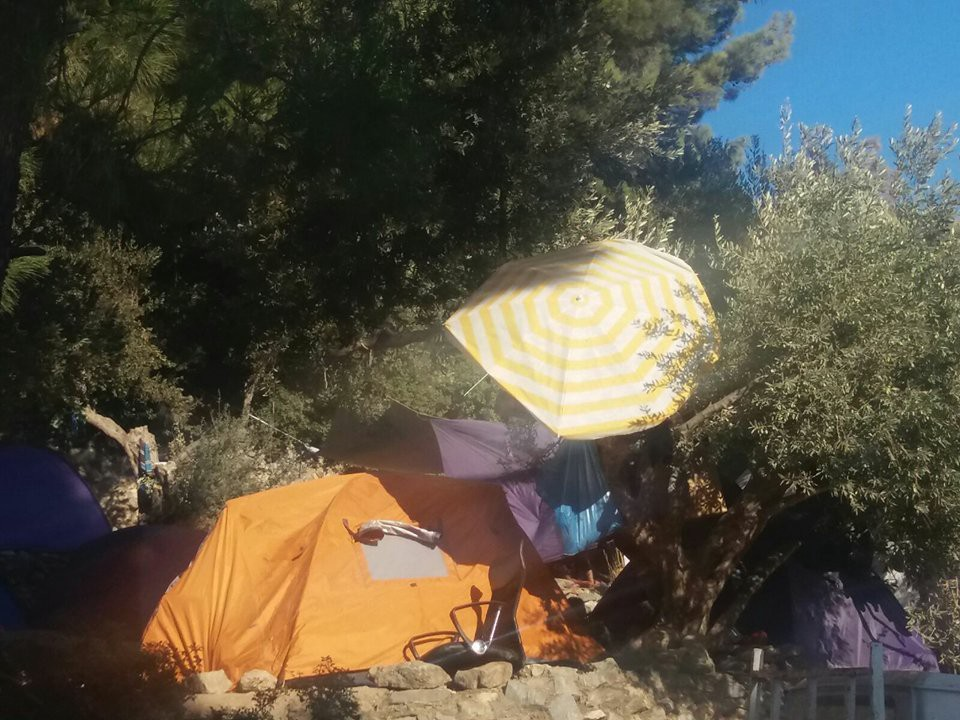
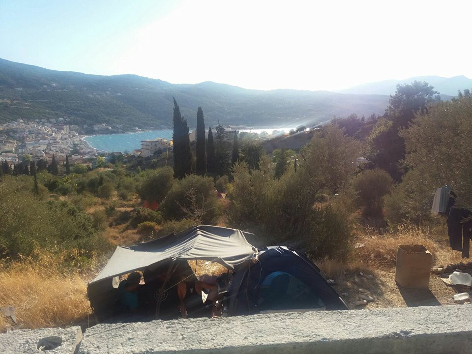
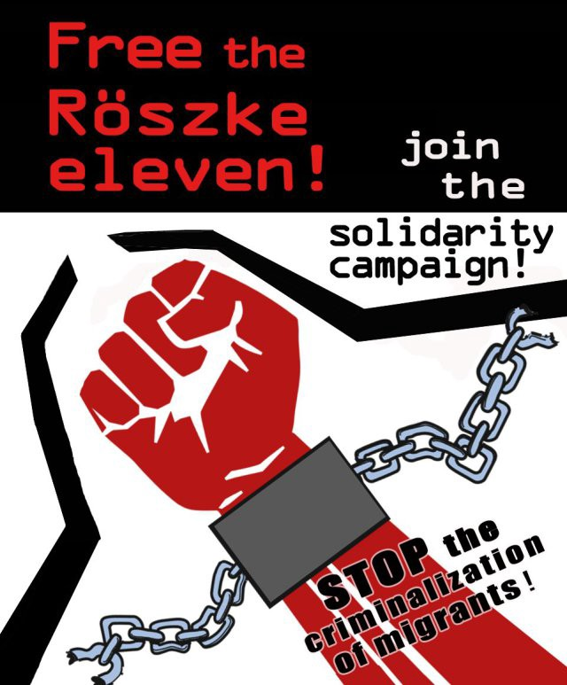

### AYS DAILY DIGEST 23/09/2017 Turkey’s high\-tech border wall nearing completion

Burmese Security Forces Using Landmines on Fleeing Rohingya//Worsening Conditions in Hotspots//Young Man Dies in Italy//Search for Bodies in Black Sea Continues//Appeal for Ahmed H\.

Portuarios CNT

**Turkey’s high tech border wall nearly completed**

LoGcal news [reports](http://www.hurriyetdailynews.com/turkey-syria-border-wall-to-be-completed-by-end-of-september.aspx?pageID=238&nID=118278&NewsCatID=341) that the concrete barrier between Turkey and Syria will be completed by the end of September\. They have so far completed 731 kilometres and have 97 to go\.

> The border wall project incorporates physical, electronic and advanced technology layers\. The physical layer includes modular concrete walls, patrol routes, manned and unmanned towers and passenger tracks\.
 

> Modular walls are being erected along the Turkish\-Syrian borderline with seven\-ton mobile blocks, two meters wide and three meters high\. The blocks have also been topped with one\-meter\-high razor wire\.
 

> An electronic layer consists of close\-up surveillance systems, thermal cameras, land surveillance radar, remote\-controlled weapons systems, command\-and\-control centers, line\-length imaging systems and seismic and acoustic sensors\.
 

> The advanced technology layer of the project includes wide area surveillance, laser destructive fiber\-optic detection, surveillance radar for drone detection, jammers and sensor\-triggered short distance lighting systems\. 

Out of the three million plus people who have already crossed this border, 50,000 of them have the chance of Turkish citizenship\. Reportedly, 15,000 people have already been granted their citizenship\. Interior Ministry General Directorate of Population and Citizenship Affairs Manager Sinan Güner said:

> [Syrians who would be granted citizenship have been selected according to certain criteria, particularly those with skills who could contribute to Turkey\.](http://www.hurriyetdailynews.com/turkey-processing-citizenship-for-50000-syrians-interior-ministry-official-says.aspx?pageID=238&nID=118290&NewsCatID=341) 

At least they’re not trying to say that they are doing it for humanitarian reasons\.

**Burma**

[Human Right Watch](https://www.hrw.org/news/2017/09/23/burma-landmines-deadly-fleeing-rohingya) reports that Burmese security forces have laid landmines during attacks on villages and along the Bangladesh/Burmese border in order to attack Rohingya Muslims fleeing the country\. Antipersonnel landmines were legally banned internationally by the 1997 Mine Ban Treaty\.

**Jordan**

[Volunteering Opportunities\.](https://web.facebook.com/permalink.php?story_fbid=2035598993336152&id=100006582135157)

> Architectural, interior designers and web designers are needed for a volunteering project based in Amman, Jordan\. The project goals are building creative atmospheric rooms for schools that offer free education for less fortunate children and refugees all around Jordan\. 

If interested you may email your C\.V to [batool\_banihani@hotmail\.com](mailto:batool_banihani@hotmail.com) or message Batool Banihani on Facebook\.

**Tunisia**

A conference is being held this weekend in Tunis entitled, ‘Migratory Movements Around the Mediterranean, Reality and Challenges’\. It is being held by AlarmPhone Tunis in collaboration with the Rosa Luxembourg Foundation\.

■■■■■■■■■■■■■■ 
> **[Alarm Phone](https://twitter.com/alarm_phone) @ Twitter Says:** 

> > @[seawatchcrew](https://twitter.com/seawatchcrew) @[jugendrettet](https://twitter.com/jugendrettet) + @[MSF_Sea](https://twitter.com/MSF_Sea) speak in #Tunis about the current situation in the #Mediterranean #Sea and demand #safepassage. https://t.co/AQmGielYD9 

> **Tweeted at [2017-09-23 15:11:04](https://twitter.com/alarm_phone/status/911608864369463296).** 

■■■■■■■■■■■■■■ 

**Sea**

The search for bodies continued today in the Black Sea and it has now been confirmed that 42 people, including children, have died\. Volunteers state that better communication with rescue teams will help to prevent further catastrophes such as this\. Saad Kasem of United Rescue Aid has asked the people who are travelling to maintain contact whenever possible\.

> We are volunteers in rescue and refugee assistance, and we will not stop a moment from our work, please contact us to help save the lives of your children\.
 

> \+46 8 559 253 50
 

> Alarmphone 
 

> United rescue aid 

**Greece**

Every Saturday, the 5th School will hold a market at Navarinou park \(next to Zoodochou Pigi\) to display products that have been farmed and harvested by the refugees and Solidarians as well as homemade products produced by the women of the 5th School\.

5th School

5th School

**Arrivals**

■■■■■■■■■■■■■■ 
> **[ERCI](https://twitter.com/ERCIntl) @ Twitter Says:** 

> > #NEWS: This morning's refugee boat arrived to South coast of Lesvos, carrying 45 people. All safe and now on their way to #Moria #Lesvos https://t.co/WkcDJqyKhn 

> **Tweeted at [2017-09-22 23:11:21](https://twitter.com/ercintl/status/911367344492081152).** 

■■■■■■■■■■■■■■ 

So far this month 49 boats have arrived on Lesvos, with a total of 2122 people\.

[Refugee Rescue / ‘Mo Chara’](https://web.facebook.com/RefugeeRescueUK/?_rdc=1&_rdr) reported a landing at Korakas this morning\.

> Our boat and land crew assisted 16 men, 5 women and 13 children\. In total our boat and land crew have assisted 332 people so far this month\. Among them are 130 children\. 

**Lesvos**

[Volunteers report](https://web.facebook.com/aris.vlahopoulos/posts/10156622018528032?hc_location=ufi) that about 7500 people are currently stranded on Lesvos\. They state that 700 people arrive per week on average while only 200 are sent to the mainland in the same period\.
Moria camp is also believed to be back up to 4500 inhabitants even though its capacity is at 1,800\.

> This will end up with a disaster like last year when we lost lives to hypothermia during the cold winter and none of the officials or the big NGOs seemed to care about this\. 

**Samos**

Over 100 people, many of whom are children, are sleeping outdoors in Samos\. The weather is getting colder but there does not seem to be any plan in place\.

AYS

AYS

AYS

**Chios**

Action from Switzerland is asking for support for the Athena Centre for Women on Chios Island to help with transportation costs for women from Vial to the Centre\. This is a vital service for women from the refugee community run by a dedicated volunteer team\. If you can help or would like more info, please look [here](https://web.facebook.com/refugeeeducationchios/posts/540364289642958?hc_location=ufi) \.

**Italy**

Local media report \( [original source in Italian](https://www.riviera24.it/2017/09/ventimiglia-migrante-travolto-dal-treno-in-localita-calandre-266381/) \) that a young man died today \(23 September 17\) when he was run over by a train in Calandre \(Ventimiglia\) at 6:30 this morning as he tried to reach France by walking along the railway tracks\.

**Bulgaria**

According to [local media](http://sofiaglobe.com/2017/09/22/eurostat-685-first-time-asylum-seekers-in-bulgaria-in-q2-2017/) , 685 people became first\-time asylum\-seekers in Bulgaria in the second quarter of 2017\. The majority, 235, were from Syria, while 160 came from Afghanistan and 160 from Iraq\. This represents a proportion of 97 first\-time asylum\-seekers per million Bulgarian citizens or 0\.5 per cent of the EU total of 149,000\. [Eurostat](http://ec.europa.eu/eurostat/web/products-eurostat-news/-/DDN-20170922-1?inheritRedirect=true&redirect=%2Feurostat%2Fnews%2Fwhats-new) states that this is the 3rd quarter in a row in which there has been a decrease in the number of first\-time asylum\-seekers in the EU\.

**Hungary**

Ahmed H\., a Syrian with residency in Cyprus, has been charged with violating the anti\-terrorism laws for participating in a protest in Röszke, Hungary, in September 2015\. Ahmed has now been in prison for two years and was sentenced to 10, but can finally appeal his verdict\. He was legally in the country at the time of his arrest and the demonstration occurred when the border between Hungry and Serbia was closed\. At this time he was supporting his Syrian family across Europe\. Protesting for your family’s freedom of movement is not an act of terrorism\. For more info and to support Ahmed, please visit the campaign page\.

> **_We strive to echo correct news from the ground, through collaboration and fairness, so let us know if something you read here is not right\._** 

> **_Anything you want to share — contact us on Facebook or write to: areyousyrious@gmail\.com_** 

_Converted [Medium Post](https://areyousyrious.medium.com/ays-digest-23-09-17-turkeys-high-tech-border-wall-nearing-completion-burmese-security-forces-b90194feb5d9) by [ZMediumToMarkdown](https://github.com/ZhgChgLi/ZMediumToMarkdown)._
