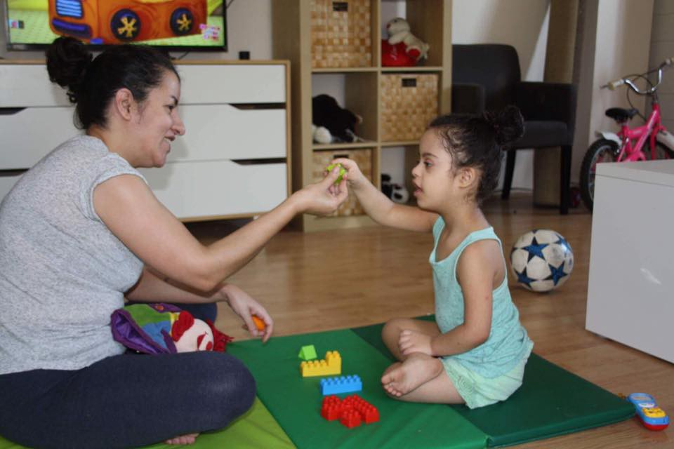
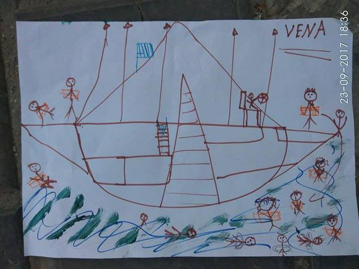
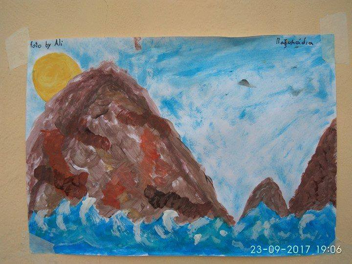
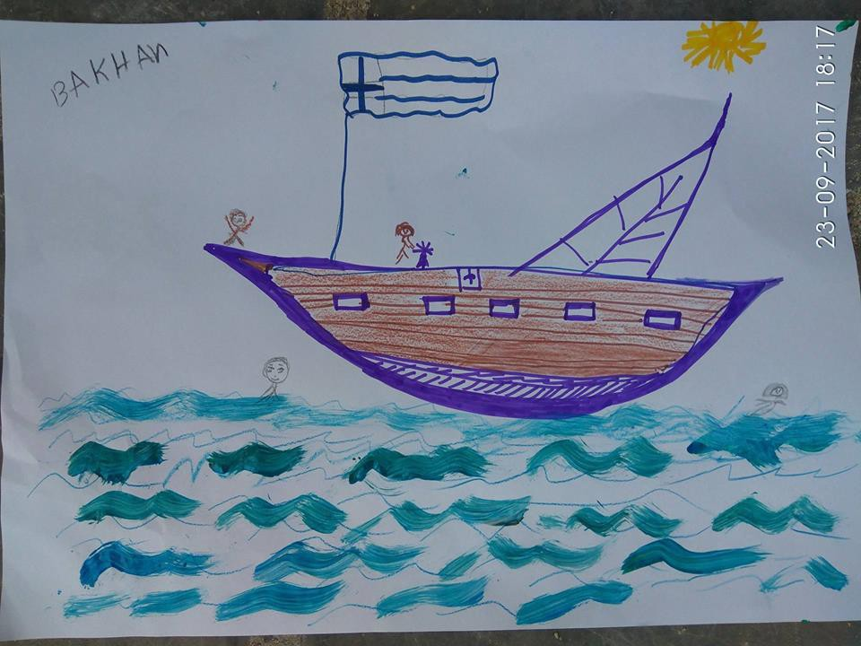
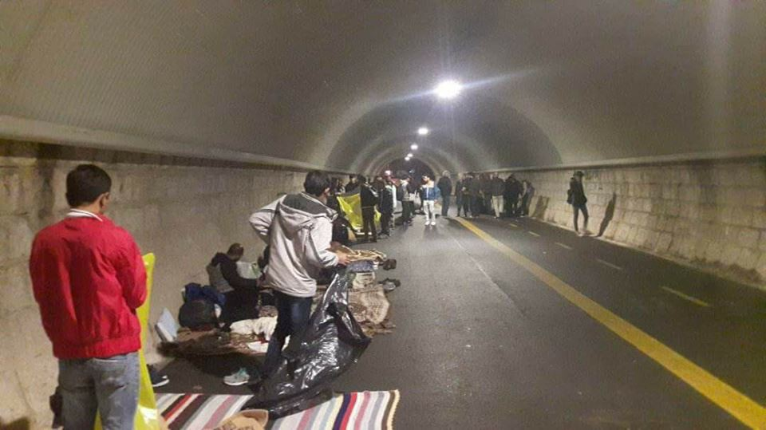
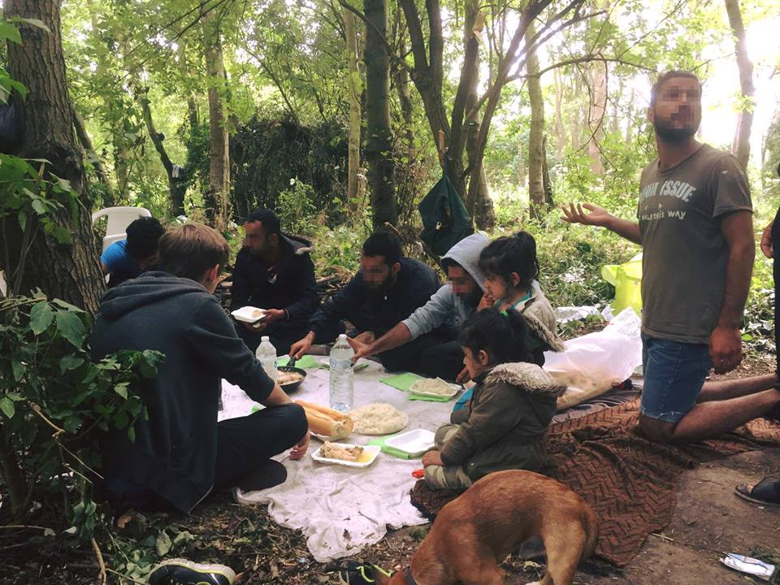

### AYS Daily Digest 25/09/2017 Inhuman treatment in British detention centres

New arrivals and new rescues on the Mediterranean and the Aegean route /// news from Rome and Gorizia in Italy, Belgium, Germany and France

One of the 44 drawings of refugees who arrived at Rethymnon, Crete\. No Borders\.

**FEATURE: United Kingdom**

[Local media](https://www.theguardian.com/uk-news/2017/sep/25/immigration-detainee-allegedly-choked-g4s-guard-demands-public-inquiry-panorama-home-office) report that 8 detention detainees in the UK are taking the Home Office and G4S to court over their mistreatment while in detention after episodes of abuse were recorded by an undercover journalist\.

> Lawyers for the man allege that he was subjected to inhuman and degrading treatment, and conduct “possibly sufficiently severe to cross the threshold of torture”\. 

[Freed Voices](http://detentionaction.org.uk/abuse-in-brook-house-freed-voices-open-letter) , a group of people previously detained in the UK, wrote an open letter in response to these revelations earlier this month\.

> This is something anyone who has been detained can relate to\. Sadly, it is neither unique nor isolated — it is routine in detention\. Freed Voices members have been detained across the country and we all share the same stories of violence, emotional abuse and sleepless nights\. 

> In detention, you are just a number\. 

> The system is set up to dehumanise you, to make you feel that you are wrong, that you have no place in this country\. But last year, more than half of the 28,000 people detained were released back into the community\. Their detention, like ours, was pointless\. 

The privatisation of detention centres, especially utilising a security company such as G4S, was always going to lead to abuses of peoples human rights as a private company has no reason to put people before profit\. [Media](http://www.independent.co.uk/news/uk/home-news/g4s-immigration-profits-detention-centre-brook-house-abuse-scandal-gatwick-inmates-panorama-a7946776.html) have reported the trading profit for G4S at Brook House \(the detention centre currently under investigation\) was 20\.7 per cent, while at another immigration centre Tinsley House, the margin was 41\.5 per cent\.

We can only hope that the legal action of those detained will lead to change but given that accusations fired at G4S since the 1990’s range from allegations of fraud to torture in South African prisons, the unlawful killing of Jimmy Mubenga, and gross misconduct in children’s homes, it seems unlikely that this latest incident will be taken seriously either\.

**General**

In their monthly [report](http://www.bbc.co.uk/radio/player/bbc_radio_fourfm) Frontex, otherwise known as the European Agency for the Management of Operational Cooperation at the External Borders of the Member States of the European Union, state that they have ‘detected’ 12,200 ‘illegal border crossings’ on the four main routes into Europe in August\. The route into Italy has dropped by two\-thirds, hopefully because people are choosing to travel by a less dangerous route and not because boats are being lost at sea now that NGO rescue boats are fewer in number\. 4,500 people were ‘detected’ this month\. the total of arrivals for the eight months of this year stood at 99 800, down 13% from the same period of last year\. Most people are from Nigeria and Guinea\.

An estimated 2 400, more than twice the figure from a year ago, arrived in Spain in August\. In the first eight months of the year, the number of migrants crossing into Spain stood at an estimated 13 600, nearly three times the figure from the same period of 2016\. Most people come from Morocco, Ivory Coast and Gambia\.

4,200 people arrived in Greece in August, nearly a quarter more than in the previous month\. In the first eight months of this year, roughly 21 100 migrants reached Greece, about a tenth of the figure from the same period of 2016\. The majority of people were from Syria, Iraq and Afghanistan\.

Not many people are using the Balkan route\.

In the first eight months of 2017 the number of people ‘detected’ by Frontex has fallen two\-thirds from the same period of last year to approximately 142 700\.

**Turkey**

AYS does not normally share personal donate stories but this one is particularly urgent\. Iman and her daughter Lulu are trying to get to Canada and need to raise $22k Canadian \($18,200 US\) by September 30th to secure their spots on the Canadian SAH \(Sponsorship Agreement Holder\) program, which would allow them to immigrate to Canada\. Iman is a single mother with three older sons and her daughter Lulu, who has Down Syndrome\.

> The worst part for me as a parent was — and still is — the inability to help my boys go back to school and have goals of their own, and my failure to provide the necessary treatment and help for my little girl with different abilities\. She will be 5 in December, which means she should go to school where she can have professional therapy\. But that’s not accessible \[to us\] here\. \(Iman\) 

For more info and to support Iman look [here](https://web.facebook.com/leslie.schick/posts/10155735997813620) \.

**Sea**

■■■■■■■■■■■■■■ 
> **[SOS MEDITERRANEE France](https://twitter.com/SOSMedFrance) @ Twitter Says:** 

> > UPDATE L'#Aquarius a secouru lundi 20 hommes femmes &amp; enfants en détresse en mer. Tous Libyens, tous fuyant la #Libye. Ts en sécurité à bord https://t.co/403C7U1CGn 

> **Tweeted at [2017-09-25 18:40:15](https://twitter.com/sosmedfrance/status/912386281107279872).** 

■■■■■■■■■■■■■■ 

■■■■■■■■■■■■■■ 
> **[MSF Sea](https://twitter.com/MSF_Sea) @ Twitter Says:** 

> > 20 people rescued in #Mediterranean this afternoon by #Aquarius including 3 children #MSF medics caring for 2 serious medical cases onboard https://t.co/XBbqER4x9V 

> **Tweeted at [2017-09-25 19:02:25](https://twitter.com/msf_sea/status/912391858558574592).** 

■■■■■■■■■■■■■■ 

■■■■■■■■■■■■■■ 
> **[ERCI](https://twitter.com/ERCIntl) @ Twitter Says:** 

> > #NEWS : One refugee boat picked up by HCG in the South coast of Lesvos this evening carrying 52 people. #Refugeecrisis #Lesvos 

> **Tweeted at [2017-09-25 18:32:25](https://twitter.com/ercintl/status/912384310841417729).** 

■■■■■■■■■■■■■■ 

**Greece**

**Arrivals**

Save the Children [report](http://www.bbc.co.uk/radio/player/bbc_radio_fourfm) that the numbers of people arriving on Greek islands is at its highest since March last year when the EU\-Turkey deal came into effect\.

> Trapped in refugee camps, up to 16 people are forced to sleep in five\-person tents while babies have to sleep on the floor\. 

> “At dawn today, 25 September, 35 more migrants were rescued, 30 from Afghanistan, two from Iran, two from the Dominican Republic and one from Ghana, including 10 children and 11 women\. On September 17, 18 and 19, three other boats were also rescued, with another 88 migrants\.” _\( [media](http://www.abola.pt/Mundos/Noticias/Ver/693801) statement of the Greek Maritime Police\)_ 

According to that force, the boat on which the migrants were traveling was detected by radar and all were safely rescued, proceeding to the port of Skala and handed over to the Greek authorities\.

■■■■■■■■■■■■■■ 
> **[Michael Räber](https://twitter.com/iwatnew) @ Twitter Says:** 

> > 1 boat w/52 #refugeesGr ppl rescued now by #HCG off coast south #Lesvos #Greece. @[UNHCRGreece](https://twitter.com/UNHCRGreece) #humanrights #safepassage 

> **Tweeted at [2017-09-25 17:02:46](https://twitter.com/iwatnew/status/912361749680181249).** 

■■■■■■■■■■■■■■ 

[Hestia Hellas](https://web.facebook.com/permalink.php?story_fbid=888825011275265&id=805437309614036) is looking for an intern and/or volunteer with experience in web design to assist in refreshing and updating their website\.

> Are you a tech\-savvy person who considers themselves to be a wise at website design? Than you are the person we have been searching for\! Hestia is looking for an individual with background experience in website design, specifically WordPress to make our website user friendly and pop with tons of information about our programs, volunteering, our history, and more\. This individual will work closely with Director to develop the pages on the website and to identify where key information should go\. 

The volunteer can work from Greece or remotely\. Please contact — HestiahellasHR@gmail\.com

**Islands**

\(Petros Papadakis\)

[No Borders report](https://web.facebook.com/nobordersnetwork/posts/1517676571633563?hc_location=ufi) :

> These are the drawings of 44 refugees who arrived at Rethymnon, Crete with the support of people in solidarity there\. 5 days without food after leaving from Turkey, their 12 m\. boat sunk by a small desert island near near Agia Galini \(Crete\) \. 

> They survived and spent the night there as coast guard could not approach due to bad weather conditions\. These drawings saw the stories these people carry inside them\. 

> Their stories, the war against them, the struggle, the loss of human rights, unfortunately, does not stop after they cross the borders of Europe\. On the contrary\. 

> That’s why we insist, that solidarity is our own weapon against this war\. 

Local media [report](http://www.ekathimerini.com/221953/article/ekathimerini/news/refugee-arrivals-double-this-month-on-lesvos) that arrivals have doubled on Lesvos this month bring the number to nearly 2,000 people\. The Interior Ministry, believe that as of Monday morning there are more than 13,300 refugees and migrants on the eastern Aegean islands — over 6,300 on Lesvos and 3,000 on Samos\.

As NGOs continue to leave the islands the [Boat Refugee Foundation](https://bootvluchteling.nl/en/press-release-mission-samos/) will now depart from Samos on October 1st, 2017\. From January 1st, 2018 they report that the Greek ministry of Health will fully take over the medical care in the hotspot\. Given the current situation on Samos and the fact that winter is approaching while children sleep outside in this Government run facility this is a concerning development\.

**Italy**

SIL — Servizio Informazione Lavoro is a new project run by [Ospiti in Arrivo](https://web.facebook.com/ospitinarrivo/posts/1965753743680729?hc_location=ufi) in Udine\.

It will be held every Saturday morning at Circolo ARCI Miskappa and it will help migrants to:
- write their CV \(hard copy, Word and PDF\)
- give useful sites and contacts to those who are looking for a job \(agencies, job centres\)
- simulate interviews

[Donations needed](https://web.facebook.com/permalink.php?story_fbid=1509658732460421&id=1245970425495921&hc_location=ufi) \!

L’altra Voce

L’Altra Voce in Gorizia need winter clothes and shoes

Men’s jeans 30,32,34; sweaters, wool jumpers and winter jackets size M\-L; shoes 41,42,43,44,45

This is especially needed as many people are sleeping rough after they were evicted to clear space for a local fair\.

Rome — migrants living in the [Baobab](https://web.facebook.com/BaobabExperience/posts/1457241491019265?hc_location=ufi) camp participated to “pulire il mondo” \(clean the world\), initiative of Legambiente \(ecologist association\) and cleaned with the volunteers the areas surrounding the camp and the nearby train station\.

> We are happy to give visibility to who decided to clean not only their own camp, as every day, but a part of the city, claiming the right to be recognised not only as part of a community of immigrants, but as full members of the civic community\. 

> A work, done together by migrants and volunteers, that was not — let’s be clear — that “unpaid volunteering” proposed by the government as a price to pay by who — asylum or protection seekers — have to prove to be willing to integrate, showing redemption for their original sin: invading our borders\. 

[Antifacists](https://web.facebook.com/notes/comitato-lombardo-antifascista/gli-antifascisti-della-brianza-in-solidariet%C3%A0-dei-migranti-di-como/530322107305822/?hc_location=ufi) coming from Brianza \(Lombardia\) delivered a donation of blankets and clothes to the migrants sleeping rough in Como

UNHCR have released their [weekly snapshot](https://reliefweb.int/report/italy/unhcr-italy-weekly-snapshot-24-september-2017) for Italy:

> Total arrivals \(1 Jan — 24 Sep 2017\): 103,273 

> Total arrivals \(1 Jan — 24 Sep 2016\): 131,088 

> Total arrivals 1 Sep — 24 Sep 2017: 4,146 

> Total arrivals 1 Sep — 24 Sep 2016: 16,020 

> Average daily arrivals in September 2017 so far: 173 

> Average daily arrivals in August 2017: 126 

> Dead and missing in 2017 \(as of 24 Sep\): 2,561 

> Dead and missing in 2016 \(as of 24 Sep\): 3,498 

> Dead and missing in 2016: 5,096 

**Germany**

A new [guide](https://web.facebook.com/Fl%C3%BCchtlingsrat-Berlin-109674169087407/?hc_ref=ARTM-2AMRedFrlg6GGhQWQtRj7oAzGGXSEo82CzNzSat6xefeiwIDOT1o-9iijsTleo&_rdc=1&_rdr) for refugees in Berlin has been made by Refugee Berlin and Georg Classen\.

> The Guide Aims to help refugees and \[…\] volunteers to find their way through the “Jungle” of the German laws, regulations and authorities\. With “ refugees “ \[…\] we mean all the people who are looking for protection in Germany\. They can be in the asylum procedure, have a right of residence as recognised refugees, have a residence permit for family or humanitarian reasons, or have a \[…\] certificate of immigration, or live without papers in Berlin\. 

You can download it here — [www\.fluechtlingsrat\-berlin\.de/ratgeber](http://www.fluechtlingsrat-berlin.de/ratgeber)

**Belgium**

Local media [report](http://www.brusselstimes.com/brussels/9213/two-hundred-people-demonstrate-in-support-of-refugees-in-north-brussels) that on Sunday 200 people met at Brussels\-North station to demonstrate in support of refugees and against intensified police operations over the last few weeks\. Film director Lorent Wanson organised the demonstration\.

> I go past a Johan Muyle fresco at the station that reads “I promise you a miracle” every day\. It’s an homage to cultural diversity, but I can’t accept what goes on, supposedly in our name\. 

**France**

1 week after the evacuation of the camp almost all of the evicted refugees have returned to Grande Synthe, around 350 people, local media [report](http://www.20minutes.fr/lille/2138807-20170925-grande-synthe-presque-tous-migrants-evacues-revenus?utm_campaign=Echobox&utm_medium=Social&utm_source=Facebook&xtref=facebook.com#link_time=1506334579) \. Associations distributed 400 meals on Sunday evening\. Christian Salomé of Auberge des Migrants is quoted as saying

> This is not surprising\. People have been sent very far away, as far as the Spanish border, and they are already back\. Moving people might be good, but if they are not welcomed, they come back, it’s very simple\. 

Volunteers in Calais are still [witnessing](https://web.facebook.com/groups/123081368042139/?ref=group_header) high levels of police oppression:

> Today in Calais, impossible to set up a tent for shelter, because police destroys everything, sleeping bags, blankets are removed daily since the evacuation of the jungle\. It’s a catastrophe\. It’s our duty to help these people who fled war and dictatorship\. 

Mobile refugee support

Mobile Refugee Support have been providing 1000 meals a day in Calais and Dunkerque and are asking for [donations](https://web.facebook.com/MobileRefugeeSupport/posts/659177630954518?hc_location=ufi) to provide families with food packs so that they can cook for themselves\.

People to People Solidarity are also in need of donations of winter coats and shoes as the weather continues to deteriorate\. If you can organise a collection of these two essential items, please get in touch with them\. You can contact them by email at: isis@care4calais\.org or comment here\.

> **_We strive to echo correct news from the ground through collaboration and fairness, so let us know if something you read here isn’t right\._** 

> **_If there’s anything you want to share, contact us on Facebook or write to: areyousyrious@gmail\.com\._** 

_Converted [Medium Post](https://areyousyrious.medium.com/ays-daily-digest-25-09-2017-inhuman-treatment-in-british-detention-centres-acde26c88cfa) by [ZMediumToMarkdown](https://github.com/ZhgChgLi/ZMediumToMarkdown)._
