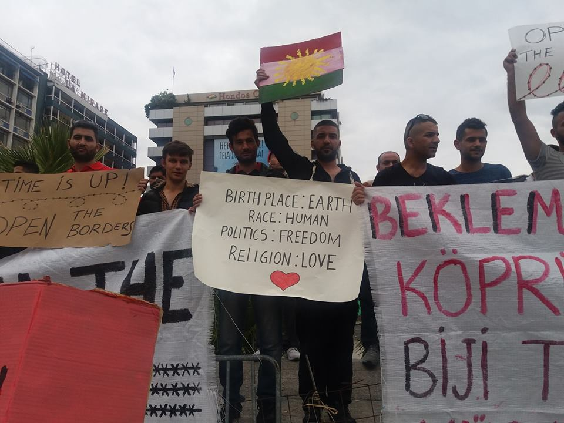

### AYS Daily Digest 30\.09\.17: Sick of Waiting Protests take place across Europe

Dentist needed in Beqaa, Lebanon // Nearly a dozen refugees kidnapped by Islamist militia after being deported from Turkey // Aegean hotspots growing more overcrowded by the day // AYS condemns lauding of refugee\-hunting police dog // Tentless conglomeration of refugees in Dunkirk spotted // New paper studies the question of refugees’ money

Refugees protest in Athens as part of the ‘Sick of Waiting’ campaign\. Photo AYS\.
#### Feature

Today starting at 5pm, groups of people across Europe took to staging demonstrations dubbed the “Sick of Waiting” movement\. Related tweets are found under the \#TimeIsUp30s hashtag\. The cause for the protests? The EU’s shameful handling of the relocation program\. The relocation program is one of the many promises that has gone unfulfilled\. The EU had promised that approximately 120,000 refugee families would be relocated throughout the zone by September 2017, and yet we have reached the end of September with only three\-quarters of this figure relocated\. The movement stands against this European failure, as well as the general unwelcoming attitudes toward refugees, such as the failure to provide livable accommodations in many parts of Greece and Italy and the easing of relocation requirements\.

■■■■■■■■■■■■■■ 
> **[Acoger Ye Natural](https://twitter.com/AcogerYeNatural) @ Twitter Says:** 

> > Desde Asturies nos sumamos a la protesta sonora de @[SickOfWaitingES](https://twitter.com/SickOfWaitingES) 
Haz sonar tu alarma por la acogida de personas refugiadas
#TimeIsUp30S https://t.co/Mqsr10e7W7 

> **Tweeted at [2017-09-30 15:21:48](https://twitter.com/acogeryenatural/status/914148281348952064).** 

■■■■■■■■■■■■■■ 

This latest round of pan\-European protests comes at a time when the situation for refugees looks more desperate than ever\. Italy and Greece are completely inundated, their refugee\-related infrastructure teetering as a result of the massive overcrowding\. Meanwhile in Libya, increasing numbers of those who attempt to make the crossing to Europe are intercepted by militias who have taken up the role of the Libyan coastguard and jailed in unsanitary, if not to say outright dangerous conditions \(heavily funded by the EU\! \) \. The violence is unceasing, the intransigence of several European states vis\-a\-vis refugees unfazed, and the deportations only seem to increase in volume\. In times like these, those whose countries are actively participating in such anti\-human policies cannot help but feel sickened\. And so we stage protest after protest, in the hope that the powers that be hear our voices and decide to reconsider their dangerous politics\.

#### Lebanon
### Experienced dentist needed in Beqaa

A dentist volunteer is greatly needed in Beqaa for a period of five to seven days\. Your transportation and accommodations will be taken care of for the duration of your stay\. The majority of the work will be extractions\. If you are somebody who could meet this need, please send an email to medical\.unit@sdaid\.org\.
#### Turkey
### Turkey deports 150 refugees to Syria, several reportedly abducted by Islamist militia

Turkish reporter Aylina Kılıç [reported on Twitter](https://twitter.com/AylinaKilic/status/913747716835909632) that the Turkish state has deported 150 Kurdish refugees who were captured trying to cross into Europe\. The group is largely exiles from the Kurdish region of Iraq, but they have been deported to Syria in the meantime\.

The KRG government has said that the refugees will be transferred to their native land, but for several of them it is already too late\. At least nine of them have reportedly been captured by an Islamist militia\. Kılıç reports that this was done by Jabhat al\-Nusra, but al\-Nusra no longer exists as an independent organization\. Regardless of the responsible party, the kidnapped people will likely face harsh mistreatment at the hands of their captors\. Thus, yet more victims of the inhumane EU\-Turkey deal\.
#### Greece
### Spike in arrivals creates tensions in Aegean hotspots

An issue that seems to constantly loom over Greece’s shoulder, the processing of refugee applications, has continued at the same slow pace\. Many find that they are cooped up on the islands for months, even after their asylum application is approved\. On Friday, the Greek Migration Policy Minister spoke before Parliament to account for the increased number of arrivals\. In the month of September, 3,500 refugees have landed on the island, exerting particular pressure on the infrastructure on Samos and Lesvos, where 3,000 are crammed into accommodations designed for 700 people in the case of the former, and 4,700 in camps designed for 2,500 people in the latter\.

With such rampant overcrowding and the problems of distributing resources that go along with it, tensions are often fraught, in particular between different ethnic groups\. Multiple ethnically based riots have broken out in the hotspots, a sign of the strain on the islands’ infrastructure\. These problems could of course be resolved with relative ease, as UNHCR and other organizations on the mainland have plenty of available housing\. The limiting factor is the failure of the system to process applications in a timely manner\.
### Intervolve team brings planting boxes to hundreds of families

Intervolve, in collaboration with a number of other organizations, is distributing planting boxes to refugees living in Thessaloniki\. Each family is entitled to a box, as well as soil, compost, and seedlings, to start their own mini\-gardens\. For now, the families will be able to grow lettuce and onions\. So far 300 such kits have been assembled\.

### Schoolbox Project searches for new volunteers

> _The Schoolbox Project is now accepting applications for volunteers\._ 

> _Calling all credentialed teachers, art therapists, occupational therapists, psychologists, musicians, social work professionals, 1:1 educational aids , translators, sports coaches and basic volunteers who have experience with children\! Current needs in Greece \(near Andravida\) with upcoming needs near Athens, on Lesvos, in Texas, U\.S\.A and in Cox’s Bazar, Bangladesh\._ 

> _Requirements:_ 
 

> _four week commitment_ 
 

> _Meeting of above educational/experiential criteria_ 
 

> _Ability to pass a criminal background check_ 
 

> _Commitment to SBP mission and values, including our no photo policy_ 
 

> _Must speak English_ 
 

> _Additional requirements for Program Directors \(stipend provided\):_ 
 

> _3 months required, 6 months preferred_ 

> _Priority given to:_ 
 

> _\*those with trauma\-informed care knowledge and experience, though online and in\-person training and 24 hour support will be provided to you\._ 
 

> _\*those with refugee camp experience_ 
 

> _\*those with nature based education experience \(permaculture, forest kindergartens, etc\)_ 
 

> _\*those with Arabic or other relevant language skills_ 
 

> _Please submit your information to volunteer@schoolboxproject\.org_ 

### [IOM posts guide for legal practitioners in Greece](https://greece.iom.int/sites/default/files/IOM%20Legal%20Guide_English.pdf)
#### Croatia
### AYS condemns ceremony honoring dog trained to capture refugees at the border

Earlier today, we published a statement on our page condemning the brazen disregard for refugees’ lives and wellbeing exercised by police at the border\. An English translation of the statement has been prepared below:

> _Lately the Croatian media have been writing about the medal of honor given to a dog named Candy for ‘exposing’ or ‘detecting’ ‘illegal’ immigrants at the Croatian border\. We find that a number of things are teetering on the edge of common sense, far beyond the bounds of good taste and infinitely far from the principles of humanity and morals\._ 

> _One of these things is the sharp pivot of the government from motions encouraging solidarity to inhumane measures that are spreading fear not only among the refugees, but among the local population as well\. Is it possible that we have forgotten that only two years ago, hundreds of thousands of people were passing through Croatia, while today only dozens arrive? And should we remind ourselves that at the very beginning of the crisis there were no military helicopters, heartbeat detectors, or nearly as many police units at the border?_ 

> _Indeed, in the first days of the crisis, the local inhabitants of Ilača, Bapska, Tovarnik and other villages at the border of Eastern Croatia were completely alone, at a time when thousands of unknown people were entering their villages\. Instead of weapons and trained dogs, the locals responded with open houses and courtyards, bread with jam and butter, tea, opportunities for rest and comfort\._ 

> _The recent actions of authorities, such as the use of military helicopters over the border as if over a war zone, and honoring dogs for the ‘detection’ of human beings are creating an atmosphere of fear among the local population of Nuštar and other places because they lead to the conclusion that there is an enemy force coming to our country, and not people who are looking for peace and safety\._ 

> _Meanwhile, these moves are accompanied by a sharp turnaround in the government and media discourse, from portraying the solidarity of the Croatian people towards the starving, tired, and persecuted people\. to boasting of manhunts for unarmed people — including the uncritical and uninformed media report about the police honoring Candy the dog for ‘detecting’ refugees\._ 

> _On the other hand, the suffering of these people and their children who have no other choice than to seek refuge in our country, or to cross our country to a place where they will meet their families and friends\._ 

> _By violating international and domestic legal provisions, Croatian police are violently and unlawfully returning to Serbia people who seeking international protection on Croatian territory\. There are numerous reports, including one prepared by our organization, as well as by other international organizations such as the Doctors without Borders \(MSF\), the European Council for Refugees and Exiles, and even the UNHCR, of systematic push\-backs of refugees from the country, beatings, deprivation of property, and intimidation that the Croatian police employ against human beings\. Of course, this is least of all Candy’s responsibility, who is herself scared and hungry and who reached the Croatian border in search of shelter, at which point she was discovered and used by the police against the people and children who, just like she, are looking for shelter\. It is sad and absurd to applaud the frightened dog, turning her into a mascot of the new Croatian anti\-immigrant policy\. We consider that her very honoring for ‘detecting’ refugees is morally and humanely inappropriate, while the uncritical reporting on this runs contrary to the fundamental postulates of the journalist’s profession\._ 

> _We also believe that this is a slap in the face to the inhabitants of Ilača, Bapska, Tovarnik and other places in Eastern Slavonia, who, at the time when thousands of refugees were passing through our country, showed spontaneous hospitality, courage and compassion, while today it seems that as a state we are unable to deal with a few dozen unfortunate people who are looking to find a new, albeit temporary, home in our country\._ 

### An update on the situation in Porin

As we reported yesterday, the police raided the Porin center in Zagreb and confiscated all electrical devices, citing rules that appliances are forbidden in the compound\. After much deliberation, the police say they will provide a refrigerator as a medical storage unit in one of their rooms, which they claim will be available around the clock to the refugees who need to store medicines\. They need to label the medicine and tell the security officer which medicine is theirs\. AYS is concerned about the complications that may arise from this arrangement, especially during the night and weekends, and we will monitor closely\.
#### France
### Hundreds sleep rough in Dunkirk

An activist has documented the creation of a new impromptu camp in the Grand\-Synthe area\. To use the word ‘camp’ however is it give only a very loose idea of what that word entails\. According to an eyewitness, none of the group of nearly 500 people have a tent nor a tarp, and so they must sleep in the open air, or, at best, under a bridge\. The refugees’ lack of even the most rudimentary shelter poses a serious problem now that autumn has come and the temperatures are dropping\. The police continue their brutal reprisals in the hope that people will ultimately give up and leave\. But where can they return? To their war\-torn and economically ravaged homelands? If their commitment was great enough to brave the open seas and spend their savings just to have a shot at life, will they be so easily dissuaded by the vile raids of the police? Any of this is, of course, highly unlikely, and the French state knows it\.
#### Mediterranean
### Mission Lifeline fundraising for its missions

Mission Lifeline is one of the many NGOs who continue to perform search and rescue operations in the Mediterranean even as the European and Libyan authorities make it increasingly hard for them to do so\. In such a fraught climate, their work comes with even more expenses than usual, so they have launched another fundraiser to offset their operating costs\. If you have the means to donate, you may do so by following the below link\.

### Seefuchs has rescued five who had been at sea for 20 hours
#### General
### Paper provides an in\-depth analysis of refugees’ access to money, spending habits

A [paper released by the Henry J\. Leir Institute for Human Security](http://fletcher.tufts.edu/~/media/Fletcher/Microsites/Human%20Security/Financial%20Journeys%20of%20Refugees.pdf) offers an analysis of the financial situation of refugees living in Greece, Turkey, and Jordan\. The paper seeks to elucidate the answers to commonly asked questions such as the source of refugees’ money, how they spend this money, money as a mediating force between refugees and institutions, and the effects that identities such as religion, ethnicity, and gender have on refugees’ habits\. This paper will prove useful for those interested in pursuing a data\-based analysis of refugee life\.

_Converted [Medium Post](https://areyousyrious.medium.com/ays-daily-digest-30-09-17-sick-of-waiting-protests-take-place-across-europe-5d2a52f7c67d) by [ZMediumToMarkdown](https://github.com/ZhgChgLi/ZMediumToMarkdown)._
