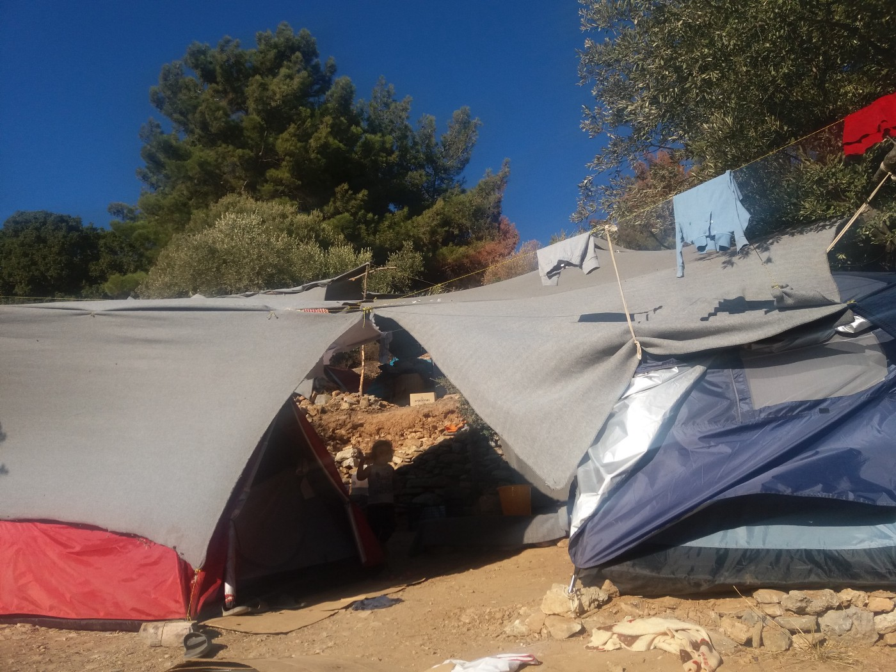

### AYS SPECIAL: Living in a state of shock on Samos

_According to some estimates, there are almost 4000 people in and around the camp in Vathy, Samos island\. The capacity is around 700\. There is not enough water, medical or psychological help, and the overall depression is spreading from the camp to the small city\. Although the rainy season is coming, nobody has any plans for the future\._

Samos port\. Over 4000 refugees stranded on the island, waiting to find out about their future\. Photo AYS\.

The bumpy, winding road up the hill leads to the forest in Vathy, Samos\. The view from the road is spectacular: a beautiful old city, a port and the endless sea and sky, both same deep blue colour\.

But the road leads to the camp, encircled with wire and security cameras\. Before arriving at the main gate, on both sides of the road, on the steep hill, there are numerous tents and makeshift shelters and laundry hanging out to dry everywhere\. On the road and around the tents there are too many children\. Some are so small that they are still crawling\. Their tired parents are mostly just watching from their shelters, hiding their faces from the newcomers\. All of them have come to Samos, by boat, over the last month and a half\. Many more are inside the camp\.

Tent on the hill around camp in Samos\. Photo AYS\.

Officially, about 2000 people are living in the camp\. Unofficially, the number is close to 4000\. Of this number, at least 900 are children\. Some are living in overcrowded containers where often instead of eight, more than 12 people are living together\. Inside the camp there are also many tents, around 250 small ones and some big\. Around the camp, there are over 100 tents and makeshift shelters\.

Bogdan Andrei, one of the coordinators for the [Samos Volunteers](https://www.facebook.com/samosvolunteers/) group, has been living on the island for 17 months\. He claims that the situation has never been so difficult\.

_“I am afraid it will be even harder when the rainy season starts, and that is any day now\. Currently, there are more people and less support than ever before,”_ Bogdan expresses his worries, which are shared by almost everybody on the island — refugees, locals, volunteers, NGOs\.

The Samos Volunteers group is the only remaining international volunteer NGO on the island\. The group provides new arrivals with dry clothes and a basic arrival kit, among other activities\.

Life behind wire, with no clear plans for the future\. Photo AYS\.

**Arrival procedure**

Since mid\-August, new arrivals have been registered almost every day on Samos\. And all of them are sent to the camp or the tents around it\. Hardly anybody leaves the camp\.

On Samos, only the authorities and Frontex can approach new arrivals\. Those who have been through the “welcoming” procedure describe it as long and confusing\.

Upon arrival or rescue, people — often still in wet clothes — are taken to an isolated area for registration\. Depending on the number of people, the procedure can take several hours\.

The next step is a check of their bodies and belongings, followed by an info session with the UNHCR and local rescue and RIC teams, followed by medical screening\.

_“All this is happening while people are still in shock after a dangerous journey, and many can hardly understand what they are being told,”_ — Majida Ali, a Syrian who arrived on one of the boats over year ago, told us\.

One of the Frontex boats in the port\. Photo AYS\.

State of shock is the term used by one of the nurses we met who has been on the island for already several month working in the camp\. _“People go through a dangerous journey hoping to find safety on the other side\. And finally, when they arrive in Europe, they are placed in a prison\-like facility and taken to the camp, which also resembles a prison\. Some people told me they feel they are losing their dignity and humanity,”_ she said\.
### Deprivation of free will

Bogdan Andrei is one of the coordinators of However, they have recently been having problems approaching people, who are consequently left in wet clothes for hours\. “There is no specific reason or explanation for this,“ Bogdan said\.

Officially, new arrivals cannot leave the camp for 25 days\. This detention time is due to the illegal crossing\. Unlike on other islands, on Samos, this policy is not strictly implemented and people do get out and come back using the back gate at the very bottom of the camp\. That is where we meet and talk with some of them\. All in disbelief at the living conditions they have been placed in\. Some still believe they will leave very soon and be able to continue their journey\.

Inside the camp\. Photo AYS\.

_“In reality, what are we seeing every day is that the very first step for the new arrivals is to deprive them of free will,”_ nurse told us\. _“People are just being processed, taken to interviews, assessments, given clothes they cannot choose, placed in containers or tents, and deprived of any possibility of making decisions\. And it continues like that endlessly,”_ she explains adding that this treatment influences people’s mental health, creating a lot of problems\. _“Some even do not understand what is happening around them at all,”_ she adds\.

_“People living in the camp, those who have been there for a longer period, or new arrivals, have no information about anything,”_ Majida Ali describes the situation\. As a single woman, Majida was considered vulnerable and she left the camp some time ago\. She even got her asylum, but decided to stay on the island to try to help the people who are stranded on Samos\.

> Most of the people we met on Samos are living in a constant state of shock\. Those who are “lucky” enough to be in the camp are facing water shortages, unsanitary toilets and showers, dirt and different types of danger, especially for women and young children\. Some women, we were told, do not even use the toilets, especially at night, because they are afraid\. 

**A very dangerous place**

After several months spen in the camp, nurse we spoke with recalls that many people complain about different physical problems, _“but, when you talk to them you realize it is psychological issues they are dealing with\. There is the lot of PTSD, stress, depression, suicidal tendencies, self\-harm… Especially among the male population\.”_

Additionally, people are angry because of the living conditions they have been left in, and they do not see any light at the end of the tunnel\. This often leads to conflicts inside the camp\.

_“There is a lot of anger, and that is understandable\. Out of despair and anger, people often fight and it creates a very dangerous situation,”_ Majida explains, describing the camp as a _“very dangerous place”_ \.

New arrivals living in the tent down the hill from the camp\. Photo AYS\.

Additionally, residents are complaining about police violence\. In some cases, the police use extensive force or very offensive language\. Previously, we published a video showing police officers beating refugees in the camp\. As we were told, in August alone, four cases of police violence were reported to the authorities, and in one case the person involved is determined to go to court\. The others are mostly too afraid to pursue their cases against the local police\.

We were also informed about the strict policy of the management which forbids taking photos in the camp, even to residents\. _“We were told several times we cannot take photos,”_ one of the residents told us\. _“After some photos were published by AYS, the police raided the camp, taking our mobile phones and looking for videos and photos\.”_

The camp residents are taking photos nevertheless, aware that this is the only way to make the general public aware of the living conditions they have been left in\. But they are doing everything possible to hide these photos, afraid of the repercussions\. Repeatedly, we heard about threats of sending back people to Turkey or to detention\.
### Losing hope

In Samos port, we could see the detention centre from the outside, and it is a place that anybody would be scared of\. In an old stone house by the port, behind windows boarded up so that nobody can see inside and hardly any daylight can get in, there are people\. Anyone who comes close can hear their voices\. Only family members can visit detainees, but many of them are single men\. Some of the people we spoke to managed to see the inside of this place and they told us about people placed in one room, sleeping on blankets on the floor, and using one bathroom that does not have doors\. We were not able to check these claims\.

Samos volunteers are providing different activities in the camp and in their Alpha centre in the city\. They provide tea two times a day, a mobile library two times a week, activities for children, fitness for men, activities for women, language classes… Once a week, together with refugees, they try to clean the camp\. And with almost 4000 people inside, there is an enormous amount of waste\. It attracts animals, including jackals, but also snakes, rats, and mice\. The camp is full of them\.

The volunteers are struggling to address all the needs of the people inside\. One of the never\-ending problems is a lack of diapers and sanitary pads\. Since the introduction of the cash card system, it is expected that people will buy these for themselves\. With 90 euros per person a month, it is hardly realistic\.

_“Many people are losing hope in the camp and that is a huge problem,”_ Bogdan explains\. _“And the most difficult thing for everybody is that there is no plan, so far\.”_

In the evening, most of the people from the camp go to the city and walk along the shore, or just sit on the benches\. Some try to fish, sometimes hoping to provide a better meal, but mostly just to pass the time\.

The restaurants and cafes are, in most cases, reserved for tourists and locals only\. Many of these places do not permit refugees to enter, sit or even buy something inside\. Also, some hotels on Samos often refuse to let refugees in, even when asked to do so by the different organizations that are providing financial support for them to stay\.

One of the local residents, who is active in solidarity groups, tells us that at the very beginning, people were welcoming and open, but everything changed with time\. _“There is not enough information and communication, and nobody knows what is coming next,”_ he told us\.
### Intimidation and fear

Little is being done to overcome this situation\. Moreover, some of the practices on the island are very intimidating for refugees\. For example, the small military parades in the city centre every Sunday afternoon\.

Soldiers with guns on their shoulders and a military band parade up and down the main street, to the square where the anthem is played and the flag raised\. Refugees — many of whom fled from war — stand apart, while the atmosphere becomes clearly not very friendly\.

_“The only solution is to move people to better accommodation, but it is very difficult under these conditions,”_ local activists say\.

The other solution is to speed up the process of sending people to the mainland\. _“We need a serious decision to decongest the island\. With this number of people, it is unmanageable,”_ the SV coordinator concludes, urging all those responsible to do something, as winter is approaching\.

By Nidžara Ahmetašević

> **_We strive to echo correct news from the ground through collaboration and fairness, so let us know if something you read here isn’t right\._** 

> **_If there’s anything you want to share, contact us on Facebook or write to: areyousyrious@gmail\.com\._** 

_Converted [Medium Post](https://medium.com/are-you-syrious/ays-special-living-in-a-state-of-shock-on-samos-7896853bd2e3) by [ZMediumToMarkdown](https://github.com/ZhgChgLi/ZMediumToMarkdown)._
