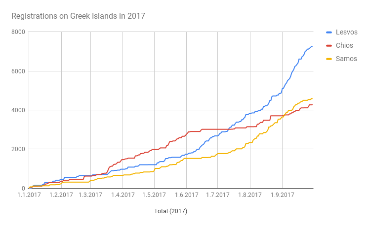

### AYS DAILY DIGEST 3/10/2017: Spain sentenced for illegal border practices

European Court of Human Rights judges immediate pushbacks as unlawful / Situation in Greek hotspots remains desperate / Arbitrary detention on Greek islands / More than 15,000 deaths in the Mediterranean since the Lampedua shipwreck in 2013 / French volunteers need support / AYS needs your help\!

 \(CC BY\-SA 2\.0\)](assets/36761f13f3a0/1*80cqxNOMwVXNeTRDSErTAw.jpeg)

“Refugees Welcome”\. Credits: Flickr/ [Johan Barbarà](https://www.flickr.com/photos/jbarbara/) \(CC BY\-SA 2\.0\)
### Feature: Push\-backs at the external EU\-borders are unlawful, the European Court of Human Rights rules

Even after runs on the external borders, immediate returns are against the law\. In today’s decision, the European Court of Human Rights made clear that even after crossing the border illegally, people have the right to an administrative or judicial decision\.

Two men from Mali and Côte d’Ivoire crossed the fence in Melilla and entered Spain on 13 August 2014 with a group of around 70 people\. The Spanish authorities apprehended them and immediately sent them back to Morocco\. The group was not given the opportunity to make use of any legal procedure or to ask for protection\. The court has now judged this practice as unlawful and not in accordance with the European Convention on Human Rights\. It sentenced the Spanish government to payments of 5000 Euro to each of the two plaintiffs\.

“The litigation against Spain has an impact beyond the individual case\. It sets a precedent in order to assert the fundamental right to have rights of refugees and migrants”, said Wolfgang Kaleck, General Secretary of the [European Center for Constitutional and Human Rights](https://www.ecchr.eu/en/our_work/international-crimes-and-accountability/migration/melilla/articles/melilla-17oct3.html) \(ECCHR\) association\. “The ECtHR judgment clarifies that Spain’s border regime violates human rights, because the Convention also applies at the external borders of the EU\.”

Spain approved the European Convention on Human Rights in 1977 and hence is obligated to accept the rulings\. According to ECCHR, the government now has to change the law on the “Protection of Public Safety”, which came into force in 2015\. It stated that people who try to cross to Ceuta and Melilla can be returned without further procedure, what is against the convention\. The full judgement can be found [here](http://hudoc.echr.coe.int/eng-press?i=003-5860634-7471863) \.

NGOs have often criticized this practice in the past\. Often it is hard to document push\-backs and the denial of the rights of protection seekers\. Such incidents have also been reported at borders — not only external ones — such as Greece\-Macedonia, Serbia\-Hungary, Denmark\-Germany, Germany\-Austria, Austria\-Italy or France\-Italy\.

There are currently some 600 people stranded in Ceuta\. Recently, 55 people have been relocacted within the country, Ceuta TV [reports](http://ceutatv.com/not/3203/55-migrantes-parten-desde-el-ceti-hacia-andalucia-castilla-la-mancha-y-madrid/#sthash.QVImAiC3.gbpl) \. UNHCR numbers indicate that more than 10\.800 people have entered Spain this year, almost 2000 in Melilla\.
### Greece

Even though the Greek authorities have transferred hundreds of people from the islands to mainland over the past few weeks, the hotspots remain overcrowded\. Autumn is on its way and still people, even vulnerable ones, have to sleep rough in summer tents\. To give further support, Help Refugees is requesting more [funds](http://bit.ly/HelpRefugeesDonate) \.

](assets/36761f13f3a0/1*auEgvsfc2CLHpDPSem1ZBg.jpeg)

Moria camp on Levos\. Credits: [Help Refugees](https://www.facebook.com/HelpRefugeesUK/photos/a.123267671367248.1073741830.111893659171316/497512567276088/?type=3&ifg=1)

There are more than 13,500 people stranded on the islands, while the official capacity is fewer than 6,000 for the reception centers\. With 4,609 new registrations, September was the month with the most new arrivals since the EU\-Turkey deal came into force in March 2016\. More than 3,400 have been apprehended by the Turkish authorities\. Lesvos has seen the highest increase during the last weeks, but also Chios and Samos are continually seeing new arrivals\. Human Rights Watch managed to get an inside view into Moria, where almost 5,000 people are stuck\.

New registrations on Lesvos, Chios and Samos in 2017\.

Today volunteers reported three boats on Lesvos, carrying 71, 33 and 14 people\. Even though a smallish speed boat had already reached Greek waters and the Hellenic Coast Guard had been informed, it was apprehended by the Turkish authorities and brought back to the coast\. The people are now imprisoned\. On Samos, the number of people who arrived was 57\.

As Advocates Abroad reports, the Greek police issued a circular targeting six nationalities for admissibility, detaining them because they are being considered as low aceptance nationalities\. “We have watched how this and other police circulars have permitted abuse and illegal interview practices,” the attorneys state, criticizing this practice\. The No Border Kitchen on Lesvos released a statement describing the unlawful practices\.

Skyschool will give an online course in Social Entrepreneurship in November\. Refugees all over the world between 16 and 25 years old can apply for it\. There are facilities in Athens, Amman and Kakuma Camp, but it is also possible to attend online only\. For more information check the homepage: [https://www\.skyschool\.world/apply](https://www.skyschool.world/apply)

### Bulgaria

Eight Afghans have been detained by the police on Trakia highway, Novonite [reports](http://www.novinite.com/articles/183796/8+Illegal+Afghan+Citizens+Were+Detained+on+Trakia+Highway) \. Also, two Bulgarian suspects accused of helping with logistics and transportation have been taken into custody\.

At Harmanli Refugee Camp, close to the Turkish border, volunteers are [raising](https://www.gofundme.com/HarmanliRefugeeCampPlaySchool) funds to keep their Play School running at least until July 2018\. The school was established three years ago\. The organizers request 6000 Pounds \(~6700 Euro\) \.
### Sea

■■■■■■■■■■■■■■ 
> **[UNHCR Italia](https://twitter.com/UNHCRItalia) @ Twitter Says:** 

> > Since #3october 's shipwreck in #Lampedusa, 15,696 dead and missing at #Mediterranean Sea.  Saving lives must be the top priority for all. https://t.co/DojHVI4PIz 

> **Tweeted at [2017-10-03 09:25:12](https://twitter.com/unhcritalia/status/915145701251801089).** 

■■■■■■■■■■■■■■ 

[Four years](http://www.meltingpot.org/Our-3rd-october.html) ago 368 people lost their lives when their boat capsized off Lampedusa \(a detailed report in Italian can be found [here](https://askavusa.wordpress.com/03102013-il-naufragio-della-verita/) \) \. In several ceremonies and demonstrations, citizens and instituions remembered the drama\. But four years on and after more than 15,600 people lost their lives at see while seeking refuge and a better life, the European Union has done almost nothing to support people in need\. On the contrary, deals with countries like Turkey or Libya are aimed at locking people in on the other side of the sea and preventing them from entering European Union territory\.

■■■■■■■■■■■■■■ 
> **[Comitato 3 ottobre](https://twitter.com/C3ottobre) @ Twitter Says:** 

> > In tantissimi, cittadini e studenti, in marcia a Lampedusa per ricordare tutte le vittime innocenti del #Mediterraneo #3ottobre https://t.co/T7HDnVJSFK 

> **Tweeted at [2017-10-03 07:36:40](https://twitter.com/c3ottobre/status/915118386509729792).** 

■■■■■■■■■■■■■■ 

Due to the worsening weather, 215 people in two boats had to wait for 15 hours before they were rescued off the coast of Garabulli in Tripolitania\. The Libyan Coast Guard brought them back to Tripoli, from where they have been transferred to a detention center in Tajoura, infomigrans [reports](http://www.infomigrants.net/en/post/5365/libyan-coast-guard-rescues-215-stranded-at-sea-for-15-hours) \. Another 140 were more lucky and disembarked from Cassiopeia in Pozallo, Italy\.

■■■■■■■■■■■■■■ 
> **[UNHCR Italia](https://twitter.com/UNHCRItalia) @ Twitter Says:** 

> > #Pozzallo 140 persone recuperate da nave #Cassiopea @[ItalianNavy](https://twitter.com/ItalianNavy) stanno sbarcando ora. Tempo in peggioramento nel #Med centrale. #3Ottobre https://t.co/Ln5kDVJuW9 

> **Tweeted at [2017-10-03 07:32:15](https://twitter.com/unhcritalia/status/915117278315859968).** 

■■■■■■■■■■■■■■ 

In our digest of last [Friday](ays-29-09-2017-the-consequences-of-the-eu-turkey-deal-cd255b4d93fa) we reported about the situation in Pordenone\. We have now been forwarded information with needs in Italy, including Pordenone and Rome\. If you are willing and able to contribute, you can download the [Needs List](https://lookaside.fbsbx.com/file/DONAZIONI%20RICHIESTE%20-%20SUPPLIES%20NEEDED.xlsx?token=AWxuq3C2RqbBHldyBFyYaoT1oJYLaVdD10yCcoUA4iHi9OF8WXtSSIVn5A4-UYg4TEjKN420yGjuFFd4hDIyA9USWnAI8buPEY0kMa5UMJStKaqNOlLTzCrf3MTa6fYzLizOzQOmD1eiRfXCuOoiTmy0Yy0yZIPm8-sRlOnkj6acmWPanKufzhO9v7Es2JAYWFo) \. In case you are operating onsite and are in need of support, you can use a [form](https://docs.google.com/forms/d/e/1FAIpQLScwU1aBAatO-vynPwKcTK2UkU1WCSdYvk3ZC_RFjtP2OEwQ7Q/viewform) and submit your request\. It will then be shared in the [Italy — Refugee Crisis](https://www.facebook.com/groups/1834254390190027/) group\. The needs for Pordenone are:

Winter sleeping bags
 Mid\-size backpaks
 Mid\-size men’s jackets
 Men’s shoes 41–42–43–44
 Mid\-size sweaters
 Men’s underwear
 Toothbrushes, toothpaste, shampoo
Contact: [Lorena Fornasir](http://www.facebook.com/lorena.fornasir)

In Rome, Baobab is requesting 20 sleeping bags a week to support people sleeping rough\. You can contact [Elena Seina](http://www.facebook.com/eseina?) \.
### France

The Refugee Community Kitchen has been obligated to meet restaurant standards if they want to continue their work\. They are serving more than 2,500 warm meals a day for people in Northern France and now want to build a new kitchen\. For that purpose they are raising funds and have also published a recipe in their [newsletter](http://mailchi.mp/6e9712521092/newslettershoutout-126837) \. They have distributed more than 1\.5 million meals since they were founded in 2015\.

](assets/36761f13f3a0/1*ldfxPLpr756STq0EYWOnAw.jpeg)

RCK at work\. Credits: [Refugee Community Kitchen](https://www.facebook.com/refugeeCkitchen/?hc_ref=ARS0rBZD-izSCAlWE951Kszcib8vn4WQTcKzJIvyk4VAeqop-Qe0xSmP0RCDjSAoYB0)

In Paris, the [volunteers of La cuisine des migrants](https://www.facebook.com/lacuisinedesmigrant/?hc_ref=ARSDO2pJSYAK0Vpr6apM-jWBFAq4cJF0WJ_6azO4bfSo7RIQQwsmZVIjQh8own8v__A&fref=nf) are asking for more helping hands\. They serve 450 to 500 meals a day\.

A 19\-year\-old French man was convicted to 3 months in prison with parole for helping four people in need\. He picked them up with his car in Saorge \(Alpes\-Maritimes\) and drove them to the home of Cedric Herroux in Breil\-sur\-Roya\. His lawyer announced he would appeal the verdict, [RTL](http://www.rtl.be/info/monde/international/nice-trois-mois-de-prison-avec-sursis-pour-avoir-aide-quatre-refugies--958333.aspx) reports\.
#### AYS needs your help\!

Please speak your mind and fill out this survey so we can better understand what news is needed and how\! ❤ Go to the survey [here](https://goo.gl/forms/MfkXERqvkHeqWHfo1) \!

> **_We strive to echo correct news from the ground through collaboration and fairness, so let us know if something you read here isn’t right\._** 

> **_If there’s anything you want to share, contact us on Facebook or write to: areyousyrious@gmail\.com\._** 

_Converted [Medium Post](https://areyousyrious.medium.com/ays-daily-digest-2-10-2017-spain-sentended-for-illegal-border-practices-36761f13f3a0) by [ZMediumToMarkdown](https://github.com/ZhgChgLi/ZMediumToMarkdown)._
