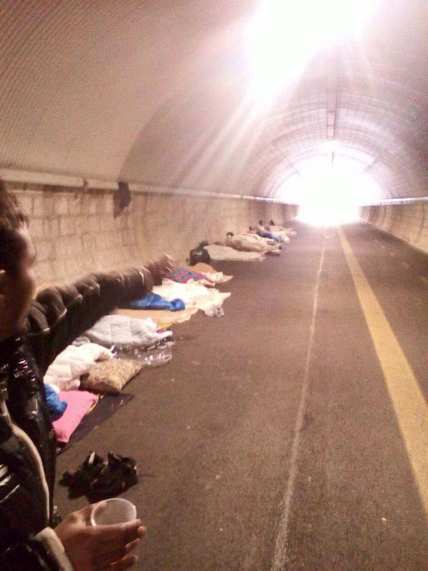
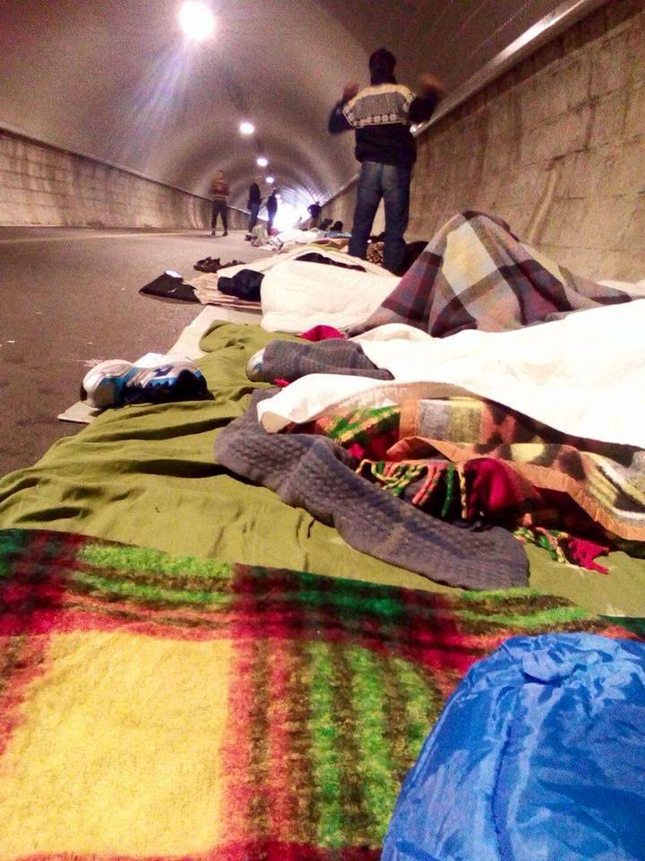
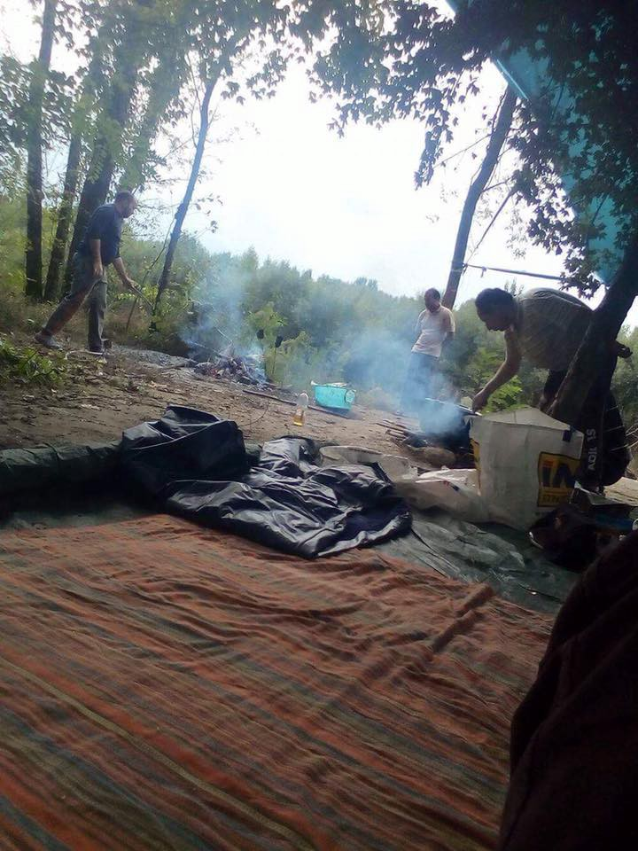
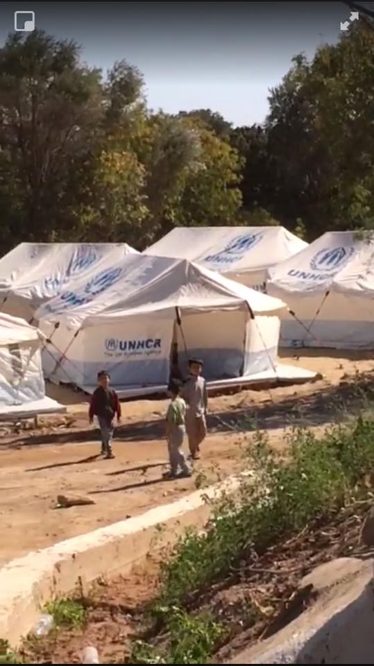

### AYS Daily Digest 04/10/17: Situation deteriorating in the north of Italy
#### _Call for help from Italian volunteers / Some camps in Greece still in tents ahead of winter / MSF report on border violence by EU police / AYS meets representatives of EC over report on illegal practices of Croatian authorities / Calls for donations and volunteers_

 \)](assets/67b8c1b6bd93/1*VzlN_pULffRad6RDazmitw.jpeg)

Gorizia \(Photo by [Serena Visintin](https://www.facebook.com/profile.php?id=100013155397152&fref=gs&hc_location=group_dialog) \)
### FEATURE: Situation deteriorating in the north of Italy

The situation is dire in the north of Italy\. Arrivals to the Gorizia area continue, at least 5 to 15 a day at the local gallery, volunteers say\. The local officials place a certain amount of people in various structures\. There are always between roughly 20 to 50 refugees sleeping in the photographed area\. There is another group sleeping in another similar place\. There is a continuous shift of people staying\. The usual route goes from the street to Caritas lodging, the Hub, CAS or Cara di Gradisca, and, if everything goes according to the usual practice, a person sleeps at least five nights in the street\. There are also those who have lost their accommodation \(through leaving one of the state [programmes](ays-daily-digest-28-6-17-they-decide-the-others-die-277e82b42baa) or for other reasons\) and continuously sleep rough\.

**The local volunteers call for help:**

> Blankets, sleeping bags, sleeping mats, towels 

> Medicine, like aspirin, paracetamol and painkillers 

> FOOD — Basmati rice, tomato sauce, vegetable oil, spices, chilli, pulses \(chickpeas, beans, lentils …\), vegetables \(onions, garlic, potatoes, etc\. \), cheese, fruit \(bananas, apples, etc\. \), bread, tuna, chicken, eggs, tea black and green, sugar, milk, flour, brioches, biscuits, drinks\. 

> SHOES — preferably sneakers \(men’s\) numbers: 40–41–42–43–44–45 

> TOILETRIES — toothpaste, toothbrushes, shaving cream, razors, soap, shampoo 

> CLOTHES — Winter Clothes \(for men\) size S\- M\-L: sweatshirts, jeans, trousers, shirts, jackets, boxer shorts \(size S\-M\-L\), socks 

> Backpacks, trolley suitcases 

One group of volunteers distributes milk and biscuits in the morning and frequently distributes cooked meals in the wooded area of Gorizia and Gradisca\. Another groups distributes an evening meal, though there is not always enough for everyone\.

**Health care in the Gorizia area:**

There is a presence of paramedic volunteers who help with injuries and health issues, and the most serious cases are taken to the Red Cross for additional assistance\. The **Red Cross** is located at **Via Codelli 9** in Gorizia\. They are **open two days a week, Tuesday and Thursday morning, doing general checks\.** Refugees can go on their own or accompanied by volunteers; for the worst cases, there’s the hospital\.

Volunteer and independent nurses are visiting the migrants sleeping in galleria \(they are not necessarily connected to the Red Cross\) \. Recently, a person affected by epilepsy managed to enter the Hub \(San Rocco\) after 5 days of insisting\. The Red Cross has so far never visited the people staying in the gallery\.

Unfortunately, according to our sources, most of the pathological problems like fleas, rash, and mycosis are in fact often contracted in the dormitories managed by Caritas\.

[L’ ALTRA VOCE](https://www.facebook.com/L-ALTRA-VOCE-1245970425495921/?hc_ref=ART0TVSNCwlJNfN-B55se_ijLoyc1d8WmWmttG2uQPGyGp1UrFTRJIKoKPDG8FArEOA&fref=nf) is one of the volunteer groups active in the area\. There is also an available [network list of links](https://www.facebook.com/groups/1834254390190027/?fref=gc&dti=982554681802511&hc_location=ufi) to groups for refugee help in the Friuli region and a number of other initiatives\. If you are able to help, please contact the local volunteers to coordinate the help so that any action would be as effective as possible\.

\(Photo by uncredited volunteers\)
#### LIBYA

Over the past few days, Libya’s coast guard has rescued two boats in distress off the coast of Garabulli in Tripolitania\. The 215 people on board, including many children, women, and seniors, were taken back to Tripoli, InfoMigrants [reports](http://www.infomigrants.net/en/post/5365/libyan-coast-guard-rescues-215-stranded-at-sea-for-15-hours) \. 
Each person had reportedly paid between 1,000 and 3,000 euros to get on the boat, all were to be transferred to a detention centre in Tajoura\.
#### GREECE
#### New arrivals

One refugee boat carrying 33 people arrived to the north coast of Lesvos yesterday evening around 10pm\.

One refugee boat carrying 46 people was picked up around midnight in front of Farmakonisi\.

Another boat that landed on Leros had 46 people on board\.
### Chios

With most of the organizations pulling out from the island—if they haven’t already—centres are closing, volunteers on the ground say\.

“Souda camp is almost empty\. Vial is overflowing; tents have had to be set up in its periphery\. The frequency of the bus service between Vial and the town has been cut; there is talk of stopping it altogether by the end of the year\. 
So refugees are all crammed way outside of town; existing resources all remain in town; access to them has been curtailed by lack of transportation; volunteers and organizations are not allowed in Vial — and most are not allowed to distribute outside of it either\.
Meanwhile arrivals continue\.”

\(Screenshot from a video by CESRT\)
### Derveni: ahead of another winter under tents

**Extreme temperatures, extreme living conditions, mental health issues…**

A number of refugees rose again lately in a camp previously set to close\. 
Despite the promises of Greek officials that Derveni camp would close in the spring of this year, it is still open, with people living in tents\. Reportedly Derveni is the only camp of this sort on mainland Greece\.

As of mid\-September, there were 210 residents in the camp, among them 10 families with a total of 18 women and 23 children, Refugee Support Aegean reports\.

> Refugees who currently live at this place, fear that increasing numbers of residents might soon cause more problems to them, as living conditions are already poor and many people suffer from psychological problems\. At the same time the sanitary infrastructure is already insufficient despite recent efforts to repair broken toilets and bring new ones\. The refugees told us, that most of the times, there is no hot water, a problem of major significance with winter getting closer\. 

Read the entire story on the situation in Derveni [here](http://rsaegean.org/winter-threat-looms-over-the-forgotten-refugees-in-derveni-camp/) \.
### Asylum process: translation

[Mobile Info Team](https://www.facebook.com/mobileinfoteam/?ref=gs&hc_ref=ARTRuq1yPhNBAgr3Z0XZRl12WRY32kMnKtwJ9bTes84M9Bh3r3Fo_PFqN4WxZ8latIU&fref=gs&hc_location=group) has an update on the importance of establishing good communication with the translator in charge of the particular asylum case\. Please find this text in other languages [here](https://www.facebook.com/mobileinfoteam/posts/2043263509235701:0) \.

> By far the most important part of your asylum procedure is the big asylum hearing \(asylum interview\) \. In the next weeks, we will compile some useful tips for what is important for your asylum hearing\.
 

> One of the most important persons in the asylum interview, apart from the asylum officer, is the interpreter\. It is absolutely essential that before the interview starts you make sure that the interpreter understands you and your accent, and that you also understand him or her\. Be sure to communicate to the interpreter, in the case that he/she doesn’t understand something you say, that he or she must ask you again and not just assume he or she got what you meant\. Also, make sure that the interpreter is translating everything you say and is not just summarizing your statement\. If you have the feeling that there are misunderstandings between you and the interpreter, or that he or she is not translating what you say correctly, please tell this to the asylum officer\. 
 

> You always have the right to ask that the translator gets replaced\. 

### Translators wanted

[InterVolve](https://www.facebook.com/InterVolve-219418945063168/?hc_ref=ARRJEHYebI9SFoUIK3KGbV6ubYoWPYNjkIlr520gd9Hp5lWFrCaAvoijxzUrbXMsFEI&fref=nf) team needs Arabic, Sorani, and Kurmanji speakers to join the team working alongside communities at Larissa\-Koutsochero Camp\.

_We are looking for individuals who can assist with interpretation and translation as well as support our projects in adult learning, community involvement and integration, and to facilitate women’s and children’s activities, and distributions\._

For more information and steps on how to apply, please follow [this link](https://l.facebook.com/l.php?u=https%3A%2F%2Fdocs.google.com%2Fdocument%2Fd%2F185vWgjeWIkTcJsEGbjTau-5iSt30Z5y3xGsSaIui0To%2Fedit%3Fts%3D59aebe10&h=ATOfRKb2B3v1NE1s4oWFQ4tQkzvfQJagssBD3mpYgAex_d7I9Y2sFkxlBrhvL8P9u5_Z6TjqZZ9hHcFj52EWKYmQriFpirmY5Klk2Uydh7aU8COAylw61wA38yRfwHBA8SDgDTyQZn8qsf0R_EqqWzrWi9s4QA4jwIxM1sb4udg-8BwqTf6N3zVcSa43VF3pRLsH6E9VZ68Hvc_8USyzXOoyigcMPLWBYAzjsWLZqM45kIY4Fr6x6vSRRpjRC53kSjs3jVywzBtEnVlOGTJS3D2IravGXbHyrB0h3w) \.
#### SERBIA
### Violence by the EU border police continues

We keep reporting about the police violence perpetrated by Croatian authorities in the border areas with Serbia and beyond, forwarding other volunteers’ reports and sharing accounts of those who have been through such horrible experiences\.

Unfortunately, this practice has not only persisted among the officials, but has become a standard MO that everyone seems to be immune to by now\.

The MSF team in Serbia [writes](http://www.msf.org/en/article/balkans-children-repeatedly-abused-border-authorities) that they have been exposed to the violence that continues to be perpetrated on children and young people by European Union Member State border authorities and police on [Serbia](http://www.msf.org/en/where-we-work/serbia) ’s borders with Hungary, [Bulgaria](http://www.msf.org/en/where-we-work/bulgaria) , and Croatia\. There findings have been organized in a new report, titled [_Games of Violence_](http://www.msf.org/sites/msf.org/files/serbia-games-of-violence-3.10.17.pdf) \. The report uses medical and mental health data alongside the testimonies of the MSF’s young patients in detailing the violence that is such a common occurrence along the border regions\.

> “For the children and young people trying to leave Serbia today, violence is a constant and the overwhelming majority is perpetrated by EU Member State border police” _— Stephane Moissaing, MSF’s Head of Mission in Serbia\._ 

> “For more than a year our doctors and nurses have continued to hear the same, repetitive story of young people being beaten, humiliated, and attacked with dogs for desperately trying to continue their journeys\.” 

■■■■■■■■■■■■■■ 
> **[MSF Sea](https://twitter.com/MSF_Sea) @ Twitter Says:** 

> > Almost 1/2 of @[MSF](https://twitter.com/MSF)'s patients in #Serbia are kids under 18. The majority are travelling alone or were separated from family on the road. https://t.co/syZ4lEMt8t 

> **Tweeted at [2017-10-04 09:07:25](https://twitter.com/msf_sea/status/915503615892213760).** 

■■■■■■■■■■■■■■ 

> It’s disgraceful that EU Member States are intentionally using violence to deter children and young people from seeking asylum in the European Union”, says Stephane Moissaing\. “It’s not stopping these kids from trying but it is causing serious damage, both physical and psychological, making them more vulnerable and pushing them back into the hands of the smugglers the European Union and the Member States claims to be fighting\. 

#### CROATIA
### EC met with AYS and CMS over latest Report

AYS and CMS have met the representatives of DG Migration and Home Affairs today in Zagreb\. The meeting was initiated by the Commission after reading our report on the unlawful practices by the Croatian Ministry of Interior and Security Intelligence Agency \(SOA\), who issued minimum 44 negative decisions to asylum seekers mainly from Syria and Iraq, including very young children\.

These decisions are based on the unexplained opinion by SOA that claims the existence of security obstacles in these cases and invokes the article 41 of the National Security Vetting Act that, according to their interpretation, envisages that SOA does not need to provide the reasons for this claims\. Since the files are classified as RESTRICTED, the lawyers of the asylum seekers do not have access to them and cannot make a proper appeal\. Administrative Court in Zagreb has annulled these decisions by the MoI in all cases where the plaintiffs came to the Court hearing as unfounded\. However, instead of granting the asylum based on merits \(in all cases the conditions for this were fullfilled\), it returned the cases back to MoI/SOA\. All the people affected by these arbitrary decisions are Dublin deportees\. 
We are now waiting for the EC reaction to these practices\.
#### HUNGARY

The European Commission sent a reasoned opinion on the Hungarian NGO Law following their [letter of formal notice](http://europa.eu/rapid/press-release_IP-17-1982_en.htm) sent on 14 July\. The EC had decided to start legal proceedings against Hungary for failing to fulfill its obligations under the Treaty provisions on the free movement of capital, due to provisions in the NGO Law which indirectly discriminate and disproportionately restrict donations from abroad to civil society organizations\. They also say that Hungary violates the right to freedom of association and the right to protection of private life and personal data enshrined in the Charter of Fundamental Rights of the European Union, read in conjunction with the EU Treaty provisions\.

Hungary now has one month to take the necessary measures to comply with the reasoned opinion\. If Hungary fails to reply satisfactorily to the reasoned opinion, then the Commission may refer the case to the Court of Justice of the EU\.

In the meantime, Viktor Orban says he would rather help Romania build a fence on its eastern border than have Hungary build one on its border with Romania, as he expects Romania will be the next country on the “refugee route,” Hungarian media have [reported](http://a Jamaican man died on Tuesday while he was being held at Morton Hall immigration removal centre in Lincoln. It is the third such death in less than a month and human rights campaigners have expressed alarm at the incident. The prisons and probation ombudsman has begun an investigation.) \.
#### ITALY
### 2016 vs\. 2017

Official statistics have been published regarding the number of refugees who have arrived on Italian soil in the previous year, compared to the actual data gathered until October 3\.

The stats include: 
\- graphs showing the number of arrivals until now and parallel, the number of arrivals registered in the same period in 2016;
\- geographically, presence of refugees by different regions in the country in percentage;
\- the number of disembarkments in different ports of Italy;
\- the number of newly arrived people, by the country of origin
\- the number of people relocated to another EU country, as a part of the relocation scheme in the past two years, until September 18;
\- the number of unaccompanied minors who arrived to Italy on boats and were officially registered during the year, until September 19\.

You can view the statistical data [**here**](http://www.interno.gov.it/sites/default/files/cruscotto_giornaliero_3-10-17.pdf) **\.**
#### GERMANY
### Co\-drivers needed

Our volunteer friends from [Signal of Solidarity — Flüchtlingshilfe](https://www.facebook.com/SignalofSolidarity/?ref=gs&hc_ref=ARRef8fE06jJPrwzJVCrxo7-lOLUvtSqjdI7DqB4f35AvdFgdv5NLV9kecWfOPJEbL0&fref=gs&hc_location=group) in Germany are doing another solidarity action by van, heading towards France\. They are looking for a fellow traveler to join them and share driving along the way: from Bremen to Paris\.

> In Paris blankets are urgently needed\. Since our van, Ernie, is back since last weekend, we can plan our next actions\. Due to the urgency we will drive to Paris tomorrow to deliver the 500 blankets, we received through the Bremer Council for Integration, to [Danika Jurisic](https://www.facebook.com/profile.php?id=100009499466124&fref=gs&hc_location=group) and [Paris Refugee Ground Support](https://www.facebook.com/PRGS.team/?ref=gs&fref=gs&hc_location=group) \. For this trip we have one seat left: If you are spontanious and want to join us, please leave us a message\. We will start on Thursday around midnight\. We are happy to share more details with you in direct contact\. 

> Further we’re planning our next, less spontanious, actions\. We will share details with you as soon as possible\. 

If you are interested in joining and and helping out, please write to: info@signalofsolidarity\.de\.
#### SWEDEN

The 106\-year old Bibihal Uzbeki, also called “the world’s oldest refugee” was [today granted a temporary residence permit](https://l.facebook.com/l.php?u=http%3A%2F%2Fwww.aftonbladet.se%2Fa%2Fv0JJL&h=ATORvWJ92RBwxsbe366fJ4n_AwodoalohT1pnm9d_7RTi_mwmtLzvf6l8NYc5hmvb3Yyzn-O_p84leXMHXQoxUDQkB-azxEJM-ubLybWCkUrscDefaK_LUc0z6QPMMdSspqvwSPGCrzkbmCG2mpFGpXpANOrHOjbnHPOnOlYA-JZ-mMC_NJ1RoBTBDT0eFS8UKLfdmrRErL5-_Oxm1SxHweNhWK_Oan5G4wA8WtDLF4_j9VRpYdM2VBVqgFBTo88HYPHGf6inFxoqQyIMySzk6mdnTs) after her appeal in the migration court in Gothenburg\. As [AYS have mentioned before](ays-daily-digest-19-8-2017-sweden-no-country-for-old-people-937ef7669a49) , she came to Sweden in 2015 together with her son and other close relatives where she applied for asylum\. Earlier this year she got her first negative answer from the Migration Agency, who claimed that she could return safely to Afghanistan together with her relatives\. Age isn’t a good enough reason for the Swedish authorities to grant someone protection and some peace at the final stage of life\. Obviously negatively impacted by the answer, Uzbeki suffered from a stroke and stopped communicating completely, which hadn’t been the case before\.

The permit she now was granted is valid for 13 months, which is the new standard in Sweden since last year, when the authorities decided to change their rules to the EU\-standards\.
#### UK

A man died on Tuesday while he was being held at an immigration removal centre\. It is the third such death in less than a month and human rights campaigners have expressed alarm at the incident\. The prisons and probation ombudsman has begun an investigation, the media say\. The investigation revealed other incidents of mistreatment of vulnerable detainees including those who were suicidal\.
### AYS needs your help\!

Please speak your mind and fill out this survey so we can better understand what news is needed and how\! Find the survey [here](https://goo.gl/forms/MfkXERqvkHeqWHfo1) \!

> **_We strive to echo correct news from the ground through collaboration and fairness\._** 

> **_Every effort has been made to credit organizations and individuals with regard to the supply of information, video, and photo material \(in cases where the source wanted to be accredited\) \. Please notify us regarding corrections\._** 

> **_If there’s anything you want to share or comment, contact us through Facebook or write to: areyousyrious@gmail\.com_** 

_Converted [Medium Post](https://areyousyrious.medium.com/ays-news-digest-04-10-17-situation-deteriorating-in-the-north-of-italy-67b8c1b6bd93) by [ZMediumToMarkdown](https://github.com/ZhgChgLi/ZMediumToMarkdown)._
