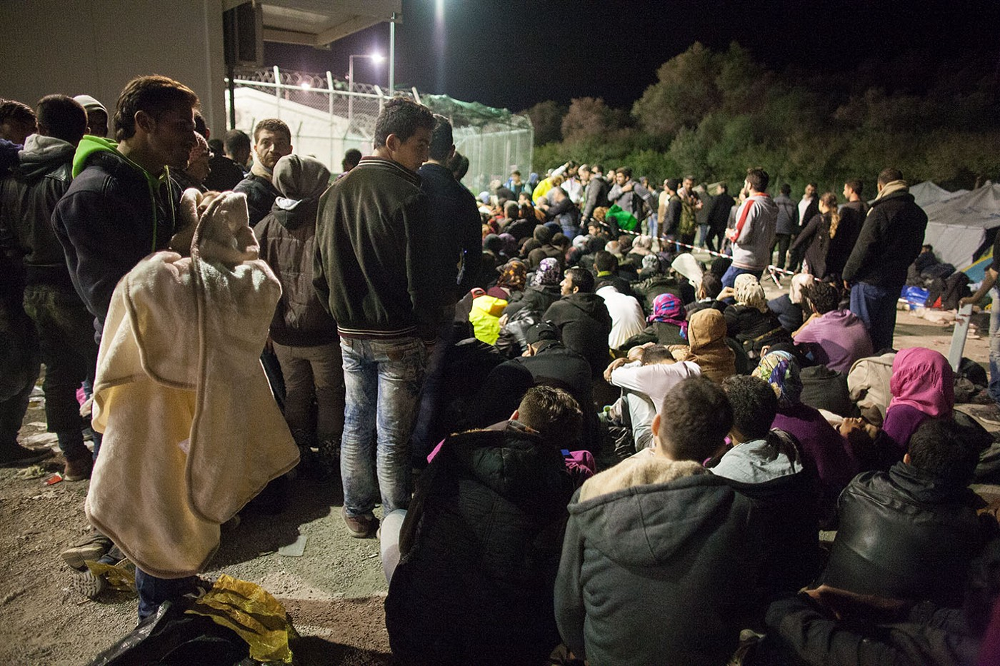
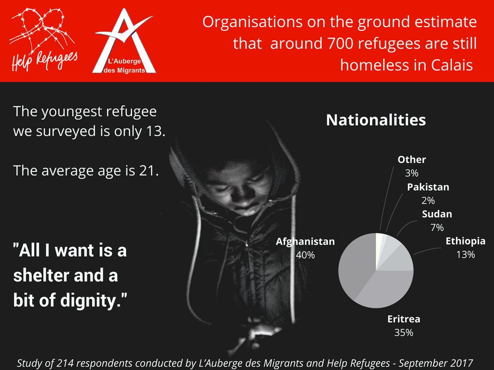
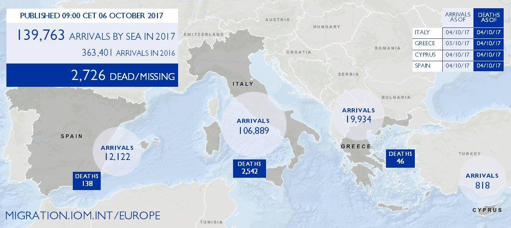

### AYS Daily Digest 06\.10\.17: Moria overcrowding reaches tipping point
#### A report on Iraqi refugees’ movements to and from Europe // HRW publishes report on war crimes trials pertaining to Syrian Civil War // Hungarian government spreads yet another Soros conspiracy theory // Croatia to take in 150 refugees from Turkey // Switzerland signs deal to deport people to Tunisia // Judge in Lille orders eviction of camp, no alternative place of residence provided // IOM releases latest data on movement across the Mediterranean

Refugees waiting to be registered in Moria in 2015\. The overcrowding of those days is once more an issue\. Photo Credit: Salinia Stroux
#### Feature

Overcrowding on the hotspots of the Aegean islands has been an ongoing issue for quite some time, one that Greek authorities seem either unable or unwilling to fix\. The problem is worst in Moria on Lesvos\. The camp, which was created to host 2,000 people, is currently housing 5,000, two and a half times above its capacity\. According to Human Rights Watch, this has led to widespread abuses and difficulties, such as a shortage of water for children and abuse against women\. The HRW representatives who spoke to the Greek parliament also [stated that](http://www.ekathimerini.com/222196/article/ekathimerini/news/rights-group-challenges-govt-over-moria-migrant-camp) there are no shower facilities for people with limited mobility\.

This severe level of overcrowding is preceded by the largest movement of refugees from Turkey to Greece in a very long time, numbering nearly 5000 people in the month of September\. Even with a limited flow of people into the country, the Greek bureaucracy was failing to process applications and organize timely relocation for refugees whose status as asylum seekers had been confirmed\. There is no lack of housing on the mainland, this is, simply speaking, a result of foot\-dragging by the Greek authorities\. With winter on the horizon, it is difficult to imagine the troubles that will take hold on the islands\. UNHCR has brought attention to the fact that the facilities on the islands are woefully underprepared for winter, with 1,500 in Moria alone living in makeshift tents without so much as proper flooring or insulation\. Last winter saw subzero temperatures, and if the status quo continues unabated in the face of a similarly cold winter, one can scarcely imagine the grave difficulties ahead for refugees\.
#### Iraq
### REACH study researches Iraqi movement to Europe — and back home

REACH has [released a report](http://www.reachresourcecentre.info/system/files/resource-documents/reach_irq_grc_report_iraqi_migration_to_europe_in_2016_june_2017.pdf) on the movement of Iraqi refugees to and from Europe\. The study finds that the number of returnees to Iraq has grown greatly \(12,776 official returns according to the IOM\) as the strength of ISIS continues to wane\. But many of the returnees came home not necessarily because they feel safe, but rather because of problems in Europe or due to personal factors\. The report also found that many returnees face financial hardship, as they had spent a great deal of their available assets to make their way to Europe, and so many are in need of economic assistance\. Psychological help is also a need for many among them\. It is clear that the scars from the war will haunt those affected for years to come\.
#### Syria
### HRW releases report on atrocities trials being held in Sweden and Germany

The ongoing Syrian Civil War has been the site of countless atrocities, both past and present\. Reports of war crimes and human rights violations, committed primarily by government forces but heftily contributed to by other actors as well, have been streaming out of the country from the very origins of the conflict, from the early days of regime forces firing upon peaceful demonstrators in 2011 to long drawn\-out sieges and attacks against civilian populations\.

With the ongoing war, it is difficult to see how justice could be dealt against perpetrators of atrocities\. However, in Europe, the process is underway to target those with blood on their hands\. These procedures are the focus of a [new report issued by HRW](https://www.hrw.org/sites/default/files/report_pdf/ijsyria1017_web.pdf) \. The report covers the ongoing process that is taking place in the German and Swedish criminal justice systems\. On September 25, Sweden sentenced the first war criminal, a former member of the SAA who posed with his foot on the corpse of a victim\. The process is far from easy however, and there are many bumps in the road, such as the difficulty of finding definitive evidence of wrongdoing while Syria remains a war zone\. It is a fraught process, but one hopes that justice will be served in the long run\.
#### Greece
### Two incidents on Samos

We have received a report of two serious incidents on Samos\. The first was the death of a person from epilepsy, allegedly as a result of the failure of an ambulance to arrive in a timely manner\. In the second, there was supposedly a piece of iron in a refugee’s meal\. The metal was swallowed and the person has been hospitalized\. We are awaiting more information\. But if this information is true, this, in conjuncture with the other issues found on the island, may very well serve as a catalyst for larger issues\.
### Truck Shop needs new coordinator in Thessaloniki starting from November

Truck Shop is looking for a volunteer who can spend at least a month administering the project\. In addition to availability for at least one month, the ideal volunteer must speak English fluently, must be able to cover the cost of living expenses, have previous experience working in the NGO sector, and must be able to drive\. Inquiries and applications should be sent to mobileclothesproject@gmail\.com\.

### Open Space Community Center searches for volunteers

Open Space has pitched a tent in the Greek town of Drama\.
### Numbers

Lesvos: 86 arrivals, 30 on the north coast and 56 on the south coast\.

Chios: 50 arrivals yesterday at 9pm\.

Leros: 33 arrivals\.

Kos: 11 arrivals\.
#### Serbia
### Refugees share stories of police brutality, the difficulties of life

Two mini documentary films have been released on the struggles of refugees in Serbia, in particular at the hands of the police\. The first deals with police harassment in Subotica, produced by Refugeless, and the second about refugee child minors who are treated in the MSF clinics in Serbia, that we [previously reported about](ays-news-digest-04-10-17-situation-deteriorating-in-the-north-of-italy-67b8c1b6bd93) \. 
Both are very short and give a good idea of the troubles that one faces as a refugee in a country that normalizes violence against you\.

[ - Acoso policial en Subótica (Serbia)")](https://vimeo.com/237075100)

■■■■■■■■■■■■■■ 
> **[MSF International](https://twitter.com/MSF) @ Twitter Says:** 

> > Almost 1/2 of our patients in #Serbia are kids -18. The majority are travelling alone or were separated from family. [msf.org/en/article/bal…](http://www.msf.org/en/article/balkans-children-repeatedly-abused-border-authorities) https://t.co/C4Uf4EdJuk 

> **Tweeted at [2017-10-05 13:04:04](https://twitter.com/msf/status/915925558294224896).** 

■■■■■■■■■■■■■■ 

#### Hungary
### Orbán lashes out against infringement proceedings, Hungarian media blames Soros

The EU has been building a case against the Hungarian government following the passage of a law which forces all NGOs which receive outside funding to label themselves as “foreign agents”\. The European Commission found that this goes against the EU’s principles, and therefore it cannot stand\. Meanwhile, the Hungarian media have been conflating these moves with a “Soros plan” to dismantle Hungarian border fences and to flood Europe with refugees\.

Billionaire George Soros, often the target of conspiracy theories \(often with heavy antisemitic elements\) which portray him as a puppet master working behind the scenes, had made suggestions for managing the refugee crisis which have been taken by the Hungarian government to be a comprehensive plan\. The Hungarian government has sent its citizens a [consultation form](https://budapestbeacon.com/soros-plan-national-consultation-questions/) to have them vote on the nonexistent plan, featuring outlandish elements such as the destruction of European languages and culture and turning a blind eye to crimes committed by refugees\.
#### Croatia
### Croatia pledges to take in 150 refugees

The Croatian Minister of Interior Affairs said that his country will welcome up to 150 refugees from Turkey\. Although the 2\-year project of the EU member states has officially ended, “as a member state that supports the principle of solidarity and fair distribution of responsibility, during 2018 we can relocate an additional 100 refugees and stateless persons,” the minister stated\. According to the Ministry’s official communication, 30 Syrians, mostly families, will arrive in Croatia by December 8 and they hope to manage more\. We also hope the conditions for receiving people will get better in the meantime\. Following the current practice, the families will be placed in the reception center in the town of Kutina\.
### Renovations to begin in Hotel Porin

The reception center in Zagreb \(Hotel Porin\) continues to struggle with maintenance problems\. The authorities said they would begin repairs starting from the coming week, beginning with the dormitories and corridors\. Electrical devices are still being confiscated due to a poor electricity system which might be compromised if the residents continue using their own electronic equipment such as fridges and kettles\. The washing machines should arrive in the next two months, according to the responsible organization\. We hope that it will happen sooner and that the availability of the machines will be fair and will suffice for the needs of the people staying there\.
#### Austria
### Mass deportation to take place on October 10

There is to be a charter flight deporting refugees from Austria and Sweden to Afghanistan\. The flight is scheduled to depart on October 10, and this will certainly be a mass deportation\. Deportations from Austria are currently very frequent, the most recent case having taken place on September 30\. However, the recent cases have been deportations of individuals accompanied by two or three police officers\. The number of Afghan refugees taken to deportation centers continues to increase\. The police is making a concerted effort to capture people whose asylum claims have not been approved, and there are reports of racial profiling of pedestrians in public places\. It is important that people organize to protest these actions, and to all those who are at risk of deportation, we send our solidarity and wish them luck\.
#### Switzerland
### Switzerland signs 100m franc deal with Tunisia to prevent migration

A representative of the Swiss government signed a deal in Tunis, promising the country 100 million francs worth of investment over the next four years\. The deal is similar to other deals made by the EU with countries such as Libya and Mali, whereby the countries agree to retake all nationals who make their way to Europe and are deemed ineligible for refugee status\. Officially, 1,600 Tunisians have thus far been repatriated to their home country\. Tunisia serves as a particularly strategic point to target because it is also the site of departures across the Mediterranean\.
#### France

An infographic on homeless youth in Calais\.
### Judge orders eviction of refugees by October 13

On Thursday, a judge ordered the evacuation of a camp in Lille, without a guarantee of alternative accommodation for residents\. The residents of the camp near the Saint\-Sauveur train station number approximately 200 people, many of whom are confirmed to be minors\. This ruling is without precedent, and predictably elicited demonstrations by the residents of the camp\. As part of the justification for the closing of the camp, the judge recalled an incident on June 7, when a small fire was caused when refugees were heating food\. They were forced to do this for themselves after the organizations which had been servicing their needs were compelled to withdraw\. The camp had been consistently growing since then as a result of the closure of associations which had previously provided housing for minors \(35 confirmed\) \.

### Afghan refugee teenager needs your help\!

A 19\-year\-old Afghan refugee is currently living in a hotel in Paris, but he will be forced to leave tomorrow\. Donations have helped him to secure a spot for 10 days, but he will be living on the streets once again starting tomorrow unless he can secure more money\. [Sarah Fenby\-Dixon posted](https://www.facebook.com/groups/P2PParis/permalink/1488559257897610/) about his situation, and has offered to provide receipts to prove that the money is being spent at a hotel\. If you are able to donate, please send funds to Sarah’s Paypal at sarahfenby@outlook\.com\.

[Sarah has also made](https://www.facebook.com/groups/P2PParis/permalink/1487743167979219/) a post asking for medical supplies to be delivered to refugees\. The needed items are as follows\.

— Strepsils
 — Eye/ear drops
 — Iodine
 — Scabies cream
 — Ibuprofen gel
 — Fungal cream
 — anti acid tablets
 — vaporub
 — oblas oil
 — sudo cream
 — vitamins
 — emergency blankets
 — lip sore cream
 — athlete’s foot cream
 — steripods \(saline\)

If you are able to donate any of these items, please send Sarah a message to figure out the logistics of delivering them\.
#### UK
### Workshop for asylum seekers to take place in Belfast

Right to Remain and Belfast Unemployment Resource are working together to give asylum seekers a footing in the procedure\. The event is scheduled to take place on Wednesday October 11, from 4 to 6 pm\. The workshop will provide an overview of the asylum system and the hurdles that applicants face\. Refugees will also be helped with preparation for their asylum interviews\. The event is limited to 35 places and will be English language only, so participants must have at least an intermediate knowledge of the language\. To register, please see the Facebook event below or email Claudia at Claudia\.Belloni@burc\.org\.

### Refugee Council releases guide for submitting homelessness applications

The Refugee Council has published a handy guide to help people without a roof over their heads to apply for shelter to their local authorities\.

#### Italy
### Report highlights the vast number of areas outside of the formal reception system

An Italian language report commissioned by MSF has created a map of the “non reception” areas in Italy, underlining those regions and provinces where migrants are forced to sleep on the streets and are outside the formal reception system\. As you can see, in Friuli Venezia Giulia \(where Gorizia and Pordenone are located\) migrants sleeping on the streets or outside the reception system is a common phenomenon in every province\.

### Police evict residents of makeshift camp in San Ferdinando

On Friday morning before 8 AM, police, with the support of CGIL and USB union representatives, went to the makeshift camp in order to facilitate evacuation\. The hundreds of people living there were forced to queue to register and eventually be moved to the new official camp or the tents outside the building\. By the time the post was published the demolition had not yet started and bulldozers were not present\. No valid institutional alternatives are being implemented other than moving the workers from one camp to another\.
#### Mediterranean

The latest figures on migration in the Mediterranean\.
### IOM releases latest infographic on migration in the Mediterranean

The above map gives the most essential figures in a most concise manner\. As of October 4,139,763 people have crossed the Mediterranean into Spain, Italy, and Greece, with at least 2,726 deaths occurring\. Italy is by far the largest destination, with nearly 107k arrivals thus far\. This route is also the deadliest, having incurred a total of 2,542 casualties\. Greece and Spain have also seen an uptick in arrivals\. The Spanish route has been growing in popularity as a result of new strict patrols off the coast of Libya, where captured refugees are then jailed in awful camps run by militias\.
### MEDU\-Medici Per Diritti Umani creates interactive map of refugee routes

### AYS needs your help\!

Please speak your mind and fill out this survey so we can better understand what news is needed and how\! Find the survey [here](https://goo.gl/forms/MfkXERqvkHeqWHfo1) \!

> **_We strive to echo correct news from the ground through collaboration and fairness\._** 

> **_Every effort has been made to credit organizations and individuals with regard to the supply of information, video, and photo material \(in cases where the source wanted to be accredited\) \. Please notify us regarding corrections\._** 

> **_If there’s anything you want to share or comment, contact us through Facebook or write to: areyousyrious@gmail\.com_** 

_Converted [Medium Post](https://areyousyrious.medium.com/ays-daily-digest-06-10-17-moria-overcrowding-reaches-tipping-point-7bc241b770e1) by [ZMediumToMarkdown](https://github.com/ZhgChgLi/ZMediumToMarkdown)._
