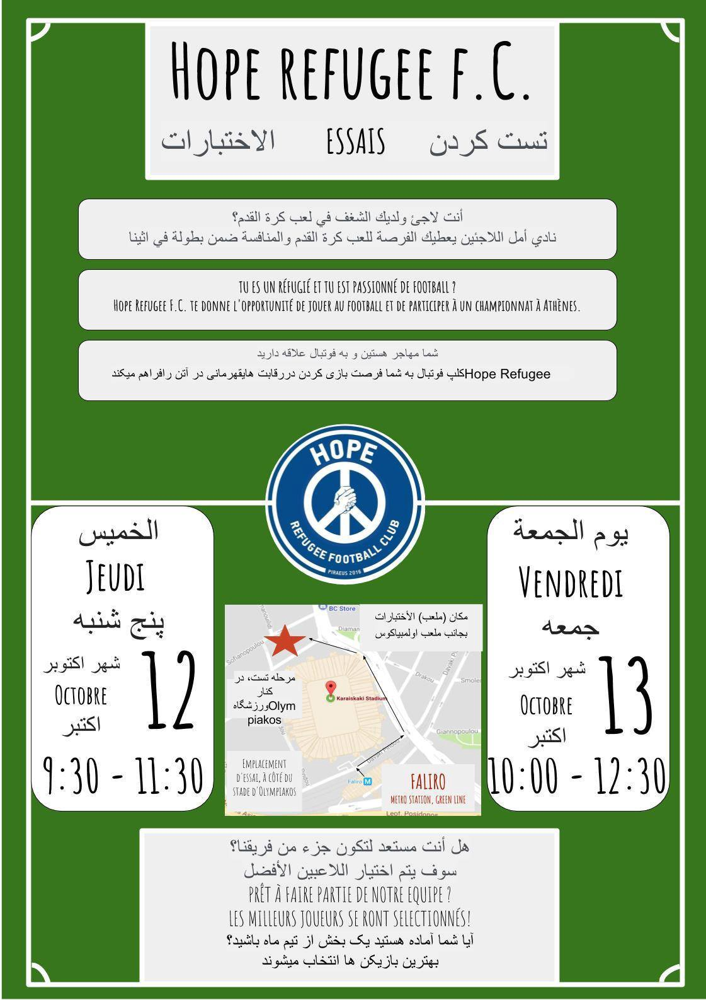

### AYS Daily Digest 10/10/17: Alarming mental health situation
#### Moving people from islands to mainland Greece is an imperative, MSF claims / harsh conditions for a growing number of detained refugees in Libya / Turkey’s official number of pushbacks rises to 700 / Camps will be closing in Greece / protests against deportations to Afghanistan in Sweden / Help needed in France / more information, stats and calls for volunteering

](assets/65c5d710afb2/1*pfAVevnQQthpREjE5yr_lg.jpeg)

Photo: [**Refugee Info Bus**](https://www.facebook.com/RefugeeInfoBus/)
#### FEATURE

Serious neglect, dire living conditions and resulting behavior and consequences have created mental health emergency for asylum seekers on the Greek islands, MSF has stated in a report [Confronting the mental health emergency on Samos and Lesbos](https://reliefweb.int/sites/reliefweb.int/files/resources/2017_10_mental_health_greece_report_final_low.pdf) \. They clearly state that the scale of the needs for mental healthcare and the severity of patients’ conditions have overwhelmed the capacity of mental health services on the islands\.

> “These people have survived bombing, extreme violence and traumatic events in their home countries or on the road to Europe, but shamefully it’s what they face on the Greek islands that leads them into despair, hopelessness and self\-harm\. Every day our teams treat patients who tell us that they would prefer to have died in their country than be trapped here\.” 

Through other volunteers, groups and individuals, AYS is in contact with a number of people who have seriously been affected by their experiences in the EU provided shelters and camps, by the violence they have experienced with the EU member states’ police officials, and ultimately by the conditions and state in which they’re living in the EU\. Already prior to this they have been exposed to various stress factors that influenced their mental health and what seems to be considered as “providing a refuge” while waiting in a system that does not provide for their needs, and often exacerbates or inflicts trauma rather than starting to heal it\. Many young people have been damaged by their experiences during the time spent waiting and on the route\.

Their exposure to war, violence, torture, forced migration and exile, as well as the uncertainty of their status, seems to be overlooked in the vast majority of plans, strategies, and policies developed by the EU\.

> The Situation is not getting better\. The weather is getting colder, the camps are getting more crowded and the organisations, working on the ground are reaching their limits\. — [_One Happy Family — Community Center, Lesvos_](https://www.facebook.com/OHFLesvos/?hc_ref=ARQ0-jsej_yk0nTz_98dmhlLefu23QxxdT4pFwzaEYOOuG44tm4yu9gVL8D3XI8cMjk&fref=nf) 

■■■■■■■■■■■■■■ 
> **[MSF Sea](https://twitter.com/MSF_Sea) @ Twitter Says:** 

> > It's hard enough to take the first step towards mental health care, virtually impossible when the wait for the care you need is 8 months. https://t.co/4ffZ4dq70X 

> **Tweeted at [2017-10-10 15:12:35](https://twitter.com/msf_sea/status/917769838856196096).** 

■■■■■■■■■■■■■■ 

The story of a refugee who tried to commit suicide today in Koutsochero camp in Greece should be a reminder to all of us of the mental health crises that needs to be addressed in refugee populations throughout Europe, and a wake\-up call for policy makers ignoring this issue\.

> Just take a minute to think how many things we do not learn because people are imprisoned\. — _NoBorders Greece_ 

The [ERCI — Emergency Response Centre International](https://www.facebook.com/ercintl/?hc_ref=ART3VM_On_lGVF1cxYMSmn3lVOG6ey0hNETXp4AbHAPK8dok6ndILr4lKhiHIDBUzaA&fref=nf) also confirm the need for mental health care:

> It is important to address the mental health of refugees, as mental illness brutally controls the running of a person in many ways and can often contribute to poor physical health\. 

> Families being separated for years, under family reunion delays\.
 

> Inadequate medical or psychological care\.
 

> Being trapped on the Islands\.
 

> Isolated Camps\.
 

> Massive Unemployment\.
 

> Homelessness
 

> Waiting for decisions on legal cases\.
 

> These are just some of factors that are causing so much pain, on [\#worldmentalhealthday](https://www.facebook.com/hashtag/worldmentalhealthday?source=feed_text&story_id=2031958837039534) , among refugees in Greece\. — _[**Refugee Info Bus**](https://www.facebook.com/RefugeeInfoBus/?hc_ref=ARTEFGRDUjEcjiKY2vDtxBzZ3eNs0pi_7-Pd8mAHjhHPJkHtjWjDvk9KHzAN0NRGRtw)_ 

#### LIBYA
### Conditions worsening for thousands of refugees stuck in Libya

Widespread abuse and dire conditions of the detentions centres around Libya are likely to worsen as the centres’ capacities are extended with recent arrivals of the people who are being redirected after the recent clashes in the most prominent point of departure in Libya — Sabratha\.

■■■■■■■■■■■■■■ 
> **[Mohamed Ben Khalifa](https://twitter.com/mbenkhalifaly) @ Twitter Says:** 

> > 3150 immigrants found in areas under the control of Ahmed Dabashi after withdrawal and the number is increasing #migrants #libya #Europe https://t.co/PUsTXvK1QD 

> **Tweeted at [2017-10-07 19:30:40](https://twitter.com/mbenkhalifaly/status/916747625415827457).** 

■■■■■■■■■■■■■■ 

[Reportedly](http://www.africanews.com/2017/10/10/un-assisting-thousands-of-stranded-migrants-in-libya-s-sabratha/) , the UNHCR said it had approached Libyan authorities to ensure that refugees among the migrants were freed from detention\.

While yesterday the number of refugees estimated to be in the area was 6,00, but today the numbers have jumped to an estimated 10,000 migrants being held in the Sabratha area\. These people are held in unacceptably poor conditions, some having received no food or water for six days, according to official statements\.
#### TURKEY

Turkish Coast Guard officially announced the detection of “17 boat incidents involving refugees and migrants who were traveling to the Greek islands” during the first 10 days of October\.
**697 people were pushed back to Turkey\.**
#### SEA

■■■■■■■■■■■■■■ 
> **[IOM - UN Migration 🇺🇳](https://twitter.com/UNmigration) @ Twitter Says:** 

> > Breaking: 140,538 #migrants &amp; #refugees arrived by sea to Europe. 2,754 dead/missing ➡️ [missingmigrants.iom.int](http://missingmigrants.iom.int) https://t.co/QIW2ov83cK 

> **Tweeted at [2017-10-10 07:28:46](https://twitter.com/unmigration/status/917653116266405889).** 

■■■■■■■■■■■■■■ 

[Sea\-Eye](https://www.facebook.com/seaeyeorg/?hc_ref=ARTvWwgIs2ciz1m3pD0Y7GoJF9mrDpp7FQXdjuDHgA5R1yr9L-sWjm72e2tR3UMNaII&fref=nf) team saved 23 people in a SAR mission earlier today\.

■■■■■■■■■■■■■■ 
> **[SOS Humanity](https://twitter.com/soshumanity_de) @ Twitter Says:** 

> > UPDATE After two rescues there are now 173 people on board of the #Aquarius including 57 minors https://t.co/5RKpX7YlCG 

> **Tweeted at [2017-10-10 13:59:02](https://twitter.com/sosmedgermany/status/917751327068966913).** 

■■■■■■■■■■■■■■ 

#### GREECE
### Syrian chemical weapons cause of a child’s death in Greece

The death on Sunday of a 5\-year\-old Syrian girl at the Moria reception center on Lesvos was probably due to exposure to chemical weapons in her homeland, according to a coroner’s report released on Monday, media [reported](http://www.ekathimerini.com/222300/article/ekathimerini/news/chemical-weapons-suspected-in-syrian-refugee-death) \.
### Islands
#### Arrivals

According to sources on the islands, a boat with 44 people arrived on Lesvos, while 155 people landed on Chios in several boats today\.
There has been a great surge in arrivals lately, comparing September to August\. Police in Thessaloniki [said](https://l.facebook.com/l.php?u=http%3A%2F%2Fharekact.bordermonitoring.eu%2F2017%2F10%2F10%2Fgreece-sees-rise-in-refugee-migrant-arrivals-in-september%2F&h=ATO5THBTwab5RGUU2gZPHq0Hni2hZoAyFRqGgYojirrh-tHJZ0YZFKCQDL9MksRZPkoTQSUzKhSqlIZ5ig4Qiq3YHUF2RoeoKxBf1YJTgradYfyRi33FNFkll3uS3paWFfZGgCZDLh_TTsLFBhAR0hdN0RT0NP1P-mgrkTwnJ-U_7Y7APsw1jPcGw8i1or-uGTWkW5kpXQ7d9cP1BUpojEsO_1AgiLXUGH_6TQQTxTcAjPbKLu0QLq9MU48P7qXR) 2,428 people were recorded to have illegally entered Greece over the land border in September, compared to 1,497 in August\.
#### Alarming situation develops

“There is only one shower cabin, and even that is without hot water\. And we have drinking water only for a few hours daily” — [this](http://aa.com.tr/en/europe/refugees-on-greek-island-sleep-rough-as-winter-looms/932062) is one of the many worrying statements residents of the island camps in Greece are hoping will reach the right people in order to get at least the minimum living conditions in order not to fear for their lives and those of their children\.

> [Conditions on these islands](https://www.newsdeeply.com/refugees/articles/2017/10/10/greece-faces-a-rerun-of-its-refugee-winter-of-discontent) have been allowed to fester while the Greek government, local authorities, the E\.U\. and the U\.N\. refugee agency, UNHCR, take turns blaming each other\. 

Vulnerable refugees — including families with babies, elderly women in wheelchairs and people with mental health issues — are struggling without heating, electricity or hygiene due to overcrowding in the refugee camp in Samos, and situation is not much better elsewhere on the islands\.

■■■■■■■■■■■■■■ 
> **[msfgreece](https://twitter.com/MSFgreece) @ Twitter Says:** 

> > Οι συνθήκες στις οποίες ζουν οι αιτούντες άσυλο στα ελληνικά νησιά συνιστούν συνεχές τραυματικό στρες. #refugeesgr 

> **Tweeted at [2017-10-10 11:58:49](https://twitter.com/msfgreece/status/917721075634638848).** 

■■■■■■■■■■■■■■ 

> “European and Greek authorities are directly responsible for this suffering\. People’s extreme vulnerability and the complete failure of systems on the islands leave them with no other choice\.” 

#### **Become a volunteer lawyer on Lesvos**

[European Lawyers in Lesvos](http://www.europeanlawyersinlesvos.eu/how-to-become-a-volunteer-lawyer/) are looking for new team members\.
Lawyers who would like to participate in the project should meet the following criteria:
- Able to spend a minimum of three weeks in Lesvos;
- Training and/or experience in Asylum Law and the law of international protection;
- Proficiency in English required\.

If interested, please fill in the [application form](http://www.europeanlawyersinlesvos.eu/wp-content/uploads/2016/06/European-Lawyers-in-Lesvos-Application-form-for-volunteer-lawyers-3.docx) and submit it to info@europeanlawyersinlesvos\.eu
They are currently welcoming applications from potential volunteers for t he period 1 November — 31 December 2017, as well as for the period 1 January — 31 March 2018
### Closing of the camps

We have received information about several camps that are to close soon, among them Elefsina in about 10 days, a week afterwards closing of Trikala is planned and other 3 will follow, one at a time each week\. According to the sources, the residents are to be lodged according to the accommodation scheme and/or in the so called permanent sites, that is camps planned to have people staying there beyond the coming year\.

■■■■■■■■■■■■■■ 
> **[Mobile Info Team](https://twitter.com/mobileinfoteam) @ Twitter Says:** 

> > Updated UNHCR data on unaccompanied minors in Greece. Find info here:
#refugeesgr #humanrights #refugeecrisis
[data2.unhcr.org/en/documents/d…](https://data2.unhcr.org/en/documents/details/60150) 

> **Tweeted at [2017-10-10 09:45:00](https://twitter.com/mobileinfoteam/status/917687400758784002).** 

■■■■■■■■■■■■■■ 

### Athens
#### Workshops for refugees — finding a job

_Where to find job opportunities?_ 
_How to identify jobs that are right for you?_ 
_How to prepare for an interview in Greece?_

Workshops and CV consultations take place from Monday to Friday at Konstantinoupoleos Street 44 — map: [https://goo\.gl/maps/9DSUvSQfH4U2](https://l.facebook.com/l.php?u=https%3A%2F%2Fgoo.gl%2Fmaps%2F9DSUvSQfH4U2&h=ATPjmMkBuAXzH7T_kRqKAI6T4b5-aof43pCbNVPOl1QmEndStr88eBbyMpvb_75H37du8TRnL5_aPEZPec0EI6HxP54T1Fx4lJMMVsEgVUn_s2VrtM0HmFuzRexnZ1lB2yGemSbl46N9pCd5_5UlefyhI7MhkXfdbO7vBnuBx7cgTRPbgsJ2lxLHqm9KKKt-1IuKN9PXmfcFTHAiyhAsjuw7HY-RONy7mpJQWXzsKOt3_Vlv7fEtMMY5Hca8syPcot6evNx3RO-w72eZyYm9Y42n2ZKceBpBHsOK0Pk)

To sign up for a workshop in Arabic, message Basil Garaa at basil@organizationearth\.org

To sign up for a workshop in Farsi, message Amin Rustaqi at amin@organizationearth\.org

If you are interested in a workshop in English, Urdu or Pashto, message Dimitra Giazitzi at dimitra@organizationearth\.org
Please find detailed information and text in other languages [**here**](https://www.facebook.com/refugee.info/posts/1542601539133321?hc_location=ufi) \.

 \)](assets/65c5d710afb2/1*-agDBQ3-Vy7WKRn26fOKwQ.jpeg)

Join Hope Refugee FC, Athens’s 1st football team consisting of refugees & asylums seekers\! Are you a refugee/asylum seeker & passionate for football? Come to Hope’s try outs, on Thursday Oct 12th & Friday Oct 13th\. \(Source: [Hope Refugee FC\-Αθλητική Ελπίδα Προσφύγων](https://www.facebook.com/HopeRefugeeFC/?ref=gs&hc_ref=ARRh5QPsMHsPHdG9EOqpxELYzmgWZcIadBPDtF_yv9Fc1aAq4rFm9RisE10hF7EyruI&fref=gs&hc_location=group) \)

[Refugee Biriyani & Bananas](https://www.facebook.com/RefugeeBiriyaniAndBananas/?hc_ref=ARTgsUlxSshiwleGhDVumgRqUmVFDc0SIMblnZIWBYnXIuubG64Ro6ncgwf4LeR_5Zc&fref=nf) are [calling for support](https://l.facebook.com/l.php?u=https%3A%2F%2Fmydonate.bt.com%2Ffundraisers%2Fhumanitariancrisiseurope&h=ATPD7lb1Lfx5fy5G4bpOLxhdZ3sU7bHVJrYZJ8tXZnOzXR0-OAWy6EPDEPGt15GBa1jrFcuahVeUsfOzVsMmnDpFeZBaUZa70eNkk3PE9XgSzDo_2zodoIinEkNf19HjfYF4MIZYUmboUVkuwYhodZUtqcshubnSUbnCLpqyltM70PCRwvVfLkzeCgxhww2HrLF3ElBxgHFEthWjG-G53LNNtzJTJcJ3vrSq8vhxR_4rSmWaUpTmo8PrnKDZE3J8lN47t0iLm5N5kiiMWCwn8IlTPTz8H_gmv2bBDg) in order to raise funds for immediate help in areas where refugees are most affected by cold weather and dire living conditions, both in Greece and Iraq\.

> We support camps and people who are the most vulnerable\. We support those camps and people who lack help from the government and NGOs\. 
 

> The upcoming winter is already causing anxiety as there is a lack of official winterization so we try to fill the gaps\.
 

> We have to fundraise for heaters, thermal wear and shoes for those in Greece\.
 

> We have to send pallets of winter clothing and shoes for those in Northern Iraq\. 
 

> We have to provide vulnerable families with ill members, pregnant women and babies with apartments for respite\.
 

> We need your help to raise funds urgently\. 

#### “BALKAN ROUTE”

Violent and abusive behavior of the EU police officials continues, as told by MSF field teams from the areas in Serbia, with accounts from border areas with Croatia and Hungary\.

#### ITALY
### Those who choose to remain “stateless” to get deported

50 migirants from different countries of origin were taken by buses back to the _hot spot_ in Taranto, where they would be registered and deported from Italy\. These are only those among the approximately 120 people who were found at the public area in the city when the police stormed in and started checking them\. These sort of checks haven’t been happening for a while now, but according to the [media sources](https://www.riviera24.it/2017/10/ventimiglia-maxi-retata-della-polizia-in-stazione-50-clandestini-accompagnati-allhot-spot-di-taranto-267609/) , it was due to a “large number of Africans” reported from the city that the police intervened\.
#### FRANCE

According to the ground sources, members of the French National Police have destroyed a number of provisional sleeping places, simple tents and sleeping bags, of the refugees sleeping rough\.

](assets/65c5d710afb2/1*oilZzdCGACvAKWov0RD90w.jpeg)

Photo: [Brigitte Boitel](https://www.facebook.com/brigitte.boitel.50?fref=gs&hc_location=group_dialog)

Donations needed in the Dunkirk area, as volunteers report:

> strepsils
 

> saline pods \(10ml\)
 

> betadine
 

> ibuprofen gel
 

> ear drops
 

> anti histamines
 

> antacid tablets
 

> athlete’s foot / daktarin / miconazol cream
 

> scabies cream
 

> olbas oil
 

> lip sore cream
 

> vitamines 

> also there is a big need for compression bandages and steristrips 

> please pm [Joram Melissant](https://www.facebook.com/joram.melissant?fref=mentions) for shipping information and stock keeping\. 

](assets/65c5d710afb2/1*N0qlGKTeQEeP9TviGtFMGQ.jpeg)

Source: [Timothy Perkins](https://www.facebook.com/timothy.perkins.77)
#### BELGIUM

Volunteers in Belgium are asking for a solidarity action to raise awareness and possibly stop a young Sudanese man from being deported to Sudan tomorrow\.
They invite people to contact Turkish Airlines directly on social media, saying:

> Please do not fly Samir Mehl to be tortured in Sudan onto flight TK1938 tomorrow at 11\.20am from Brussels to Istanbul 

#### SWEDEN

There is a growing concern over a large number of deportations to Afghanistan lately organized by the authorities\.

An activist group has been calling for people to come on the evening of October 10 and try to stop a deportation of reportedly at least 9 people from Afghanistan who had been in the country for years\.

](assets/65c5d710afb2/1*qKKc9kCPmAROdxmEg_Xfwg.jpeg)

Event link with more information: [**here**](https://www.facebook.com/events/130753214243633/?acontext=%7B%22ref%22%3A%224%22%2C%22feed_story_type%22%3A%22308%22%2C%22action_history%22%3A%22null%22%7D)

At the same time they ask all young people and all people who are in the middle of their asylum procedure to stay home\.
There are also those actively working to prepare legal support for people facing deportations to Afghanistan\.
Calling for solidarity, they are also asking people for donations to help Afghans\.

 \)](assets/65c5d710afb2/1*Nrl-K0qsnSxJfNY3MeAb2g.jpeg)

A mother who witnessed her 18\-year old son being deported to Afghanistan, while she and her other child were allowed to stay in Sweden\. A number of dangers possibly await for her son in the country they escaped from\. \(Photo: [Abdul Ghafoor](https://www.facebook.com/abdul.ghafoor.378) \)

Read the story [**here**](http://www.goteborgsfria.se/artikel/131076) \.

> **_We strive to echo correct news from the ground through collaboration and fairness\._** 

> **_Every effort has been made to credit organizations and individuals with regard to the supply of information, video, and photo material \(in cases where the source wanted to be accredited\) \. Please notify us regarding corrections\._** 

> **_If there’s anything you want to share or comment, contact us through Facebook or write to: areyousyrious@gmail\.com_** 

_Converted [Medium Post](https://areyousyrious.medium.com/ays-daily-digest-10-10-17-alarming-mental-health-situation-65c5d710afb2) by [ZMediumToMarkdown](https://github.com/ZhgChgLi/ZMediumToMarkdown)._
