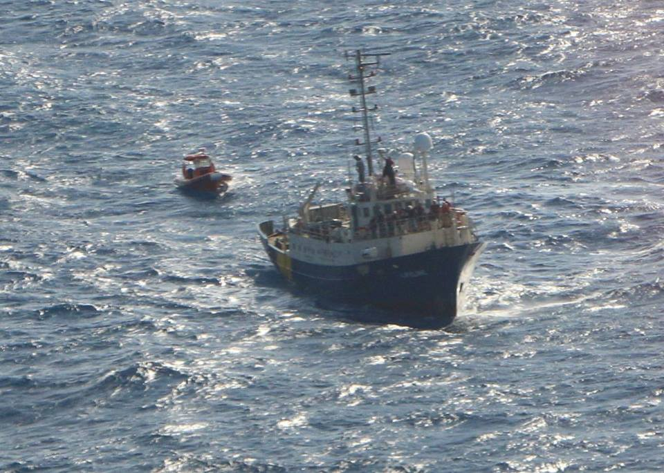
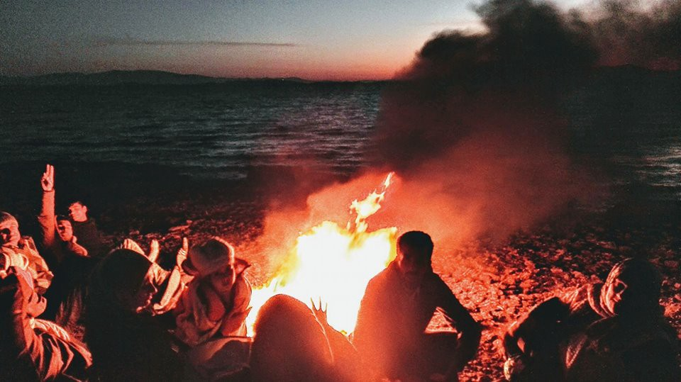
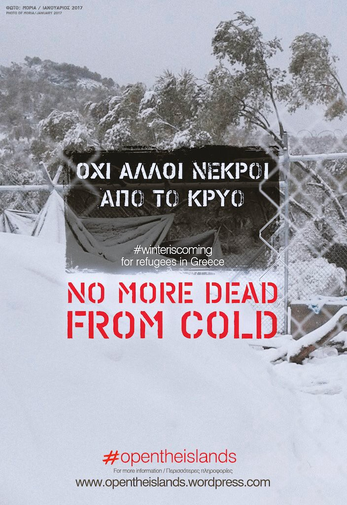
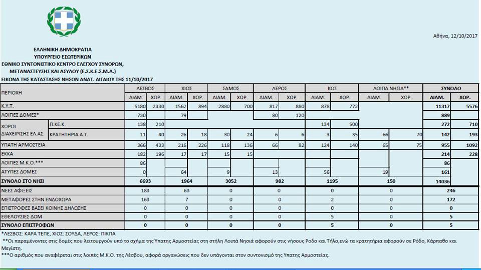
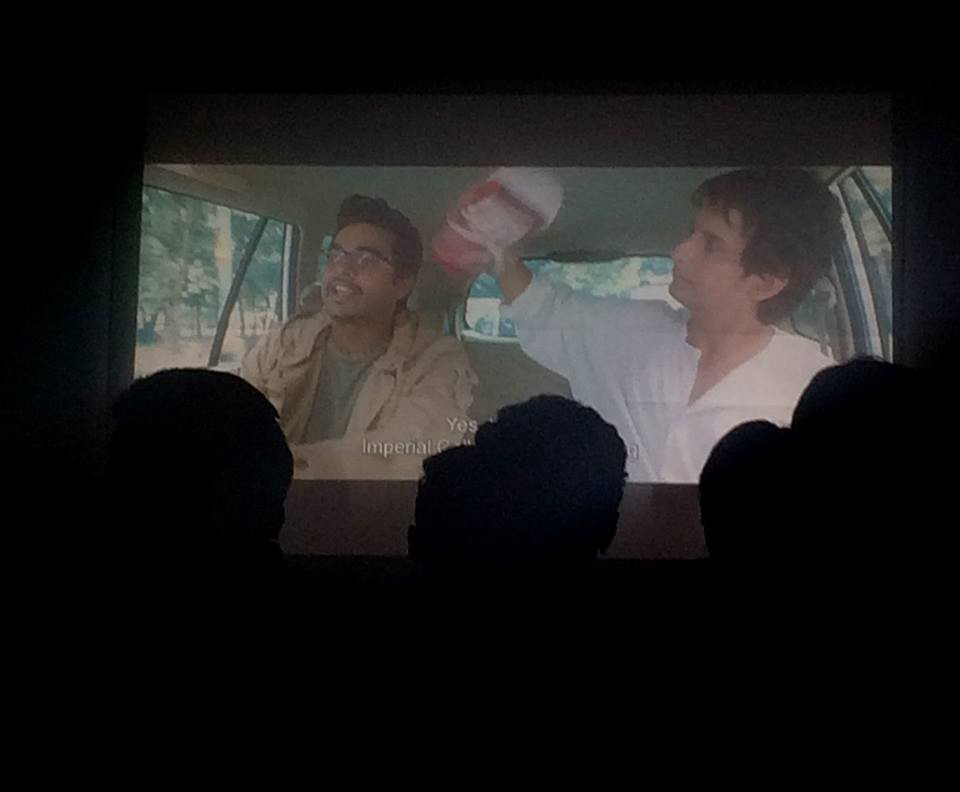

### AYS Daily Digest 12/10/17: Italy’s deal with Libya puts lives at risk

_Souda camp to close tomorrow / Greek islands overcrowding persists / \#opentheborder issue joint statement / Afghan family illegally deported to Finland / “Fantasy papers” given to refugees in Germany / And more news…_

![Where is Europe? Missing in the Mediterranean \(Artwork by Marilena Nardi \[Art Against\] \)](assets/6364c51beeac/1*N08RYvxie8FCfwLLQxmCCg.jpeg)

Where is Europe? Missing in the Mediterranean \(Artwork by Marilena Nardi \[Art Against\] \)
### FEATURE: Italy’s deal with Libya in contravention of Article 3 of Human Rights Convention

The Council of Europe Human Rights Commissioner Nils Muiznieks has [reportedly](http://www.dw.com/en/european-rights-chief-questions-italys-migrant-deals-with-libya/a-40916702) written to Italian Interior Minister Marco Minniti to ask what safeguards have been put in place by Italy to ensure it is not contravening Article 3 of the Convention of Human Rights\. The convention clearly prohibits the “exposure of persons to torture or inhuman or degrading treatment or punishment\.” Yet Italy has sent naval ships into Libyan waters to support the return of refugees to Libya, a country run by multiple militias with its own displaced population to look after\.

■■■■■■■■■■■■■■ 
> **[MSF Sea](https://twitter.com/MSF_Sea) @ Twitter Says:** 

> > This young man spent over a year in #Libya. He tells us he was shot, cut with a machete &amp; tortured, leaving him with a nasty leg wound https://t.co/ZDsLJNgksg 

> **Tweeted at [2017-10-12 11:26:50](https://twitter.com/msf_sea/status/918437800499965952).** 

■■■■■■■■■■■■■■ 

■■■■■■■■■■■■■■ 
> **[UNHCR Libya](https://twitter.com/UNHCRLibya) @ Twitter Says:** 

> > Desperate scenes yesterday in Dahman assembly point where #refugees &amp; migrants stranded in #Sabratha r being transferred! Needs r huge! https://t.co/bH27CUCa88 

> **Tweeted at [2017-10-12 04:59:39](https://twitter.com/unhcrlibya/status/918340362602676224).** 

■■■■■■■■■■■■■■ 

[The European Council for Foreign Relations](http://www.ecfr.eu/article/commentary_italys_u_turn_on_migration_polls_come_first) believe that the change in Italy’s approach to migration is largely down to the upcoming election and Minniti’s need to win over right wing voters — here at the cost of countless lives\. It is also part of wider EU policies to remove European borders to external countries, just as the UK did with France and the EU has done with Turkey\. Now it is with Libya, and it is true, this does alter migration routes, and the approach has lessened arrivals to Italy\. It also makes deaths more difficult to detect\.

The repercussions stretch further yet\. “Prevention as Deterrence,” originally a US strategy, actively uses peoples fear of dying \(based on the actual deaths of those who have gone before them\) as a preventative measure\. This means that it is not in Europe or Italy’s interest to provide safe passage or improve conditions in Libya\. People must die to prevent more people coming — this is the idea behind the policy\.

According to a recent [news conference](http://news.trust.org/item/20171012140555-o4idm/) given by Richard Danziger, the U\.N\. International Organization for Migration director for West and Central Africa, IOM has been spreading the word that “you do not want to get caught in Libya \[…\] What happens in Libya is far scarier to people than dying, the horror stories that returnees come back with\.”

It seems quite clear that these policies go against an even more fundamental right — Article 2 — The right to Life\. Without this basic premise there is nothing, and that is precisely how people seeking sanctuary are treated, as if they are nothing and deserve nothing\. For two years this situation has been described as a ‘crisis’ for exactly this reason, so that draconian measures can be brought in while the public are kept in a state of panic about migration figures by those who seek to further their own power\. In fact, Italy has the [lowest rate](http://ec.europa.eu/eurostat/statistics-explained/index.php/File:Foreign-born_population_by_country_of_birth,_1_January_2016_(%C2%B9).png) of citizens born in another country \(9\.7%\) of the main European countries, much less than Germany \(13\.3%\), the UK \(13\.3%\), France \(11\.8%\), Spain \(12\.7%\), Belgium \(16\.3%\), and Sweden \(17%\), but the truth seems to mean very little\.
### **SEA**
#### Press release from Sos Mediterraneé

SOS MEDITERRANEE have issued a [press release](http://sosmediterranee.org/sos-mediterranee-in-non-stop-action-seven-rescue-operations-in-36h-syrians-report-in-libya-money-is-extorted-from-you-depending-on-your-nationality/?lang=en) having completed seven rescue operations in the last 36 hours and saved 606 lives\. 40% of those rescued were children and many people reported experiencing violence, sexual abuse, and imprisonment in Libya, where Italy continues to support the ‘authorities’ in their efforts to detain refugees and prevent their escape\.

> The seven rescue operations carried out by the Aquarius over the past 36 hours and across a very large geographical area show that the humanitarian crisis in the Central Mediterranean is continuing\. The men, women and children rescued at sea, flee the chaos and violence in Libya\. 

> “Without a safe alternative they have no choice but to attempt the crossing along the deadliest maritime route in the world\!” — Sophie Beau, Vice\-President of the international SOS MEDITERRANEE network 

> She continued: “SOS MEDITERRANEE calls once more on national and European leaders to deploy adequate search and rescue means in the Mediterranean, so that people seeking refuge do not have to cross the Mediterranean in unseaworthy boats\. Faced with the lack of an adequate institutional rescue system, SOS MEDITERRANEE continues its mission at sea\. 

#### Support for SAR operation

\(Photo by Maydayterraneo — Proyecto AitaMari\)

[Maydayterraneo — Proyecto AitaMari](https://web.facebook.com/MAYDAYTERRANEO/posts/182460618969701?hc_location=ufi) report there being only three rescue boats in the central Mediterranean, a massive area to cover\. They ask for [support](http://www.maydayterraneo.org/apoya/) to continue their operations\.
### **GREECE**
#### New arrivals

 \)](assets/6364c51beeac/1*OIcsrkic_9KjMOBIBsbe1w.jpeg)

\( [Erik Gerhardsson](https://www.facebook.com/photo.php?fbid=10210399357199583&set=p.10210399357199583&type=3&theater&ifg=1) \)
#### **Registrations**

The official registrations for the day of October 11th are as follows:

Lesvos: 183 \(totalling more than 8,000 now this year\)

Chios: 63

Total: 246

The daily average so far this month stands at 149\.
### GREEK ISLANDS

Volunteers only found this group of refugees when they saw the fire they had made from their lifejackets\.

\(Photo by Ariel Ricker\)
#### Lack of mental health services on Lesvos persists

There continues to be a lack of mental health services on Lesvos\.

■■■■■■■■■■■■■■ 
> **[MSF Sea](https://twitter.com/MSF_Sea) @ Twitter Says:** 

> > On #Lesvos @[MSF](https://twitter.com/MSF) can take only the most severe mental health patients. 110 were added to our waiting list from 1/7 until 21/8 this year. https://t.co/nXHdXY05tQ 

> **Tweeted at [2017-10-10 12:37:08](https://twitter.com/msf_sea/status/917730718398271495).** 

■■■■■■■■■■■■■■ 

#### Dråpen i Havet calls for volunteers to relaunch beach watch program

[Dråpen i Havet](https://web.facebook.com/drapenihavet/posts/1833622219988552?hc_location=ufi) are in need of volunteers to restart their beach watch on Lesvos\. You need to be over 25, have a driving licence, be able to stay for at least 10 days, and have some experience with First Aid and rescue work\.

> The number of fleeing people that arrived on Lesvos doubled from August to September\. There’s very little help present on the shores, especially on the north side of the island\. 

#### House of Humanity calls for donations

House of Humanity needs [donations](https://web.facebook.com/leah.wild.106/posts/863346550490753?hc_location=ufi) to buy nappies\.

■■■■■■■■■■■■■■ 
> **[RSA](https://twitter.com/rspaegean) @ Twitter Says:** 

> > #Moria hot-spots is for 2300, it now holds 5180. Forced prostitution + abuse are a recurrent phenomenon, including children #opentheislands https://t.co/yXDDSzBDVl 

> **Tweeted at [2017-10-12 13:09:12](https://twitter.com/rspaegean/status/918463563030810625).** 

■■■■■■■■■■■■■■ 

#### Souda Camp closed

According to [local media](http://astraparis.gr/se-mia-skini-xorese-o-kataulismos-tis-soudas/) , Souda camp on Chios will be officially decommissioned tomorrow \(13/10/17\) having been cleared by officials and the police today\. The final phase will be carried out by UNHCR\. 62 men are left in the remaining tents and will reportedly move out either to friends’ houses, their own apartments, or leave for mainland Greece\. A few people were also registered in VIAL and have been forced to return there\.
#### \#OPENTHEISLANDS joint statement

\#opentheislands have released a joint [statement](https://opentheislands.wordpress.com/statement/) signed by over 40 solidarity groups condemning the situation on the Greek islands and demanding change\.

\#opentheislands \(Legal centre Lesbos\)

> We call on Prime Minister Alexis Tsipras to: 

> •Clarify the responsibilities of different actors both locally and nationally, and to present a plan for winter 

> We call on the Greek government, at local and national level, to: 

> •Close the hotspots and decongest the islands by ending restrictions on the freedom of movement of asylum\-seekers arriving on the Greek islands and provide them with adequate reception on the mainland outside of detention facilities\. 

> •In the meantime, provide appropriate, winter\-proof shelter for refugees staying in camps throughout Greece\. 

> •Stop returning asylum\-seekers to Turkey under the EU\-Turkey deal, since they cannot fully access their right to apply for international protection in Turkey\. Therefore, Turkey cannot be considered a “safe third country” or a “safe first country of asylum\.” 

> •Examine all asylum claims on their merits in a full and fair asylum process with all procedural and substantial safeguards\. 

> •Stop arbitrary detention\. Stop the current practice of generalized detention of asylum\-seekers based on nationality with the intention of returning them to Turkey\. Children must never be detained\. 

> •Ensure access to medical care \(including mental health care\) and legal aid for asylum\-seekers\. 

> We call on the European Commission to: 

> •Revise the recommendations made in quarterly reports and joint actions plans, and remove recommendations to increase security forces and detention facilities for people seeking protection in the European Union\. 

> •Remove recommendations to legalise the detention of minors, as outlined in the recommendations of the European Commission on 7th of March 2017, as the detention of minors violates the rights of children\. 

> •Remove recommendations for limiting the number of appeal steps and for including vulnerable asylum applicants as well as those with family links in the EU under the EU\-Turkey deal\. 

> We call on the European Union Member States to: 

> •End all returns to Greece from other European States of refugees and asylum seekers under EU Regulation №604/2013 \(Dublin III\), due to the inhumane conditions in Greece\. 

> •Increase the number of available relocation places by allowing access to the scheme for those who have arrived after the conclusion of the EU\-Turkey deal, and swiftly match relocation requests in order to ensure that the minimum reception conditions to safeguard human dignity can be met, as required by EU Directive 2013/33/EU\. 

> •Expedite the Dublin III reunification of families, many of whom have been forcibly separated by war and persecution and have been waiting years to be reunited\. 

> •Cancel the inhuman EU\-Turkey deal\. 

#### Overcrowding in the eastern Aegean

According to official sources there are now 14,036 refugees on the Eastern Aegean Islands—nearly three times the capacity of the detention centres there\.

### MAINLAND GREECE
#### Fascist attack: update

Since the brutal attack on two migrant workers in Aspropyrgos on Saturday, three men have been arrested\. [Local media](http://www.ekathimerini.com/222383/article/ekathimerini/news/three-arrested-in-connection-with-attack-on-aspropyrgos-migrants) report that the attackers used brass knuckles and knives, leaving one victim with head injuries\.
#### Human trafficking arrests

Another two people have [reportedly](http://www.ekathimerini.com/222384/article/ekathimerini/news/two-arrested-in-rhodope-for-trafficking-undocumented-migrants) been arrested by police in Rhodope prefecture in northern Greece\. They were both Bulgarian and were found to be smuggling 54 undocumented migrants, 52 Syrians and two Somalis, into the country\. They have been charged with human trafficking\.
#### New women’s centre opening in Thessaloniki

[InterVolve](https://web.facebook.com/permalink.php?story_fbid=520052648333128&id=219418945063168&hc_location=ufi) are opening a new women’s centre at the end of November in the centre of Thessaloniki\. They will host educational activities and have a space for children so that women will not be held back by childcare responsibilities\.
#### Team Kitrinos calling for a doctor to work on the mainland

[Team Kitrinos](https://mobile.facebook.com/Teamkitrinos/?refid=52&__tn__=C-R) are in urgent need of a Doctor to work in mainland camps\. If you are interested please visit their page, read the letter and spread the word\!
#### Khora Community Centre to close temporarily for maintenance

[Khora](https://web.facebook.com/KhoraAthens/posts/778376539001623:0?hc_location=ufi) Community Centre will be closed from October 28th to November 27th to carry out essential maintenance work\. They will provide information about replacement services and spaces that people can use during this time\. They look forward to welcoming everyone back soon\.
### **ITALY**

■■■■■■■■■■■■■■ 
> **[Flavio Di Giacomo](https://twitter.com/fladig) @ Twitter Says:** 

> > 1374 #migrants arrived to Italy by sea from 9 to 11 October.
659 saved yesterday in the Mediterranean. 

> **Tweeted at [2017-10-12 14:11:29](https://twitter.com/fladig/status/918479239619514368).** 

■■■■■■■■■■■■■■ 

### **SERBIA**

\(Photo by BelgrAid\)

BelgrAid are still working in Obrenovac Camp and have started a movie night every Tuesday, but to get ready for winter they are asking for [support](https://web.facebook.com/belgraid/posts/1961887774058234) \.
### **FRANCE**
#### Afghan family illegally deported to Finland

An Afghan family with three children was [deported](http://www.lacimade.org/presse/expulsion-avion-prive-ministere-de-linterieur-sacharne-famille-afghane/) on the morning of the October 11th to Finland in a private plane, and are now fearing expulsion to Afghanistan\. The family had respected the residential rules, but about 10 police officers came for them \(the children are 11, six, and six months old\) at the hotel where they were staying in the department of Haut\-Rhin\. They were locked up for a day in the detention centre of Saint\-Louis, and a private plane flew them from Mulhouse to Helsinki\. They risk deportation to Kabul\.

The association La Cimade stated that this deportation was illegal because the police arrested them in their private home, they unlawfully detained three children, and they hired a private plane in order to avoid juridical control\. This comes only a week after Amnesty published their [report](https://www.amnesty.org/en/latest/news/2017/10/europes-great-betrayal/) highlighting the dangers of deportations to Afghanistan\.

While governments and corporate actors play their games people are submitted to inhumane and degrading punishment for the sole fact that they are refugees\. To make clear those responsible, [Corporate Watch](https://corporatewatch.org/news/2017/oct/12/calaisresearch-mapping-deals-make-deadly-border) have been working to update the [Calais Research](https://calaisresearch.noblogs.org/decision-makers/) site with a new comprehensive list of decision makers, both political and corporate, who are contributing to the Calais Border Regime\. This site is a collaborative project by members of [Calais Migrant Solidarity](https://calaismigrantsolidarity.wordpress.com/) , [Corporate Watch](https://corporatewatch.org/) , and [Passeurs d’Hospitalités](https://passeursdhospitalites.wordpress.com/) and they ask that if you have any further useful information about the border at Calais then to please get in touch with them\.

Meena, the ‘Unofficial’ Women and Children’s Centre, need [winter donations](https://web.facebook.com/permalink.php?story_fbid=489274664780009&id=160982470942565&hc_location=ufi) \.

The [Refugee Community Kitchen](https://web.facebook.com/refugeeCkitchen/videos/1916377141712980/?hc_location=ufi) need volunteers to keep the pots boiling as the cold weather comes\.

[Help Refugees](https://web.facebook.com/HelpRefugeesUK/posts/502255273468484?hc_location=ufi) and [Care4Calais](https://web.facebook.com/care4calais/posts/1692532637446353?hc_location=ufi) are looking for donations of winter boots for people living in Northern France\. This is especially important as police routinely destroy the possessions of refugees in this area\.

[L’Auberge des Migrants](https://web.facebook.com/permalink.php?story_fbid=10155485421580339&id=358496450338) need translators

> The hostel again needs a few volunteer translators \(English into French\) for texts that will be part of the jungle book on which we are working\. 

> If you have a little time to give and are bilingual, send me a message in PM\. 

> Thank you very much\! 

### **GERMANY**
#### Surge in Turkish asylum seekers

In September, Turkish nationals became the third biggest group of asylum seekers in Germany, after Syrians and Iraqis\. More than 900 asked for international protection\. This is the same month that the [Greek High Court ruled that Turkey was a safe country](https://www.amnesty.org/en/latest/news/2017/09/greece-court-decisions-pave-way-for-first-forcible-returns-of-asylum-seekers-under-eu-turkey-deal/) to return Syrians to\.
#### “Fantasy papers” given to refugees

According to [local media](https://ze.tt/wie-saechsische-behoerden-gefluechtete-mit-fantasiepapieren-abspeisen/) some cities in East Germany have stopped giving “Duldung” \(tolerated status\) papers to refugees\. These are what people should receive if their asylum claim has been finally rejected, but a deportation is not possible\. Instead, these cities give out “fantasy papers” \(Dublin identity certifications\) to refugees, an identification paper not granting any legal status or rights \(such as getting a work permit, freedom of movement within Germany etc\. \) The state of Saxonia does not see any legal problems with giving out these documents\. Lawyers have recommended that refugees who did not receive their “Duldung” should sue\.
### **GENERAL**

[Refugee Rights Data Project](http://refugeerights.org.uk/supporter-scheme/) , a human rights organisation which produces independent reports on human rights abuses against refugees within Europe, are asking for support to continue their research\.

> **_We strive to echo correct news from the ground through collaboration and fairness, so let us know if something you read here isn’t right\._** 

> **_If there’s anything you want to share, contact us on Facebook or write to: areyousyrious@gmail\.com\._** 

_Converted [Medium Post](https://areyousyrious.medium.com/ays-daily-digest-12-10-2017-italys-deal-with-libya-put-lives-at-risk-6364c51beeac) by [ZMediumToMarkdown](https://github.com/ZhgChgLi/ZMediumToMarkdown)._
