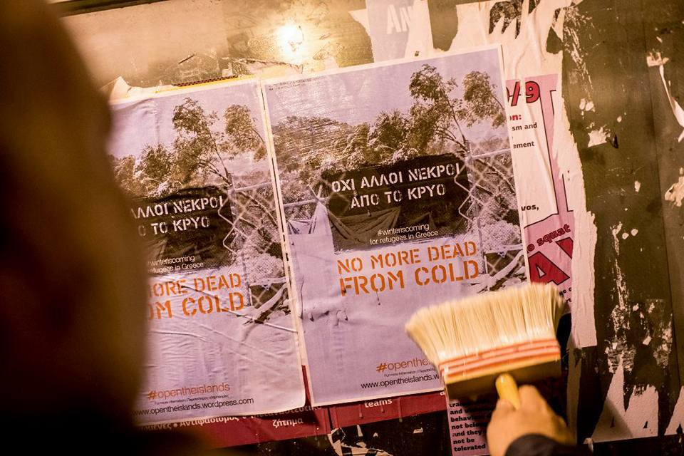
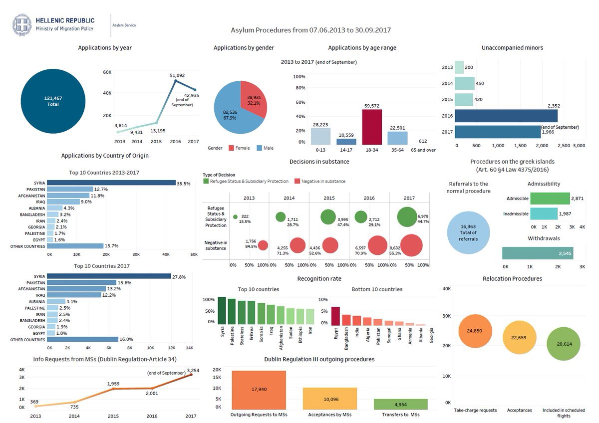
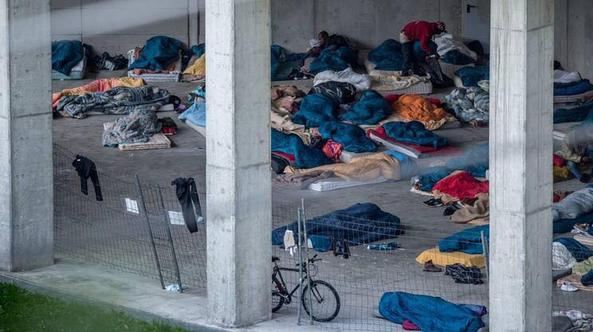
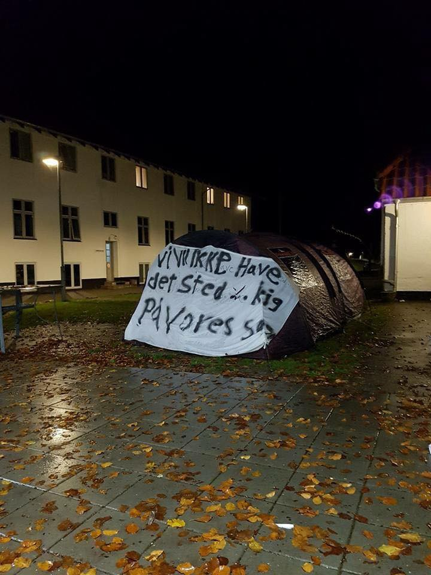
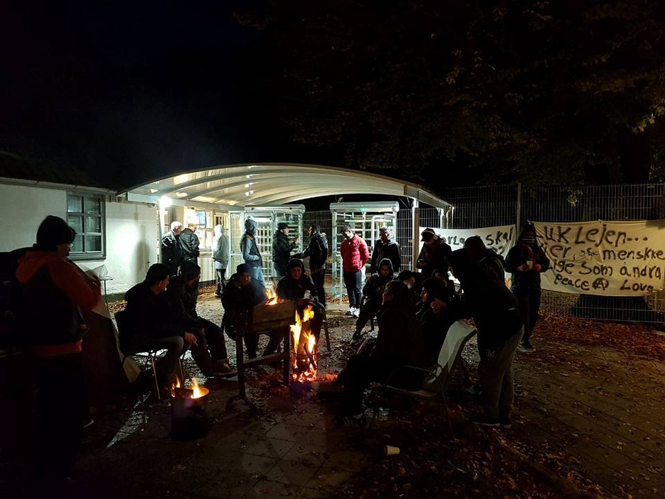
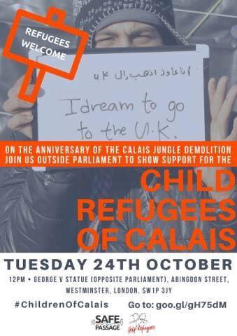

### AYS DAILY DIGEST 13–14\.10\.2017: Another appeal from the Greek islands

_Situation on islands is getting worse every day // Urgent action needed // ICRC downsizes its operation in unsafe Afghanistan // Help needed in Italy and France // Hunger strike in Denmark_

Photo by NBKL
### Feature

After over 60 volunteer and activist groups signed [a letter calling to all responsible for urgent action on the islands before the winter start](https://opentheislands.wordpress.com/statement/) s, mayors and the Union of Municipalities and Communities of Greece \(KEDE\) did the same in a series of letters addressed to the Greek government\. [They also asked for a meeting with Prime Minister Alexis Tsipras](http://www.ekathimerini.com/222415/article/ekathimerini/news/island-mayors-raise-alarm-bell-over-congestion-at-hotspots) \.

In the letter, they — again — warned about the congestion on the islands\.

Currently, all of the existing reception centers on islands are overcrowded\.

Vial, on Chios, has around 2000 people while its capacity is 800\. Souda camp should have been totally dismantled this week, but volunteers noticed that two large UNHCR tents remained standing and inhabited\.

Vathy center at Samos has a capacity of 700, while there are almost 4000 people at the center and around it\. And more people are coming\. Only this week, officially, 245 people arrived at the islands\.

■■■■■■■■■■■■■■ 
> **[louisa gouliamaki](https://twitter.com/lgouliam) @ Twitter Says:** 

> > recently arrived #refugees live in tents outside the overcrowded #Samos hotspot #EU
winter is coming #Greece https://t.co/tMJ75POwBt 

> **Tweeted at [2017-10-14 16:27:08](https://twitter.com/lgouliam/status/919238152535134209).** 

■■■■■■■■■■■■■■ 

Conditions in Moria, Lesvos, are disastrous\. The latest info is that women are given adult diapers so they don’t need to go to the toilet at night\.

■■■■■■■■■■■■■■ 
> **[MSF Sea](https://twitter.com/MSF_Sea) @ Twitter Says:** 

> > In #Moria the situation is so dire/insecure that adult diapers are given to women too scared to go to the toilet at night. Let that sink in. https://t.co/FjEiLoA9BA 

> **Tweeted at [2017-10-13 13:44:16](https://twitter.com/msf_sea/status/918834775217012736).** 

■■■■■■■■■■■■■■ 

Nevertheless, the process of relocation to the islands remains extremely slow\.

Activists from the islands are asking all people to join them in their calls for help\. [Arash Hampay](https://www.facebook.com/arashampay/posts/532965147049576) sent us a letter saying that a group of activists would like to make a joint video\-statement with different people reading the following text\.

> We the Children,
 

> We the Refugees,
 

> We the Volunteers,
 

> We the Activists,
 

> We the Doctors, Nurses, Teachers, Lawyers, Social Workers,
 

> And we, the citizens of the democratic European Countries and Countries around the World\. 

> We are not only concerned but shocked by the conditions for migrants and refugees in Greece\. 

> Early in the morning of 8th October 2017, a 5\-year\-old girl died in Moria Refugee Camp on the island of Lesvos, Greece\. Although the circumstances of her death are not yet clarified, this terrible fate highlights again what we have been saying for a long time: “Refugee camps like Moria are not safe; not for children nor for any human beings”\. 

> United, we demand the Camp Management, the UNHCR, the Greek government, the European Union and all the other responsible actors immediately to change and improve the living conditions for people seeking asylum and safety\. 

> Furthermore, we ask all citizens of the democratic European countries and around the World to stand up, judge and condemn the ongoing systematic violations of human rights\. Being part of a democratic system means we all share responsibility for what is happening in the name of our governments\.” 

The letter calls on all of us to be part of the action\. If you want to join, write to Arash or [No Border Kitchen Lesvos](https://www.facebook.com/NBKLesvos/) \.

By Greek Asylum Service
### Afghanistan

After a series of attacks and the killing of seven staff members of the International Committee of the Red Cross \(ICRC\), the organization is reducing its presence in the country, adding to all the claims that this is not a safe country\.

_“Since December 2016, the ICRC has been directly targeted three times in northern Afghanistan ,”_ said Monica Zanarelli, head of the delegation for the ICRC in Afghanistan at a press conference in Kabul\. She announced that the ICRC’s offices in Maimana, Faryab Province, and Kunduz, Kunduz Province, will be closed and the sub\-delegation in Mazar\-e\-Sharif, Balkh, will be drastically downsized\.

In the rest of the country, activities are also being reviewed\.

However, EU member states are still deporting people to this unsafe country\.
### Turkey

The Turkish police have brutally detained 226 refugees across several provinces\. The single largest group was captured in Edirne, with109 refugees who were attempting to reach Greece or Bulgaria\.
### General

In a vast cross\-country operation — Joint Action Day — twenty\-four people who are suspected of smuggling were arrested\. The action was carried by Frontex, the European Border, and Coast Guard Agency, alongside Interpol and Europol\.

Additionally, 761 persons who were trying to cross the sealed borders were detected, and 119 people were refused entry\. The authorities also recovered 19 stolen vehicles\.

The operation took place in Austria, Germany, Poland, Slovakia, Hungary, Croatia, Bulgaria, Romania, Greece, Slovenia, Czech Republic, Serbia, and Macedonia\.

At the same time, [Europol pointed to a new trend of people smuggling](https://euobserver.com/migration/139449) \. It looks as if smugglers are now using yachts to sail from Turkey to Italy\.

So far, Europol has logged over 160 trips on this route, noting that the price has gone up to €6,000 per head or half of that for children\.

The vast majority depart from the southern coast of Turkey before landing in Apulia, Calabria, or the Syracuse province of Sicily\. The EU observer reports that the skippers are recruited mainly from Ukraine\. Others come from Belarus, Georgia, and Russia\. A few others come from Azerbaijan, Syria, and Turkey\. The people who are taking this route are mainly from Afghanistan, Iran, Iraq, Pakistan, and Syria\.
### Greece

New arrivals are still being registered even at the end of this week\.

](assets/eea95567aa52/1*nKUzMdOStavQ8bEpHIG7dw.jpeg)

By [**Erik Gerhardsson**](https://www.facebook.com/erik.gerhardsson.7?hc_ref=ARRXKTast6nyQTXGvXPBlXQvE06hUNVBPkU0j2N2nrFCFjZHrSPM0KvcuthFsD3Cju0)

As we announced several weeks ago, and again at the beginning of this week, some of the camps on the mainland will be closing before the end of this year\. People who are in the camps are supposed to be transferred to apartments and hotels, which could be good news\. However, some people will be transferred to other camps that are being constructed so as to remain open for a longer time\. It is not clear what criteria will be applied\. So far we know that the Oiynofita, Elefsina, and Trikala camps will be closed soon, followed by three more, one every week\. Finally\.

We only hope that the people from camps will be placed in decent accommodation\.

A violent assault on two Pakistani refugees prompts anger from the community\.

Last Saturday, two workers named Vakas Hussein and Ashfak Mahmoud were assaulted with knives and iron rods\. This attack is the latest in what many believe to be a string of hate crimes targeting refugee backgrounds\.

According to the two, they were surrounded by five assailants who shouted at them with racial slurs while they were beaten\. The two were subsequently hospitalized\.

The Pakistani community is angry in part because they believe the local police are undercounting the incidents, and so they plan to hold protests in conjunction with anti\-racist organizations\.

Three of the people believed to be responsible, two 17\-year\-olds and one 18\-year\-old, have been arrested so far for the attack\. A connection to Golden Dawn has so far not been officially confirmed, however, the group’s barrage of slurs during the attack leaves little doubt that the violence was sparked by fascist ideas\.

English and Greek language lessons for LGBTQI refugees

Until Monday 16 October 2017 at 12:00 am, registration will be open for English and Greek courses for LGBTQI refugees\. The courses will start in November and will be held every week\. It is worth noting that once the courses have been completed, the attendees will receive monitoring certification\. 
Those who are interested may apply to the National and Kapodistrian University of Athens\. 
For more information, contact Sylvia Kourentzi or the Greek Transgender Support Association \(GTSA\) at this telephone number: 210 9210 697\.

As the number of homeless people on the streets of Athens rises, more groups are engaging to help those in need\. [Hestia Hellas](https://hestiahellas.org/programs/) now provides food from their central Athens location three days a week — Monday, Wednesday, and Friday —Mondays from 12 to 4 pm\. Location: Charilaou Trikoupi 5, 5th Floor \(Athens Center\) \.

URGENT CALL FOR VOLUNTEERS

[Chios Eastern Shore Response Team](https://www.facebook.com/groups/421759534684819/permalink/696442843883152/) needs volunteers — long\- and short\-term — from November 11 throughout December\. If nobody comes, they will not be able to continue helping new arrivals\.
### Italy

More images from Gorizia where about 90 people, mostly boys, are sleeping in a tunnel\.

In Como, the situation is a bit better and so far nobody is out on the street\. The parish of Rebbio, however, can now host only children and women, so those men who can’t get into the camp managed by the Red Cross are taken care of by Como Senza Frontiere\. They managed to find an open space where migrants can sleep but the area needs to be cleared out every morning in order to protect the decency of the town\.

Photo by Baobab\.

[Doctors Without Borders \(MSF\) has opened a post\-acute phase healthcare clinic for migrants in Catania, Sicily](http://www.infomigrants.net/en/post/5604/msf-opens-post-acute-migrant-health-clinic-in-catania) who have been discharged from hospital and are recuperating from illness\.

The 24\-bed clinic provides assistance and healthcare such as physiotherapy following fractures, post\-op rehabilitation, treatment for chemical burns due to skin contact with splashed petrol on migrant boats, and illnesses that are no longer in the acute phase but require monitoring\. Additionally, they will focus on women’s health and on victims of sexual violence, torture, and inhumane and degrading treatment\.
### France

HELP NEEDED

[Refugee First Aid and Support](https://www.facebook.com/groups/RefugeeSupportFirstAidTeam/permalink/1984145845198589/) team needs help\. Check their FB post to see the list of what is needed at the moment\.

Girls from the [SolidariTea](https://www.facebook.com/refugeesolidaritea/posts/1169486839819737?hc_location=ufi) group also need help\. [Here is the link](https://www.youcaring.com/displacedpeopleinnorthernfrance-9…) where you can donate to allow them to continue providing tea to refugees stranded in the forests of Calais and Dunkirk\.

[This week, again, they were in the field](https://www.facebook.com/refugeesolidaritea/posts/1168644456570642) \.

> “We will be leaving Wiveliscombe around the 14th of November to go and work alongside RCK, Help Refugees and Utopia 56, reaching out to roughly 1200 refugees from Eritrea, Sudan and Afghanistan \(to name a few\) who are living without shelter or basic sanitation in Calais\. We hope to join food distribution every day and provide outreach tea to access the minorities with a cultural exchange project — we are also hoping to take tea to Dunkirk a couple of times a week to work with the Mobile Women’s Centre\.” 

On the trip, they found many very young children and women who have been sleeping in the rough since the Grande\-Synthe camp burnt down earlier this year\. They were told by other volunteers that the police in Calais _“are unforgiving towards the refugees… We were told that there are common incidents of tear\-gassing and destruction of tents and sleeping bags\.”_

Some of the people the girls met in Calais they met previously in Belgrade\. They finally made it to the European Union, only to find almost the same conditions they had in the Balkans\.

One of the groups in Calais is [L’Auberge des Migrants](https://www.facebook.com/permalink.php?story_fbid=10155486215670339&id=358496450338) \. They regularly report about the situation in the area\. After a recent visit, they wrote on their FB page that the number of migrants is almost constant \(700\) \.

> “After several months of judicial proceedings \(up to the state council\! \), migrants have access to drinking water, sanitation, and showers\. It is not a big deal, but it makes sense: the living conditions are a little less difficult, and this will limit hygiene problems… On the other hand, the pressure has increased on migrants\. The use of tear gas, batons on bodies and cell phones, shoe theft, and most importantly, sleeping bags and cover flights\. This is our biggest problem right now\.” 

They express their serious concern about the coming months\.

](assets/eea95567aa52/1*Q_nAEtO4bkHb9MEnvRUcnw.jpeg)

Photo by [L’Auberge des Migrants](https://www.facebook.com/permalink.php?story_fbid=10155486215670339&id=358496450338)
### Denmark

A group of rejected refugees in Denmark has commenced a hunger strike saying that the Kærshovedgård camp where they are living is truly bad and extremely remote\.

Photo Jhanbkhsh Najafi

The camp is an old Danish prison\. Unlike prisoners, the refugees are allowed to leave the camp in the daytime, but since it is so far away from anything, they have nowhere to go\. Additionally, as some of the refugees claim, the local authorities decided that the refugees should not be allowed to use the local bus\.
### UK

To mark the one year anniversary of the closing of the Calais jungle, Safe Passage UK will be going to the Houses of Parliament on 24 October to ask the Government to let in more child refugees\.

Safe Passage is asking for support from UK citizens who may write to their MPs or attend the event\.

_Things you can do:_ 
_1\. Host a local meeting, assemble, and decide what you are going to do\. Make sure it’s before next Friday the 20th of October so you have plenty of time to send the letters to your MP or you can join us and deliver them yourself\._ 
_2\. If you are coming, contact your local MP and ask to meet him or her at 1 pm at Parliament to deliver the letters\!_ 
_3\. Who could you invite who would be able to write a meaningful letter to the MP? \(a priest, a refugee, a headteacher, students\) \._ 
_4\. Advertise your meeting\! Share the event on Facebook with friends and local networks, Safe Passage will email other supporters in your area to advertise the meeting to help boost turnout\._

Information on letter writing can be found [via this link](https://docs.google.com/…/1d5mMPByrOO9e2MrMwPdKp5gZ0bS…/edit) \.
You can set up a meeting using [this link](https://actionnetwork.org/event_campaigns/calais-action-events) \.

> **We strive to echo correct news from the ground through collaboration and fairness, so let us know if something you read here isn’t right\.** 

> **If there’s anything you want to share, contact us on Facebook or write to: areyousyrious@gmail\.com\.** 

_Converted [Medium Post](https://areyousyrious.medium.com/ays-daily-digest-13-14-10-2017-another-appeal-from-the-greek-islands-eea95567aa52) by [ZMediumToMarkdown](https://github.com/ZhgChgLi/ZMediumToMarkdown)._
