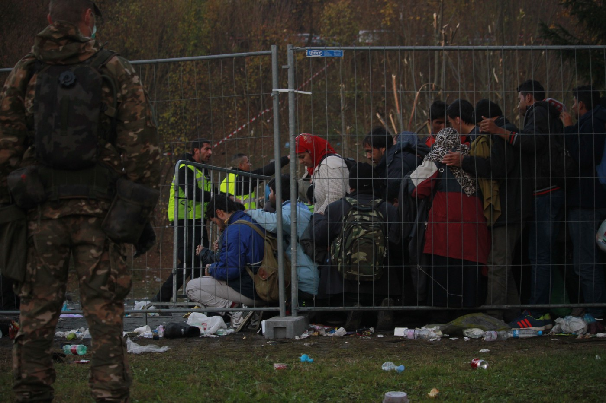

### AYS Daily Digest 15/10/17: What the election in Austria means for refugees

_Who is ÖVP head Sebastian Kurz? / Stories from returnees in Kabul / Breakdown of new arrivals in Greece / Hope project launches new project / New arrivals in Italy_

In 2015 and 2016 many people entered Austria through the border crossing at Spielfeld\.
### Feature: What the election in Austria means for refugees

According to the last projection, the conservative ÖVP won the Austrian federal election with 31\.4%\. They will likely form the government and set Sebastaian Kurz as the chancellor\. Since 2013 the 31 years old has been minister of Europe, Integration and Foreign Affairs\. Therefore his role during the mass influx in 2015 and 2016 was a pretty big one\.

■■■■■■■■■■■■■■ 
> **[ORF Breaking News](https://twitter.com/ORFBreakingNews) @ Twitter Says:** 

> > Wahlergebnis mit Wahlkarten-Prognose #nrw17 https://t.co/hPCEp3IEbm 

> **Tweeted at [2017-10-15 19:11:07](https://twitter.com/orfbreakingnews/status/919641807847415808).** 

■■■■■■■■■■■■■■ 

Under Kurz’ direction Austria in 2016 [introduced](http://orf.at/stories/2326634/) a daily quota for refugees they will let enter the country: It was set to “around 580”\. In the following months Slovenia, Croatia, Serbia and Macedonia also introduced similar quotas, leaving more than 20\.000 people stranded in Greece\. A few weeks later Macedonia closed its borders to Greece completely for refugees\. Since the closing of the Macedonina border, the number of refugees has more than tripled, with more than 69\.000 people still stuck in Greece\.

As the strongest party in the parliament, Kurz and the ÖVP will have more power to pass new laws\. Just this month the ban on facial veils came into force\. Refugees, migration and integration have been key topics in the election campaigns\. A coalition with the right wing populists of FPÖ is possible, what could lead to even stricter laws\.

 /Bundesministerium für Europa, Integration und Äußeres \(CC BY 2\.0\)](assets/f97df1f03c5a/1*PJklVGUdn7knxOZbtRXv-A.jpeg)

Head of the ÖVP and Austrian foreign minister: Sebastian Kurz\. Credits: [Flickr](https://www.flickr.com/photos/minoritenplatz8/32619100681/in/photolist-RGrqcB-VjeJ8y-T8ZC9o-mz3UCr-phmy9g-q2btCx-mz5aGJ-nxyjds-UdmdAe-qEbfKQ-o7XRzq-WySs2m-oa1eRH-v4evMq-f5b3MK-Yhh6wA-mKxFup-mKxyXD-XDzyfB-o9SxBY-qu1dWP-px6oFw-odhtwr-VHCJGX-oLmdRA-px4ksP-nxPeJR-pgsNxB-oLpcYr-pPfTPP-q6pgQx-naFYr4-mz39pt-qWL3K1-mz3nUz-qZ4eZi-pqoBWc-mz3N5r-mz3xZc-pHh5a3-pxQLga-pqLq9x-it8oE3-nosmAd-nhfzm2-j1gb84-nhhQ5q-pPfT76-oSFYAe-jgZu31/) /Bundesministerium für Europa, Integration und Äußeres \(CC BY 2\.0\)

It is not in Austria alone, but also in Europe that figures like Kurz could shift the debate to the right\. With statements such as, “It is we in Europe, and not the human traffickers, who decide whom we take in\. Whoever wants to enter illegally has forfeited their chance,” Kurz has taken a hard stance on migrants and refugees\. When asked about the Turkey deal by [Spiegel](http://www.spiegel.de/international/europe/interview-with-austrian-foreign-minister-sebastian-kurz-a-1094931.html) , Kurz said: “The Turkey deal can only be Plan B\. Plan A needs to be a strong Europe that is prepared to defend its external borders on its own\.” Later he added, that people should be rescued, but not disembark in Europe\. “We need to become active as fast as possible in Libyan waters,” he demanded\.

Additionally Sebastian Kurz joined France’s president Emmanuel Macron in the idea of [opening hotspots](http://www.aljazeera.com/news/2017/02/austria-kurz-set-refugee-camps-africa-170227173858451.html) in North Africa\. He further blamed refugees for sending money to their families and spoke against famaily reunions\.

In the last months Kurz always urged, to restore the Dublin and the Schengen agreement\. In this run, he compared the European Union to a human trafficker\. “ The distinction between protection and the right to a better life has got blurred, and I think it is of utmost importance that we re\-establish some clarity in this regard,” he said last year in an interview with [the Observer](https://www.theguardian.com/world/2016/mar/05/rebel-austria-accuses-eu-human-trafficker-sebastian-kurz-angela-merkel) \.

It seems like this will be parameters of the debate Austria and Europe will be having for the coming months, if not years\. Discussions based on hatred, racism and nationalism\. As the ÖVP will likely become a government party again, it will not only end with discussions, but also likely with new laws and agreements restricting the human rights\.
### Sea

Volunteers of Alarmphone published a video, giving helpful advice for people crossing the Mediterranean\.

### Afghanistan

The [Afghanistan Migrants Adivce & Support Org](https://amasosite.wordpress.com/2017/10/15/afghan-returnees-and-their-painful-stories/) has visited some returnees in a hotel\. Even though some of these forcibly returned refugees have serious health problems, they need to wait for weeks to get an appointment with a doctor\. Many of them fear problems with lenders and smugglers who they borrowed money from to get to Europe\. Now that they are back with almost no money and no support, they are struggling to find a life in Afghanisan on top of the debts they have to pay\. One man also became stranded in Kabul, explaining that his home village is not safe at the moment, as people are threatened by ISIS and Taliban forces\. Given the reasons that drove these people to flee their country in the first place, many of these returnees lives are in grave danger in Afgahnistan\. The fate of these forced returnees once again shows the hollow and inhumane desingation of Afghanistan as a “safe” country by EU authorities\.

> I can not return back home, what will happen to me after Iam out of the hotel, what should Ido, where should Igo, I have no one in Kabul\. 

### Lebanon

### Greece

More than 82 organisations have signed the “ [Open the islands](http://opentheislands.wordpress.com/) ” statement, demanding better treatment on the Greek islands\.

According to collected data of volunteer Tommy Olsen, 51 boats have arrived on the Greek islands in the first half of October, with a total of 2,198 people:
- Lesvos had 25 boats, with a total of 1,188 people: 472 children, 283 women and 430 men
- Samos had 3 boats, with a total of 158 people
- Chios had 11 boats, with a total of 518 people: 176 children, 137 women 205 men
- Kos had 6 boats with a total of 110 people
- Other islands had 6 boats, with a total of 224 people

](assets/f97df1f03c5a/1*SOI52mdxh9bfOALrEcymxA.jpeg)

The overcrowded Moria hotspot\. Credits: [RSA](https://twitter.com/rspaegean/status/918463563030810625)

As Refugee Support Aegean reports, more than 5,100 people are accomodated in Moria at the moment\. The hotspot on Lesvos officially has a capacity of 2300\. “Forced prostitution and abuse are a recurrent phenomenon, including children,” RSA states\.

The Hope Project is setting up a medical house for both residents and guests on Lesvos\. They are about to finish the construction, but need support in equipping and running the project\. The house needs to be prepared for winter and meet the hygenic requirements\. If you can contribute, check their post for more details\.

On the mainland volunteers of City Plaza visited the residents of Lavrio camp, which faces an eviction\. The volunteers delivered some donations and showed solidarity\.

](assets/f97df1f03c5a/1*bBx4iPBuxw1lopZDNU5n6Q.jpeg)

The Lavrio refugee center\. Credits: [Refugee Accommodation and Solidarity Space City Plaza](https://www.facebook.com/sol2refugeesen/)
### Italy

61 people, including eight unaccompanied minors, embarked in Vendicari \(Siracusa\) on a yacht\. The vessel, which departed from Istanbul, was found stuck in sea rocks with two smugglers intending to go back to Turkey\. The new arrivals were dispersed in Vendicari reserve and led to the trade harbor of Agusta\. They paid 6,000 Euro for the crossing, Ansa [reports](http://www.ansa.it/sicilia/notizie/2017/10/15/migranti-61-su-yacht-nel-siracusano_fecc6b12-a25a-429b-b766-959c8046aeae.html) \.

■■■■■■■■■■■■■■ 
> **[Pino Finocchiaro](https://twitter.com/pinofinocchiaro) @ Twitter Says:** 

> > Vendicari: rintracciati 61 migranti
Sugli scogli di Calamosche rintracciata barca salpata dalla Turchia. 6000 euro a testa. https://t.co/cXW4BN8eay 

> **Tweeted at [2017-10-15 10:03:12](https://twitter.com/pinofinocchiaro/status/919503919155499008).** 

■■■■■■■■■■■■■■ 

### France

The Timmy team in Paris is requesting funds to keep their work ongoing\. By its own account the team hosted, supported, supported, supported, monitored, equipped more than 1000 young people, some long term\. Beneath money they are looking to strengthen their health team, school coaches, and need volunteers for occasional hands\-on\. Their fundraiser can be found on [Colleo](https://www.colleo.fr/cagnotte/6550/timmy-soutien-aux-mineurs-exiles) \.

In Toulouse activists occupied a building to use it as accomodation for 75 unaccompanied minores, providing yet another example of civilian action in the face of continuing government neglect\.

### Denmark

The number of hunger strikers protesting their rejected asylum appeals has increased to at least 28\.

> **We strive to echo correct news from the ground through collaboration and fairness, so let us know if something you read here isn’t right\.** 

> **If there’s anything you want to share, contact us on Facebook or write to: areyousyrious@gmail\.com\.** 

_Converted [Medium Post](https://areyousyrious.medium.com/ays-daily-digest-15-10-17-what-the-election-in-austria-means-for-refugees-f97df1f03c5a) by [ZMediumToMarkdown](https://github.com/ZhgChgLi/ZMediumToMarkdown)._
