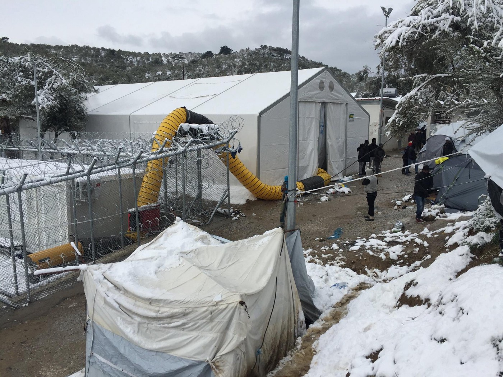
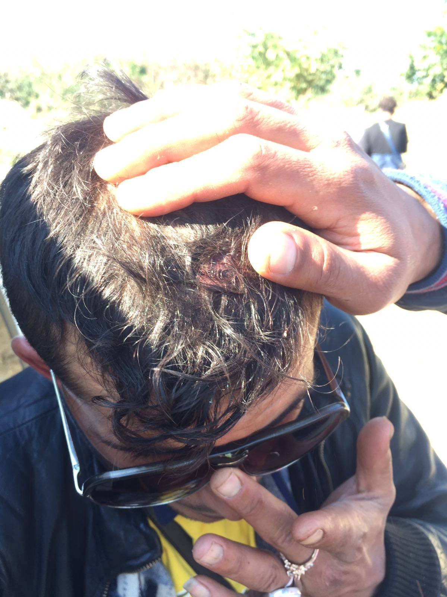
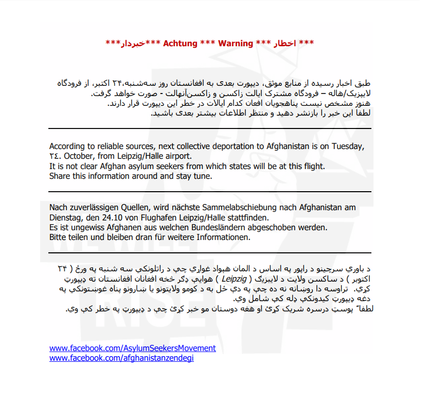

### AYS Daily Digest 16/10/17: Minors Abandoned on the Streets of Paris

_//Unsafe drinking water in Calais and donation drives//Volunteer groups prepare for cold across the Aegean//Overcrowding in Moria//Volunteering in Turkey//Lack of translators in Bulgaria//Police violence on Serbia\-Croatia border//Forced deportations from Germany_

 \.](assets/3f189e58235/1*ngXslHLsU-S16wARwTaQ_g.jpeg)

Refugees in Paris\. Photo credit R [astplatz](https://www.facebook.com/rastplatz/?fref=gs&hc_location=group_dialog) \.
#### FEATURE: Abandoned on the Streets of Paris

Activist and volunteer groups are reporting deteroriating conditions for refugees on the streets of Paris and elsewhere in France\. With temperatures dropping, many refugees who are sleeping hard across the country need warm blankets, tents, and clothes\. There are large numbers of refugees sleeping in tents around Paris and camping in the middle of traffic islands\. Those living on the street are especially vulnerable to abuse and exploitation\.

The volunteer group [Paris Refugee Ground Support](https://www.facebook.com/PRGS.team/) shared a recent experience that highlights this risk\. Two volunteers were handing out blankets under a section of a bridge where many refugees sleep, especially unaccompanied minors\. While the volunteers were there, they noticed two people with clearly bad intentions sizing up the sleeping kids\. Volunteers report:

> They \[the predators\] stepped onto a low wall that was in between two rows of sleeping people\. They were looking down as if they were searching for something specific\.We watched with feelings of white searing rage and putrid sickness to witness such callous and dehumanised selection\. Above all, we felt helpless\. 

> We left after what felt like not long enough, knowing those children were still unprotected\. We know that there is not enough we can do as two people to protect them\. 

](assets/3f189e58235/1*6r-XEN8Lv_Knca28hNz62A.jpeg)

Photo credit [Paris Refugee Ground Support](https://www.facebook.com/pg/PRGS.team/photos/?ref=page_internal)

> Believe it or not, there is a police station above this bridge, the police regularly come down and wake them up with a kick from their boot, move them on, and take away their meagre belongings\. But they do not come to protect these people\. The police do not protect the most vulnerable in this city, they bully them\. 

This anecdote shows that there are always faces and names behind every report highlighting “concern” for minors — but what will these reports yield?

Not only are refugees in France being denied basic humanitarian and legal services, but they are also frequently beaten or abused by police\. Another volunteer group working in Paris, [Rastplatz](https://www.facebook.com/rastplatz/) , describes a similar lack of institutional support, in terms of both asylum services and basic needs\.

> In Paris, they wait for days in a line on the street just so they can put in their request for asylum\. The refugees on the streets of Paris are dependent on private aid\. People are grateful for a hot plate of stew\. We’ve been cooking the last three nights\. Every day we cook more, but it is not enough\. 

Also in Paris, the group Utopia 64 has opened up a new temporary collection point for donations\. You can find details and the location [here](https://www.facebook.com/asso.utopia56/posts/1678991732132612) \. The group has also compiled a useful [map of collection points for donations throughout France](http://www.utopia56.com/fr/collecte-0) \.
#### Calais

In Calais, refugees continue to live in the woods since the destruction of the Jungle\. There are approximately 700 refugees living in the area who are struggling to find temporary shelter amid frequent police evictions and attacks\. Since the activist group [L’Auberge des Migrants](https://www.facebook.com/LAuberge-des-Migrants-358496450338/) sent a request to UN officals concerning access to safe drinking water, France has been officially advised by a group of UN Human Rights experts to provide long\-term access to potable water and sanitation for refugees in Calais and elsewhere along the Northern coast\. [According to the UN](http://www.ohchr.org/EN/NewsEvents/Pages/DisplayNews.aspx?NewsID=22240&LangID=E) , migrants in most camps along the coast have inadequate access to drinking water and showers, and these issues are being addressed almost entirely by volunteers\.

](assets/3f189e58235/1*kvYnSvpp6X8xYVXf0AhBxA.jpeg)

Refugees in Calais\. Photo credit [Care4Calais](https://www.facebook.com/care4calais/)

One of the UN experts noted that, “It is worrying that approximately 700 migrants in Calais and the greater area of Calais temporarily rely on only 10 portable lavatories and water from 10 taps\. Human rights apply to all, including migrants\-regardless of their status… the authority of those decisions \[to provide safe drinking water\] is diminished if they are not implemented in practice\.”

> While the recommendations of the UN experts are certainly correct in this case, there is something that rings hollow about the UN’s repeated calls for help for refugees in Europe\. It is worth noting that this recommendation from the UN only arrived after pressure came from local activists\. 

While the UN does a good job of publicizing information and their own work, they frequently fall short of their own missions and mandates\. What does it mean for the UN to demand change in refugee camps when they one of the primary agencies responsible for those camps?

If the UN experts acknowledge that the basic needs of refugees in Calais are being met largely by volunteers, then why do they not take the steps to meet these needs themselves, particularly when they have the budget to do so? These are the sort of questions that rarely get a satisfying answer, and continue to frustrate refugees and volunteers on the ground\.

While the UN often has limited authority, and is right to put pressure on countries to do more for refugees, they also need to take accountability for what happens in the camps they operate in\.

As we all know by now, a primary factor causing people to leave camps and head north \(especially in the months leading up to winter\) has to do with a complete lack of faith in the camp administrators to adequately meet the needs of those residing there\. Rather than addressing that a significant chunk of the population under their care feels they have better chances making it with no support than with that which is offered, INGOs rely on platitudes and hand\-wringing over the situations resulting, in no small part, from their failures\.

The group Care4Calais is organizing a winter coat drive, find details and where to donate [here](https://www.facebook.com/care4calais/posts/1695398640493086?hc_location=ufi) \.

](assets/3f189e58235/1*u3Px1F6pUF0NBxfzeAn9Vg.jpeg)

Photo credit [Care4Calais](https://www.facebook.com/care4calais/)

> Do you have a coat in your cupboard that you no longer wear? Maybe last season’s ski jacket or one that no longer fits? Please consider digging it out and donating it to our winter appeal\. Many refugees arrive in France with painfully inadequate clothing for a winter in Europe\. And with the police regularly taking sleeping bags, it is the only way we can keep them warm\. 

### TURKEY

The group “Empathy Makes Us Human” is looking for volunteers in Izmir\. As the only NGO allowed to work in unofficial camps in the area, the group undertakes many projects, and has a number of volunteer opportunities including hygiene supplies distribution, teaching in a mobile education center, and working in a rcreation and education center for women and children\. Information [here](https://www.facebook.com/groups/eidomeni.refugee.support/permalink/1730292450611694/?hc_location=ufi) \.
### GREECE
#### Mainland

The NGO Hestia Hellas is now providing food from their central location in Athens on Mondays, Wednesdays, and Fridays\. For their location, hours, and a list of other resources available through their center, click [here](https://hestiahellas.org/programs/) \. They are also looking for a child psychologist \(must be fluent in English and Greek\), info [here](https://hestiahellas.org/get-involved/) \.

The Refugee Language Initiative is looking for a German Language teacher to volunteer via Skype, details [here](https://www.facebook.com/TheRefugeeLanguageInitiative/posts/525006361169646) \.

The [City Plaza Solidarity Space](https://www.facebook.com/sol2refugeesen/) has put out a call for pillowcases and bedsheets, which can be dropped off at St\. Acharnon 78 and Katrivanou, Athens, 104 34\.
#### Islands
#### Lesvos

With winter fast approaching, NGO’s and volunteer groups are working to help refugees stuck in hotspots across the Aegean prepare for the cold\. On Lesvos, the Organization “ [Movement on the Ground](http://movementontheground.com) ” has purchased tent heaters for the cold months, and is continuing to prepare hot meals for people on the island\. The group reports that while conditions for refugees are worsening on the island, many NGO’s have been leaving or cutting funding\.

Tent heaters purchased by Movement on the Ground\.

> Almost 10\.000 people have arrived to Lesvos this year, the majority in the recent months\. The situation is detoriating as the temperature is dropping, reception sites are overcrowded and the number of people arriving keeps rising\. As certain humanitarian organisations have left Lesvos and some are phasing out, Movement on the Ground has intensified the support to the island\. 

Another volunteer on Lesvos recently noted the lack of preparation by governmental agencies for the coming cold:

> Arrivals of people on the island since 2nd Oct are well above 800\. There is still so winterization plan, and the only efforts from the government have been focused on decongesting the island\. 

While volunteers and groups such as Movement on the Ground should be appluaded for their work, it is with frustration that we note how many gaping holes these organizations are trying to fill on the Greek islands\. There have reportedly been an average of 30 new arrivals a day on Lesvos for the past few weeks\. Why should volunteer groups and NGO’s be struggling to help prepare refugees for winter, when the Greek government and UNHCR have mandates and millions of euros in funding to do so? The misuse of funding allocated for refugees continues to be a trend in Greece and throughout Europe\.

Movement on the Ground is also currently looking for a volunteer coordinator for November, see details [here](https://www.facebook.com/movementontheground/posts/954388451404134?hc_location=ufi) \.

The Refugees 4 Refugees group is looking for volunteers in Skala Sikamineas on Lesvos starting in November\. Information [here](https://www.facebook.com/Refugee4Refugees/posts/554915071518839?hc_location=ufi) \.
#### Moria

According to the NGO Boat Refugee Foundation, there are currently over 1,000 children on the island of Moria\. This is the island where [only one week ago](ays-daily-digest-8-10-2017-another-child-died-in-greece-in-less-than-one-month-e3d08ec5b9df) a child died after failing to get adequate treatment for health issues, and which has recently been condemned by Human Rights Watch advocates as a “ [concentration camp](http://greece.greekreporter.com/2017/10/06/migrant-camp-in-lesvos-a-concentration-camp-says-human-rights-watch/) \.”

](assets/3f189e58235/1*7vfCynVkGORRjPOY8cMxvA.jpeg)

Photo Credit [Boat Refugee Foundation](https://www.facebook.com/pg/stichtingbootvluchteling/photos/?tab=album&album_id=1380423092287734)

New arrivals continue to stream into the Aegean islands despite the increasing cold and danger of the crossing\. The Greek Ministry of Migration reports that over 1,880 refugees have attempted the crossing from Turkey in the [last two weeks](http://www.keeptalkinggreece.com/2017/10/16/greece-refugees-arrivals-germany/#.WeShCsgfbdw.facebook) alone\. During this time there have also been 25 reported interceptions by the Turkish Coast Guard, with 907 refugees being forcibly deported back to Turkey\.

There were 35 new arrivals on the island of Samos today\.
### BULGARIA

The Bulgarian State Agency for Refugees \(SAR\) does not have nearly enough translators to conduct their work, [with over 20 positions remaining unfilled](http://www.novinite.com/articles/184302/There+are+no+Translators+who+Want+to+Work+for+the+State+Agency+for+Refugees) \. This problem of getting proper translators in Bulgaria is sadly mirrored in many other EU member states\. For example, in Greece, reports of refugees having their asylum interviews translated by someone via phone \(which is illegal\), or by someone who is not fluent in their language are common\. Until Bulgaria solves this problem, refugees will continue to be denied their basic human rights, as most will not be able to effectively apply for asylum\.
### SERBIA

Beating and broken phones dealt out by the Croatian Police\.

The activist group [Soul Welders](https://www.facebook.com/SoulWelders/) reports that illegal pushbacks continue to occur on the Serbia\-Croatia border, with refugees being frequently beaten and robbed by the Croatian police\. Volunteers on the ground report that “we are completely overwhelmed by the number of push backs we see every day, which include violence, broken phones and stolen money by the Croatian police\.” Refugees trapped in Serbia are another example of those suffering at the edges of the EU border, which in the past decade has become the deadliest border on Earth\. These refugees demonstrate the often fatal consequences of a hardline approach to border “security”\.

](assets/3f189e58235/1*qS5-wam4nnBSFpTYI0F3Kw.png)

Photo credit [No Name Kitchen](https://www.facebook.com/NoNameKitchenBelgrade/?fref=gs&hc_location=group_dialog)
### GERMANY

The Asylum Seeker’s Movement has announced that there will be a mass deportation of refugees to Afghanistan on the 24th of October\. The flight has reportedly been scheduled from Leipzig/Halle Airport \(LEJ\) with the destination Kabul\. According to activists, “at this point it is not clear from which federal states persons will be deported and if people from Saxonia are in danger\.”

Photo credit: Asylum Seekers’ Movement

You can contact the group [here](https://www.facebook.com/AsylumSeekersMovement/posts/1812739242089242) if you are in danger of being deported yourself, or if you know someone who has been taken into custody or is in fear of deportation\.

> **_We strive to echo correct news from the ground through collaboration and fairness, so let us know if something you read here isn’t right\._** 

> **_If there’s anything you want to share, contact us on Facebook or write to: areyousyrious@gmail\.com\._** 

_Converted [Medium Post](https://areyousyrious.medium.com/ays-daily-digest-16-10-17-minors-abandoned-on-the-streets-of-paris-3f189e58235) by [ZMediumToMarkdown](https://github.com/ZhgChgLi/ZMediumToMarkdown)._
