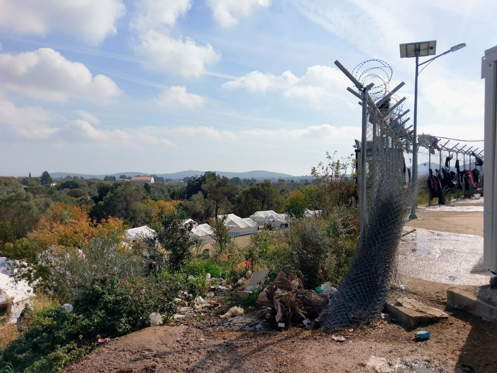

### AYS Daily Digest 23/10/17: Hunger Strike In Denmark

_/Refugees held in limbo in Denmark/Worker Protests in Turkey/New Arrivals on the Aegean Islands/Situation Detoriorating on Chios/Protests Continue on Lesvos/Volunteer and donation needs on the Greek mainland/Soul Welders moves on/Border restrictions in Bosnia/Donations needed in UK for Calais/Anti\-Refugee parties in the Czech Republic_

Protestors on Lesvos\. Photo Credit: Arash Hampray
### Feature: Refugees on Hunger Strike in Denmark to Protest their Detention in Limbo

A number of asylum seekers have been on hunger strike in Denmark, while they are being detained in a state of limbo: they have been denied their asylum, but the authorities are unable to deport them\. According to Nanna Kathrine Dahler\-Kim Larsen, an activist in Denmark:

> For 11 days now, 28 kurdish Iranians, who have been rejected asylum in Denmark, but cannot return to Iran, have been on hunger strike to protest the conditions of the camp and to get their asylum cases reopened\. The conditions in the camp Kærshovedgård have been criticized by Amnesty International and the Danish Helsinki Committee for being intolerable\. The people on hunger strike are living on water and sugar only, and several have already been fainting and seen by emergency doctors\.
 

> As one of the hunger strikers explained, “We’re striking because we don’t know how long we’ll have to stay here\. When someone is given a sentence for a crime, they know when they will get out, but we don’t know for how long we’ll have to stay here, and we haven’t even done anything criminal\.” 

It is this state of constant uncertainty that takes such a severe toll on the mental health of these refugees in Denmark, and elsewhere across Europe\. Without knowing where they might end up tomorrow, or if their lives will be in danger again, these refugees live under the spectre of constant threat and fear\. This fear takes its toll, as multiple suicide attempts have been reported at the facility, in particular by the journalist [Edward Stanley](http://politiken.dk/debat/kroniken/art6105458/Vi-udsættes-for-mental-krigsførelse-og-mister-forstanden) \.

A number of Danish civil rights and activist groups have recently issued a [press statement](https://lookaside.fbsbx.com/file/Hunger%20strike%20at%20Deportation%20Centre%20in%20Denmark.pdf?token=AWxYGFh92SivmP8wZ84og4ntd_FKFCvlYvvVtq33r-noLj1wQFaPOVQGYT3nSlBcbNDilaiXeDSB6ukQtPMcA7tOvK9eXoVcB-twUip9KizXPNicgI_gC_YtEk67Sh1N_RaZEtCzUzT-_44ROJMydZpU) condemning the treatment of the striking asylum seekers, and demanding their immediate release\. According to this statement:

> The intention of the Danish government is to make the conditions for these people as unbearable as possible… The strikers are demanding Kærshovedgaard to be closed – and for their cases to be reopened\. Demands that are in line with recommendations of a broad range of organisations – amongst them The Danish Helsinki Komitee for Human Rights and Amnesty International\. Several experts on European migration politics are also raising criticism of the camp\. 

### Turkey

According to reports by [Harek\(et\)Act](http://harekact.bordermonitoring.eu/category/news/) , Syrian refugees are continuing to protest unfair working conditions in shoe factories in Izmir and other cities including Gaziantep, Konya, İzmir and Manis\. The outlet noted that “the solidarity between Syrian and Turkish workers is the prominent character of this \[uprising\] \.” The workers are protesting the unsafe working conditions in the factories, as well as their low wages and lack of protection\. Many refugees who have engaged in protests gave been threatened with deportation\.
### Sea

The large NGO Save the Children has [announced this Monday](http://www.businessinsider.com/r-save-the-children-suspends-migrant-rescues-in-mediterranean-2017-10?IR=T) that it will be supspending rescue operations of refugees in the Mediterranean sea\. This announcment has come as the security situation in Libya has been detoriariting, making the journey far more dangerous for refugees and migrants\. The Save the Children vessel Vos Hestia has reportedly saved more than 10,000 people from boats since it was launched in Spetember of last year\.

According to Valerio Neri, a Director General for the organization, “For too long we have been the substitution for the inexistent and inadequate European policies for search and rescue and for hosting migrants\.” While it is certainly true that NGO’s should not be taking over for effective policy and protection of refugees, this decsion of the organization once again calls into question the priorities of large NGO’s\.
### Greece

](assets/24d31f214024/1*zglNreQkKZ-hqJRu3upfqA.jpeg)

Photo Credit: [Lesvos Solidarity](https://www.facebook.com/pg/pikpalesvos/posts/?ref=page_internal)
#### Islands

Two boats arrived on Lesvos, 45 on the Southern side of the island and 34 on the North\.

ERCI conducted a rescue fo a boat carrying 40 people off the small island of Farmakonisi, near Leros\.

■■■■■■■■■■■■■■ 
> **[ERCI](https://twitter.com/ERCIntl) @ Twitter Says:** 

> > #NEWS : One refugee boat rescued by TCG outside Farmakonisi 02.40, carrying 40 people. #RefugeesGr #Farmakonisi 

> **Tweeted at [2017-10-23 18:51:55](https://twitter.com/ercintl/status/922536079693176832).** 

■■■■■■■■■■■■■■ 

Conditions continue to detoriorate on the Aegean Islands, as there is overcrowding in the camps, and the UNHCR and other large NGO’s are failing to meet refugee’s needs for the winter\. In Samos, many refugees, including families, are forced to sleep putside completely exposed to the elements\. Not only have many not been provided with tents, but they have not even received blankets or clothing form the UNHCR and Greek authorities\. One of the first rains of the season in occuring on Samos tonight, and in preparation for this the group [Samos Volunteers](https://samosvolunteers.org) has been handing out trash bags so that refugees’ posessions will not become soaked\. It is sad to note once again the large gaps that volunteer groups are being forced to meet in the absence of real action by the UNHCR and other authorities, using their shoestring donor\-funded budgets and the work of volunteers\.

Similar conditions prevail on the island of Chios, where it is estimated that there are 400 refugees sleeping in the woods outside of the Vial camp\. Due to extremely overcrowded conditions within the camp, the UNHCR is supposedly searching for further housing\. Sadly, yet perhaps not surprisingly, the UNHCR does not seem to have done its due diligence in this regard, as the places they have chosen do not meet safety standards and have not been fitted for living\. For example, the UNHCR proposed the l [ocal recycling facility be used as housing](http://www.politischios.gr/horia/poios-tha-noiastei-gia-toses-psyhes) without refitting it in any way\.

The need for new facilities is obvious to anyone who has seen the camp\. One volunteer recently described the insufficient bathroom and sewage facilties in the Vial camp\. Because there are not nearly enough bathrooms, “People are reduced to relieving themselves in the open, exposed to the elements, snakes and scorpions\.”

Describing the area outside of the toilets in the camp, Gabrielle Tan wrote,

> “the stench pierced through my nostrils\. Reports of insufficient food portions have been rife\. Queue for food takes 1–3 hours\. The UNHCR does NOT have blankets until mid week\. A grassroots group had to step in to fill in the gap\. 

> Conditions are beyond despicable\. 

> The weather is now windy, grey and a storm is threatening to break\. The tents on these fields are supposed to withstand a week’s worth of rain that is predicted to hit Chios\. The tents that were built on gravel in Souda hardly stood a chance last winter\. 

> If Souda was hell, Vial is fast becoming its ninth circle\.” 

Photo Credit: Gabrielle Tan

Protesting similarly deplorable conditions on Lesvos, a large number of mostly Iranian and Afghan refugees have been gathering in Sappho Square on the island, trying to draw attention to their unacceptable treatment\. This is the third day of their protest, and according to volunteers and refugees on the island, the protestors have been threatened with beatings, arrest, and [evictions](https://www.facebook.com/NBKLesvos/posts/1025764850896637) repeatedly today\. As one volunteer reports:

> People are stuck in this limbo, living on the edge inside wet tents with no possibility to move forward, deprived of their human dignity day by day\. We demand to open the island\. We demand human rights\. 

> Police are coming by and threatening to beat them if they don’t leave, women and children are not even spared, as has often been proved in the past \. So to all volunteers who claim they truly care and aren’t seeking for poverty porn — we need you now\. Especially women, right now I am by myself\. 

> We are gathered at Sappho square\. Blankets and water are needed\. And most of all solidarity\. 

](assets/24d31f214024/1*MRhiYzwergbu8_36wXHAsw.jpeg)

Refugees sleeping in Sappho Square, Lesvos\. Photo Credit: [**Juliette Georgiades**](https://www.facebook.com/thomas.gata.5?hc_ref=ARRWOASnhbgHUrAJHl3UvptIR58aaM2wlQUOl-ZMyOFLUUjXugmZ3563vM6x0GqcnCo&fref=nf)

[According to another volunteer on Lesvos](https://www.instagram.com/p/BalD909BNMN/) , the protestors have not only suffered abuse by the police, but even by medical professioanls who are supposed to assist them\. During the protest at Sappho Square, 4 children and 3 women, one of whom was pregnant, needed medical attention at the Square\. When an ambulance arrives, the paramedics refused to help them, claiming that they were only “bored,” and that it was not his job to help the refugees\. “This was in addition to him \[the paramedic\] not believing that they all could possibly be sick and him stating that the ambulance was not their personal bus\.”

Amnesty International Greece and Human Rights Watch have released a joint statement today condemning the unacceptable situation on the islands, as well as the inaction of the UNHCR and Greek government\. [In their report](https://www.amnesty.gr/news/press/article/21019/ellada-se-athlies-synthikes-oi-aitoyntes-asylo-sta-nisia) , the organizations noted that “Since the start of the EU — Turkey Declaration in March 2016, the Greek islands of Lesvos, Chios, Samos, Kos and Leros have been converted into imprisonment for an indefinite period\. Thousands of women, men and children are trapped in unacceptable and unstable circumstances, and many are denied access to satisfactory asylum procedures\. Asylum seekers arriving on the islands during the first days of the EU — Turkey Agreement have been locked there for at least 19 months\.”

While the unsafe conditions on the islands, and well as the continuous influx of new arrivals, is typically overlooked by the European media the two reports released today are a reminder that this cirsis is not going away\. We can only hope that they may help to serve as a wake up call for Greek and EU authorities, but based on recent history, it seems more likely that they will fall on deaf ears\.
### Mainland

The Migrant Policy Minister of Greece, Yiannis Mouzalas, has been submitted as a potential candidate for the positon of Human Rights Commissioner, and he is likely to suceed, according to other Greek officials\. Mr\. Mouzalas is especially unfit for this role, given his tough stance on migrants that earned him the nickname the “Muzzler of Human Rights” by critics\. Mr\. Mouzalas is a strong supporter of the EU Turkey deal, and often extolls the postive effects the deal has had on the flow of refugees\. Mr\. Mouzalas is hardly an advocate for refugees, claiming in one interview that [“human rights will act as brochures in the hands of traffickers\.”](https://www.efsyn.gr/arthro/moydiasma-prokalei-i-ypopsifiotita-moyzala) Given the deplorable conditions most refugees are currently living in throughout Greece, one can only imagine the treatment they will receive with someone like Mr\. Mouzalas to protect them\.

To all volunteer and refugee groups active in and around Athens:
The Pampiraiki group is offering the free use of their vans with volunteer drivers for the transfer of people or supplies\. Please call Negia at \+306944358460 \(Whatsapp\) for details\.

Volunteers needed in Northern Greece: Qualified doctors with a prescribing licence \(minimum 2 years post qualification\) are needed; ideally GPs, paediatricians, women’s health specialists \(including contraception advice\) and A&E doctors who are prepared to help with primary care\. We would also need experienced nurses with or without prescribing licences \(although it is very helpful if you do have one\) \. For more information, click [here](http://greecevol.info/task.list.php?ID=722) \.

The Lighthouse Relief organization is looking for volunteers to work in their female and child friendlly spaces starting in December\. Click [here](https://www.facebook.com/lighthouserelief/posts/1476625055793364?hc_location=ufi) to contact\.

The group [Franken Konvoi](https://www.facebook.com/franken.konvoi/) is preparing for a supply trip to the Greek mainland, where they will be giving urgently needed winter items, such as clothes, tents and sleeping bags\. To find out how to donate, click [here](https://www.facebook.com/franken.konvoi/photos/a.917776704981540.1073741827.917644168328127/1539698526122685/?type=3&theater) \.

The UNHCR recently released a [report](https://data2.unhcr.org/en/documents/download/60378) on the number of unaccompanied minors living in Greece\. According to the report, there are 1,114 UAC’s who are still awaiting placement in a shelter this month\. Not only are there so many children living in camps waiting to be placed in shelters, but as the examples of Chios, Samos, and Lesvos show, there are also hundreds living homeless outside of the camps\.
### Serbia

After years of hard work, [Soul Welders](https://www.facebook.com/pg/SoulWelders/about/?ref=page_internal) has passed on their work on the Serbian\-Croatian and Serbian\-Hungarian border to [No Name Kitchen](https://www.facebook.com/NoNameKitchenBelgrade/?fref=gs&hc_location=group) , [Humanity Wings](https://www.facebook.com/hwmaresme/?fref=gs&hc_location=group) , and [Help\-Na](https://www.facebook.com/HelpNa/?fref=gs&hc_location=group) \. The volunteers and activists on the ground who have been working with this group feel confident that these groups will be able to continue their work, but want to remind their donors and supporters that “in Serbia, especially on the borders, refugees still need help\.” Over the years, Soul Welders has helped thousands of refugees with distributions and emergency aid, and documented many instances of police abuse\.

Photo Credit: Soul Welders
### Bosnia

Border police in Bosnia have encountered more and more cases of people trying to cross, a majority of them from Serbia\. Due to recent increases in the number of people attempting the crossing, the border police have introduced stricter measures of control, particularly of vehicles entering from Serbia and Montenegro\. They have also introduced stricter controls of vehicles leaving the country to Croatia\.

Today, [two Libyan refugees](https://www.klix.ba/vijesti/bih/dva-libijca-pronadjena-u-kamionu-kod-prelaza-izacic/171023115) were found in a truck on the Croatian border\. One of them is a minor\. Since the beggining of this year, 382 persons were arrested while trying to cross the border, which is an increase from the same period last year\. Most of the people are from Afghanistan \(72\), with the rest coming from Pakistan \(65\), Turkey \(40\), Syria \(39\) and Algeria \(38\), as well as 28 from Kosovo\. Many refugees have been intercepted attmepting the crossing by the cities of Trebinje in the south of the country, in Visegrad in the east, and Bijeljina and Izacici in the north\.
### Czech Republic

The anti\-EU and anti\-refugee candidate Andrei Babis has won parliamentary elections that took place in the country on Friday and Saturday\. The party which took in the second greatest number of votes, the “Freedom and Direct Democracy” party is also a right\-wing group with virulent anti\-migrant positions\.

Like many Czech politicians, Babis has rejected the allocation quotas for refugees put forward by the EU\. The Czech Republic has accepted a mere [12 refugees since the beginning of the crisis in 2015](http://www.independent.co.uk/news/world/europe/eu-poland-hungary-czech-republic-refugee-crisis-handle-legal-proceeding-lawsuit-european-commission-a7789161.html) , and has refused to accept any more\. While the EU has taken legal proceedings against the Czech Republic, as well as Poland and Hungary for their failure to comply with EU agreements, it seems unable to make many member states comply with their obligations, or even respect the most basic of human rights\.
### Italy

Accoriding to a recent report by Save the Children, 14,00 unaccompanied minors have reached Italy by the sea in 2017 alone\. Out of these 14,000 children, only 56 have been relocated to other EU countries\. Furthermore, only 399 have even been given access to the procedures for relocation\. The failure of the EU authorities to relocate UAC’s, especially when many are likely to have family living in other parts of the EU, speaks volumes about the lack of action and accountability within this crisis\.

■■■■■■■■■■■■■■ 
> **[InfoMigrants](https://twitter.com/InfoMigrants) @ Twitter Says:** 

> > Only 56 out of 14,000 minors in Italy relocated to EU [infomi.gr/10FK.t](http://infomi.gr/10FK.t) https://t.co/vcaY3Ei2Ft 

> **Tweeted at [2017-10-23 10:11:34](https://twitter.com/infomigrants/status/922405125729107968).** 

■■■■■■■■■■■■■■ 

The lack of protection and oversight of these children has put them in a position of extreme risk throughout Italy\. The InfoMigrants oulet [has reported](http://www.infomigrants.net/en/post/5737/only-56-out-of-14-000-minors-in-italy-relocated-to-eu?ref=tw_i) that, “the organization \[Save the Children\] said the lack of an effective relocation system in Europe puts minors at risk of exploitation and that the majority of minors could not be tracked down as they are believed to have sought the help of traffickers and exploiters to cross Italy’s northern borders\. The data was presented at a conference on unaccompanied foreign minors promoted by the Centro Astalli, a Jesuit refugee center\.”

While Save the Children is providing important data and reporting on this issue, we have to question this familiar act of hand\-wringing on the part of the large NGO’s\. While the EU should certainly be dong more to relocate UAC’s, Save the Children is also not doing enough to protect UAC’s in Italy and elsewhere\. It often seems as if the EU authorities, the member countries, and the large NGO’s are enganged in an endless game of finger pointing, with everyone condemning and blaming the other rather than working towards solutions themselves\.
### UK

Urgent need for doantions: Volunteers on the ground are looking for supplies and support for newly arrived reufgee families in Calais\. They are looking for tents, clothing, and vans to use for transport\. Donations are being collected in the UK, and there will be drop\-off points in Surrey, West London and Brighton\. Contact at indiaemilyrwc@gmail\.com or refugeewomenscentre@gmail\.
### Netherlands

Ibrahim Alsalhansi, a Syrian humanitarian worker who fled the country in 2014, has started a new organziation to assist asylum seekers\. This organization is called the Network of Asylum Support \(NAS\) \. While the program started in the Netherlands, those involved are loooking to expand it across Europe\. To find more information and get involved, click [here](https://www.nas-ngo.com) \.
### Germay

On tuesday October 24, the activist group [Protest LEJ](https://www.facebook.com/pg/protestlej/posts/?ref=page_internal) will be holding a protest at the Leipzig airport against the unconscionable deporation of Afghan refugees\. According to a [statement](https://www.facebook.com/pg/protestlej/posts/?ref=page_internal) from the group:

_Tomorrow morning 8am we will meet at Leipzig main station in order to go to the Airport Leipzig/Halle\. At this airport Leipzig/Halle \(LEJ\) again will take place a deportation to Afghanistan\. We want show our solidarity with the people who get deported and show our protest against the fortress Europe\! Please spread the word and come to the demonstration and press conference\!_

> **_We strive to echo correct news from the ground through collaboration and fairness, so let us know if something you read here isn’t right\._** 

> **_If there’s anything you want to share, contact us on Facebook or write to: areyousyrious@gmail\.com\._** 

_Converted [Medium Post](https://areyousyrious.medium.com/ays-daily-digest-23-10-17-unhcr-fails-to-prepare-for-winter-on-aegean-islands-24d31f214024) by [ZMediumToMarkdown](https://github.com/ZhgChgLi/ZMediumToMarkdown)._
