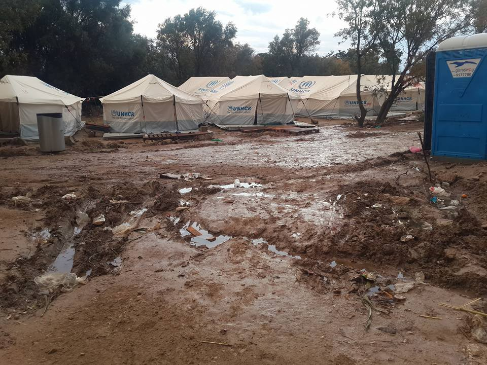
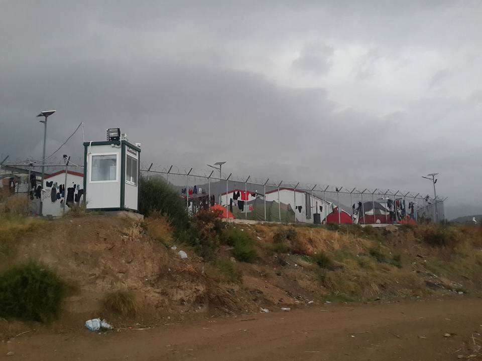
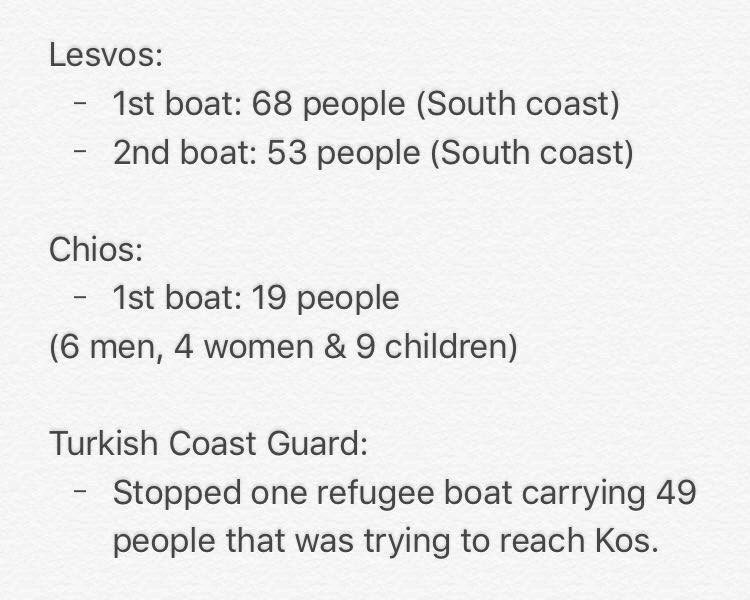
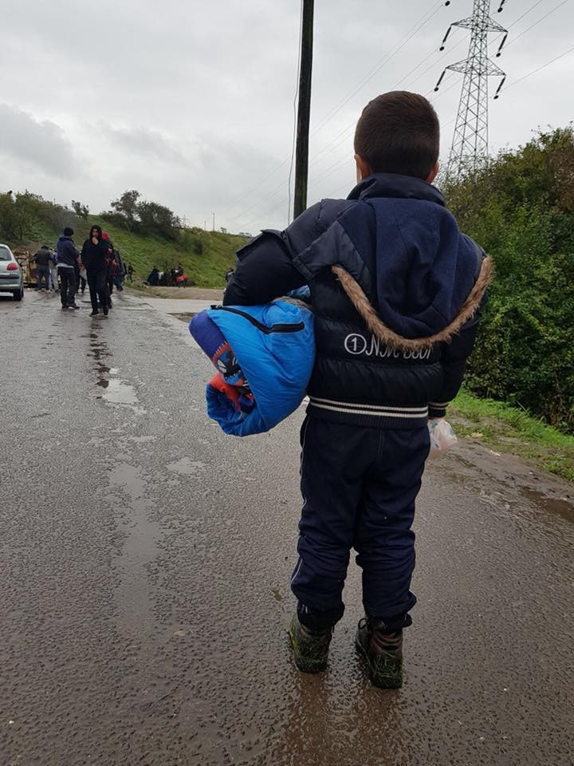
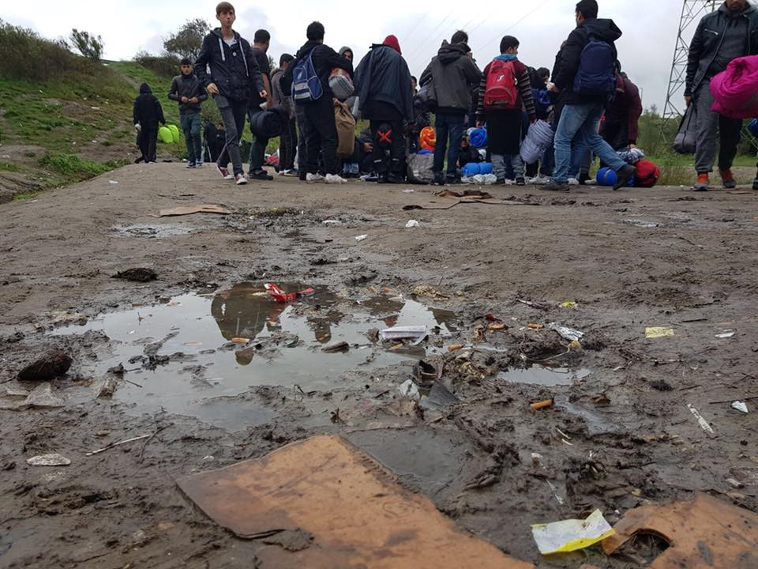
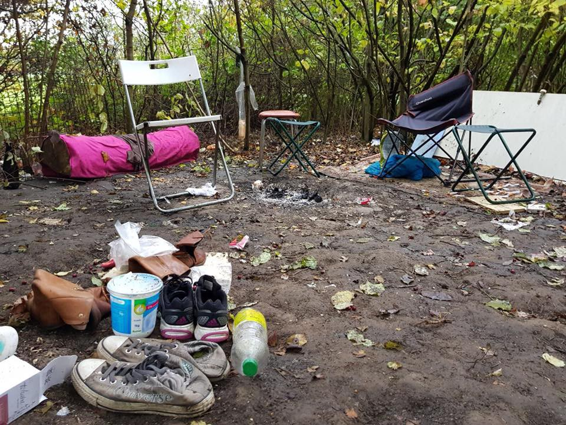

### AYS Daily Digest 26/10/17: Conditions on Chios unbearable

_A look at Vial camp, Chios island / 3,519 registrations in Greece so far in October / Arrivals from Tunisia to Italy / Demonstration at Clermont\-Ferrand, France / Report from Dunkirk / Many volunteer positions available in Greece and Serbia / Turkey cannot be deemed a safe third country? / And more news…_

 \)](assets/9fb0f770f584/1*nSKP2NL1YOLbdBv0Lok54g.jpeg)

\(Photo by [Solidarité migrants Wilson](https://www.facebook.com/Solidarit%C3%A9-migrants-Wilson-598228360377940/?ref=gs&fref=gs&hc_location=group_dialog) \)
### FEATURE: [\#opentheislands](https://www.facebook.com/hashtag/opentheislands?source=feed_text) —a look at Chios

It was announced in the summer that the Greek government will be taking over the management of support services on Chios as of 31st July 2017\. Since then, ECHO funded INGOs have pulled out, leaving a huge humanitarian gap\. Just a few grassroots NGOs remain on the island, [Action from Switzerland](https://www.facebook.com/actionfromswitzerland/?hc_ref=ARQ6yXY6q-MD33o4BW_iRO1TJtCmPMKTPqiqXcLbEvZ4BpmHUbOSdx-KwdvkgVcDKwU) writes\. As of last week, Souda camp was officially shut and everyone moved to Vial\. Take a look at Vial refugee camp, where this video was recorded yesterday morning:

There is no electricity, no sanitation, no running water\. Doctors are warning of a cholera outbreak caused by waste water passing so close to the tents\. “The 19 new arrivals on Chios today — nine children, four women will imminently face the same treatment” AfS wrote\. “We have small children living here with us and the mats we sleep on are soaked in water\. The conditions we are living in are unbearable,” a woman living in the camp tells them\.

Volunteers are much needed on Chios at the moment\. CESRT, who meet the boats of refugees coming from Turkey and provide community and humanitarian support, English teaching, and family support, are seeing a real shortage of volunteers for December\. If you have a minimum of two weeks you can spare helping them out, please contact [Pothiti Kitromilidi](https://www.facebook.com/pothiti.kitromilidi?fref=mentions) on Facebook or [Andy Nixseaman](https://www.facebook.com/andy.nixseaman?hc_ref=ARSaywOSpJmsK0_zK5uN1mbAXC4gvCORuu6gIQh_R9SmjXJaecOwigYdXjBZNNW3Dww) for more information\.

Souda camp \(Photos by a local volunteer\)

Additional delays in deportations from the islands may be expected following two separate recent decisions by asylum appeals committees ruling that [Turkey cannot be deemed a safe third country](http://www.ekathimerini.com/222741/article/ekathimerini/news/committees-at-odds-with-council-of-state-over-refugees-safety-in-turkey) \. The decisions contradict a September ruling by the Council of State, Greece’s highest administrative court, which found that refugees deported to Turkey under a deal with the EU face no threat of torture, inhumane treatment, or punishment\. That ruling had been seen as paving the way for the deportation of at least 700 Syrians in Greece who had appealed the rejection of their requests for asylum in the EU, [ekathimerini](http://The decisions contradict a September ruling by the Council of State, Greece’s highest administrative court, which found that refugees deported to Turkey under a deal with the European Union face no threat of torture, inhumane treatment or punishment. That ruling had been seen as paving the way for the deportation of at least 700 Syrians in Greece who had appealed the rejection of their requests for asylum in the EU.) reports\.
### GREECE
#### Elsewhere in Greece

Elefsina camp was closed yesterday\. The residents have been transferred to shelters and Thiva camp\.
#### Lesvos

This morning 121 people arrived on Lesvos\. 68 of those people were welcomed at 3:15am on the south beach of Kratigos, [ERCI](https://www.facebook.com/ercintl/?hc_ref=ARQQt76q-KiPwF5BUyVMYG8ZfO-jaCmo0rNfOKGusw1WdV-OsvaT8NQdqpj0iQkwFnw&fref=nf) reported\. ECRI is currently the only search and rescue NGO operating on the south shoreline of Lesvos, which means its personnel are working 24/7\. Take a look at a scene they are seeing all too often:

#### Volunteers needed\!

Movement on the Ground is looking for volunteers for the coming few months in Lesvos\. Find more information [here](https://www.facebook.com/movementontheground/posts/959319304244382?hc_location=ufi) if you are interested\.

Also in Lesvos, Hospitality Center for Refugee and Migrants is looking for a person to run the Clothes Distribution Centre, the HSA Tea Point, and the Education Hub\. Find more information and apply through their [website](http://www.humanitarian-support-agency.org) \.

The open cultural centre located in Polykastro is looking for German teachers for children\. Find more information [here](https://www.facebook.com/OpenCulturalCenter/posts/1898446290183780?hc_location=ufi) \.

Finally, you can find more volunteering opportunities in Greece [here](https://goo.gl/J9S12u) \.
#### Athens

See the urgent needs for City Plaza [here](https://twitter.com/Kira13B/status/923428014083510273) and Notara 26 squat [here](https://twitter.com/Notara26/status/923210599865167873) \.
#### New arrivals

There were 3,519 registrations in Greece so far in October\. 14,187 are currently on Lesvos, Chios, Samos, Kos and Leros\. Today’s arrivals are as follows:

### MEDITERRANEAN/TUNISIA

During the last three days, 1,800 mostly young men from Tunisia arrived on Lampedusa and Sicily\. They have virtually no chance to get a legal residence permit, but in Tunisia the number of “virtual” travel agencies on social media organizing the trip to Italy is increasing, taz [reports](https://www.taz.de/Archiv-Suche/!5456982&s=Tunesien/) \. There are long waiting lists in portal towns, according to fishermen\. Since the incident two weeks ago, when a marine ship collided with a refugee boat, media are talking about the new wave of refugees leaving the country\.

Incidents at sea occur almost daily\. Only last week, 52 people died at sea\. According to the latest surveys, 40% of women and 60% of men would like to leave the country\.

The number of refugees from Tunisia arriving in Italy has tripled, while the number coming from Algeria has doubled\. Arrivals from Turkey have increased by 63%, mostly minors\. Most refugees vanish into illegality, with the help of friends and family, and stay in Italy\. Italy has a deportation agreement with Tunisia, but numbers are limited to 30 persons per week\. Libyan and Tunisian human traffickers are cooperating meanwhile to depart from Tunisian ports\.
### CYPRUS

A list of urgently needed items in Cyprus is available [here](https://www.facebook.com/cyprusrefugees/posts/1973305439586057) \.
### SERBIA

NorthStar is looking for long\-term teaching volunteers for their education and recreational centre servicing Belgrade\-based asylum\-seekers\. They currently need English and math teacher volunteers, also workshop leaders for art and science\-based workshops\. Please email theworkshop@northstarserbia\.org if you are interested in working with them\.

If you consider volunteering in Serbia, this document might be helpful for you: [https://goo\.gl/qsy5Ks](https://l.facebook.com/l.php?u=https%3A%2F%2Fgoo.gl%2Fqsy5Ks&h=ATNaX-XWRNmAGi-a4gyN_zpcRMez0nlJvS_qzm3viTu1nZFI0V21igoB3fFNoTepgzZd-VskJ5JJnIirKYOXfb3cK3xKxop0UjoeMGjNbz201R_WXHjqyFS4Xg&s=1&enc=AZNK5LvgflTF5Z7NTdRV2tmz9JntHCoAl2gsLNJ0yxV_iFq0_KcezeMjE2aIHzQCIC_uVPSSajjmLjCejhePyliH&hc_location=ufi) \(on general information, possibly out of date regarding the active groups\) \.

For more than half a year, [Rigardu](https://www.a2p.de/associations/rigardu-e-v) have been providing showers and drinking water for people on the run in Serbia\. After being able to pass on the project in Šid to the NoNameKitchen, they are now moving to Subotica, where about 250 people reside\. The new shower system they are installing there will be much easier to operate, more efficient and more reliable\. Unfortunately, it also costs a lot of money, so if you are able to help visit their [fundraiser](https://www.a2p.de/projects/frisches-duschsystem-fuer-humanitaere-einsaetze) and spread the word\.
### GERMANY

An Iraqi suspected people\-smuggler believed to be responsible for the deaths of 54 asylum seekers was arrested, German police announced today\. His boat sank en route to Europe in 2015, while trying to bring a group of 320 asylum seekers to Greece from Turkey\. Several people refused to board the vessel because it looked unsafe, leading the smugglers to “force them at gunpoint,” The Local [writes](https://www.thelocal.de/20171026/people-smuggler-arrested-in-germany-over-death-of-54-refugees-in-dangerous-crossing) \. He faces between three and 15 years in prison if found guilty\.
### FRANCE
#### Dunkirk

“Today Dunkirk was wet and muddy\. It rained most of the day, and this was tough for the refugees as earlier in the week the police had once again been in and taken sleeping bags and slashed up tents,” Care4Calais sums up the [current situation](https://www.facebook.com/care4calais/posts/1706229666076650) in Dunkirk\.

They distributed 120 sleeping bags, packs made up of dry socks, hygiene kits, and dried fruit, along with targeted distributions of tents, tarps, boots and backpacks\.

\(Photo by Care4Calais\)
#### Clermont\-Ferrand

400 demonstrators protested Wednesday night in order to support the refugees living in tents in front of the university — about 80 of which have been relocated, but another 80 still live on the street\. Tuesday, the activists talked to the mayor, who said he wants to organize a “round table” to address the problem, La Montagne [writes](http://www.lamontagne.fr/clermont-ferrand/social/puy-de-dome/2017/10/25/migrants-a-la-fac-de-lettres-la-mobilisation-ne-faiblit-pas-a-clermont_12605365.html) \.

FAST, a collective of health professionals and support staff providing first aid in Calais, Dunkirk, and Brussels, is now eligible for gift aid\. Donations enable them to buy medical supplies\. Find more about their work [here](https://mydonate.bt.com/fundraisers/firstaidsupportteam) \.
### SPAIN

Spain received another 194 refugees resettled from Turkey—104 of them minors—and mainly from Syria\. Altogether, 2,190 of more than 17,000 promised resettlements have happened so far, El Pais [writes](https://politica.elpais.com/politica/2017/10/25/actualidad/1508959017_267460.html) \.

> **_We strive to echo correct news from the ground through collaboration and fairness, so let us know if something you read here isn’t right\._** 

> **_If there’s anything you want to share, contact us on Facebook or write to: areyousyrious@gmail\.com\._** 

_Converted [Medium Post](https://areyousyrious.medium.com/ays-daily-digest-26-10-2017-conditions-on-chios-unbearable-9fb0f770f584) by [ZMediumToMarkdown](https://github.com/ZhgChgLi/ZMediumToMarkdown)._
