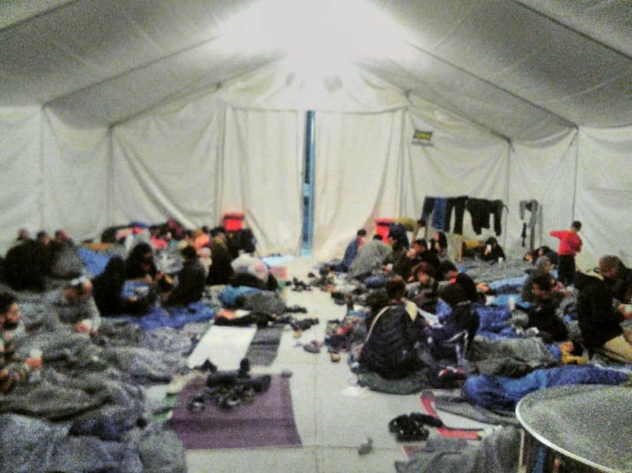
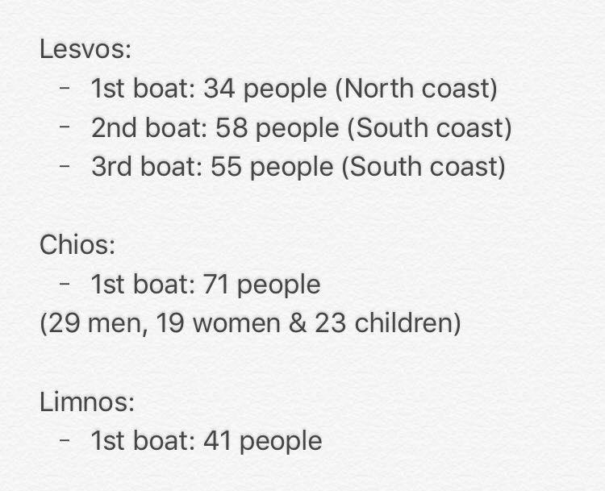
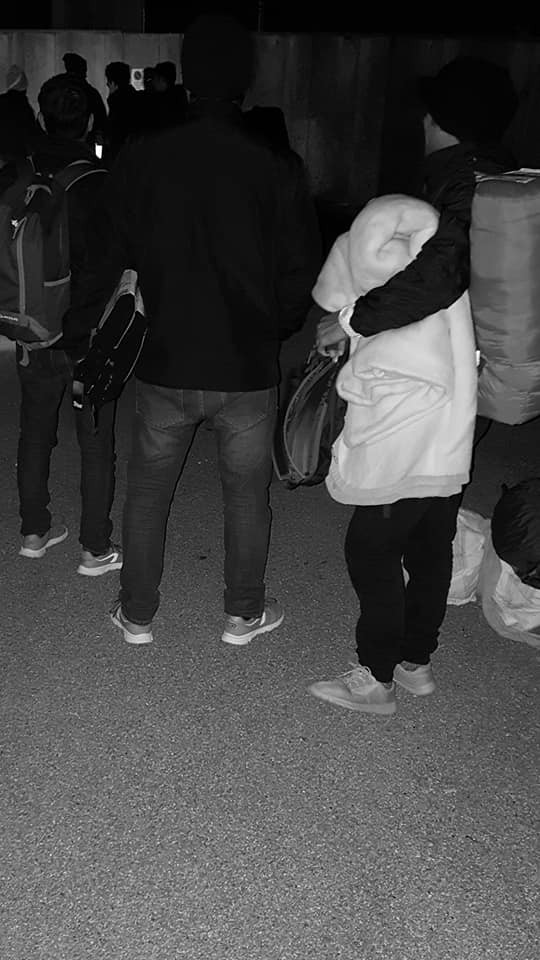
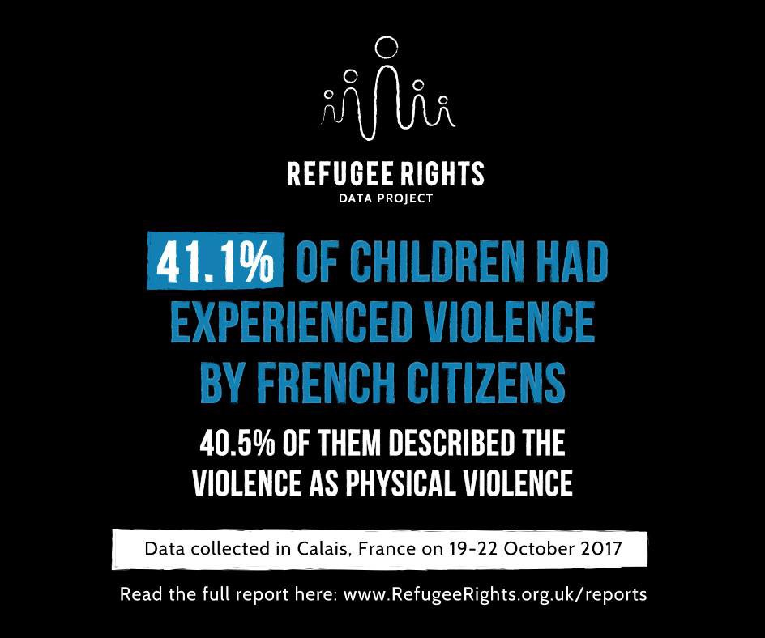
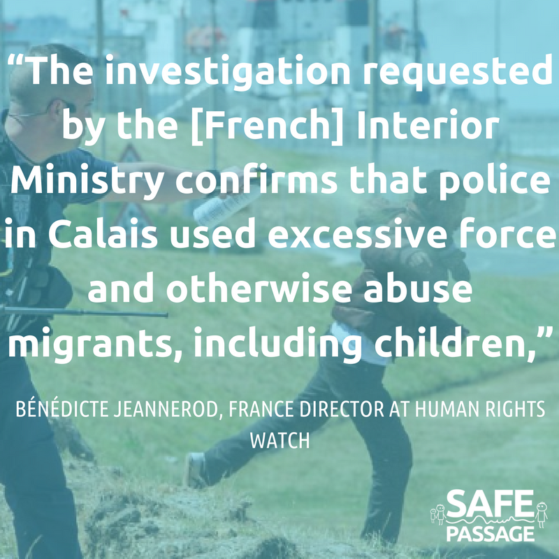

### **AYS Daily Digest 28/10/17: The boy who dreamt to become a pilot**
#### A young Afghan fulfills his dream thanks to a scholarship granted by the US Embassy in Athens / Sappho Square protest enters Day 9, despite National Oxi Day / Remembering the tragedy of those who lost their lives crossing the Aegean two years ago / Terrible video\-testimony of living conditions on Chios / Deplorable living conditions of those forced to sleep on the streets in Pordenone and the never\-ending process required for them to receive what they are entitled to / Another violent episode aimed at damaging asylum seekers in Sassari / Blankets and sleeping bags urgently needed in Paris / Donations needed for a new shower system in Subotica / German language classes in Belgrade

As you go to sleep tonight \. \. know that the refugees in this photo are spending their first night on European soil after fleeing war in the Middle East\. Credit: Refugee 4 Refugees
### **FEATURE**

Sometimes beautiful things happen in life and today we want to talk about one such situation\.

Said Azim Karimi \(18\), from Mazar\-el\-Sharif, Afghanistan, whom we talked to a [few months ago](https://l.facebook.com/l.php?u=https%3A%2F%2Fmedium.com%2F%40AreYouSyrious%2Fays-special-i-dream-of-flying-a9095492f58a&h=ATNVuk7m9jdMYJ4CuF7p1grCDvgpJj2GMJnVT5LPWlQiom_3n1ZADH4NAohChFKmiByVA8T5N0ieBVVD_kVnoBxFgfV8II9zT1IvEOhW_qj61R7vepwkEFCmayYyUeXXPRNYTjiyT2mWuIYPCtQ) , like many others had big projects and goals for his life, the main one to become a pilot; but, like many others, his dreams were interrupted by the harsh reality he had to face once in Europe\.

After a perilous journey, Said and his family reached Samos\.

“ _When I came to Samos, I thought I had come to a jail\. The camp where we lived for the next nine months was like a jail\. At the beginning, we lived in something like a cabin with 40 or 50 people inside\. After that, they took us to another container and we lived there\. We had to change containers three times because of the situation\. And the situation was fighting, people injured, going to jail… and every night like that_ \.”

He also remembers clearly when he was almost caught in a fire caused by one of the regular fights at the camp\.

Despite all these difficult situations, though, Said always kept smiling and looking ahead positively, confident that things would get better one day\. He started to take English and Greek classes to improve his skills and increase his chances of reaching his life goal\.

Said and his family were finally moved to Athens, living with other families in ridiculously cramped accommodations and having to attend high school again to receive the legal documents he needed\. Meanwhile, he kept practicing his English and started taking music classes\. After only three months of violin lessons, he was invited to play with the orchestra of El Sistema, a world\-famous music school\. And he fitted in perfectly, playing in front of several thousands of people at the Odeon Herodotus\.

Now his ultimate dream was to become a pilot\.

_“I have dreamt about flying ever since I can remember\. The funny thing is that I have flown only once, and that was on the journey from Kabul to Herat, at the Iranian border\. We had to take a flight because the road in that area is very dangerous\. I felt great on that flight and sat by the window\.”_

And he has finally made a first step toward this dream\!

On the 27th of October, the US Embassy in Athens granted 78 refugees access to a [scholarship](http://greece.greekreporter.com/2017/10/27/u-s-embassy-gives-78-scholarships-to-refugees-in-greece/) program for for higher education\. The students have been enrolled at three different American institutions in Greece\. And one of them is Said\.

“ _The beneficiaries of the program will attend preparatory English classes, courses in various fields based on their previous knowledge and academic training, and fundamentally, they will have the opportunity to continue their education and acquire skills and credits that they will be able to use either in Greece or in any other country they move to in the future_ ,” the embassy said in a press release\.

This represents a great opportunity for these young refugees to pursue their goals in life and allow them look at their future challenges with positive eyes and new energy\.

“ _My father has pushed me to pursue my dreams all my life and to work hard to fulfill them\. Thanks to him, I have a dream\. He taught me not to give up on whatever I want to be\. And I will try to be just that\. And this is all I am doing_ \.”
### **GREECE**

_Arrivals_

Credit: Erik Gerhardsson

_Lesvos_

As NBK [reports](https://www.facebook.com/NBKLesvos/videos/1028046057335183/?hc_location=ufi) , the protest in Sappho Square continues, despite national Oxi Day \(refugees have been protesting for over a week now to demand the closure of the detention centres on the islands and voicing their will to be moved to the mainland as soon as possible\) \. There was a huge deployment of police\. As we reported yesterday, four refugees are on a hunger strike\.

■■■■■■■■■■■■■■ 
> **[Arash Hampay](https://twitter.com/ahampay) @ Twitter Says:** 

> > Days 10
We want FREEDOM 
We are continuing demonstration
We will not go back to Moria 
#refugees #Greece #freedom #Europe 
#opentheislands https://t.co/1JRgTjI27g 

> **Tweeted at [2017-10-28 07:14:09](https://twitter.com/ahampay/status/924172416531730433).** 

■■■■■■■■■■■■■■ 

Today marks the anniversary of the tragedy of 28 October 2015 when a boat carrying over 300 refugees capsized while trying to reach Lesvos, resulting in the deaths of dozens of people\. Here are [testimonies](https://www.facebook.com/philippa.kempson.1/videos/10155336879734355/?hc_location=ufi) of how volunteers paid their respects to the victims of that day and symbolically to all those who have died and are still dying while trying to reach safe shores\. The anger and disappointment towards the European policies that promote walls and divisions are more bitter than ever during these moments\. A natural question arises: what has changed over these two years?

_Chios_

A critical and alarming video\-testimony regarding the horrifying living conditions on Vial has reached AYS\.

An Iraqi refugee describes the suffering of refugees at the camp\. Vial is overcrowded, refugees have to stand for over two hours to get food, which is appalling\. Rats run freely among the containers, causing critical sanitary conditions\. Medical care is limited and insufficient, there’s no hot water or running water in general, which makes the situation even worse\. Not to speak of electricity\.

The refugee affirms that transportation to and from the camp is limited, making it harder for them to maintain contact with the locals\. Weather conditions are also getting worse so when it rains, the camp becomes a swamp and the residents are forced to sleep out in the cold, due to the shortage of containers, tents, and blankets\. But what most alarms them is the length of the asylum procedure\.

**ITALY**

We, as AYS, have always spoken out against the dreadful living conditions of asylum seekers in Northern Italy\. Especially over the last year, the situation has significantly worsened in a few cities in Friuli Venezia Giulia \(the region on the border with Slovenia\) and over the last months the calls for donations and help have intensified as have the inhumane and fascist policies of the local authorities\.

_Pordenone_

On 20 April 2017, 70 migrants were evacuated from an area where they had found shelter by a large number of police officers, local police staff, Carabinieri and Guardia di Finanza \(finance police\) \. From then on, asylum seekers, all registered at the Questura, are living on the streets, waiting to obtain a place inside the Caserma Monti, the local hub\. They have been sleeping in a ditch in front of the Caserma in an extremely dangerous, squalid and hidden garage or basement\.

The time span required to go through all the bureaucratic steps varies between a month and a month and a half, during which time the migrants are sleeping on the street—60 people/night on average with daily arrivals of six people from the Balkan route or people who were pushed back mainly from Germany, France and Austria\.

Credit: Lorena Fornasir

On 3 October 2017, the current administration publicly stated that it had been authorised to use public funding intended for refugees to strengthen local police actions to “disturb” the “misfits”, i\.e\. refugees\.

As a consequence for months and months there has been in force a practice of harassment carried out by the local authorities to guarantee security and the “decorum of public places”, so refugees are continually being evicted — both day and night; even a simple backpack on the grass is a synonym for a “bivouac” situation\.

Following this logic, blankets and sleeping bags that were donated by MSF are being confiscated and, despite pursuing all bureaucratic routes, they have not been returned\.

On October 10th, just before “PordenoneLegge”, an important cultural event, the Red Cross canteen was moved 4\.5 km away from the city centre, not far from the Monti hub\. Since then, refugees have had to walk more than 4 km there and back along a busy road if they want to eat\.

At the moment, in front of the hub \(Caserma Monti\), there are about 15–20 refugees sleeping in the streets every night, while between 30 and 40 young men are looking for a place to sleep in the fields or in squalid and dangerous places in different parts of the city\. Those who try to find refuge in a place known as Bronx \(a large semi\-covered parking lot under a complex of public offices\) in the centre of the city are persecuted by the police who seize blankets and hunt down the immigrants\.

Volunteers, activists of the Rete Solidale, Catholic volunteers belonging to some parishes, in limited numbers, are there offering support, as is the CRI\.

This is a policy of push backs, rejections, violations of laws currently in force \(DLGS\.142 / 2015\), violation of the right to health and access to treatment, overturning the law in favour of actions of disturbance \(see the administration’s claims above\) against 50/60 asylum seekers who have the right to stay in the country and receive the means to survive \(and who should be allowed into the Caserma Monti within a reasonable period of time and should not have to stay more than a month, sleeping in the streets, harassed by the authorities\) \.

Following a wave of hatred, as Ansa [reports](http://www.ansa.it/sito/notizie/cronaca/2017/10/28/migranti-molotov-contro-centro-sassari_b41d2288-1581-44df-b548-0f724d2a2418.html) , there is still anger at migrants in Sassari after a huge fight broke out yesterday in the popular neighbourhood of Santa Maria di Pisa\. The fight involved 70 people, residents and migrants, and three were injured\. At night, a few Molotov cocktails were hurled at the receiving center on via Solari and — it seems — also at the migrant centre at Platamona, by the sea, luckily causing no harm\. The Sassari police headquarters are monitoring the episodes and will be checking the two centres with local police tonight\.

Migrants are not the only targets of the violence but also NGOs\. In fact, as reported by [rainews\.it](http://www.rainews.it/dl/rainews/media/Migranti-blitz-degli-skinhead-a-Milano-striscione-sotto-la-sede-di-Save-the-Children-608c375d-b0b5-4f1d-9860-69a788832b66.html#foto-1) , skinheads protested against Save the Children\. A banner was hung by the STC headquarters in Milan, saying: “Save the Children? Save business\!” The action was claimed by “Veneto Fronte Skinheads”, which explained in a press statement that this is linked to an intervention led by the NGO with migrant minors\. Save the Children has denounced the action to the authorities and condemns it\. They spoke out again of their efforts to help the most vulnerable children\. Valerio Neri, general director of Save the Children Italy, stated: “ _What happened today is not acceptable, and this is only the most recent attack against the organisation\. We have reached a paradox: whoever saves human lives is being targeted by hatred and violence\. Our mission is still to save children in danger, everywhere and regardless\. Notwithstanding the difficult environment generated, we will keep working with more determination than ever, leading all our projects for the minors in Italy and in the rest of the world_ ”\.

Last but not least, other bad news coming from Italy\.

As stated [here](http://www.tgcom24.mediaset.it/cronaca/lombardia/migranti-truffo-stato-con-bandi-accoglienza-arrestato-imprenditore_3103176-201702a.shtml) , entrepreneur Angelo Scaroni has been arrested for fraud against the State in migrants management\. The man won some competitions issued by the Prefettura of Brescia for accommodation of migrants, but in some cases the accommodations were nonexistent and the migrants were to be collected in cramped spaces\. “Managing” around 40 accommodations, Scaroni was able to earn €7,000 every day\.

A group of 48 migrants, rescued from a fire\-damaged vessel last Friday, by the Portuguese Navy \(working with Frontex\) on the Mediterranean Sea, landed today in Pozzallo\. They were handed over to the Italian authorities and were able to disembark at about 10:30 am\. See [link](http://www.abola.pt/Mundos/Noticias/Ver/699115)

**SERBIA**

Rigardu e\. V\. is creating a new shower system in Subotica and needs your help\! Please consider [donating](https://www.betterplace.org/en/projects/57942) in order to improve the hygienic conditions of refugees at the camp\.

Finally some good news from Info Park: new [German course](https://www.facebook.com/infoparkserbia/posts/1461611080559818) \! :\)

Besides the activities normally managed by Info Park, it provides German classes following the official language integration curriculum from BAMF, the Federal Agency for Refugees and Migrations\. Since the beginning of October, German classes have been provided for the numerous arrivals and those who were interested\. “After two months, the knowledge our beneficiaries learn is sufficient \(once in Germany\) for them to pass the language test and gain access to various services reserved for asylum seekers, especially in education\.”

Classes are Monday, Wednesday, Thursday and you can learn through while laughing :\) They are opened to everyone residing in the Belgrade area and, if interested, get in touch directly with the organisers\.

**FRANCE**

Paris Refugee Ground Support is in urgent need of blankets and sleeping bags, as winter is approaching and temperatures dropped to 7 degrees at night\. If you can help, you may do so through this [link](https://www.gofundme.com/4dwnptc) \.

This week, Care4Calais also [distributed](https://www.facebook.com/care4calais/?hc_ref=ARRsIS-edo3B0zD_CljJ8nuFNVoE9JBw3yRdDmtug-r0DTH1v94bSzus5bxL1IR89tU&fref=nf) blankets, sleeping bags and warm clothes, in Paris, with the collaboration of local volunteers\.

“ _Refugees in Paris expressed feelings of desperation and despair about their living conditions, as the police continue to clear out settlement areas and take away the refugees belongings \[…\]_ ”\.

A stock of boots, sleeping bags, toiletries, tinned food and rice was given to the local volunteers to be distributed every evening to the many refugees who are scattered across the city\.

Credit: Refugee Rights Data Project

French police have never been kind or sympathetic to refugees\. The Refugee Rights Data Project is about to release a new report next week on the violence suffered by refugee children in Calais \(at the hands of police and French citizens\) and their impossibility of finding guidance and help\.

“This included anything from racial verbal abuse to the throwing of glass bottles from houses and moving vehicles\. Some children have been captured and beaten up by civilians, or taken to remote locations far from Calais\.”

Also a recent report from [Human Rights Watch](https://www.hrw.org/news/2017/10/24/france-inquiry-finds-police-abused-migrants-calais) “has found convincing evidence that police used excessive force and committed other abuses against child and adult migrants in Calais”, including the use of chemical sprays and regularly confiscation of personal belongings, such as blankets, sleeping bags, clothes etc\.

Credit: Safe Passage

> **_We strive to echo correct news from the ground through collaboration and fairness, so let us know if something you read here isn’t right\._** 

> **_If there’s anything you want to share, contact us on Facebook or write to: areyousyrious@gmail\.com\._** 

_Converted [Medium Post](https://areyousyrious.medium.com/ays-daily-digest-28-10-17-the-boy-who-dreamt-to-become-a-pilot-b045a79afe31) by [ZMediumToMarkdown](https://github.com/ZhgChgLi/ZMediumToMarkdown)._
