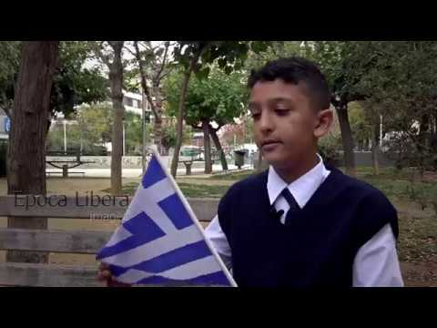
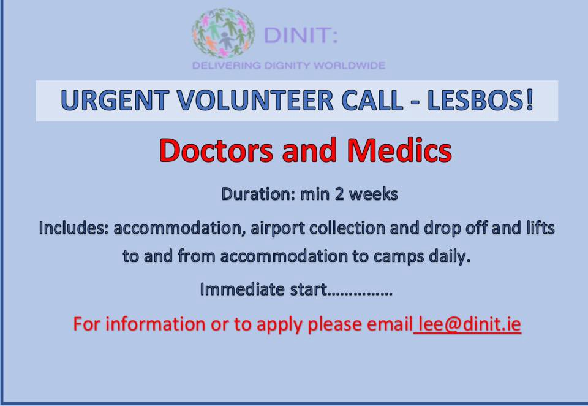

### AYS Daily Digest 29/10/17: Court rules asylum seekers have the right to freedom of movement in Spain
#### Serious maltreatment of unaccompanied refugee minors in Greece/ Representative of the EC states “island residents are heroes”/ volunteer and aid needs across Greece / Ahmed H’s case continues / Afghan minister asks for Austrians to end deportations / Children detention practice in question in Sweden / Hunger strikes on Lesvos and in Denmark; and more news…

 \)](assets/2d9a99c8b42c/1*8U9RGtps3RhhU0LgbXb5_A.jpeg)

Counting the people on the photo, during the day Salvamento Maritimo teams have rescued 85 people in their search and rescue operations \(Photo: [SALVAMENTO MARÍTIMO‏](https://twitter.com/salvamentogob) \)
### FEATURE

Spanish Superior Court [has ruled in favour](http://www.europapress.es/epsocial/migracion/noticia-tsjm-sentencia-solicitantes-asilo-ceuta-melilla-tienen-derecho-viajar-libremente-peninsula-20171027130703.html) of the asylum seekers in Ceuta, saying they have the right to move around the territory of the Peninsula upon reaching Ceuta\.

This question has previously been decided otherwise by the Spanish police officials and institutions in charge of foreign relations and borders, including the Spanish Commission for Refugees\. The refugee who pushed this case forward intitially received a negative decision from the authorities, either through their official decision or as a result of their administrative silence\.

The usual legislation applicable to these situations as well, checking the documents and people entering the peninsula from Melila and Ceuta will still be an active practice, although they must not restrict people’s right to freedom of movement\.

The previous restriction of movement violated people’s fundamental rights, CEAR said\. Many people had previously decided not to ask for asylum in Ceuta, due to this restrictive practice that made it impossible for all asylum seekers there to move freely\.
### Sea

The UN Refugee agency in their latest [report](http://data2.unhcr.org/en/situations/mediterranean) say that **147,217** people entered Europe by sea, while the estimated number of dead or missing people who were on the same route, as of October 27, is **2,806\.**

■■■■■■■■■■■■■■ 
> **[Sergio Rodrigo](https://twitter.com/SRodrigoruiz) @ Twitter Says:** 

> > Así ha sido el rescate de la balsa semihundida frente a las costas de #España. Hoy 255 rescatados de 10 #pateras https://t.co/RcwUUE5apC 

> **Tweeted at [2017-10-28 20:38:09](https://twitter.com/srodrigoruiz/status/924374751790936064).** 

■■■■■■■■■■■■■■ 

51 people travelling to Tanger have drowned\. Only two bodies have so far been found, while Morrocan teams are searching for the other victims of the drowning\.
### Greece
#### Growing number of unaccompanied refugee children in urgent need of shelter, care and protection

Only a third of the nearly 3,000 unaccompanied refugee and migrant children currently in Greece are receiving proper shelter and care, [UNICEF warned](https://www.unicef.org/media/media_101396.html) today\. One of the most striking pieces of evidence that the authorities must do something to improve the protection of the youngest is the fact that the reception facilities for unaccompanied children on the islands are now hosting twice as many as they were designed for, compromising the safety and wellbeing of the children\. For those children who have family elsewhere in Europe, UNICEF is urging other European countries to step up family reunification\.

### Lesvos

■■■■■■■■■■■■■■ 
> **[Arash Hampay](https://twitter.com/ahampay) @ Twitter Says:** 

> > On Friday 4 people started to #hungerstrike , on Saturday 1 perain joined them. Today another person has joined who refuses to drink water. https://t.co/R70aO8B8RE 

> **Tweeted at [2017-10-29 13:01:31](https://twitter.com/ahampay/status/924622222240681984).** 

■■■■■■■■■■■■■■ 

> The Coordination for the Refugee & Immigrant Support Movement of Lesvos is reaching out to all who can assist with the following: 

> At the moment, refugees who are residing in protest on Sappho Square depend on the support of organizations, groups and collectives, as well as, the individual help of civilians who are willing to show their solidarity by offering food, drink and other basic items as listed below: 

> _• Electric water boilers \(for hot beverage and baby food preparation\)_ 
 

> _• bottled water, juice, sugar, tea, coffee, baby formula \(milk\), long lasting milk \(not condensed\), rusks, diapers,baby wipes, sanitary pads, toilet paper,_ 
 

> _• fruit creams and baby creams, biscuits, chlorine for cleaning, trash bags, sleeping bags, fleece blankets, beanies, scarves and gloves, and first aid kit_ 
 

> _• electrolytes and vitamins_ 
 

> _• Also needed: fruit plastic utensils and drinking cups, kitchen roll paper_ 
 

> _• Small towels, soap and shampoo, toothpaste and toothbrushes_ 
 

> _• Small toys suitable for young children_ 

> In regard to clothes, we require clothes especially warm/long sleeve items or even isothermal if possible and there will be a constant demand throughout the period that the refugees will be at the square\. 

> Please try to cover the immediate need for the following: 

> • _Men’s shoes \(sizes 39 to 43\)_ 
 

> _• Women’s shoes \(sizes 36 to 40\)_ 
 

> _• Women’s and men’s pants and underwear_ 
 

> _• Men’s jackets \(small and medium sizes\)_ 
 

> _• Children’s coats_ 
 

> _• Pants for ages 4–17 years_ 
 

> _• Socks and underwear for all ages_ 

> All donations will be collected at the **Worker’s Club \(Ergatiki Leshi\) of Lesvos** island situated on **Pittakou Street 15** 
 

> and the drop offs will be arranged after phone communications at the following numbers: **6970998829, 6996937018** 

### EC on the Greek situation

[According to](http://www.ekathimerini.com/222769/article/ekathimerini/news/greek-islanders-are-heroes-says-commission-vp) the vice president of the European Commission, their experience “has shown that it’s hard to get the support we provide in the spot where it is needed most\.” This official was one of the main protagonists in the EU\-Turkey deal and now he says that people whose asylum applications have been processed should be returned to Turkey as stipulated in the agreement\. He also said:

> Migrants must stay on the islands, despite the difficulties, because their transfer to the mainland would send a wrong message and create a new wave of arrivals\. 

### Athens

A new electronic ticketing system is being introduced for the Athens public transport network, replacing the older paper tickets and cards\. Find the updates [**here**](https://www.athenstransport.com/english/tickets/) \.

The **Ellinikon Warehouse,** distributing dry foods and essential non\-food items to more than 5000 people in shelters, squats, day centres, private apartments, some camps and warehouses on the Islands, updated their list of items needed:

_FOOD:_ 
_Milk \* \* \*_ 
_Black Tea \* \*_ 
_Instant coffee \*_ 
_Sugar \* \*_ 
_Oil \* \* \*_ 
_Breakfast things \( marmalades/jams, Nutella \) \* \* \*_ 
_Tomato Sauce \* \*_ 
_Biscuits_ 
_Canned vegetables \( corn, peas, green beans, mixed, etc \) \*_ 
_Pasta \*_ 
_Rice_ 
_Couscus/Bulgur_ 
_Tuna_ 
_Sardines_ 
_pulses \( legumes \) — lentils, chickpeas and white beans_ 
_Single juices_ 
_Juice_ 
_Flour_ 
_Tahini_ 
_Spices and condiments_

_FRESH FOOD:_ 
_Chicken_ 
_Eggs \* \*_ 
_Cheese \*_ 
_Yoghurt \* \* \*_ 
_Meat_

_CLEANING:_ 
_Clothes detergent \* \*_ 
_Dishwashing liquid \*_ 
_All purpose\-liquid cleaner_ 
_Chlorine \*_ 
_Cleaning tools: mops, brooms, sponges \*_ 
_Plastic trash bags \(big size\)_

_BABY CARE:_ 
_Pushchairs / strollers \* \* \* \*_ 
_Wipes \*_ 
_Diapers \*_ 
_Baby formula 1, 2, 3_ 
_All kind of baby care hygiene products_

_PERSONAL HYGIENE:_ 
_Shampoo \*_ 
_Gel_ 
_Shaving foam_ 
_Toothpaste_ 
_deodorant_ 
_adult incontinence diapers \( small / medium \) \*_

_PHARMACY:_ 
_Permetrine 5% \(scabies treatment\) \* \*_ 
_Paracetamol_ 
_Rubbing Alcohol_ 
_Cough Syrup \( Adult and children \)_

_CLOTHING_ 
_New underwear: adults and children \(all sizes\) \*_ 
_shoes \(specifically trainers and other sports shoes\) \* \* \*_ 
_boots for winter months \(but no HEAVY WINTER BOOTS OR GALOSHES\) \* \*_ 
_Men’s coats \( preferably water resistant, S/M/L \) \* \* \*_ 
_Jeans for men and women \(all sizes\) \* \*_ 
_Men’s winter pants \( corduroy, etc \) S/M/L \* \*_ 
_Socks for men and women \* \*_ 
_New underwear: adults and children \(all sizes\) \*_ 
_Long sleeve t\-shirts \(all sizes\)_ 
_Leggings for girls and women_

_Women clothes should be long sleeved in all cases\._

_WINTER ITEMS_ 
_Tents \( 2 to 4 people, easy to mount \)_ 
_Blankets \( not duvets \)_ 
_Sleeping bags & undermats_

_OTHERS:_ 
_Bed sheets_ 
_Suitcases medium/big size in good condition \(people are being relocated to other countries and need suitcases to carry their belongings\)_

> The stars next to the items below denote the urgency of need/priority\. 3 stars being a higher need\. For fresh foods and cleaning items, if you are able to, monetary donations would be helpful enabling items to be purchased as needed\. 

### Volunteering

Do Your Part is looking for volunteers to join their volunteer team for November and December\. Please email DYPLisa@gmail\.com for info\.

Volunteers are urgently needed at HSA for Kara Tepe Refugee camp, please register on: [www\.humanitarian\-support\-agency\.org](http://www.humanitarian-support-agency.org/)

### Bosnia and Herzegovina

The officers working on asylum and other related professions should be provided trainings and LGBTI asylum seekers should be treated with respect and sensitivity and provided information in the course of the asylum procedure, the Human Rights Ombudsman recommended, as the Annual [Report](https://l.facebook.com/l.php?u=http%3A%2F%2Fsoc.ba%2Fen%2Fpink-report-2017-annual-report-on-the-state-of-the-human-rights-of-lgbti-people-in-bosnia-and-herzegovina%2F&h=ATM5eLRH5vkWyaSO674DzuQk_zDCPMWHcZ2Mh6JTozDhumEBqvkSYMkr9QfNuhWkcMOhLQkdwCixHta2VTOaCaOftQMv1kMjxn_uHauKz4yWxWrpwX1Y8K0ShDqiiYhzoPaurXp_B6T2IcVI18tDCPVnO3V5VmTQtBNbtkhijScMkPjljLN4Jud8yG7zbfj-hFnwVnao-PlP0isvKZLz0Aun_1iP2h4C0TIBMrzopY_2jpXR14O7xz1yvw_6BP_gpdwwBdQc6moSOourTDk1DW9QiOA) on the State of the Human Rights of LGBTI People in Bosnia and Herzegovina \(BiH\) states\. The problem lies in the fact that until now the adopted amendments to the Law on Asylum of BiH did not encompass sexual orientation and gender identity as possible reasons for persecution and they have not been explicitly recognised as grounds for asylum seeking\.
The procedures need to be established which shall make possible for LGBTI asylum seekers to feel safe to speak about their sexual orientation or gender identity, and to remedy the social isolation and discrimination that LGBTI asylum seekers experience in asylum centres in an appropriate and systemic manner\.
### Hungary

The trial of Ahmed H\. continues tomorrow\. It is going to be the court of first instance again\. [Here](https://l.facebook.com/l.php?u=http%3A%2F%2Fkettosmerce.blog.hu%2F2017%2F06%2F18%2Ffordulat_az_ahmed_h_elleni_koncepcios_perben&h=ATOn7mEAgMf3i9RBTw3LpeXxiBkNTAekNTf1YllOJPuxS3RJj35IHv7VknBDsYginVMYZqQABwC1gsIeo6ShjYJ_rCIYOEWnmliuaOoE1a8_3vZ90CeHvEvkI069izhwrZT8FZFO2pNMATSmJWHtXwB5WLo2t7ECJFOLNa2AHAushPpOJGV1n3XXbAwb-AgLmIZq4nnKKr2fGmyq9Wal4B6FFGH4tE4ntP8qbn22HA9-KHbtrH2m3q88zLilenM-h07Xz_pJqgdxan7vjg) ’s a report about the reasons from the previous trial\.
You can join the decentral actions before the trial, or support the efforts by [contributing to cover the costs](https://freetheroszke11.weebly.com/) and spread the word\.
### Austria

During his visit to Austria on Thursday, the Afghan Minister for Refugees expressed gratitude for the treatment of Afghan students in Austria, but also asked Austria to follow Germany’s example and stop deportations to Afghanistan due to security situation in the country\.
### Italy
#### Racist attack in Rome

Two young men from Bangladesh and from Egypt suffered [a violent attack](https://l.facebook.com/l.php?u=http%3A%2F%2Fwww.ansa.it%2Flazio%2Fnotizie%2F2017%2F10%2F29%2Fbranco-pesta-migrante-in-pieno-centro-a-roma-insulti-razzisti_6ffdb426-65eb-44fe-bfe4-8564e91aee25.html&h=ATPC6bwpqizdyTHtJHTS3lpuuUMMHH0V2DYkG1PXIV1NEnaCzW7Nl3ceRjKuf25bvj4SHHC2bkW9ncVioh73usp8i-OBOrzkiNeB-UGeZlmpl05dJtaLbI3cZBCvLDIdnBbepED-bJal7l5MGq8Z1aev59uSrex4I6_gNuwA2dh51AYAS2hGpHzxJWCrXEdesb_E2tl4oWAWiMxB4X-mvdDTa_XzjOJVbW8T9hv2VqdoJL7Pu2oyVQjnaa1V24YLdXZX8t038Jr1bGo12T63QoES1Viq) last night in Rome city centre\. Racist slurs and offenses and the attack that followed came from five young Romans, all aged between 17 and 19\. Police apprehended the attackers and held one accountable for attempted murder as the Egyptian ended up with serious injuries in the hospital\.
### France
#### Volunteering

Volunteer French Teacher for 30\-35 refugees is needed for Monday, Tuesday, Thursday and Frinday for 3 hours a day and 12 hours a week\.
Classroom and teaching equipment is provided\.
For more information and if you want to help: Fa\_cd@clubmember\.org

Medics are needed at the [First Aid Support Team](https://www.facebook.com/groups/FirstAidSupportTeam/?hc_ref=ARSHknM_DCFLaRVdgLVe8sZFDJGo8Io8MSb8bf7Iqt2poZigtmxs2rtkSBnIZJAxWHs) \. More information and application: [www\.f\-a\-s\-t\.eu](http://www.f-a-s-t.eu/)
### Denmark

[Danish volunteers](https://www.facebook.com/CLOSEKGH/?ref=gs&hc_ref=ARRNfP0xqZgms8_u3Hk4UH9PDCDtUrhbKhK3StLJA-RGcF0GsbTqJyTBJDVRv2OO9MY&fref=gs&hc_location=group) forward the message from the hunger strikers:

> Yesterday, on Friday the 27th October, we ended the hunger strike after 17 days without food\. During the hunger strike, we have gotten support from people outside Kærshovedgård and formed new alliances\. We want to work together with the people who support us in the future, to get our cases reopened and Kærshovedgård closed\. We, the people in Kærshovedgård, are humans like others, and it is not possible for us to return to our home countries\. Our fight continues\. 

### Sweden
#### Questionable children detention practice

44 children have so far been taken into custody and held in detention before being deported, according to the official police’s statistics\. People that are put in this kind of detention are for various reasons under a suspicion they might disappear before the day of the deportation\.

Great skepticism and a lot of critics followed the practice of such detention practices and the [case of Michail](https://l.facebook.com/l.php?u=https%3A%2F%2Fwww.dn.se%2Fnyheter%2Fsverige%2F13-arige-michail-ar-inlast-trots-att-han-ar-svart-sjuk%2F&h=ATOd2xNOvVYnK9pvbm0DrdSd6QnE3ru0Uu_xct3jYxV13CUSXjbCxn2yufzwCL2gmgZYgH4kgJoGkFCdc5OrbyoHdUUgp3HGsciWnAREu2YyMJEz-hdb2Y56mWaSucyrcuid7KiRDhPsbEy6JQNuHkcaT-cuJNp3QMY-_gGU-ccKbK3Y5tGKSj5GYxocoGA89ja5RhCQdLF1yFw8SpVOvvuOlsDjpdJtx3L-3bWRFpe4-AkjjGfRwBOayLif-dCBzXGmRMuqgKpKcp9K7b-Daxf7IHs) , a 13 year old boy, represents a strong case for a formal investigation of the procedure for children’s detention in Sweden\.

**_We strive to echo correct news from the ground through collaboration and fairness\._**

**_Every effort has been made to credit organizations and individuals with regard to the supply of information, video, and photo material \(in cases where the source wanted to be accredited\) \. Please notify us regarding corrections\._**

**_If there’s anything you want to share or comment, contact us through Facebook or write to: areyousyrious@gmail\.com_**

_Converted [Medium Post](https://areyousyrious.medium.com/ays-daily-digest-29-10-17-court-rules-asylum-seekers-have-the-right-to-freedom-of-movement-in-2d9a99c8b42c) by [ZMediumToMarkdown](https://github.com/ZhgChgLi/ZMediumToMarkdown)._
