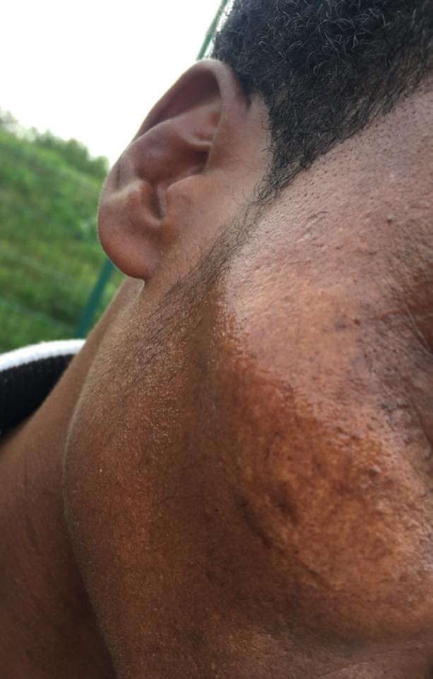
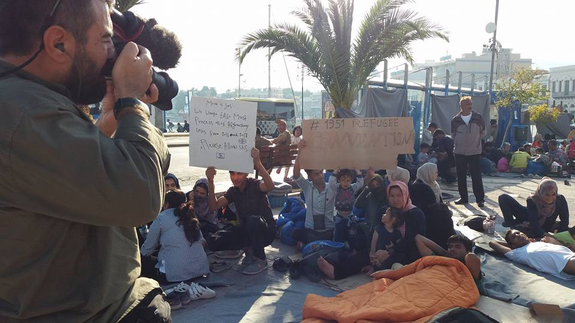
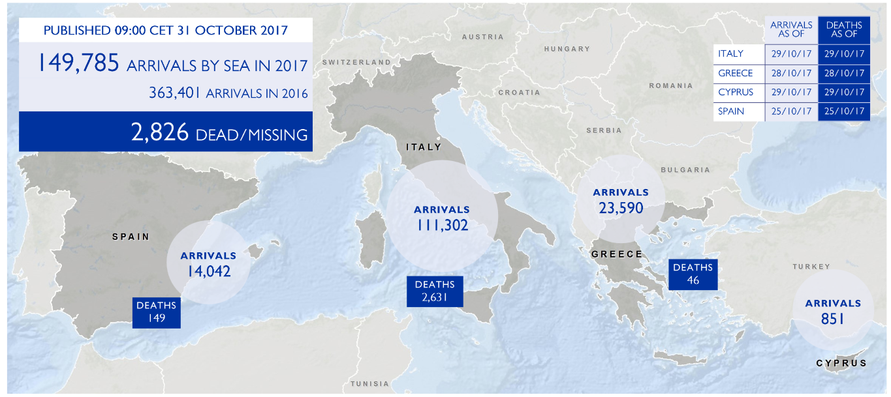

### AYS Daily Digest 31\.10\.17: Real\-Life Demons Haunt Calais Refugees this Halloween

A photograph of the bruise allegedly sustained by the victim of the incident\.
#### Feature

This Halloween, prepare yourself for a scary story that unfortunately is not fictional\. A volunteer operating in northern France has posted a photograph of a refugee who sustained a beating by the French police\. The volunteer reports that the man had been lying on the grass with other refugees, and that she came across a group of police officers victimizing the group, beating and kicking them\. After confronting the police, the officers laughed at the volunteer and mocked her\. Such incidents unfortunately happen far too often, and the French police are well\-known for its harassment of refugees in the area\.

Unfortunately, this is far from an isolated incident\. The Refugee Rights Data Project \(RRDP\) has recently [released a report](http://refugeerights.org.uk/wp-content/uploads/2017/10/RRDP_TwelveMonthsOn.pdf) surveying refugees in Calais on their living conditions since the demolition of “The Jungle”\. 233 refugees \(of whom 94 were minors\) were interviewed\. According to the report, 91\.8% of refugees report having experienced police brutality\. Minors have a slightly higher percentage of violent run\-ins with the police, with 93\.4% reporting police brutality\. Under the rubric of police brutality are tear gas attacks, confiscations of refugees’ belongings, and, as the above\-mentioned incident shows, beatings\. A survey of the refugee population of Calais carried out between October 19 and October 22 estimates that 700 refugees are currently in the area, most of them sleeping rough\.

> “While I was sleeping, they came over and sprayed me on my face, they hit me with their baton on my knees which left me numb\. They took my shoes and told me to leave\.” 

French authorities are slow to react to these findings, and when statements by officials are made, they are usually quite derisive in tone\. According to one French official, the government feels no need to intervene in the situation because, “these are allegations, individuals’ declarations, not based on fact\.”
#### Lebanon
### Support the winterization campaign in Bekaa\!

Winter is coming to Bekkaa\! It’s already getting colder and the nighttime temperature is dropping significantly\. For many people in certain settlements, this is their first winter in their current houses, which means that they are badly prepared for the winter\. Big NGOs don’t have either enough funding nor resources and people will be cold in the upcoming months\. Even a small donation can make a big difference for many individuals\.

#### Syria
### HRW reports on airstrikes

Today [HRW has reported](https://www.hrw.org/news/2017/10/31/russia/syria-deadly-airstrikes-trapped-civilians) in Russian\-Syrian airstrikes in the province of Idlib which have killed civilians\. HRW reports that on September 19, an attack hit a market and residential areas\. According to the organization, 3 attacks after the 19th of September were responsible for killing at least 72 people\. The joint Russian\-Syrian airstrikes are allegedly using vacuum bombs, which are more powerful than conventional munitions and are therefore responsible for a greater amount of damage\.
### Committee to Protect Journalists reports on the killing of journalists in Syria

In the group’s yearly rankings, Syria came out in second place of the places where journalists are most likely to be killed with impunity\. Syria is sandwiched between Somalia in first place and Iraq in third place\. CPJ was unable to confirm any murders of journalists since last year’s index, but 6 killings were reported in the previous year \(2016\) and a total of 17 are confirmed to have been killed in the last decade\. Not a single case of such a killing has been prosecuted in Syria\. Groups such as ISIS and the Syrian regime are the primary culprits in such killings\.
#### Greece
### Refugee in Vial attempts suicide after his asylum case is rejected

A refugee attempted to take his own life today after his asylum case was rejected, as he feared deportation\. The man had climbed onto the roof of a building and stood on the ledge for a while\. Ultimately he was talked out of jumping\.

■■■■■■■■■■■■■■ 
> **[City Plaza Squat](https://twitter.com/sol2refugees) @ Twitter Says:** 

> > #Vial #Chios: A #refugee tried to commit suicide. His case rejected &amp; he's afraid of #deportation. #OpenTheIslands.
&gt;[facebook.com/abdullah.alhom…](https://www.facebook.com/abdullah.alhoms.3/videos/142165243176785/) https://t.co/I4xuW1He9w 

> **Tweeted at [2017-10-30 14:55:03](https://twitter.com/sol2refugees/status/925013183001227264).** 

■■■■■■■■■■■■■■ 

### Women and girls join in on ongoing hunger strike in Mytlini

Five men have been on hunger strike in Sappho Square in Mytilini for five days\. Starting today, they were joined by five women and girls\. The action is part of the ongoing effort to pressure authorities to give refugees on Lesvos proper accomodations for the winter\. Last year several refugees froze to death on Lesvos because of inadequate shelter\. The names of the girls and women who have joined are as follows:

Adele Ghias,15 years old
 Ali Ghias, 16 years old
 Karime Ghias, 17 years old
 Shafighe Ghias, 21 years old
 Mariam Mohammendi, 42 years old

By Arash Hampey\.
### UNICEF reports that there are 1,800 unaccompanied child refugees without proper shelter

Of the 3,000 unaccompanied child minors estimated to be in Greece, a staggering two\-thirds of them have no access to the proper shelter and care that they are entitled to under the law\. UNICEF recommends that the situation be remedied through the immediate transfer of all child refugees currently on the islands onto the mainland, so that they may be put into foster care or supervised living schemes which are more readily available on the mainland\.
### Refugee Info Bus releases video detailing the expedited family reunification process

### Campfire Innovation seeks volunteers

All skilled volunteers are encouraged to apply\. After filling in the questionnaire linked to below, please be sure to send an email to [experts@campfireinnovation\.org](mailto:experts@campfireinnovation.org) containing a copy of your CV with your name and skillset in the subject line\.

### Numbers

Lesvos: 93 arrivals

[233 intercepted by the Turkish Coast Guard\.](https://twitter.com/sarwatchmed/status/925394324636004355)

[UNHCR numbers on available housing](https://reliefweb.int/sites/reliefweb.int/files/resources/60477.pdf) , and until today there is over 10 space in provided accomodation while hundreds, including kids, are left to sleep outside\.
#### Hungary
### European Committee for the Prevention of Torture performed a mission to assess situation of detained refugees

The visit was aimed at assessing the living conditions of the refugees living in the camps on the transit zones at Tompa and Röszke\. The visit lasted from October 20 to October 26 and it is expected that a detailed report of their findings will be released in the near future\.
#### Switzerland
### Euro\-Mediterranean Human Rights Monitor condemns Swiss detention practices of children

[The organization has released](https://euromedmonitor.org/en/article/2121/Switzerland:-Authorities-arbitrarily-detain-child-asylum-seekers) a statement on the awful conditions that dozens of refugee children in Switzerland find themselves in\. The authorities have taken it upon themselves to imprison young people at airports for a period of up to 60 days while an investigation is carried out to determine the legitimacy of their asylum claims\. “What Switzerland is doing to child asylum seekers is a violation of their rights and a threat to their health and well\-being in contravention of the European Convention on Human Rights and the Convention on the Rights of the Child,” said Ihsan Adel, Euro\-Med’s legal advisor\.
#### Italy
### Refugee Crisis Database publishes useful guide to online resources for volunteers and refugees

The guide may be downloaded [here](https://lookaside.fbsbx.com/file/FURTHER%20ONLINE%20RESOURCES%20FOR%20VOLUNTEERS%20%26%20REFUGEES.pdf?token=AWyC8AW0TDMkkar01Em8h7lgDvogpCs4M4v0y7tTkxp9v7OJL0k1mo3MQDLT5STcn8jJPx2KCybAOaH-slOy0Slx4KeQ4DCnzvq1mYIcwqw5HyXHG-ZVviQegnF_LVotn0ChNjDfEPR9kJmICq6ON5vP7X6AHucKJBB5X_4mb722SqrjdxdodupI6bRA0RtuZDp1_LeT1prSks9gC2M2Lt5x-eXy1ARwLHBg-S0dzabgbw) as a PDF\.
#### France
### Care4Calais reports from Ouistreham

In a Facebook post, Care4Calais reports on their trip to Ouistreham, a small town located approximately 5 hours from Calais\. In the town are currently around 200 refugees, most of them boys and young men from Sudan, who have settled down in the woods next to a farmer’s field\. The Care4Calais team distributed much\-needed essentials among the refugees, such as tents, sleeping bags, coats, and sneakers\.

As the team was packing up to leave, a young boy approached one of the team and said to her, “Excuse me madam\. Can you take me with you to somewhere else? I don’t like it here\. We sleep in the woods and the police take our stuff\.” The volunteer, heartbroken, told him that it was better for him to stay put, as conditions in Paris and Calais are even worse\. Such is refugee life in the France of today\.

### Refugee Community Kitchen is in need of help\!

Refugee Community Kitchen has launched a fundraiser to allow it to continue its operations in Calais\. The organization is responsible for preparing over 2500 meals per day, and naturally the ingredients are not free\. To allow RCK to continue its essential work, please consider donating to the organization at the link below\.

#### UK
### Refugee Rights Data Project

This Thursday, MPs will debate the situation facing unaccompanied minors in Europe\. RRDP is asking supporters to write to their MP to urge them to take decisive action\.

RRDP’s research highlights the extent of the child protection failure taking place in France, one year on from the demolition of the Calais camp\.The research found that:

•98\.9% of children were unaccompanied
•82\.4% did not have access to information about their rights and opportunities to change their situation
•71\.7% of children described the police treatment in France as ‘very bad’

There is an urgent needed to ensure these vulnerable children are given access to safe, legal routes\. Many of the children RRDP spoke to could be granted protection under the ‘Dubs’ scheme or through family reunification under Dublin III\.

Ahead of the debate in Parliament on 2 November, RRDP is urging its supporters to write to their MP\.

For more information and tips go to: [http://refugeerights\.org\.uk/takeaction/](http://refugeerights.org.uk/takeaction/) \.

Read RRDP’s latest report: [http://refugeerights\.org\.uk/reports/](http://refugeerights.org.uk/reports/)

#### Mediterranean

The last IOM figures on Mediterranean crossings\.
### Portuguese vessel rescues refugees

The vessel “Viana do Castelo” rescued a group of 20 refugees on Monday\. The refugees were sailing towards the island of Lampedusa, Italy\. The interception of the two small wooden vessels by the Portuguese vessel, on a surveillance mission in the service of the European border agency Frontex, took place at 16:24 \(15:24 in Lisbon\), off the coast of Lampedusa, and the group was handed over to the Italian authorities, who sent a boat from the Guarda di Finanza to collect them\. As they watched the Italian launch approach, and after less than half an hour of waiting, the migrants greeted the Italians with shouts of joy and clapping\.

> **_We strive to echo correct news from the ground through collaboration and fairness, so let us know if something you read here isn’t right\._** 

> **_If there’s anything you want to share, contact us on Facebook or write to: areyousyrious@gmail\.com\._** 

_Converted [Medium Post](https://areyousyrious.medium.com/ays-daily-digest-31-10-17-real-life-demons-haunt-calais-refugees-this-halloween-b640c859123) by [ZMediumToMarkdown](https://github.com/ZhgChgLi/ZMediumToMarkdown)._
