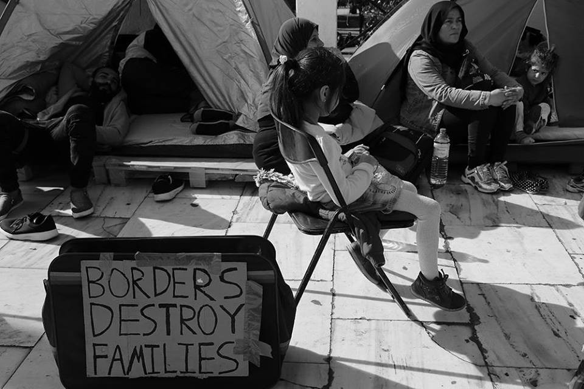
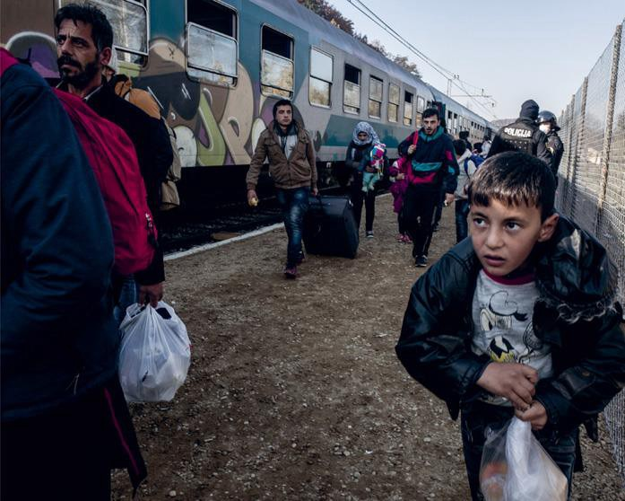
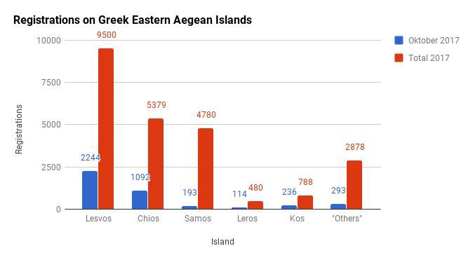
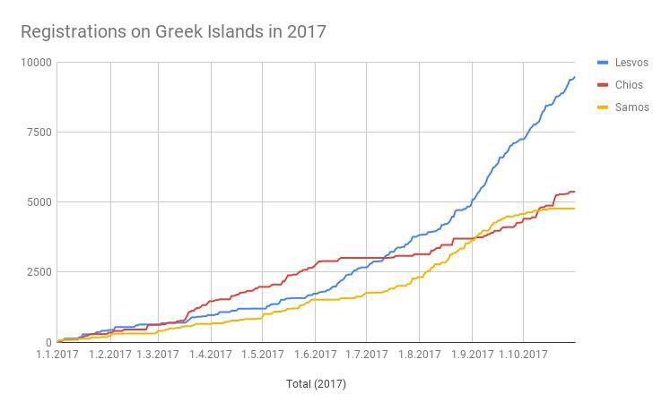
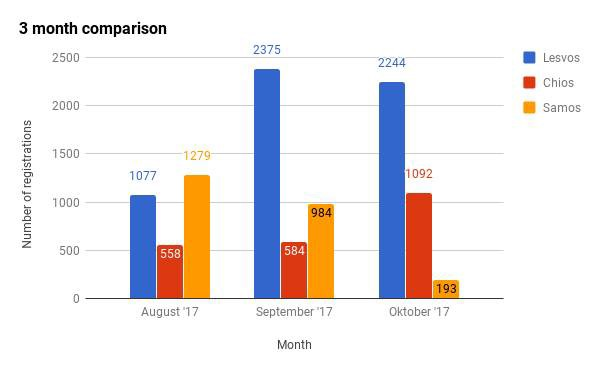
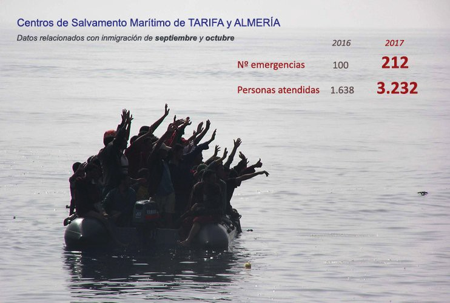

Athens: second day of the hunger strike \(Photo by Marios Lolos\)
### **AYS Daily Digest 02/11/17: LET THE CHILDREN IN\!**

_Courts of Justice rules against judicial review filed by Help Refugees in order to move on and complete the implementation of the Dubs Amendment / New figures and statistics on arrivals on Greek islands / Following Mouzalas’ claim, AYS collaborators report about cases where volunteers had to pay for family reunification tickets / News of big fights in Chios / Calls for donations and volunteers / \+1,200 people crossed the Mediterranean in last two days / And more news from Italy and Hungary…_
### **FEATURE: LET THE CHILDREN IN\!**

The Dublin III Regulation clearly states the right refugees have to family reunification, legally entitling them to join their family members in any EU country\.

But when it comes to unaccompanied children, the situation gets more complicated\.

The UK, in particular, launched a scheme in April 2016, called the Dubs Amendment, that enabled a certain number of unaccompanied minors to reach safely the country, even if they had no direct family link there\. The potential number of vulnerable children included in the Dubs Amendment was set to 3,000 \(even though this goal was not included in the law\) and many MPs and members of the public thought the government would have worked to reach a number of minors close to that\.

The reality was different: the Home Office guaranteed to take in safely 480 vulnerable minors \(with the original number set at 350, and only increased after public pressure\) \. After one year and a half, only around 200 children have been transferred from Calais, and even those just in 2016\.

\(Photo by Help Refugees\)

Since then, the program has come to a complete stop, which means that over 200 places are still available for vulnerable children\. The Home Office and the government have so far failed to follow through with their promises since\.

In June 2017, Help Refugees launched a judicial review of the management by the Home Office in order to push the authorities to implement the Amendment\. This morning, the Courts of Justice ruled against the review, prolonging, in fact, the suffering of minors in need across Europe\. Help Refugees appealed the decision and has now launched a petition that you can join [here](https://www.facebook.com/HelpRefugeesUK/posts/513856375641707) , in order to put pressure on the authorities to fulfil their obligations\.

> “1\. We stated that there had been no proper consultation with local authorities to assess how many places were available to accommodate the children\. The divisional court said: ‘There is nothing in this which can show that the consultation process or the consideration of the results was unlawful’\. 

> 2\. The Home Office had failed to move with the necessary speed\. In a year and a half the government has only transferred around 245 children, all children who formerly resided in the Jungle Camp in Calais\. There are still over 200 places available\. The court said: ‘We are not prepared to hold that arrangements have not been made as soon as possible for this is not something within the control of the UK Government’\. 

> 3\. We also argued that children considered for relocation had been denied fundamental procedural safeguards\. Children were notified orally whether they were entitled to relocation or not and were given no reasons for refusal\. The Court accepted the Home Office’s argument that ‘the process of deciding who should be transferred was not one to which normal considerations of procedural fairness could realistically apply’\.” 

The NGO also reported that at least four children died in Calais awaiting to be reunited with their families in the UK, before the Amendment came into force\. We cannot allow this to happen again, we cannot allow that in a “civilized” Europe, minors are forced to sleep in tents in freezing temperatures, without proper food, adequate hygienic conditions, or access to education\.

It’s time to act now\!
### **GREECE**
#### Recent arrivals and latest news

Migration Minister Mouzalas [expressed his concern](http://www.ekathimerini.com/222879/article/ekathimerini/news/concern-over-spike-of-200-percent-in-migrant-arrivals) about the rise of arrivals on the Greek coasts and ties it to the difficulties the country is facing to manage the migration problem\. He states that, since August, the number of people reaching the shores has increased by over 200% compared to the same period last year\.

Below are detailed figures and statistics regarding registrations and arrivals on the Greek islands in the month of October\. Credit for the figures goes to Tommy Olsen and AYS\.

4,172 new registrations were reported in October\. In total, on all of the Greek islands, 112 boats arrived in October, carrying a total of 4,116 people\.
#### **Arrivals on Lesvos**

October: 48 boats arrived with a total of 2,264 people: 899 children, 528 women, and 833 men\. The average number to arrive per boat is 47 people\.

September: 55 boats arrived with a total of 2,366 people\. The number of people is down 4\.3% from September, with the number of boats down 12\.7%\. The number of people per boat is up 9\.3%, from 43 to 47 people\.

Total, official arrivals on the island have increased by 21\.9%, from 6,402 people at the end of September, to 7,803 people by the end of October\. This is a drastic increase and the poor effort on transporting more people to the mainland has obviously been a spectacular failure\.
#### Arrivals on Samos

October: Four boats arrived with a total of 193 people: 68 children, 47 women, and 78 men\. The average number of arrivals per boat is 48 people\.

September: 19 boats arrived with a total of 987 people\. This is down 80\.5% from September\.

The total, official number on the island is 2,419 people\. This is down 18\.7% from the end September when the total number on the islands was 2,977 people\.
#### Arrivals on Chios

October: 20 boats arrived with a total of 1,016 people: 361 children, 248 women and 400 men\. Average per boat is 51 people\.

September:16 boats, with a total of 638 people\. A big increase on people arriving, 59\.2% compared to September\. Number of boats is up 33\.3%\.

Total official numbers on the island have increased by 34\.1%, from 1,634 people in end September, to 2191 people in the end of October\. The closing of Vial did not help the situation on Chios, it has gone from bad to worse\.
#### Arrivals on Kos and other islands

October: 10 boats, with a total of 236 people\.

September:11 boats, with a total of 233 people\.

Total official numbers on the island stand at 1,160 people\.

In October, the other islands \(Rhodes, Leros, Tilos etc\. \) have received 12 boats, with a total of 407 people\. In September, they had 17 boats, with a total of 402 people\.

In October, the Turkish Coast Guard \(TCG\) has stopped 67 boats on their way to the Greek islands, with a total of 2,931 people\. In September, they stopped 75 boats, with a total of 3,408 people\.

Last month, four big rubber boats were stopped by the TCG, all on their way to Chios\. Normally a “dingy” carries between 45–75 people and, with 75, its packed\. Last week, a rubber boat with 109 people was stopped\. The other three other boats held 98, 94, and 94 people\. All the dinghies started out from the same area\. It’s perhaps just a matter of time before we see the same type of boats head towards other islands and it is, indeed, a reason for concern\.

59 people have, also, been deported to Turkey\.

Following what AYS [reported](ays-daily-digest-01-11-17-hunger-strike-take-us-to-our-families-f91142e70ff0) yesterday, concerning Mouzalas’ claim, we have collected evidence from one of our collaborators \( _ndr:_ this particular event happened at the beginning of 2017\) \.

> “What I know is that technically, tickets have to be paid for within 6 months — and the timeframe is most often pushed to the upper limit\. Refugees, who either have money, or who know volunteers willing to pay for or fundraise for tickets, are able to buy the tickets privately and to leave much sooner\. This can only be done through Himalaya Travel in Athens, however\. Himalaya is the only travel agency which is \(electronically\) connected with GAS and authorized to sell tickets for family reunification\. In addition, these tickets have to be bought on Aegean Airlines \(in very rare cases other airlines are used\. \) Even when dramatically cheaper fares are available, Himalaya only books expensive flexible tickets\. I accompanied a family of 7 to buy tickets\. Two were infants; tickets, as I remember, were about 20€ each for each infant\. I had mileage for the remaining 5 people, 4 of whom were under 18\. It took me three trips to Himalaya and huge amounts of arguing to get them to allow me to book two tickets on miles\. While booking at the last minute, I insisted again that three tickets be mileage award tickets\. At that point they agreed, but the price of the remaining two tickets suddenly shot up\. So in the end I paid for two very expensive one\-way tickets, two infants & 3 with miles\.” 

This is the mother on the day we finally got the tickets, at Himalaya Travel\. The family was a mother, four teenagers, and two infant boys of their oldest \(17\-year old\) daughter\. The father \(ie\. grandfather of two boys\) was in Germany\. The husband of the oldest daughter remained in Syria at the time\. Credit: AYS
#### _Lesvos_

Today, the President of the Administrative Court of Mytilene [ordered](http://www.immigration.gr/2017/11/blog-post.html?m=1) the release of three Syrians, detained upon arrival, after objections against detention \(legal remedy\) were filed by our legal team in Lesvos\.

The three Syrians \(young single males\) were detained upon arrival in the Pre\- removal Centre \(Section B\) in Moria despite the fact that they expressed their intention to apply for asylum and subsequently submitted their asylum applications\. These are the first cases of detention of Syrians upon arrival \(at least in Lesvos\) as per the new practice being implemented\.

For the first case, the basis of the detention was “to determine or verify his identity or nationality \(Art\. 46 \(2\) \(a\) \) N\. 4375/2016 and Article 8 \(3\) \(a\) of Directive 2013/33/EU\.” However, the applicant had a passport, which he had already submitted to the authorities during the reception and identification procedures\. The judge accepted the objections filed by HIAS and accepted that since the authorities had not questioned the authenticity of the passport, the identity of the applicant is proven and, therefore, the detention decision lacks foundation\.

For the second and third cases, the basis of the detention was “that there are reasonable grounds to believe that he is making the application for international protection merely in order to delay or frustrate the enforcement of the return decision \(Art\. 46 \(2\)© N\. 4375/2016 and Article 8 \(3\) \(d\) of Directive 2013/33/EU\) \.” The judge accepted the objections filed by HIAS in both cases and found lack of reason in the detention decision, as the reasonable grounds to believe that he is making the application for international protection merely in order to delay or frustrate the enforcement of the return decision were not properly and objectively substantiated\.

Meanwhile, the Sappho Square [demonstration](https://www.facebook.com/LesvosLegal/posts/1628239103881463?hc_location=ufi) is still ongoing\.

#### _Chios_

Worrying news concerning big fights recently erupting came out of Chios this morning\. The fights broke out in Vial between Syrian and Afghan residents and all the staff had to be [evacuated](http://www.politischios.gr/horia/ekkenothike-apo-ypalliloys-i-bial) by 11 AM\. The police presence was remarkable and apparently nine people \(including minors\) were [arrested](http://astraparis.gr/kleftopolemos-stin-vial-se-pliri-etoimotita-i-astinomia/) , although this last piece of information remains a rumour to be confirmed\.

Other sources [reported](http://www.alithia.gr/roi-eidiseon/roi-eidiseon-211-1301) that the situation was calmer in the afternoon\.

■■■■■■■■■■■■■■ 
> **[RSA](https://twitter.com/rspaegean) @ Twitter Says:** 

> > #Chios second day fights between Syrians and Afghans, RIC evacuated from staff members , riot police everywhere. 

> **Tweeted at [2017-11-02 10:59:55](https://twitter.com/rspaegean/status/926041172430213120).** 

■■■■■■■■■■■■■■ 

#### _Mainland_

In Athens, the hunger strike continues to speed up family reunification processes\. Today, the 14 refugees protesting have organized a [press conference](http://hungerstrike.commonstruggle.eu/press-conference-refugee-hunger-strikers-family-reunification/) , where they had the chance to tell their stories of despair and suffering after fleeing their war\-torn country and seeing their families separated and dismantled in front of Fortress Europe\.

#### Call for donations

Please see a [list of needs](https://www.facebook.com/groups/PAMPIRAIKI/permalink/545405012470274/?hc_location=ufi) for Ellinikon Warehouse in Athens\.

> _“They distribute dry foods and essential non\-food items to more than 5000 people in shelters, squats, day centres, private apartments\. They also send much needed items to camps further outside Athens and to the warehouses on the Islands\.”_ 

#### Call for volunteers

[Volunteers](https://www.facebook.com/northerngreecevolunteers/posts/1506949512728335?hc_location=ufi) are needed this winter, please consider helping out\!

Also, the [Schoolbox Project](https://www.schoolboxproject.org) is in need of helpers for their programs\. They’re particularly looking for one\-on\-one volunteers for their courses\.
### **HUNGARY**

As MigSzol [reports](https://www.facebook.com/migszolcsoport/posts/1591163364268151) , the trail for Ahmed H\. continued today and again the man was accused of terrorism\. He will be jailed with no formal charge for at least another 3 months, as the [trial](https://twitter.com/todorgardos/status/926098863559270400) will continue in January 2018, awaiting a response for a crime he did not commit\.

What is interesting is that some members of the police force, who have been heard in court today, [stated](https://twitter.com/demeteraaron/status/926085862932254721) that Ahmed was acting as a mediator and trying to make peace between the parts\.

■■■■■■■■■■■■■■ 
> **[Todor Gardos](https://twitter.com/TodorGardos) @ Twitter Says:** 

> > Police testimony read out now effectively confirms #AhmedH was 1) calling for calm 2) not leading crowd that turned violent. Crucial details 

> **Tweeted at [2017-11-02 09:07:54](https://twitter.com/todorgardos/status/926012984253714433).** 

■■■■■■■■■■■■■■ 

For how long will this man be under the flashlight, having to defend himself from clearly empty accusations?

### **SEA**

Sea\-Watch 3 is to sail the Mediterranean for the first time, in support of life\-saving missions, after more than 1,200 people were [rescued](https://twitter.com/fladig/status/926092114223620096) in the past two days and 48 more people [intercepted](https://twitter.com/sarwatchmed/status/926100060215169025) today by Frontex \(among them, one considered a smuggler\) \.

■■■■■■■■■■■■■■ 
> **[SARwatchMED](https://twitter.com/SARwatchMED) @ Twitter Says:** 

> > Former #DignityI #SAR vessel (@[MSF_Sea](https://twitter.com/MSF_Sea)) returns to the Central Mediterranean as #SeaWatch3 operated by @[seawatchcrew](https://twitter.com/seawatchcrew) [sea-watch.org/en/sea-watch-3…](https://sea-watch.org/en/sea-watch-3-sets-sails-for-first-mission/) https://t.co/u57MdGDJAp 

> **Tweeted at [2017-11-02 16:13:59](https://twitter.com/sarwatchmed/status/926120213103415297).** 

■■■■■■■■■■■■■■ 

Unfortunately, a number of people are still missing and feared drowned\.

■■■■■■■■■■■■■■ 
> **[MSF Sea](https://twitter.com/MSF_Sea) @ Twitter Says:** 

> > UPDATE: 588 people safely onboard #Aquarius, unknown number missing presumed drowned in #Mediterranean after series of rescues yesterday. https://t.co/0XEKkC7vt6 

> **Tweeted at [2017-11-02 14:34:18](https://twitter.com/msf_sea/status/926095125905858560).** 

■■■■■■■■■■■■■■ 

Salvamento Marítimo is constantly carrying on search and rescue missions and, between September and October, 3,232 people were assisted in 212 emergencies situations\.

\(Figure by Salvamento Marítimo\)

Other good news coming from SOS Mediterranee\. The NGO has carried on four [rescue operations](https://www.facebook.com/sosmedfrance/posts/2039254806347500?hc_location=ufi) in 18 hours, including three consecutive rescues, and one involving a sinking boat\. One man was saved from drowning and revived by teams and the 588 survivors landed safely in the port of Vibo Valentia in the morning\.

This is the face of solidarity and humanity that we much appreciate\.
### **ITALY**
#### Arrivals and latest news

In the first 10 months of the year, arrivals to Italy decreased by 30%, [according to the Interior Ministry](http://www.infomigrants.net/en/post/5897/migrant-arrivals-to-italy-decrease-30-percent-in-past-10-months) , if compared to the same period of 2016 \(111,397 in 2017 to 159,427 in 2016\) \. In October alone, the reports said the number of landings declined by the 78%\.

However, even if the total number of arrivals has decreased, deadly incidents are still happening: seven bodies have been found on a dinghy from North Africa to Italy\. They have been discovered during a Eunavformed operation\.

Most of the asylum seekers in Italy obtain it at the first request and, among the ones being denied, more than half win the appeal\.According to the Ministry’s data, [acquired](http://www.lastampa.it/2017/11/01/esteri/i-migranti-vincono-i-ricorsi-per-lasilo-UEJAnLkuXlnsNK6LjMCjCN/pagina.html) by La Stampa through civic access, between 2010 and 2016 the foreigners requesting asylum have been 364,469\.

The requests are initially evaluated by the territorial commissions\. Interviews to the applicants are combined with the situation in their country of origin, leading the commission to decide about the migrants’ requests\. The applicants can obtain: the status of refugee, in case of grounded fear of persecution for race, religion, nationality, social group belonging or political ideas in their country; the subsidiary protection, when those conditions do not present, but the migrant would be in danger of a serious damage in case of repatriation; the humanitarian protection, when there are serious humanitarian reasons or coming from the State’s constitutional duties\. In the first two cases, the stay permit is five years long\. In the last case, usually two\. It is always renewable\.

Of the 364,469 requests, almost 40% passed the first time, 35% were been rejected, and the rest were still pending\. Moreover, out of that 35%, 67,671 people have made an appeal; 30,754 have been sentenced and, out of these, 53\.17% of them saw the applicants winning\.

How come more than half of the decided cases are flipped? There are many reasons, but according to the associations and the lawyers dealing with migration, the issue is that the territorial commissions are very strict in releasing asylum, mirroring the pressures made by the politics in the latest years\. The dates of the Ministry of Interiors offer more data\. From 1990, the percentages of the migrants’ provenance countries have not differed that much, however the commissions have become stricter, and not because the conditions in those countries have ended\. Neither the formation of new territorial commissions can be a cause, since the members are prepared professionals\. Hence, something changed\.
### **GENERAL**

The ECRE has released an interesting analysis on the EU proposal of expanding the concept of “safe third country\.” See it with the link below\.

■■■■■■■■■■■■■■ 
> **[ECRE](https://twitter.com/ecre) @ Twitter Says:** 

> > Out now: #PolicyNote "Debunking the 'Safe Third Country' Myth"- #ECRE's concerns abt expanded use of the concept, [bit.ly/2iUuuqu](http://bit.ly/2iUuuqu) https://t.co/4jcdDk8vmb 

> **Tweeted at [2017-11-02 12:27:35](https://twitter.com/ecre/status/926063237690544129).** 

■■■■■■■■■■■■■■ 

> **_We strive to echo correct news from the ground through collaboration and fairness, so let us know if something you read here isn’t right\._** 

> **_If there’s anything you want to share, contact us on Facebook or write to: areyousyrious@gmail\.com\._** 

_Converted [Medium Post](https://areyousyrious.medium.com/ays-daily-digest-02-11-2017-let-the-children-in-876a7fc98e43) by [ZMediumToMarkdown](https://github.com/ZhgChgLi/ZMediumToMarkdown)._
